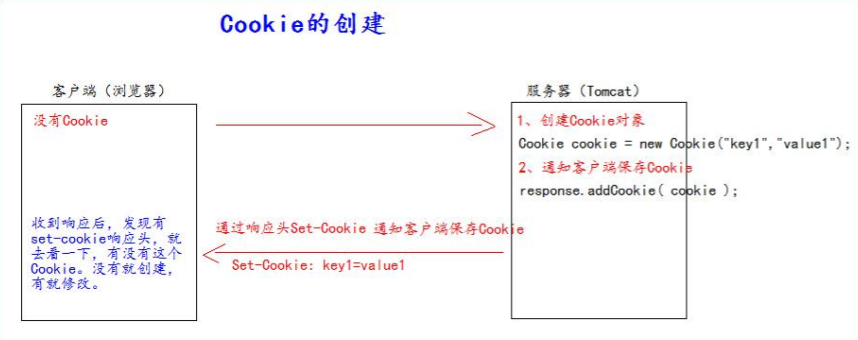
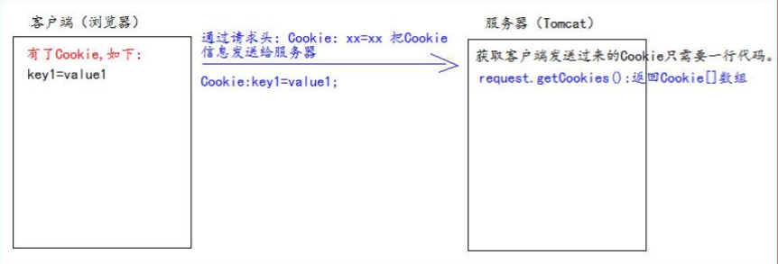
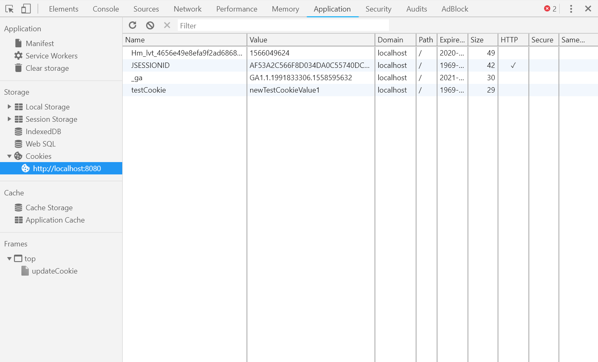
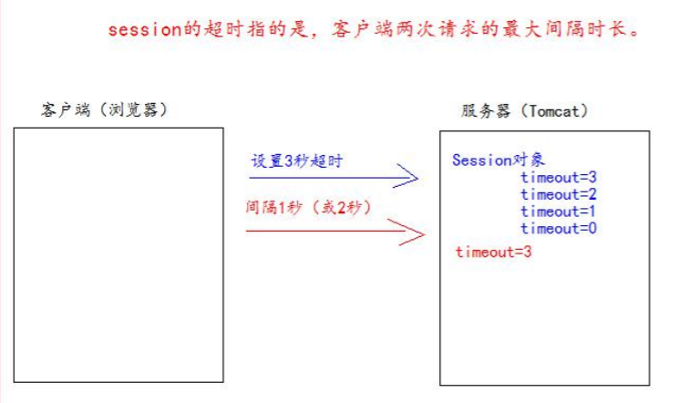
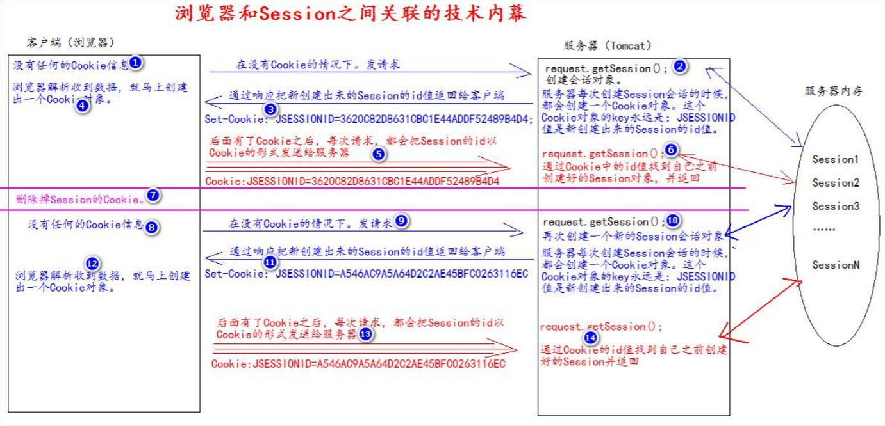

# Cookie & Session

## Cookie（饼干）

1. Cookie是服务器通知客户端保存键值对的一种技术
2. 客户端有了Cookie后，每次请求都会发送给服务器
3. 单个Cookie的大小不能超过4kb

### 创建Cookie



Servlet类的代码

```java
package top.jch.learn;

import javax.servlet.ServletException;
import javax.servlet.annotation.WebServlet;
import javax.servlet.http.Cookie;
import javax.servlet.http.HttpServlet;
import javax.servlet.http.HttpServletRequest;
import javax.servlet.http.HttpServletResponse;
import java.io.IOException;

/**
 * @author: Administrator
 * @create: 2020/07/03 21:26
 **/
@WebServlet("/cookie")
public class IndexServlet extends HttpServlet {

    @Override
    protected void doGet(HttpServletRequest req, HttpServletResponse resp) throws ServletException, IOException {
        resp.setContentType("text/html;charset=utf-8");
        Cookie cookie = new Cookie("testCookie","testCookieValue");
        resp.addCookie(cookie);
        resp.getWriter().write("<h1>测试Cookie创建&发送</h1>");
    }
}
```

### 服务器获取Cookie



CookieUtils工具类

```java
package top.jch.learn.util;

import javax.servlet.http.Cookie;

/**
 * @author: Administrator
 * @create: 2020/07/04 15:34
 **/
public class CookieUtils {

    public static Cookie findCookie(String name,Cookie[] cookies){
        if (name == null || cookies == null || cookies.length == 0){
            return null;
        }
        for (Cookie c:cookies) {
            if (name.equals(c.getName())){
                return c;
            }
        }
        return null;
    }
}
```

Servlet类的内容

```java
protected void doGet(HttpServletRequest req, HttpServletResponse resp) throws ServletException, IOException {
    resp.setContentType("text/html;charset=utf-8");
    Cookie[] cookies = req.getCookies();
    for (Cookie c: cookies) {
        resp.getWriter().write("Cookie["+c.getName()+"="+c.getValue()+"]<br/>");
    }
    Cookie getCookie = CookieUtils.findCookie("testCookie",cookies);
    if (getCookie != null){
        resp.getWriter().write("找到testCookie：" + getCookie.getValue());
    }
}
```

### 修改Cookie值

#### 方案一

1. 创建一个要修改的同名（key）的Cookie对象
2. 在构造器中同时赋予新的Cookie值
3. 调用response.addCookie(cookie)

```java
Cookie cookie = new Cookie("testCookie","newTestCookieValue");
resp.addCookie(cookie);
```

#### 方案二

1. 找到要修改的Cookie对象
2. 调用setValue()方法赋予新的Cookie值
3. 调用response.addCookie()通知客户端保存修改

```java
Cookie cookie = CookieUtils.findCookie("testCookie",req.getCookies());
if(cookie != null){
    cookie.setValue("testCookieValue1");
    resp.addCookie(cookie);
}
```

#### 浏览器查看Cookie



### Cookie生命控制

即管理Cookie什么时候销毁（删除）

setMaxAge()：

- 正数：指定秒数后过期
- 负数：浏览器关闭，删除Cookie(默认值-1)
- 零：马上删除Cookie

```java
protected void doGet(HttpServletRequest req, HttpServletResponse resp) throws ServletException, IOException {
    //设置Cookie存放时长
    Cookie cookie = new Cookie("life60","life60");
    cookie.setMaxAge(60);
    resp.addCookie(cookie);
    resp.getWriter().write(cookie.getValue());

    //马上删除Cookie
    Cookie deleteCookie = CookieUtils.findCookie("testCookie",req.getCookies());
    if (deleteCookie != null){
        deleteCookie.setMaxAge(0);
        resp.addCookie(deleteCookie);
        resp.getWriter().write("删除testCookie");
    }

    //设置默认会话级别的Cookie
    Cookie cookie1 = new Cookie("defaultLifeCookie","default");
    cookie1.setMaxAge(-1);
    resp.addCookie(cookie1);
    resp.getWriter().write(cookie1.getValue());
}
```

### Cookie有效路径Path的设置

Cookie的path属性可以设置过滤哪些Cookie可以发送给服务器，哪些不发送。

示例说明：

| Cookie  | 路径设置         | 说明                                                         |
| ------- | ---------------- | ------------------------------------------------------------ |
| CookieA | path=/工程路径   | http://ip:port/工程路径/a.html  <br>CookieA 发送<br>CookieB  不发送 |
| CookieB | path=/工程路径/b | http://ip:port/工程路径/b/a.html<br>CookieA 发送<br>CookieB 不发送 |

```
Cookie cookie = new Cookie("testPath","path");
//getContextPath()获取工程路径
cookie.setPath(req.getContextPath()+"/a"); //设置Cookie有效路径：/工程路径/a
resp.addCookie(cookie);
//注意：cookie的默认有效路径是当前工程路径
```

## Session(会话)

1. Session是一个接口（HttpSession）
2. Session即是会话。用来维护一个客户端和服务器之间关联的一种技术
3. 每个客户端都有一个自己Session会话
4. Session会话中，经常用来保存用户登录之后的信息

### 创建Session和获取SessionID

#### 创建

```java
request.getSession();
```

第一次调用时创建Session会话，之后调用都是获取的前面创建的Session对象。

#### 获取

```java
isNew();//判断是不是新建的 -true：新建	-false：旧的
```

##### 获取ID

```java
getId();//获取Session的Id
```

### Session域数据的存取

```java
@Override
protected void doGet(HttpServletRequest req, HttpServletResponse resp) throws ServletException, IOException {
    resp.setContentType("text/html;charset=utf-8");
    req.getSession().setAttribute("sessionKey","sessionValue");
    resp.getWriter().write("session存值成功！");
    resp.getWriter().write("Session的值：" + req.getSession().getAttribute("sessionKey"));
}
```

### Session生命周期控制

| 方法                                                         | 说明                                                         |
| ------------------------------------------------------------ | ------------------------------------------------------------ |
| <code>public void setMaxInactiveInterval(int interval)</code> | 设置Session超时时间(单位：秒)，超时销毁Session。正值：超时时长；负值：永不超时(极少使用) |
| <code>public int getMaxInactiveInterval()</code>             | 获取Session超时时间                                          |
| <code>public void invalidate()</code>                        | 设置当前session会话马上失效                                  |

session默认超时时长为30分钟。该默认设置在tomcat服务器的web.xml配置文件中配置：

```xml
<session-config>
	<session-timeout>30</session-timeout>
</session-config>
```

在web工程，设置默认session的超时时长，可以在web工程的配置文件web.xml中配置：

```xml
<session-config>
	<session-timeout>20</session-timeout>
</session-config>
```

设置个别session时长，则需要使用API进行设置。

session超时概念：



```java
HttpSession session = req.getSession();
//设置session超时时间 超过时间 session销毁
session.setMaxInactiveInterval(30);
//获取Session超时时间
System.out.println(session.getMaxInactiveInterval());
//使Session失效 即时
session.invalidate();
//Session默认超时时间是30分钟，在tomcat服务器的web.xml配置文件中配置   
```

### 浏览器和Session之间的关联

