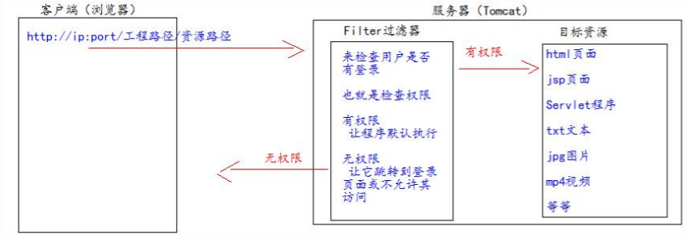
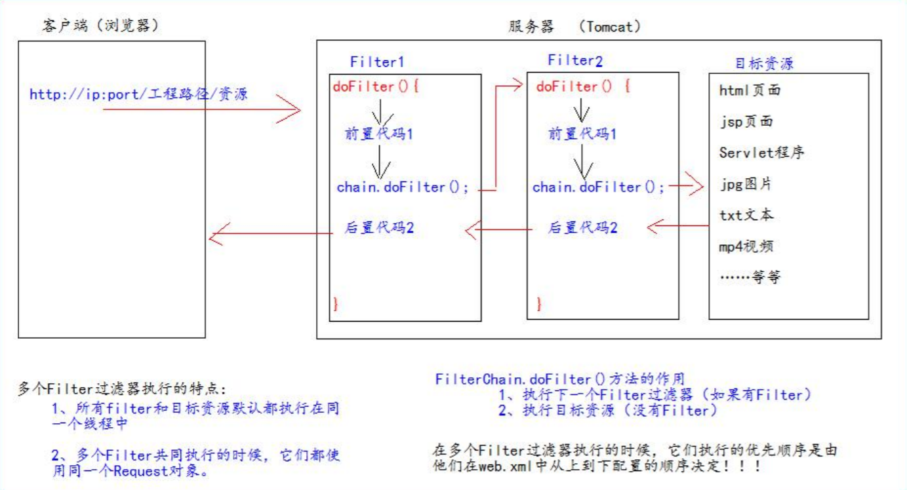
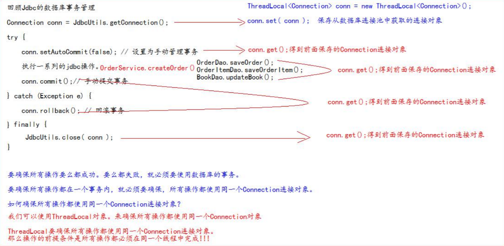
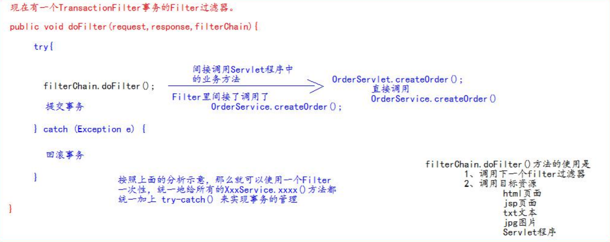

# Filter过滤器

1. JavaWeb三大组件之一。

   三大组件:

   - Servlet程序
   - Listener监听器
   - Filter过滤器

2. JavaEE的规范，即接口。

3. 作用：拦截请求，过滤响应。

应用场景：

1. 权限检查
2. 日记操作
3. 事务管理
4. .......



## 使用Filter过滤器

1. 实现Filter接口
2. 实现过滤方法doFilter()
3. 在web.xml中配置Filter的拦截路径或在实现Filter类上使用注解配置拦截路径

Filter类代码：

```java
package top.jch.learn.filter;

import javax.servlet.*;
import javax.servlet.annotation.WebFilter;
import javax.servlet.annotation.WebServlet;
import javax.servlet.http.HttpServletRequest;
import javax.servlet.http.HttpSession;
import java.io.IOException;

/**
 * @author: Administrator
 * @create: 2020/07/04 19:04
 **/
//@WebFilter(urlPatterns = "/") 注解配置拦截路径
public class LoginFilter implements Filter {

    public void init(FilterConfig filterConfig) throws ServletException {
        System.out.println("初始化Filter");
    }

    public void doFilter(ServletRequest request, ServletResponse response, FilterChain chain) throws IOException, ServletException {
        System.out.println("执行拦截！");
        HttpServletRequest req = (HttpServletRequest) request;

        HttpSession session = req.getSession();
        if (session.getAttribute("user") == null){
            req.getRequestDispatcher("/").forward(request,response);
        }else{
            //放开拦截
            chain.doFilter(request, response);
        }
    }

    public void destroy() {
        System.out.println("销毁Filter");
    }
}
```

web.xml配置

```xml
<filter>
    <filter-name>loginFilter</filter-name>
    <filter-class>top.jch.learn.filter.LoginFilter</filter-class>
</filter>
<filter-mapping>
    <filter-name>loginFilter</filter-name>
    <!--
            url-pattern 拦截路径
                / : 表示http://ip:port/工程路径
                /模块 ： 表示http://ip:port/工程路径/模块路径/*
        -->
    <url-pattern>/</url-pattern>
</filter-mapping>
```

用户登录页面

```jsp
<%@ page contentType="text/html;charset=UTF-8" language="java" %>
<html>
<head>
    <title>filter</title>
</head>
<body>
<h1>测试Filter</h1>
<form action="/login" method="post">
    用户：<input type="text" name="username" /> <br>
    密码：<input type="password" name="password" /><br>
    <input type="submit" title="登录">
</form>
</body>
</html>
```

LoginServlet

```java
package top.jch.learn;

import javax.servlet.ServletException;
import javax.servlet.annotation.WebServlet;
import javax.servlet.http.HttpServlet;
import javax.servlet.http.HttpServletRequest;
import javax.servlet.http.HttpServletResponse;
import java.io.IOException;

@WebServlet("/login")
public class LoginServlet extends HttpServlet {

    @Override
    protected void doPost(HttpServletRequest req, HttpServletResponse resp) throws ServletException, IOException {
        resp.setContentType("text/html;charset=utf-8");
        String name = req.getParameter("username");
        String pwd = req.getParameter("password");

        if ("123456".equals(pwd) && "admin".equals(name)){
            req.getSession().setAttribute("user",name);
            req.getRequestDispatcher("/success.jsp").forward(req,resp);
        }else {
            req.getRequestDispatcher("/").forward(req,resp);
        }
    }
}
```

## Filter的生命周期

1. 构造器方法创建

2. init初始化方法执行

   1、2步，在web工程启动的时候执行(Filter已经创建)

3. doFilter过滤方法

   每次拦截到请求时执行

4. destroy销毁过滤器方法

   停止web工程时执行

## FilterConfig类

Filter过滤器的配置文件类。

tomcat服务器每次创建Filter时，同时创建一个FilterConfig类，该类包含了Filter配置文件的配置信息。

### 作用：获取Filter过滤器的配置内容

1. 获取Filter的名称 → <filter-name>标签
2. 获取Filter的初始化参数 →  filter 标签内的 <init-param>标签
3. 获取ServletContext对象

Filter类的内容

```java
public void init(FilterConfig filterConfig) throws ServletException {
    System.out.println("初始化Filter");
    System.out.println("filter-name的值：" + filterConfig.getFilterName());
    System.out.println("获取初始化参数name的值：" + filterConfig.getInitParameter("name"));
    System.out.println("获取ServletContext对象："+filterConfig.getServletContext());
}
```

web.xml配置

```xml
<filter>
    <filter-name>loginFilter</filter-name>
    <filter-class>top.jch.learn.filter.LoginFilter</filter-class>
    <init-param>
        <param-name>name</param-name>
        <param-value>张三</param-value>
    </init-param>
</filter>
<filter-mapping>
    <filter-name>loginFilter</filter-name>
    <!--
            url-pattern 拦截路径
                / : 表示http://ip:port/工程路径
                /模块 ： 表示http://ip:port/工程路径/模块路径/*
     -->
    <url-pattern>/*</url-pattern>
</filter-mapping>
```

注解配置(与web.xml内关于filter配置等同)

```java
@WebFilter(urlPatterns = "/*",filterName = "long",initParams = {@WebInitParam(name = "name",value = "lia")})
public class LoginFilter implements Filter {...}
```

## FilterChain过滤器链



## Filter的拦截路径

### 精确匹配

```xml
<url-pattern>/test.jsp</url-pattern>
```

请求路径地址必须为：http://ip:port/工程路径/test.jsp   才能拦截到

### 目录匹配

```xml
<url-pattern>/page/*</url-pattern>
```

请求地址必须为：http://ip:port/工程路径/admin/* 才能拦截到 (*统配符)

### 后缀名匹配

```xml
<url-pattern>*.html</url-pattern>
<url-pattern>*.do</url-pattern>
<url-pattern>*.action</url-pattern>
```

请求资源到特定后缀名时才能进入拦截器。

> 注意：Filter拦截器只关心请求的地址是否匹配，不关心请求的资源是否存在。

# ThreadLocal的使用

作用：解决多线程的数据安全问题。

ThreadLocal可以给当前线程关联一个数据（普通变量、对象、数组、集合）。

ThreadLocal的特点：

1. 为当前线程关联一个数据（可以像Map一样存取数据，key为当前线程）
2. 每一个ThreadLocal对象，只能为当前线程关联一个数据，若要为当前线线程关联多个数据，就需要使用多个ThreadLocal对象实例。
3. 每个ThreadLocal对象实例定义时，一般是static类型。
4. ThreadLocal中保存数据，在线程销毁后，由JVM虚拟机自动释放。

```java
import java.util.Random;

public class ThreadLocalTest {

    public static ThreadLocal<Object> threadLocal = new ThreadLocal<Object>();

    private static Random random = new Random();

    public static class Task implements Runnable{
        public void run() {
            //随机生成一个变量(线程要关联的数据)
            Integer i = random.nextInt(1000);
            //获取当前线程名
            String name = Thread.currentThread().getName();
            System.out.println("线程["+name+"]关联的随机数为：" + i);
            //随机数i放入ThreadLocal
            threadLocal.set(i);
            try {
                i=i+1;
                System.out.println(i);
                Thread.sleep(200);
            } catch (InterruptedException e) {
                e.printStackTrace();
            }
            System.out.println(new String("123").toString());

            Object o = threadLocal.get();
            System.out.println("线程["+name+"]快结束时取出关联的数据是：" + o);
        }
    }

    public static void main(String[] args) {
        for (int i = 0; i < 3; i++) {
            new Thread(new Task()).start();
        }
    }
}
```

### 使用Filter和ThreadLocal组合管理事务

#### 使用ThreadLocal来确保所有dao操作在同一个Connection连接对象中完成



JdbcUtils.java

```java
import com.alibaba.druid.pool.DruidDataSource;
import com.alibaba.druid.pool.DruidDataSourceFactory;

import java.io.InputStream;
import java.sql.Connection;
import java.sql.SQLException;
import java.util.Properties;

public class JdbcUtils {

    private static DruidDataSource dataSource;
    private static ThreadLocal<Connection> conns = new ThreadLocal<Connection>();

    static {
        try {
            Properties properties = new Properties();
            // 读取 jdbc.properties属性配置文件
            InputStream inputStream = JdbcUtils.class.getClassLoader().getResourceAsStream("jdbc.properties");
            // 从流中加载数据
            properties.load(inputStream);
            // 创建 数据库连接 池
            dataSource = (DruidDataSource) DruidDataSourceFactory.createDataSource(properties);

        } catch (Exception e) {
            e.printStackTrace();
        }

    }

    /**
     * 获取数据库连接池中的连接
     * @return 如果返回null,说明获取连接失败<br/>有值就是获取连接成功
     */
    public static Connection getConnection(){
        Connection conn = conns.get();
        if (conn == null) {
            try {
                conn = dataSource.getConnection();//从数据库连接池中获取连接
                conns.set(conn); // 保存到ThreadLocal对象中，供后面的jdbc操作使用
                conn.setAutoCommit(false); // 设置为手动管理事务
            } catch (SQLException e) {
                e.printStackTrace();
            }
        }
        return conn;
    }

    /**
     * 提交事务，并关闭释放连接
     */
    public static void commitAndClose(){
        Connection connection = conns.get();
        if (connection != null) { // 如果不等于null，说明 之前使用过连接，操作过数据库
            try {
                connection.commit(); // 提交 事务
            } catch (SQLException e) {
                e.printStackTrace();
            } finally {
                try {
                    connection.close(); // 关闭连接，资源资源
                } catch (SQLException e) {
                    e.printStackTrace();
                }
            }
        }
        // 一定要执行remove操作，否则就会出错。（因为Tomcat服务器底层使用了线程池技术）
        conns.remove();
    }

    /**
     * 回滚事务，并关闭释放连接
     */
    public static void rollbackAndClose(){
        Connection connection = conns.get();
        if (connection != null) { // 如果不等于null，说明 之前使用过连接，操作过数据库
            try {
                connection.rollback();//回滚事务
            } catch (SQLException e) {
                e.printStackTrace();
            } finally {
                try {
                    connection.close(); // 关闭连接，资源资源
                } catch (SQLException e) {
                    e.printStackTrace();
                }
            }
        }
        // 一定要执行remove操作，否则就会出错。（因为Tomcat服务器底层使用了线程池技术）
        conns.remove();
    }


    /**
     * 关闭连接，放回数据库连接池
     * @param conn

    public static void close(Connection conn){
        if (conn != null) {
            try {
                conn.close();
            } catch (SQLException e) {
                e.printStackTrace();
            }
        }
    } */

}
```

BaseDao.java

```java
import com.test.utils.JdbcUtils;
import org.apache.commons.dbutils.QueryRunner;
import org.apache.commons.dbutils.handlers.BeanHandler;
import org.apache.commons.dbutils.handlers.BeanListHandler;
import org.apache.commons.dbutils.handlers.ScalarHandler;

import java.sql.Connection;
import java.sql.SQLException;
import java.util.List;

public abstract class BaseDao {

    //使用DbUtils操作数据库
    private QueryRunner queryRunner = new QueryRunner();

    /**
     * update() 方法用来执行：Insert\Update\Delete语句
     *
     * @return 如果返回-1,说明执行失败<br/>返回其他表示影响的行数
     */
    public int update(String sql, Object... args) {

        System.out.println(" BaseDao 程序在[" +Thread.currentThread().getName() + "]中");

        Connection connection = JdbcUtils.getConnection();
        try {
            return queryRunner.update(connection, sql, args);
        } catch (SQLException e) {
            e.printStackTrace();
            throw new RuntimeException(e);
        }
    }

    /**
     * 查询返回一个javaBean的sql语句
     *
     * @param type 返回的对象类型
     * @param sql  执行的sql语句
     * @param args sql对应的参数值
     * @param <T>  返回的类型的泛型
     * @return
     */
    public <T> T queryForOne(Class<T> type, String sql, Object... args) {
        Connection con = JdbcUtils.getConnection();
        try {
            return queryRunner.query(con, sql, new BeanHandler<T>(type), args);
        } catch (SQLException e) {
            e.printStackTrace();
            throw new RuntimeException(e);
        }
    }

    /**
     * 查询返回多个javaBean的sql语句
     *
     * @param type 返回的对象类型
     * @param sql  执行的sql语句
     * @param args sql对应的参数值
     * @param <T>  返回的类型的泛型
     * @return
     */
    public <T> List<T> queryForList(Class<T> type, String sql, Object... args) {
        Connection con = JdbcUtils.getConnection();
        try {
            return queryRunner.query(con, sql, new BeanListHandler<T>(type), args);
        } catch (SQLException e) {
            e.printStackTrace();
            throw new RuntimeException(e);
        }
    }

    /**
     * 执行返回一行一列的sql语句
     * @param sql   执行的sql语句
     * @param args  sql对应的参数值
     * @return
     */
    public Object queryForSingleValue(String sql, Object... args){

        Connection conn = JdbcUtils.getConnection();

        try {
            return queryRunner.query(conn, sql, new ScalarHandler(), args);
        } catch (SQLException e) {
            e.printStackTrace();
            throw new RuntimeException(e);
        }

    }

}
```

#### 使用Filter过滤器统一给所有的Service方法都加上一个try-catch来进行实现错误管理



```java
public class TransactionFilter implements Filter {
    @Override
    public void doFilter(ServletRequest servletRequest, ServletResponse servletResponse, FilterChain
    filterChain) throws IOException, ServletException {
        try {
            				filterChain.doFilter(servletRequest,servletResponse);
            JdbcUtils.commitAndClose();// 提交事务
        } catch (Exception e) {
            JdbcUtils.rollbackAndClose();//回滚事务
            e.printStackTrace();
        }
    }
}
```

web.xml中的配置

```xml
<filter>
    <filter-name>TransactionFilter</filter-name>
    <filter-class>com.test.filter.TransactionFilter</filter-class>
</filter>
<filter-mapping>
    <filter-name>TransactionFilter</filter-name>
    <!-- /* 表示当前工程下所有请求 -->
    <url-pattern>/*</url-pattern>
</filter-mapping>
```

BaseServlet中异常外抛给Filter过滤器

```java
public abstract class BaseServlet extends HttpServlet {
    @Override
    protected void doGet(HttpServletRequest req, HttpServletResponse resp) throws ServletException,
    IOException {
    	doPost(req, resp);
    }
    protected void doPost(HttpServletRequest req, HttpServletResponse resp) throws ServletException,
    IOException {
        // 解决 post 请求中文乱码问题
        // 一定要在获取请求参数之前调用才有效
        req.setCharacterEncoding("UTF-8");
        String action = req.getParameter("action");
        try {
            // 获取 action 业务鉴别字符串，获取相应的业务 方法反射对象
            Method method = this.getClass().getDeclaredMethod(action, HttpServletRequest.class,
            HttpServletResponse.class);
            // System.out.println(method);
            // 调用目标业务 方法
            method.invoke(this, req, resp);
        } catch (Exception e) {
            e.printStackTrace();
            throw new RuntimeException(e);// 把异常抛给 Filter 过滤器
        }
    }
}
```

#### 将所有异常都统一交给tomcat,由tomcat展示友好的错误信息页面

```xml
<!--error-page 标签配置，服务器出错之后，自动跳转的页面-->
<error-page>
    <!--error-code 是错误类型-->
    <error-code>500</error-code>
    <!--location 标签表示。要跳转去的页面路径-->
    <location>/pages/error/error500.jsp</location>
</error-page>
<!--error-page 标签配置，服务器出错之后，自动跳转的页面-->
<error-page>
    <!--error-code 是错误类型-->
    <error-code>404</error-code>
    <!--location 标签表示。要跳转去的页面路径-->
    <location>/pages/error/error404.jsp</location>
</error-page>
```

