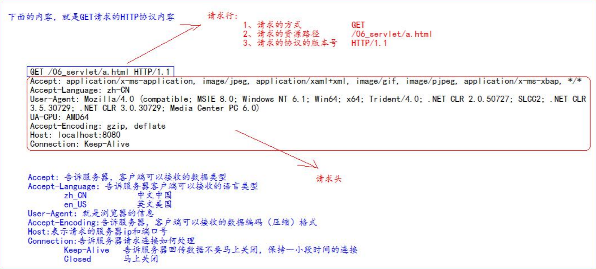
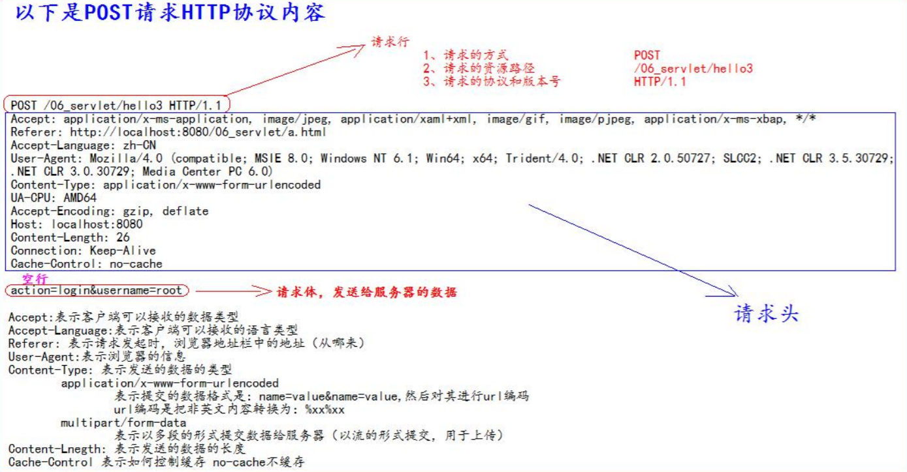
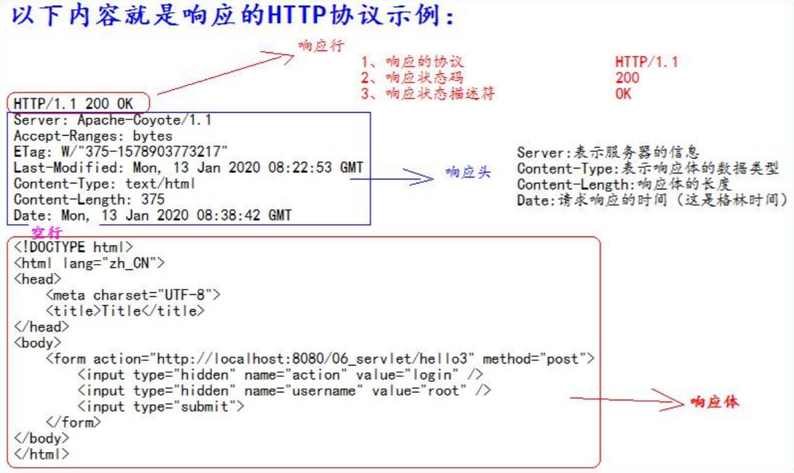
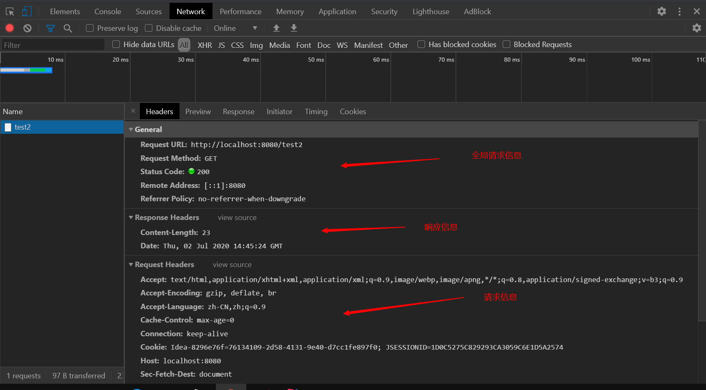

# HTTP协议

**HTTP协议：**客户端和服务器之间通信时，发送的数据，需要遵守的规则。底层通常是TCP。

**HTTP协议中的数据又叫报文。**

## HTTP协议格式

请求：客户端向服务器发送数据。

响应：服务器收到请求处理后向客户端回传数据。

请求类型有：**GET、POST**、PUT、DELETE......

GET、POST请求最常用

### GET请求

1. 请求行

   1. 请求方式：GET
   2. 请求的资源路径[+?+请求参数]
   3. 请求的协议版本号：HTTP/1.1

2. 请求头

   以  [key：value]组成不同的键值对。

### POST请求

1. 请求行

   1. 请求方式：POST
   2. 请求的资源路径
   3. 协议的版本号：HTTP/1.1

2. 请求头

   key：value	不同的请求头，有不同的含义

3. 请求体 → 发送给服务器的数据

### 常用请求头的说明

**Accept：**表示客户端可以接收的数据类型

**Accept-Languege：**表示客户端可以接收的语言类型

**User-Agent：**表示客户端浏览器的信息

**Host：**表示请求时的服务器ip和端口号

### 哪些时GET请求，哪些是POST请求

**GET请求：**

1. form标签method=get
2. a标签
3. link标签引入css
4. script标签引入js文件
5. img标签引入图片
6. iframe引入html页面
7. 在浏览器地址栏中输入地址后

**POST请求：**

form标签method=post

### 响应HTTP协议格式

1. 响应行

   1. 协议和版本号
   2. 状态码
   3. 状态描述符

2. 响应头

   key：value

3. 响应体 → 回传给客户端的数据

### 常用的响应码

| 状态码 | 解释                                         |
| ------ | -------------------------------------------- |
| 200    | 请求成功                                     |
| 302    | 请求重定向                                   |
| 404    | 资源不存在【服务器收到请求】（请求地址错误） |
| 500    | 服务器内部错误【服务器收到请求】（代码错误） |

### MIME类型说明

HTTP协议的数据类型。

MIME(Multipurpose Internet Mail Extensions) 多功能Internet邮件扩充服务。MIME类型的格式是"大类型/小类型"，并与某一种文件的扩展名相对应。

#### 常见的MIME类型

| 文件               | 文件后缀     | MIME类型                |
| ------------------ | ------------ | ----------------------- |
| 超文本标记语言文本 | .html，.htm  | text/html               |
| 普通文本           | .txt         | text/plain              |
| RTF文本            | .rtf         | application/rtf         |
| GIF图形            | .gif         | image/jpeg              |
| JPEG图形           | .jpeg,  .jpg | image/jpeg              |
| au声音文件         | .au          | audio/basic             |
| MIDI音乐文件       | .mid,.midi   | audio/midi,audio/x-midi |
| RealAudio音乐文件  | .ra,.ram     | audio/x-pn-realaudio    |
| MPEG文件           | .mpg,.mpeg   | video/mpeg              |
| AVI文件            | .avi         | video/x-msvideo         |
| GZIP文件           | .gz          | application/x-gzip      |
| TAR文件            | .tar         | application/x-tar       |

