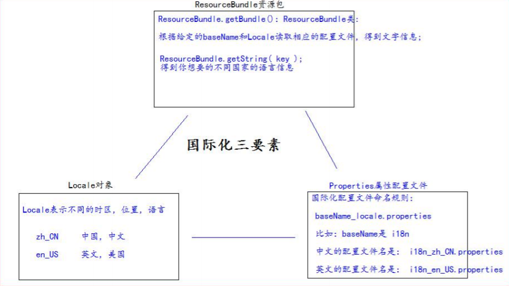

# JSON、AJAX、i18n

## JSON

**JSON**(JavaScript Object Notation) 是一种**轻量级的数据交换格式**。易于人阅读和编写，同时也易于及其解析和生成。

采用完全独立于语言的文本格式，而且很多语言都提供了对JSON的支持。使得JSON成为理想的数据交换格式。

> 注意：
>
> 轻量级指的是与xml比较。
>
> 数据交换指的是客户端和服务器之间业务数据的传递格式。

### JSON在JavaScript中使用

#### JSON的定义

JSON是由键值对组成，并由花括号包围。每个键由引号引起来，键和值之间使用冒号进行分隔，多组键值对之间进行逗号进行分隔。

```javascript
var jsonObj = {
    "k1":1,
    "k2":"k2",
    "k3":true,
    "k4":[11,"testStr",false],
    "k5":{
        "k5-1":51,
        "k5-2":"k5-2-value"
    },
    "k6":[{
        "k6-1-1":611,
        "k6-1-2":"k6-1-2-value"
    },{
        "k6-2-1":621,
        "k6-2-2":"k6-2-2-value"
    },{
        "k6-3-1":631,
        "k6-3-2":"k6-3-2"
    }]
};
```

#### JSON的访问

```javascript
alert(typeof(jsonObj)); //json是一个对象
alert(jsonObj.k1);
alert(jsonObj.k2);
alert(jsonObj.k3);
alert(jsonObj.k4);
//遍历json数组的值
for (var i = 0; i<jsonObj.k4.length;i++){
    alert(jsonObj.k4[i]);
}
alert(jsonObj.k5["k5-1"]);
alert(jsonObj.k6);
var jsonItem = jsonObj.k6[0];
alert(jsonItem["k6-1-1"]);
```

#### JSON的两个常用方法

JSON存在的形式：

1. 对象 → json对象 （操作json数据时使用）
2. 字符串 → json字符串 （服务器与客户端交换时使用）

| 方法名           | 说明                         |
| ---------------- | ---------------------------- |
| JSON.stringify() | 把json对象转换成为json字符串 |
| JSON.parse()     | 把json字符串转换成为json对象 |

```javascript
//json转字符串
var jsonStr = JSON.stringify(jsonObj);
alert(jsonStr);
//json字符转json对象
var jsonObj1 = JSON.parse(jsonStr);
alert(jsonObj1.k1)
```

### JSON在Java中的使用

引入依赖jar包：（使用google的gson包）

```xml
<dependency>
    <groupId>com.google.code.gson</groupId>
    <artifactId>gson</artifactId>
    <version>2.8.6</version>
</dependency>
```

#### JavaBean和JSON的互转

```java
@Test
public void testObjToJson(){
    Info info = new Info(1,"info 信息");
    Gson gson = new Gson();
    String jsonInfoStr = gson.toJson(info);
    System.out.println(jsonInfoStr);

    Info info1 = gson.fromJson(jsonInfoStr,Info.class);
    System.out.println(info1);
}
```

#### List和JSON的互转

```java
@Test
public void testListToJson(){
    List<Info> infos = new ArrayList<Info>();
    infos.add(new Info(1,"test1"));
    infos.add(new Info(2,"test2"));

    Gson gson = new Gson();

    String jsonInfosStr = gson.toJson(infos);
    System.out.println(jsonInfosStr);

    List<Info> list = gson.fromJson(jsonInfosStr,new InfoListType().getType());
    System.out.println(list);
    Info info = list.get(0);
    System.out.println(info);
}
class InfoListType extends TypeToken<ArrayList<Info>> {}
```

#### Map和JSON互转

```java
@Test
public void testMapToJson(){
    Map<Integer,Info> infoMap = new HashMap<Integer, Info>();
    infoMap.put(1,new Info(111,"infoMap1"));
    infoMap.put(2,new Info(222,"infoMap2"));

    Gson gson = new Gson();

    String jsonInfoMap = gson.toJson(infoMap);
    System.out.println(jsonInfoMap);

    Map<Integer,Info> integerInfoMap = gson.fromJson(jsonInfoMap,new TypeToken<HashMap<Integer,Info>>(){}.getType());
    System.out.println(integerInfoMap);
    Info info = integerInfoMap.get(1);
    System.out.println(info);
}
```

## AJAX

### AJAX请求

**AJAX**(Asynchronous JavaScript And XML) ：异步JavaScript和XML，是一种创建交互式网页应用的网页开放技术。

**ajax是一种浏览器通过js异步发起请求，局部更新页面的技术。**

**ajax请求的局部更新，浏览器地址栏不会发生变化，局部更新不会舍弃原来页面的内容。**

### 示例：原生AJAX请求

```html
<script type="text/javascript">
    function ajaxRequest(){
        var xmlHttpRequest = new XMLHttpRequest();
        xmlHttpRequest.open("GET","/json",true);
        xmlHttpRequest.onreadystatechange = function () {
            if (xmlHttpRequest.readyState === 4 && xmlHttpRequest.status === 200){
                var jsonObj = JSON.parse(xmlHttpRequest.responseText);
                document.getElementById("div").innerHTML = "ID:" + jsonObj.id +" MSG:" +jsonObj.msg;
            }
        }
        xmlHttpRequest.send();
    }
</script>
<button onclick="ajaxRequest()">ajax request</button>
<div id="div"></div>
```

## jQuery中的AJAX请求

\$.ajax方法

| 属性     | 说明                                                         |
| -------- | ------------------------------------------------------------ |
| url      | 请求地址                                                     |
| type     | 请求类型（GET、POST）                                        |
| data     | 发送给服务器的数据<br>发送数据的格式：<br>格式一：name=value&name=value<br>格式二：{key：value} |
| success  | 请求成功，响应的回调函数                                     |
| dataType | 响应的数据类型<br>常用的数据类型：<br>text：纯文本<br>xml：xml数据<br>json：json对象 |


```javascript
$("#ajaxBtn").click(function(){
    $.ajax({
        url:"http://localhost:8080/json",
        data:{action:"jQuery"},
        type:"GET",
        success:function(data){
        	$("#msg").html("ID：" + data.id + " MSG：" + data.msg);
        },
        dataType:"json"
    });
});
```

\$.get方法和\$.post方法

| 属性     | 说明                     |
| -------- | ------------------------ |
| url      | 请求地址                 |
| data     | 发送的数据（请求参数）   |
| callback | 请求成功，响应的回调函数 |
| type     | 返回的数据类型           |

```javascript
$.get("http://localhost:8080/json","action=jQueryGet",function(data){
            $("#jQueryGet").html("ID：" + data.id + " MSG：" + data.msg);
        },"json");

        $.post("http://localhost:8080/json","action=jQueryPost",function(data){
            $("#jQueryPost").html("ID：" + data.id + " MSG：" + data.msg);
        },"json");
```

\$.getJSON方法

| 属性     | 说明             |
| -------- | ---------------- |
| url      | 请求地址         |
| data     | 请求参数         |
| callback | 成功后的回调函数 |

```javacript
$.getJSON("http://localhost:8080/json","action=jQueryGetJSON",function(data){
            $("#jQueryGetJSON").html("ID：" + data.id + " MSG：" + data.msg);
        });
```

表单序列化方法serialize(),该方法可以把所有表单项的内容都获取到，并以name=value&name=value的形式进行拼接。

```java
//参数序列化
$("#submit").click(function () {
    $.getJSON("http://localhost:8080/json","action=jQuerySerialize&"+$("#form1").serialize(),function(data){
        $("#jQuerySerialize").html("ID：" + data.id + " MSG：" + data.msg);
    })
});
```

```html
<form id="form1">
    ID：  <input name="id" type="number"/><br>
    MSG： <input name="msg" type="text"/><br>
</form>
<input type="submit" id="submit" title="提交"/>
<div id="jQuerySerialize"></div>
```

## i18n国际化

国际化(Internationalization)指的是同一个网站可以支持多种不同的语言，方便不同国家，不同语言的用户访问。i18n是Internationalization的简写。(18表示中间的18个字母)



### 国际化资源properties

配置两个语言的配置文件：

 i18n_en_US.properties 英文

```properties
username=username
password=password
sex=sex
age=age
regist=regist
boy=boy
email=email
girl=girl
reset=reset
submit=submit
```

i18n_zh_CN.properties 中文

```properties
username=用户名
password=密码
sex=性别
age=年龄
regist=注册
boy=男
girl=女
email=邮箱
reset=重置
submit=提交
```

```java
public class I18nTest {
    @Test
    public void testLocale(){
        // 获取你系统默认的语言。国家信息
        // Locale locale = Locale.getDefault();
        // System.out.println(locale);
        // for (Locale availableLocale : Locale.getAvailableLocales()) {
        // System.out.println(availableLocale);
        // }
        // 获取中文，中文的常量的 Locale 对象
        System.out.println(Locale.CHINA);
        // 获取英文，美国的常量的 Locale 对象
        System.out.println(Locale.US);
    }
    
    @Test
    public void testI18n(){
        // 得到我们需要的 Locale 对象
        Locale locale = Locale.CHINA;
        // 通过指定的 basename 和 Locale 对象，读取 相应的配置文件
        ResourceBundle bundle = ResourceBundle.getBundle("i18n", locale);
        System.out.println("username：" + bundle.getString("username"));
        System.out.println("password：" + bundle.getString("password"));
        System.out.println("Sex：" + bundle.getString("sex"));
        System.out.println("age：" + bundle.getString("age"));
    }
}
```

### 通过请求头国际化页面

```jsp
<%@ page import="java.util.Locale" %>
<%@ page import="java.util.ResourceBundle" %>
<%@ page language="java" contentType="text/html; charset=UTF-8"
         pageEncoding="UTF-8"%>
<!DOCTYPE html PUBLIC "-//W3C//DTD HTML 4.01 Transitional//EN" "http://www.w3.org/TR/html4/loose.dtd">
<html>
<head>
    <meta http-equiv="pragma" content="no-cache" />
    <meta http-equiv="cache-control" content="no-cache" />
    <meta http-equiv="Expires" content="0" />
    <meta http-equiv="Content-Type" content="text/html; charset=UTF-8">
    <title>Insert title here</title>
</head>
<body>
<%
    // 从请求头中获取 Locale 信息（语言）
    Locale locale = request.getLocale();
    System.out.println(locale);
    // 获取读取包（根据 指定的 baseName 和 Locale 读取 语言信息）
    ResourceBundle i18n = ResourceBundle.getBundle("i18n", locale);
%>
<a href="">中文</a>|
<a href="">english</a>
<center>
    <h1><%=i18n.getString("regist")%></h1>
    <table>
        <form>
            <tr>
                <td><%=i18n.getString("username")%></td>
                <td><input name="username" type="text" /></td>
            </tr>
            <tr>
                <td><%=i18n.getString("password")%></td>
                <td><input type="password" /></td>
            </tr>
            <tr>
                <td><%=i18n.getString("sex")%></td>
                <td>
                    <input type="radio" /><%=i18n.getString("boy")%>
                    <input type="radio" /><%=i18n.getString("girl")%>
                </td>
            </tr>
            <tr>
                <td><%=i18n.getString("email")%></td>
                <td><input type="text" /></td>
            </tr>
            <tr>
                <td colspan="2" align="center">
                    <input type="reset" value="<%=i18n.getString("reset")%>" />&nbsp;&nbsp;
                    <input type="submit" value="<%=i18n.getString("submit")%>" /></td>
            </tr>
        </form>
    </table>
    <br /> <br /> <br /> <br />
</center>
国际化测试：
<br /> 1、访问页面，通过浏览器设置，请求头信息确定国际化语言。
<br /> 2、通过左上角，手动切换语言
</body>
</html>
```

### 通过显示的选择语言类型进行国际化

```jsp
<%@ page import="java.util.Locale" %>
<%@ page import="java.util.ResourceBundle" %>
<%@ page language="java" contentType="text/html; charset=UTF-8"
         pageEncoding="UTF-8"%>
<!DOCTYPE html PUBLIC "-//W3C//DTD HTML 4.01 Transitional//EN" "http://www.w3.org/TR/html4/loose.dtd">
<html>
<head>
    <meta http-equiv="pragma" content="no-cache" />
    <meta http-equiv="cache-control" content="no-cache" />
    <meta http-equiv="Expires" content="0" />
    <meta http-equiv="Content-Type" content="text/html; charset=UTF-8">
    <title>Insert title here</title>
</head>
<body>
<%
    // 从请求头中获取 Locale 信息（语言）
    Locale locale = null;
    String country = request.getParameter("country");
    if ("cn".equals(country)) {
        locale = Locale.CHINA;
    } else if ("usa".equals(country)) {
        locale = Locale.US;
    } else {
        locale = request.getLocale();
    }
    System.out.println(locale);
// 获取读取包（根据 指定的 baseName 和 Locale 读取 语言信息）
    ResourceBundle i18n = ResourceBundle.getBundle("i18n", locale);
%>
<a href="i18n.jsp?country=cn">中文</a>|
<a href="i18n.jsp?country=usa">english</a>
<center>
    <h1><%=i18n.getString("regist")%></h1>
    <table>
        <form>
            <tr>
                <td><%=i18n.getString("username")%></td>
                <td><input name="username" type="text" /></td>
            </tr>
            <tr>
                <td><%=i18n.getString("password")%></td>
                <td><input type="password" /></td>
            </tr>
            <tr>
                <td><%=i18n.getString("sex")%></td>
                <td>
                    <input type="radio" /><%=i18n.getString("boy")%>
                    <input type="radio" /><%=i18n.getString("girl")%>
                </td>
            </tr>
            <tr>
                <td><%=i18n.getString("email")%></td>
                <td><input type="text" /></td>
            </tr>
            <tr>
                <td colspan="2" align="center">
                    <input type="reset" value="<%=i18n.getString("reset")%>" />&nbsp;&nbsp;
                    <input type="submit" value="<%=i18n.getString("submit")%>" /></td>
            </tr>
        </form>
    </table>
    <br /> <br /> <br /> <br />
</center>
国际化测试：
<br /> 1、访问页面，通过浏览器设置，请求头信息确定国际化语言。
<br /> 2、通过左上角，手动切换语言
</body>
</html>
```

### JSTL标签库实现国际化

```jsp
<%--1 使用标签设置 Locale 信息--%>
<fmt:setLocale value="" />
<%--2 使用标签设置 baseName--%>
<fmt:setBundle basename=""/>
<%--3 输出指定 key 的国际化信息--%>
<fmt:message key="" />
```

```jsp
<%@ taglib prefix="fmt" uri="http://java.sun.com/jsp/jstl/fmt" %>
<%@ page language="java" contentType="text/html; charset=UTF-8"
         pageEncoding="UTF-8"%>
<!DOCTYPE html PUBLIC "-//W3C//DTD HTML 4.01 Transitional//EN" "http://www.w3.org/TR/html4/loose.dtd">
<html>
<head>
    <meta http-equiv="pragma" content="no-cache" />
    <meta http-equiv="cache-control" content="no-cache" />
    <meta http-equiv="Expires" content="0" />
    <meta http-equiv="Content-Type" content="text/html; charset=UTF-8">
    <title>Insert title here</title>
</head>
<body>
<%--1 使用标签设置 Locale 信息--%>
<fmt:setLocale value="${param.locale}" />
<%--2 使用标签设置 baseName--%>
<fmt:setBundle basename="i18n"/>
<a href="i18n_fmt.jsp?locale=zh_CN">中文</a>|
<a href="i18n_fmt.jsp?locale=en_US">english</a>
<center>
    <h1><fmt:message key="regist" /></h1>
    <table>
        <form>
            <tr>
                <td><fmt:message key="username" /></td>
                <td><input name="username" type="text" /></td>
            </tr>
            <tr>
                <td><fmt:message key="password" /></td>
                <td><input type="password" /></td>
            </tr>
            <tr>
                <td><fmt:message key="sex" /></td>
                <td>
                    <input type="radio" /><fmt:message key="boy" />
                    <input type="radio" /><fmt:message key="girl" />
                </td>
            </tr>
            <tr>
                <td><fmt:message key="email" /></td>
                <td><input type="text" /></td>
            </tr>
            <tr>
                <td colspan="2" align="center">
                    <input type="reset" value="<fmt:message key="reset" />" />&nbsp;&nbsp;
                    <input type="submit" value="<fmt:message key="submit" />" /></td>
            </tr>
        </form>
    </table>
    <br /> <br /> <br /> <br />
</center>
</body>
</html>
```

