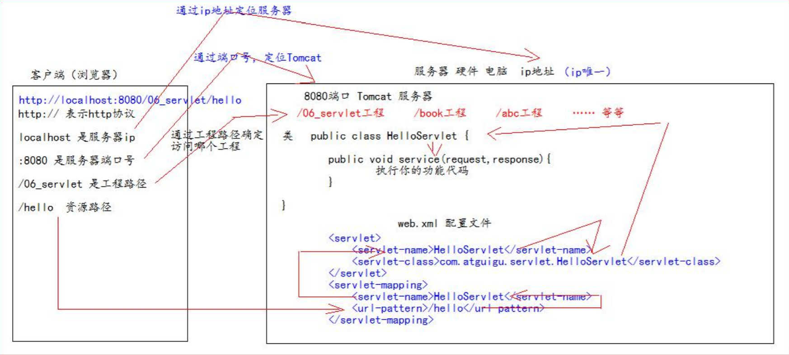
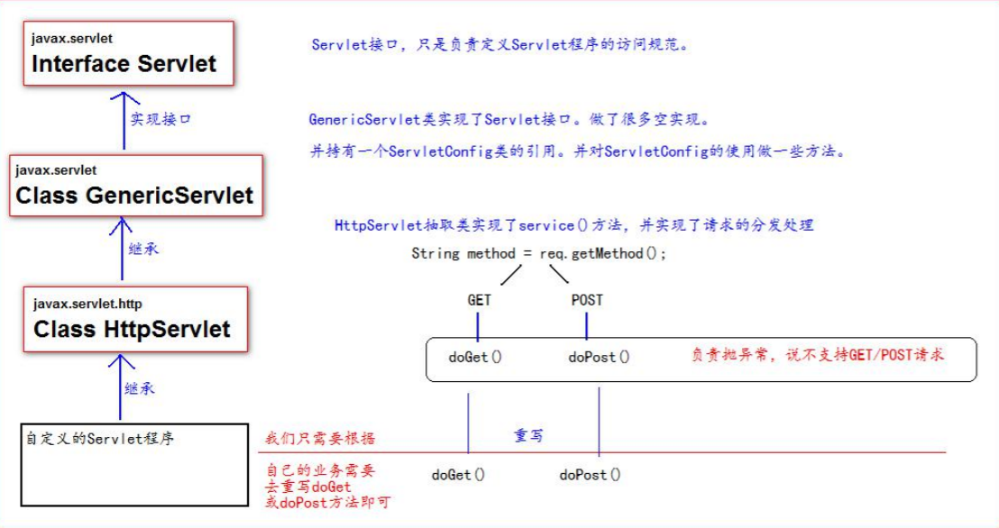
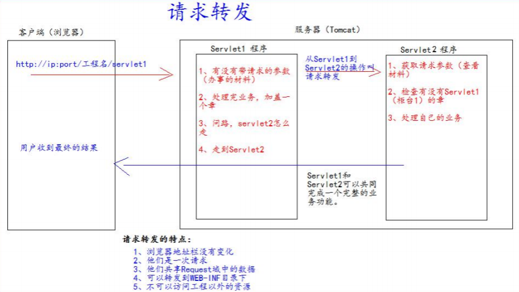
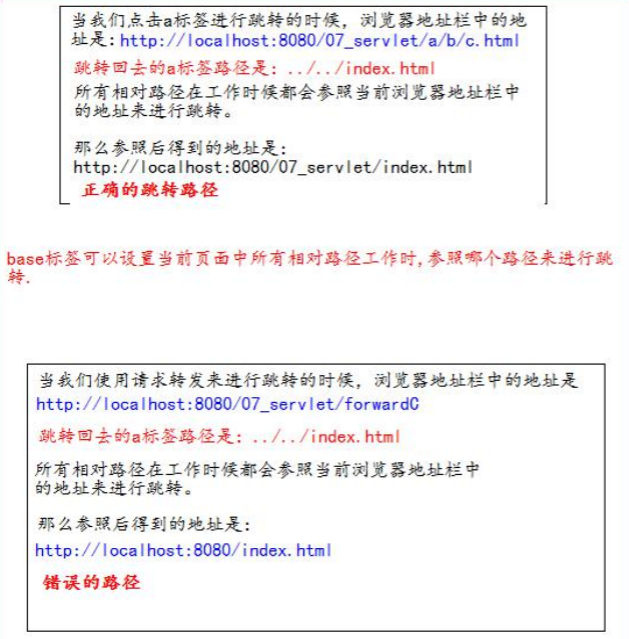
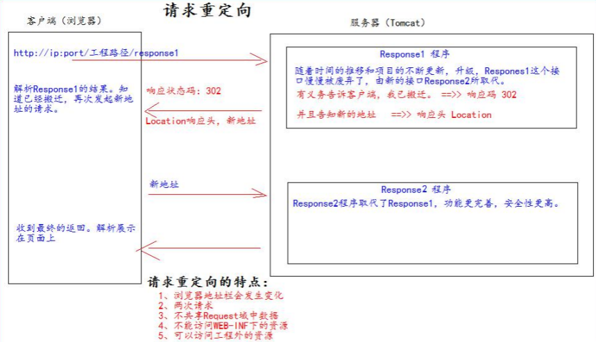

# Servlet

- Servlet是JavaEE规范之一，规范就是接口。
- Servlet是JavaWeb三大组件之一。三大组件：Servlet程序、Filter过滤器、Listener监听器。
- Servlet是运行在服务器上的一个Java小程序，可以接收客户端的请求，并响应数据给客户端。

## 实现Servlet程序

### 方式一：实现Servlet接口

```java
package top.jch.learn.other;

import javax.servlet.*;
import java.io.IOException;

/**
 * @author: Administrator
 * @create: 2020/07/02 20:00
 **/
public class TestServlet implements Servlet {
    
    public void init(ServletConfig config) throws ServletException {
        System.out.println("启动Servlet");
    }

    public ServletConfig getServletConfig() {
        return null;
    }

    public void service(ServletRequest req, ServletResponse res) throws ServletException, IOException {
        res.getWriter().print("test Servlet success");
    }

    public String getServletInfo() {
        return null;
    }

    public void destroy() {
        System.out.println("销毁servlet");
    }
}
```

配置web.xml

```xml
<?xml version="1.0" encoding="UTF-8"?>
<web-app xmlns="http://xmlns.jcp.org/xml/ns/javaee"
         xmlns:xsi="http://www.w3.org/2001/XMLSchema-instance"
         xsi:schemaLocation="http://xmlns.jcp.org/xml/ns/javaee http://xmlns.jcp.org/xml/ns/javaee/web-app_4_0.xsd"
         version="4.0">

    <servlet>
        <servlet-name>test</servlet-name>
        <servlet-class>top.jch.learn.other.TestServlet</servlet-class>
    </servlet>
    <servlet-mapping>
        <servlet-name>test</servlet-name>
        <url-pattern>/test</url-pattern>
    </servlet-mapping>

    <welcome-file-list>
        <welcome-file>index.jsp</welcome-file>
    </welcome-file-list>
</web-app>
```

使用@WebServlet注解配置访问Servlet路径

```java
package top.jch.learn.other;

import javax.servlet.*;
import javax.servlet.annotation.WebServlet;
import java.io.IOException;

/**
 * 注解配置 Servlet访问路径
* */
@WebServlet("/test1")
public class TestServlet1 implements Servlet {
    public void init(ServletConfig config) throws ServletException {
    }

    public ServletConfig getServletConfig() {
        return null;
    }

    public void service(ServletRequest req, ServletResponse res) throws ServletException, IOException {
        res.getWriter().print("test Servlet @WebServlet");
    }

    public String getServletInfo() {
        return null;
    }

    public void destroy() {
    }
}
```

> @WebServlet("/test1")
>
> 等同于web.xml配置的
>
> ```xml
> <servlet>
>         <servlet-name>test1</servlet-name>
>         <servlet-class>top.jch.learn.other.TestServlet</servlet-class>
>     </servlet>
>     <servlet-mapping>
>         <servlet-name>test1</servlet-name>
>         <url-pattern>/test1</url-pattern>
>     </servlet-mapping>
> ```

#### URL地址到Servlet程序的访问



#### Servlet的生命周期

1、执行Servlet构造器方法

2、执行init初始化方法

> 1和2是在第一次访问时，创建Servlet程序调用。

3、执行service方法

> 每次访问该Servlet都会调用该方法

4、执行destroy销毁方法

> web工程停止时调用


#### GET和POST请求的分发处理

```java
public void service(ServletRequest req, ServletResponse res) throws ServletException, IOException {
    res.getWriter().print("test Servlet @WebServlet");
    //转换为HttpServletRequest 它 getMethod方法
    HttpServletRequest hsr = (HttpServletRequest) req;
    String method = hsr.getMethod();
    if ("GET".equals(method)){
        doGet(req, res);
    }else {
        doPost(req,res);
    }
}

public void doGet(ServletRequest req,ServletResponse res) throws IOException {
    res.getWriter().print("doGet Success");
}

public void doPost(ServletRequest req,ServletResponse res) throws IOException {
    res.getWriter().print("doPost Success");
}
```

### 方式二: 继承HttpServlet实现Servlet（开发中常用）

1. 继承HttpServlet类
2. 根据业务重写doGet或doPost方法
3. 使用注解或web.xml配置访问地址

```java
package top.jch.learn;

import javax.servlet.ServletException;
import javax.servlet.http.HttpServlet;
import javax.servlet.http.HttpServletRequest;
import javax.servlet.http.HttpServletResponse;
import java.io.IOException;
import java.io.PrintWriter;

/**
 * @author: Administrator
 * @create: 2020/07/01 14:05
 **/
public class HelloServlet extends HttpServlet {

    @Override
    protected void doGet(HttpServletRequest req, HttpServletResponse resp) throws ServletException, IOException {
        String name = req.getParameter("name");
        PrintWriter pw = resp.getWriter();
        pw.write("hello " + name);
    }

    @Override
    protected void doPost(HttpServletRequest req, HttpServletResponse resp) throws ServletException, IOException {
        doGet(req, resp);
    }
}
```

方式三：继承GenericServlet

```java
package top.jch.learn.other;

import javax.servlet.GenericServlet;
import javax.servlet.ServletException;
import javax.servlet.ServletRequest;
import javax.servlet.ServletResponse;
import javax.servlet.annotation.WebServlet;
import java.io.IOException;

/**
 * @author: Administrator
 * @create: 2020/07/02 21:00
 **/
@WebServlet("/gs")
public class TestServlet2 extends GenericServlet {

    @Override
    public void service(ServletRequest req, ServletResponse res) throws ServletException, IOException {
        res.getWriter().print("GenericServlet Success");
    }
}
```

### Servlet类的继承体系



## ServletConfig类

Servlet程序的配置信息类。

Servlet程序和ServletConfig对象都是由Tomcat负责创建。

Servlet程序默认是第一次访问的时候创建，ServletConfig是每个Servlet程序创建时，创建一个对应的ServletConfig对象。

### 作用

1. 可以获取Servlet程序的别名servlet-name的值
2. 获取初始化参数init-param
3. 获取ServletContext对象

web.xml中的配置

```xml
<servlet>
    <servlet-name>test</servlet-name>
    <servlet-class>top.jch.learn.other.TestServlet</servlet-class>
    <init-param>
        <param-name>name</param-name>
        <param-value>张三</param-value>
    </init-param>
    <init-param>
        <param-name>sex</param-name>
        <param-value>女</param-value>
    </init-param>
</servlet>
<servlet-mapping>
    <servlet-name>test</servlet-name>
    <url-pattern>/test</url-pattern>
</servlet-mapping>
```

java文件

```java
public void init(ServletConfig config) throws ServletException {
    System.out.println("初始化Servlet");
    System.out.println("Servlet别名：" + config.getServletName());
    System.out.println("Servlet初始化参数：" + config.getInitParameter("name") + " " + config.getInitParameter("sex"));
}
```

> 注意：如果使用继承实现Servlet
>
> 重写init方法时里面一定要调用父类的init(ServletConfig)
>
> ```java
> @Override
> public void init(ServletConfig config) throws ServletException {
>     super.init(config);
> }
> ```

## ServletContext类

1. ServletContext是一个接口，表示Servlet上下文对象
2. 一个web工程，只有一个ServletContext对象实例
3. ServletContext对象是一个域对象
4. ServletContext是在web工程部署启动的时候创建。在web工程停止的时候销毁。

> 什么是域对象？
>
> 域对象，是可以向Map一样存取数据的对象。这里的域对象指的是存取数据的操作范围是整个web工程。
>
> |        | 存数据         | 取数据         | 删除数据          |
> | ------ | -------------- | -------------- | ----------------- |
> | Map    | put()          | get()          | remove()          |
> | 域对象 | setAttribute() | getAttribute() | removeAttribute() |

### 作用

1. 获取web.xml中配置的上下文参数对象context-param
2. 获取当前的工程路径，格式：/工程路径
3. 获取工程部署后在服务器硬盘上的绝对路径
4. 像Map一样存取数据

#### 1、2、3作用的示例

java文件内容

```java
@Override
protected void doGet(HttpServletRequest req, HttpServletResponse resp) throws ServletException, IOException {
    ServletContext sc = req.getServletContext();
    //获取web初始化参数 并输出到页面上
    resp.getWriter().print(sc.getInitParameter("web-name")+"\n");
    //获取当前工程的路径
    resp.getWriter().print(sc.getContextPath()+"\n");
    //获取当前部署路径
    resp.getWriter().print(sc.getRealPath("/"));
}
```

web.xml配置内容

```xml
<!--设置web应用初始化参数-->
<context-param>
    <param-name>web-name</param-name>
    <param-value>learn-servlet-context</param-value>
</context-param>
```

#### 像Map一样存取数据

存值的Servlet内容

```java
@Override
protected void doGet(HttpServletRequest req, HttpServletResponse resp) throws ServletException, IOException {
    //获取当前web应用的ServletContext应用
    ServletContext sc = this.getServletContext();
    //向ServletContext设置属性
    sc.setAttribute("name","张三");
}
```

取值的Servlet内容

```java
@Override
protected void doGet(HttpServletRequest req, HttpServletResponse resp) throws ServletException, IOException {
    //获取ServletContext对象
    ServletContext sc = this.getServletContext();
    String name = (String) sc.getAttribute("name");

    //页面显示ServletContext内的信息
    resp.setContentType("text/html");
    resp.setCharacterEncoding("utf-8");
    resp.getWriter().print("name:" + name);
}
```

#### 获取资源文件内容

```java
@Override
protected void doGet(HttpServletRequest req, HttpServletResponse resp) throws ServletException, IOException {
    //读取资源文件
    InputStream is = this.getServletContext().getResourceAsStream("WEB-INF/classes/info.properties");
    Properties prop = new Properties();
    prop.load(is);
    String name = prop.getProperty("name");
    int age = Integer.valueOf(prop.getProperty("age"));
    String sex = prop.getProperty("sex");
    resp.getWriter().print("name:"+name+" age:"+age+" sex:"+sex);
}
```

info.properties

```properties
name=zhansan
age=18
sex=woman
```

## HttpServletRequest类

### 作用

当请求进入tomcat服务器，tomcat服务器就会把请求的HTTP协议信息解析封装到Request对象种。而后传递到service方法(doGet和doPost)中，就可以通过HttpServletRequest对象，获取到所有请求的信息。

### 常用方法

| 方法名                  | 说明                                 |
| ----------------------- | ------------------------------------ |
| getRequestURI()         | 获取请求的资源路径                   |
| getRequestURL()         | 获取请求的同一资源定位符（绝对路径） |
| getRemoteHost()         | 获取客户端的ip地址                   |
| getHeader()             | 获取请求头                           |
| getParameter()          | 获取请求的参数                       |
| getParameterValues()    | 获取请求的参数列表                   |
| getMethod()             | 获取请求的方式类型                   |
| setAttribute(key,value) | 设置域数据                           |
| getAttribute(key)       | 获取域数据                           |
| getRequestDispatcher()  | 获取请求转发对象                     |

```java
@Override
protected void doGet(HttpServletRequest req, HttpServletResponse resp) throws ServletException, IOException {
    resp.setCharacterEncoding("gbk");
    String uri = req.getRequestURI();
    resp.getWriter().print("当前请求资源路径：" + uri +"\n");
    String url = req.getRequestURL().toString();
    resp.getWriter().print("请求的同一资源定位符：" + url+ "\n");
    String ip = req.getRemoteHost();
    resp.getWriter().print("客户端IP：" + ip+"\n");
    resp.getWriter().print("客户端端口：" + req.getRemotePort() + "\n");
    resp.getWriter().print("客户端地址：" + req.getRemoteAddr() + "\n");
    String user = req.getRemoteUser();
    resp.getWriter().print("客户端名称：" + user + "\n");
    resp.getWriter().print("请求类型：" + req.getMethod());
}
```

### 获取请求参数

jsp页面

```jsp
<%--
  Created by IntelliJ IDEA.
  User: Administrator
  Date: 2020/7/1
  Time: 15:51
  To change this template use File | Settings | File Templates.
--%>
<%@ page contentType="text/html;charset=UTF-8" language="java" %>
<html>
<head>
    <title>servlet-context</title>
</head>
<body>
<form action="/req" method="get">
    用户名：<input type="text" name="username"><br/>
    密码：<input type="password" name="password"><br/>
    兴趣爱好：<input type="checkbox" name="hobby" value="cpp">C++
    <input type="checkbox" name="hobby" value="java">Java
    <input type="checkbox" name="hobby" value="js">JavaScript<br/>
    <input type="submit">
</form>
</body>
</html>
```

java

```java
@Override
protected void doGet(HttpServletRequest req, HttpServletResponse resp) throws ServletException, IOException {
    String username = req.getParameter("username");
    String password = req.getParameter("password");
    String[] hobbies = req.getParameterValues("hobby");
    resp.getWriter().print(username + " , " + password + " ," + Arrays.toString(hobbies));
}
```

#### doGet请求的中文乱码解决

```java
String username = req.getParameter("username");
username = new String(username.getBytes("iso-8859-1"),"UTF-8");
```

#### doPost请求中的乱码问题

```java
@Override
protected void doPost(HttpServletRequest req, HttpServletResponse resp) throws ServletException, IOException {
    //设置请求体字符集
    req.setCharacterEncoding("UTF-8");
    
    String username = req.getParameter("username");
    String password = req.getParameter("password");
    String[] hobbies = req.getParameterValues("hobby");
    resp.getWriter().print(username + " , " + password + " ," + Arrays.toString(hobbies));
}
```

### 请求的转发



servlet1

```java
@Override
protected void doGet(HttpServletRequest req, HttpServletResponse resp) throws ServletException, IOException {
    //方式一：使用ServletContext进行转发
    //ServletContext sc = this.getServletContext();
    //sc.getRequestDispatcher("/inits").forward(req,resp);
    //方式二
    req.getRequestDispatcher("/inits").forward(req,resp);
}
```

servlet2

```java
@Override
protected void doGet(HttpServletRequest req, HttpServletResponse resp) throws ServletException, IOException {
    ServletContext context = this.getServletContext();
    //获取初始化参数并输出
    resp.getWriter().print(context.getInitParameter("web-name"));
    //获取当前工程路径
    System.out.println(context.getContextPath());
    //获取当前工程的绝对路径
    System.out.println(context.getRealPath("/"));
}
```

### base标签的作用



```jsp
<!DOCTYPE html>
<html lang="zh_CN">
<head>
<meta charset="UTF-8">
<title>Title</title>
<!--base 标签设置页面相对路径工作时参照的地址
href 属性就是参数的地址值
-->
<base href="http://localhost:8080/07_servlet/a/b/">
</head>
<body>
这是 a 下的 b 下的 c.html 页面<br/>
<a href="../../index.html">跳回首页</a><br/>
</body>
</html>
```

### Web中的相对路径和绝对路径

**相对路径**

```java
.	  //表示当前目录
..	  //表示上一级目录
资源名 //表示当前目录/资源名
```

**绝对路径**

```java
http://ip:port/工程路径/资源路径
```

### web中“/”斜杠的不同意义

在web中/表示一种绝对路径。

/ 如果是浏览器解析，得到的地址是：http://ip:port/

/ 如果是服务器解析，得到的地址是：http://ip:port/工程路径

1. ```xml
   <url-pattern>/servlet1</url-pattern>
   ```

2. ```java
   servletContext.getRealPath("/");
   ```

3. ```java
   request.getRequestDispatcher("/");
   ```

> 注意：
>
> ```java
> response.sendRediect("/");
> ```
>
> 把斜杠发送给浏览器解析，得到http://ip:port/

## HttpServletResponse类

### 作用

与HttpServletRequest类一样。请求进入tomcat服务器，tomcat服务器都会创建一个Response对象传递给Servlet程序使用。HttpServlet表示请求信息，HttpServletResponse表示响应信息。

若需要返回给客户端信息，可以通过HttpServletResponse对象进行设置。

### HttpServletResponse的两个输出流说明

| 类别   | 方法              | 说明                       |
| ------ | ----------------- | -------------------------- |
| 字节流 | getOutputStream() | 用于下载（传递二进制数据） |
| 字符流 | getWriter()       | 用于回传字符串             |

**注意：**两个流同时只能使用一个。

### 向客户端回传数据

```java
@Override
protected void doGet(HttpServletRequest req,HttpServletResponse resp) throws ServletException,IOException{
    //getWriter()方法会返回一个PrintWriter对象，可进行写入操作(通常用于写入字符串)
    resp.getWriter().write("写入");
}
```

## 响应的乱码问题

方式一：

```java
//设置响应字符集
resp.setCharacterEncoding("UTF-8");
//设置响应头
resp.setHeader("Content-Type","text/html;charset=UTF-8");
```

方案二：

```java
resp.setContentType("text/html;charset=UTF-8");
//该方法会同时设置服务端和客户端都使用UTF-8字符集，还设置了响应头
//该方法必须在获取流对象之前调用才能生效
```

### 请求重定向



实现方式：

方式一：

```java
//设置响应状态码 302，表示重定向
resp.setStatus(302);
//设置响应头，说明 新的地址在那
resp.setHeader("Location","http://localhost:8080");
```

方式二：

```
resp.sendRedirect("http://localhost:8080");
```

