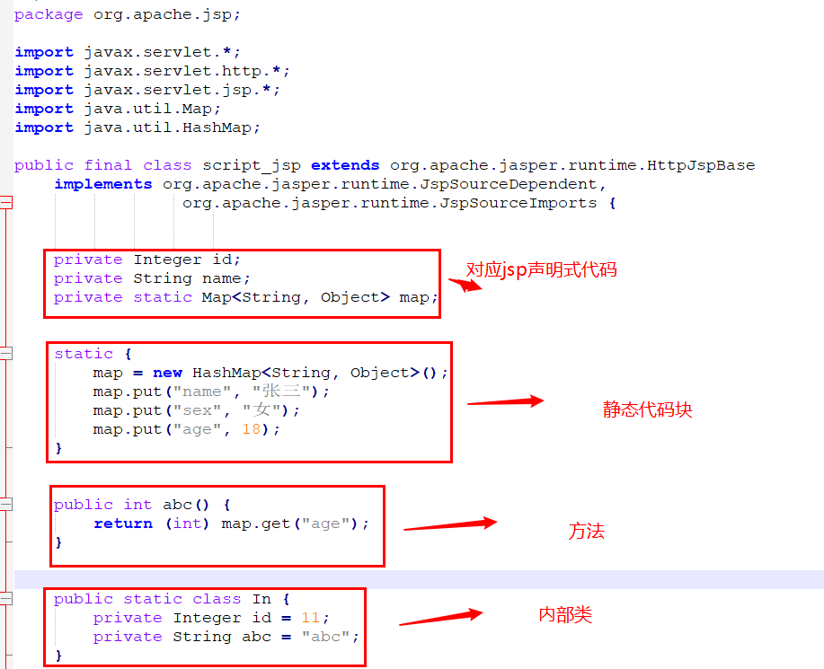
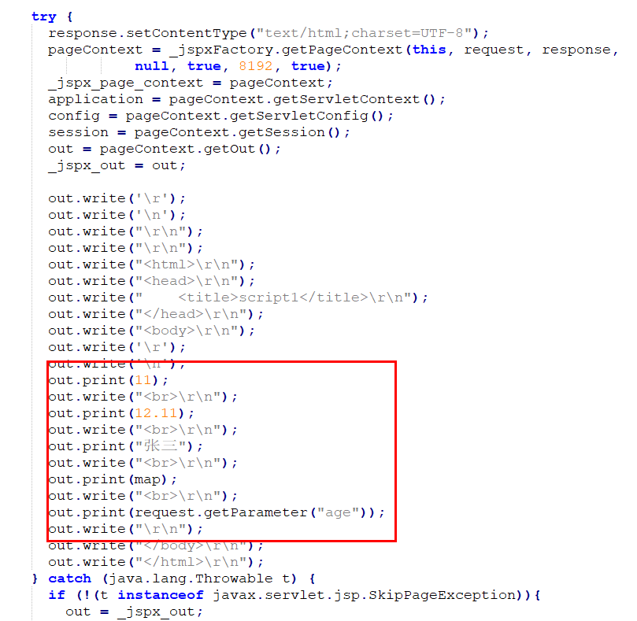
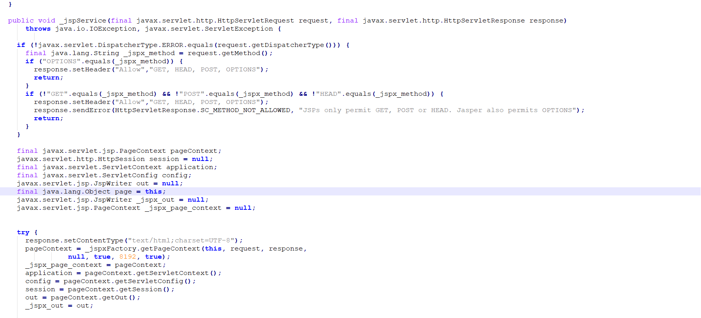
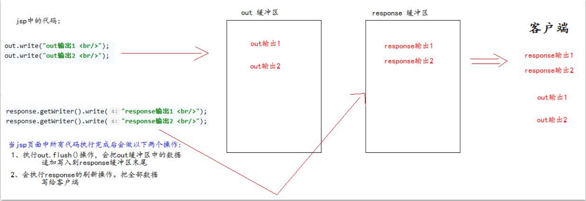
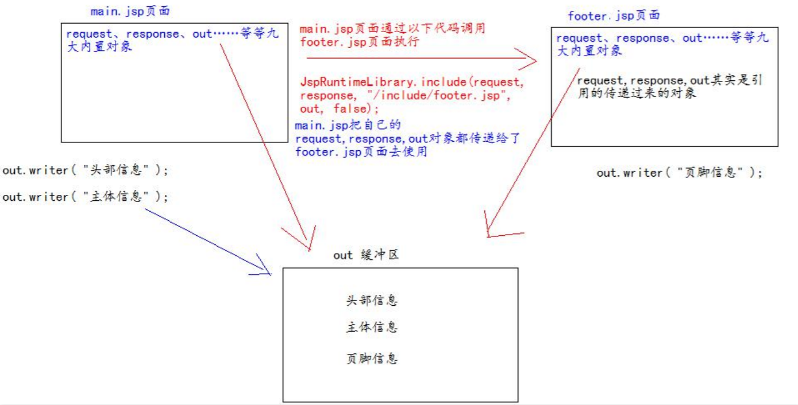

# jsp

JSP(Java Server Pages) 是由SUN公司专门为解决动态生成HTML文档的技术。

#### Servlet程序输出html页面

```java
package top.jch.learn;

import javax.servlet.ServletException;
import javax.servlet.annotation.WebServlet;
import javax.servlet.http.HttpServlet;
import javax.servlet.http.HttpServletRequest;
import javax.servlet.http.HttpServletResponse;
import java.io.IOException;
import java.io.PrintWriter;

/**
 * @author: Administrator
 * @create: 2020/07/03 10:48
 **/
@WebServlet("/jsp")
public class HTMLServlet extends HttpServlet {

    @Override
    protected void doGet(HttpServletRequest req, HttpServletResponse resp) throws ServletException, IOException {
        //设置返回数据内容的数据类型和编码
        resp.setContentType("text/html;charset=utf-8");
        //获取字符输出流
        PrintWriter w = resp.getWriter();
        w.write("<!DOCTYPE html>\r\n");
        w.write("<html lang=\"zn\">\r\n");
        w.write("<head>\r\n");
        w.write("<meta charset=\"utf-8\">\r\n");
        w.write("<title>html-servlet</title>\r\n");
        w.write("</head>\r\n");
        w.write("<body>\r\n");
        w.write("servlet-html测试\r\n");
        w.write("</body>\r\n");
        w.write("</html>\r\n");
    }

    @Override
    protected void doPost(HttpServletRequest req, HttpServletResponse resp) throws ServletException, IOException {
        super.doGet(req, resp);
    }
}
```

## JSP的本质

jsp页面本质是一个Servlet程序。

jsp页面编写完成后。第一次访问jsp页面时，tomcat服务器会把该jsp页面翻译为一个java源文件，并对其进行编译成.class字节码程序。jsp被翻译后的java源文件内容是：

```java
/*
 * Generated by the Jasper component of Apache Tomcat
 * Version: Apache Tomcat/9.0.10
 * Generated at: 2020-07-03 03:06:08 UTC
 * Note: The last modified time of this file was set to
 *       the last modified time of the source file after
 *       generation to assist with modification tracking.
 */
package org.apache.jsp;

import javax.servlet.*;
import javax.servlet.http.*;
import javax.servlet.jsp.*;

public final class index_jsp extends org.apache.jasper.runtime.HttpJspBase
    implements org.apache.jasper.runtime.JspSourceDependent,
                 org.apache.jasper.runtime.JspSourceImports {

  private static final javax.servlet.jsp.JspFactory _jspxFactory =
          javax.servlet.jsp.JspFactory.getDefaultFactory();

  private static java.util.Map<java.lang.String,java.lang.Long> _jspx_dependants;

  private static final java.util.Set<java.lang.String> _jspx_imports_packages;

  private static final java.util.Set<java.lang.String> _jspx_imports_classes;

  static {
    _jspx_imports_packages = new java.util.HashSet<>();
    _jspx_imports_packages.add("javax.servlet");
    _jspx_imports_packages.add("javax.servlet.http");
    _jspx_imports_packages.add("javax.servlet.jsp");
    _jspx_imports_classes = null;
  }

  private volatile javax.el.ExpressionFactory _el_expressionfactory;
  private volatile org.apache.tomcat.InstanceManager _jsp_instancemanager;

  public java.util.Map<java.lang.String,java.lang.Long> getDependants() {
    return _jspx_dependants;
  }

  public java.util.Set<java.lang.String> getPackageImports() {
    return _jspx_imports_packages;
  }

  public java.util.Set<java.lang.String> getClassImports() {
    return _jspx_imports_classes;
  }

  public javax.el.ExpressionFactory _jsp_getExpressionFactory() {
    if (_el_expressionfactory == null) {
      synchronized (this) {
        if (_el_expressionfactory == null) {
          _el_expressionfactory = _jspxFactory.getJspApplicationContext(getServletConfig().getServletContext()).getExpressionFactory();
        }
      }
    }
    return _el_expressionfactory;
  }

  public org.apache.tomcat.InstanceManager _jsp_getInstanceManager() {
    if (_jsp_instancemanager == null) {
      synchronized (this) {
        if (_jsp_instancemanager == null) {
          _jsp_instancemanager = org.apache.jasper.runtime.InstanceManagerFactory.getInstanceManager(getServletConfig());
        }
      }
    }
    return _jsp_instancemanager;
  }

  public void _jspInit() {
  }

  public void _jspDestroy() {
  }

  public void _jspService(final javax.servlet.http.HttpServletRequest request, final javax.servlet.http.HttpServletResponse response)
      throws java.io.IOException, javax.servlet.ServletException {

    if (!javax.servlet.DispatcherType.ERROR.equals(request.getDispatcherType())) {
      final java.lang.String _jspx_method = request.getMethod();
      if ("OPTIONS".equals(_jspx_method)) {
        response.setHeader("Allow","GET, HEAD, POST, OPTIONS");
        return;
      }
      if (!"GET".equals(_jspx_method) && !"POST".equals(_jspx_method) && !"HEAD".equals(_jspx_method)) {
        response.setHeader("Allow","GET, HEAD, POST, OPTIONS");
        response.sendError(HttpServletResponse.SC_METHOD_NOT_ALLOWED, "JSPs only permit GET, POST or HEAD. Jasper also permits OPTIONS");
        return;
      }
    }

    final javax.servlet.jsp.PageContext pageContext;
    javax.servlet.http.HttpSession session = null;
    final javax.servlet.ServletContext application;
    final javax.servlet.ServletConfig config;
    javax.servlet.jsp.JspWriter out = null;
    final java.lang.Object page = this;
    javax.servlet.jsp.JspWriter _jspx_out = null;
    javax.servlet.jsp.PageContext _jspx_page_context = null;


    try {
      response.setContentType("text/html;charset=UTF-8");
      pageContext = _jspxFactory.getPageContext(this, request, response,
      			null, true, 8192, true);
      _jspx_page_context = pageContext;
      application = pageContext.getServletContext();
      config = pageContext.getServletConfig();
      session = pageContext.getSession();
      out = pageContext.getOut();
      _jspx_out = out;

      out.write("\r\n");
      out.write("\r\n");
      out.write("<html>\r\n");
      out.write("<head>\r\n");
      out.write("    <title>jsp</title>\r\n");
      out.write("</head>\r\n");
      out.write("<body>\r\n");
      out.write("<h1>hello JSP</h1>\r\n");
      out.write("</body>\r\n");
      out.write("</html>\r\n");
    } catch (java.lang.Throwable t) {
      if (!(t instanceof javax.servlet.jsp.SkipPageException)){
        out = _jspx_out;
        if (out != null && out.getBufferSize() != 0)
          try {
            if (response.isCommitted()) {
              out.flush();
            } else {
              out.clearBuffer();
            }
          } catch (java.io.IOException e) {}
        if (_jspx_page_context != null) _jspx_page_context.handlePageException(t);
        else throw new ServletException(t);
      }
    } finally {
      _jspxFactory.releasePageContext(_jspx_page_context);
    }
  }
}
```

翻译后的jsp文件源码继承了：HttpJspBase类，实现了JspSourceDependent、JspSourceImport接口。

```java
public final class index_jsp extends org.apache.jasper.runtime.HttpJspBase
    implements org.apache.jasper.runtime.JspSourceDependent,
                 org.apache.jasper.runtime.JspSourceImports
```

其中HttpJspBase类直接继承了HttpServlet类。

```java
public abstract class HttpJspBase extends HttpServlet implements HttpJspPage{
    ...
}
```

## jsp的三种语法

### jsp头部的page指令

page指令可以修改jsp页面中的一些重要的属性，或者行为。

```jsp
<%@ page contentType="text/html;charset=UTF-8" language="java" %>
```

含由的属性

| 属性         | 说明                                                         |
| ------------ | ------------------------------------------------------------ |
| language     | 表示jsp翻译后是什么语言文件。                                |
| contentType  | jsp返回的数据类型是什么。源码中是response.setContentType()的参数值 |
| pageEncoding | jsp页面文件本身的字符集                                      |
| import       | 导入包，导入类。与Java源码的作用类似                         |
| autoFlush    | 设置当out输出流缓冲区满了之后，是否自动刷新缓冲区。默认为true。*注意：若不自动刷新，缓冲区满了之后，会报JSP Buffer overflow异常。* |
| buffer       | 设置out缓冲区的大小。默认为8kb                               |
| errorPage    | 设置当jsp页面运行时出错，自动跳转去的错误页面路径。          |
| isErrorPage  | 设置当前jsp页面是否是错误信息页面。默认是false。若是true可以获取异常信息。 |
| session      | 设置访问当前jsp页面，是否会创建HttpSession对象。默认是true。 |
| extends      | 设置jsp翻译出来的java类默认继承那个类。                      |

### jsp中的常用脚本

#### 声明脚本

格式：

```jsp
<%! 声明java代码 %>
```

作用：给jsp翻译出来的java类定义属性和方法甚至是静态代码块、内部类等。

示例：

```jsp
<%@ page import="java.util.Map" %>
<%@ page import="java.util.HashMap" %>
<%@ page contentType="text/html;charset=UTF-8" language="java" %>
<html>
<head>
    <title>jsp-script</title>
</head>
<body>
<%--声明类属性--%>
<%!
    private Integer id;
    private String name;
    private static Map<String, Object> map;
%>
<%--声明static静态代码块--%>
<%!
    static {
        map = new HashMap<String, Object>();
        map.put("name", "张三");
        map.put("sex", "女");
        map.put("age", 18);
    }
%>
<%--声明类方法--%>
<%!
    public int abc() {
        return (int) map.get("age");
    }
%>
<%--声明内部类--%>
<%!
    public static class In {
        private Integer id = 11;
        private String abc = "abc";
    }
%>
</body>
</html>
```

对应java代码



#### 表达式脚本

格式：

```jsp
<%=表达式%>
```

作用：在jsp页面上输出数据。

特点：

1. 所有的表达式脚本都会被翻译到_jspService()方法中
2. 表达式脚本都会被翻译成为out.print()输出到页面上
3. 因为表达式脚本翻译的内容都在_ jspService()​方法中，所以_jspService()方法中的对象都可以直接使用
4. 表达式脚本中的表达式不能以分号结束

示例：

```jsp
<%@ page import="java.util.Map" %>
<%@ page import="java.util.HashMap" %>
<%@ page contentType="text/html;charset=UTF-8" language="java" %>
<html>
<head>
    <title>script1</title>
</head>
<body>
<%!
    Map<String,Object> map = new HashMap<String,Object>();
    {
        map.put("name","张三");
    }
%>
<%=11%><br>
<%=12.11%><br>
<%="张三"%><br>
<%=map%><br>
<%=request.getParameter("age")%>
</body>
</html>
```

对应java代码



#### 代码脚本

格式：

```jsp
<%
	Java语句
%>
```

作用：在jsp页面中，使用java语句编写需要的功能。

特点：

1. 代码脚本翻译之后都在_ jspService方法中
2. 在_ jspService()方法中的现有对象都可以直接使用
3. 可以由多个代码脚本组合完成一个完整的java语句
4. 可以和表达式脚本一起组合使用，在jsp页面上输出数据

示例：

jsp页面代码

```jsp
<%@ page contentType="text/html;charset=UTF-8" language="java" %>
<html>
<head>
    <title>script2</title>
</head>
<body>
<%
    int i = 1;
    if (i == 1) {
%>
<h1>张三</h1>
<%
    }else{
%>
<h1>李四</h1>
<%
    }
%><br>
<table border="0" cellpadding="0">
    <%
        for (int j = 1; j < 10; j++) {
    %>
    <tr>
        <%
            for (int x = 1; x<=j; x++){
        %>
        <td><%=x%> * <%=j%> = <%=x*j%></td>
        <%
            }
        %>
    </tr>
    <%
        }
    %>
</table>
<%
    String name = request.getParameter("name");
    System.out.println("name：" + name);
%>
</body>
</html>
```

对应java代码

```java
/*
 * Generated by the Jasper component of Apache Tomcat
 * Version: Apache Tomcat/9.0.10
 * Generated at: 2020-07-03 04:49:35 UTC
 * Note: The last modified time of this file was set to
 *       the last modified time of the source file after
 *       generation to assist with modification tracking.
 */
package org.apache.jsp;

import javax.servlet.*;
import javax.servlet.http.*;
import javax.servlet.jsp.*;

public final class script2_jsp extends org.apache.jasper.runtime.HttpJspBase
    implements org.apache.jasper.runtime.JspSourceDependent,
                 org.apache.jasper.runtime.JspSourceImports {

  private static final javax.servlet.jsp.JspFactory _jspxFactory =
          javax.servlet.jsp.JspFactory.getDefaultFactory();

  private static java.util.Map<java.lang.String,java.lang.Long> _jspx_dependants;

  private static final java.util.Set<java.lang.String> _jspx_imports_packages;

  private static final java.util.Set<java.lang.String> _jspx_imports_classes;

  static {
    _jspx_imports_packages = new java.util.HashSet<>();
    _jspx_imports_packages.add("javax.servlet");
    _jspx_imports_packages.add("javax.servlet.http");
    _jspx_imports_packages.add("javax.servlet.jsp");
    _jspx_imports_classes = null;
  }

  private volatile javax.el.ExpressionFactory _el_expressionfactory;
  private volatile org.apache.tomcat.InstanceManager _jsp_instancemanager;

  public java.util.Map<java.lang.String,java.lang.Long> getDependants() {
    return _jspx_dependants;
  }

  public java.util.Set<java.lang.String> getPackageImports() {
    return _jspx_imports_packages;
  }

  public java.util.Set<java.lang.String> getClassImports() {
    return _jspx_imports_classes;
  }

  public javax.el.ExpressionFactory _jsp_getExpressionFactory() {
    if (_el_expressionfactory == null) {
      synchronized (this) {
        if (_el_expressionfactory == null) {
          _el_expressionfactory = _jspxFactory.getJspApplicationContext(getServletConfig().getServletContext()).getExpressionFactory();
        }
      }
    }
    return _el_expressionfactory;
  }

  public org.apache.tomcat.InstanceManager _jsp_getInstanceManager() {
    if (_jsp_instancemanager == null) {
      synchronized (this) {
        if (_jsp_instancemanager == null) {
          _jsp_instancemanager = org.apache.jasper.runtime.InstanceManagerFactory.getInstanceManager(getServletConfig());
        }
      }
    }
    return _jsp_instancemanager;
  }

  public void _jspInit() {
  }

  public void _jspDestroy() {
  }

  public void _jspService(final javax.servlet.http.HttpServletRequest request, final javax.servlet.http.HttpServletResponse response)
      throws java.io.IOException, javax.servlet.ServletException {

    if (!javax.servlet.DispatcherType.ERROR.equals(request.getDispatcherType())) {
      final java.lang.String _jspx_method = request.getMethod();
      if ("OPTIONS".equals(_jspx_method)) {
        response.setHeader("Allow","GET, HEAD, POST, OPTIONS");
        return;
      }
      if (!"GET".equals(_jspx_method) && !"POST".equals(_jspx_method) && !"HEAD".equals(_jspx_method)) {
        response.setHeader("Allow","GET, HEAD, POST, OPTIONS");
        response.sendError(HttpServletResponse.SC_METHOD_NOT_ALLOWED, "JSPs only permit GET, POST or HEAD. Jasper also permits OPTIONS");
        return;
      }
    }

    final javax.servlet.jsp.PageContext pageContext;
    javax.servlet.http.HttpSession session = null;
    final javax.servlet.ServletContext application;
    final javax.servlet.ServletConfig config;
    javax.servlet.jsp.JspWriter out = null;
    final java.lang.Object page = this;
    javax.servlet.jsp.JspWriter _jspx_out = null;
    javax.servlet.jsp.PageContext _jspx_page_context = null;


    try {
      response.setContentType("text/html;charset=UTF-8");
      pageContext = _jspxFactory.getPageContext(this, request, response,
      			null, true, 8192, true);
      _jspx_page_context = pageContext;
      application = pageContext.getServletContext();
      config = pageContext.getServletConfig();
      session = pageContext.getSession();
      out = pageContext.getOut();
      _jspx_out = out;

      out.write("\r\n");
      out.write("\r\n");
      out.write("<html>\r\n");
      out.write("<head>\r\n");
      out.write("    <title>script2</title>\r\n");
      out.write("</head>\r\n");
      out.write("<body>\r\n");

    int i = 1;
    if (i == 1) {

      out.write("\r\n");
      out.write("<h1>张三</h1>\r\n");

    }else{

      out.write("\r\n");
      out.write("<h1>李四</h1>\r\n");

    }

      out.write("<br>\r\n");
      out.write("<table border=\"1\" cellpadding=\"0\">\r\n");
      out.write("    ");

        for (int j = 1; j < 10; j++) {
    
      out.write("\r\n");
      out.write("    <tr>\r\n");
      out.write("        ");

            for (int x = 1; x<=j; x++){
        
      out.write("\r\n");
      out.write("        <td>");
      out.print(x);
      out.write(' ');
      out.write('*');
      out.write(' ');
      out.print(j);
      out.write(' ');
      out.write('=');
      out.write(' ');
      out.print(x*j);
      out.write("</td>\r\n");
      out.write("        ");

            }
        
      out.write("\r\n");
      out.write("    </tr>\r\n");
      out.write("    ");

        }
    
      out.write("\r\n");
      out.write("</table>\r\n");

    String name = request.getParameter("name");
    System.out.println("name：" + name);

      out.write("\r\n");
      out.write("</body>\r\n");
      out.write("</html>\r\n");
    } catch (java.lang.Throwable t) {
      if (!(t instanceof javax.servlet.jsp.SkipPageException)){
        out = _jspx_out;
        if (out != null && out.getBufferSize() != 0)
          try {
            if (response.isCommitted()) {
              out.flush();
            } else {
              out.clearBuffer();
            }
          } catch (java.io.IOException e) {}
        if (_jspx_page_context != null) _jspx_page_context.handlePageException(t);
        else throw new ServletException(t);
      }
    } finally {
      _jspxFactory.releasePageContext(_jspx_page_context);
    }
  }
}
```

### jsp中的三种注释

#### html注释

```jsp
<!-- html注释 -->
```

html注释会被翻译到java源代码中。在_ jspService()方法里，以out.writer()输出到客户端。

#### java注释

```jsp
<%
//单行注释
/* 多行注释 */
%>
```

会被翻译到java源代码中，但html中不会显示。

#### jsp注释

```jsp
<%-- jsp注释 -->
```

jsp注释可以注释掉jsp页面中所有的代码。

## JSP九大内置对象

jsp中的内置对象，是指tomcat翻译jsp页面成为servlet源代码后，内部提供的九大对象。



| 名称        | 说明               |
| ----------- | ------------------ |
| request     | 请求对象           |
| response    | 响应对象           |
| pageContext | jsp的上下文对象    |
| session     | 会话对象           |
| application | ServletContext对象 |
| config      | ServletConfig对象  |
| out         | jsp输出流对象      |
| page        | 当前jsp对象        |
| exception   | 异常对象           |

## jsp四大域对象

| 域对象      | 对应类               | 说明                                                 |
| ----------- | -------------------- | ---------------------------------------------------- |
| pageContext | PageContextImpl类    | 当前jsp页面范围内有效                                |
| request     | HttpServletRequest类 | 一次请求内有效                                       |
| session     | HttpSession类        | 一个会话范围内有效(打开服务，关闭浏览器)             |
| application | ServletContext类     | 整个web工程范围内都有效(只要web工程不停止，数据都在) |

域对象可以像Map一样存取数据的对象。四个域对象功能一样，只是存取范围不同。

四个域对象存取数据时，使用的优先级顺序：

pageContext  <  request < session  < application

示例：

页面1

```jsp
<%@ page contentType="text/html;charset=UTF-8" language="java" %>
<html>
<head>
    <title>scope</title>
</head>
<body>
<h1>1</h1>
<%
    pageContext.setAttribute("k1","pageContext");
    request.setAttribute("k1","request");
    session.setAttribute("k1","session");
    application.setAttribute("k1","application");
%>
pageContext域是否有值：<%=pageContext.getAttribute("k1")%><br>
request域是否有值：<%=request.getAttribute("k1")%><br>
session域是否有值：<%=session.getAttribute("k1")%><br>
application域是否有值：<%=application.getAttribute("k1")%><br>
<%
    request.getRequestDispatcher("/scope1.jsp").forward(request,response);
%>
</body>
</html>
```

页面2

```jsp
<%@ page contentType="text/html;charset=UTF-8" language="java" %>
<html>
<head>
    <title>scope</title>
</head>
<body>
<h1>2</h1>
pageContext是否有值：<%=pageContext.getAttribute("k1")%><br>
request是否有值：<%=request.getAttribute("k1")%><br>
session是否有值：<%=session.getAttribute("k1")%><br>
application是否有值：<%=application.getAttribute("k1")%>
</body>
</html>
```

## jsp中的out输出和response.getWriter输出的区别



由于jsp翻译后，底层源代码都是使用out来进行输出，所以一般情况下，在jsp页面中统一使用out进行输出，避免打乱页面输出内容的顺序。

out.write()：输出字符串

out.print()：输出任意数据（都转换成为字符串后调用的write输出）

## jsp常用标签

### jsp静态包含

```jsp
<%@ include file="/scope.jsp"%>
```

file属性指定要包含的jsp页面路径。

地址中第一个斜杆表示http://ip:port/工程路径/ 映射到代码的web目录。

特点：

1. 静态包含不会翻译被包含的jsp页面
2. 静态包含其实是把被包含的jsp页面的代码拷贝到包含的位置执行输出

### jsp动态包含

```jsp
<jsp:include page="/scope.jsp">
	<jsp:param name="name" value="张三"/>
    <jsp:param name="pwd" value="123456"/>
</jsp:include>
```

page属性指定要包含的jsp页面的路径。动态包含可以像静态包含一样，把包含的内容执行输出到包含位置。

特点：

1. 会把包含的jsp页面也翻译成java代码

2. 动态包含底层代码使用如下代码去调用被包含的jsp页面执行输出

   ```java
   JspRuntimeLibrary.include(request,response,"/scope.jsp",out,false);
   ```

底层原理：



### jsp标签-转发

```jsp
<jsp:forward page="/scope1.jsp"></jsp:forward>
```

page属性是设置请求转发路径