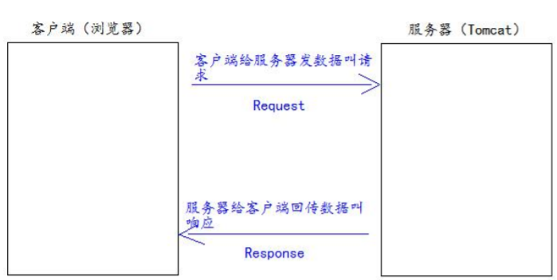
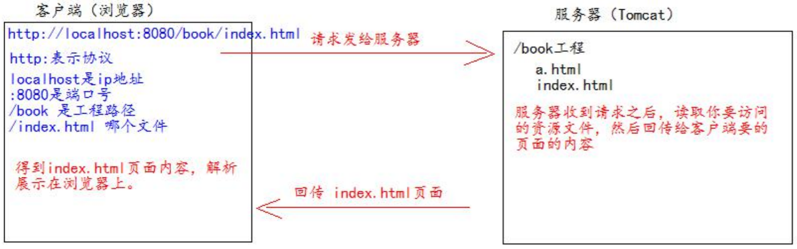
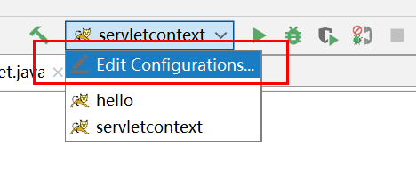
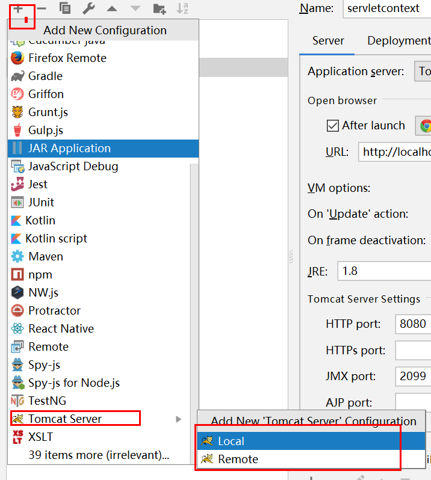
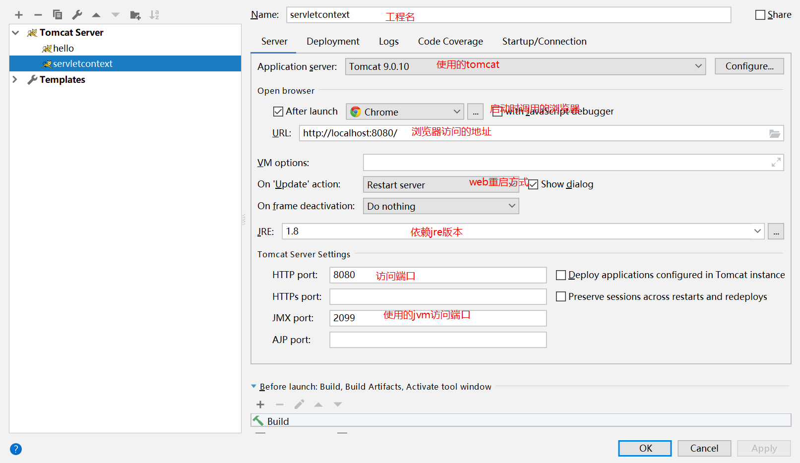
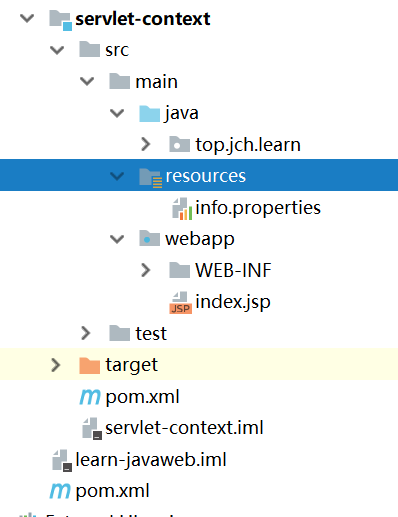

# Tomcat

## JavaWeb的概念

**JavaWeb：**所有使用Java语言编写可以使用浏览器访问的程序统称。JavaWeb是基于请求和响应来开发的。



## Web资源分类

**静态资源：**html、css、js、txt、mp4、jpg等。

**动态资源：**jsp页面、Servlet程序。

## 常用Web服务器

- **Tomcat：**由Apache组织提供的一种web服务器，提供对jsp和Servlet的支持。它是一种轻量级的JavaWeb容器，也是当前应用最广的JavaWeb服务器（免费开源）。
- **Jboss：**遵从JavaEE规范、开放源代码的、纯Java的EJB服务器，支持所有的JavaEE规范。
- **GlassFish：**由Oracle公司开发，是一款强健的商业服务器，达到产品级质量（应用很少）。
- **Resin：**CAUCHO公司的产品，是一个非常流行的服务器，对servlet和jsp提供了良好的支持，性能也比较优良，resin自身采用Java语言开发（收费，应用比较多）。
- **WebLogic：**Oracle公司的产品，支持JavaEE规范，而且不断的完善以适应新的开发要求，适合大型项目（收费，用的不多，适合大公司）

#### Tomcat服务器和Servlet版本的对应关系

| Tomcat版本 | Servlet/JSP版本 | JavaEE版本 | 运行环境 |
| ---------- | --------------- | ---------- | -------- |
| 4.1        | 2.3/1.2         | 1.3        | JDK1.3   |
| 5.0        | 2.4/2.0         | 1.4        | JDK1.4   |
| 5.5/6.0    | 2.5/2.1         | 5.0        | JDK5.0   |
| 7.0        | 3.0/2.2         | 6.0        | JDK6.0   |
| 8.0        | 3.1/2.3         | 7.0        | JDK7.0   |

Servlet3.0之前的版本是以xml配置，之后是支持注解。

## Tomcat的使用

### 安装

官网：http://tomcat.apache.org/

下载zip包，解压到安装目录即可。

### Tomcat工作目录

| 目录    | 说明                                                         |
| ------- | ------------------------------------------------------------ |
| bin     | 可执行程序                                                   |
| conf    | 配置文件                                                     |
| lib     | 服务器依赖的jar包                                            |
| logs    | 服务器运行日志                                               |
| temp    | tomcat运行时产生的临时数据                                   |
| webapps | 存放部署的web工程                                            |
| work    | tomcat工作时目录，存放tomcat运行时jsp翻译为Servlet的源码，和Session钝化的目录 |

### 启动tomcat服务器

windows系统：

1、双击执行tomcat安装目录下bin文件的startup.bat文件。

浏览器访问测试

1. http://localhost:8080
2. http://127.0.0.1:8080
3. http://真实ip:8080

> 注意：启动前，要配置Java的环境变量。

2、使用命令行工具进入tomcat的bin目录下执行命令：catalina run

### 关闭Tomcat服务器（windows）

1. 关闭tomcat服务器窗口（windows）
2. 在tomcat服务器命令行窗口中使用快捷键 Ctrl + C
3. 双击tomcat目录下的shutdown.bat文件

### 修改Tomcat的端口号

修改tomcat目录下的conf文件夹下的server.xml配置文件

```xml
<Connector port="8080" protocol="HTTP/1.1"
               connectionTimeout="20000"
               redirectPort="8443"
			  URIEncoding="UTF-8" />
```

```xml
<Connector port="8081" protocol="HTTP/1.1"
               connectionTimeout="20000"
               redirectPort="8443"
			  URIEncoding="UTF-8" />
```

tomcat默认端口号：8081

HTTP协议默认端口号：80

### 部署web工程到Tomcat中

1. 把web工程的目录拷贝到tomcat的webapps目录下即可。

   访问方式：http://ip:port/工程名/目录名/文件名

2. 在tomcat的conf\Catalina\localhost\目录下，创建xml配置文件，文件内容如下：

   ```xml
   <!--Context 表示一个web工程上下文
   		path表示工程的访问路径
   		docBase表示工程目录在哪里
   -->
   <Context path="/test" docBase="E:\test"/>
   ```

### 将HTML文件拖到浏览器中查看与在浏览器中输入http://ip:端口号/工程名/访问的区别

将HTML文件拖动到浏览器中查看时，浏览器地址栏中地址显示如下：

file:///F:/test.html

它使用的协议是file://协议。浏览器直接读取file:协议后面的路径，解析展示在浏览器上。

使用http://ip:port/工程名/资源名，是使用的HTTP协议，它的处理过程是：



### ROOT工程的访问，以及默认页面的访问

直接访问 http://ip:port/  →  默认访问ROOT工程

直接访问 http://ip:port/工程名/ → 默认访问该工程的index.html(默认页面)

## IDEA使用Tomcat







## Web工程目录（maven项目）



```
servlet-context：工程目录
	-src：工程源码目录
		-java：java源码存放目录
		-resources: 资源存放目录
		-webapp：web资源存放目录
			-WEB-INF：项目编译后classes文件夹和依赖jar包目录lib存放目录
			 	-web.xml：web项目配置文件
			-index.jsp :默认页面
```

​		

