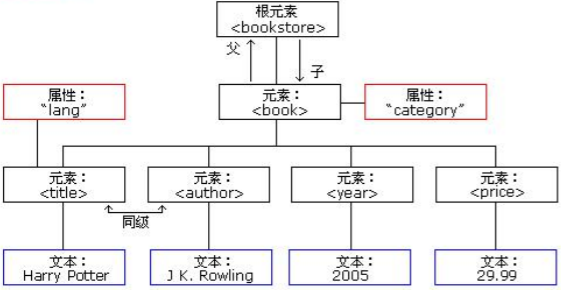

# xml

## 简介

xml是可扩展的标记语言。

### xml的作用

1. 用来保存数据，且这些数据具有自我描述性。
2. 作为项目或模块的配置文件。
3. 可做为网络传输数据的格式。现在以JSON为主。

## 语法

### 文档声明

```xml
<?xml version="1.0" encoding="UTF-8"?>
```

#### 属性

| 属性                | 解释                  |
| ------------------- | --------------------- |
| version             | 版本号                |
| encoding            | xml文件编码           |
| standalone="yes/no" | 当前xml是否为独立文件 |

#### 示例

```xml
<?xml version="1.0" encoding="UTF-8"?>
<books>
	<book id="SN123">
    	<name>张三的奇妙冒险</name>
        <author>李四</author>
        <price>1</price>
    </book>
    <book id="SN456">
    	<name>金瓶梅</name>
        <author>兰陵笑笑生</author>
        <price>11</price>
    </book>
</books>
```

### xml注释

与HTML注释一样

```xml
<!-- 注释 -->
```

### 元素

XML元素是指从开始标签直到结束标签的部分。

元素可以包含其它元素、文本或者两者的混合。**元素可以拥有属性**

如：文档声明的示例。

元素可以理解为标签。(Element 翻译为 元素)

#### XML元素（标签）命名规则

1. 名称可以包含字母、数字以及其它字符
2. 不能以数字或者标点符号开始
3. <s>不能以字符"xml"或者"XML、Xml"开始</s>
4. 不能包含空格

#### 元素（标签）分类

##### 单标签

格式：

```xml
<标签名 属性="值" 属性="值" ...... />
```

双标签

格式：

```xml
<标签名 属性="值" 属性="值" ......>文本数据或子标签</标签名>
```

### xml属性

xml的标签属性和html的标签属性类似，**属性可以提供元素的额外信息**。

**注意：**标签上可以有多个属性，但每个属性的值必须使用""号包括住。

### 语法规则

1. 所有xml元素(标签)都必须关闭标签(即：闭合)

2. XML标签对大小写敏感

3. XML必须正确的嵌套

4. XML文档必须有根元素(即：没有父标签的顶级元素，且是唯一一个)

5. XML的属性值必须加引号

6. XML中的特殊字符

   ```xml
   <books>
   	<book>
       	<name>&lt;张三&gt;</name>
       </book>
   </books>
   ```

7. 文本区域（CDATA区）

   CDATA区域即纯文本区，XML语法不会去解析。

   格式：

   ```xml
   <![CDATA[原样显示，不会解析xml]]>
   ```

## XML解析技术

HTML文件和XML文件都是标记型文档，可以使用w3c组织制定的dom技术解析。

**XML文档对象模型定义访问和操作XML文档的标准方法。**

**DOM将XML文档作为一个树形结构，而树叶定义为节点。**



> document对象表示的是整个文档（可以是HTML，也可以是XML）

#### 早期JDK提供解析XML技术

##### DOM技术

由W3C组织制定，所有的编程语言都对这个解析技术提供了实现。

##### SAX（Simple API for XML）解析技术

该技术是sun公司再JDK5版本对DOM技术进行的升级。

SAX解析是以类似事件机制通过回调告诉用户当前正在解析的内容。是一行一行的读取XML文件进行解析的，不会创建大量的dom对象。因而在性能上、内存使用上，都优于DOM解析。

#### 第三方解析

- jdom在dom基础上进行了封装
- dom4j对jdom进行了封装
- pull主要用在Android手机开发，跟sax非常类似的事件机制解析XML文件。

## dom4j解析技术

注意：dom4j不是sun公司的技术，使用时需要引入第三方jar包。

```xml
<!-- https://mvnrepository.com/artifact/dom4j/dom4j -->
<dependency>
    <groupId>dom4j</groupId>
    <artifactId>dom4j</artifactId>
    <version>1.6.1</version>
</dependency>
```

#### dom4j编程步骤

1. 先加载xml文件创建Document对象
2. 通过Document对象拿到根元素对象
3. 通过根元素.elelemts(标签名);返回一个集合，集合内就是制定标签的元素对象
4. 找到要修改、删除的子元素，进行操作
5. 保存

#### 获取document对象

要解析的xml内容

```xml
<?xml version="1.0" encoding="UTF-8"?>
<books>
	<book id="123">
    	<name>张三的奇妙冒险</name>
        <author>李四</author>
        <price>1</price>
    </book>
    <book id="456">
    	<name>金瓶梅</name>
        <author>兰陵笑笑生</author>
        <price>11</price>
    </book>
</books>
```

解析代码

```java
public void getDocument()throws DocumentException{
    //创建SAXReader对象
    SAXReader reader = new SAXReader();
    //读取xml文件，返回一个Document对象
    Document document = reader.read("src/books.xml");
}
```

#### 遍历标签，获取所有标签中的内容

步骤：

1. 创建SAXReader对象，读取xml，获取Document对象
2. 使用Document对象拿到xml的根元素对象
3. 通过根元素对象，获取所有想要的标签对象
4. 遍历每个目标标签对象，获取目标标签对象内的每一个元素，再通过getText()方法拿到起始标签和结束标签之间的文本内容

```java
public void readXML()throws DocumentException{
    SAXReader reader = new SAXReader();
    Document document = reader.read("books.xml");
    Element root = document.getRootElement();
    List<Element> books = root.elements("book");
    for(Element book : books){
        Element nameElement = book.element("name");
        Element priceElement = book.element("price");
        Element authorElement = book.element("author");
        System.out.println("书名：" + nameElement.getText() + ",价格：" + priceElement.getText() + "，作者：" + authorElement.getText());
    }
}
```

