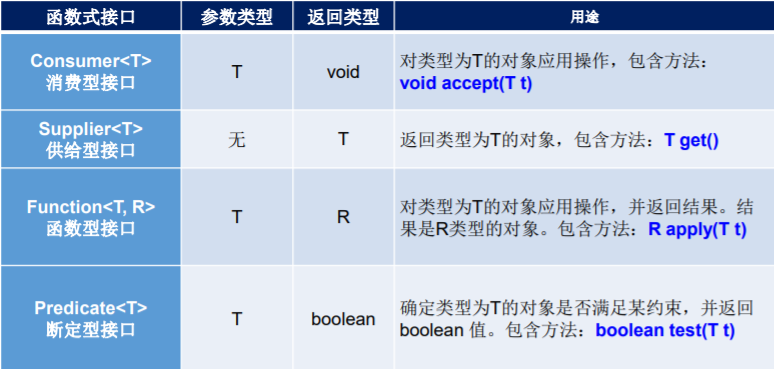
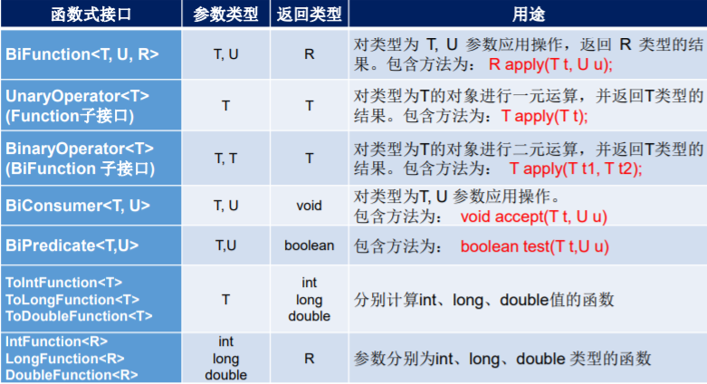

# Java 8新特性简介


Java 8 是Oracle公司在2014年3月发布，是自Java 5以来最具革命性的版本。

- 速度更快
- 代码更少（增加新语法：Lambda 表达式）
- 强大的 Stream API
- 便于并行
- 最大化减少空指针异常：Optional
- Nashorm引擎，允许在JVM上运行JS应用

**并行流：**是把一个内容分成多个数据块，并用不同的线程分别处理每个数据块的流。

相比较串行的流，并行的流可以很大程度上提高程序的执行效率。

Java 8 中Stream API 可以声明性地通过 parallel() 与 sequential() 在并行流与顺序流 之间进行切换。

# Lambda表达式

Lambda 表达式可以理解为是一段可以传递的代码（将代码像数据一样进行传递）。

## 语法

```java
(o1,o2) -> Integer.compare(o1,o2);
格式：
    -> : Lambda操作符或箭头操作符
    左边:Lambda形参列表(其实就是接口中的抽象方法的形参列表)
    右边:Lambda表达式体(其实就是重写的抽象方法的方法体)
```

### Lambda表达式的六种语法格式


**总结：**

左边：lambda形参列表的参数类型可以省略(类型推断)；如果lambda形参列表只一个参数，其一对()也可以省略

右边：lambda体应该使用一对{}包裹；如果lambda体只一条执行语句（可能是return语句，省略这一对{}和return关键字）

**注意：**Lambda 表达式的类型依赖于上下文环境，是由编译器(javac)推断出来的。

# 函数式(Functional)接口

- 只包含一个抽象方法的接口，称为函数式接口。

- 在一个接口上使用 **@FunctionalInterface** 注解，可以检 查它是否是一个函数式接口。同时 javadoc 也会包含一条声明，说明这个 接口是一个函数式接口。

- **Lambda表达式的本质：作为函数式接口的实例**，即：可以通过Lambda表达式创建函数式接口对象。

  若 Lambda 表达式抛出一个受检异常(即：非运行时异常)，那么该异常需要在目标接口的抽象方法上进行声明

#### 举例


## 定义函数式接口

```java
@FunctionalInterface
public interface MyNumber{
	public double getValue();
}
```

##### 函数式接口中使用泛型

```java
@FunctionalInterface
public interface MyFunc<T>{
	public T getValue(T t);
}
```

###### 作为参数传递Lambda表达式


## Java内置函数式接口

### 四大核心函数式接口



### 其他接口



# 方法引用(Method References)

#### 理解

方法引用可以看做是Lambda表达式深层次的表达。换句话说，方法引用就是Lambda表达式，也就是函数式接口的一个实例，通过方法的名字来指向一个方法。

#### 使用情境

当要传递给Lambda体的操作，已经实现的方法了，可以使用方法引用！

#### 格式

**类(或对象) :: 方法名**

1. 对象 :: 非静态方法
2. 类 :: 静态方法
3. 类 :: 非静态方法

##### 要求

1. 要求接口中的抽象方法的形参列表和返回值类型与方法引用的方法的形参列表和返回值类型相同！（针对于情况1和情况2）
2. 当函数式接口方法的第一个参数是需要引用方法的调用者，并且第二个参数是需要引用方法的参数(或无参数)时：ClassName::methodName（针对于情况3）

##### 使用建议

如果给函数式接口提供实例，恰好满足方法引用的使用情境，以考虑使用方法引用给函数式接口提供实例。

##### 使用举例

```java
// 情况一：对象 :: 实例方法
//Consumer中的void accept(T t)
//PrintStream中的void println(T t)
@Test
public void test1() {
	Consumer<String> con1 = str -> System.out.println(str);
	con1.accept("北京");

	System.out.println("*******************");
	PrintStream ps = System.out;
	Consumer<String> con2 = ps::println;
	con2.accept("beijing");
}

//Supplier中的T get()
//Employee中的String getName()
@Test
public void test2() {
	Employee emp = new Employee(1001,"Tom",23,5600);

	Supplier<String> sup1 = () -> emp.getName();
	System.out.println(sup1.get());

	System.out.println("*******************");
	Supplier<String> sup2 = emp::getName;
	System.out.println(sup2.get());

}

// 情况二：类 :: 静态方法
//Comparator中的int compare(T t1,T t2)
//Integer中的int compare(T t1,T t2)
@Test
public void test3() {
	Comparator<Integer> com1 = (t1,t2) -> Integer.compare(t1,t2);
	System.out.println(com1.compare(12,21));

	System.out.println("*******************");

	Comparator<Integer> com2 = Integer::compare;
	System.out.println(com2.compare(12,3));

}

//Function中的R apply(T t)
//Math中的Long round(Double d)
@Test
public void test4() {
	Function<Double,Long> func = new Function<Double, Long>() {
		@Override
		public Long apply(Double d) {
			return Math.round(d);
		}
	};

	System.out.println("*******************");

	Function<Double,Long> func1 = d -> Math.round(d);
	System.out.println(func1.apply(12.3));

	System.out.println("*******************");

	Function<Double,Long> func2 = Math::round;
	System.out.println(func2.apply(12.6));
}

// 情况：类 :: 实例方法  (难度)
// Comparator中的int comapre(T t1,T t2)
// String中的int t1.compareTo(t2)
@Test
public void test5() {
	Comparator<String> com1 = (s1,s2) -> s1.compareTo(s2);
	System.out.println(com1.compare("abc","abd"));

	System.out.println("*******************");

	Comparator<String> com2 = String :: compareTo;
	System.out.println(com2.compare("abd","abm"));
}

//BiPredicate中的boolean test(T t1, T t2);
//String中的boolean t1.equals(t2)
@Test
public void test6() {
	BiPredicate<String,String> pre1 = (s1,s2) -> s1.equals(s2);
	System.out.println(pre1.test("abc","abc"));

	System.out.println("*******************");
	BiPredicate<String,String> pre2 = String :: equals;
	System.out.println(pre2.test("abc","abd"));
}

// Function中的R apply(T t)
// Employee中的String getName();
@Test
public void test7() {
	Employee employee = new Employee(1001, "Jerry", 23, 6000);

	Function<Employee,String> func1 = e -> e.getName();
	System.out.println(func1.apply(employee));

	System.out.println("*******************");

	Function<Employee,String> func2 = Employee::getName;
	System.out.println(func2.apply(employee));
}
```

# 构造器引用

#### 格式

```java
类名::new
```

#### 使用要求

和方法引用类似，函数式接口的抽象方法的形参列表和构造器的形参列表一致。抽象方法的返回值类型即为构造器所属的类的类型。

##### 举例

```java
//Supplier中的T get()
//Employee的空参构造器：Employee()
@Test
public void test1(){

    Supplier<Employee> sup = new Supplier<Employee>() {
        @Override
        public Employee get() {
            return new Employee();
        }
    };
    System.out.println("*******************");

    Supplier<Employee>  sup1 = () -> new Employee();
    System.out.println(sup1.get());

    System.out.println("*******************");

    Supplier<Employee>  sup2 = Employee :: new;
    System.out.println(sup2.get());
}

//Function中的R apply(T t)
@Test
public void test2(){
    Function<Integer,Employee> func1 = id -> new Employee(id);
    Employee employee = func1.apply(1001);
    System.out.println(employee);

    System.out.println("*******************");

    Function<Integer,Employee> func2 = Employee :: new;
    Employee employee1 = func2.apply(1002);
    System.out.println(employee1);

}

//BiFunction中的R apply(T t,U u)
@Test
public void test3(){
    BiFunction<Integer,String,Employee> func1 = (id,name) -> new Employee(id,name);
    System.out.println(func1.apply(1001,"Tom"));

    System.out.println("*******************");

    BiFunction<Integer,String,Employee> func2 = Employee :: new;
    System.out.println(func2.apply(1002,"Tom"));

}
```

# 数组引用

#### 格式

```java
数组类型[] :: new
```

##### 举例

```java
//Function中的R apply(T t)
@Test
public void test4(){
    Function<Integer,String[]> func1 = length -> new String[length];
    String[] arr1 = func1.apply(5);
    System.out.println(Arrays.toString(arr1));

    System.out.println("*******************");

    Function<Integer,String[]> func2 = String[] :: new;
    String[] arr2 = func2.apply(10);
    System.out.println(Arrays.toString(arr2));
}
```

# Stream API

#### Stream API的理解

1. Stream关注的是对数据的运算，与CPU打交道

   集合关注的是数据的存储，与内存打交道

2. java8提供了一套api,使用这套api可以对内存中的数据进行过滤、排序、映射、归约等操作。类似于sql对数据库中表的相关操作。

##### Stream到底是什么呢？

是数据渠道，用于操作数据源（集合、数组等）所生成的元素序列。

###### 注意

1. Stream 自己不会存储元素。
2. Stream 不会改变源对象。相反，他们会返回一个持有结果的新Stream。
3. Stream 操作是延迟执行的。这意味着他们会等到需要结果的时候才执行。

## Stream的使用流程

1. Stream的实例化（创建）

   一个数据源（如：集合、数组），获取一个流

2. 一系列中间操作（过滤、映射、...）

   一个中间操作链，对数据源的数据进行处理。

3. 终止操作

   一旦执行终止操作，就执行中间操作链，并产生结果。之后，不会再被使用


### Stream创建

#### 方式一：通过集合

Java8 中的 Collection 接口被扩展，提供了两个获取流的方法：

- **default Stream<E> stream():**返回一个顺序流
- **default Stream<E> parallelStream():**返回一个并行流

```java
@Test
public void test1(){
    List<Employee> employees = EmployeeData.getEmployees();

    //default Stream<E> stream() : 返回一个顺序流
    Stream<Employee> stream = employees.stream();

    //default Stream<E> parallelStream() : 返回一个并行流
    Stream<Employee> parallelStream = employees.parallelStream();

}
```

#### 方式二：通过数组

Java8 中的 Arrays 的静态方法 stream() 可以获取数组流：

- **static <T> Stream<T> stream(T[] array)：**返回一个流

  重载形式，能够处理对应基本类型的数组：

  - public static IntStream stream(int[] array)
  - public static LongStream stream(long[] array)
  - public static DoubleStream stream(double[] array)

```java
@Test
public void test2(){
    int[] arr = new int[]{1,2,3,4,5,6};
    //调用Arrays类的static <T> Stream<T> stream(T[] array): 返回一个流
    IntStream stream = Arrays.stream(arr);

    Employee e1 = new Employee(1001,"Tom");
    Employee e2 = new Employee(1002,"Jerry");
    Employee[] arr1 = new Employee[]{e1,e2};
    Stream<Employee> stream1 = Arrays.stream(arr1);

}
```

#### 方式三：通过Stream的of()

调用Stream类静态方法of(), 通过显示值创建一个 流。它可以接收任意数量的参数。

- **public static<T> Stream<T> of(T... values):**返回一个流

```java
@Test
public void test3(){
    Stream<Integer> stream = Stream.of(1, 2, 3, 4, 5, 6);
}
```

#### 方式四：创建无限流

使用静态方法 Stream.iterate() 和 Stream.generate(), 创建无限流。

- 迭代

  ```java
  public static<T> Stream<T> iterate(final T seed,final UnaryOperator<T> f)
  ```

- 生成

  ```java
  public static<T> Stream<T> generate(Supplier<T> s)
  ```

```java
@Test
public void test4(){

    //迭代
    //public static<T> Stream<T> iterate(final T seed, final UnaryOperator<T> f)
    //遍历前10个偶数
    Stream.iterate(0, t -> t + 2).limit(10).forEach(System.out::println);


    //生成
    //public static<T> Stream<T> generate(Supplier<T> s)
  Stream.generate(Math::random).limit(10).forEach(System.out::println);

}
```

### Stream 的中间操作

多个中间操作可以连接起来形成一个流水线，除非流水线上触发终止 操作，否则中间操作不会执行任何的处理！而在终止操作时一次性全 部处理，称为“惰性求值”。

#### 筛选与切片


#### 映射


#### 排序


### Stream 的终止操作

- 终止操作会从流的流水线生成结果。其结果可以是任何不是流的值，例 如：List、Integer，甚至是 void 。
- 流进行了终止操作后，不能再次使用。

#### 匹配与查找


#### 归约


备注：map 和 reduce 的连接通常称为 map-reduce 模式，因 Google 用它来进行网络搜索而出名。

#### 收集


Collector 接口中方法的实现决定了如何对流执行收集的操作(如收集到 List、Set、 Map)。

##### Collectors工具类中的方法


# Optional类

1. java.util.Optional类

2. 为了解决java中的空指针问题而生！

   Optional<T> 类(java.util.Optional) 是一个容器类，它可以保存类型T的值，代表这个值存在。或者仅仅保存null，表示这个值不存在。原来用null表示一个值不存在，现在 Optional 可以更好的表达这个概念。并且可以避免空指针异常。

## Optional类提供的方法

##### 创建Optional类对象的方法

- **Optional.of(T t) :** 创建一个 Optional 实例，t必须非空
- **Optional.empty() :** 创建一个空的 Optional 实例
- **Optional.ofNullable(T t)：**t可以为null

##### 判断Optional容器中是否包含对象

- **boolean isPresent() :** 判断是否包含对象
- **void ifPresent(Consumer<? super T> consumer) ：**如果有值，就执行Consumer 接口的实现代码，并且该值会作为参数传给它。

##### 获取Optional容器的对象

- **T get():** 如果调用对象包含值，返回该值，否则抛异常
- **T orElse(T other) ：**如果有值则将其返回，否则返回指定的other对象。
- **T orElseGet(Supplier<? extends T> other) ：**如果有值则将其返回，否则返回由 Supplier接口实现提供的对象。
- **T orElseThrow(Supplier<? extends X> exceptionSupplier) ：**如果有值则将其返回，否则抛出由Supplier接口实现提供的异常。

```java
@Test
public void test1(){
    //empty():创建的Optional对象内部的value = null
    Optional<Object> op1 = Optional.empty();
    if(!op1.isPresent()){//Optional封装的数据是否包含数据
        System.out.println("数据为空");
    }
    System.out.println(op1);
    System.out.println(op1.isPresent());
    //如果Optional封装的数据value为空，则get()报错。否则，value不为空时，返回value.
    //System.out.println(op1.get());
}

@Test
public void test2(){
    String str = "hello";
    //str = null;
    //of(T t):封装数据t生成Optional对象。要求t非空，否则报错。
    Optional<String> op1 = Optional.of(str);
    //get()通常与of()方法搭配使用。用于获取内部的封装的数据value
    String str1 = op1.get();
    System.out.println(str1);

}

@Test
public void test3(){
    String str = "beijing";
    str = null;
    //ofNullable(T t) ：封装数据t赋给Optional内部的value。不要求t非空
    Optional<String> op1 = Optional.ofNullable(str);
    //orElse(T t1):如果Optional内部的value非空，则返回此value值。如果
    //value为空，则返回t1.
    String str2 = op1.orElse("shanghai");
    System.out.println(str2);
}
```

```java
//使用Optional类的getGirlName():
public String getGirlName2(Boy boy){

    Optional<Boy> boyOptional = Optional.ofNullable(boy);
    //此时的boy1一定非空
    Boy boy1 = boyOptional.orElse(new Boy(new Girl("迪丽热巴")));

    Girl girl = boy1.getGirl();

    Optional<Girl> girlOptional = Optional.ofNullable(girl);
    //girl1一定非空
    Girl girl1 = girlOptional.orElse(new Girl("古力娜扎"));

    return girl1.getName();
}

@Test
public void test5(){
    Boy boy = null;
    boy = new Boy();
    boy = new Boy(new Girl("苍老师"));
    String girlName = getGirlName2(boy);
    System.out.println(girlName);
}
```

