[TOC]

# JavaWeb

## 1.基本概念

### 1.1 web应用程序

**web应用程序**：可以提供浏览器访问的程序；

- 如html、css、js脚本等静态资源，可以被外界访问。
- 能访问到的任何一个页面或者资源，都存在这个世界上的某个计算机上。
- 通过 URL 访问资源
- 统一的web资源会被放在同一个文件夹下，web应用程序 → Tomcat：服务器
- web应用的组成部分（静态web、动态web）：
  1. html、css、js 等静态资源
  2. jsp、servlet 等后台程序
  3. Java程序
  4. jar包
  5. 配置文件（Properties）

web应用程序编码完毕后，需要一个服务器来进行同一管理，才能提供给外界访问。

### 1.2 静态web

类似html、css、js等静态文件，放在服务器内，可以通过浏览器进行直接读取。如图：

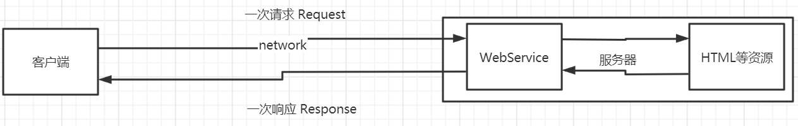

静态web的缺点：

1. web页面无法动态更新，所有访问者看到的都是同样的页面。
   - 可以使用JavaScript实现特效：伪动态
     - JavaScript
     - VBScript
2. 无法与数据库进行交互。

### 1.3 动态web

页面会根据访问者的不同而发生改变。

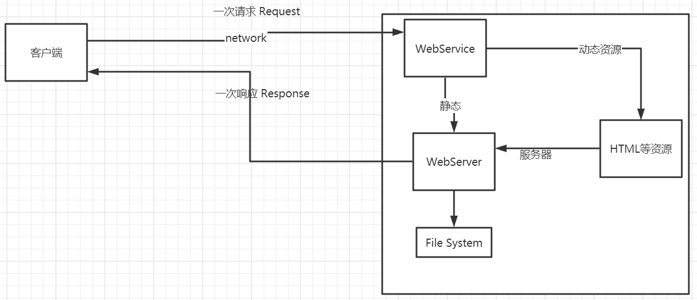

缺点：

服务器的动态资源出现错误，需要重新编写**后台程序**，并重新发布。

优点：

- web页面可以动态更新，会根据访问者的不同显示不同的信息。
- 可以与数据交互（数据持久化、用户之间的交互）

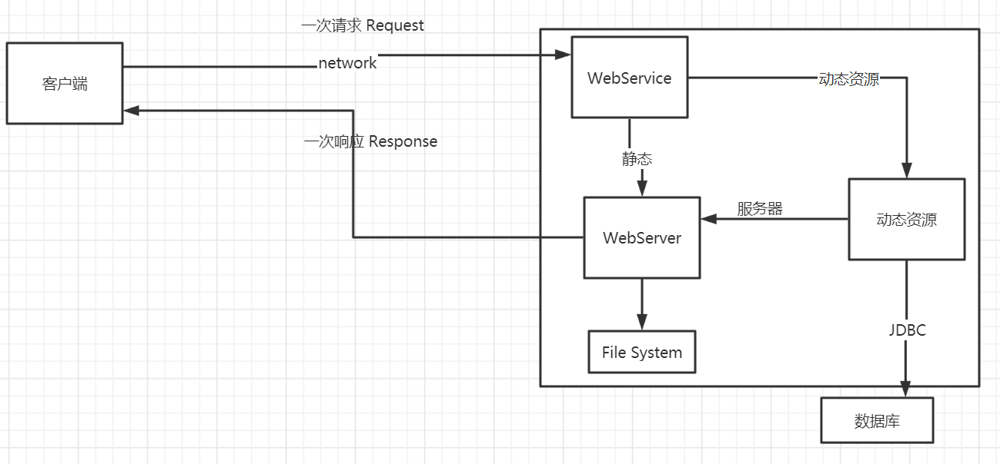

## 2. web服务器

### 2.1 相关技术

#### ASP

- 微软（国内最早流行的web技术）
- 可以在HTML中嵌入VB的脚本，ASP + COM
- ASP页面比较复杂，维护成本高。
- 使用C#语言开发
- 使用IIS服务器部署

#### PHP

- 开发速度快，功能强大，跨平台，代码简单。
- 无法承载大访问量的情况

#### JSP/Servlet

- SUN公司主推的B/S架构
- 基于Java语言（所有的大公司，或者一些开源的组件，都是用Java编写的）
- 可以承载高性能、高并发、高可用的情况
- JSP语法像ASP。

#### ......

### 2.2 web服务器

web服务器实现的是一种被动的操作，用来处理用户的一些请求和返回给用户一些响应信息。

**IIS服务器：**微软公司开发，支持ASP应用，Windows系统自带。

**Tomcat:**

Tomcat是Apache 软件基金会（Apache Software Foundation）的Jakarta 项目中的一个核心项目，最新的Servlet 和JSP 规范总是能在Tomcat 中得到体现，因为Tomcat 技术先进、性能稳定，而且**免费**，因而深受Java 爱好者的喜爱并得到了部分软件开发商的认可，成为目前比较流行的Web 应用服务器。

Tomcat 服务器是一个免费的开放源代码的Web 应用服务器，属于轻量级应用[服务器](https://baike.baidu.com/item/服务器)，在中小型系统和并发访问用户不是很多的场合下被普遍使用，是开发和调试JSP 程序的首选。对于一个Java初学web的人来说，它是最佳的选择

Tomcat 实际上运行JSP 页面和Servlet。

## 3. Tomcat

### 3.1 安装Tomcat

#### 下载

官网：http://tomcat.apache.org/

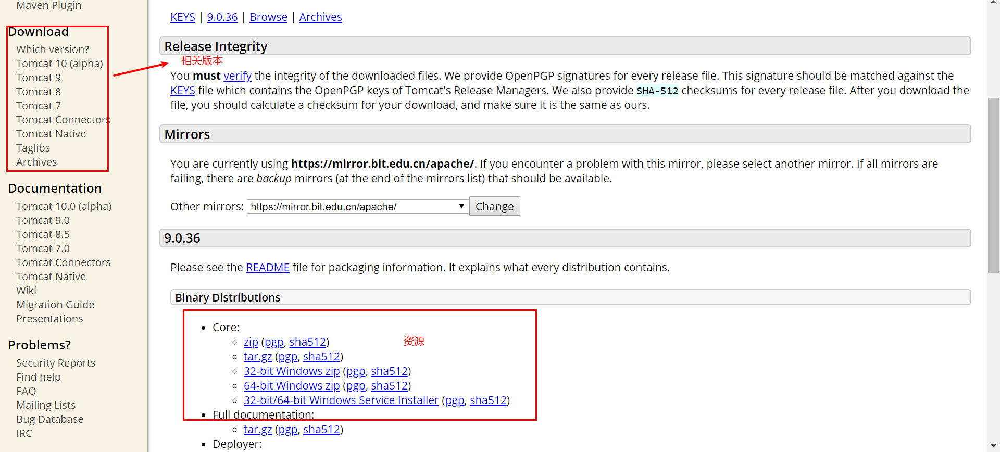

下载zip包解压

### 3.2 Tomcat启动和配置

#### Tomcat文件目录

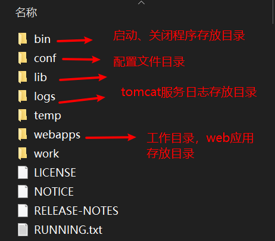

#### 启动或关闭Tomcat服务

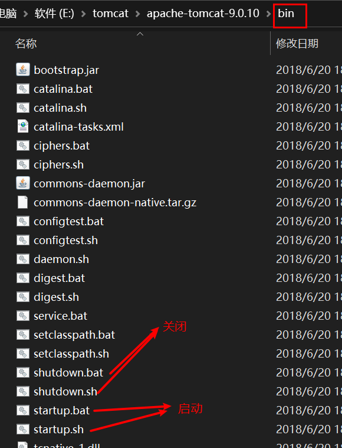

### 3.3 配置

conf文件目录下

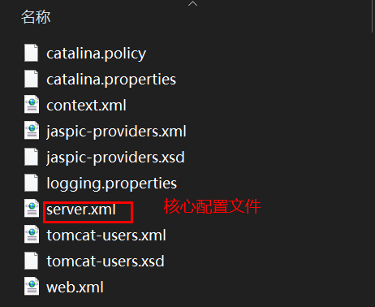

#### 配置端口号

**默认端口：**8080

HTTP默认端口：80

HTTPS默认端口：443

```xml
<Connector port="8080" protocol="HTTP/1.1"
               connectionTimeout="20000"
               redirectPort="8443" />
```

#### 配置主机名称

默认主机名称：localhost → 127.0.0.1

默认web应用存放的位置：webapps

```xml
<Host name="localhost"  appBase="webapps"
            unpackWARs="true" autoDeploy="true">

        <!-- SingleSignOn valve, share authentication between web applications
             Documentation at: /docs/config/valve.html -->
        <!--
        <Valve className="org.apache.catalina.authenticator.SingleSignOn" />
        -->

        <!-- Access log processes all example.
             Documentation at: /docs/config/valve.html
             Note: The pattern used is equivalent to using pattern="common" -->
        <Valve className="org.apache.catalina.valves.AccessLogValve" directory="logs"
               prefix="localhost_access_log" suffix=".txt"
               pattern="%h %l %u %t &quot;%r&quot; %s %b" />

      </Host>
```

###### 网站是如何进行访问的？

1. 在浏览器地址栏输入网址，发送请求。

2. 检查本机的hosts配置文件内有没有该域名映射：

   1. 存在该域名映射：直接返回对应得ip地址，通过这个地址访问对应得web资源。

      ```shell
      windows系统下hosts文件存放位置: C:\Windows\System32\drivers\etc\hosts
      
      -- 域名映射实例
      127.0.0.1 www.test.com
      ```

   2. 不存在：去DNS服务器查找，找到就返回，找不到就返回找不到

      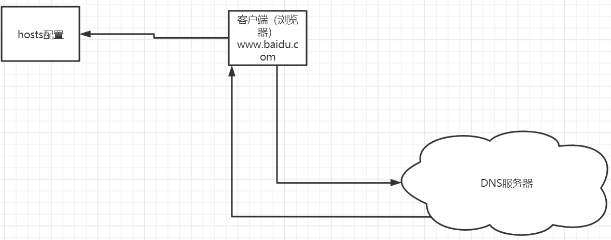

### 3.4 发布一个web网站

将编写的web程序，放到服务器（Tomcat）中指定的web应用的文件夹（webapps）下。

网站一般结构：

```java
--webapps
    -ROOT
    -test:网站目录名称
        -WEB-INFO
        	-classes : Java程序
             -lib：依赖的jar包
             -web.xml:网站配置文件
        -index.html ：首页
        - static 静态文件存放目录
             -css
             -js
             -img
         ......
```

## 4. HTTP

### 4.1 什么是HTTP

HTTP（超文本传输协议）是一个简单的请求-响应协议，它通常运行在TCP之上。

- 文本：字符串、html、......
- 超文本：图片、音乐、视频、定位、地图......
- 默认端口：80

HTTPS协议：使用SSL加密的超文本传输协议，默认端口：443

### 4.2 HTTP / 1.0和HTTP / 1.1

- HTTP/1.0：客户端可以与web服务器连接后，只能获得一个web资源，断开连接。
- HTTP/1.1：客户端可以与web服务器连接后，可以获得多个web资源。

### 4.3 HTTP请求

客户端(浏览器)  → 发请求(Request) → 服务器

```http
Request URL: https://www.baidu.com/ 请求地址
Request Method: GET get方法/post方法
Status Code: 200 OK 状态码
Remote Address: 180.101.49.11:443 远程服务器ip
Referrer Policy: no-referrer-when-downgrade
```

```http
Accept: text/html,application/xhtml+xml,application/xml;q=0.9,image/webp,image/apng,*/*;q=0.8
Accept-Encoding: gzip, deflate, br 编码
Accept-Language: zh-CN,zh;q=0.9  语言
Connection: keep-alive
Cookie: BIDUPSID=8991B018C7B426F66E19459C30A4EE26; PSTM=1532096423; BAIDUID=9FF94295D007F95E98A58F5644494D56:FG=1; BD_UPN=1a314753; BDUSS=VHMFh2QVNWaUprVTZQMmJHLWFMTjg3eS1JM0kzRTJQRWNldjktcTg2RlgxTkJlRVFBQUFBJCQAAAAAAAAAAAEAAADnSeCFutO2q8bfwMkAAAAAAAAAAAAAAAAAAAAAAAAAAAAAAAAAAAAAAAAAAAAAAAAAAAAAAAAAAAAAAAAAAAAAAAAAAFdHqV5XR6led2; BDORZ=FFFB88E999055A3F8A630C64834BD6D0; BDRCVFR[S_ukKV6dOkf]=mk3SLVN4HKm; delPer=0; BD_CK_SAM=1; PSINO=5; H_PS_PSSID=1447_31326_21080_32140_22160; COOKIE_SESSION=539677_0_7_0_22_11_0_0_2_5_0_5_539678_0_4_0_1593519663_0_1593519659%7C9%2332907272_10_1591335954%7C3; BDSVRTM=0
Host: www.baidu.com
Upgrade-Insecure-Requests: 1
User-Agent: Mozilla/5.0 (Windows NT 10.0; WOW64) AppleWebKit/537.36 (KHTML, like Gecko) Chrome/70.0.3538.25 Safari/537.36 Core/1.70.3754.400 QQBrowser/10.5.4034.400
```

#### 请求行

请求方式：**GET**、**POST**、HEAD、SELETE、PUT、TRACT......

- **GET**：请求能够携带的参数比较少，大小有限制，会在浏览器URL地址栏中显示参数数据内容，不安全，但高效。
- **POST**：请求能够携带的参数没有限制，大小没有限制，不会再浏览器的URL地址栏显示参数数据内容，安全、但不高效。

#### 消息头

```http
Accept：告诉浏览器，它所支持的数据类型
Accept-Encoding：支持哪种编码格式  GBK   UTF-8   GB2312  ISO8859-1
Accept-Language：告诉浏览器，它的语言环境
Cache-Control：缓存控制
Connection：告诉浏览器，请求完成是断开还是保持连接
HOST：主机..../. ip:port
```

### 4.4 HTTP响应

服务器 → 响应(Response) → 客户端（浏览器）

```http
Bdpagetype: 2
Bdqid: 0xe5444c30000b987c
Cache-Control: private 缓存控制
Connection: keep-alive 连接
Content-Encoding: gzip 编码
Content-Type: text/html;charset=utf-8 类型
Date: Tue, 30 Jun 2020 13:37:08 GMT
Expires: Tue, 30 Jun 2020 13:37:08 GMT
Server: BWS/1.1
Set-Cookie: BDSVRTM=289; path=/
Set-Cookie: BD_HOME=1; path=/
Set-Cookie: H_PS_PSSID=1447_31326_21080_32140_31253_32046_31321_26350_22160; path=/; domain=.baidu.com
Strict-Transport-Security: max-age=172800
Traceid: 1593524228061326541816520413102144723068
Transfer-Encoding: chunked
X-Ua-Compatible: IE=Edge,chrome=1
```

#### 响应体

```http
Accept：告诉浏览器，它所支持的数据类型
Accept-Encoding：支持哪种编码格式  GBK   UTF-8   GB2312  ISO8859-1
Accept-Language：告诉浏览器，它的语言环境
Cache-Control：缓存控制
Connection：告诉浏览器，请求完成是断开还是保持连接
HOST：主机..../.
Refresh：告诉客户端，多久刷新一次；
Location：让网页重新定位；
```

#### 响应状态码

200：请求成功

3**：请求重定向（重新定位到一个新的位置）

4**：找不到资源。如：404 资源不存在

5**：服务器代码错误。如：500 服务器错误；502：网关错误

######面试题

当你的浏览器中地址栏输入地址并回车的一瞬间到页面能够展示回来，经历了什么？

## 5. Maven

### 5.1 Maven项目架构管理工具

目前使用它就是为了方便导入jar包。

Maven核心思想：约定大于配置。

### 5.2 安装Maven

官网：http://maven.apache.org/

在官网下载对应系统的zip包，解压即可。

### 5.3 配置环境变量

**windows环境**

打开我的电脑属性选项：

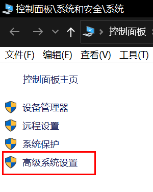


打开高级系统设置：

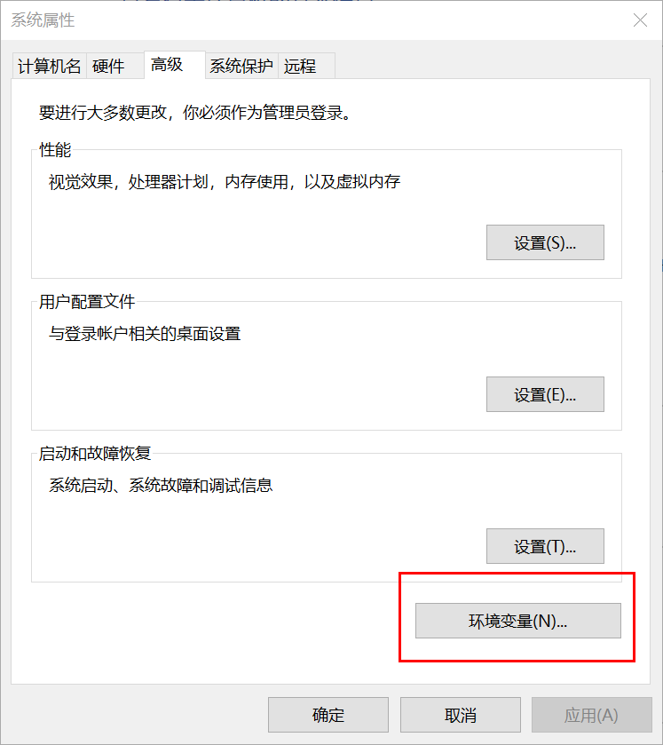

打开环境变量

在系统变量中配置如下：

- M2_HOME ： maven目录下的bin目录
- MAVEN_HOME : maven的目录
- 在系统的path中配置：%MAVEN_HOME%\bin

使用：mvn -version 命令查看是否配置成功。

### 5.3 配置云镜像和本地仓库

#### 配置云镜像仓库

在maven目录下conf文件夹下的settings.xml文件中配置

```xml
<mirror>
    <id>nexus-aliyun</id>  
    <mirrorOf>*,!jeecg,!jeecg-snapshots</mirrorOf>  
    <name>Nexus aliyun</name>  
    <url>http://maven.aliyun.com/nexus/content/groups/public</url> 
</mirror>
```

#### 配置本地仓库

```xml
<localRepository>E:\apache-maven-3.5.4\java_jar_depository</localRepository>
```

###  5.4 Maven模块化开发

1. 构建一个普通的Maven项目，删掉里面的src目录，在内部创建新项目 → Moudel项目，被删掉src目录的工程就是maven主工程，Moudel项目为子工程。

2. 关于Maven父子工程的标识：

   - 父项目的pom文件内有：

     ```xml
     <modules>
     	<module>sun</module>
     </modules>
     ```

   - 子项目的pom文件内有：

     ```xml
     <parent>
     	<artifactId>learn-javeweb</artifactId>
         <groupId>com.learning</groupId>
         <version>1.0</version>
     </parent>
     ```

     父项目中的jar包子项目可以直接使用。

## 6. Servlet

### 6.1 Servlet 介绍

- SUN公司开发的动态web技术。
- 开发Servlet程序的步骤：
  1. 实现Servlet接口。
  2. 将开发完成Servlet程序部署到web服务器中。

### 6.2 HelloServlet

Serlvet接口的两个默认实现类：

- HttpServlet
- GenericServlet

#### 编写一个Servlet程序

1、创建一个maven项目

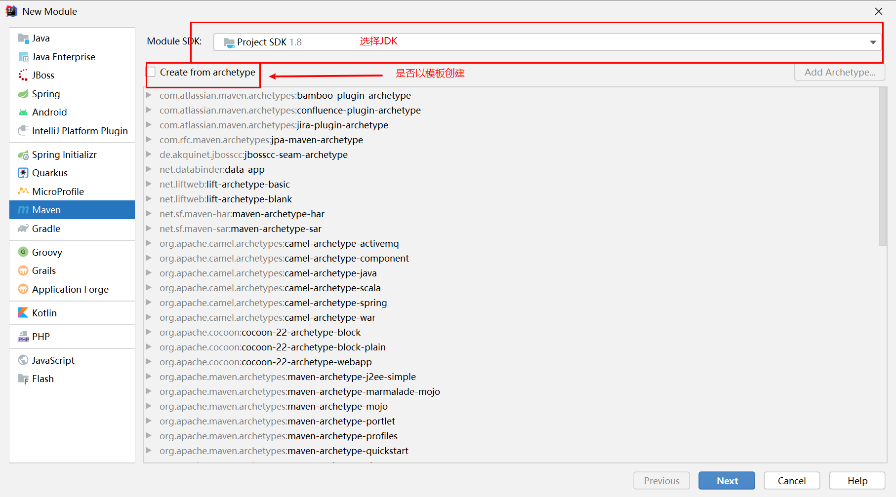

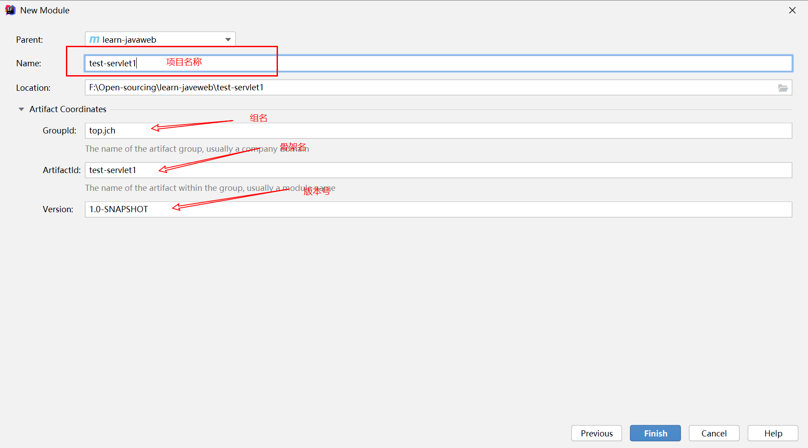

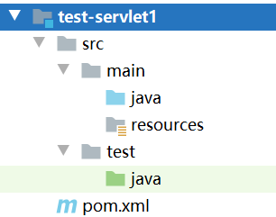

2、添加web.xml

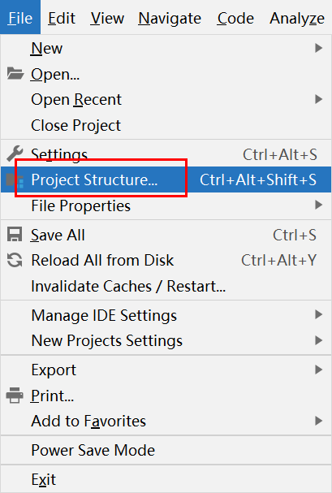

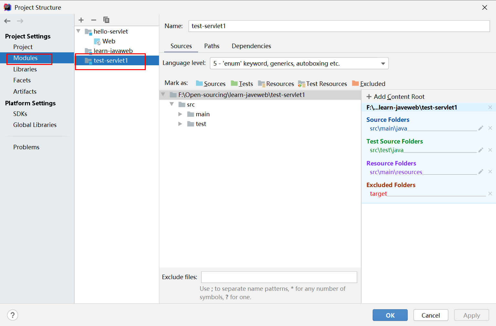

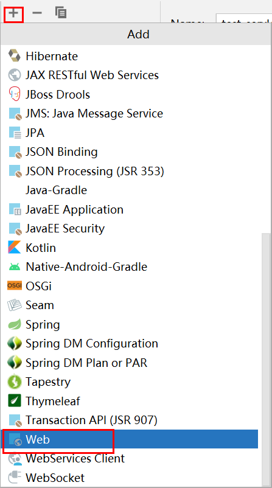

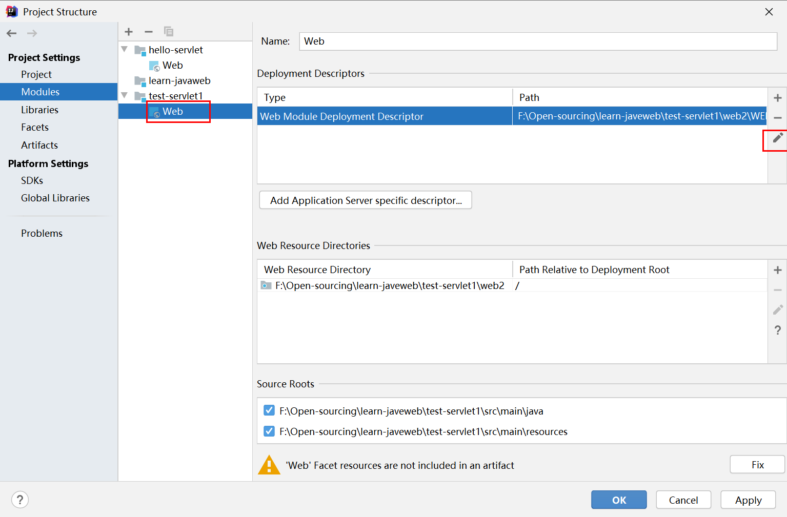

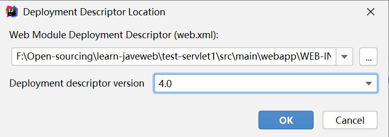

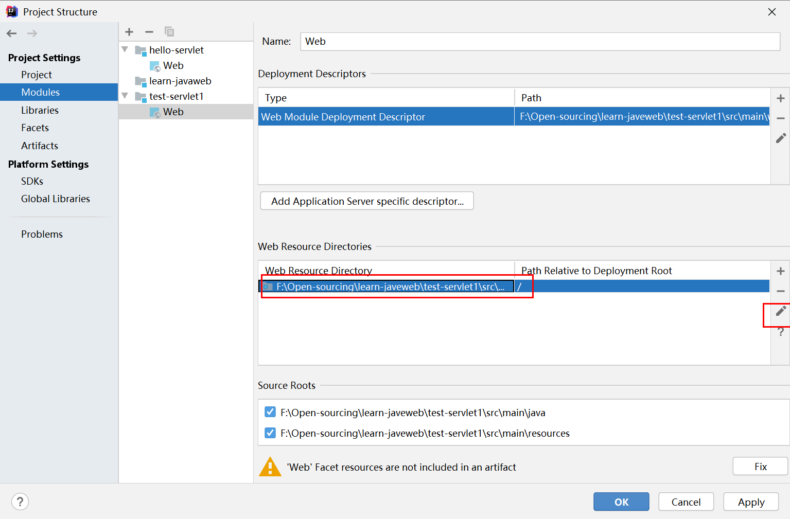

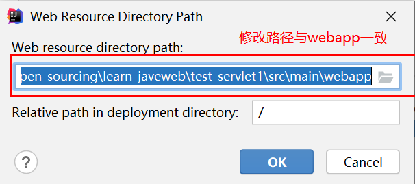

点击应用

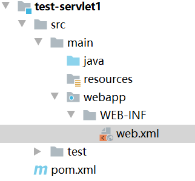

最新web.xml

```xml
<?xml version="1.0" encoding="UTF-8"?>
<web-app xmlns="http://xmlns.jcp.org/xml/ns/javaee"
         xmlns:xsi="http://www.w3.org/2001/XMLSchema-instance"
         xsi:schemaLocation="http://xmlns.jcp.org/xml/ns/javaee http://xmlns.jcp.org/xml/ns/javaee/web-app_4_0.xsd"
         version="4.0" metadata-complete="true">
</web-app>
```

2、编写servlet类

```java
import javax.servlet.ServletException;
import javax.servlet.http.HttpServlet;
import javax.servlet.http.HttpServletRequest;
import javax.servlet.http.HttpServletResponse;
import java.io.IOException;
import java.io.PrintWriter;

public class HelloServlet extends HttpServlet {

    @Override
    protected void doGet(HttpServletRequest req, HttpServletResponse resp) throws ServletException, IOException {
        String name = req.getParameter("name");
        PrintWriter pw = resp.getWriter();
        pw.write("hello " + name);
    }

    @Override
    protected void doPost(HttpServletRequest req, HttpServletResponse resp) throws ServletException, IOException {
        doGet(req, resp);
    }
}
```

3、编写Servlet映射

向web服务器注册Servlet，并为其提供一个访问路径。这样浏览器连接web服务器才能访问到。

```xml
<?xml version="1.0" encoding="UTF-8"?>
<web-app xmlns="http://xmlns.jcp.org/xml/ns/javaee"
         xmlns:xsi="http://www.w3.org/2001/XMLSchema-instance"
         xsi:schemaLocation="http://xmlns.jcp.org/xml/ns/javaee http://xmlns.jcp.org/xml/ns/javaee/web-app_4_0.xsd"
         version="4.0">
    <servlet>
        <servlet-name>hello</servlet-name>
        <servlet-class>top.jch.learn.HelloServlet</servlet-class>
    </servlet>
    <servlet-mapping>
        <servlet-name>hello</servlet-name>
        <url-pattern>/hello</url-pattern>
    </servlet-mapping>
</web-app>
```

4、配置tomcat

5、启动tomcat

#### Servlet接口类图

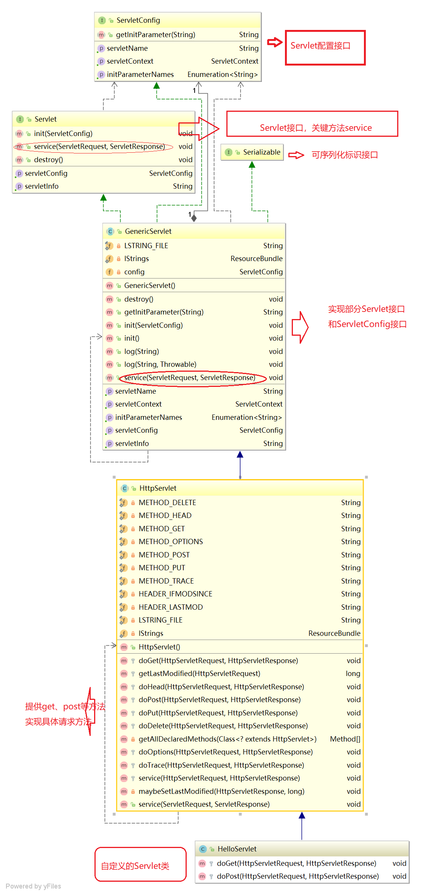

### 6.3 Servlet 原理

web服务器在收到浏览器请求之后，调用Servlet。具体的执行流程是：

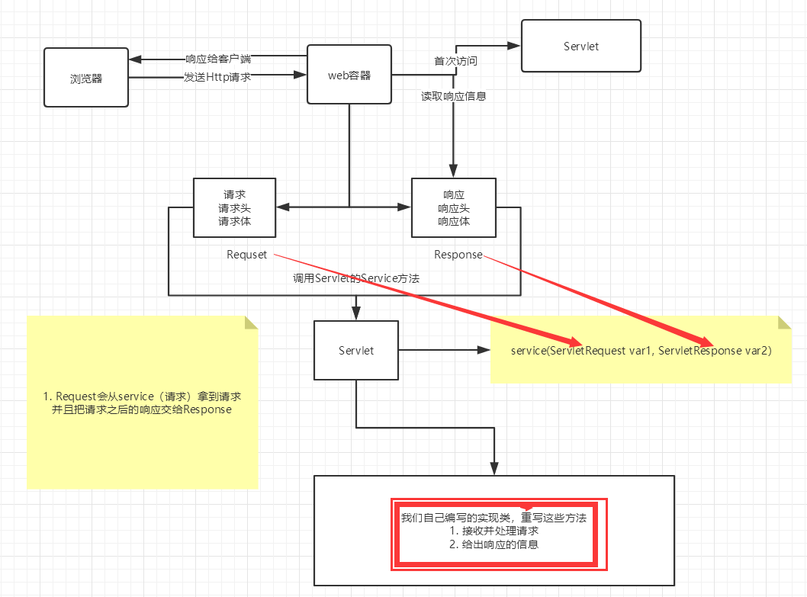

### 6.4 Mapping

```xml
<?xml version="1.0" encoding="UTF-8"?>
<web-app xmlns="http://xmlns.jcp.org/xml/ns/javaee"
         xmlns:xsi="http://www.w3.org/2001/XMLSchema-instance"
         xsi:schemaLocation="http://xmlns.jcp.org/xml/ns/javaee http://xmlns.jcp.org/xml/ns/javaee/web-app_4_0.xsd"
         version="4.0">
    <servlet>
        <servlet-name>hello</servlet-name>
        <servlet-class>top.jch.learn.HelloServlet</servlet-class>
    </servlet>
    <!--servlet可以指定一个mapping映射也可以指定多个映射-->
    <servlet-mapping>
        <servlet-name>hello</servlet-name>
        <url-pattern>/hello</url-pattern>
    </servlet-mapping>
    <servlet-mapping>
        <servlet-name>hello</servlet-name>
        <url-pattern>/hello1</url-pattern>
    </servlet-mapping>
    <servlet-mapping>
        <servlet-name>hello</servlet-name>
        <url-pattern>/hello2</url-pattern>
    </servlet-mapping>
    <!--Servlet还可以指定通用映射路径-->
    <servlet-mapping>
        <servlet-name>hello</servlet-name>
        <url-pattern>/hello/*</url-pattern>
    </servlet-mapping>
    <!--Servlet的默认请求路径-->
    <!--<servlet-mapping>-->
        <!--<servlet-name>hello</servlet-name>-->
        <!--<url-pattern>/*</url-pattern>-->
    <!--</servlet-mapping>-->

    <servlet>
        <servlet-name>test</servlet-name>
        <servlet-class>top.jch.learn.TestServlet</servlet-class>
    </servlet>
    <!--Servlet 设置mapping 请求路径映射 可以设置自定义后缀
    注意：*号之前不能加项目映射的路径
    -->
    <servlet-mapping>
        <servlet-name>test</servlet-name>
        <url-pattern>*.todo</url-pattern>
    </servlet-mapping>
    
    <servlet>
        <servlet-name>error</servlet-name>
        <servlet-class>top.jch.learn.ErrorServlet</servlet-class>
    </servlet>
    <!--请求映射路径优先级：
            1、指定的映射路径优先级最高
            2、找不指定的映射路径，会寻找默认路径
            3、默认路径优先级高于自定义后缀路径
            -->
    <servlet-mapping>
        <servlet-name>error</servlet-name>
        <url-pattern>/*</url-pattern> <!--默认映射路径-->
    </servlet-mapping>

    <welcome-file-list>
        <welcome-file>index.jsp</welcome-file>
    </welcome-file-list>
</web-app>
```

### 6.5 ServletContext

ServletContext对象代表一个当前web应用，在web容器启动时，会为每一个web程序创建一个ServletContext对象。

#### ServletContext对象的作用

##### 1、共享数据

```java
public class TestServletContextServlet extends HttpServlet {

    @Override
    protected void doGet(HttpServletRequest req, HttpServletResponse resp) throws ServletException, IOException {
        //获取当前web应用的ServletContext应用
        ServletContext sc = this.getServletContext();
        //向ServletContext设置属性
        sc.setAttribute("name","张三");
    }

    @Override
    protected void doPost(HttpServletRequest req, HttpServletResponse resp) throws ServletException, IOException {
        doGet(req,resp);
    }
}
```

```java
public class GetAttributeServlet extends HttpServlet {
    @Override
    protected void doGet(HttpServletRequest req, HttpServletResponse resp) throws ServletException, IOException {
        //获取ServletContext对象
        ServletContext sc = this.getServletContext();
        String name = (String) sc.getAttribute("name");

        //页面显示ServletContext内的信息
        resp.setContentType("text/html");
        resp.setCharacterEncoding("utf-8");
        resp.getWriter().print("name:" + name);
    }

    @Override
    protected void doPost(HttpServletRequest req, HttpServletResponse resp) throws ServletException, IOException {
        doGet(req, resp);
    }
}
```

```xml
<?xml version="1.0" encoding="UTF-8"?>
<web-app xmlns="http://xmlns.jcp.org/xml/ns/javaee"
         xmlns:xsi="http://www.w3.org/2001/XMLSchema-instance"
         xsi:schemaLocation="http://xmlns.jcp.org/xml/ns/javaee http://xmlns.jcp.org/xml/ns/javaee/web-app_4_0.xsd"
         version="4.0">

    <servlet>
        <servlet-name>SetAttr</servlet-name>
        <servlet-class>top.jch.learn.TestServletContextServlet</servlet-class>
    </servlet>
    <servlet-mapping>
        <servlet-name>SetAttr</servlet-name>
        <url-pattern>/sets</url-pattern>
    </servlet-mapping>
    <servlet>
        <servlet-name>GetAttr</servlet-name>
        <servlet-class>top.jch.learn.GetAttributeServlet</servlet-class>
    </servlet>
    <servlet-mapping>
        <servlet-name>GetAttr</servlet-name>
        <url-pattern>/gets</url-pattern>
    </servlet-mapping>

    <welcome-file-list>
        <welcome-file>index.jsp</welcome-file>
    </welcome-file-list>
</web-app>
```

```java
//this.getInitParameter()   初始化参数
//this.getServletConfig()   Servlet配置
//this.getServletContext()  Servlet上下文
```

##### 2、获取初始化参数

在web.xml中配置web应用初始化参数

```xml
<!--设置web应用初始化参数-->
<context-param>
    <param-name>web-name</param-name>
    <param-value>learn-servlet-context</param-value>
</context-param>
```

```java
public class GetContextParamsServlet extends HttpServlet {

    @Override
    protected void doGet(HttpServletRequest req, HttpServletResponse resp) throws ServletException, IOException {
        ServletContext context = this.getServletContext();
        //获取初始化参数并输出
        resp.getWriter().print(context.getInitParameter("web-name"));
    }

    @Override
    protected void doPost(HttpServletRequest req, HttpServletResponse resp) throws ServletException, IOException {
        doGet(req, resp);
    }
}
```

##### 3、请求转发

```java
public class DispatcherServlet extends HttpServlet {
    @Override
    protected void doGet(HttpServletRequest req, HttpServletResponse resp) throws ServletException, IOException {
        ServletContext sc = this.getServletContext();
        //转发请求
        sc.getRequestDispatcher("/inits").forward(req,resp);
    }

    @Override
    protected void doPost(HttpServletRequest req, HttpServletResponse resp) throws ServletException, IOException {
        doGet(req, resp);
    }
}
```

###### 请求转发与重定向的区别

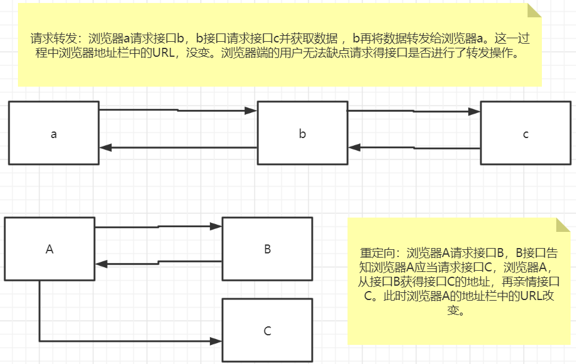

##### 4、读取资源文件

Properties文件

- 在java目录下创建
- 在resources目录下创建

都会被打包到classes路径，这个路径称为classpath。

info.properties文件

```properties
name=张三
age=18
sex=女
```

```java

public class GetPropertiesInfoServlet extends HttpServlet {

    @Override
    protected void doGet(HttpServletRequest req, HttpServletResponse resp) throws ServletException, IOException {
        //读取资源文件
        InputStream is = this.getServletContext().getResourceAsStream("WEB-INF/classes/info.properties");
        Properties prop = new Properties();
        prop.load(is);
        String name = prop.getProperty("name");
        int age = Integer.valueOf(prop.getProperty("age"));
        String sex = prop.getProperty("sex");
        resp.getWriter().print("name:"+name+" age:"+age+" sex:"+sex);
    }

    @Override
    protected void doPost(HttpServletRequest req, HttpServletResponse resp) throws ServletException, IOException {
        doGet(req, resp);
    }
}
```

### 6.6 HttpServletResponse

**HttpServletResponse：**响应客户端请求信息的对象。

**HttpServletRequest：**客户端请求信息对象。

这两个对象是web服务器处理客户端请求的两个对象。

#### 1、分类

##### 向浏览器发送数据的方法

```java
ServletOutputStream getOutputStream() throws IOException;

PrintWriter getWriter() throws IOException;
```

##### 向浏览器发送响应头的方法

```java
//设置字符集
void setCharacterEncoding(String var1);

void setContentLength(int var1);

void setContentLengthLong(long var1);
//设置类型
void setContentType(String var1);

void setDateHeader(String var1,long var2);

void addDateHeader(String var1,long var2);

void setHeader(String var1,String var2);

void addHeader(String var1,String var2);

void setIntHeader(String var1,int var2);

void addIntHeader(String var1,int var2);
```

##### 响应的状态码

```java
int SC_CONTINUE = 100;
int SC_SWITCHING_PROTOCOLS = 101;
int SC_OK = 200;
int SC_CREATED = 201;
int SC_ACCEPTED = 202;
int SC_NON_AUTHORITATIVE_INFORMATION = 203;
int SC_NO_CONTENT = 204;
int SC_RESET_CONTENT = 205;
int SC_PARTIAL_CONTENT = 206;
int SC_MULTIPLE_CHOICES = 300;
int SC_MOVED_PERMANENTLY = 301;
int SC_MOVED_TEMPORARILY = 302;
int SC_FOUND = 302;
int SC_SEE_OTHER = 303;
int SC_NOT_MODIFIED = 304;
int SC_USE_PROXY = 305;
int SC_TEMPORARY_REDIRECT = 307;
int SC_BAD_REQUEST = 400;
int SC_UNAUTHORIZED = 401;
int SC_PAYMENT_REQUIRED = 402;
int SC_FORBIDDEN = 403;
int SC_NOT_FOUND = 404;
int SC_METHOD_NOT_ALLOWED = 405;
int SC_NOT_ACCEPTABLE = 406;
int SC_PROXY_AUTHENTICATION_REQUIRED = 407;
int SC_REQUEST_TIMEOUT = 408;
int SC_CONFLICT = 409;
int SC_GONE = 410;
int SC_LENGTH_REQUIRED = 411;
int SC_PRECONDITION_FAILED = 412;
int SC_REQUEST_ENTITY_TOO_LARGE = 413;
int SC_REQUEST_URI_TOO_LONG = 414;
int SC_UNSUPPORTED_MEDIA_TYPE = 415;
int SC_REQUESTED_RANGE_NOT_SATISFIABLE = 416;
int SC_EXPECTATION_FAILED = 417;
int SC_INTERNAL_SERVER_ERROR = 500;
int SC_NOT_IMPLEMENTED = 501;
int SC_BAD_GATEWAY = 502;
int SC_SERVICE_UNAVAILABLE = 503;
int SC_GATEWAY_TIMEOUT = 504;
int SC_HTTP_VERSION_NOT_SUPPORTED = 505;
```

#### 2、下载文件

###### 步骤：

1. 获取下载文件的路径
2. 下载的文件名称
3. 设置浏览器下载支持
4. 获取下载文件输入流
5. 创建缓冲区
6. 获取OutputStream对象
7. 将FileOutputStream流写入到buffer缓冲区
8. 使用OutputStream将缓冲区中的数据输出到客户端

###### 代码实现

```java

```

#### 3、验证码功能

- 前端实现

- 后端实现，需要Java的图片类，生产一个图片。

###### 代码实现

```java

```

#### 4、重定向

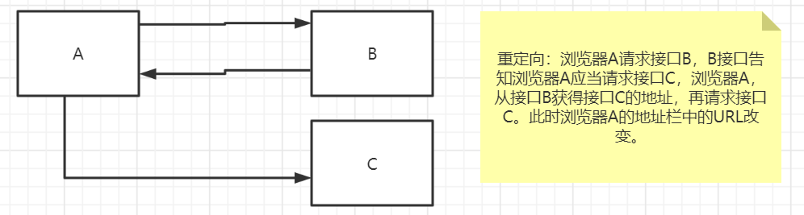

###### 常见场景

- 用户登录

  ```java
  void sendRedirect(String var1) throws IOException;
  ```

###### 测试

```java

```

##### 重定向和转发的区别

###### 相同点

页面都会实现跳转。

###### 不同点

- 请求转发时，URL不会产生变化。状态码：307
- 重定向时，URL会发生变化。状态码：302

#### 5、简单实现登录重定向

jsp页面

```jsp

```

servlet类

```java

```

web.xml配置

```xml

```

登录返回页面

```jsp

```

### 6.7 HttpServletRequest

HttpServletRequest：代表客户端请求，用户通过HTTP协议访问web服务器时，HTTP请求中的所有信息封装到HttpServletRequest对象中去，通过HttpServletRequest对象的方法，获得客户端的所有信息。

```java

```

#### 获取参数，请求转发

获取参数的方法

```java

```

程序示例

```java

```

## 7. Cookie、Session

### 7.1 会话

**会话：**用户打开一个浏览器，点击了很多超链接，访问多个web资源，关闭浏览器，这个过程称为会话。

**有状态会话：**一个用户访问过某个网站，网站通过某种技术，标记该用户，下次再访问时，回知道该用户使用该网站，称为有状态会话。

**标记或记录用户的技术：**

- 服务端给客户端(浏览器)一个“信件”，客户端下次访问服务端带上信件就可以了；→ **cookie**
- 服务器登记某个用户来过了，下次某个用户来的时候匹配它；→ **seesion**

### 7.2 保存会话的两种技术

#### cookie

客户端技术（响应，请求）

#### session

服务器技术，利用这个技术，可以保存用户的会话信息（可以把信息或者数据缓存再session中）。

如：网站登录之后，下次不用再登录了，第二次访问直接就可以进入了。

### 7.3 Cookie


### 7.4 Session ⭐

