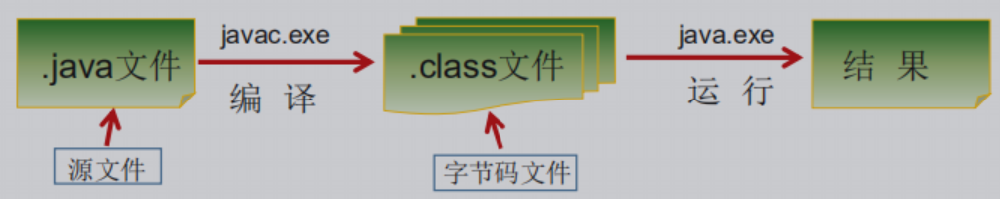

[TOC]

# Java语言概述

> 1995年	SUN（Stanford University Network，斯坦福大学网络公司）推出的一门高级编程语言。
>
> 面向Internet的编程语言

### Java简史

- 1991年 Green项目，开发语言最初命名为Oak (橡树) 
- 1994年，开发组意识到Oak 非常适合于互联网
- 1996年，发布JDK 1.0，约8.3万个网页应用Java技术来制作
- 1997年，发布JDK 1.1，JavaOne会议召开，创当时全球同类会议规模之最
- 1998年，发布JDK 1.2，同年发布企业平台J2EE
- 1999年，Java分成J2SE、J2EE和J2ME，JSP/Servlet技术诞生
- 2004年，发布里程碑式版本：JDK 1.5，为突出此版本的重要性，更名为JDK 5.0
- 2005年，J2SE -> JavaSE，J2EE -> JavaEE，J2ME -> JavaME
- 2009年，Oracle公司收购SUN，交易价格74亿美元
- 2011年，发布JDK 7.0
- 2014年，发布JDK 8.0，是继JDK 5.0以来变化最大的版本
- 2017年，发布JDK 9.0，最大限度实现模块化
- 2018年3月，发布JDK 10.0，版本号也称为18.3
- 2018年9月，发布JDK 11.0，版本号也称为18.9

### Java技术体系平台

**Java SE（Java Standard Edition）标准版** ：支持面向桌面级应用，提供完整的Java核心API，也被称为J2SE。

**Java EE（Java Enterprise Edition）企业版：** 为开发企业环境下的应用程序提供一套解决方案。技术体系包括：Servlet、Jsp等，主要针对Web应用程序开发。

**Java ME（Java Micro Edition）小型版：** 移动端的平台，对Java API有所精简，并加入针对移动端的支持。

Java Card：Java小程序（Applets）运行在小内存设备（如智能卡）上的平台。

### Java在各领域的应用

- Java Web开发：后台开发
- 大数据开发
- Android应用程序开发：客户端开发

### Java语言的诞生

### Java语言的主要特性

- 易学的（相对于C或C++)
- 强制面向对象的
- 分布式的
- 健壮的
- 安全的
- 体系结构中立的
- 解释型的
- 性能略高的
- 原生支持多线程的

## Java程序运行机制及运行过程

### Java语言的特点

1. **面向对象**

   - 两个基本概念：类、对象
   - 三大特性：封装、继承、多态

2. **健壮性**

   吸收C/C++语言的优点，去掉影响健壮性的部分（指针、内存的申请与释放等），提供了一个相对安全的内存管理和访问机制。

   **注意：** *Java程序仍然会出现内存溢出、内存泄漏。*

3. **跨平台性**

   
   
   **Java核心机制：** Java虚拟机、垃圾收集机制

**Java虚拟机**

> JVM是一个虚拟的计算机，具有指令集并使用不同的存储区域。负责执行指令，管理数据、内存、寄存器。


**垃圾回收**

垃圾回收在Java程序运行过程中自动进行，程序员无法精确控制和干预。

Java提供一种系统线程跟踪存储空间的分配情况。并在JVM空闲时，检查并释放哪些可被释放的存储空间。

## Java语言环境搭建

- 下载JDK

- 安装JDK

- 配置环境变量

  path：windows系统执行命令时要搜寻的路径

- 验证是否成功：javac  java

## JDK、JRE、JVM的关系

### JDK（Java Development Kit	Java开发工具包）

> 包含Java的开发工具包，也包括JRE。
>
> 开发工具：编译工具（javac.exe)	打包工具（jar.exe)等

### JRE（Java Runtime  Environment	Java运行环境）

> 包括Java虚拟机（JVM Java Virtual Machine）和Java程序所需的核心类库。

### JVM

> Java虚拟机 Java程序的运行环境


## Java API文档

http://www.oracle.com/technetwork/java/javase/downloads/index.html

## HelloWorld

```java
public class Test{
    public static void main(String[] args) {
    	System.out.println(“Hello World!”);
    } 
}
```

编译运行过程

