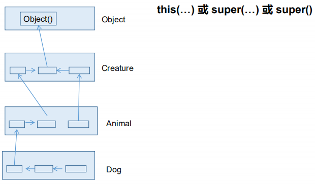
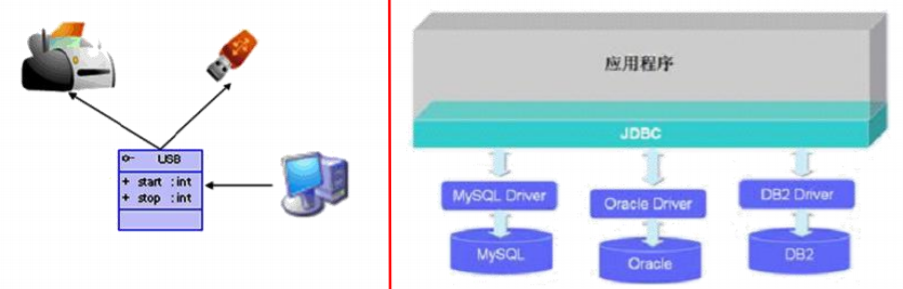

[TOC]


# 面向对象

## 面向对象编程

### 面向过程与面向对象

- 面向过程（POP   Procedure Oriented Programming）：强调功能行为，以函数为最小单位，考虑怎么做
- 面向对象（OOP  Object Oriented Programming）：强调具备功能的对象，以类/对象为最小单位，考虑谁来做

例如：

```Java
如何把大象装进冰箱
1、面向过程
    ①打开冰箱门
    ②将大象放进冰箱
    ③关上冰箱门
 2、面向对象
    人{
		开启(冰箱){
            冰箱.开门();
        }
    	抬起(大象){
            大象.进入(冰箱);
        }
    	关闭(冰箱){
            冰箱.关门();
        }
    }
	冰箱{
        开门(){}
        关门(){}
    }
	大象{
        进入(冰箱){}
    }
```

> 面向对象学习的三大主线：
>
> 1. Java类及类的成员：属性、方法、构造器；代码块、内部类
> 2. 面向对象的三大特征：封装、继承、多态、（抽象）
> 3. 其它与之相关的关键字：this、super、static、final、abstract、interface、package、import等。

面向对象分析方法分析问题的思路和步骤：

- 根据问题需要，选择问题所针对的现实世界的实体。
- 从实体中寻找解决问题相关的属性和功能，这些属性和功能形成了概念世界中的类。
- 把抽象的实体用计算机语言进行描述，形成计算机世界中类的定义。
- 将类实例化成计算机世界中的对象。

### 类和对象

#### 类（Class）和对象（Object）是面向对象的核心概念

- 类是对一类事物的描述，是抽象的、概念上的定义
- 对象是实际存在的该类事务的每个个体，也称为实例

> 面向对象程序设计的重点是类的设计
>
> 设计类，就是设计类的成员

##### 类和对象之间的关系

对象，是由类new出来的，派生出来的。

#### Java类及类的成员

##### 类的语法格式

```Java
修饰符 class 类名 {
    属性声明;
    方法声明; 
}
说明：修饰符public：类可以被任意访问
类的正文要用{ }括起来
```

**自定义类的步骤**

1. 定义类（考虑修饰符、类名）
2. 编写类的属性（考虑修饰符、属性类型、属性名、初始化值）
3. 编写类的方法（考虑修饰符、返回值类型、方法名、形参等）

##### **类的成员**

- **属性 = 成员变量 = field = 域、字段**
- **方法 = 成员方法 = 函数 = method**

```Java
class Person{
    //属性
    String name;
    int age;
    boolean isMale;
    //方法
    public void walk(){
        System.out.println("走路！");
    }
}
```

###### 类的成员构成（完整）

```Java
class Person {
	//属性
    String name;
    boolean isMarried;
    //构造器
    public Person(){}
    public Person(String n,boolean im){
        this.name = n;
        this.isMarried=im;
    }
    //方法
    public void walk(){
        System.out.println("走路");
    }
    //代码块
    {
        name = "张三";
        isMarried = true;
    }
    //内部类
    class Pet{
        String name;
        float weight;
    }
}
```


### 对象的创建和使用

> **创建对象语法：** **类名 对象名** **= new** **类名**();
>
> 使用**“对象名**.**对象成员”**的方式访问对象成员（包括属性和方法）

**说明：**如果创建了一个类的多个对象，则每个对象都独立的拥有一套类的属性。（非static的）
意味着：如果我们修改一个对象的属性a，则不影响另外一个对象属性a的值

#### 类的访问机制

1. 类中：方法可以直接访问类中的成员变量。（例外：static方法访问static，编译不通过。)
2. 不同类中：**先创建要访问类的对象，再用对象访问类中定义的成员**

#### 对象的内存解析

##### 对象的产生

> 类是描述其对象的属性和行为，但并没有实质上产生对象，**只有通过new关键字才会出现对象**，系统才会分配内存给它，它的方法才可以被外部调用。


##### 对象的使用


##### 对象的生命周期


示例


###### 对象数组的内存解析


#### JVM内存结构


- 堆（Heap），此内存区域的唯一目的就是存放对象实例，几乎所有的对象实例都在这里分配内存。这一点在Java虚拟机规范中的描述是：所有的对象实例以及数组都要在堆上分配。

- 通常所说的栈（Stack），是指虚拟机栈。虚拟机栈用于存储局部变量等。

  局部变量表存放了编译期可知长度的各种基本数据类型（boolean、byte、char 、 short 、 int 、 float 、 long 、double）、对象引用（reference类型它不等同于对象本身，是对象在堆内存的首地址）。 方法执行完，自动释放

- 方法区（Method Area），用于存储已被虚拟机加载的类信息、常量、静态变量、即时编译器编译后的代码等数据。

#### 匿名对象

创建的对象，没显式的赋给一个变量名。即为匿名对象

特点：匿名对象只能调用一次。

```Java
new Phone().sendEmail();
```

#### 面向对象思想落地实现的规则一

1. 创建类，设计类的成员
2. 创建类的对象
3. 通过“对象.属性”或“对象.方法”调用对象的结构

**注意：** 创建类的对象 = 类的实例化 = 实例化类

### 类的结构：属性

#### 语法格式：

**修饰符** **数据类型** **属性名** **=** **初始化值** **;**

1. 修饰符

   - 常用权限修饰符：private、缺省、protected、public
   - 其他修饰符：static、final

2. 数据类型

   基本数据类型 或 引用数据类型

3. 属性名 （符合命名规则和规范即可）

#### 成员变量（属性）与局部变量

##### 变量的分类

- 所有变量
  - 成员变量
    - 实例变量（非static修饰）
    - 类变量（static修饰）
  - 局部变量
    - 形参（方法、构造器中定义的变量）
    - 方法局部变量（方法内定义）
    - 代码块局部变量（代码块内定义）

##### 相同性质

都有生命周期

##### 区别

|              | 成员变量                         | 局部变量                              |
| ------------ | -------------------------------- | ------------------------------------- |
| 声明的位置   | 直接声明在类中                   | 方法形参或内部、代码块内、构造器内等  |
| 修饰符       | private、public、static、final等 | 不能用权限修饰符修饰，可以用final修饰 |
| 初始化值     | 有                               | 无，必须显式赋值，方可使用            |
| 内存加载位置 | 堆空间或静态域内                 | 栈空间                                |

##### 属性的默认初始化值

| 成员变量类型 | 初始值                  |
| ------------ | ----------------------- |
| byte         | 0                       |
| short        | 0                       |
| int          | 0                       |
| long         | 0L                      |
| float        | 0.0F                    |
| double       | 0.0                     |
| char         | 0或：‘\u0000’(表现为空) |
| boolean      | false                   |
| 引用类型     | null                    |

### 类的结构：方法

1. 方法是类或对象行为特征的抽象，用来完成某个功能操作。在某些语言中也称为函数或过程。
2. 将功能封装为方法的目的是，可以实现代码重用，简化代码
3. Java里的方法不能独立存在，所有的方法必须定义在类里。

#### 语法

```java
修饰符	返回值类型 方法名(参数类型 形参1，参数类型 形参2，....){
	方法体程序代码
	return	返回值；
}
```

修饰符：public,缺省,private, protected等

返回值类型：

- 没有返回值：void
- 有返回值，声明返回值的类型。与方法体内的“return 返回值”搭配使用

方法名：遵循标识符命名规范，尽量做到"见名知意"

#### 分类

|        | 无返回值                | 有返回值                      |
| ------ | ----------------------- | ----------------------------- |
| 无形参 | void 方法名(){}         | 返回值类型 方法名(){}         |
| 有形参 | void 方法名(形参列表){} | 返回值类型 方法名(形参列表){} |

#### 方法的调用

通过方法名被调用，且只有被调用才会执行。

##### 方法调用过程分析


**注意：**

- 方法被调用一次，就执行一次
- 没有返回值，返回值类型用void关键字代替，方法体中可不用return语句。若使用，仅用来结束方法。
- 方法的结果应该返回给调用者，交由调用者处理
- 方法中只能调用方法或属性，不可在方法内部定义方法

#### 方法的重载

##### 概念

在同一个类中，允许存在一个以上的同名方法，但它们的参数个数或参数类型不同即可。

##### 特点

与返回值类型无关，只看参数列表，且参数列表必须不同。（参数个数或参数类型）。调用时，根据方法参数列表的不同来区别。

示例

```Java
int add(int x,int y){return x+y;}
int add(int x,int y,int z){return x+y+z;}
double add(double x,double y){return x+y;}
```

*拓展：* 方法名+参数个数+参数类型 = 方法的签名

#### 可变个数的形参

> JavaSE 5.0中提供了Varargs(variable number of argumentd)机制，允许直接定义能和多个实参相匹配的形参。从而，可以用一种简单的方式，来传递个数可变实参。

##### 声明格式

```Java
//方法名(参数的类型名 ...参数名){}
public static void test(int a ,String…books);
```

**说明：**

1. 可变参数：方法参数部分指定类型的参数个数是可变多个（0，1或n）
2. 可变个数形参的方法与同名的方法之间，彼此构成重载
3. 可变参数方法的使用与方法参数部分使用数组是一致的
4. 方法的参数部分有可变形参，需要放在形参声明的最后
5. 在一个方法的形参位置，最多只能声明一个可变个数形参

#### 方法参数的值传递机制 ⭐

- **形参：** 方法声明时的参数
- **实参：**方法调用实际传给形参的参数值

##### 值传递

将实际参数值的副本（复制品）传入方法内，而参数本身不受影响。**Java方法的参数传递方式只有这一种。**

##### 根据传递数据类型的不同分类

- 基本数据类型：将实参基本数据类型变量的“数据值”传递给形参
- 引用数据类型：将实参引用数据类型变量的“地址值”传递给形参

###### 基本数据类型的参数传递过程的内存分析

```Java
public static void main(String[] args) {
    int x = 5;
    System.out.println("修改之前x = " + x);// 5
    // x是实参
    change(x);
    System.out.println("修改之后x = " + x);// 5
}
public static void change(int x) {
    System.out.println("change:修改之前x = " + x);
    x = 3;
    System.out.println("change:修改之后x = " + x);
}
```


###### 引用数据类型的参数传递过程的内存分析

```Java
public static void main(String[] args) {
    Person obj = new Person();
    obj.age = 5;
    System.out.println("修改之前age = " + obj.age);// 5
    // x是实参
    change(obj);
    System.out.println("修改之后age = " + obj.age);// 3
}
public static void change(Person obj) {
    System.out.println("change:修改之前age = " + obj.age);
    obj.age = 3;
    System.out.println("change:修改之后age = " + obj.age);
}

class Person{
    int age; 
}
```


```Java
public static void main(String[] args) {
    Person obj = new Person();
    obj.age = 5;
    System.out.println("修改之前age = " + obj.age);// 5
    // x是实参
    change(obj);
    System.out.println("修改之后age = " + obj.age);// 3
}
public static void change(Person obj) {
    obj = new Person();
    System.out.println("change:修改之前age = " + obj.age);
    obj.age = 3;
    System.out.println("change:修改之后age = " + obj.age);
}

class Person{
    int age; 
}
```


#### 递归方法

一个方法体内调用它自身

- 一种隐式循环
- 递归一定要向已知方法递归，否则会变成无穷递归。

### 面向对象的特征：封装与隐藏

**程序设计的追求：**

- 高内聚：类的内部数据操作细节自己完成，不允许外部干涉
- 低耦合：仅对外暴露少量的方法用于使用

#### 封装的作用及含义

隐藏对象内部的复杂性，只对外公开简单的接口。提高系统的可扩展性、可维护性。（即该隐藏的隐藏，该暴露的暴露。）

#### 信息的封装和隐藏

Java中通过将数据声明为私有的(private)，再提供共公的(public)方法：getXxx()和setXxx()实现对该属性的操作，以实现如下目的：

- 隐藏一个类中不需要对外提供的实现细节；

- 使用者只能通过事先定制好的方法来访问数据，可以方便地加入控制逻辑，

  限制对属性的不合理操作；

- 便于修改，增强代码的可维护性；

#### 四种访问权限修饰符

| 修饰符    | 类内部 | 同一个包 | 不同的子类 | 同一个工程 |
| --------- | ------ | -------- | ---------- | ---------- |
| private   | √      |          |            |            |
| （缺省）  | √      | √        |            |            |
| protected | √      | √        | √          |            |
| public    | √      | **√**    | √          | √          |

**注意：** class的权限修饰只能用public和default（缺省）

### 类的成员：构造器（或构造方法）

#### 特征

- 与类相同的名称
- 不声明返回值类型
- 不能被static、final、synchronized、abstract、native修饰，不能用return语句返回值

#### 作用

创建对象；给对象进行初始化

#### 语法格式

```Java
修饰符 类名(参数列表){
	初始化语句;
}
```

**构造器分类**

- 隐式无参构造器（系统默认提供）
- 显式定义一个或多个构造器（无参、有参）

**注意：**

- Java语言中，每个类都至少有一个构造器
- 默认构造器的修饰符与所属类一致
- 显示定义了构造器，系统将不再提供默认构造器
- 一个类可创建多个重载的构造器
- 父类的构造器不可被子类继承

**构造器重载，参数列表必须不同。**

```Java
public class Person { 
    private String name;
    private int age;
    private Date birthDate;
    public Person(String n, int a, Date d) {
        name = n;
        age = a;
        birthDate = d; 
    }
    public Person(String n, int a) {
        name = n;
        age = a; 
    }
    public Person(String n, Date d) {
        name = n;
        birthDate = d; 
    }
    public Person(String n) {
        name = n;
        age = 30;
    } 
}
```

### 总结：属性赋值过程

- 赋值的位置

  1. 默认初始化
  2. 显示初始化
  3. 构造器中初始化
  4. 通过“对象.属性”或“对象.方法”的方式赋值

- 赋值的先后顺序

  1 → 2 → 3 → 4

### JavaBean

Java语言编写的可重用组件

**JavaBean标准：**

- 类是公共的
- 有一个无参的公共的构造器
- 有属性，且有对应的get、set

```Java
public class JavaBean {
    private String name; // 属性一般定义为private
    private int age;
    public JavaBean() {
    }
    public int getAge() { return age; }
    public void setAge(int a) { age = a; }
    public String getName() { return name; }
    public void setName(String n) { name = n; } 
}
```

### **关键字：this**

- 在方法内部使用，是该方法所属对象的引用
- 构造器内使用，表示该构造器正在初始化的对象

#### 使用this,调用属性、方法

1. 在任意方法或构造器内，如果使用当前类的成员变量或成员方法可以在其前面添加this，增强程序的阅读性。但通常都省略this。
2. 当形参与成员变量同名时，如果在方法内或构造器内需要使用成员变量，必须添加this来表明该变量是类的成员变量
3. 使用this访问属性和方法时，如果在本类中未找到，会从父类中查找

#### 使用this调用本类的构造器

- 构造器中不能通过"this(形参列表)"的方式调用自身构造器
- 如果一个类中声明了n个构造器，则最多有 n - 1个构造器中使用了"this(形参列表)"
- "this(形参列表)"必须声明在类的构造器的首行！
- 在类的一个构造器中，最多只能声明一个"this(形参列表)"

### 关键字：package

package语句作为Java源文件的第一条语句，指明该文件中定义的类所在的包。(若缺省该语句，则指定为无名包)。它的格式为：**package** **顶层包名**.**子包名** **;**

- **包对应于文件系统的目录，**package语句中，用 “.” 来指明包(目录)的层次；
- **包通常用小写单词标识。**

**作用：**

- 包帮助管理大型软件系统：将功能相近的类划分到同一个包中。
- 包可以包含类和子包，划分项目层次，便于管理
- 解决类命名冲突的问题
- 控制访问权限

#### JDK中主要的包介绍

**1. java.lang****----**包含一些Java语言的核心类，如String、Math、Integer、System和Thread，提供常用功能

**2. java.net****----**包含执行与网络相关的操作的类和接口。

**3. java.io** **----**包含能提供多种输入/输出功能的类。

**4. java.util****----**包含一些实用工具类，如定义系统特性、接口的集合框架类、使用与日期日历相关的函数。

**5. java.text****----**包含了一些java格式化相关的类

**6. java.sql****----**包含了java进行JDBC数据库编程的相关类/接口

**7. java.awt****----**包含了构成抽象窗口工具集（abstract window toolkits）的多个类，这些类被用来构建和管理应用程序的图形用户界面(GUI)。 B/S C/S

### MVC设计模式

> 常用的设计模式之一，将整个程序分为三个层次：视图模型层，控制器层，与数据模型层。这种将程序输入输出、数据处理，以及数据的展示分离开来的设计模式使程序结构变的灵活而且清晰，同时也描述了程序各个对象间的通信方式，降低了程序的耦合性。

**模型层** **model** **主要处理数据**

- 数据对象封装 model.bean/domain
- 数据库操作类 model.dao
- 数据库 model.db

**控制层** **controller** **处理业务逻辑**

- 应用界面相关 controller.activity
- 存放fragment controller.fragment
- 显示列表的适配器 controller.adapter
- 服务相关的 controller.service
- 抽取的基类 controller.base

**视图层** **view** **显示数据**

- 相关工具类 view.utils
- 自定义view view.ui

### 关键字：import

**语法格式：** **import** **包名.类名;** 

**注意：**

1. 在源文件中使用import显式的导入指定包下的类或接口

2. 声明在包的声明和类的声明之间。

3. 如果需要导入多个类或接口，那么就并列显式多个import语句即可

4. 举例：可以使用java.util.*的方式，一次性导入util包下所有的类或接口。

5. 如果导入的类或接口是java.lang包下的，或者是当前包下的，则可以省略此import语句。

6. 如果在代码中使用不同包下的同名的类。那么就需要使用类的全类名的方式指明调用的是哪个类。

7. 如果已经导入java.a包下的类。那么如果需要使用a包的子包下的类的话，仍然需要导入。

8. import static组合的使用：调用指定类或接口下的静态的属性或方法

### 面向对象的特征：继承性

#### 语法规则

```Java
//Subclass 子类 
//extends 继承关键字
//SuperClass 父类、超类、基类 被继承的类
class Subclass extends SuperClass{}
```

#### 作用

- 减少代码冗余，提高代码的复用性
- 利于功能扩展
- 让类之间产生了关系，提供了多态的前提

**注意：** 不要仅为了获取其他类中的某个功能而去继承。


#### 说明

- 子类继承了父类，就继承了父类的方法和属性
- 子类中，可以使用父类中定义的方法和属性，也可以创建新的数据和方法
- 继承关键字 **extends** ，子类不是父类的子集，而是对父类的扩展。

#### 规则

- 子类不能直接访问父类中私有的（private）的成员变量和方法。
- **Java只支持单继承和多重继承，不允许多重继承**
  - 一个类只能有一个父类
  - 一个父类可以派生出多个子类


这里的Person类是Graduate类的间接父类。

### 方法的重写（override/overwrite)

#### 定义

在子类中可以根据需要对从父类中继承来的方法进行改造，也称为方法的重置、覆盖。在程序执行时，子类的方法将覆盖父类的方法。

#### 规则

1. 重写的方法必须和父类被重写的方法**具有相同的方法名称、参数列表**
2. 重写的方法的**返回值类型不能大于**父类被重写的方法的返回值类型
   - 返回值类型是void，则子类重写的方法的返回值类型只能是void
   - 返回值类型是A类型，则子类重写的方法的返回值类型可以是A类或A类的子类
   - 返回值类型是基本数据类型(比如：double)，则子类重写的方法的返回值类型必须是相同的基本数据类型(必须也是double)
3. 重写的方法使用的**访问权限不能小于**父类被重写的方法的访问权限
   - **不能重写父类中声明为private权限的方法**
4. 子类重写的方法**抛出的异常不能大于**父类被重写方法的异常

**注意：** 子类与父类中同名同参数的方法必须同时声明为非static的(即为重写)，或者同时声明为static的（不是重写）。因为static方法是属于类的，子类无法覆盖父类的方法。

**示例**

```Java
class Parent {
	public void method1() {}
}
class Child extends Parent {
    //非法，子类中的method1()的访问权限private比被覆盖方法的访问权限public小
    private void method1() {} 
}
public class UseBoth {
	public static void main(String[] args) {
        Parent p1 = new Parent();
        Child c1 = new Child();
        p1.method1();
        c1.method1();
    } 
}
```

```Java
public class Person {
    public String name;
    public int age;
    public String getInfo() {
    	return "Name: "+ name + "\n" +"age: "+ age;
    } 
}
public class Student extends Person {
	public String school;
    public String getInfo() { //重写方法
        return "Name: "+ name + "\nage: "+ age 
        + "\nschool: "+ school;
    }
    public static void main(String args[]){
        Student s1=new Student();
        s1.name="Bob";
        s1.age=20;
        s1.school="school2";
        System.out.println(s1.getInfo()); //Name:Bob age:20 school:school2
    } 
}
```

###### 多态性体现

```Java
Person p1=new Person();
//调用Person类的getInfo()方法
p1.getInfo();
Student s1=new Student();
//调用Student类的getInfo()方法
s1.getInfo();
//这是一种“多态性”：同名的方法，用不同的对象来区分调用的是哪一个方法。
```


### 关键字：super

- 访问父类中定义的属性
- 调用父类中定义的成员方法
- 在子类构造器中调用父类的构造器

**注意：** super的追溯不仅限于直接父类

#### 调用父类的构造器

- 子类中所有的构造器**默认**都会访问父类中**空参数**的构造器
- 当父类中没有空参数的构造器时，子类的构造器必须通过**this(参数列表)或者super(参数列表)**语句指定调用本类或者父类中相应的构造器。同时，只能”二选一”，且必须放在构造器的首行
- 如果子类构造器中既未显式调用父类或本类的构造器，且父类中又没有无参的构造器，则**编译出错**

```Java
public class Person {
    private String name;
    private int age;
    private Date birthDate;
    public Person(String name, int age, Date d) {
        this.name = name;
        this.age = age;
        this.birthDate = d; 
    }
    public Person(String name, int age) {
    	this(name, age, null);
    }
    public Person(String name, Date d) {
    	this(name, 30, d);
    }
    public Person(String name) {
    	this(name, 30);
    } 
}

public class Student extends Person {
    private String school;
    public Student(String name, int age, String s) {
        super(name, age);
        school = s; 
    }
    public Student(String name, String s) {
        super(name);
        school = s; 
    }
    // 编译出错: no super(),系统将调用父类无参数的构造器。
    public Student(String s) { 
    	school = s; 
    } 
}
```

#### this和super的区别

| 区别点     | this                                         | super                                    |
| ---------- | -------------------------------------------- | ---------------------------------------- |
| 访问属性   | 访问本类中的属性，如果没有则从父类中继续查找 | 直接访问父类                             |
| 调用方法   | 访问本类中的方法，如果没有则从父类中继续查找 | 直接访问父类中的方法                     |
| 调用构造器 | 调用本类构造器，必须放在构造器的首行         | 调用父类构造器，必须放在子类构造器的首行 |

### 子类对象实例化过程


1. 结果上看：继承性

   - 子类继承父类以后，就获取了父类中声明的属性或方法。
   - 创建子类的对象，在堆空间中，就会加载所父类中声明的属性。

2. 从过程上看：

   当通过子类的构造器创建子类对象时，一定会直接或间接的调用其父类的构造器，进而调用父类的父类的构造器，...直到调用了java.lang.Object类中空参的构造器为止。正因为加载过所的父类的结构，所以才可以看到内存中父类中的结构，子类对象才可以考虑进行调用。

内存变化过程




**特别注意：** 虽然创建子类对象时，调用了父类的构造器，但是自始至终就创建过一个对象，即为new的子类对象。

### 面向对象特征：多态性

- 多态性，是面向对象的重要概念，Java中体现在：**对象的多态性：父类的引用指向子类的对象** (可以应用在抽象类和接口上)

  - 一个变量只能有一种确定的数据类型
  - 一个引用类型变量可能指向（引用）多种不同类型的对象

  ```Java
  Person p = new Student();
  Object o = new Person();//Object类型的变量o，指向Person类型的对象
  o = new Student(); //Object类型的变量o，指向Student类型的对象
  ```

  **子类可看做是特殊的父类，所以父类类型的引用可以指向子类的对象：向上转型(upcasting)**

- Java引用变量的两个类型

  - **编译时类型：** 由声明改变量时使用的类型决定。“看左边”→父类的引用
  - **运行时类型：** 由实际赋给该变量的对象决定。“看右边”→子类的对象

#### 虚拟方法调用 （Virtual Method Invocation）

编译期，只能调用父类中声明的方法，但在运行期，实际执行的是子类重写父类的方法。

```Java
Person e = new Student();
e.getInfo(); //调用Student类的getInfo()方法
```

**编译时e为Person类型，而方法的调用是在运行时确定的，所以调用的是Student类的getInfo()方法。——动态绑定**

**注意：** 此时变量e不能再访问子类中添加的属性（属性是再编译时确定的）和方法。

#### 从编译和运行的角度分析：方法的重载与重写

重载：是指允许存在多个同名方法，而这些方法的参数不同。编译器根据方法不同的参数表对同名方法的名称做修饰，它们的调用地址在编译期就绑定了。（Java的重载包括父类和子类，即子类可以重载父类的同名不同参数的方法）**方法调用之前，编译器就确定了要调用的方法**，称为**“静态绑定”或“早绑定”。**

重写：对于被重写方法（多态），**只有等到方法调用时，解释器才会确定调用的具体方法**，这称为**“动态绑定”或“晚绑定”**。

##### 重载：不表现为多态性

##### 重写：表现为多态性

#### 多态作用

提高了代码的通用性，常称为接口重用。

#### 使用多态的前提

- 需要存在继承或者实现关系
- 有方法的重写

#### 成员方法

- 编译时：查看引用变量所声明的类中是否有所调用的方法
- 运行时：调用实际new的对象所属的类中的重写方法

#### 成员变量（属性）

不具备多态性，只看引用变量所声明的类

#### instanceof操作符

**x instanceof A：检验x是否为类A的对象（实例），返回值为boolean型。**

- 要求x所属的类与类A必须是子类和父类的关系，否则编译错误。
- 如果x属于类A的子类B，x instanceof A值也为true。

#### 对象类型转换（Casting）

**对Java对象的强制类型转换称为造型**

- 子类到父类自动进行
- 父类到子类必须通过造型（强制类型转换）实现
- 无继承关系的引用类型间的转换是非法
- 造型前可使用instanceof操作符测试一个对象的类型


#### 子类继承父类

- 若子类重写了父类方法，就意味着子类里定义的方法彻底覆盖了父类里的 同名方法，系统将不可能把父类里的方法转移到子类中。
- 对于实例变量则不存在这样的现象，即使子类里定义了与父类完全相同的 实例变量，这个实例变量依然不可能覆盖父类中定义的实例变量

```Java
//面试题：多态是编译时行为还是运行时行为？
//证明如下：
class Animal  {
 
	protected void eat() {
		System.out.println("animal eat food");
	}
}

class Cat  extends Animal  {
 
	protected void eat() {
		System.out.println("cat eat fish");
	}
}

class Dog  extends Animal  {
 
	public void eat() {
		System.out.println("Dog eat bone");

	}

}

class Sheep  extends Animal  {
 

	public void eat() {
		System.out.println("Sheep eat grass");

	}

 
}

public class InterviewTest {

	public static Animal  getInstance(int key) {
		switch (key) {
		case 0:
			return new Cat ();
		case 1:
			return new Dog ();
		default:
			return new Sheep ();
		}

	}

	public static void main(String[] args) {
		int key = new Random().nextInt(3);

		System.out.println(key);

		Animal  animal = getInstance(key);
		
		animal.eat();
		 
	}

}

```

```Java
//考查多态的笔试题目：
public class InterviewTest1 {

	public static void main(String[] args) {
		Base base = new Sub();
		base.add(1, 2, 3);

//		Sub s = (Sub)base;
//		s.add(1,2,3);
	}
}

class Base {
	public void add(int a, int... arr) {
		System.out.println("base");
	}
}

class Sub extends Base {

	public void add(int a, int[] arr) {
		System.out.println("sub_1");
	}

//	public void add(int a, int b, int c) {
//		System.out.println("sub_2");
//	}

}
```

### java.lang.Object类

1. 如果我们没显式的声明一个类的父类的话，则此类继承于java.lang.Object类
2. 所有的java类（除java.lang.Object类之外都直接或间接的继承java.lang.Object类）[Object类是所有Java类的根父类]
3. 所有的Java类具有java.lang.Object类声明的功能。
4. Object类只声明了一个空参的构造器

#### Object类中的主要结构

| 方法名称                          | 类型 | 描述           |
| --------------------------------- | ---- | -------------- |
| public Object()                   | 构造 | 构造器         |
| public boolean equals(Object obj) | 普通 | 对象比较       |
| public int hashCode()             | 普通 | 取得Hash码     |
| public String toString()          | 普通 | 对象打印时调用 |

其他结构 见 Java API 内的说明

#### ==操作符与equals方法

##### ==

- 基本数据类型比较值：两个变量的值相等，为true
- 引用类型比较引用：只有指向同一个对象时，为true

**注意：** 比较时，符号两边的数据类型必须兼容（可自动转换的基本数据类型除外），否编译出错。

##### equals()方法

- Object 类中equals()的定义：

  ```Java
  public boolean equals(Object obj){
  	return (this == obj);
  }
  ```

  因为Object类是所有类的父类，因而其他类可以重写该方法。

  - 只能比较引用数据类型，与“==”作用相同，比较两个对象地址值是否相同，即两个引用是否指向同一对象实体。

  - 格式：

    ```Java
    obj1.equals(obj2)
    ```

- 特例：对类File、String、Date以及包装类（Wrapper Class）,equals()方法是比较类型及内容，而不是引用地址是否相同。因为这些类中重写了Object类的equals()方法。

###### 重写equals()方法的原则

- 对称性：如x.equals(y) ↔y.equals(x) 结果相同
- 自反性：x.equals(x) 结果必须为true
- 传递性：x.equals(y)为true，y.equals(z)为true，那么z.equals(x) 为true。
- 一致性： 如果x.equals(y)返回是“true” ，只要x和y内容一直不变，不管你 重复x.equals(y)多少次，返回都是“true”。
- x.equals(null)，永远返回是“false” ； x.equals(和x不同类型的对象)永远返回是“false”。

```Java
class User{
        String name;
        int age;
        //重写其equals()方法
        public boolean equals(Object obj){
            if(obj == this){
                return true;
            }
            if(obj instanceof User){
                User u = (User)obj;
                return this.age==u.age&&this.name.equals(u.name);
            }
            return false;
        }
}
```

#### toString()方法

- Object类中的toString()定义：

  ```Java
  public String toString() {
          return getClass().getName() + "@" + Integer.toHexString(hashCode());
  }
  ```

  输出的是对象的引用地址。

- 像String、Date、File、包装类等都重写了Object类中的toString()方法。使得在调用对象的toString()时，返回"实体内容"信息

- 在进行String与其它类型数据的连接操作时，自动调用toString()方法

- 基本类型数据转换为String类型时，调用了对应包装类的toString()方法

- 自定义类也可以重写toString()方法，当调用此方法时，返回对象的"实体内容"

```Java
	//自动实现
	@Override
	public String toString() {
		return "Customer [name=" + name + ", age=" + age + "]";
	}
```

#### clone()

```Java
//Object类的clone()的使用
public class CloneTest {
	public static void main(String[] args) {
		Animal a1 = new Animal("花花");
		try {
			Animal a2 = (Animal) a1.clone();
			System.out.println("原始对象：" + a1);
			a2.setName("毛毛");
			System.out.println("clone之后的对象：" + a2);
		} catch (CloneNotSupportedException e) {
			e.printStackTrace();
		}
	}
}

class Animal implements Cloneable{
	private String name;

	public Animal() {
		super();
	}

	public Animal(String name) {
		super();
		this.name = name;
	}

	public String getName() {
		return name;
	}

	public void setName(String name) {
		this.name = name;
	}

	@Override
	public String toString() {
		return "Animal [name=" + name + "]";
	}
	
	@Override
	protected Object clone() throws CloneNotSupportedException {
		// TODO Auto-generated method stub
		return super.clone();
	}
	
}
```

#### 垃圾回收

```Java
public class FinalizeTest {
	public static void main(String[] args) {
		Person p = new Person("Peter", 12);
		System.out.println(p);
		p = null;//此时对象实体就是垃圾对象，等待被回收。但时间不确定。
		System.gc();//强制性释放空间
	}
}

class Person{
	private String name;
	private int age;

	public Person(String name, int age) {
		super();
		this.name = name;
		this.age = age;
	}
	public String getName() {
		return name;
	}
	public void setName(String name) {
		this.name = name;
	}
	public int getAge() {
		return age;
	}
	public void setAge(int age) {
		this.age = age;
	}
	//子类重写此方法，可在释放对象前进行某些操作
	@Override
	protected void finalize() throws Throwable {
		System.out.println("对象被释放--->" + this);
	}
	@Override
	public String toString() {
		return "Person [name=" + name + ", age=" + age + "]";
	}
	
}

```

##### 垃圾回收机制关键点

> 垃圾回收机制只回收JVM堆内存里的对象空间。
>
>
> 对其他物理连接，比如数据库连接、输入流输出流、Socket连接无能为力
>
>
> 现在的JVM有多种垃圾回收实现算法，表现各异。
>
>
> 垃圾回收发生具有不可预知性，程序无法精确控制垃圾回收机制执行。
>
>
> 可以将对象的引用变量设置为null，暗示垃圾回收机制可以回收该对象。
>
>
> 程序员可以通过System.gc()或者Runtime.getRuntime().gc()来通知系统进行垃圾回收，会有
> 一些效果，但是系统是否进行垃圾回收依然不确定。
>
>
> 垃圾回收机制回收任何对象之前，总会先调用它的finalize方法（如果覆盖该方法，让一
> 个新的引用变量重新引用该对象，则会重新激活对象）。
>
>
> 永远不要主动调用某个对象的finalize方法，应该交给垃圾回收机制调用。

### 包装类（Wrapper）的使用

包装类使基本数据类型的变量具有类的特征。

#### 基本数据类型与对应的包装类


#### 包装类的转化（自动开装箱，转String）


JDK 5.0 的新特性：自动装箱、自动拆箱

**注意：转换时，可能会报NumberFormatException**

### 单元测试方法（Eclipse）

#### 步骤

1. 选中当前工程 - 右键择：build path - add libraries - JUnit 4 - 下一步

2. 创建Java类，进行单元测试。

   此时的Java类要求：① 此类是public的  ②此类提供公共的无参的构造器

3. 此类中声明单元测试方法。

   此时的单元测试方法：方法的权限是public,没返回值，没形参

4. 此单元测试方法上需要声明注解：@Test,并在单元测试类中导入：import org.junit.Test;

5. 声明好单元测试方法以后，就可以在方法体内测试相关的代码。

6. 写完代码以后，左键双击单元测试方法名，右键：run as - JUnit Test

#### 说明

1. 如果执行结果没任何异常：绿条
2. 如果执行结果出现异常：红条

### native 关键字标识原生（本地）方法(非Java实现的方法)

使用 native 关键字说明这个方法是原生函数，也就是这个方法是用 C/C++等非Java 语言实现的，并且被编译成了 DLL，由 java 去调用。

1. 为什么要用 native 方法

   有时 java 应用需要与 java 外面的环境交互。

   如java 需要与一些底层系统如操作系统或某些硬件交换信息时的情况。本地方法正是这样一种交流机制：

   它为我们提供了一个非常简洁的接口，而且我们无需去了解 java 应用之外的繁

   琐的细节。

2. native 声明的方法，对于调用者，可以当做和其他 Java 方法一样使用

   一个 native method 方法可以返回任何 java 类型，包括非基本类型，而且同样可

   以进行异常控制。

   native method 的存在并不会对其他类调用这些本地方法产生任何影响，实际上

   调用这些方法的其他类甚至不知道它所调用的是一个本地方法。JVM 将控制调用

   本地方法的所有细节。

   如果一个含有本地方法的类被继承，子类会继承这个本地方法并且可以用 java

   语言重写这个方法（如果需要的话）。

### 关键字：static （静态的）

#### 可修饰的结构

**属性、方法、代码块、内部类** （类的内部结构）

##### 被修饰后的成员具有的特性

- 随着类的加载而加载
- 优先于对象存在
- 修饰的成员，被所有对象所共享
- 访问权限允许时，可不创建对象，直接被类调用

#### 静态变量（类变量）

1. 属性分类

   - 实例变量（非static修饰）：每个对象都独立的拥一套类中的非静态属性。当某个对象修改该变量时，不会影响其他对象。
   - 静态变量（static修饰）：多个对象共享同一个静态变量。当某个对象修改该变量时，会影响其他对象。

2. 被static修饰的属性具有特性

   1. 随着类的加载而加载。可以通过"类.静态变量"的方式进行调用

   2. 加载要早于对象的创建。

   3. 由于类只会加载一次，则静态变量在内存中也只会存在一份：存在方法区的静态域中。

   4. 类和对象能否使用两种变量的情况

      |      | 类变量 | 实例变量 |
      | :--: | :----: | :------: |
      |  类  |   √    |    ×     |
      | 对象 |   √    |    √     |

      

##### 静态变量内存解析


#### 静态方法（类方法）

- 被static修饰

- 随着类的加载而加载，可以通过"类.静态方法"的方式进行调用

  - |      | 静态方法 | 非静态方法 |
    | :--: | :------: | :--------: |
    |  类  |    √     |     ×      |
    | 对象 |    √     |     √      |

- 静态方法中，只能调用静态的方法或属性

  非静态方法中，既可以调用非静态的方法或属性，也可以调用静态的方法或属性

- 在静态的方法内，不能使用this关键字、super关键字

#### 静态方法和静态属性在类的生命周期内而不是对象

#### 如何判定属性和方法应该使用static关键字？

1. 属性
   - 属性是可以被多个对象所共享的，不会随着对象的不同而不同的。
   - 类中的常量也常常声明为static
2. 方法
   - 操作静态属性的方法，通常设置为static的
   - 工具类中的方法，习惯上声明为static的。 比如：Math、Arrays、Collections

##### 单例模式

> 所谓类的单例设计模式，就是采取一定的方法保证在整个的软件系统中，对某个类只能存在一个对象实例。

###### 饿汉式1：

```Java
class Bank{
	
	//1.私化类的构造器
	private Bank(){
		
	}
	
	//2.内部创建类的对象
	//4.要求此对象也必须声明为静态的
	private static Bank instance = new Bank();
	
	//3.提供公共的静态的方法，返回类的对象
	public static Bank getInstance(){
		return instance;
	}
}

```

###### 饿汉式2：使用了静态代码块

```Java
class Order{
	
	//1.私化类的构造器
	private Order(){
		
	}
	
	//2.声明当前类对象，没初始化
	//4.此对象也必须声明为static的
	private static Order instance = null;

	static{
		instance = new Order();
 	}
	
	//3.声明public、static的返回当前类对象的方法
	public static Order getInstance(){
		return instance;
	}
	
}
```

###### 懒汉式：

```Java
class Order{
	
	//1.私化类的构造器
	private Order(){
		
	}
	
	//2.声明当前类对象，没初始化
	//4.此对象也必须声明为static的
	private static Order instance = null;
	
	//3.声明public、static的返回当前类对象的方法
	public static Order getInstance(){
		
		if(instance == null){
			
			instance = new Order();
			
		}
		return instance;
	}
	
}
```

###### 两种方式的对比：

- 饿汉式
  - 坏处：对象加载时间过长
  - 好处：饿汉式是线程安全的
- 懒汉式
  - 好处：延迟对象的创建。
  - 坏处（针对例子而言）：线程不安全。

###### 单例模式的优点

减少了系统性能开销，当一个对象的产生需要比较多的资源时，如读取配置、产生其他依赖对象时，则可以通过在应用启动时直接产生一个单例对象，然后永久驻留内存的方式来解决。

##### 设计模式

设计模式是在大量的实践中总结和理论化之后优的代码结构、编程风格、以及解决问题的思考方式。

###### 常用设计模式  --- 23种经典的设计模式  GOF

- **创建型模式，共5种：**工厂方法模式、抽象工厂模式、单例模式、建造者模式、原型模式。 
- **结构型模式，共7种：**适配器模式、装饰器模式、代理模式、外观模式、桥接模式、组合模式、享元模式。 
- **行为型模式，共11种：**策略模式、模板方法模式、观察者模式、迭代器模式、责任链模式、命令模式、备忘录模式、状态模式、访问者模式、中介者模式、解释器模式。

### main方法

- 由于Java虚拟机需要调用类的main()方法，所以该方法的访问权限必须是 public，又因为Java虚拟机在执行main()方法时不必创建对象，所以该方法必须 是static的，该方法接收一个String类型的数组参数，该数组中保存执行Java命令 时传递给所运行的类的参数。

  

- 又因为main() 方法是静态的，不能直接访问该类中的非静态成员，必须创建该类的一个实例对象后，才能通过这个对象去访问类中的非静态成员

### 类的成员：代码块

#### 作用

用来初始化类、对象的信息

#### 分类

代码块只能使用static修饰符

- 静态代码块（static修饰）
  - 内部可以输出语句
  - 随着类的加载而执行,而且只执行一次
  - 作用：初始化类的信息
  - 如果一个类中定义了多个静态代码块，则按照声明的先后顺序执行
  - 静态代码块的执行要优先于非静态代码块的执行
  - 静态代码块内只能调用静态的属性、静态的方法，不能调用非静态的结构
- 非静态代码块
  - 内部可以输出语句
  - 随着对象的创建而执行
  - 每创建一个对象，就执行一次非静态代码块
  - 作用：可以在创建对象时，对对象的属性等进行初始化
  - 如果一个类中定义了多个非静态代码块，则按照声明的先后顺序执行
  - 非静态代码块内可以调用静态的属性、静态的方法，或非静态的属性、非静态的方法

#### 程序中成员变量赋值的执行顺序


### 关键字：final

final关键字表示“最终的”

- **final标记的类不能被继承。** 提高安全性，提高程序的可读性。

  String类、System类、StringBuffer类

- **final标记的方法不能被子类重写。** 如：Object类中的getClass()；

- **final标记的变量（成员变量或全局变量）即称为常量。** 名称大写，且只能赋值一次

  - final标记的成员变量必须在声明时或在每个构造器中或代码中显式赋值，才能使用。如：final double PI = 3.14；
  - static final 修饰属性为：全局常量

```Java
public final class Test {
    public static int totalNumber = 5;
    public final int ID;
    public Test() {
        ID = ++totalNumber; // 可在构造器中给final修饰的“变量”赋值
    }
    public static void main(String[] args) {
        Test t = new Test();
        System.out.println(t.ID);
        final int I = 10;
        final int J;
        J = 20;
        J = 30; // 非法
    }
}
```

### 关键字：abstract

#### abstract修饰类：抽象类

- 不能实例化
- 抽象类中一定有构造器，便于子类实例化时调用（涉及：子类对象实例化的全过程）
- 开发中，都会提供抽象类的子类，让子类对象实例化，完成相关的操作 → 抽象的使用前提：继承性

##### 抽象类的应用

抽象类是用来模型化那些父类无法确定全部实现，而是由其子类提 供具体实现的对象的类。

```Java
public abstract class Vehicle{
    public abstract double calcFuelEfficiency(); //计算燃料效率的抽象方法
    public abstract double calcTripDistance(); //计算行驶距离的抽象方法
}
public class Truck extends Vehicle{
    public double calcFuelEfficiency( ) { //写出计算卡车的燃料效率的具体方法 }
    public double calcTripDistance( ) { //写出计算卡车行驶距离的具体方法 }
}
public class RiverBarge extends Vehicle{
    public double calcFuelEfficiency( ) { //写出计算驳船的燃料效率的具体方法 }
    public double calcTripDistance( ) { //写出计算驳船行驶距离的具体方法}
}
```

#### abstract修饰方法：抽象方法

- 抽象方法只方法的声明，没方法体

- 包含抽象方法的类，一定是一个抽象类。反之，抽象类中可以没有抽象方法的

- 若子类重写了父类中的所的抽象方法后，此子类方可实例化

  若子类没重写父类中的所的抽象方法，则此子类也是一个抽象类，需要使用abstract修饰

#### abstract使用注意点

**不能修饰**：属性、构造器等结构；私有方法、静态方法、final的方法、final的类

#### 模板方法设计模式

> 在软件开发中实现一个算法时，整体步骤很固定、通用，这些步骤已经在父类中写好了。但是某些部分易变，易变部分可以抽象出来，供不同子类实现。这就是一种模板模式。

```Java
abstract class Template{
	
	//计算某段代码执行所需要花费的时间
	public void spendTime(){
		
		long start = System.currentTimeMillis();
		
		this.code();//不确定的部分、易变的部分
		
		long end = System.currentTimeMillis();
		
		System.out.println("花费的时间为：" + (end - start));
		
	}
	
	public abstract void code();
	
}

class SubTemplate extends Template{

	@Override
	public void code() {
		
		for(int i = 2;i <= 1000;i++){
			boolean isFlag = true;
			for(int j = 2;j <= Math.sqrt(i);j++){
				
				if(i % j == 0){
					isFlag = false;
					break;
				}
			}
			if(isFlag){
				System.out.println(i);
			}
		}

	}
	
}
```

##### 应用场景

模板设计模式是常用的设计模式。在各个框架、类库都能见到。如：

- 数据库访问的封装
- Junit单元测试
- JavaWeb的Servlet中关于doGet/doPost方法调用
- Hibernate中模板程序
- Spring中JDBCTemlate、HibernateTemplate等

### 接口（interface）

> - 有时必须从几个类中派生出一个子类，继承它们所有的属性和方 法。但是，Java不支持多重继承。有了接口，就可以得到多重继承的效果。
> - 接口就是规范，定义的是一组规则，体现了现实世界中“如果你是/要...则 必须能...”的思想。继承是一个"是不是"的关系，而接口实现则是 "能不能" 的关系。
> - **接口的本质是契约，标准，规范**
> - 接口是抽象方法和常量值定义的集合。

#### 使用说明

1. 用interface来定义。

2. Java中，接口和类是并列的两个结构

3. 如何定义接口：定义接口中的成员

   1. JDK7及以前：只能定义全局常量和抽象方法
      - 全局常量：public static final的.但是书写时，可以省略不写
      - 抽象方法：public abstract的
   2. JDK8：除了定义全局常量和抽象方法之外，还可以定义静态方法、默认方法(default关键字修饰)

4. 接口中没有构造器,不能实例化。

5. 接口采用多继承机制。

6. Java开发中，接口通过让类去实现(implements)的方式来使用。

   - 实现类覆盖了接口中的所抽象方法，则此实现类就可以实例化
   - 实现类没覆盖接口中所的抽象方法，则此实现类仍为一个抽象类

7. Java类可以实现多个接口   --->弥补了Java单继承性的局限性

   格式：class AA extends BB implements CC,DD,EE{...}

8. 接口的具体使用，体现多态性

```Java
class Computer{
	
	public void transferData(USB usb){//USB usb = new Flash();
		usb.start();
		
		System.out.println("具体传输数据的细节");
		
		usb.stop();
	}
	
	
}

interface USB{
	//常量：定义了长、宽、最大最小的传输速度等
	
	void start();
	
	void stop();
	
}

class Flash implements USB{

	@Override
	public void start() {
		System.out.println("U盘开启工作");
	}

	@Override
	public void stop() {
		System.out.println("U盘结束工作");
	}
	
}

class Printer implements USB{
	@Override
	public void start() {
		System.out.println("打印机开启工作");
	}

	@Override
	public void stop() {
		System.out.println("打印机结束工作");
	}
	
}
```

#### 面向接口编程思想



面向接口编程：在应用程序中，调用的结构都是JDBC中定义的接口，不会出现具体某一个数据库厂商的API。

#### Java8中关于接口的新规范

1. 接口中定义的静态方法，只能通过接口来调用。

2. 通过实现类的对象，可以调用接口中的默认方法。

   如果实现类重写了接口中的默认方法，调用时，仍然调用的是重写以后的方法

3. 如果子类(或实现类)继承的父类和实现的接口中声明了同名同参数的默认方法，那么子类在没重写此方法的情况下，默认调用的是父类中的同名同参数的方法。→ **类优先原则**

4. 如果实现类实现了多个接口，而这多个接口中定义了同名同参数的默认方法，那么在实现类没重写此方法的情况下，报错。→ **接口冲突**。（必须在实现类中重写此方法）

5. 在子类(或实现类)的方法中调用父类、接口中被重写的方法

   ```Java
   public void myMethod(){
       method3();//调用自己定义的重写的方法
       super.method3();//调用的是父类中声明的
       //调用接口中的默认方法
       CompareA.super.method3();
       CompareB.super.method3();
   }
   ```

   在java 8 API中对Collection、List、Comparator等接口提供了丰富的默认 方法。

#### 接口与抽象类的对比

|    区别点    |                            抽象类                            |                    接口                     |
| :----------: | :----------------------------------------------------------: | :-----------------------------------------: |
|     定义     |                       包含抽象方法的类                       |       主要是抽象方法和全局常量的集合        |
|     组成     |          构造方法、抽象方法、普通方法、 常量、变量           | 常量、抽象方法、(jdk8.0:默认方法、静态方法) |
|     使用     |                   子类继承抽象类(extends)                    |          子类实现接口(implements)           |
|     关系     |                    抽象类可以实现多个接口                    |   接口不能继承抽象类，但允许继承多个接口    |
| 常见设计模式 |                           模板方法                           |        简单工厂、工厂方法、代理模式         |
|     对象     |               都通过对象的多态性产生实例化对象               |                                             |
|     局限     |                     抽象类有单继承的局限                     |               接口没有此局限                |
|     实际     |                         作为一个模板                         |       是作为一个标准或是表示一种能力        |
|     选择     | 如果抽象类和接口都可以使用的话，优先使用接口，因为避免单继承的局限 |                                             |

#### 接口的应用：代理模式（Proxy）

代理模式是Java开发中使用较多的一种设计模式。代理设计就是为其他对象提供一种代理以控制对这个对象的访问。

```Java
public class StaticProxyTest {

	public static void main(String[] args) {
		Star s = new Proxy(new RealStar());
		s.confer();
		s.signContract();
		s.bookTicket();
		s.sing();
		s.collectMoney();
	}
}

interface Star {
	void confer();// 面谈

	void signContract();// 签合同

	void bookTicket();// 订票

	void sing();// 唱歌

	void collectMoney();// 收钱
}

class RealStar implements Star {

	public void confer() {
	}

	public void signContract() {
	}

	public void bookTicket() {
	}

	public void sing() {
		System.out.println("明星：歌唱~~~");
	}

	public void collectMoney() {
	}
}

class Proxy implements Star {
	private Star real;

	public Proxy(Star real) {
		this.real = real;
	}

	public void confer() {
		System.out.println("经纪人面谈");
	}

	public void signContract() {
		System.out.println("经纪人签合同");
	}

	public void bookTicket() {
		System.out.println("经纪人订票");
	}

	public void sing() {
		real.sing();
	}

	public void collectMoney() {
		System.out.println("经纪人收钱");
	}
}

```

```Java
interface NetWork{
	
	public void browse();
	
}

//被代理类
class Server implements NetWork{

	@Override
	public void browse() {
		System.out.println("真实的服务器访问网络");
	}

}
//代理类
class ProxyServer implements NetWork{
	
	private NetWork work;
	
	public ProxyServer(NetWork work){
		this.work = work;
	}
	

	public void check(){
		System.out.println("联网之前的检查工作");
	}
	
	@Override
	public void browse() {
		check();
		
		work.browse();
		
	}
	
}

```

##### 应用场景

- 安全代理：屏蔽对真实角色的直接访问。
- 远程代理：通过代理类处理远程方法调用（RMI）
- 延迟加载：先加载轻量级的代理对象，真正需要再加载真实对象

###### 分类

- 静态代理（静态定义代理类）

-  动态代理（动态生成代理类） 

  ​	 JDK自带的动态代理，需要反射等知识

#### 接口的应用：工厂模式

实现了创建者与调用者的分离，即将创建对象的具体过程屏蔽隔离起来，达到提高灵活性的目的。

##### 具体模式

- 简单工厂模式：用来生产同一等级结构中的任意产品。（对于增加新的产品，需要修改已有代码）
- 工厂方法模式：用来生产同一等级结构中的固定产品。（支持增加任意产品)
- 抽象工厂模式：用来生产不同产品族的全部产品。（对于增加新的产品，无能为力；支持增加产品族)

### 类的成员：内部类

**定义：**Java中允许将一个类A声明在另一个类B中，则类A就是内部类，类B称为外部类.

#### 分类

- 成员内部类（静态、非静态）
- 局部内部类(方法内、代码块内、构造器内)

##### 成员内部类

- 作为外部类的成员

  - 调用外部类的结构

  - 可以被static修饰

    非static的成员内部类中的成员不能声明为static的，只有在外部类或static的成员 内部类中才可声明static成员。

  - 可以被4种不同的权限修饰

- 作为一个类

  - 类内可以定义属性、方法、构造器等
  - 可以被final修饰，表示此类不能被继承。言外之意，不使用final，就可以被继承
  - 可以被abstract修饰

**注意：**

- 外部类访问成员内部类的成员，需要“内部类.成员”或“内部类对象.成员”的方式
- 成员内部类可以直接使用外部类的所有成员，包括私有的数据
- 当想要在外部类的静态成员部分使用内部类时，可以考虑内部类声明为静态的

###### 如何创建成员内部类的对象？(静态的，非静态的)

```Java
//创建静态的Dog内部类的实例(静态的成员内部类):
Person.Dog dog = new Person.Dog();

//创建非静态的Bird内部类的实例(非静态的成员内部类):
//Person.Bird bird = new Person.Bird();//错误的
Person p = new Person();
Person.Bird bird = p.new Bird();
```

###### 如何在成员内部类中调用外部类的结构？

```Java
class Person{
	String name = "小明";
public void eat(){
}
	//非静态成员内部类
	class Bird{
		String name = "杜鹃";
		public void display(String name){
			System.out.println(name);//方法的形参
			System.out.println(this.name);//内部类的属性
			System.out.println(Person.this.name);//外部类的属性
			//Person.this.eat();
		}
	}
}
```

##### 局部内部类

```Java
//创建一个实现了Comparable接口的类:局部内部类
public Comparable getComparable(){
    //方式一：
    class MyComparable implements Comparable{

        @Override
        public int compareTo(Object o) {
        	return 0;
        }
	}
	return new MyComparable();
}

public Comparable getComparable(){
    //方式二：
    return new Comparable(){
            @Override
            public int compareTo(Object o) {
            	return 0;
            }
    	};
}

```

- 只能在声明它的方法或代码块中使用，而且是先声明后使用。除此之外的任何地方 都不能使用该类

- 可以通过外部方法的返回值返回使用，返回值类型只能是局部内部类 的父类或父接口类型

- 局部内部类可以使用外部方法的局部变量，但是必须是final的。由局部内部类和局 部变量的声明周期不同所致。

  jdk 7及之前版本：要求此局部变量显式的声明为final的
  jdk 8及之后的版本：可以省略final的声明

- 局部内部类和局部变量地位类似，不能使用public,protected,缺省,private

- 局部内部类不能使用static修饰，因此也不能包含静态成员

- 局部内部类可以使用外部类的成员，包括私有的。

##### 成员内部类和局部内部类，编译情况

成员内部类和局部内部类，在编译以后，都会生成字节码文件。

**格式：**

- 成员内部类：外部类$内部类名.class
- 局部内部类：外部类$数字 内部类名.class

#### 匿名内部类

匿名内部类不能定义任何静态成员、方法和类，只能创建匿名内部类的一 个实例。一个匿名内部类一定是在new的后面，用其隐含实现一个接口或实现一个类。

##### 格式

```Java
new 父类构造器（实参列表）|实现接口(){
	//匿名内部类的类体部分
}
```

##### 特点

- 必须继承父类或实现接口
- 只能有一个对象
- 对象只能使用多态形式引用

```Java
interface A{
	public abstract void fun1();
}
public class Outer{
    public static void main(String[] args) {
        new Outer().callInner(new A(){
        //接口是不能new但此处比较特殊是子类对象实现接口，只不过没有为对象取名
            public void fun1() {
            	System.out.println(“implement for fun1");
            }
        });// 两步写成一步了
    }
    public void callInner(A a) {
    	a.fun1();
    }
}
```

## 面向对象思维导图

