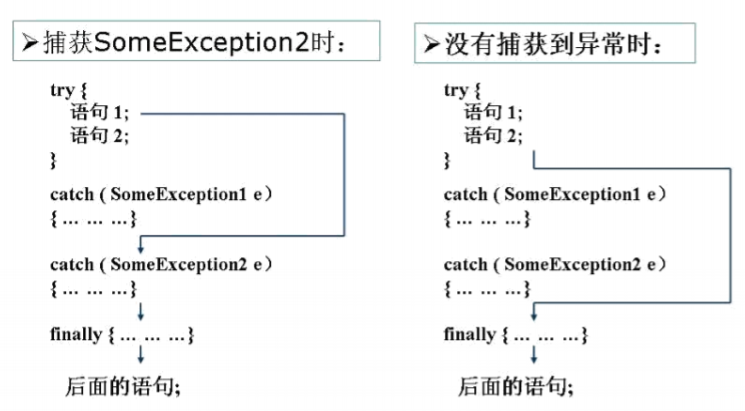
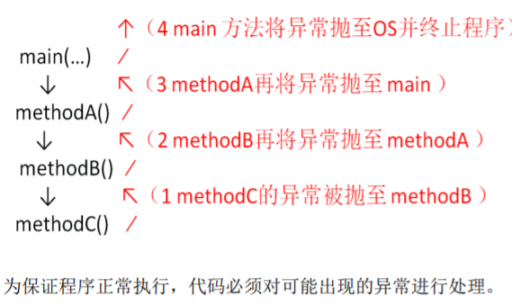
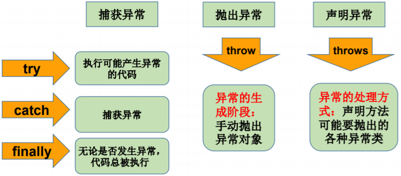

[TOC]

# 异常概述

## 异常

在Java语言中，将程序执行中发生的不正常情况称为“异常”。（开发过程中的语法错误和逻辑错误不是异常）

## 分类

### Error

Java虚拟机无法解决的严重问题。

如：JVM系统内部错误、资源耗尽等严重情况。一般不编写针对性代码进行处理。（如：StackOverflowError和OOM）

### Exception

除Error外其他因编程错误或偶然的外在因素导致的一般性问题，可以使用针对性的代码进行处理。

如：

- 空指针访问
- 试图读取不存在的文件
- 网络连接中断
- 数组角标越界

### 解决方法

- 遇到错误终止程序运行
- 编写程序时，考虑到错误，进行错误检测、错误消息提示，以及错误处理

**捕获错误最理想的是在编译时期，但有的错误只在运行时发生。**

# 异常体系结构

- java.lang.Throwable
  - java.lang.Error：严重错误，一般不编写针对性的代码进行处理
  - java.lang.Exception：可以进行异常的处理
    - 编译时异常(checked	受检异常)
      - IOException
        - FileNotFoundException
      - ClassNotFoundException
    - 运行时异常(unchecked,RuntimeException)
      - NullPointerException
      - ArrayIndexOutOfBoundsException
      - ClassCastException
      - NumberFormatException
      - InputMismatchException
      - ArithmeticException
      - ...


## 编译时异常和运行时异常


**编译时异常：**执行javac.exe命名时，可能出现的异常

​			编译器要求Java程序必须捕获或声明所有编译时异常。

**运行时异常：**执行java.exe命名时，出现的异常

​			编译器不要求强制处置的异常。**java.lang.RuntimeException**类及它的子类都是运行时异常。(这是程序员应该积极避免的异常)

​			对于这类异常，可以不作处理，因为这类异常很普遍，若全处理可能会对程序的可读性和运行效率产生影响。	

# 常见异常

## 运行时异常

### **ArrayIndexOutOfBoundsException**

```Java
public class IndexOutExp {
    public static void main(String[] args) {
        String friends[] = { "lisa", "bily", "kessy" };
        for (int i = 0; i < 5; i++) {
        	System.out.println(friends[i]); // friends[4]?
        }
    	System.out.println("\nthis is the end");
    } 
}
```

```shell
程序IndexOutExp.java编译正确，运行结果：java IndexOutExp
lisa
bily
kessy
java.lang.ArrayIndexOutOfBoundsException
at Test7_1.main(Test7_1.java:5)
Exception in thread "main"
```

### **NullPointerException**

```Java
public class NullRef {
    int i = 1;
    public static void main(String[] args) {
        NullRef t = new NullRef();
        t = null;
        System.out.println(t.i);
    } 
}
```

```shell
--程序NullRef.java编译正确，运行结果：java NullRef
java.lang.NullPointerException
at NullRef.main(NullRef.java:6)
Exception in thread "main"
```

### **ClassCastException**

```Java
public class Order {
    public static void main(String[] args) {
        Object obj = new Date();
        Order order;
        order = (Order) obj;
        System.out.println(order);
    } 
}
```

```shell
--程序Person.java编译正确，运行结果：java Person
java.lang. java.lang.ClassCastException
at Person.main(Person.java:5)
Exception in thread "main" 
```

### ArithmeticException

```Java
public class DivideZero {
    int x;
    public static void main(String[] args) {
        int y;
        DivideZero c=new DivideZero();
        y=3/c.x;
        System.out.println("program ends ok!");
    }
}
```

```dos
程序DivideZero.java编译正确，运行结果：java DivideZero
java.lang.ArithmeticException: / by zero
at DivideZero.main(DivideZero.java:6)
Exception in thread "main" 
```

## 编译时异常

```Java
@Test
public void test7(){
    File file = new File("hello.txt");
    FileInputStream fis = new FileInputStream(file);

    int data = fis.read();
    while(data != -1){
        System.out.print((char)data);
        data = fis.read();
    }
    fis.close();

}
```

# 异常处理机制

## 抓抛模型

- “抛”：程序正常执行过程中，一旦出现异常，就会在异常代码处生成一个对应异常类的对象。并将此对象抛出。

  一旦抛出对象以后，其后的代码就不再执行。

  关于异常对象的产生：

  1. 系统自动生成的异常对象
  2. 手动的生成的异常对象，并抛出（throw）

- “抓”：可以理解为异常的处理方式：① try-catch-finally  ② throws

### try-catch-finally

```Java
try{
...... //可能产生异常的代码
}catch( ExceptionName1 e ){
...... //当产生ExceptionName1型异常时的处置措施
}catch( ExceptionName2 e ){
...... //当产生ExceptionName2型异常时的处置措施
}
[ finally{
...... //无论是否发生异常，都无条件执行的语句
} ]
```

**说明：**

1. finally是可选的。

2. 使用try将可能出现异常代码包装起来，在执行过程中，一旦出现异常，就会生成一个对应异常类的对象，根据此对象的类型，去catch中进行匹配

3. 一旦try中的异常对象匹配到某一个catch时，就进入catch中进行异常的处理。一旦处理完成，就跳出当前的try-catch结构（在没写finally的情况。继续执行其后的代码）

4. catch中的异常类型如果没子父类关系，则谁声明在上，谁声明在下无所谓。

   catch中的异常类型如果满足子父类关系，则要求子类一定声明在父类的上面。否则，报错

5. 常用的异常对象处理的方式（异常的相关信息）： ① String  getMessage()    ② printStackTrace()

6. 在try结构中声明的变量，再出了try结构以后，就不能再被调用

7. try-catch-finally结构可以嵌套

#### finally的说明

1. finally中声明的是一定会被执行的代码。即使catch中又出现异常了，try中return语句，catch中return语句等情况。
2. 像数据库连接、输入输出流、网络编程Socket等资源，JVM是不能自动的回收的，我们需要自己手动的进行资源的释放。此时的资源释放，就需要声明在finally中。
3. finally语句是可选的



##### final、finally、finalize三者的区别？

1. final 表示“最终的”的修饰符，用于类表示最终类，不能被继承，用于变量表示常量即所赋予的值不可改变，用于方法表示最终方法不可被重写
2. finally 表示“最后的”，用于try...catch语句后，表示无论catch语句是否执行，都一定执行的语句块
3. finalize Java类中表示垃圾回收的“回收器”

### throws + 异常类型

"throws + 异常类型"写在方法的声明处。指明此方法执行时，可能会抛出的异常类型。
一旦当方法体执行时，出现异常，仍会在异常代码处生成一个异常类的对象，此对象满足throws后异常类型时，就会被抛出。交给其调用者，直至找到异常代码后续的代码，就不再执行！



**注意：程序员通常只能处理Exception，而对Error无能为力。**

### 两种处理方式的对比

- try-catch-finally:真正的将异常给处理掉了。
- throws的方式只是将异常抛给了方法的调用者。并没真正将异常处理掉。

#### 开发中应该如何选择两种处理方式？

1. 如果父类中被重写的方法没throws方式处理异常，则子类重写的方法也不能使用throws，意味着如果子类重写的方法中异常，必须使用try-catch-finally方式处理
2. 执行的方法a中，先后又调用了另外的几个方法，这几个方法是递进关系执行的。我们建议这几个方法使用throws的方式进行处理。而执行的方法a可以考虑使用try-catch-finally方式进行处理。

**注意：方法重写的规则之一：** 子类重写的方法抛出的异常类型不大于父类被重写的方法抛出的异常类型

### 不捕获异常时的情况

1. 如果异常都是RuntimeException类或是它的子类，这些类的异常的特 点是：即使没有使用try和catch捕获，Java自己也能捕获，并且编译通过 ( 但运行时会发生异常使得程序运行终止 )。
2. 如果抛出的异常是IOException等类型的非运行时异常，则必须捕获，否则 编译错误。即：必须处理编译时异常，将异常进行捕捉，转化为 运行时异常

```Java
import java.io.*;
public class IOExp {
    public static void main(String[] args) {
        try {
            FileInputStream in = new FileInputStream("atguigushk.txt");
            int b;
            b = in.read();
            while (b != -1) {
                System.out.print((char) b);
                b = in.read();
            }
        	in.close();
        } catch (IOException e) {
        	System.out.println(e);
        } finally {
        	System.out.println(" It’s ok!");
        }
    }
}
```

## 手动抛出异常

- 生成异常类对象，然后通过throw语句实现抛出操作(提交给Java运 行环境)。

  ```Java
  IOException e = new IOException();
  throw e;
  ```

- 抛出的异常必须是Throwable或其子类的实例。下面的语句在编译时将 会产生语法错误：

  ```Java
  throw new String("want to throw");
  ```

  ## 自定义异常类

1. 继承于现的异常结构：RuntimeException 、Exception
2. 提供全局常量：serialVersionUID
3. 提供重载的构造器
4. 自定义的异常通过throw抛出。

```Java
class MyException extends Exception {
    static final long serialVersionUID = 13465653435L;
    private int idnumber;
    public MyException(String message, int id) {
        super(message);
        this.idnumber = id;
    }
    public int getId() {
    	return idnumber;
    }
}
```

```Java
public class MyExpTest {
    public void regist(int num) throws MyException {
        if (num < 0)
        	throw new MyException("人数为负值，不合理", 3);
        else
        	System.out.println("登记人数" + num);
    }
    public void manager() {
        try {
        	regist(100);
        } catch (MyException e) {
        	System.out.print("登记失败，出错种类" + e.getId());
        }
        System.out.print("本次登记操作结束");
    }
    public static void main(String args[]) {
        MyExpTest t = new MyExpTest();
        t.manager();
    }
}
```

# 异常处理的5个关键字

