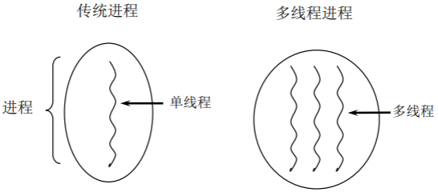
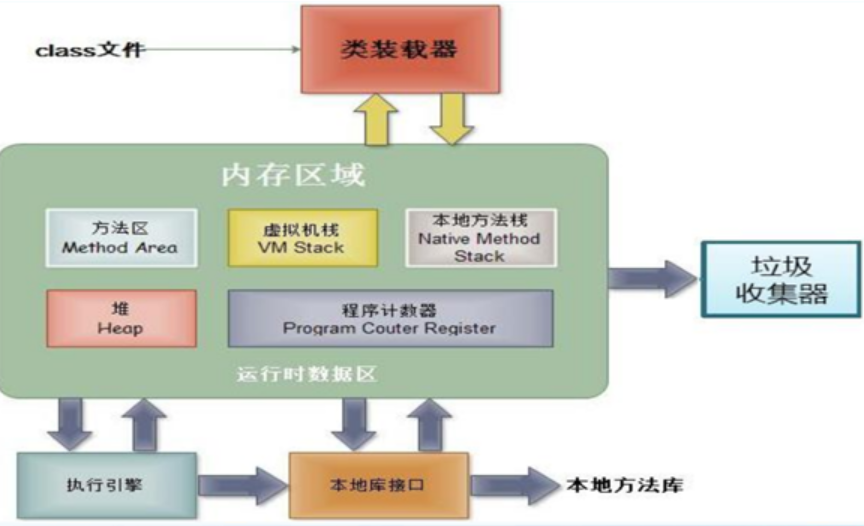
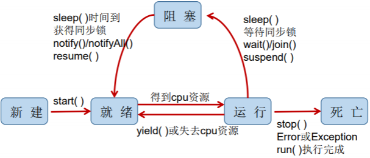
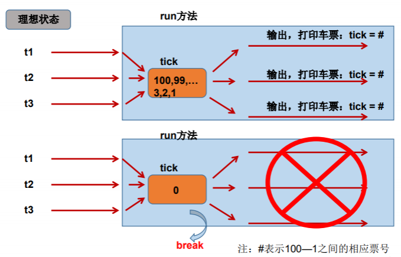
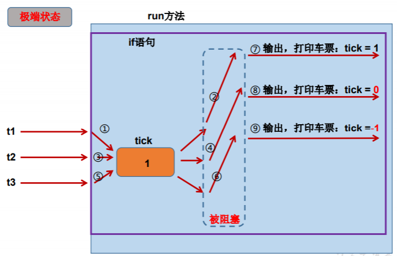
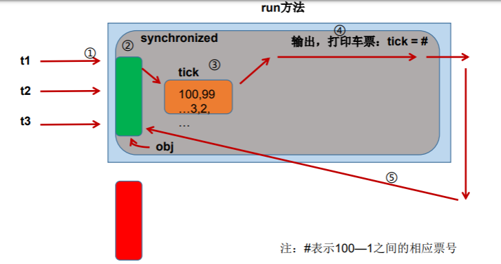

[TOC]

# 基本概念

## 程序(program)

为完成特定任务、用某种语言编写的一组指令的集合。即指一段静态的代码。

## 进程(process)

**概念：**程序的一次执行过程。（正在运行的一个程序）

**说明：** 程序是静态的，进程是动态的。

**进程作为资源分配的单位，**系统在运行时会为每个进程分配不同的内存区域。

## 线程(thread)

**概念：** 进程可进一步细化为线程，是一个程序内部的一条执行路径。

**说明：** **线程作为调度和执行的单位，每个线程拥有独立的运行栈和程序计数器(pc)**，线程切换的开销小。

若一个进程同一时间**并行**执行多个线程，就是支持多线程的。


## 进程与线程



### 内存结构



进程可以细化为多个线程。
每个线程，拥有自己独立的：栈、程序计数器
多个线程，共享同一个进程中的结构：方法区、堆。

> 一个进程中的多个线程共享相同的内存单元/内存地址空间→它们从同一堆中分配对象，可以 访问相同的变量和对象。这就使得线程间通信更简便、高效。但多个线程操作共享的系统资 源可能就会带来安全的隐患。

# 并行与并发

## 单核CPU和多核CPU

- 单核CPU，其实是一种假的多线程，因为在一个时间单元内，也只能执行一个线程的任务。
- 如果是多核的话，才能更好的发挥多线程的效率。（现在的服务器都是多核的）
- 一个Java应用程序java.exe，其实至少三个线程：main()主线程，gc()垃圾回收线程，异常处理线程。当然如果发生异常，会影响主线程。

## 并行

多个CPU同时执行多个任务

## 并发

一个CPU(采用时间片)同时执行多个任务。

## 使用多线程的优点

1. 提高应用程序的响应。对图形化界面更有意义，可增强用户体验。
2. 提高计算机系统CPU的利用率。
3. 改善程序结构。将既长又复杂的进程分为多个线程，独立运行，利于理解和 修改。

**注意：** 某些情况下单个线程先后完成多个任务（调用多个方法），比用多个线程完成是所用的时间更短。

### 需要使用多线程的情况

- 程序需要同时执行两个或多个任务
- 程序需要实现一些需要等待的任务时。如：文件读写操作、网络操作、搜索等。
- 需要后台运行的程序时

# 线程的创建和使用

JVM允许程序运行多个线程，通过java.lang.Thread类来体现。

## Thread类

**特性：**

- 每个线程都是通过某个特定Thread对象的run()方法完成操作，run方的主体称为**线程体**。
- Thread对象的start()方法启动该线程，而不是直接调用run()。

### 构造器

- Thread()：创建新的Thread对象
- Thread(String threadname)：创建线程并指定线程实例名
- Thread(Runnable target)：指定创建线程的目标对象，它实现了Runnable接 口中的run方法
- Thread(Runnable target, String name)：创建新的Thread对象

### 相关方法

- void start(): 启动线程，并执行对象的run()方法
- run(): 线程在被调度时执行的操作
- String getName(): 返回线程的名称
- void setName(String name):设置该线程名称
- static Thread currentThread(): 返回当前线程。在Thread子类中就是this，通常用于主线程和Runnable实现类。
- static void yield()：线程让步
  - 暂停当前正在执行的线程，把执行机会让给优先级相同或更高的线程
  - 若队列中没有同优先级的线程，忽略此方法
- join() ：当某个程序执行流中调用其他线程的 join() 方法时，调用线程将 被阻塞，直到 join() 方法加入的 join 线程执行完为止。
  - 低优先级的线程也可以获得执行
- static void sleep(long millis)：(指定时间:毫秒)
  - 令当前活动线程在指定时间段内放弃对CPU控制,使其他线程有机会被执行,时间到后 重排队。
  - 抛出InterruptedException异常。
- stop(): 强制线程生命期结束，不推荐使用。
- boolean isAlive()：返回boolean，判断线程是否还活着。

## API中创建线程的两种方式

JDK1.5之前创建新执行线程有两种方法：

- 继承Thread类
- 实现Runnable接口

### 继承Thread类

1. 定义子类继承Thread类
2. 子类中重写Thread类中的run方法
3. 创建Thread子类对象，就是创建了线程对象
4. 调用线程对象start方法：启动线程，调用run()方法

#### 注意：

1. 如果手动调用run()方法，就只是普通方法，并没有启动多线程模式。
2. run()方法由JVM调用，执行的过程控制有操作系统的CPU调度决定。
3. 启动多线程，必须调用start()方法。
4. 一个线程对象只能调用一次start()方法启动，如重复调用会抛出“IllegalThreadStateException”异常。

### 实现Runnable接口

1. 定义子类，实现Runnable接口。
2. 子类中重写Runnable接口中的run方法。
3. 通过Thread类含参构造器创建线程对象。
4. 将Runnable接口的子类对象作为实际参数传递给Thread类的构造器中。
5. 调用Thread类的start方法：开启线程，调用Runnable子类的run方法。

### 继承Thread类与实现Runnable接口的比较

**开发中：优先选择实现Runnable接口方式**

1. 避免了单继承的局限性。
2. 更适合来处理多个线程共享数据的情况。

**两者的联系：** 

```Java
public class Thread implements Runnable
```

**相同点：**

- 都需要重写run方法，将线程要执行的逻辑声明在run()中。
- 目前启动线程，都是调用的Thread类中的start()。

**不同点：**

- 继承Thread：线程代码存放Thread子类run方法中。
- 实现Runnable：线程代码存在接口的子类的run方法。

# 线程的调度

## 调度策略

- 时间片

- 抢占式：高优先级的线程抢占CPU

  ## Java的调度方法

  - 同优先级线程组成先进先出队列（先到先服务），使用时间片策略。
  - 对高优先级，使用优先调度的抢占式策略。

  #### 线程的优先级

  ##### 优先级等级

  - MAX_PRIORITY：10
  - MIN _PRIORITY：1 
  - NORM_PRIORITY：5 （默认优先级）

  ##### 涉及方法

  - getPriority() ：返回线程优先值
  - setPriority(int newPriority) ：改变线程的优先级

  ##### 说明

  - 线程创建时继承父线程的优先级
  - 低优先级只是获得调度的概率低，并非一定是在高优先级线程之后才被调用

  # 线程的分类

  - 守护线程
  - 用户线程

   **说明**

  - 它们在几乎每个方面都是相同的，唯一的区别是判断JVM何时离开。
  - 守护线程是用来服务用户线程的，通过在start()方法前调用 thread.setDaemon(true)可以把一个用户线程变成一个守护线程。
  - Java垃圾回收就是一个典型的守护线程。
  - 若JVM中都是守护线程，当前JVM将退出。

  # 线程的生命周期

  ## 线程的状态

  JDK中用Thread.State类定义了线程的状态。

  **Java使用Thread类及其子类的对象来表示线程，在一个完整的线程生命周期内通常要经历五种状态：**

  - **新建：**当一个Thread类或其子类的对象被声明并创建时，新生的线程对象处于新建状态。
  - **就绪：**处于新建状态的线程被start()后，将进入线程队列等待CPU时间片，此时它已具备了运行的条件，只是没分配到CPU资源。
  - **运行：**当就绪的线程被调度并获得CPU资源时,便进入运行状态， run()方法定义了线 程的操作和功能。
  - **阻塞：**在某种特殊情况下，被人为挂起或执行输入输出操作时，让出 CPU 并临时中 止自己的执行，进入阻塞状态。
  - **死亡：**线程完成了它的全部工作或线程被提前强制性地中止或出现异常导致结束。

  ## 线程状态转换图

  

  

# 线程的同步

多个线程执行的不确定性引起执行结果的不稳定

如：模拟火车站售票程序，开启三个窗口售票。

```Java
class Ticket implements Runnable {
    private int tick = 100;
    public void run() {
        while (true) {
            if (tick > 0) {
                System.out.println(Thread.currentThread
                ().getName() + "售出车票，tick号为：" +
                tick--);
            } else {
            	break;
            }
        }
    }
}

```

```Java
class TicketDemo {
    public static void main(String[] args) {
        Ticket t = new Ticket();
        Thread t1 = new Thread(t);
        Thread t2 = new Thread(t);
        Thread t3 = new Thread(t);
        t1.setName("t1窗口");
        t2.setName("t2窗口");
        t3.setName("t3窗口");
        t1.start();
        t2.start();
        t3.start();
    }
}
```





```Java
private int tick = 100;
public void run(){
    while(true){
        if(tick>0){
            try{
            	Thread.sleep(10);
            }catch(InterruptedException e){ 						e.printStackTrace();
            }
    System.out.println(Thread.currentThread().getName()+“售出车票，tick号为： "+tick--);
    	} 
 	} 
 }
```

多线程出现了安全问题

**问题的原因：**

当多条语句在操作同一个**线程共享数据**时，一个线程对多条语句只执行了一部分，未执行完，另一个线程参与进来执行。导致共享数据错误。

**解决办法：**

对多条操作共享数据的语句，只能让一个线程都执行完，在执行过程中，其他线程不能参与执行。

## Synchronized 关键字

**Java对于多线程的安全问题提供了专业的解决方式：** **同步机制**

### 同步代码块

```Java
synchronized(同步监视器){
	//需要被同步的代码
}
```

**说明：** 

1. 操作共享数据的代码，即为需要被同步的代码。

2. **共享数据：**多个线程共同操作的变量。比如：ticket就是共享数据。

3. **同步监视器，俗称：锁。**任何一个类的对象，都可以充当锁。

   **要求：使用同一个资源的多个线程必须要共用同一把锁。**

4. 其他：

   **在实现Runnable接口创建多线程的方式中**，可以考虑使用this充当同步监视器。

   **在继承Thread类创建多线程的方式中，**慎用this充当同步监视器，考虑使用当前类充当同步监视器。

### 同步方法

```Java
/*
*访问修饰符 synchronized 返回值类型 方法名(参数列表){同步代码}
*/
public synchronized void show(String name){
	..... 同步内容
}
```

**说明：**

1. 同步方法仍然涉及到同步监视器，只是不需要我们显式的声明。

2. 非静态的同步方法，同步监视器是：this

   静态的同步方法，同步监视器是：当前类本身

### 同步原理



## 同步机制中的锁

**同步锁机制：**

> 在《Thinking in Java》中，是这么说的：对于并发工作，你需要某种方式来防 止两个任务访问相同的资源（其实就是共享资源竞争）。 防止这种冲突的方法 就是当资源被一个任务使用时，在其上加锁。第一个访问某项资源的任务必须 锁定这项资源，使其他任务在其被解锁之前，就无法访问它了，而在其被解锁 之时，另一个任务就可以锁定并使用它了。

**synchronized的锁是什么？**

- 任意对象都可以作同步锁。所有对象都自动含有单一的锁（监视器）
- 同步方法锁：静态方法（类名.class)、非静态方法（this）
- 同步代码块：自定义，多数时候也指定为this或类名.class

**特别注意：** 

**使用同一个资源的多个线程必须共用一把锁，否则无法保证共享资源的安全性。**

**一个线程类中的所有静态方法共用同一把锁(类名.class),所有非静态方法共用同一把锁(this),同步代码块（指定时需谨慎）**

## 同步的范围

### 如何确定代码是否需要线程安全？

1. 明确哪些代码是多线程运行的代码。
2. 明确多个线程是否有共享数据
3. 明确多个线程运行代码中是否有多条语句操作共享数据

### 解决线程安全问题

**把所有操作共享数据的语句放在同步范围中。**

**注意：** 范围不能太小（太小无法锁住有安全问题的代码），范围不能太大（太大没发挥多线程的功能）。

## 释放锁的操作

- 当前线程的同步方法、同步代码块执行结束
- 当前线程在同步代码块、同步方法中遇到break、return终止了该代码块
- 当前线程在同步代码块、同步方法中出现了未处理的Error或Exception，导致异常结束。
- 当前线程在同步代码块、同步方法中执行了线程对象的wait()方法，当前线程暂停，并释放锁。

## 不会释放锁的操作

- 线程执行同步代码块或同步方法时，调用Thread.sleep()、Thread.yield()方法暂停当前线程的执行。

- 线程执行同步代码块时，其他线程调用该线程的suspend()方法将该线程挂起，该线程不会释放锁（同步监视器）。应尽量避免使用suspend()和resume()来控制线程


## 单例设计模式之懒汉式（线程安全）

```Java
class Singleton {
    private static Singleton instance = null;
    private Singleton(){}
    public static Singleton getInstance(){
        if(instance==null){
            synchronized(Singleton.class){
                if(instance == null){
                	instance = new Singleton();
                } 
            } 
        }
    	return instance;
    } 
}
public class SingletonTest{
    public static void main(String[] args){
        Singleton s1=Singleton.getInstance();
        Singleton s2=Singleton.getInstance();
        System.out.println(s1==s2);
    } 
}
```

## 线程死锁问题

- 不同的线程分别占用对方需要的同步资源不放弃，都在等待对方放弃 自己需要的同步资源，就形成了线程的死锁
- 出现死锁后，不会出现异常，不会出现提示，只是所有的线程都处于 阻塞状态，无法继续

```Java
class A {
	public synchronized void foo(B b) {
		System.out.println("当前线程名: " + Thread.currentThread().getName()
				+ " 进入了A实例的foo方法"); // ①
		try {
			Thread.sleep(200);
		} catch (InterruptedException ex) {
			ex.printStackTrace();
		}
		System.out.println("当前线程名: " + Thread.currentThread().getName()
				+ " 企图调用B实例的last方法"); // ③
		b.last();
	}

	public synchronized void last() {
		System.out.println("进入了A类的last方法内部");
	}
}

class B {
	public synchronized void bar(A a) {
		System.out.println("当前线程名: " + Thread.currentThread().getName()
				+ " 进入了B实例的bar方法"); // ②
		try {
			Thread.sleep(200);
		} catch (InterruptedException ex) {
			ex.printStackTrace();
		}
		System.out.println("当前线程名: " + Thread.currentThread().getName()
				+ " 企图调用A实例的last方法"); // ④
		a.last();
	}

	public synchronized void last() {
		System.out.println("进入了B类的last方法内部");
	}
}

public class DeadLock implements Runnable {
	A a = new A();
	B b = new B();

	public void init() {
		Thread.currentThread().setName("主线程");
		// 调用a对象的foo方法
		a.foo(b);
		System.out.println("进入了主线程之后");
	}

	public void run() {
		Thread.currentThread().setName("副线程");
		// 调用b对象的bar方法
		b.bar(a);
		System.out.println("进入了副线程之后");
	}

	public static void main(String[] args) {
		DeadLock dl = new DeadLock();
		new Thread(dl).start();
		dl.init();
	}
}
```

**解决方法**

1. 专门的算法、原则
2. 尽量减少同步资源的定义
3. 尽量避免嵌套同步

```Java
public class DeadLockTest {
    public static void main(String[] args) {
    final StringBuffer s1 = new StringBuffer();
    final StringBuffer s2 = new StringBuffer();
        new Thread() {
            public void run() {
                synchronized (s1) {
                	s2.append("A");
                    synchronized (s2) {
                        s2.append("B");
                        System.out.print(s1);
                        System.out.print(s2);
                    }
                }
            }
        }.start();
        new Thread() {
            public void run() {
                synchronized (s2) {
                	s2.append("C");
                    synchronized (s1) {
                        s1.append("D");
                        System.out.print(s2);
                        System.out.print(s1);
                    }
                }
            }
        }.start();
    }
}
```

## Lock（锁）

- JDK 5.0开始，Java提供了更强大的线程同步机制 —— 通过显式定义同步锁对象来实现同步。同步锁使用Lock对象充当。
- **java.util.concurrent.locks.Lock接口是控制多个线程对共享资源进行访问的工具。**锁提供了对共享资源的独占访问，每次只能有一个线程对Lock对象加锁，线程开始访问共享资源之前应先获得Lock对象。
- ReentrantLock 类实现了 Lock ，它拥有与 synchronized 相同的并发性和内存语义，在实现线程安全的控制中，比较常用的是ReentrantLock，可以显式加锁、释放锁。

### Lock用法示例

```Java
class A{
    private final ReentrantLock lock = new ReenTrantLock();
    public void m(){
        lock.lock();
        try{
        	//保证线程安全的代码;
        }
        finally{
        	lock.unlock();
        }
    }
}
```

**注意：如果同步代码有异常，要将unlock()写入finally语句块**

### synchronized 与 Lock 的对比

1. Lock是显式锁（手动开启和关闭锁，别忘记关闭锁），synchronized是隐式锁，出了作用域自动释放
2. Lock只有代码块锁，synchronized有代码块锁和方法锁
3. 使用Lock锁，JVM将花费较少的时间来调度线程，性能更好。并且具有更好的扩展性（提供更多的子类）

#### 优先使用顺序

Lock → 同步代码块（已经进入了方法体，分配了相应资源）→ 同步方法 （在方法体之外）

## 同步方式的利弊

**利：**同步的方式，解决了线程的安全问题。

**弊：**操作同步代码时，只能一个线程参与，其他线程等待。相当于是一个单线程的过程，效率低。

# 线程的通信

## wait() 与 notify() 和 notifyAll()

- **wait()：**令当前线程挂起并放弃CPU、同步资源并等待，使别的线程可访问并修改共享资源，而当前线程排队等候其他线程调用notify()或notifyAll()方法唤醒，唤醒后等待重新获得对监视器的所有权后才能继续执行。
- **notify()：**唤醒正在排队等待同步资源的线程中优先级最高者结束等待
- **notifyAll()：**唤醒正在排队等待资源的所有线程结束等待.

1. 这三个方法**只有在synchronized方法或synchronized代码块中才能使用**，否则会报 java.lang.IllegalMonitorStateException异常。
2. 这三个方法**必须有锁对象调用**，而任意对象都可以作为synchronized的同步锁， 因此这三个方法只能在Object类中声明。

#### sleep() 和 wait()的异同？

1. 相同点：一旦执行方法，都可以使得当前的线程进入阻塞状态。
2. 不同点：
   1. 两个方法声明的位置不同：Thread类中声明sleep() , Object类中声明wait()
   2. 调用的要求不同：sleep()可以在任何需要的场景下调用。 wait()必须使用在同步代码块或同步方法中
   3. 关于是否释放同步监视器：如果两个方法都使用在同步代码块或同步方法中，sleep()不会释放锁，wait()会释放锁。

#### 生产者/消费者问题

**售货员**

```Java
class Clerk { // 售货员
    private int product = 0;
    public synchronized void addProduct() {
        if (product >= 20) {
            try {
            	wait();
            } catch (InterruptedException e){
            	e.printStackTrace();
            }
        } else {
            product++;
            System.out.println("生产者生产了第" + product + "个产品");
            notifyAll();
        }
    }
    public synchronized void getProduct() {
        if (this.product <= 0) {
            try {
            	wait();
            } catch (InterruptedException e) {
            	e.printStackTrace();
            }
        } else {
            System.out.println("消费者取走了第" + product + "个产品");
            product--;
            notifyAll();
        }
    }
}

```

**生产者**

```Java
class Productor implements Runnable { // 生产者
    Clerk clerk;
    public Productor(Clerk clerk) {
    	this.clerk = clerk;
    }
    public void run() {
        System.out.println("生产者开始生产产品");
        while (true) {
            try {
            	Thread.sleep((int) Math.random() * 1000);
            } catch (InterruptedException e) {
            	e.printStackTrace();
            }
        	clerk.addProduct();
        }
    }
}
```

**消费者**

```Java
class Consumer implements Runnable { // 消费者
    Clerk clerk;
    public Consumer(Clerk clerk) {
    	this.clerk = clerk;
    }
    public void run() {
        System.out.println("消费者开始取走产品");
        while (true) {
            try {
                Thread.sleep((int) Math.random() * 1000);
            } catch (InterruptedException e) {
                e.printStackTrace();
            }
            clerk.getProduct();
        }
    }
}
```

```Java
public class ProductTest {
    public static void main(String[] args) {
        Clerk clerk = new Clerk();
        Thread productorThread = new Thread(new Productor(clerk));
        Thread consumerThread = new Thread(new Consumer(clerk));
        productorThread.start();
        consumerThread.start();
    }
}
```

# JDK5.0新增线程创建方式

## 实现Callable接口

### Callable与Runnable相比

- 相比run()方法，可以有返回值
- 方法可以抛出异常
- 支持泛型的返回值
- 需要借助FutureTask类，比如获取返回结果

### Future接口

- 可以对具体Runnable、Callable任务的执行结果进行取消、查询是否完成、获取结果等。
- **FutrueTask是Futrue接口唯一的实现类**
- FutureTask 同时实现了Runnable, Future接口。它既可以作为Runnable被线程执行，又可以作为Future得到Callable的返回值

## 线程池

**背景：**经常创建和销毁、使用量特别大的资源，比如并发情况下的线程， 对性能影响很大。

**思路：**提前创建好多个线程，放入线程池中，使用时直接获取，使用完 放回池中。可以避免频繁创建销毁、实现重复利用。

**好处：**

1. 提高响应速度（减少了创建新线程的时间）
2. 降低资源消耗（重复利用线程池中线程，不需要每次都创建）
3. 便于线程管理
   - corePoolSize：核心池的大小
   - maximumPoolSize：最大线程数
   - keepAliveTime：线程没任务时最多保持多长时间后会终止

### 线程池相关API

JDK 5.0起提供了线程池相关API：ExecutorService 和 Executors

#### ExecutorService

真正的线程池接口。常见子类ThreadPoolExecutor

- void execute(Runnable command) ：执行任务/命令，没有返回值，一般用来执行 Runnable
-  Future submit(Callable task)：执行任务，有返回值，一般又来执行 Callable
-  void shutdown() ：关闭连接池

#### Executors

工具类、线程池的工厂类，用于创建并返回不同类型的线程池

- Executors.newCachedThreadPool()：创建一个可根据需要创建新线程的线程池
- Executors.newFixedThreadPool(n); 创建一个可重用固定线程数的线程池
- Executors.newSingleThreadExecutor() ：创建一个只有一个线程的线程池
- Executors.newScheduledThreadPool(n)：创建一个线程池，它可安排在给定延迟后运 行命令或者定期地执行

# 线程创建示例

```Java
import java.util.concurrent.Callable;
import java.util.concurrent.ExecutionException;
import java.util.concurrent.FutureTask;

/*创建多线程的方式：
1.继承Thread
2.实现Runnable
3.实现Callable
4.使用线程池
*/
class MyThread01 extends Thread {
    @Override
    public void run() {
        System.out.println("-----MyThread01");
    }
}

class MyThread02 implements Runnable {
    public void run() {
        System.out.println("-----MyThread02");
    }
}

class MyThread03 implements Callable<Integer> {
    @Override
    public Integer call() throws Exception {
        System.out.println("-----MyThread03");
        return 200;
    }
}

public class ThreadNew {
    public static void main(String[] args) {
        new MyThread01().start();
        new Thread(new MyThread02()).start();

        FutureTask<Integer> futureTask = new FutureTask<Integer>(new MyThread03());
        new Thread(futureTask).start();
        try {
            Integer value = futureTask.get();
            System.out.println(value);
        } catch (InterruptedException e) {
            e.printStackTrace();
        } catch (ExecutionException e) {
            e.printStackTrace();
        }
    }
}

import java.util.concurrent.ExecutorService;
import java.util.concurrent.Executors;
//创建并使用多线程的第四种方法：使用线程池
class MyThread implements Runnable {

	@Override
	public void run() {
		for (int i = 1; i <= 100; i++) {
			System.out.println(Thread.currentThread().getName() + ":" + i);
		}
	}

}

public class ThreadPool {
	public static void main(String[] args) {
		// 1.调用Executors的newFixedThreadPool(),返回指定线程数量的ExecutorService
		ExecutorService pool = Executors.newFixedThreadPool(10);
		// 2.将Runnable实现类的对象作为形参传递给ExecutorService的submit()方法中，开启线程
		// 并执行相关的run()
		pool.execute(new MyThread());
		pool.execute(new MyThread());
		pool.execute(new MyThread());
		// 3.结束线程的使用
		pool.shutdown();

	}
}

```

