[TOC]


# 字符串相关的类

## java.lang.String类

**String：**字符串，使用一对""表示。

```Java
public final class String implements java.io.Serializable, Comparable<String>, CharSequence {
    /** The value is used for character storage. */
    private final char value[];
    /** Cache the hash code for the string */
    private int hash; // Default to 0
```

1. String类被final关键字修饰，不可被继承。

2. String实现了Serializable接口：表示字符串支持序列化。

   实现了Comparable接口：表示String类可以比较大小。

3. String内部定义了final char[] value用于存储字符串数据

4. 通过字面量的方式（区别于new给一个字符串赋值，此时的字符串值声明在字符串常量池中)。

5. 字符串常量池中是不会存储相同内容(使用String类的equals()比较，返回true)的字符串的。

### String的不可变性

1. 当对字符串重新赋值时，需要重写指定内存区域指，不能使用原有的value进行赋值。
2. 当对现的字符串进行连接操作时，也需要重新指定内存区域赋值，不能使用原有的value进行赋值。
3. 当调用String的replace()方法修改指定字符或字符串时，也需要重新指定内存区域赋值，不能使用原有的value进行赋值。

```Java
String s1 = "abc";//字面量的定义方式
String s2 = "abc";
s1 = "hello";

System.out.println(s1 == s2);//比较s1和s2的地址值

System.out.println(s1);//hello
System.out.println(s2);//abc

System.out.println("*****************");

String s3 = "abc";
s3 += "def";
System.out.println(s3);//abcdef
System.out.println(s2);

System.out.println("*****************");

String s4 = "abc";
String s5 = s4.replace('a', 'm');
System.out.println(s4);//abc
System.out.println(s5);//mbc
```

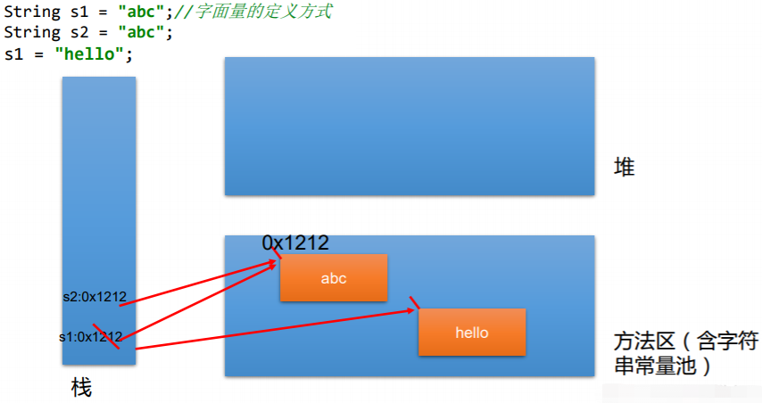

### String对象的创建

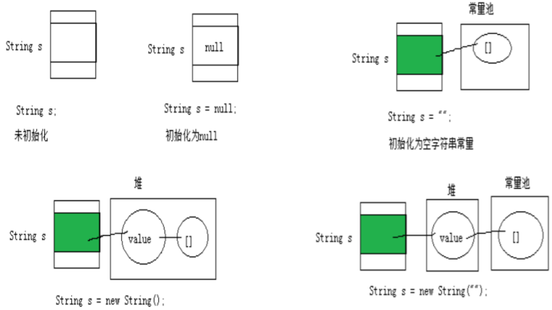

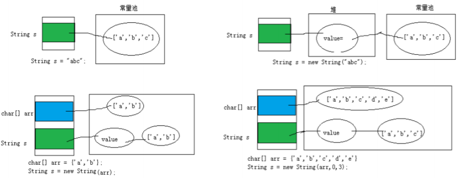

```Java
//通过字面量定义的方式：此时的s1和s2的数据javaEE声明在方法区中的字符串常量池中。
String s1 = "javaEE";
String s2 = "javaEE";
//通过new + 构造器的方式:此时的s3和s4保存的地址值，是数据在堆空间中开辟空间以后对应的地址值。
String s3 = new String("javaEE");
String s4 = new String("javaEE");

System.out.println(s1 == s2);//true
System.out.println(s1 == s3);//false
System.out.println(s1 == s4);//false
System.out.println(s3 == s4);//false
```

```Java
String s = new String("abc");方式创建对象，在内存中创建了几个对象？
两个:一个是堆空间中new结构，另一个是char[]对应的常量池中的数据："abc"
```

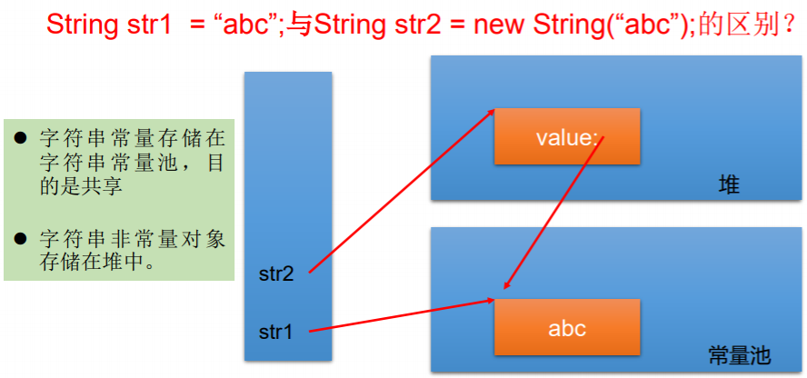

### 字符串拼接方式赋值的对比

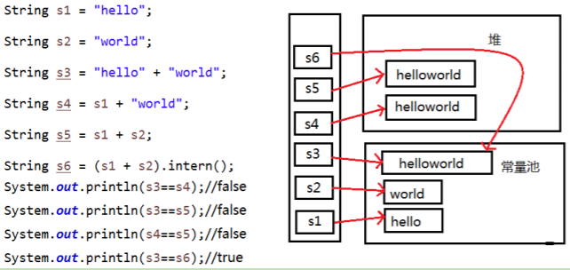

- 常量与常量的拼接结果在常量池。且常量池中不会存在相同内容的常量。
- 只要其中有一个是变量，结果就在堆中。
- 如果拼接的结果调用intern()方法，返回值在常量池中。

#### String使用陷阱

1. ```Java
   String s1 = "a"; 
   ```

   说明：在字符串常量池中创建了一个字面量为"a"的字符串。

2. ```Java
   s1 = s1 + "b"; 
   ```

   说明：实际上原来的“a”字符串对象已经丢弃了，现在在堆空间中产生了一个字符 串s1+"b"（也就是"ab")。如果多次执行这些改变串内容的操作，会导致大量副本 字符串对象存留在内存中，降低效率。如果这样的操作放到循环中，会极大影响 程序的性能。

3. ```Java
   String s2 = "ab";
   ```

   说明：直接在字符串常量池中创建一个字面量为"ab"的字符串。

4. ```Java
   String s3 = "a" + "b";
   ```

   说明：s3指向字符串常量池中已经创建的"ab"的字符串。

5. ```Java
   String s4 = s1.intern();
   ```

   说明：堆空间的s1对象在调用intern()之后，会将常量池中已经存在的"ab"字符串 赋值给s4。

### String常量方法

- **int length()**：返回字符串的长度： return value.length

- **char charAt(int index)：** 返回某索引处的字符return value[index]

- **boolean isEmpty()：**判断是否是空字符串：return value.length == 0

- **String toLowerCase()：**使用默认语言环境，将 String 中的所有字符转换为小写

- **String toUpperCase()：**使用默认语言环境，将 String 中的所有字符转换为大写

- **String trim()：**返回字符串的副本，忽略前导空白和尾部空白

- **boolean equals(Object obj)：**比较字符串的内容是否相同

- **boolean equalsIgnoreCase(String anotherString)：**与equals方法类似，忽略大 小写

- **String concat(String str)：**将指定字符串连接到此字符串的结尾。 等价于用“+”

- **int compareTo(String anotherString)：**比较两个字符串的大小

- **String substring(int beginIndex)：**返回一个新的字符串，它是此字符串的从 beginIndex开始截取到最后的一个子字符串。

- **String substring(int beginIndex, int endIndex) ：**返回一个新字符串，它是此字 符串从beginIndex开始截取到endIndex(不包含)的一个子字符串。

- **boolean endsWith(String suffix)：**测试此字符串是否以指定的后缀结束

- **boolean startsWith(String prefix)：**测试此字符串是否以指定的前缀开始

- **boolean startsWith(String prefix, int toffset)：**测试此字符串从指定索引开始的子字符串是否以指定前缀开始

- **boolean contains(CharSequence s)：**当且仅当此字符串包含指定的 char 值序列 时，返回 true

-  **int indexOf(String str)：**返回指定子字符串在此字符串中第一次出现处的索引

-  **int indexOf(String str, int fromIndex)：**返回指定子字符串在此字符串中第一次出现处的索引，从指定的索引开始

- **int lastIndexOf(String str)：**返回指定子字符串在此字符串中最右边出现处的索引

- **int lastIndexOf(String str, int fromIndex)：**返回指定子字符串在此字符串中最后 一次出现处的索引，从指定的索引开始反向搜索

  **注意：indexOf和lastIndexOf方法如果未找到都是返回-1**

- **String replace(char oldChar, char newChar)：**返回一个新的字符串，它是 通过用 newChar 替换此字符串中出现的所有 oldChar 得到的。

- **String replace(CharSequence target, CharSequence replacement)：**使用指定的字面值替换序列替换此字符串所有匹配字面值目标序列的子字符串。

- **String replaceAll(String regex, String replacement) ：** 使用给定的 replacement替换此字符串所有匹配给定的正则表达式的子字符串。

- **String replaceFirst(String regex, String replacement) ：** 使用给定 的replacement替换此字符串匹配给定的正则表达式的第一个子字符串。

- **boolean matches(String regex)：**告知此字符串是否匹配给定的正则表达式。

- **String[] split(String regex)：**根据给定正则表达式的匹配拆分此字符串。

- **String[] split(String regex, int limit)：**根据匹配给定的正则表达式来拆分此字符串，最多不超过limit个，如果超过了，剩下的全部都放到最后一个元素中。

### String与其它结构的转换

#### 与基本数据类型、包装类之间的转换

String → 基本数据类型、包装类：调用包装类的静态方法：parseXxx(str)

基本数据类型、包装类 → String：调用String重载的valueOf(xxx)

```Java
@Test
public void test1(){
    String str1 = "123";
    //        int num = (int)str1;//错误的
    int num = Integer.parseInt(str1);

    String str2 = String.valueOf(num);//"123"
    String str3 = num + "";

    System.out.println(str1 == str3);
}
```

#### 与字符数组之间的转换

String → char[]:调用String的toCharArray()

```Java
public void getChars(int srcBegin, int srcEnd, char[] dst,int dstBegin)：提供了将指定索引范围内的字符串存放到数组中的方法。
```

char[] → String:调用String的构造器

```Java
@Test
public void test2(){
    String str1 = "abc123";  //题目： a21cb3

    char[] charArray = str1.toCharArray();
    for (int i = 0; i < charArray.length; i++) {
        System.out.println(charArray[i]);
    }

    char[] arr = new char[]{'h','e','l','l','o'};
    String str2 = new String(arr);
    System.out.println(str2);
}
```

#### 与字节数组之间的转换

**编码：**String → byte[]:调用String的getBytes()

```Java
public byte[] getBytes():使用平台的默认字符集将此String编码为byte序列，并将结果存储到一个新的byte数组中。
public byte[] getBytes(String charsetName):使用指定的字符集将此String编码到byte序列，并将结果存储到新的byte数组。
```

**解码：**byte[] → String:调用String的构造器

```Java
String(byte[]):通过使用平台的默认字符集解码指定的byte数组，构造一个新的String。
String(byte[]，int offset，int length):用指定的字节数组的一部分，即从数组起始位置offset开始取length个字节构造一个字符串对象。
```

**编码：**字符串 → 字节  (看得懂→看不懂的二进制数据)
**解码：**编码的逆过程，字节→字符串（看不懂的二进制数据→看得懂）

**说明：**解码时，要求解码使用的字符集必须与编码时使用的字符集一致，否则会出现乱码。

```Java
@Test
public void test3() throws UnsupportedEncodingException {
    String str1 = "abc123中国";
    byte[] bytes = str1.getBytes();//使用默认的字符集，进行编码。
    System.out.println(Arrays.toString(bytes));

    byte[] gbks = str1.getBytes("gbk");//使用gbk字符集进行编码。
    System.out.println(Arrays.toString(gbks));

    System.out.println("******************");

    String str2 = new String(bytes);//使用默认的字符集，进行解码。
    System.out.println(str2);

    String str3 = new String(gbks);
    System.out.println(str3);//出现乱码。原因：编码集和解码集不一致！

    String str4 = new String(gbks, "gbk");
    System.out.println(str4);//没出现乱码。原因：编码集和解码集一致！
}
```

#### 与StringBuffer、StringBuilder之间的转换

String → StringBuffer、StringBuilder：调用StringBuffer、StringBuilder构造器

StringBuffer、StringBuilder → String：①调用String构造器；②StringBuffer、StringBuilder的toString()

### JVM中字符串常量池存放位置说明

- **jdk 1.6 (jdk 6.0 ,java 6.0)：**字符串常量池存储在方法区（永久区）
- **jdk 1.7：**字符串常量池存储在堆空间
- **jdk 1.8：**字符串常量池存储在方法区（元空间）

## java.lang.StringBuffer类

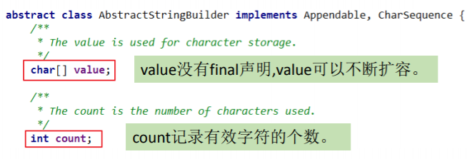

- 可变字符序列，JDK1.0中声明，可以对字符串内容进行增删，不会产生新的对象。
- 作为参数传递时，方法内部可以改变值
- StringBuffer类创建对象时必须使用构造器生成。
  - **StringBuffer()：**初始容量为16的字符串缓冲区
  - **StringBuffer(int size)：**构造指定容量的字符串缓冲区
  - **StringBuffer(String str)：** 将内容初始化为指定字符串内容

### StringBuffer类的常用方法

- **StringBuffer append(xxx)：**提供了很多的append()方法，用于进行字符串拼接
- **StringBuffer delete(int start,int end)：**删除指定位置的内容
- **StringBuffer replace(int start, int end, String str)：**把[start,end)位置替换为str
- **StringBuffer insert(int offset, xxx)：**在指定位置插入xxx
- **StringBuffer reverse() ：**把当前字符序列逆转
- **public int indexOf(String str)**
- **public String substring(int start,int end)**
- **public int length()**
- **public char charAt(int n)**
- **public void setCharAt(int n,char ch)**

当append()和insert()时，如原value数组长度不够，可扩容。

```Java
默认情况下，扩容为原来容量的2倍 + 2，同时将原数组中的元素复制到新的数组中。
开发中建议使用：StringBuffer(int capacity) 或 StringBuilder(int capacity)
```

上诉方法支持方法链操作

```Java
//方法链的原理
@Override
public StringBuilder append(String str){
	super.append(str);
	return this;
}
```

## java.lang.StringBuilder类

可变的字符序列；jdk5.0新增的，线程不安全的，效率高；底层使用char[]存储

## StringBuffer和StringBuilder的内存解析

以StringBuffer为例：

```Java
String str = new String();//char[] value = new char[0];
String str1 = new String("abc");//char[] value = new char[]{'a','b','c'};

StringBuffer sb1 = new StringBuffer();//char[] value = new char[16];底层创建了一个长度是16的数组。
System.out.println(sb1.length());//
sb1.append('a');//value[0] = 'a';
sb1.append('b');//value[1] = 'b';

StringBuffer sb2 = new StringBuffer("abc");//char[] value = new char["abc".length() + 16];

System.out.println(sb2.length());//3 注意这里返回的字符长度是实际字符长度 不是 底层char数组长度。
```

## String、StringBuffer、StringBuilder的对比

- **String(JDK 1.0)：不可变字符序列**
- **StringBuffer(JDK 1.0)：可变字符序列、效率低、线程安全**
- **StringBuilder(JDK 5.0)：可变字符序列、效率高、线程不安全**
- 作为参数传递的话，方法内部String不会改变其值，StringBuffer和StringBuilder会改变其值。

执行效率对比：

从高到低排列：StringBuilder > StringBuffer > String

```Java
//初始设置
long startTime = 0L;
long endTime = 0L;
String text = "";
StringBuffer buffer = new StringBuffer("");
StringBuilder builder = new StringBuilder("");
//开始对比
startTime = System.currentTimeMillis();
for (int i = 0; i < 20000; i++) {
buffer.append(String.valueOf(i));
}
endTime = System.currentTimeMillis();
System.out.println("StringBuffer的执行时间：" + (endTime - startTime));
startTime = System.currentTimeMillis();
for (int i = 0; i < 20000; i++) {
builder.append(String.valueOf(i));
}
endTime = System.currentTimeMillis();
System.out.println("StringBuilder的执行时间：" + (endTime - startTime));
startTime = System.currentTimeMillis();
for (int i = 0; i < 20000; i++) {
text = text + i;
}
endTime = System.currentTimeMillis();
System.out.println("String的执行时间：" + (endTime - startTime));
```

# JDK8之前日期时间API

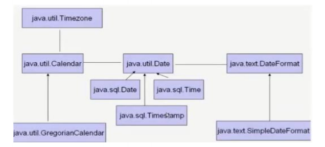

## java.lang.System类

```Java
public static long currentTimeMillis():返回当前时间与1970年1月1日0时0分0秒之间以毫秒为单位的时间差。又称时间戳
```

计算世界时间的主要标准：

- UTC（Coordinated Universal Time）
- GMT（Greenwich Mean Time）
- CST（Central Standard Time）

## java.util.Date类与java.sql.Date类

继承关系

- java.util.Date类
  - java.sql.Date类
- 两个构造器的使用
  - Date()：对应当前时间的Date对象
  - Date(long date)：指定毫秒数的Date对象
- 常用方法
  - **getTime()：**获取当前Date对象对应的毫秒数。（时间戳）
  - **toString()：**显示当前的年、月、日、时、分、秒|转换为格式String为：dow mon dd hh:mm:ss zzz yyyy 其中：dow是一周中的某一天（Sun、Mon、Tue、Wed、Thu、Fri、Sat），zzz是时间标准
- java.sql.Date对应着数据库中的日期类型的变量

```Java
@Test
public void test2(){
    //构造器一：Date()：创建一个对应当前时间的Date对象
    Date date1 = new Date();
    System.out.println(date1.toString());//Sat Feb 16 16:35:31 GMT+08:00 2019

    System.out.println(date1.getTime());//1550306204104

    //构造器二：创建指定毫秒数的Date对象
    Date date2 = new Date(155030620410L);
    System.out.println(date2.toString());

    //创建java.sql.Date对象
    java.sql.Date date3 = new java.sql.Date(35235325345L);
    System.out.println(date3);//1971-02-13

    //如何将java.util.Date对象转换为java.sql.Date对象
    //情况一：
    //        Date date4 = new java.sql.Date(2343243242323L);
    //        java.sql.Date date5 = (java.sql.Date) date4;
    //情况二：
    Date date6 = new Date();
    java.sql.Date date7 = new java.sql.Date(date6.getTime());
}
```

## java.text.SimpleDateFormat类

**格式化：** 日期 → 字符串

- **SimpleDateFormat()：** 默认的模式和语言环境创建对象
- **public SimpleDateFormat(String pattern)：**该构造方法可以用参数pattern指定的格式创建一个对象。
- **public String format(Date date)：**方法格式化时间对象date

**解析：**字符串 → 日期

- **public Date parse(String source)：**给定字符串的开始解析文本，以生成一个日期

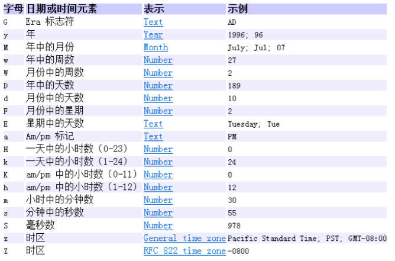

```Java
//SimpleDateFormat的实例化:new + 构造器


//*************照指定的方式格式化和解析：调用带参的构造器*****************
//        SimpleDateFormat sdf1 = new SimpleDateFormat("yyyyy.MMMMM.dd GGG hh:mm aaa");
        SimpleDateFormat sdf1 = new SimpleDateFormat("yyyy-MM-dd hh:mm:ss");
        //格式化
        String format1 = sdf1.format(date);
        System.out.println(format1);//2019-02-18 11:48:27
        //解析:要求字符串必须是符合SimpleDateFormat识别的格式(通过构造器参数体现),
        //否则，抛异常
        Date date2 = sdf1.parse("2020-02-18 11:48:27");
        System.out.println(date2);
```

## java.util.Calendar(日历)类

Calendar是一个抽象基类，主要用于完成日期字段之间相互操作的功能。

**获取Calendar实例的方法：**

- 使用Calendar.getInstance()方法。

- 调用子类GregorianCalendar的构造器。

Calendar的实例是系统时间的抽象表示，get(int field)方法可以获取想要的时间信息。field 选项：YEAR、MONTH、DAY_OF_WEEK、HOUR_OF_DAY、MINUTE、SECOND

**注意：**

- 获取月份时：一月是0，二月是1，以此类推，12月是11.
- 获取星期时：周日是1，......周六是7.

```Java
//1.实例化
//方式一：创建其子类（GregorianCalendar的对象
//方式二：调用其静态方法getInstance()
Calendar calendar = Calendar.getInstance();
//System.out.println(calendar.getClass());

//2.常用方法
//get()
int days = calendar.get(Calendar.DAY_OF_MONTH);
System.out.println(days);
System.out.println(calendar.get(Calendar.DAY_OF_YEAR));

//set()
//calendar可变性
calendar.set(Calendar.DAY_OF_MONTH,22);
days = calendar.get(Calendar.DAY_OF_MONTH);
System.out.println(days);

//add()
calendar.add(Calendar.DAY_OF_MONTH,-3);
days = calendar.get(Calendar.DAY_OF_MONTH);
System.out.println(days);

//getTime():日历类---> Date
Date date = calendar.getTime();
System.out.println(date);

//setTime():Date ---> 日历类
Date date1 = new Date();
calendar.setTime(date1);
days = calendar.get(Calendar.DAY_OF_MONTH);
System.out.println(days);
```

# JDK8中新日期时间API

**日期时间API的迭代：**

第一代：jdk 1.0 Date类

第二代：jdk 1.1 Calendar类，一定程度上替换Date类

**前两代存在的问题：**

可变性：像日期和时间这样的类应该是不可变的。

偏移性：Date中的年份是从1900开始的，而月份都从0开始。

格式化：格式化只对Date用，Calendar则不行。

此外，它们也不是线程安全的；不能处理闰秒等。

## java 8 中新的日期时间API涉及到的包

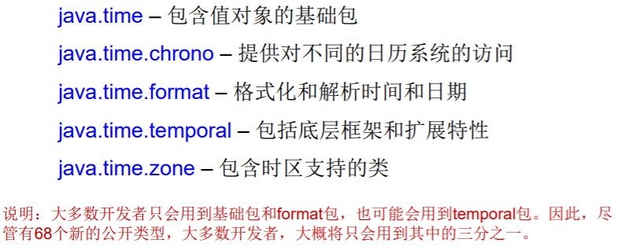

###  LocalDate、LocalTime、LocalDateTime

它们的实例是不可变的对象，分别表示使用 ISO-8601日历系统的日期、时间、日期和时间。提供了简单的本地日期或时间，并不包含当前的时间信息，也不包含与时区相关的信息。

- LocalDate代表IOS格式（yyyy-MM-dd）的日期
- LocalTime表示一个时间，而不是日期。
- LocalDateTime是用来表示日期和时间的，这是一个最常用的类之一。

*注：ISO-8601日历系统是国际标准化组织制定的现代公民的日期和时间的表示 法，也就是公历。*

#### 常用方法

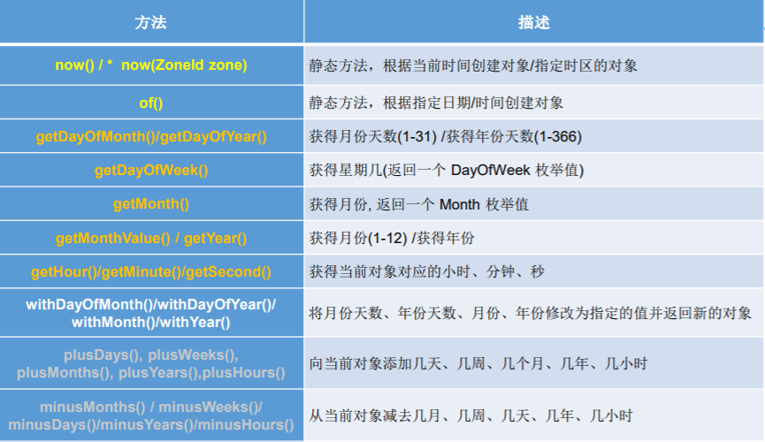

### 瞬时：Instant

**Instant：**表示时间线上的一个瞬时点。（可被用来记录应用程序中的事件时间戳）概念上讲，它只是简单的表示自1970年1月1日0时0分0秒（UTC开始的秒数。）

 java.time包通过值类型Instant提供机器视图，不提供处理人类意义上的时间 单位。因为java.time包是基于纳秒计算的，所以Instant的精度可以达到纳秒级。

(**1 ns = $10^{-9}$s** ) 1秒 = 1000毫秒 = $10^6$微秒 = $10^9$纳秒

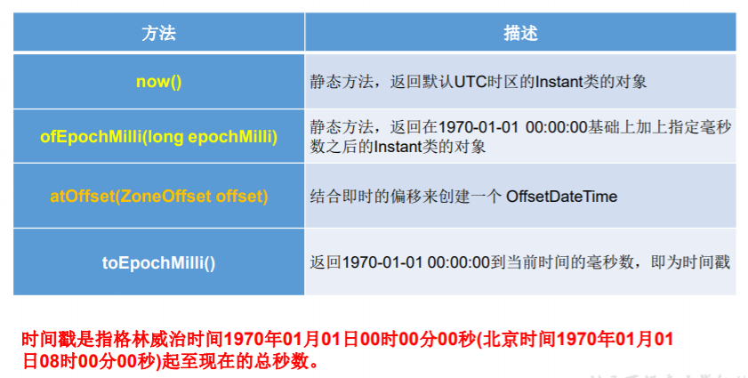

### java.time.format.DateTimeFormatter

**说明：**

1. 格式化或解析日期、时间
2. 类似于SimpleDateFormat

**格式化方法：**

- 预定义的标准格式。
  - ISO_LOCAL_DATE_TIME
  - ISO_LOCAL_DATE
  - ISO_LOCAL_TIME
- 本地化相关的格式。如：ofLocalizedDateTime(FormatStyle.LONG)
- 自定义的格式。如：ofPattern(“yyyy-MM-dd hh:mm:ss”)

**常用方法：**

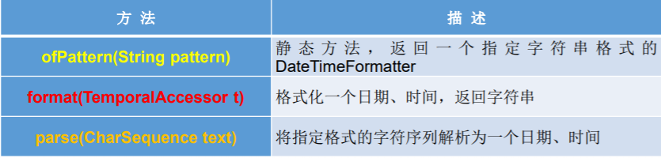

### 其他API

- **ZoneId：**该类中包含了所有的时区信息，一个时区的ID，如 Europe/Paris
- **ZonedDateTime：**一个在ISO-8601日历系统时区的日期时间，如 2007-12- 03T10:15:30+01:00 Europe/Paris。
  - 其中每个时区都对应着ID，地区ID都为“{区域}/{城市}”的格式，例如： Asia/Shanghai等
- **Clock：**使用时区提供对当前即时、日期和时间的访问的时钟。
- **持续时间：Duration**，用于计算两个“时间”间隔
- **日期间隔：Period**，用于计算两个“日期”间隔
- **TemporalAdjuster : 时间校正器。**
- **TemporalAdjusters**:该类通过静态方法 (firstDayOfXxx()/lastDayOfXxx()/nextXxx())提供了大量的常用 TemporalAdjuster 的实现。

#### 带时区的日期时间：ZonedDateTime / ZoneId

```Java
// ZoneId:类中包含了所的时区信息
@Test
public void test1(){
    //getAvailableZoneIds():获取所的ZoneId
    Set<String> zoneIds = ZoneId.getAvailableZoneIds();
    for(String s : zoneIds){
        System.out.println(s);
    }
    System.out.println();

    //获取“Asia/Tokyo”时区对应的时间
    LocalDateTime localDateTime = LocalDateTime.now(ZoneId.of("Asia/Tokyo"));
    System.out.println(localDateTime);


}
//ZonedDateTime:带时区的日期时间
@Test
public void test2(){
    //now():获取本时区的ZonedDateTime对象
    ZonedDateTime zonedDateTime = ZonedDateTime.now();
    System.out.println(zonedDateTime);
    //now(ZoneId id):获取指定时区的ZonedDateTime对象
    ZonedDateTime zonedDateTime1 = ZonedDateTime.now(ZoneId.of("Asia/Tokyo"));
    System.out.println(zonedDateTime1);
}
```

#### 时间间隔：Duration--用于计算两个“时间”间隔，以秒和纳秒为基准

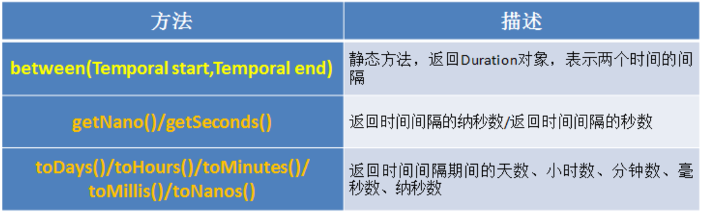

```Java
@Test
public void test3(){
    LocalTime localTime = LocalTime.now();
    LocalTime localTime1 = LocalTime.of(15, 23, 32);
    //between():静态方法，返回Duration对象，表示两个时间的间隔
    Duration duration = Duration.between(localTime1, localTime);
    System.out.println(duration);

    System.out.println(duration.getSeconds());
    System.out.println(duration.getNano());

    LocalDateTime localDateTime = LocalDateTime.of(2016, 6, 12, 15, 23, 32);
    LocalDateTime localDateTime1 = LocalDateTime.of(2017, 6, 12, 15, 23, 32);

    Duration duration1 = Duration.between(localDateTime1, localDateTime);
    System.out.println(duration1.toDays());

}
```

#### 日期间隔：Period --用于计算两个“日期”间隔，以年、月、日衡量

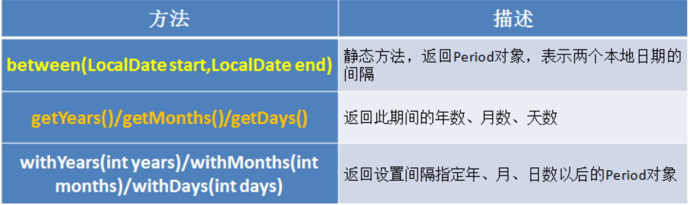

```Java
@Test
public void test4(){
    LocalDate localDate = LocalDate.now();
    LocalDate localDate1 = LocalDate.of(2028, 3, 18);

    Period period = Period.between(localDate, localDate1);
    System.out.println(period);

    System.out.println(period.getYears());
    System.out.println(period.getMonths());
    System.out.println(period.getDays());

    Period period1 = period.withYears(2);
    System.out.println(period1);

}
```

#### 日期时间校正器：TemporalAdjuster

```Java
@Test
public void test5(){
    //获取当前日期的下一个周日是哪天？
    TemporalAdjuster temporalAdjuster = TemporalAdjusters.next(DayOfWeek.SUNDAY);

    LocalDateTime localDateTime = LocalDateTime.now().with(temporalAdjuster);
    System.out.println(localDateTime);

    //获取下一个工作日是哪天？
    LocalDate localDate = LocalDate.now().with(new TemporalAdjuster(){

        @Override
        public Temporal adjustInto(Temporal temporal) {
            LocalDate date = (LocalDate)temporal;
            if(date.getDayOfWeek().equals(DayOfWeek.FRIDAY)){
                return date.plusDays(3);
            }else if(date.getDayOfWeek().equals(DayOfWeek.SATURDAY)){
                return date.plusDays(2);
            }else{
                return date.plusDays(1);
            }

        }

    });

    System.out.println("下一个工作日是：" + localDate);
}
```

### 与传统日期处理的转换

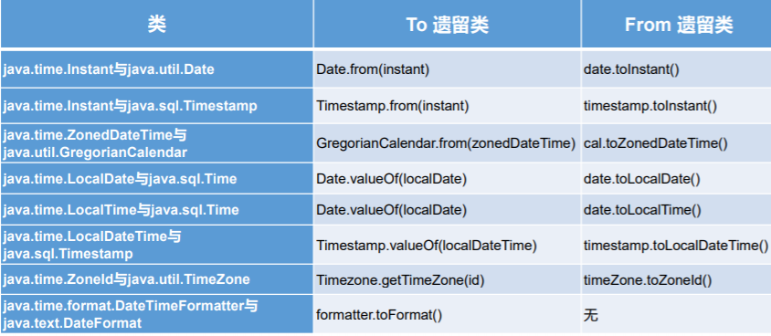

# Java比较器

对象之间的比较。

## 分类

- 自然排序：java.lang.Comparable
- 定制排序：java.util.Comparator

### 自然排序：java.lang.Comparable接口

Comparable接口强行对实现它的每个类的对象进行整体排序。这种排序被称为类的自然排序。

实现 Comparable 的类必须实现 compareTo(Object obj) 方法，两个对象即通过 compareTo(Object obj) 方法的返回值来比较大小。

实现Comparable接口的对象列表（和数组）可以通过 Collections.sort 或 Arrays.sort进行自动排序。实现此接口的对象可以用作有序映射中的键或有序集合中的元素，无需指定比较器。

**Comparable 的典型实现：(默认都是从小到大排列的)**

- String：按照字符串中字符的Unicode值进行比较
- Character：按照字符的Unicode值来进行比较
- 数值类型对应的包装类以及BigInteger、BigDecimal：按照它们对应的数值 大小进行比较
- Boolean：true 对应的包装类实例大于 false 对应的包装类实例
- Date、Time等：后面的日期时间比前面的日期时间大

**说明：**

1. 像String、包装类等实现了Comparable接口，重写了compareTo(obj)方法，给出了比较两个对象大小的方式。
2. 像String、包装类重写compareTo()方法以后，进行了从小到大的排列
3. **重写compareTo(obj)的规则：**
   - 如果当前对象this大于形参对象obj，则返回正整数，
   - 如果当前对象this小于形参对象obj，则返回负整数，
   - 如果当前对象this等于形参对象obj，则返回零。

**举例：**

```Java
public class Goods implements  Comparable{

    private String name;
    private double price;

    //指明商品比较大小的方式:照价格从低到高排序,再照产品名称从高到低排序
    @Override
    public int compareTo(Object o) {
//        System.out.println("**************");
        if(o instanceof Goods){
            Goods goods = (Goods)o;
            //方式一：
            if(this.price > goods.price){
                return 1;
            }else if(this.price < goods.price){
                return -1;
            }else{
//                return 0;
               return -this.name.compareTo(goods.name);
            }
            //方式二：
//           return Double.compare(this.price,goods.price);
        }
//        return 0;
        throw new RuntimeException("传入的数据类型不一致！");
    }
// getter、setter、toString()、构造器：省略
}
```

### 定制排序：java.util.Comparator接口

**说明：**

1. 背景：

   当元素的类型没实现java.lang.Comparable接口而又不方便修改代码，或者实现了java.lang.Comparable接口的排序规则不适合当前的操作，那么可以考虑使用 Comparator 的对象来排序

2. 重写compare(Object o1,Object o2)方法，比较o1和o2的大小：

   - 如果方法返回正整数，则表示o1大于o2；
   - 如果返回0，表示相等；
   - 返回负整数，表示o1小于o2。

**举例：**

```java
Comparator com = new Comparator() {
    //指明商品比较大小的方式:照产品名称从低到高排序,再照价格从高到低排序
    @Override
    public int compare(Object o1, Object o2) {
        if(o1 instanceof Goods && o2 instanceof Goods){
            Goods g1 = (Goods)o1;
            Goods g2 = (Goods)o2;
            if(g1.getName().equals(g2.getName())){
                return -Double.compare(g1.getPrice(),g2.getPrice());
            }else{
                return g1.getName().compareTo(g2.getName());
            }
        }
        throw new RuntimeException("输入的数据类型不一致");
    }
}
```

还可使用：

Arrays.sort(goods,com);

Collections.sort(coll,com);

new TreeSet(com);

### 两种排序方式对比

Comparable接口的方式一旦一定，保证Comparable接口实现类的对象在任何位置都可以比较大小。

Comparator接口属于临时性的比较。

# System类

- System类代表系统，系统级的很多属性和控制方法都放置在该类的内部。该类位于java.lang包。

- 由于该类的构造器是private的，所以无法创建该类的对象，也就是无法实例化该类。其内部的成员变量和成员方法都是static的，所以也可以很方便的进行调用。

- 成员变量

  - System类内部包含in、out和err三个成员变量，分别代表标准输入流 (键盘输入)，标准输出流(显示器)和标准错误输出流(显示器)。

- 成员变量

  - **native long currentTimeMillis()：**返回当前的计算机时间，时间的表达格式为当前计算机时 间和GMT时间(格林威治时间)1970年1月1号0时0分0秒所差的毫秒数。

  - **void exit(int status)：**退出程序。其中status的值为0代表正常退出，非零代表异常退出。使用该方法可以在图形界面编程中实现程序的退出功能等。

  - **void gc()：**请求系统进行垃圾回收。至于系统是否立刻回收，则 取决于系统中垃圾回收算法的实现以及系统执行时的情况。

  - **String getProperty(String key)：**获得系统中属性名为key的属性对应的值。

    系统中常见 的属性名以及属性的作用：

    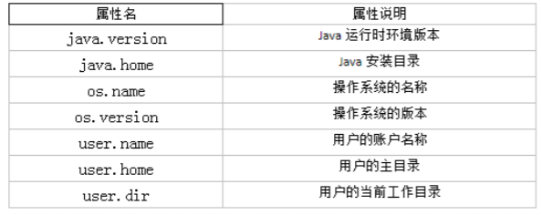

# Math类

java.lang.Math提供了一系列静态方法用于科学计算。其方法的参数和返回值类型一般为double型。

| 方法名                          | 解释                                  |
| ------------------------------- | ------------------------------------- |
| abs                             | 绝对值                                |
| acos、asin、atan、cos、sin、tan | 三角函数                              |
| pow(double a,double b)          | a的b次幂                              |
| log                             | 自然对数                              |
| exp                             | e为低指数                             |
| max(double a,double b)          | 计算最大值                            |
| min(double a,double b)          | 计算最小值                            |
| random()                        | 返回0.0到1.0的随机数                  |
| long round(double a)            | double型数据a转换为long型（四舍五入） |
| toDegrees(double angrad)        | 弧度 → 角度                           |
| toRadians(double angdeg)        | 角度 → 弧度                           |
|                                 |                                       |

# BigInteger与BigDecimal


## BigInteger类

java.math包的**BigInteger可以表示不可变的任意精度的整数。**

BigInteger 提供 所有 Java 的基本整数操作符的对应物，并提供 java.lang.Math 的所有相关方法。

另外，BigInteger 还提供以下运算：模算术、GCD 计算、质数测试、素数生成、 位操作以及一些其他操作。

**构造器：**

```java
BigInteger(String val)：根据字符串构建BigInteger对象
```

**常用方法：**

- ```Java
  public BigInteger abs()：返回此BigInteger的绝对值的 BigInteger。
  ```

- ```Java
  BigInteger add(BigInteger val) ：返回其值为(this + val)的BigInteger
  ```

- ```Java
  BigInteger subtract(BigInteger val) ：返回其值为(this - val)的BigInteger
  ```

- ```Java
  BigInteger multiply(BigInteger val) ：返回其值为(this * val)的BigInteger
  ```

- ```Java
  BigInteger divide(BigInteger val) ：返回其值为(this / val)的BigInteger。整数相除只保留整数部分。
  ```

- ```Java
  BigInteger remainder(BigInteger val) ：返回其值为 (this % val)的BigInteger。
  ```

- ```Java
  BigInteger[] divideAndRemainder(BigInteger val)：返回包含 (this / val)后跟(this % val)的两个BigInteger的数组。
  ```

- ```Java
  BigInteger pow(int exponent) ：返回其值(thisexponent) 的 BigInteger。
  ```

## BigDecimal类

一般的Float类和Double类可以用来做科学计算或工程计算，但在商业计算中， 要求数字精度比较高，故用到java.math.BigDecimal类。

BigDecimal类支持不可变的、任意精度的有符号十进制定点数。

**构造器：**

- ```Java
  public BigDecimal(double val)
  ```

- ```Java
  public BigDecimal(String val)
  ```

**常用方法：**

- ```Java
  public BigDecimal add(BigDecimal augend)
  ```

- ```Java
  public BigDecimal subtract(BigDecimal subtrahend)
  ```

- ```Java
  public BigDecimal multiply(BigDecimal multiplicand)
  ```

- ```Java
  public BigDecimal divide(BigDecimal divisor, int scale, int roundingMode)
  ```


```Java
public void testBigInteger() {
    BigInteger bi = new BigInteger("12433241123");
    BigDecimal bd = new BigDecimal("12435.351");
    BigDecimal bd2 = new BigDecimal("11");
    System.out.println(bi);
    // System.out.println(bd.divide(bd2));
    System.out.println(bd.divide(bd2, BigDecimal.ROUND_HALF_UP));
    System.out.println(bd.divide(bd2, 15, BigDecimal.ROUND_HALF_UP));
}
```


