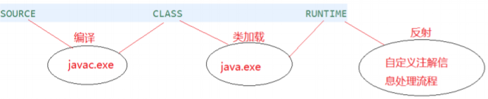
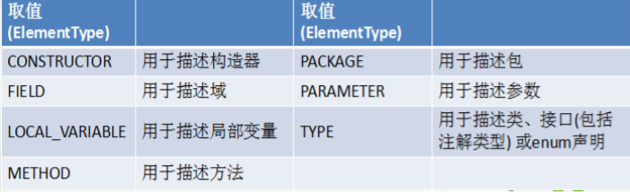
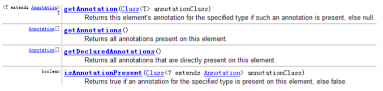

[TOC]

# 枚举类

**说明：**

1. 枚举类的理解：类的对象只有有限个，确定的。
2. 当需要定义一组常量时，强烈建议使用枚举类。
3. 如果枚举类中只一个对象，则可以作为单例模式的实现方式。

**枚举类的属性：**

- 枚举类对象的属性不应允许被改动，所以应该使用private final修饰。
- 枚举类中使用private final修饰的属性应该在构造器中为其赋值。
- 若枚举类显式的定义了带参数的构造器，则在列出枚举值时也必须对应得传入参数。
- 私有化类得构造器，保证不能在类得外部创建其对象。
- 在类得内部创建枚举类的实例。声明为：public static final
- 对象如果有实例变量，应该声明为private final，并在构造器中初始化

## 枚举类的实现

### JDK 1.5 之前需要自定义枚举类

```Java
//自定义枚举类
class Season{
    //1.声明Season对象的属性:private final修饰
    private final String seasonName;
    private final String seasonDesc;

    //2.私化类的构造器,并给对象属性赋值
    private Season(String seasonName,String seasonDesc){
        this.seasonName = seasonName;
        this.seasonDesc = seasonDesc;
    }

    //3.提供当前枚举类的多个对象：public static final的
    public static final Season SPRING = new Season("春天","春暖花开");
    public static final Season SUMMER = new Season("夏天","夏日炎炎");
    public static final Season AUTUMN = new Season("秋天","秋高气爽");
    public static final Season WINTER = new Season("冬天","冰天雪地");

    //4.其他诉求1：获取枚举类对象的属性
    public String getSeasonName() {
        return seasonName;
    }

    public String getSeasonDesc() {
        return seasonDesc;
    }
    //4.其他诉求1：提供toString()
    @Override
    public String toString() {
        return "Season{" +
                "seasonName='" + seasonName + '\'' +
                ", seasonDesc='" + seasonDesc + '\'' +
                '}';
    }
}
```

### jdk 5.0 新增使用enum定义枚举类

#### 使用说明

- 使用enum定义的**枚举类默认继承了java.lang.Enum类**，因此不能再继承其他类。
- 枚举类的构造器只能使用private权限修饰符。
- 枚举类的所有实例必须在枚举类中显式列出（**，分隔 ；结尾**）。列出的实例系统会**自动添加public static final**修饰。
- 必须在枚举类的第一行声明枚举类对象。

**JDK 1.5 中可以在switch表达式中使用Enum定义的枚举类的对象作为表达式，**case子句可以直接使用枚举值的名字，无需添加枚举类作为限定。

```Java
public enum SeasonEnum {
    SPRING("春天","春风又绿江南岸"),
    SUMMER("夏天","映日荷花别样红"),
    AUTUMN("秋天","秋水共长天一色"),
    WINTER("冬天","窗含西岭千秋雪");
    
    private final String seasonName;
    private final String seasonDesc;
    private SeasonEnum(String seasonName, String seasonDesc) {
        this.seasonName = seasonName;
        this.seasonDesc = seasonDesc;
    }
    public String getSeasonName() {
    	return seasonName;
    }
    public String getSeasonDesc() {
    	return seasonDesc;
    }
}
```

#### Enum类的主要方法

|       方法名        |                           详细描述                           |
| :-----------------: | :----------------------------------------------------------: |
|      values()       |                   返回枚举类型的对象数组。                   |
| valueOf(String str) | 把一个字符串转为对应的枚举类对象。要求字符串必须是枚举类对象的“名字”。如不是，会有运行时异常：IllegalArgumentException。 |
|       valueOf       | 传递枚举类型的Class对象和枚举常量名称给静态方法valueOf，会得到与参数匹配得枚举常量 |
|      toString       |                 返回当前枚举类对象常量的名称                 |
|       equals        | 在枚举类型中可以直接使用“==”来比较两个枚举常量是否相等。Enum提供的这个equals()方法，也是直接使用“==”实现的。它的存在是为了在Set、List和Map中使用。注意，equals()是不可变的。 |
|      hashCode       |    Enum实现了hashCode()来和equals()保持一致。它是不可变的    |
|  getDeclaringClass  | 得到枚举常量所属枚举类型的Class对象。可以用它来判断两个枚举常量是否属于同一个枚举类型。 |
|        name         |                   得到当前枚举常量的名称。                   |
|       ordinal       |                    得到当前枚举常量的次序                    |
|      compareTo      | 枚举类型实现了Comparable接口，比较两个枚举常量的大小（按照声明的顺序排列） |
|        clone        | 枚举类型不能被Clone。为防止子类实现克隆方法，Enum实现了一个仅抛出CloneNotSupportedException异常的不变Clone()。 |

```Java
Season1 summer = Season1.SUMMER;
//toString():返回枚举类对象的名称
System.out.println(summer.toString());

//System.out.println(Season1.class.getSuperclass());
System.out.println("****************");
//values():返回所的枚举类对象构成的数组
Season1[] values = Season1.values();
for(int i = 0;i < values.length;i++){
    System.out.println(values[i]);
}
System.out.println("****************");
Thread.State[] values1 = Thread.State.values();
for (int i = 0; i < values1.length; i++) {
    System.out.println(values1[i]);
}

//valueOf(String objName):返回枚举类中对象名是objName的对象。
Season1 winter = Season1.valueOf("WINTER");
//如果没objName的枚举类对象，则抛异常：IllegalArgumentException
//Season1 winter = Season1.valueOf("WINTER1");
System.out.println(winter);
```


#### 实现接口的枚举类

```Java
interface Info{
    void show();
}

//使用enum关键字枚举类
enum Season1 implements Info{
    //1.提供当前枚举类的对象，多个对象之间用","隔开，末尾对象";"结束
    SPRING("春天","春暖花开"){
        @Override
        public void show() {
            System.out.println("春天在哪里？");
        }
    },
    SUMMER("夏天","夏日炎炎"){
        @Override
        public void show() {
            System.out.println("宁夏");
        }
    },
    AUTUMN("秋天","秋高气爽"){
        @Override
        public void show() {
            System.out.println("秋天不回来");
        }
    },
    WINTER("冬天","冰天雪地"){
        @Override
        public void show() {
            System.out.println("大约在冬季");
        }
    };
}
```

# 注解（Annotation）

## 概述

1. JDK 5.0 新增的功能。元数据(MetaData)支持。
2. **Annotation**其实就是代码里的**特殊标记**，这些标记可以在编译, 类加载, 运行时被读取, 并执行相应的处理。通过使用Annotation，程序员可以在不改变原逻辑的情况下，在源文件中嵌入一些补充信息。
3. **Annotation**可以像修饰符一样被使用，可用于**修饰包、类、构造器、方法、成员变量、参数、局部变量的声明，**这些信息被保存在Annotation的“name=value”键字对中。
4. 在JavaSE中，注解的使用目的比较简单，例如标记过时的功能，忽略警告等。在JavaEE/Android中注解占据了更重要的角色，例如用来配置应用程序的任何切面，代替JavaEE旧版中所遗留的繁冗代码和XML配置等。
5. **框架 = 注解 + 反射机制 + 设计模式**

## 常见的Annotation示例

使用 Annotation 时要在其前面增加 @ 符号, 并**把该 Annotation 当成 一个修饰符使用**。用于修饰它支持的程序元素。

### 生成文档相关的注解

@author	标明开发该类模块的作者，多个作者之间使用，分割

@version	表明该类模块的版本

@see	参考转向，也就是相关主题

@since	从哪个版本开始增加的

@param	对方法中某参数的说明，如没有参数就不能写

@return	对方法返回值的说明，如方法的返回值类型是void就不能写

@exception	对方法可能抛出的异常进行说明，如方法没有用用throws显示抛出的异常就不能写。

**其他说明：**

@param、@return和@exception只用于方法。

@param的格式：@param	形参名	形参类型	形参说明

@return的格式：@return	返回值类型	返回值说明

@exception的格式要求：@exception	异常类型	异常说明

@param和@execption可以并列多个

```Java
package com.annotation.javadoc;
/**
* @author shkstart
* @version 1.0
* @see Math.java
*/
public class JavadocTest {
    /**
    * 程序的主方法，程序的入口
    * @param args String[] 命令行参数
    */
    public static void main(String[] args) {
    }
    /**
    * 求圆面积的方法
    * @param radius double 半径值
    * @return double 圆的面积
    */
    public static double getArea(double radius){
    	return Math.PI * radius * radius;
    }
}
```

###在编译时进行格式检查（JDK内置的三个基本注解）

@Override	限定重写父类方法，只能用于方法

@Deprecated	表示修饰的元素（类、方法）已过时。

@SuppressWarnings	抑制编译器警告

```Java
package com.annotation.javadoc;
public class AnnotationTest{
    public static void main(String[] args) {
        @SuppressWarnings("unused")
        int a = 10;
    }
    @Deprecated
    public void print(){
    	System.out.println("过时的方法");
    }
    @Override
    public String toString() {
    	return "重写的toString方法()";
    }
}
```

### 跟踪代码依赖性，实现替代配置文件功能

#### Servlet3.0提供了注解(annotation),使得不再需要在web.xml文件中进行Servlet的部署。

```Java
@WebServlet("/login")
public class LoginServlet extends HttpServlet {
    private static final long serialVersionUID = 1L;
    protected void doGet(HttpServletRequest request, HttpServletResponse response) throws
    ServletException, IOException { }
    protected void doPost(HttpServletRequest request, HttpServletResponse response) throws
    ServletException, IOException {
    	doGet(request, response);
    } 
}
```

```xml
<servlet>
    <servlet-name>LoginServlet</servlet-name>
    <servlet-class>com.servlet.LoginServlet</servlet-class>
</servlet>
<servlet-mapping>
    <servlet-name>LoginServlet</servlet-name>
    <url-pattern>/login</url-pattern>
</servlet-mapping>
```

####  spring框架中关于“事务”的管理

```Java
@Transactional(propagation=Propagation.REQUIRES_NEW,
isolation=Isolation.READ_COMMITTED,readOnly=false,timeout=3)
public void buyBook(String username, String isbn) {
    //1.查询书的单价
    int price = bookShopDao.findBookPriceByIsbn(isbn);
    //2. 更新库存
    bookShopDao.updateBookStock(isbn);
    //3. 更新用户的余额
    bookShopDao.updateUserAccount(username, price);
}
```

```xml
<!-- 配置事务属性 -->
<tx:advice transaction-manager="dataSourceTransactionManager" id="txAdvice">
    <tx:attributes>
    <!-- 配置每个方法使用的事务属性 -->
    <tx:method name="buyBook" propagation="REQUIRES_NEW"
    isolation="READ_COMMITTED" read-only="false" timeout="3" />
    </tx:attributes>
</tx:advice>
```

## 自定义Annotation

1. 注解使用@interface关键字
2. 自定义注解自动继承了java.lang.annotation.Annotation接口
3. Annotation的成员变量在Annotation定义中以无参数方法的形式声明。其方法名和返回值定义该成员的名字和类型。也称为配置参数。**类型只能为八种基本数据类型、String类型、Class类型、enum类型、Annotation类型、以上所有类型的数组。**
4. 可以指定成员的默认值，使用default定义
5. 如果只有一个参数成员，建议使用参数名为value
6. 如果定义的注解含有配置参数，必须指定参数值，除非有默认值。**格式：参数名 = 参数值**，如只有一个参数，且名为value，可以省略“value=”
7. **没有成员定义的Annotation称为标记；包含成员变量的Annotation称为元数据Annotation。**

**注意：自定义注解必须配上注解的信息处理流程才有意义。**

**自定义注解通过都会指明两个元注解：Retention、Target**

```Java
@Inherited
@Repeatable(MyAnnotations.class)
@Retention(RetentionPolicy.RUNTIME)
@Target({TYPE, FIELD, METHOD, PARAMETER, CONSTRUCTOR, LOCAL_VARIABLE,TYPE_PARAMETER,TYPE_USE})
public @interface MyAnnotation {

    String value() default "hello";
}
```

## JDK中的元注解

JDK的元Annotation用于修饰其他Annotation定义。即对现有的注解进行解释说明的注解。

#### **JDK 5.0提供标准的meta-annotation类型**

- **@Retention：**只用于修饰一个Annotation定义，指定该Annotation的生命周期，包含一RetentionPolicy类型的成员变量，使用是必须为其指定值：
  - **RetentionPolicy.SOURCE：在源文件中有效（即源文件保留），**编译器直接丢弃该注释
  - **RetentionPolicy.CLASS：在class文件中有效（即class保留），**运行Java程序时，JVM不会保留注解。这是默认值。
  - **RetentionPolicy.RUNTIME：在运行时有效（即运行时保留），当运行Java程序时，JVM会保留注释。程序可以通过反射获取该注释。**



- **@Target：**用于修饰Annotation定义，指定被修饰的Annotation能修饰哪些程序元素。包含一个名为value的成员变量。

  

- **@Documented：**用于指定被该元Annotation修饰的Annotation类将被javadoc工具提取成文档。默认情况下，javadoc是不包括注解的。
  - 定义为Documented的注解必须设置Retention值为RUNTIME。。
- **@Inherited：**修饰的Annotation将具有继承性。被它修饰的Annotation的子类自动具有该注解。

## 利用反射获取注解信息

**JDK 5.0 在java.lang.reflect包下新增了AnnotatedElement接口**，该接口**代表程序中可以接受注解的程序元素。**

**注解的元注解Retention中声明的生命周期状态为：RUNTIME**。该注解才在运行时可见。

**AnnotatedElement对象的方法：**



## JDK8中注解的新特性

### 可重复注解

1. 在MyAnnotation上声明@Repeatable，成员值为MyAnnotations.class
2. MyAnnotation的Target和Retention等元注解与MyAnnotations相同。

如：

```Java
@Target({TYPE,FIELD,METHOD,PARAMETER,CONSTRUCTOR,LOCAL_VARIABLE})
@Retention(RetentionPolicy.RUNTIME)
public @interface MyAnnotations{
    MyAnnotation[] value();
}

@Repeatable(MyAnnotations.class)
@Target({TYPE,FIELD,METHOD,PARAMETER,CONSTRUCTOR,LOCAL_VARIABLE})
@Retention(RetentionPolicy.RUNTIME)
public @interface MyAnnotations{
    MyAnnotation[] value();
}

@MyAnnotation("Hello")
@MyAnnotation("World")
public void show(@MyAnnotation("abc") String str){    
}
```

### 类型注解

JDK 1.8 增加了注解@Target的参数类型ElementType枚举值：**TYPE_PARAMETER,TYPE_USE**。

**JDK 1.8之前，注解只能在声明的地方使用，Java8开始，注解可以应用在任何地方。**

- ElementType.TYPE_PARAMETER	表示该注解能写在类型变量的声明语句中（如：泛型声明）

  ```Java
  public class TestTypeDefine<@TypeDefine() U> {
      private U u;
      public <@TypeDefine() T> void test(T t){
      }
  }
  @Target({ElementType.TYPE_PARAMETER})
  @interface TypeDefine{
  }
  ```

- ElementType.TYPE_USE    表示该注解能写在使用类型的任何语句中。

  ```Java
  @MyAnnotation
  public class AnnotationTest<U> {
      @MyAnnotation
      private String name;
      public static void main(String[] args) {
          AnnotationTest<@MyAnnotation String> t = null;
          int a = (@MyAnnotation int) 2L;
          @MyAnnotation
          int b = 10;
      }
      public static <@MyAnnotation T> void method(T t) {
      }
      public static void test(@MyAnnotation String arg) throws @MyAnnotation Exception {
      }
  }
  @Target(ElementType.TYPE_USE)
  @interface MyAnnotation {
  }
  ```