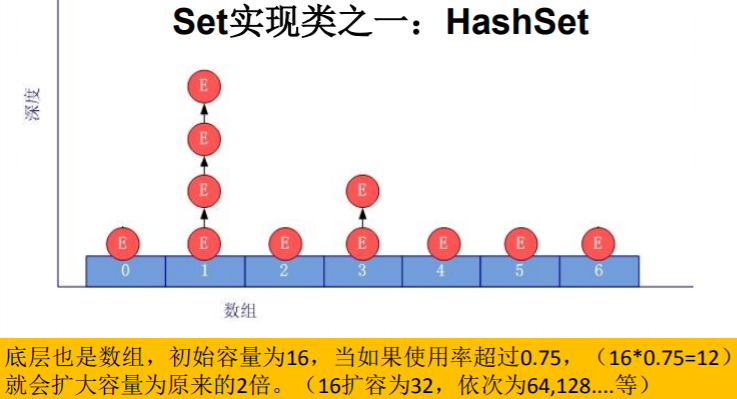

[TOC]

# Java集合框架概述

## 数组与集合

集合、数组都是对多个数据进行存储操作的结构，简称容器。

**说明：**此时的存储，主要指的是内存层面的存储，不涉及到持久化的存储（.txt,.jpg,.avi，数据库中)

#### **数组存储的特点**

1. 一旦初始化以后，其长度就确定了。
2. 数组一旦定义好，其元素的类型也就确定了。也就只能操作指定类型的数据了。

#### 数组存储的弊端

- 一旦初始化以后，其长度就不可修改。
- 数组中提供的方法非常限，对于添加、删除、插入数据等操作，非常不便，同时效率不高。
- 获取数组中实际元素的个数的需求，数组没有现成的属性或方法可用
- 数组存储数据的特点：有序、可重复。对于无序、不可重复的需求，不能满足。

#### 集合存储的优点

Java 集合类可以用于存储数量不等的多个对象，还可用于保存具有映射关系的 关联数组。

可以解决数组存储数据方面的弊端。

## Java集合的体系

### Collection接口继承树

- **Collection接口：**单列数据，定义了存取一组对象的方法的集合。
  - **List：**元素有序、可重复的集合
  - **Set：**元素无序、不可重复的集合


### Map接口继承树

**Map接口：**双列数据，保存具有映射关系“key-value对”的集合。


## 集合的使用场景


# Collection接口方法

- Conllection接口是List、Set和Queue接口的父接口。

- JDK不提供该接口的直接实现，而是提供其子接口的实现。

- Java5之前，Java集合会丢失容器中所有对象的数据类型，把所有对象都当做Object类型处理；

  JDK5之后增加了泛型以后，Java集合可以记住容器对象的数据类型。

## 接口方法

**JDK提供的集合API位于java.util包内**

1. 添加

   - add(Object obj)
   - addAll(Collection coll)

2. 获取有效元素的个数

   - int size()

3. 清空集合

   - void clear()

4. 是否是空集合

   - boolean isEmpty()

5. 是否包含某个元素

   - boolean contains(Object obj)：通过元素的equals方法来判断是否是同一对象
   - boolean containsAll(Collection c)：调用元素的equals方法来比较的，拿两个集合的元素挨个比较

6. 删除

   - boolean remove(Object obj)：通过元素的equals方法判断是否是要删除的那个元素。只会删除找到的第一个元素。
   - boolean removeAll(Collection coll)：取当前集合的差集。

7. 取两个集合的交集

   - boolean retainAll(Collection c)：把交集的结果存在当前集合中，不影响c

8. 集合是否相等

   - boolean equals(Object obj)

9. 转成对象数组

   - Object[] toArray()

   ```Java
   //集合 --->数组：toArray()
   Object[] arr = coll.toArray();
   for(int i = 0;i < arr.length;i++){
       System.out.println(arr[i]);
   }
   //拓展：数组 --->集合:调用Arrays类的静态方法asList(T ... t)
   List<String> list = Arrays.asList(new String[]{"AA", "BB", "CC"});
   System.out.println(list);
   
   List arr1 = Arrays.asList(new int[]{123, 456});
   System.out.println(arr1.size());//1
   
   List arr2 = Arrays.asList(new Integer[]{123, 456});
   System.out.println(arr2.size());//2
   ```

   

10. 获取集合对象的hash值

    - hashCode()

11. 遍历

    - iterator()：返回迭代器对象，用于集合遍历

#### Collection集合存储对象的要求

向Collection接口的实现类的对象中添加数据obj时，要求obj所在类要重写equals()。

# Iterator迭代器接口

#### 遍历Collection

1. 使用迭代器Iterator
2. foreach循环(或增强for循环)

## 迭代器说明

Iterator接口在java.utils包下

- Iterator对象称为迭代器（设计模式的一种），主要用于遍历 Collection 集合中的元素。
- **GOF给迭代器模式的定义：**提供一种方法访问一个容器（container）对象中各个元素，而又不需暴露该对象的内部细节。迭代器模式，就是为容器而生。
- Collection接口继承了java.lang.Iterable接口，所有实现Collection接口的集合类都实现该iterator()方法，并返回一个Iterator对象。
- Iterator仅用于遍历集合。
- 集合对象每次调用iterator()方法都得到一个全新的迭代器对象。

## Iterator方法


```Java
Iterator iterator = coll.iterator();
//hasNext():判断是否还下一个元素
while(iterator.hasNext()){
    //next():①指针下移 ②将下移以后集合位置上的元素返回
    System.out.println(iterator.next());
}
```

#### Iterator接口remove()方法

```Java
@Test
public void test3(){
    Collection coll = new ArrayList();
    coll.add(123);
    coll.add(456);
    coll.add(new Person("Jerry",20));
    coll.add(new String("Tom"));
    coll.add(false);

    //删除集合中"Tom"
    Iterator iterator = coll.iterator();
    while (iterator.hasNext()){
        Object obj = iterator.next();
        if("Tom".equals(obj)){
            iterator.remove();
        }

    }
    //遍历集合
    iterator = coll.iterator();
    while (iterator.hasNext()){
        System.out.println(iterator.next());
    }
}
```

**注意：**

- 迭代器遍历集合过程中可以通过迭代器对象的remove()方法删除集合中的元素。**不是集合对象的remove()方法，而是迭代器对象的remove()方法。**
- **如还未调用next()或在上一次调用next()方法之后已经调用了remove()方法，再调用remove()方法都会报IllegalStateException。**

## 迭代器的执行原理


## foreach循环（增强for循环）

- JDK 5.0 新增，用于循环迭代访问Collection和数组。
- 遍历操作不需要获取集合或数组的长度，无需使用索引访问元素。
- 底层调用Iterator完成操作。

```Java
@Test
public void test1(){
    Collection coll = new ArrayList();
    coll.add(123);
    coll.add(456);
    coll.add(new Person("Jerry",20));
    coll.add(new String("Tom"));
    coll.add(false);

    //for(集合元素的类型 局部变量 : 集合对象)  
    for(Object obj : coll){
        System.out.println(obj);
    }
}

@Test
public void test2(){
    int[] arr = new int[]{1,2,3,4,5,6};
    //for(数组元素的类型 局部变量 : 数组对象)
    for(int i : arr){
        System.out.println(i);
    }
}
```

# Collection子接口：List接口

## List接口概述

- List集合类的中**元素有序、且可重复**。
- 集合中每个元素都有对应的顺序索引，可根据索引存取容器中的元素。
- 常见实现类有：ArrayList、LinkedList和Vector。

## List接口方法

void add(int index,Object obj)：在index位置插入obj元素

void add(Object obj)：添加元素

boolean addAll(int index,Collection eles)：从index位置开始将eles中的所有元素添加进集合

Object get(int index)：获取指定index位置的元素

int indexOf(Object obj)：返回obj在集合中首次出现的位置

int lastIndexOf(Object obj)：返回Obj在当前集合中最后一次出现的位置。

Object remove(int index)：移除指定index位置的元素，并返回此元素。

Object set(int index,Object ele)：设置指定index位置的元素为ele

List subList(int fromIndex,int toIndex)：返回从fromIndex到toIndex位置的子集合。

int size()：List长度

**List集合遍历：**

1. Iterator迭代器方式
2. 增强for循环
3. 普通的循环

## List实现类之一：ArrayList

- 本质上，ArrayList是对象引用的一个“变长”数组。
- 线程不安全的，效率高。
- List接口的典型实现类、主要实现类。

#### ArrayList的JDK1.8之前与之后的实现区别？

##### JDK1.7中ArrayList的情况

```Java
ArrayList list = new ArrayList();
//底层创建了长度是10的Object[]数组elementData。
//如果底层数组容量不够，则扩容。
//默认情况下，扩容为原来的容量的1.5倍，同时需要将原有数组中的数据复制到新的数组中。
//建议开发中使用带参的构造器：ArrayList list = new ArrayList(int capacity)
```

##### JDK1.8中ArrayList的情况

```Java
ArrayList list = new ArrayList();
//创建时没有初始化底层数组，即初始长度为0。
//第一次调用add()时，底层才创建了长度10的数组。
//扩容时的操作与之前相同。
```

##### 总结

jdk7中的ArrayList的对象的创建类似于单例的饿汉式，而jdk8中的ArrayList的对象的创建类似于单例的懒汉式，延迟了数组的创建，节省内存。

#### 注意

Arrays.asList(…) 方法返回的 List 集合，既不是 ArrayList 实例，也不是 Vector 实例。 Arrays.asList(…) 返回值是一个固定长度的 List 集合

## List实现类之二：LinkedList

- 对于频繁的插入、删除操作，使用此类效率比ArrayList高
- 底层使用双向链表存储

### 新增方法

void addFirst(Object obj)：将元素添加到列表的首部

void addLast()：将元素添加到列表的尾部

Object getFirst()：获取列表中的首个元素

Object getLast()：获取列表中的最后一个元素

Object removeFirst()：移除列表中的第一个元素

Object removeLast()：移除列表中的最后一个元素

### 源码分析

**LinkedList：** **双向链表**，内部没有声明数组，而是定义了Node类型的first和last用来记录首末元素。

LinkList定义了内部类Node，作为LinkedList中保存数据的基本结构。

**Node定义了两个变量：**

- prev变量记录前一个元素的位置
- next变量记录下一个元素的位置

```Java
private static class Node<E> {
    E item;
    Node<E> next;
    Node<E> prev;
    Node(Node<E> prev, E element, Node<E> next) {
        this.item = element;
        this.next = next;
        this.prev = prev;
    }
}
```


## List实现类之三：Vector

- JDK 1.0 增加，大多数操作与ArrayList相同。
- 线程安全的，效率低。
- 底层使用Object[] elementData存储（初始长度为10）

### 新增方法

void addElement(Object obj)：添加元素

void insertElement(Object obj,int index)：指定位置插入元素

void setElementAt(Object obj,int index)：指定位置设置元素，可用于修改

void removeElement(Object obj)：移除指定元素

void removeAllElements()：移除所有元素

### 源码分析

jdk7和jdk8中通过Vector()构造器创建对象时，底层都创建了长度为10的数组。
在扩容方面，默认扩容为原来的数组长度的2倍。

## 存储元素的要求

添加的对象，所在的类要重写equals()方法

#### ArrayList、LinkedList、Vector者的异同？

同：三个类都是实现了List接口，存储数据的特点相同：存储序的、可重复的数据

不同：见这三种的详解

# Collection子接口：Set接口

- Set接口是Collection的子接口，Set接口没有提供额外的方法。
- 存储数据的特点：无序的、不可重复的。
- Set判断两个对象是否相同是根据equals()方法，而不是==运算符。

**具体说明：**

- **无序性：**不等于随机性。存储的数据在底层数组中并非照数组索引的顺序添加，而是根据数据的哈希值决定的。
- **不可重复性：**保证添加的元素照equals()判断时，不能返回true.即：相同的元素只能添加一个。

## Set实现类之一：HashSet

- Set接口的典型实现。
- 按Hash算法来存储集合中的元素，具有很好的存取、查找、删除性能。
- 具有的特点：
  - 不能保证元素的排列顺序
  - 非线程安全的
  - 元素可以为null
- 判断两个元素相等的标准：使用两个对象hashCode方法比较相等，并且两个对象的equals方法返回值也相等。
- 对于存放Set容器中的对象要求：**对应的类一定要重写equals()和hashCode(Object obj)方法，以实现对象相等规则。即：“相等的对象必须具有相等的散列码”**。

### 向HashSet中添加元素的过程

向HashSet中添加元素a,首先调用元素a所在类的hashCode()方法，计算元素a的哈希值，此哈希值接着通过某种算法计算出在HashSet底层数组中的存放位置（即为：索引位置），判断数组此位置上是否已经元素：
    如果此位置上没其他元素，则元素a添加成功。 → 情况1
    如果此位置上有其他元素b(或以链表形式存在的多个元素），则比较元素a与元素b的hash值：
        如果hash值不相同，则元素a添加成功。→ 情况2
        如果hash值相同，进而需要调用元素a所在类的equals()方法：
               equals()返回true,元素a添加失败
               equals()返回false,则元素a添加成功。→ 情况3

对于添加成功的情况2和情况3而言：元素a与已经存在指定索引位置上数据以链表的方式存储。
jdk 7：元素a放到数组中，指向原来的元素。
jdk 8：原来的元素在数组中，指向元素a。



### 重写hashCode()方法的基本原则

1. 同一个对象多次调用hashCode()方法应该返回相同的值。
2. 当两个对象的equals()方法比较返回true时，这两个对象的hashCode()方法的返回值也应该相等。
3. 对象中用作equals()方法比较的属性，都应该用来计算hashCode值。

#### Eclipse/IDEA工具里hashCode()的重写

##### 为什么用Eclipse/IDEA复写hashCode方法，有31这个数字？

- 选择系数的时候要选择尽量大的系数。因为如果计算出来的hash地址越大，所谓的 “冲突”就越少，查找起来效率也会提高。（减少冲突）
- 并且31只占用5bits,相乘造成数据溢出的概率较小。
- 31可以由i*31== (i<<5)-1来表示,现在很多虚拟机里面都有做相关优化。（提高算法效 率）
- 31是一个素数，素数作用就是如果我用一个数字来乘以这个素数，那么最终出来的结果只能被素数本身和被乘数还有1来整除！(减少冲突)

### 重写equals()方法的基本原则

- 当一个类有自己特有的“逻辑相等”概念,当改写equals()的时候，总是要改写hashCode()，根据一个类的equals方法（改写后），两个截然不同的实例有可能在逻辑上是相等的，但是，根据Object.hashCode()方法， 它们仅仅是两个对象。
- **复写equals方法的时候一般都需要同时复写hashCode方法。通常参与计算hashCode的对象的属性也应该参与到equals()中进行计算。**

## Set实现类之二：LinkedHashSet

- HashSet的子类
- 根据元素的HashCode值来决定元素的存储位置，同时使用双向链表维护元素的次序，使得元素看起来是以插入顺序保存的。
- 插入性能略低于HashSet，但迭代访问Set里的全部元素时有很好的性能。
- 不允许集合元素重复

**对存储元素对象类的要求：**

一定要重写hashCode()和equals()；

重写的hashCode()和equals()尽可能保持一致性：相等的对象必须具有相等的散列码；

### LinkedHashSet底层结构


## Set实现类之三：TreeSet

- SortedSet接口的实现类，TreeSet可以确保集合元素处于排序状态
- 底层使用红黑树结构存储数据

#### 新增方法

Comparator comparator()

Object first()

Object last()

Object lower(Object e)

Object higher(Object e)

SortedSet subSet(Object fromElement,Object toElement)

SortedSet headSet(Object toElement)

SortedSet tailSet(Object fromElement)

#### 特点

有序，查询速度比List快


### 自然排序

- 向TreeSet中添加元素时，只有第一个元素无须比较compareTo()方法，后面添加的所有元素都会调用compareTo()方法进行比较。
- **向 TreeSet 中添加的是同一个类的对象。**（否则无法比较）
- **判断两个对象是否相等的唯一标准是：两个对象通过 compareTo(Object obj) 方法比较返回值为0。**
- 当需要把一个对象放入TreeSet 中，重写该对象对应的equals()方法时，应保证该方法与 compareTo(Object obj) 方法有一致的结果：如果两个对象通过 equals() 方法比较返回 true，则通过 compareTo(Object obj) 方法比较应返回 0。

- 元素对象必须实现Comparable接口

```Java
@Test
public void test1(){
    TreeSet set = new TreeSet();

    //失败：不能添加不同类的对象
    //set.add(123);
    //set.add(456);
    //set.add("AA");
    //set.add(new User("Tom",12));

    //举例一：
    //set.add(34);
    //set.add(-34);
    //set.add(43);
    //set.add(11);
    //set.add(8);

    //举例二：
    set.add(new User("Tom",12));
    set.add(new User("Jerry",32));
    set.add(new User("Jim",2));
    set.add(new User("Mike",65));
    set.add(new User("Jack",33));
    set.add(new User("Jack",56));

    Iterator iterator = set.iterator();
    while(iterator.hasNext()){
        System.out.println(iterator.next());
    }

}
```

### 定制排序

- 元素必须实现Comparator接口，重写compare(T o1,To2)方法。
- **只能向TreeSet中添加类型相同的对象。否则发生ClassCastException异常。**
- **判断两个元素相等的标准是：通过Comparator比较两个元素返回了0。**

#### 原理

利用int compare(T o1,T o2)方法，比较o1和o2的大小：如果方法返回正整数，则表示o1大于o2；如果返回0，表示相等；返回负整数，表示o1小于o2。

```Java
@Test
public void test2(){
    Comparator com = new Comparator() {
        //照年龄从小到大排列
        @Override
        public int compare(Object o1, Object o2) {
            if(o1 instanceof User && o2 instanceof User){
                User u1 = (User)o1;
                User u2 = (User)o2;
                return Integer.compare(u1.getAge(),u2.getAge());
            }else{
                throw new RuntimeException("输入的数据类型不匹配");
            }
        }
    };

    TreeSet set = new TreeSet(com);
    set.add(new User("Tom",12));
    set.add(new User("Jerry",32));
    set.add(new User("Jim",2));
    set.add(new User("Mike",65));
    set.add(new User("Mary",33));
    set.add(new User("Jack",33));
    set.add(new User("Jack",56));

    Iterator iterator = set.iterator();
    while(iterator.hasNext()){
        System.out.println(iterator.next());
    }
}
```

## List内去除重复数字值

```Java
public static List duplicateList(List list) {
    HashSet set = new HashSet();
    set.addAll(list);
    return new ArrayList(set);
}
public static void main(String[] args) {
    List list = new ArrayList();
    list.add(new Integer(1));
    list.add(new Integer(2));
    list.add(new Integer(2));
    list.add(new Integer(4));
    list.add(new Integer(4));
    List list2 = duplicateList(list);
    for (Object integer : list2) {
    	System.out.println(integer);
    }
}
```

# Map接口

- 与Collection并列存在。用于保存具有**映射关系**的数据：key-value

- key和value都可以是任何引用类型的数据

- key用Set存放，**不允许重复**，即同一个Map对象所对应的类，须重写hashCode()和equals()方法

- key和value之间是一对一的关系，即通过指定的key总能找到唯一的、确定的value

- 常用实现类：

  - HashMap：线程不安全的，效率高；存储null的key和value

    使用频率最高的实现类

    - LinkedHashMap：保证在遍历map元素时，可以照添加的顺序实现遍历。

      在原的HashMap底层结构基础上，添加了一对指针，指向前一个和后一个元素。

      对于频繁的遍历操作，此类执行效率高于HashMap。

  - TreeMap：保证照添加的key-value对进行排序，实现排序遍历。此时考虑key的自然排序或定制排序底层使用红黑树。

  - HashTable：线程安全的，效率低；不能存储null的key和value

    - Properties：常用来处理配置文件。key和value都是String类型

#### Map存储结构


**Map中的key：**无序的、不可重复的，使用Set存储所的key → key所在的类要重写equals()和hashCode() （以HashMap为例)

**Map中的value：**无序的、可重复的，使用Collection存储所的value → value所在的类要重写equals()

**一个键值对：**key-value构成了一个Entry对象。

**Map中的entry：**无序的、不可重复的，使用Set存储所的entry

## 常用方法

- 添加、删除、修改操作：
  - Object put(Object key,Object value)：将指定key-value添加到(或修改)当前map对象中
  - void putAll(Map m):将m中的所有key-value对存放到当前map中
  - Object remove(Object key)：移除指定key的key-value对，并返回value
  - void clear()：清空当前map中的所有数据
- 元素查询的操作：
  - Object get(Object key)：获取指定key对应的value
  - boolean containsKey(Object key)：是否包含指定的key
  - boolean containsValue(Object value)：是否包含指定的value
  - int size()：返回map中key-value对的个数
  - boolean isEmpty()：判断当前map是否为空
  - boolean equals(Object obj)：判断当前map和参数对象obj是否相等
- 元视图操作的方法：
  - Set keySet()：返回所有key构成的Set集合
  - Collection values()：返回所有value构成的Collection集合
  - Set entrySet()：返回所有key-value对构成的Set集合

```Java
Map map = new HashMap();
//map.put(..,..)省略
System.out.println("map的所有key:");
Set keys = map.keySet();// HashSet
for (Object key : keys) {
	System.out.println(key + "->" + map.get(key));
}
System.out.println("map的所有的value：");
Collection values = map.values();
Iterator iter = values.iterator();
while (iter.hasNext()) {
	System.out.println(iter.next());
}
System.out.println("map所有的映射关系：");
// 映射关系的类型是Map.Entry类型，它是Map接口的内部接口
Set mappings = map.entrySet();
for (Object mapping : mappings) {
    Map.Entry entry = (Map.Entry) mapping;
    System.out.println("key是：" + entry.getKey() + "，value是：" + entry.getValue());
}
```

## Map实现类之一：HashMap

- **Map接口使用频率最高的实现类**
- 允许使用null键和null值，与HashSet一样，不保证映射的顺序。
- 所有的key构成的集合是Set：无序的、不可重复的。所以，key所在的类要重写： equals()和hashCode()
- 所有的value构成的集合是Collection：无序的、可以重复的。所以，value所在的类要重写：equals()
- 一个key-value构成一个entry
- 所有的entry构成的集合是Set：无序的、不可重复的
- **HashMap判断两个key相等的标准是：两个key通过equals()方法返回true，hashCode 值也相等。**
- **HashMap判断两个value相等的标准是：两个value通过equals() 方法返回true。**

### HashMap源码中的重要常量

**DEFAULT_INITIAL_CAPACITY：**HashMap的默认容量，16 

**MAXIMUM_CAPACITY：** HashMap的最大支持容量 → $2^{30}$ 

**DEFAULT_LOAD_FACTOR：**HashMap的默认加载因子

 **TREEIFY_THRESHOLD：**Bucket中链表长度大于该默认值，转化为红黑树 

**UNTREEIFY_THRESHOLD：**Bucket中红黑树存储的Node小于该默认值，转化为链表 

**MIN_TREEIFY_CAPACITY：**桶中的Node被树化时最小的hash表容量。（当桶中Node的数量大到需要变红黑树时，若hash表容量小于MIN_TREEIFY_CAPACITY时，此时应执行resize扩容操作这个MIN_TREEIFY_CAPACITY的值至少是TREEIFY_THRESHOLD的4 倍。） 

**table：**存储元素的数组，总是2的n次幂 

**entrySet：**存储具体元素的集 

**size：**HashMap中存储的键值对的数量 

**modCount：**HashMap扩容和结构改变的次数。 

**threshold：**扩容的临界值，= 容量*填充因子 

**loadFactor：**填充因子

#### 负载因子值的大小，对HashMap有什么影响

- 负载因子的大小决定了HashMap的数据密度。
- 负载因子越大密度越大，发生碰撞的几率越高，数组中的链表越容易长, 造成查询或插入时的比较次数增多，性能会下降。
- 负载因子越小，就越容易触发扩容，数据密度也越小，意味着发生碰撞的几率越小，数组中的链表也就越短，查询和插入时比较的次数也越小，性能会更高。但是会浪费一定的内容空间。而且经常扩容也会影响性能，建议初始化预设大一点的空间。
- 按照其他语言的参考及研究经验，会考虑将负载因子设置为0.7~0.75，此时平均检索长度接近于常数。

### HashMap的存储结构

#### JDK 7及以前版本

**HashMap是数组+链表结构（即为链地址法）**


##### 解析说明

当实例化一个HashMap时， 系统会创建一个长度为Capacity的Entry数组，这个长度在哈希表中被称为容量 (Capacity)，在这个数组中可以存放元素的位置称之为“桶”(bucket)，每个bucket都有自己的索引，系统可以根据索引快速的查找bucket中的元素。

每个bucket中存储一个元素，即一个Entry对象，但每一个Entry对象可以带一个引 用变量，用于指向下一个元素，因此，在一个桶中，就有可能生成一个Entry链。 而且新添加的元素作为链表的head。

###### 添加元素的过程

```Java
map.put(key1,value1);
```

首先，调用key1所在类的hashCode()计算key1哈希值，此哈希值经过某种算法计算以后，得到在Entry数组中的存放位置。

​	如果此位置上的数据为空，此时的key1-value1添加成功。 → 情况1

​	如果此位置上的数据不为空，(意味着此位置上存在一个或多个数据(以链表形式存在)),比较key1和已经存在的一个或多个数据的哈希值：

​			如果key1的哈希值与已经存在的数据的哈希值都不相同，此时key1-value1添加成功。→ 情况2

​			如果key1的哈希值和已经存在的某一个数据(key2-value2)的哈希值相同，继续比较：调用key1所在类的equals(key2)方法，比较：

​					如果equals()返回false：此时key1-value1添加成功。→ 情况3

​					如果equals()返回true：使用value1替换value2。

补充：关于情况2和情况3：此时key1-value1和原来的数据以链表的方式存储。

在不断的添加过程中，出现超出临界值(且要存放的位置非空)时，扩容。默认的扩容方式：扩容为原来容量的2倍，并将原的数据复制过来（原数组中的数据必须重新计算其在新数组中的位置【此步骤最消耗性能】）。

###### HashMap什么时候进行扩容呢？

当HashMap中的元素个数超过数组大小(数组总大小length,不是数组中个数size)*loadFactor 时 ， 就 会 进 行 数 组 扩 容 ， loadFactor 的默认 值 (DEFAULT_LOAD_FACTOR)为0.75，这是一个折中的取值。也就是说，默认情况 下，数组大小(DEFAULT_INITIAL_CAPACITY)为16，那么当HashMap中元素个数 超过16*0.75=12（这个值就是代码中的threshold值，也叫做临界值）的时候，就把数组的大小扩展为 2*16=32，即扩大一倍，然后重新计算每个元素在数组中的位置， 而这是一个非常消耗性能的操作，所以**如果已经预知HashMap中元素的个数， 那么预设元素的个数能够有效的提高HashMap的性能。**

#### JDK 1.8

**HashMap是数组+链表+红黑树实现**


##### 解析说明

当实例化一个HashMap时，会初始化initialCapacity和loadFactor，在put第一对映射关系时，系统会创建一个长度为initialCapacity的Node数组，这个长度在哈希表中被称为容量(Capacity)，在这个数组中可以存放元素的位置称之为 “桶”(bucket)，每个bucket都有自己的索引，系统可以根据索引快速的查找bucket中的元素。

每个bucket中存储一个元素，即一个Node对象，但每一个Node对象可以带 一个引用变量next，用于指向下一个元素，因此，在一个桶中，就有可能生成一个Node链。也可能是一个一个TreeNode对象，每一个TreeNode对象可以有两个叶子结点left和right，因此，在一个桶中，就有可能生成一个 TreeNode树。而新添加的元素作为链表的last，或树的叶子结点。

###### HashMap什么时候进行扩容和树形化呢？

**扩容：**与之前的相同。

**树形化：**当HashMap中的其中一个链的对象个数如果达到了8个，此时如果capacity没有达到64，那么HashMap会先扩容解决，如果已经达到了64，那么这个链会变成树，结点类型由Node变成TreeNode类型。当然，如果当映射关系被移除后， 下次resize方法（将原来的数组信息导入到扩容后的数组）时判断树的结点个数低于6个，也会把树再转为链表。

###### 关于映射关系的key是否可以修改？

**不要修改**

映射关系存储到HashMap中会存储key的hash值，这样就不用在每次查找时重新计算每一个Entry或Node（TreeNode）的hash值了，因此如果已经put到Map中的映射关系，再修改key的属性，而这个属性又参与hashcode值的计算，那么会导致匹配不上。

##### JDK1.8相较于之前的变化

1. HashMap map = new HashMap();//默认情况下，先不创建长度为16的数组
2. 当首次调用map.put()时，再创建长度为16的数组
3. 底层数组为Node类型，在jdk7中称为Entry类型
4. jdk7底层结构只：数组+链表。jdk8中底层结构：数组+链表+红黑树。
   1. 形成链表结构时，新添加的key-value对在链表的尾部（七上八下）[jdk7:新的元素指向旧的元素。jdk8：旧的元素指向新的元素]
   2. 当数组指定索引位置的链表长度>8时，且map中的数组的长度> 64时，此索引位置上的所有key-value对使用红黑树进行存储。

## Map实现类之二：LinkedHashMap

- LinkedHashMap是HashMap的子类
- 在HashMap存储结构的基础上，使用了一对双向链表来记录添加元素的顺序
- 与LinkedHashSet类似，LinkedHashMap可以维护Map的迭代顺序：迭代顺序与Key-Value对的插入顺序一致

- LinkedHashMap内部提供了Entry，替换HashMap中的Node。


## Map实现类之三：TreeMap

- 存储 Key-Value 对时，需要根据 key-value 对进行排序。 可以保证所有的 Key-Value 对处于有序状态。
- 要求key必须是由同一个类创建的对象
- TreeMap 的 Key 的排序：
  - **自然排序：**TreeMap 的所有的 Key 必须实现 Comparable 接口，而且所有的Key应该是同一个类的对象，否则将会抛出 ClasssCastException
  - **定制排序：**创建 TreeMap 时，传入一个 Comparator 对象，该对象负责对TreeMap中的所有key进行排序。此时不需要Map的Key实现Comparable接口
- **TreeMap判断两个key相等的标准：**两个key通过compareTo()方法或 者compare()方法返回0。

## Map实现类之四：HashTable

- JDK1.0就提供了。是线程安全的。
- HashTable实现原理和HashMap相同，功能相同。底层都使用哈希表结构，查询速度快，很多情况下可以互用。
- 不允许使用 null 作为 key 和 value
- 不能保证其中 Key-Value 对的顺序
- 判断两个key相等、两个value相等的标准，与HashMap一致。

## Map实现类之五：Properties

- Properties 类是 HashTable 的子类，该对象用于处理属性文件
-  key 和 value 都是字符串类型
- 存取数据时，建议使用setProperty(String key,String value)方法和 getProperty(String key)方法

```Java
public static void main(String[] args)  {
    FileInputStream fis = null;
    try {
        Properties pros = new Properties();

        fis = new FileInputStream("jdbc.properties");
        pros.load(fis);//加载流对应的文件

        String name = pros.getProperty("name");
        String password = pros.getProperty("password");

        System.out.println("name = " + name + ", password = " + password);
    } catch (IOException e) {
        e.printStackTrace();
    } finally {
        if(fis != null){
            try {
                fis.close();
            } catch (IOException e) {
                e.printStackTrace();
            }

        }
    }
```

# Collections工具类

Collections 是一个操作 Set、List 和 Map 等集合的工具类。

## 常用方法

**排序操作**

reverse(List)：反转List中元素的顺序

shuffle(List)：对List集合元素进行随机排序

sort(List)：根据元素的自然顺序对指定 List 集合元素升序排序

sort(List，Comparator)：根据指定的 Comparator 产生的顺序对 List 集合元素进行排序

swap(List list，int i， int j)：将指定 list 集合中的 i 处元素和 j 处元素进行交换

**查找、替换**

Object max(Collection)：根据元素的自然顺序，返回给定集合中的最大元素

Object max(Collection，Comparator)：根据 Comparator 指定的顺序，返回给定集合中的最大元素

Object min(Collection)

Object min(Collection，Comparator)

int frequency(Collection，Object)：返回指定集合中指定元素的出现次数

void copy(List dest,List src)：将src中的内容复制到dest中

boolean replaceAll(List list，Object oldVal，Object newVal)：使用新值替换 List 对象的所旧值

**同步控制**


**说明：**ArrayList和HashMap都是线程不安全的，如果程序要求线程安全，可以将ArrayList、HashMap转换为线程的。使用synchronizedList(List list） 和 synchronizedMap(Map map）

# 补充：Enumeration

Enumeration 接口是 Iterator 迭代器的 “古老版本”


```Java
Enumeration stringEnum = new StringTokenizer("a-b*c-d-e-g", "-");
while(stringEnum.hasMoreElements()){
    Object obj = stringEnum.nextElement();
    System.out.println(obj);
}
```

# 数据结构知识结构框架图

