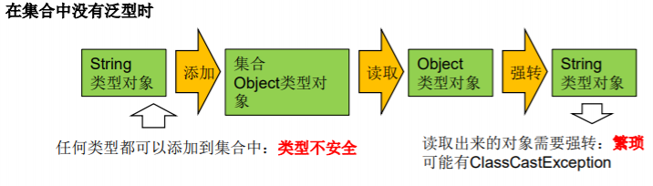
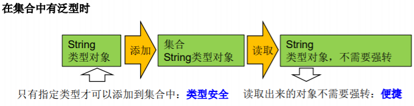

[TOC]

# 泛型概述

#### 设计背景

集合容器类在设计阶段或声明阶段不能确定到底实际存的是什么类型的对象，所以**在JDK1.5之前只能把元素类型设计为Object，JDK1.5之后使用泛型来解决。**因为在这个时候除了元素的类型不确定，其他的部分是确定的，如关于元素如何保存，如何管理是确定的，因此此时**把元素的类型设计成一个参数，这个类型参数称为泛型。**如Collection<E>,List<E>,ArrayList<E>这个<E>是类型参数，即泛型。

#### 概念

泛型允许在定义类、接口时通过一个标识表示类中某个属性的类性或者是某个方法的返回值及参数类型。这个类型参数将在使用时（如：继承或实现这个接口，用这个类型声明变量、创建对象时）确定（即传入实际的类型参数，也称为类型实参）

**JDK1.5以后引入“参数化类型（Parameterized type）”的概念。**并改写了集合框架中的全部接口和类，为这些接口、类增加了泛型支持。

##### 为何要有泛型，直接Object不是也可以存储数据吗？

1. 解决元素存储的安全性问题。
2. 解决获取数据元素时，需要类型强制转换问题。





# 泛型在集合中的使用

##### 在集合中使用泛型之前的例子

```Java
@Test
public void test1(){
    ArrayList list = new ArrayList();
    //需求：存放学生的成绩
    list.add(78);
    list.add(76);
    list.add(89);
    list.add(88);
    //问题一：类型不安全(此时无法进行类型检查)
    //list.add("Tom");
    for(Object score : list){
        //问题二：强转时，可能出现ClassCastException
        int stuScore = (Integer) score;
        System.out.println(stuScore);
    }
}
```


##### 在集合中使用泛型的例子

###### List

```Java
@Test
public void test2(){
    ArrayList<Integer> list =  new ArrayList<Integer>();

    list.add(78);
    list.add(87);
    list.add(99);
    list.add(65);
    //编译时，就会进行类型检查，保证数据的安全
    //list.add("Tom");

    //方式一：
    for(Integer score : list){
    	//避免了强转操作
        int stuScore = score;
        System.out.println(stuScore);
    }
    
    //方式二：
    Iterator<Integer> iterator = list.iterator();
    while(iterator.hasNext()){
        int stuScore = iterator.next();
        System.out.println(stuScore);
    }
}
```

###### Map

```Java
//在集合中使用泛型的情况：以HashMap为例
@Test
public void test3(){
    //Map<String,Integer> map = new HashMap<String,Integer>();
    //jdk7新特性：类型推断
    Map<String,Integer> map = new HashMap<>();

    map.put("Tom",87);
    map.put("Jerry",87);
    map.put("Jack",67);

    //map.put(123,"ABC");
    
    //泛型的嵌套
    Set<Map.Entry<String,Integer>> entry = map.entrySet();
    Iterator<Map.Entry<String, Integer>> iterator = entry.iterator();

    while(iterator.hasNext()){
        Map.Entry<String, Integer> e = iterator.next();
        String key = e.getKey();
        Integer value = e.getValue();
        System.out.println(key + "----" + value);
    }
}
```


###### 集合中使用泛型总结

1. 集合接口或集合类在jdk5.0时都修改为带泛型的结构。
2. 在实例化集合类时，可以指明具体的泛型类型。
3. 指明完以后，在集合类或接口中凡是定义类或接口时，内部结构（比如：方法、构造器、属性等）使用到类的泛型的位置，都指定为实例化的泛型类型。如：add(E e)  → 实例化以后：add(Integer e)
4. 泛型的类型必须是类，不能是基本数据类型（可以使用包装类）。
5. 如果实例化时，没指明泛型的类型。默认类型为java.lang.Object类型。

# 自定义泛型结构

**泛型声明：**

```Java
interface List<T> 和 class GenTest<K,V> 其中的T、K、V表示类型 (这里可以使用任意字母)。
```

**泛型实例化：**

**一定要在类名后面指定类型参数的值（类型）。**

如：

```Java
List<String> strList = new ArrayList<String>();
Iterator<Customer> iterator = customers.iterator();
```

**把一个集合中的内容限制为一个特定的数据类型，这是generics的核心思想。**

```Java
//JDK 1.5 之前
Comparable c = new Date();
System.out.println(c.compareTo("red"));
//JDK 1.5 之后
Comparable<Date> c = new Date();
System.out.println(c.compareTo("red"));
```

使用泛型的主要优点是能够在编译时而不是在运行时检测错误。

## 泛型类、泛型接口


- 泛型类或泛型接口可以有多个参数。如A<E1,E2,E3>

- 泛型类的构造器：public GenericClass(){}

  错误的写法为：public GenericClass<E>(){}

- 实例化后，操作原来泛型位置的结构必须与指定的泛型类型一致。

- 泛型不同的引用不能相互赋值

  注意：尽管在编译时ArrayList<String>和ArrayList<Integer>是两种类型，但在运行时只有一个ArrayList被加载到JVM中

- 泛型如果不指定，将被擦除，泛型对应的类型均按照Object处理，但不等价于Object。

  **泛型要使用一路用。要不用，一路都不要用。**

- 如泛型结构是一个接口或抽象类，则不可创建泛型类的对象。

- JDK1.7简化泛型的操作：ArrayList<Fruit> flist = new ArrayList<>();

- 泛型指定中不能使用基本数据类型，但可以用包装类进行替换。

- 在类或接口上声明的泛型，在本类或本接口中代表某种类型，可以作为非静态属性的类型、非静态方法的参数类型、非静态方法的返回值类型。**但在静态方法中不能使用类的泛型。**

  ```Java
  class Person<T> {
      // 使用T类型定义变量
      private T info;
      // 使用T类型定义一般方法
      public T getInfo() {
      	return info;
      }
      public void setInfo(T info) {
      	this.info = info;
      }
      // 使用T类型定义构造器
      public Person() {
      }
      public Person(T info) {
      	this.info = info;
      }
      // static的方法中不能使用类的泛型
      //public static void show(T t) {
      //
      //}
      // 不能在try-catch中使用泛型定义
      //public void test() {
      //try {
      //
      //} catch (MyException<T> ex) {
      //
      //}
      //}
  }
  ```

  

- **异常类不能是泛型的**

- 泛型数组：E[] elements = (E[])new Object[capacity]; 不能是new E[]方式。

  注意：声明确定类型数组时，不宜使用泛型。参照ArrayList源码中声明为Object[] elementData。

  ```Java
  //编译不通过
  //T[] arr = new T[10];
  //编译通过
  T[] arr = (T[]) new Object[10];
  ```

- 泛型的继承性：

  - 子类不保留父类的泛型：
    - 没有类型：擦除
    - 具体类型
  - 子类保留父类的泛型：泛型子类
    - 全部保留
    - 部分保留

  子类除了指定或保留父类的泛型，还可以增加自己的泛型。

  ```Java
  class Father<T1, T2> {
  }
  // 子类不保留父类的泛型
  // 1)没有类型 擦除
  class Son1 extends Father {// 等价于class Son extends Father<Object,Object>{
  }
  // 2)具体类型
  class Son2 extends Father<Integer, String> {
  }
  // 子类保留父类的泛型
  // 1)全部保留
  class Son3<T1, T2> extends Father<T1, T2> {
  }
  // 2)部分保留
  class Son4<T2> extends Father<Integer, T2> {
  }
  ```

  ```Java
  class Father<T1, T2> {
  }
  // 子类不保留父类的泛型
  // 1)没有类型 擦除
  class Son<A, B> extends Father{//等价于class Son extends Father<Object,Object>{
  }
  // 2)具体类型
  class Son2<A, B> extends Father<Integer, String> {
  }
  // 子类保留父类的泛型
  // 1)全部保留
  class Son3<T1, T2, A, B> extends Father<T1, T2> {
  }
  // 2)部分保留
  class Son4<T2, A, B> extends Father<Integer, T2> {
  }
  ```

**特别注意**

```java
public class SubOrder extends Order<Integer> {//SubOrder:不是泛型类

    public static <E> List<E> copyFromArrayToList(E[] arr){
        ArrayList<E> list = new ArrayList<>();
        for(E e : arr){
            list.add(e);
        }
        return list;
    }
}

//实例化时，如下的代码是错误的
SubOrder<Integer> o = new SubOrder<>();

public class SubOrder1<T> extends Order<T> {//SubOrder1<T>:仍然是泛型类
}
```


## 泛型方法

泛型方法，不管此时定义在其中的类是不是泛型类。在泛型方法中可以定义泛型参数，此时，参数的类型就是传入数据的类型。

**在方法中出现了泛型的结构，泛型参数与类的泛型参数没任何关系。**

#### 泛型方法的格式

```Java
[访问权限] <泛型> 返回类型 方法名([泛型标识 参数名称]) 抛出的异常
```

```Java
public class DAO {
    public <E> E get(int id, E e) {
        E result = null;
        return result;
    }
}
```

```Java
public static <T> void fromArrayToCollection(T[] a, Collection<T> c) {
    for (T o : a) {
    	c.add(o);
    }
}
public static void main(String[] args) {
    Object[] ao = new Object[100];
    Collection<Object> co = new ArrayList<Object>();
    fromArrayToCollection(ao, co);
    String[] sa = new String[20];
    Collection<String> cs = new ArrayList<>();
    fromArrayToCollection(sa, cs);
    Collection<Double> cd = new ArrayList<>();
    // 下面代码中T是Double类，但sa是String类型，编译错误。
    // fromArrayToCollection(sa, cd);
    // 下面代码中T是Object类型，sa是String类型，可以赋值成功。
    fromArrayToCollection(sa, co);
}
```

**泛型方法，可以声明为静态的。原因：泛型参数是在调用方法时确定的。并非在实例化类时确定。**

## 举例

```Java
public class Order<T> {

    String orderName;
    int orderId;
    //类的内部结构就可以使用类的泛型
    T orderT;
    public Order(){
        //编译不通过
        //T[] arr = new T[10];
        //编译通过
        T[] arr = (T[]) new Object[10];
    }

    public Order(String orderName,int orderId,T orderT){
        this.orderName = orderName;
        this.orderId = orderId;
        this.orderT = orderT;
    }

    //如下的个方法都不是泛型方法
    public T getOrderT(){
        return orderT;
    }

    public void setOrderT(T orderT){
        this.orderT = orderT;
    }

    @Override
    public String toString() {
        return "Order{" +
                "orderName='" + orderName + '\'' +
                ", orderId=" + orderId +
                ", orderT=" + orderT +
                '}';
    }
    //静态方法中不能使用类的泛型。
//    public static void show(T orderT){
//        System.out.println(orderT);
//    }

    public void show(){
        //编译不通过
//        try{
//        }catch(T t){
//        }
    }

   
    //泛型方法
    public static <E>  List<E> copyFromArrayToList(E[] arr){
        ArrayList<E> list = new ArrayList<>();
        for(E e : arr){
            list.add(e);
        }
        return list;
    }
}

//SubOrder:不是泛型类
public class SubOrder extends Order<Integer> {
    public static <E> List<E> copyFromArrayToList(E[] arr){
        ArrayList<E> list = new ArrayList<>();
        for(E e : arr){
            list.add(e);
        }
        return list;
    }
}

//实例化时，如下的代码是错误的
SubOrder<Integer> o = new SubOrder<>();

//SubOrder1<T>:仍然是泛型类
public class SubOrder1<T> extends Order<T> {
}

//测试
@Test
public void test1(){
    //如果定义了泛型类，实例化没指明类的泛型，则认为此泛型类型为Object类型
    //要求：如果大家定义了类是带泛型的，建议在实例化时要指明类的泛型。
    Order order = new Order();
    order.setOrderT(123);
    order.setOrderT("ABC");
    //建议：实例化时指明类的泛型
    Order<String> order1 = new Order<String>("orderAA",1001,"order:AA");
    order1.setOrderT("AA:hello");
}

@Test
public void test2(){
    SubOrder sub1 = new SubOrder();
    //由于子类在继承带泛型的父类时，指明了泛型类型。则实例化子类对象时，不再需要指明泛型。
    sub1.setOrderT(1122);
    SubOrder1<String> sub2 = new SubOrder1<>();
    sub2.setOrderT("order2...");
}

@Test
public void test3(){
    ArrayList<String> list1 = null;
    ArrayList<Integer> list2 = new ArrayList<Integer>();
    //泛型不同的引用不能相互赋值。
    //list1 = list2;
    Person p1 = null;
    Person p2 = null;
    p1 = p2;
}

//测试泛型方法
@Test
public void test4(){
    Order<String> order = new Order<>();
    Integer[] arr = new Integer[]{1,2,3,4};
    //泛型方法在调用时，指明泛型参数的类型。
    List<Integer> list = order.copyFromArrayToList(arr);
    System.out.println(list);
}
```

#### 应用场景举例

数据库中的表的通用操作。ORM思想(数据库中的表和Java中的类对应)

```Java
public class DAO<T> {//表的共性操作的DAO

    //添加一条记录
    public void add(T t){
    }

    //删除一条记录
    public boolean remove(int index){
        return false;
    }

    //修改一条记录
    public void update(int index,T t){
    }

    //查询一条记录
    public T getIndex(int index){
        return null;
    }

    //查询多条记录
    public List<T> getForList(int index){
        return null;
    }

    //泛型方法
    //举例：获取表中一共有多少条记录？获取最大的员工入职时间？
    public <E> E getValue(){
        return null;
    }
}
```

```Java
//只能操作某一个表的DAO
public class CustomerDAO extends DAO<Customer>{
}
```

# 泛型在继承上的体现

- 如果B是A的一个子类型（子类或者子接口），而G是具有泛型声明的类或接口，但G<B>并不是G<A>的子类型。

  如：String是Object的子类，但List<String>并不是List<Object>的子类。

  ```Java
  public void testGenericAndSubClass() {
      Person[] persons = null;
      Man[] mans = null;
      // 而 Person[] 是 Man[] 的父类.
      persons = mans;
      Person p = mans[0];
      // 在泛型的集合上
      List<Person> personList = null;
      List<Man> manList = null;
      // personList = manList;(报错)
  }
  ```

- 类A是类B的父类，A<G> 是 B<G> 的父类

```Java
@Test
public void test2(){
    AbstractList<String> list1 = null;
    List<String> list2 = null;
    ArrayList<String> list3 = null;
    list1 = list3;
    list2 = list3;
    List<String> list4 = new ArrayList<>();
}
```

# 通配符的使用

- **使用类型通配符：？**

  类A是类B的父类，G<A>和G<B>是没关系的，二者共同的父类是：G<?>

  - 读取List<?>的对象list中的元素时，是安全的（不管list的真实类型是什么，它包含的都是Object）。所以可以正常使用get()方法获取元素。
  - 不能向List<?>的对象list中写入元素，是不安全的，因为不知道list对象内的元素类型。
    - 唯一例外的是null，它是所有类型的成员。

  ```Java
  @Test
  public void test3(){
      List<Object> list1 = null;
      List<String> list2 = null;
  
      List<?> list = null;
  
      list = list1;
      list = list2;
      //编译通过
      //print(list1);
      //print(list2);
  
      List<String> list3 = new ArrayList<>();
      list3.add("AA");
      list3.add("BB");
      list3.add("CC");
      list = list3;
      //添加(写入)：对于List<?>就不能向其内部添加数据。
      //除了添加null之外。
      //list.add("DD");
      //list.add('?');
      list.add(null);
      //获取(读取)：允许读取数据，读取的数据类型为Object。
      Object o = list.get(0);
      System.out.println(o);
  }
  
  public void print(List<?> list){
      Iterator<?> iterator = list.iterator();
      while(iterator.hasNext()){
          Object obj = iterator.next();
          System.out.println(obj);
      }
  }
  ```

- **注意：**

  ```Java
  //注意点1：编译错误：不能用在泛型方法声明上，返回值类型前面<>不能使用?
  public static <?> void test(ArrayList<?> list){
  }
  //注意点2：编译错误：不能用在泛型类的声明上
  class GenericTypeClass<?>{
  }
  //注意点3：编译错误：不能用在创建对象上，右边属于创建集合对象
  ArrayList<?> list2 = new ArrayList<?>();
  ```

- 有限制的通配符

  - <?>：允许所有泛型的引用调用

  - 指定上限extends：指定类型必须是继承某个类，或者实现某个接口，即<=

    ```Java
    <? extends Number>: (无穷小，Number]只允许泛型为Number及Number子类的引用调用
                         
    <? extends Comparable>:只允许泛型为实现Comparable接口的实现类的引用调用
    ```

  - 指定下限super：指定类型不能小于操作的类，即>=

    ```Java
    <? super Number>: [Number,无穷大)只允许泛型为Number及Number父类的引用调用
    ```

  ```Java
   /*
      限制条件的通配符的使用。
          ? extends A:
                  G<? extends A> 可以作为G<A>和G<B>的父类，其中B是A的子类
  
          ? super A:
                  G<? super A> 可以作为G<A>和G<B>的父类，其中B是A的父类
  
       */
      @org.junit.Test
      public void test(){
  
          List<? extends Person> list1 = null;
          List<? super Person> list2 = null;
  
          List<Student> list3 = new ArrayList<Student>();
          list3.add(new Student());
          List<Person> list4 = new ArrayList<Person>();
          list4.add(new Person());
          List<Object> list5 = new ArrayList<Object>();
          list5.add(new Object());
  
          list1 = list3;
          list1 = list4;
          //报错 编译不通过
  //        list1 = list5;
  //        list2 = list3;
          list2 = list4;
          list2 = list5;
  
          //读取数据：
          list1 = list3;
          Person p = list1.get(0);
          //编译不通过
  //        Student s = list1.get(0);
  
          list2 = list4;
          Object obj = list2.get(0);
          //编译不通过
          //Person obj = list2.get(0);
          //写入数据：
          //编译不通过
          //list1.add(new Student());
  
          //编译通过
          list2.add(new Person());
          list2.add(new Student());
  
      }
  ```

  

