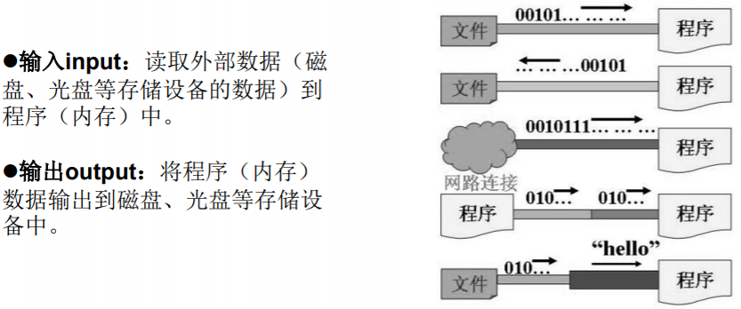
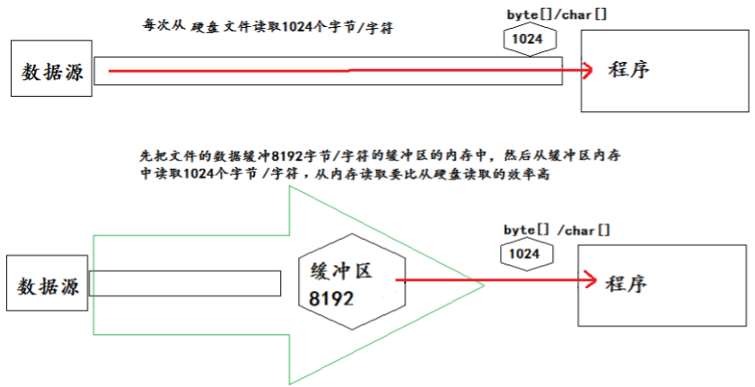

[TOC]

# File类的使用

## File类概述

1. File类的一个对象，代表一个文件或一个文件目录(俗称：文件夹)且与平台无关。

   Java中表示一个真实的文件或目录，必须有一个File对象，但一个File对象，可能没有一个真实存在的文件或目录。

2. File类声明在java.io包下

3. File类中涉及到关于文件或文件目录的创建、删除、重命名、修改时间、文件大小等方法，并未涉及到写入或读取文件内容的操作。如果需要读取或写入文件内容，必须使用IO流来完成。

4. File类的对象常会作为参数传递到流的构造器中，指明读取或写入的"终点"。

## 常用构造器

- public File(String pathname)：以pathname为路径创建File对象。

  pathname：

  - 绝对路径：固定的路径，从盘符开始
  - 相对路径：相对于某个位置开始。（默认当前路径在系统属性user.dir中存储）

- public File(String parent,String child)：以parent为父路径，child为子路径创建File对象。

- public File(File parent,String child)：根据一个父File对象和子文件路径创建File对象。

### 路径的分类

**相对路径：**相较于某个路径下，指明的路径。

**绝对路径：**包含盘符在内的文件或文件目录的路径。

#### 关于代码测试在不同的工具下的路径说明

**IDEA中：**

- 使用JUnit中的单元测试方法测试，相对路径即为当前Module下。
- 使用main()测试，相对路径即为当前的Project下。

**Eclipse中：**

不管使用单元测试或main()测试，相对路径都是当前的Project下。

### 路径分隔符

- 不同系统：

  - windows和DOS系统默认使用“\”来表示
  - UNIX和URL使用“/”来表示

- File类提供了常量：

  ```Java
  //根据操作系统，动态的提供分隔符
  public static final String separator;
  ```

  ```Java
  //如：
  File file1 = new File("d:\\test\\info.txt");
  File file2 = new File("d:" + File.separator + "test" + File.separator + "info.txt");
  File file3 = new File("d:/test");
  ```

## 常用方法

### 获取功能

**public String getAbsolutePath()：**获取绝对路径

public String getPath()：获取路径

public String getName()：获取名称

**public String getParent()：**获取上层文件目录路径。若无，返回null

public long length()：获取文件长度（即：字节数）。不能获取目录的长度。

public long lastModified()：获取最后一次的修改时间，毫秒值

public String[] list()：获取指定目录下的所有文件或者文件目录的名称数组

public File[] listFiles()：获取指定目录下的所有文件或者文件目录的File数组

### 重命名功能

public boolean renameTo(File dest)：把文件重命名为指定的文件路径

### 判断功能

**public boolean isDirectory()：**是否是文件目录

**public boolean isFile()：**是否是文件

**public boolean exists()：**是否存在

public boolean canRead()：是否可读

public boolean canWrite()：是否可写

public boolean isHidden()：是否隐藏

### 创建功能

**public boolean createNewFile()：**创建文件。若存在，则不创建，返回false。

public boolean mkdir()：创建文件目录。若存在，则不创建。若此文件目录上层目录不存在，也不创建。

**public boolean mkdirs()：**创建文件目录。如无上层目录，一并创建。

**注意：如创建文件或文件目录没有写盘符路径，则默认创建在项目路径下。**

### 删除功能

**public boolean delete()：**删除文件或文件夹。

**注意：Java中的删除不走回收站。**另外要删除一个文件目录，要注意该文件目录内不能包含文件或者文件目录。

## File类的简单使用


```Java
File dir1 = new File("D:/IOTest/dir1");
if (!dir1.exists()) { // 如果D:/IOTest/dir1不存在，就创建为目录
	dir1.mkdir();
}
// 创建以dir1为父目录,名为"dir2"的File对象
File dir2 = new File(dir1, "dir2");
if (!dir2.exists()) { // 如果还不存在，就创建为目录
	dir2.mkdirs();
}
File dir4 = new File(dir1, "dir3/dir4");
if (!dir4.exists()) {
	dir4.mkdirs();
}
// 创建以dir2为父目录,名为"test.txt"的File对象
File file = new File(dir2, "test.txt");
if (!file.exists()) { // 如果还不存在，就创建为文件
	file.createNewFile();
}
```

# IO流原理及流的分类

## Java IO原理

I/O是Input/Output的缩写。**I/O技术用于处理设备之间的数据传输**。

Java中对数据的输入/输出操作以 **“流（stream）**的方式进行。

java.io包提供了各种“流”类和接口，用来获取不同类的数据，并通过标准的方法输入或输出数据。



## 流的分类

- **按数据单位：**字节流(8 bit)、字符流(16 bit)
- **按数据的流向：**输入流、输出流
- **按流的角色：**节点流、处理流

Java的IO流共涉及40多个类，都是从下面4个抽象基类派生的。


这四个类派生出来的子类名称都是以其父类名作为子类名后最。


### IO流体系


#### 重点流结构


##### 节点流和处理流

- 节点流：直接从数据源或目的地读写数据
- 处理流：**不直接连接到数据源或目的地，而是连接在已存在的流(节点流或处理流)之上**，通过对数据的处理为程序提供更为强大的读写功能。

##### InputStream 和 Reader

- **所有的输入流的基类。**
- InputStream（典型实现：FileInputStream）
  - **int read()：**从输入流中读取数据的下一个字节。返回 0 到 255 范围内的 int 字节值。如果因 为已经到达流末尾而没有可用的字节，则返回值 -1。
  - **int read(byte[] b)：**从此输入流中将最多 b.length 个字节的数据读入一个byte数组中。如果因为已经到达流末尾而没有可用的字节，则返回值 -1。否则以整数形式返回实际读取的字节数。
  - **int read(byte[] b,int off,int len)：**将输入流中最多 len 个数据字节读入 byte 数组。读取的字节可以小于len。以整数形式返回实际读取的字节数。如流位于文件末尾而没有可用的字节，则返回值 -1。
  - **public void close()throws IOException：**关闭输入流并释放关联的所有系统资源。
- Reader（典型实现：FileReader）
  - **int read()：**读取单个字符。作为整数读取的字符，范围在0到 65535之间 (0x00-0xffff)（2个字节的Unicode码），如果已到达流的末尾，则返回 -1。
  - **int read(char[] c)：**将字符读入数组。如果已到达流的末尾，则返回 -1。否则返回本次读取的字符数。
  - **int read(char[] c,int off,int len)：**将字符读入数组的某一部分。存到数组cbuf中，从off处开始存储，最多读len个字符。如果已到达流的末尾，则返回 -1。否则返回本次读取的字符数。
  - **public void close() throws IOException：**关闭输入流并释放关联的所有系统资源
- 注意：
  - 程序中打开的文件IO资源不属于内存里的资源，垃圾回收机制无法回收该资源，应 **显式关闭文件IO资源。**
  - **FileInputStream用于读取非文本数据之类的原始字节流。**
  - **FileReader读取的是字符流。**

##### OutputStream 和 Writer

- **所有输出流的基类**

- **OutputStream**

  - **void write(int b)：**将指定的字节写入此输出流。

    **write的常规协定是：**向输出流写入一个字节。要写入的字节是参数b的八个低位。b的24个高位将被忽略。 即写入0~255范围的。

  - **void write(byte[] b)：**将 b.length 个字节从指定的 byte 数组写入此输出流。

    **write(b) 的常规协定是：**应该与调用 write(b, 0, b.length) 的效果完全相同。

  - **void write(byte[] b,int off,int len)：**将指定byte数组中从偏移量 off 开始的len个字节写入此输出流。

  - **public void flush()throws IOException：**刷新此输出流并强制写出所有缓冲的输出字节，调用此方法指示应将这些字节立即写入它们预期的目标。

  - **public void close() throws IOException：**关闭此输出流并释放与该流关联的所有系统资源。

- **Writer**

  - **void write(int c)：**写入单个字符。要写入的字符包含在给定整数值的16个低位中，16 高位被忽略。 即写入0 到65535之间的Unicode码。
  - **void write(char[] cbuf)：**写入字符数组。
  - **void write(char[] cbuf,int off,int len)：**写入字符数组的某一部分。从off开始，写入len个字符
  - **void write(String str)：**写入字符串。
  - **void write(String str,int off,int len)：**写入字符串的某一部分。
  - **void flush()：**刷新该流的缓冲，则立即将它们写入预期目标。
  - **public void close() throws IOException：**关闭此输出流并释放与该流关联的所有系统资源。

## 输入、输出的标准化过程

### 输入过程

1. 创建File类的对象，指明读取的数据的来源。（要求此文件一定要存在）

2. 创建相应的输入流，将File类的对象作为参数，传入流的构造器中

3. 具体的读入过程：

   创建相应的byte[] 或 char[]。

4. 关闭流资源

5. 说明：程序中出现的异常需要使用try-catch-finally处理。

### 输出过程

1. 创建File类的对象，指明写出的数据的位置。（不要求此文件一定要存在）

2. 创建相应的输出流，将File类的对象作为参数，传入流的构造器中

3. 具体的写出过程：

   write(char[]/byte[] buffer,0,len)

4. 关闭流资源

5. 说明：程序中出现的异常需要使用try-catch-finally处理。

# 节点流（或文件流）

## FileReader

```Java
/*
将hello.txt文件内容读入程序中，并输出到控制台

说明点：
1. read()的理解：返回读入的一个字符。如果达到文件末尾，返回-1
2. 异常的处理：为了保证流资源一定可以执行关闭操作。需要使用try-catch-finally处理
3. 读入的文件一定要存在，否则就会报FileNotFoundException。
 */
@Test
public void testFileReader1()  {
    FileReader fr = null;
    try {
        //1.File类的实例化
        File file = new File("hello.txt");

        //2.FileReader流的实例化
        fr = new FileReader(file);

        //3.读入的操作
        //read(char[] cbuf):返回每次读入cbuf数组中的字符的个数。如果达到文件末尾，返回-1
        char[] cbuf = new char[5];
        int len;
        while((len = fr.read(cbuf)) != -1){
            //方式一：
            //错误的写法
            //for(int i = 0;i < cbuf.length;i++){
            //    System.out.print(cbuf[i]);
            //}
            //正确的写法
            //for(int i = 0;i < len;i++){                  		   //	System.out.print(cbuf[i]);
            //}
            //方式二：
            //错误的写法,对应着方式一的错误的写法
            //String str = new String(cbuf);
            //System.out.print(str);
            //正确的写法
            String str = new String(cbuf,0,len);
            System.out.print(str);
        }
    } catch (IOException e) {
        e.printStackTrace();
    } finally {
        if(fr != null){
            //4.资源的关闭
            try {
                fr.close();
            } catch (IOException e) {
                e.printStackTrace();
            }
        }
    }

}
```

## FileWriter

```java
/*
从内存中写出数据到硬盘的文件里。

说明：
1. 输出操作，对应的File可以不存在的。并不会报异常
2.
     File对应的硬盘中的文件如果不存在，在输出的过程中，会自动创建此文件。
     File对应的硬盘中的文件如果存在：
           如果流使用的构造器是：FileWriter(file,false) / FileWriter(file):对原文件的覆盖
           如果流使用的构造器是：FileWriter(file,true):不会对原文件覆盖，而是在原文件基础上追加内容
 */
@Test
public void testFileWriter() {
    FileWriter fw = null;
    try {
        //1.提供File类的对象，指明写出到的文件
        File file = new File("hello1.txt");

        //2.提供FileWriter的对象，用于数据的写出
        fw = new FileWriter(file,false);

        //3.写出的操作
        fw.write("I have a dream!\n");
        fw.write("you need to have a dream!");
    } catch (IOException e) {
        e.printStackTrace();
    } finally {
        //4.流资源的关闭
        if(fw != null){
            try {
                fw.close();
            } catch (IOException e) {
                e.printStackTrace();
            }
        }
    }
}
```

### 例子：文本文件的复制

```Java
@Test
public void testFileReaderFileWriter() {
    FileReader fr = null;
    FileWriter fw = null;
    try {
        //1.创建File类的对象，指明读入和写出的文件
        File srcFile = new File("hello.txt");
        File destFile = new File("hello2.txt");

        //不能使用字符流来处理图片等字节数据
        //File srcFile = new File("test.jpg");
        //File destFile = new File("test1.jpg");

        //2.创建输入流和输出流的对象
        fr = new FileReader(srcFile);
        fw = new FileWriter(destFile);

        //3.数据的读入和写出操作
        char[] cbuf = new char[5];
        int len;//记录每次读入到cbuf数组中的字符的个数
        while((len = fr.read(cbuf)) != -1){
            //每次写出len个字符
            fw.write(cbuf,0,len);
        }
    } catch (IOException e) {
        e.printStackTrace();
    } finally {
        //4.关闭流资源
        //方式一：
        //try {
        //     if(fw != null)
        //        fw.close();
        //} catch (IOException e) {
        //     e.printStackTrace();
        //}finally{
        //     try {
        //        if(fr != null)
        //           fr.close();
        //     } catch (IOException e) {
        //        e.printStackTrace();
        //     }
        //}
        //方式二：
        try {
            if(fw != null)
                fw.close();
        } catch (IOException e) {
            e.printStackTrace();
        }

        try {
            if(fr != null)
                fr.close();
        } catch (IOException e) {
            e.printStackTrace();
        }
    }
}
```

## FileInputStream / FileOutputStream

```Java
/*
实现对图片的复制操作
 */
@Test
public void testFileInputOutputStream()  {
    FileInputStream fis = null;
    FileOutputStream fos = null;
    try {
        //1.造文件
        File srcFile = new File("test.jpg");
        File destFile = new File("test2.jpg");

        //2.造流
        fis = new FileInputStream(srcFile);
        fos = new FileOutputStream(destFile);

        //3.复制的过程
        byte[] buffer = new byte[5];
        int len;
        while((len = fis.read(buffer)) != -1){
            fos.write(buffer,0,len);
        }

    } catch (IOException e) {
        e.printStackTrace();
    } finally {
        if(fos != null){
            //4.关闭流
            try {
                fos.close();
            } catch (IOException e) {
                e.printStackTrace();
            }
        }
        if(fis != null){
            try {
                fis.close();
            } catch (IOException e) {
                e.printStackTrace();
            }
        }
    }

}
```

## 注意

- 写入文件时：
  - 使用构造器FileOutputStream(file)/FileOutputStream(file,false),目录下有同名文件将被覆盖。
  - 使用构造器FileOutputStream(file,true)，则目录下的同名文件不会被覆盖， 在文件内容末尾追加内容。
  - FileWriter与FileOutputStream写入文件时类似。
- 在读取文件时，必须保证该文件已存在，否则报异常。
- **字节流操作字节，用于处理如 .mp3、.avi、.rmvb、.jpg、.doc等非文本文件**
- **字符流操作字符，只能操作普通文本文件。常见文本文件：.txt、.java、.c、.cpp等语言的源码代码**。**注意.doc、.excel、ppt这些不是文本文件。**

# 缓冲流

**缓存流涉及到的类：**

- BufferedInputStream
- BufferedOutputStream
- BufferedReader
- BufferedWriter

**缓冲流的作用：**

提供流的读取、写入的速度

**可以提高读写速度的原因：内部提供了一个缓冲区。默认情况下是8kb**

```Java
public class BufferedInputStream extends FilterInputStream{
	private static int DEFAULT_BUFFER_SIZE = 8192;
```

## BufferedInputStream和BufferedOutputStream

```Java
//实现文件复制的方法
public void copyFileWithBuffered(String srcPath,String destPath){
    BufferedInputStream bis = null;
    BufferedOutputStream bos = null;

    try {
        //1.造文件
        File srcFile = new File(srcPath);
        File destFile = new File(destPath);
        //2.造流
        //2.1 造节点流
        FileInputStream fis = new FileInputStream((srcFile));
        FileOutputStream fos = new FileOutputStream(destFile);
        //2.2 造缓冲流
        bis = new BufferedInputStream(fis);
        bos = new BufferedOutputStream(fos);

        //3.复制的细节：读取、写入
        byte[] buffer = new byte[1024];
        int len;
        while((len = bis.read(buffer)) != -1){
            bos.write(buffer,0,len);
        }
    } catch (IOException e) {
        e.printStackTrace();
    } finally {
        //4.资源关闭
        //要求：先关闭外层的流，再关闭内层的流
        if(bos != null){
            try {
                bos.close();
            } catch (IOException e) {
                e.printStackTrace();
            }
        }
        if(bis != null){
            try {
                bis.close();
            } catch (IOException e) {
                e.printStackTrace();
            }

        }
        //说明：关闭外层流的同时，内层流也会自动的进行关闭。关于内层流的关闭，我们可以省略.
        //fos.close();
        //fis.close();
    }
}
```



## BufferedReader和BufferedWriter

```Java
//复制文本文件
@Test
public void testBufferedReaderBufferedWriter(){
    BufferedReader br = null;
    BufferedWriter bw = null;
    try {
        //创建文件和相应的流
        br = new BufferedReader(new FileReader(new File("dbcp.txt")));
        bw = new BufferedWriter(new FileWriter(new File("dbcp1.txt")));

        //读写操作
        //方式一：使用char[]数组
        //char[] cbuf = new char[1024];
        //int len;
        //while((len = br.read(cbuf)) != -1){
        //     bw.write(cbuf,0,len);
        //	   bw.flush();
        //}

        //方式二：使用String
        String data;
        while((data = br.readLine()) != null){
            //方法一：
            // bw.write(data + "\n");//data中不包含换行符
            //方法二：
            bw.write(data);//data中不包含换行符
            bw.newLine();//提供换行的操作
        }
    } catch (IOException e) {
        e.printStackTrace();
    } finally {
        //关闭资源
        if(bw != null){
            try {
                bw.close();
            } catch (IOException e) {
                e.printStackTrace();
            }
        }
        if(br != null){
            try {
                br.close();
            } catch (IOException e) {
                e.printStackTrace();
            }
        }
    }

}
```

## 缓冲流解析

- 当读取数据时，数据按块读入缓冲区，其后的读操作则直接访问缓冲区

-  当使用BufferedInputStream读取字节文件时，BufferedInputStream会一次性从文件中读取8192个(8Kb)，存在缓冲区中，直到缓冲区装满了，才重新从文件中读取下一个8192个字节数组。

  向流中写入字节时，不会直接写到文件，先写到缓冲区中直到缓冲区写满， BufferedOutputStream才会把缓冲区中的数据一次性写到文件里。**使用方法flush()可以强制将缓冲区的内容全部写入输出流**

  BufferedReader和BufferedWriter与之类似。

- 关闭流的顺序和打开流的顺序相反。只要关闭最外层流即可，关闭最外层流也 会相应关闭内层节点流

- 带缓冲区的流对象的close()方法，不但会关闭流，还会在关闭流之前刷新缓冲区，关闭后不能再写出


# 转换流

转换流提供了在字节流和字符流之间的转换。

转换流可以处理文件乱码问题。实现编码和解码的功能。

**涉及到的类：**

- **InputStreamReader：**将一个字节的输入流转换为字符的输入流

  解码：字节、字节数组  →  字符数组、字符串

  构造器：

  - public InputStreamReader(InputStream in)
  - public InputSreamReader(InputStream in,String charsetName)

- **OutputStreamWriter：**将一个字符的输出流转换为字节的输出流

  编码：字符数组、字符串 →  字节、字节数组

  构造器：

  - public OutputStreamWriter(OutputStream out)
  - public OutputSreamWriter(OutputStream out,String charsetName)


```Java
/*
此时处理异常的话，仍然应该使用try-catch-finally
使用InputStreamReader和OutputStreamWriter进行文件转码
 */
@Test
public void test2() throws Exception {
    //1.造文件、造流
    File file1 = new File("dbcp.txt");
    File file2 = new File("dbcp_gbk.txt");

    FileInputStream fis = new FileInputStream(file1);
    FileOutputStream fos = new FileOutputStream(file2);

    InputStreamReader isr = new InputStreamReader(fis,"utf-8");
    OutputStreamWriter osw = new OutputStreamWriter(fos,"gbk");
    
    //2.读写过程
    char[] cbuf = new char[20];
    int len;
    while((len = isr.read(cbuf)) != -1){
        osw.write(cbuf,0,len);
    }
    //3.关闭资源
    isr.close();
    osw.close();
}
//文件编码的方式（比如：GBK），决定了解析时使用的字符集（也只能是GBK）。
```

## 字符编码（补充）

**编码表：**为了方便应用计算机，让它可以识 别各个国家的文字。就将各个国家的文字用数字来表示，并一一对应，形成一张表。 这就是编码表。

### 常见的编码表

- ASCII：美国标准信息交换码。用一个字节的7位可以表示。
- ISO8859-1：拉丁码表。欧洲码表。用一个字节的8位表示。
- GB2312：中国的中文编码表。最多两个字节编码所有字符。
- GBK：中国的中文编码表升级，融合了更多的中文文字符号。最多两个字节编码。
- Unicode：国际标准码，融合了目前人类使用的所字符。为每个字符分配唯一的字符码。所有的文字都用两个字节来表示。
- UTF-8：变长的编码方式，可用1-4个字节来表示一个字符。

## 转换流的编码应用

- 可以将字符按指定编码格式存储
- 可以对文本数据按指定编码格式来解读
- 指定编码表的动作由构造器完成

# 标准输入、输出流

**System.in（InputStream类型）：**标准的输入流，默认从键盘输入。

**System.out（PrintStream类型，是OutputStream的子类FilterOutputStream的子类）：**标准的输出流，默认从控制台输出

**修改默认的输入和输出行为：**

System类的setIn(InputStream is) / setOut(PrintStream ps)方式重新指定输入和输出的流。

```Java
System.out.println("请输入信息(退出输入e或exit):");
// 把"标准"输入流(键盘输入)这个字节流包装成字符流,再包装成缓冲流
BufferedReader br = new BufferedReader(new InputStreamReader(System.in));
String s = null;
try {
    // 读取用户输入的一行数据 --> 阻塞程序
    while ((s = br.readLine()) != null) { 
        if ("e".equalsIgnoreCase(s) || "exit".equalsIgnoreCase(s)) {
            System.out.println("安全退出!!");
            break;
        }
    // 将读取到的整行字符串转成大写输出
    System.out.println("-->:" + s.toUpperCase());
    System.out.println("继续输入信息");
    }
} catch (IOException e) {
	e.printStackTrace();
} finally {
    try {
        if (br != null) {
             // 关闭过滤流时,会自动关闭它包装的底层节点流
            br.close();
        }
    } catch (IOException e) {
        e.printStackTrace();
    }
}
```

# 打印流

实现将基本数据类型的数据格式转化为字符串输出。

## PrintStream和PrintWriter

- 提供了一系列重载的print()和println()方法，用于多种数据类型的输出
- PrintStream和PrintWriter的输出不会抛出IOException异常
- PrintStream和PrintWriter有自动flush功能
- PrintStream 打印的所有字符都使用平台的默认字符编码转换为字节。 在需要写入字符而不是写入字节的情况下，应该使用 PrintWriter 类。
- System.out返回的是PrintStream的实例

```Java
PrintStream ps = null;
try {
    FileOutputStream fos = new FileOutputStream(new File("D:\\IO\\text.txt"));
    // 创建打印输出流,设置为自动刷新模式(写入换行符或字节 '\n' 时都会刷新输出缓冲区)
    ps = new PrintStream(fos, true);
    if (ps != null) {// 把标准输出流(控制台输出)改成文件
    	System.setOut(ps);
    }
    for (int i = 0; i <= 255; i++) { // 输出ASCII字符
        System.out.print((char) i);
        if (i % 50 == 0) { // 每50个数据一行
        	System.out.println(); // 换行
        }
    }
} catch (FileNotFoundException e) {
	e.printStackTrace();
} finally {
    if (ps != null) {
    	ps.close();
    }
}
```

# 数据流

## DataInputStream 和 DataOutputStream

- 用于读取和写出基本数据类型、String类的数据。
- 需要“套接”在 InputStream 和 OutputStream 子类的流上。

-  DataInputStream中的方法：

  ```Java
  boolean readBoolean() 
  byte readByte()
  char readChar() 
  float readFloat()
  double readDouble() 
  short readShort()
  long readLong() 
  int readInt()
  String readUTF()
  void readFully(byte[] b)
  ```

  ```Java
  /*
  将文件中存储的基本数据类型变量和字符串读取到内存中，保存在变量中。
  
  注意点：读取不同类型的数据的顺序要与当初写入文件时，保存的数据的顺序一致！
  
   */
  @Test
  public void test4() throws IOException {
      //1.
      DataInputStream dis = new DataInputStream(new FileInputStream("data.txt"));
      //2.
      String name = dis.readUTF();
      int age = dis.readInt();
      boolean isMale = dis.readBoolean();
  
      System.out.println("name = " + name);
      System.out.println("age = " + age);
      System.out.println("isMale = " + isMale);
      //3.
      dis.close();
  }
  ```

- DataOutputStream中的方法：

  ```Java
  boolean writeBoolean() 
  byte writeByte()
  char writeChar() 
  float writeFloat()
  double writeDouble() 
  short writeShort()
  long writeLong() 
  int writeInt()
  String writeUTF()
  void writeFully(byte[] b)
  ```

  ```Java
  /*
  将内存中的字符串、基本数据类型的变量写出到文件中。
  注意：处理异常的话，仍然应该使用try-catch-finally.
   */
  @Test
  public void test3() throws IOException {
      //1.
      DataOutputStream dos = new DataOutputStream(new FileOutputStream("data.txt"));
      //2.
      dos.writeUTF("刘建辰");
      dos.flush();//刷新操作，将内存中的数据写入文件
      dos.writeInt(23);
      dos.flush();
      dos.writeBoolean(true);
      dos.flush();
      //3.
      dos.close();
  }
  ```

# 对象流

## 对象的序列化机制

- 对象序列化机制允许把内存中的Java对象转换成平台无关的二进制流，从而允许把这种二进制流持久地保存在磁盘上，或通过网络将这种二进制流传输到另一个网络节点。

  当其它程序获取了这种二进制流，就可以使用反序列化恢复成原来的Java对象。

- **序列化可以任何实现了Serializable接口的对象转化为字节数据， 使其在保存和传输时可被还原**

- **序列化是 RMI（Remote Method Invoke – 远程方法调用）过程的参数和返回值都必须实现的机制**，而RMI是JavaEE的基础。因此序列化机制**是JavaEE平台的基础**

- **让某个对象支持序列化机制，则必须让对象所属的类及其属性是可 序列化的**，该对象的类必须实现如下两个接口之一，否则会抛出NotSerializableException异常：

  - Serializable
  - Externalizable

### 对象的序列化

1. 对象所属类需要实现接口：Serializable

2. 所属类提供一个全局常量：serialVersionUID

   ```Java
   private static final long serialVersionUID;
   ```

   - serialVersionUID用来表明类的不同版本间的兼容性。（版本控制）

   - 如果类没有显示定义这个静态常量，它的值是Java运行时环境根据类的内部细节自动生成的。**若类的实例变量做了修改，serialVersionUID 可能发生变化。**故建议， 显式声明。

3. **除了当前类需要实现Serializable接口之外，还必须保证其内部所属性也必须是可序列化的。（默认情况下，基本数据类型可序列化）**

4. ObjectOutputStream和ObjectInputStream**不能序列化static和transient修饰的成员变量**

#### 关于java.io.Serializable接口的理解

- 实现了Serializable接口的对象，可将它们转换成一系列字节，并可在以后 完全恢复回原来的样子。这一过程亦可通过网络进行。这意味着序列化机 制能自动补偿操作系统间的差异。换句话说，可以先在Windows机器上创 建一个对象，对其序列化，然后通过网络发给一台Unix机器，然后在那里 准确无误地重新“装配”。不必关心数据在不同机器上如何表示，也不必 关心字节的顺序或者其他任何细节。
- 由于大部分作为参数的类如String、Integer等都实现了 java.io.Serializable的接口，也可以利用多态的性质，作为参数使接口更 灵活。

### Java序列化原理

Java的序列化机制是通过在运行时判断类的serialVersionUID来验 证版本一致性的。在进行反序列化时，JVM会把传来的字节流中的 serialVersionUID与本地相应实体类的serialVersionUID进行比较，如果相同 就认为是一致的，可以进行反序列化，否则就会出现序列化版本不一致的异 常。(InvalidCastException)


## ObjectInputStream

**存储中的文件、通过网络接收过来 → 内存中的对象：反序列化过程**

```Java
@Test
public void testObjectInputStream(){
    ObjectInputStream ois = null;
    try {
        ois = new ObjectInputStream(new FileInputStream("object.dat"));

        Object obj = ois.readObject();
        String str = (String) obj;

        Person p = (Person) ois.readObject();
        Person p1 = (Person) ois.readObject();

        System.out.println(str);
        System.out.println(p);
        System.out.println(p1);

    } catch (IOException e) {
        e.printStackTrace();
    } catch (ClassNotFoundException e) {
        e.printStackTrace();
    } finally {
        if(ois != null){
            try {
                ois.close();
            } catch (IOException e) {
                e.printStackTrace();
            }

        }
    }
}
```

## ObjectOutputStream

**内存中的对象 → 存储中的文件、通过网络传输出去：序列化过程**

```Java
@Test
public void testObjectOutputStream(){
    ObjectOutputStream oos = null;

    try {
        //1.
        oos = new ObjectOutputStream(new FileOutputStream("object.dat"));
        //2.
        oos.writeObject(new String("我爱北京天安门"));
        oos.flush();//刷新操作

         oos.writeObject(new Person("王铭",23));
        oos.flush();

        oos.writeObject(new Person("张学良",23,1001,new Account(5000)));
        oos.flush();

    } catch (IOException e) {
        e.printStackTrace();
    } finally {
        if(oos != null){
            //3.
            try {
                oos.close();
            } catch (IOException e) {
                e.printStackTrace();
            }

        }
    }
}
```

# 随机存取文件流

## RandomAccessFile类

1.  声明在java.io包下

2. 直接继承于java.lang.Object类，实现了DataInput和DataOutput接口，使得它既可以读也可以写。

3. 作为输出流时，写出到的文件如果不存在，则在执行过程中自动创建。

   写出到的文件存在时，则会对原文件内容进行覆盖。（默认情况下，从头覆盖）

4. 支持 “随机访问” 的方式，程序可以直接跳到文件的任意地方来读、写文件

   - 支持只访问文件的部分内容
   - 可以向已存在的文件后追加内容

5. 包含一个记录指针，用以标示当前读写处的位置。

   RandomAccessFile 类对象可以自由移动记录指针：

   - **long getFilePointer()：**获取文件记录指针的当前位置
   - **void seek(long pos)：**将文件记录指针定位到 pos 位置

### **构造器**

- public RandomAccessFile(File file, String mode) 
- public RandomAccessFile(String name, String mode)

**mode参数（指定访问模式）：**

- **r: 以只读方式打开**
- **rw：打开以便读取和写入**
- **rwd:打开以便读取和写入；同步文件内容的更新**
- **rws:打开以便读取和写入；同步文件内容和元数据的更新**

如果模式为只读r。则不会创建文件，而是会去读取一个已经存在的文件， 如果读取的文件不存在则会出现异常。 如果模式为rw读写。如果文件不 存在则会去创建文件，如果存在则不会创建。


```Java
@Test
public void test1() {

    RandomAccessFile raf1 = null;
    RandomAccessFile raf2 = null;
    try {
        //1.
        raf1 = new RandomAccessFile(new File("爱情与友情.jpg"),"r");
        raf2 = new RandomAccessFile(new File("爱情与友情1.jpg"),"rw");
        //2.
        byte[] buffer = new byte[1024];
        int len;
        while((len = raf1.read(buffer)) != -1){
            raf2.write(buffer,0,len);
        }
    } catch (IOException e) {
        e.printStackTrace();
    } finally {
        //3.
        if(raf1 != null){
            try {
                raf1.close();
            } catch (IOException e) {
                e.printStackTrace();
            }

        }
        if(raf2 != null){
            try {
                raf2.close();
            } catch (IOException e) {
                e.printStackTrace();
            }

        }
    }
}
```

```Java
/*
使用RandomAccessFile实现数据的插入效果
 */
@Test
public void test3() throws IOException {

    RandomAccessFile raf1 = new RandomAccessFile("hello.txt","rw");

    raf1.seek(3);//将指针调到角标为3的位置
    //保存指针3后面的所数据到StringBuilder中
    StringBuilder builder = new StringBuilder((int) new File("hello.txt").length());
    byte[] buffer = new byte[20];
    int len;
    while((len = raf1.read(buffer)) != -1){
        builder.append(new String(buffer,0,len)) ;
    }
    //调回指针，写入“xyz”
    raf1.seek(3);
    raf1.write("xyz".getBytes());

    //将StringBuilder中的数据写入到文件中
    raf1.write(builder.toString().getBytes());

    raf1.close();

}
```


### 应用

#### 多线程断点下载

建立两个临时文件，一个是与 被下载文件大小相同的空文件，另一个是记录文件指针的位置文件，每次 暂停的时候，都会保存上一次的指针，然后断点下载的时候，会继续从上 一次的地方下载，从而实现断点下载或上传的功能。

# NIO.2中Path、 Paths、Files类的使用

## NIO概述

- Java NIO (New IO，Non-Blocking IO)是从Java 1.4版本开始引入的一套新 的IO API，可以替代标准的Java IO API。

- NIO与原来的IO有同样的作用和目的，但是使用的方式完全不同，NIO支持面向缓冲区的(IO是面向流的)、基于通道的IO操作。

- **NIO将以更加高效的方式进行文件的读写操作。**

- JDK 7对NIO进行了极大的扩展，增强了对文件处理和文件系统特性的支持。称为NIO.2

- Java API中提供了两套NIO，一套是针对标准输入输出NIO，另一套就是网络编程NIO。

  - java.nio.channels.Channel

    - **FileChannel:处理本地文件**
    - SocketChannel：TCP网络编程的客户端的Channel
    - ServerSocketChannel:TCP网络编程的服务器端的Channel
    - DatagramChannel：UDP网络编程中发送端和接收端的Channel

## Path接口

- jdk7提供

- **Path可以替换原有的File类。**代表一个平台无关的平台路径，描 述了目录结构中文件的位置。Path可以看成是File类的升级版本，实际引用的资源也可以不存在。

### Paths工具类

 **Paths类提供的静态get()方法用来获取Path对象：**

- **static Path get(String first, String … more) :** 用于将多个字符串串连成路径
- **static Path get(URI uri):** 返回指定uri对应的Path路径

### 常用方法

String toString() ： 返回调用 Path 对象的字符串表示形式

boolean startsWith(String path) : 判断是否以 path 路径开始

boolean endsWith(String path) : 判断是否以 path 路径结束

boolean isAbsolute() : 判断是否是绝对路径

Path getParent() ：返回Path对象包含整个路径，不包含 Path 对象指定的文件路径

Path getRoot() ：返回调用 Path 对象的根路径

Path getFileName() : 返回与调用 Path 对象关联的文件名

int getNameCount() : 返回Path 根目录后面元素的数量

Path getName(int idx) : 返回指定索引位置 idx 的路径名称

Path toAbsolutePath() : 作为绝对路径返回调用 Path 对象

Path resolve(Path p) :合并两个路径，返回合并后的路径对应的Path对象

File toFile(): 将Path转化为File类的对象

## Files工具类

**java.nio.file.Files 用于操作文件或目录的工具类。**

**jdk7提供**

### 常用方法

Path copy(Path src, Path dest, CopyOption … how) : 文件的复制

Path createDirectory(Path path, FileAttribute … attr) : 创建一个目录

Path createFile(Path path, FileAttribute … arr) : 创建一个文件

void delete(Path path) : 删除一个文件/目录，如果不存在，执行报错

void deleteIfExists(Path path) : Path对应的文件/目录如果存在，执行删除

Path move(Path src, Path dest, CopyOption…how) : 将 src 移动到 dest 位置

long size(Path path) : 返回 path 指定文件的大小

#### 用于判断

boolean exists(Path path, LinkOption … opts) : 判断文件是否存在

boolean isDirectory(Path path, LinkOption … opts) : 判断是否是目录

boolean isRegularFile(Path path, LinkOption … opts) : 判断是否是文件

boolean isHidden(Path path) : 判断是否是隐藏文件

boolean isReadable(Path path) : 判断文件是否可读

boolean isWritable(Path path) : 判断文件是否可写

boolean notExists(Path path, LinkOption … opts) : 判断文件是否不存在

#### 用于操作内容

SeekableByteChannel newByteChannel(Path path, OpenOption…how) : 获取与指定文件的连 接，how 指定打开方式。

DirectoryStream newDirectoryStream(Path path) : 打开 path 指定的目录

InputStream newInputStream(Path path, OpenOption…how):获取 InputStream 对象

OutputStream newOutputStream(Path path, OpenOption…how) : 获取 OutputStream对象

