[TOC]

# Java反射机制概述

## Java Reflection

Reflection（反射)是被视为动态语言的关键，**反射机制允许程序在执行期借助于Reflection API取得任何类的内部信息，并能直接操作任意对象的内部属性及方法。**

> 加载完类之后，在堆内存的方法区中就产生了一个Class类型的对象（一个类只有一个Class对象），这个对象就包含了完整的类的结构信息。可以通过这个对象看到类的结构。

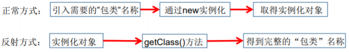

**框架 = 反射 + 注解 + 设计模式。**

### 补充：动态语言  VS  静态语言

#### 动态语言

**在运行时代码可以根据某些条件改变自身结构。**

主要动态语言：Object-C、C#、JavaScript、PHP、Python、Erlang。

#### 静态语言

**运行时结构不可变的语言就是静态语言。**

如Java、C、 C++。

> Java可以称为“**准动态语言**”。即Java有一定的动态性，可以利用反射机制、字节码操作获得类似动态语言的特性。

```Java
//体会反射的动态性
@Test
public void test2(){

    for(int i = 0;i < 100;i++){
        int num = new Random().nextInt(3);//0,1,2
        String classPath = "";
        switch(num){
            case 0:
                classPath = "java.util.Date";
                break;
            case 1:
                classPath = "java.lang.Object";
                break;
            case 2:
                classPath = "com.atguigu.java.Person";
                break;
        }

        try {
            Object obj = getInstance(classPath);
            System.out.println(obj);
        } catch (Exception e) {
            e.printStackTrace();
        }
    }


}

/*
创建一个指定类的对象。
classPath:指定类的全类名
 */
public Object getInstance(String classPath) throws Exception {
   Class clazz =  Class.forName(classPath);
   return clazz.newInstance();
}
```

### Java反射机制提供的功能

- 运行时判断任意一个对象所属的类
- 运行时构造任意一个类的对象
- 运行时判断任意一个类所具有的成员变量和方法
- 运行时获取泛型信息
- 运行时调用任意一个对象的成员变量和方法
- 运行时处理注解
- 生成动态代理

### 反射相关的主要API

- **java.lang.Class：代表一个类**
- java.lang.reflect.Method：代表类的方法
- java.lang.reflect.Field：代表类的成员变量
- java.lang.reflect.Constructor：代表类的构造器
- ......

# Class类

> 对于每个类而言，JRE 都为其保留一个不变的 Class 类型的对象。一个Class对象包含了特定某个结构(class/interface/enum/annotation/primitive type/void/[])的有关信息。
>
> Object类：
>
> ```Java
> public final Class getClass():返回一个Class对象
> ```

- Class 对象只能由系统建立对象
- 一个加载的类在 JVM 中只会有一个Class实例
- 一个Class对象对应的是一个加载到JVM中的一个.class文件
- 每个类的实例都会记得自己是由哪个 Class 实例所生成
- 通过Class可以完整地得到一个类中的所有被加载的结构
- **Class类是Reflection的根源，针对任何想动态加载、运行的类，唯有先获得相应的Class对象**

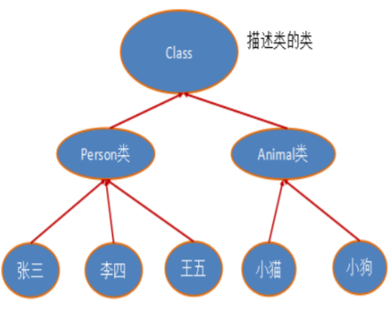

## Class类的常用方法

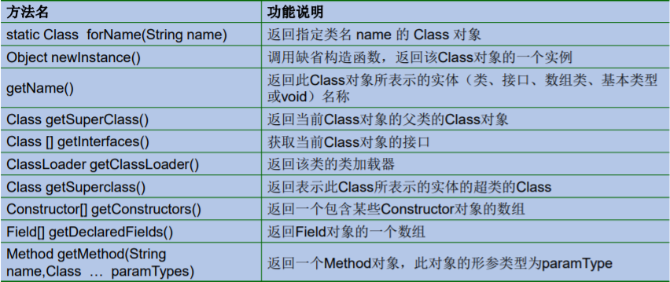

## 获取Class类的实例

```Java
//方式一：调用运行时类的属性：.class
//前提：已知具体的类（最安全可靠，程序性能最高）
Class clazz1 = Person.class;
System.out.println(clazz1);
//方式二：通过运行时类的对象,调用getClass()
//前提：已知某个类的实例
Person p1 = new Person();
Class clazz2 = p1.getClass();
System.out.println(clazz2);

//方式三：调用Class的静态方法：forName(String classPath)
//前提：已知类的全类名，且该类在类路径下。
//注意：可能抛出ClassNotFoundException
Class clazz3 = Class.forName("com.test.java.Person");
//clazz3 = Class.forName("java.lang.String");
System.out.println(clazz3);

System.out.println(clazz1 == clazz2);
System.out.println(clazz1 == clazz3);

//方式四：使用类的加载器：ClassLoader  (了解)
ClassLoader classLoader = ReflectionTest.class.getClassLoader();
Class clazz4 = classLoader.loadClass("com.test.java.Person");
System.out.println(clazz4);

System.out.println(clazz1 == clazz4);
```

### 哪些类型可以有Class对象？

1. class：外部类，成员（成员内部类，静态内部类），局部内部类，匿名内部类
2. interface：接口
3. []：数组
4. enum：枚举
5. annotation：注解@interface
6. primitive type：基本数据类型
7. void

```Java
Class c1 = Object.class;
Class c2 = Comparable.class;
Class c3 = String[].class;
Class c4 = int[][].class;
Class c5 = ElementType.class;
Class c6 = Override.class;
Class c7 = int.class;
Class c8 = void.class;
Class c9 = Class.class;
int[] a = new int[10];
int[] b = new int[100];
Class c10 = a.getClass();
Class c11 = b.getClass();
// 只要元素类型与维度一样，就是同一个Class
System.out.println(c10 == c11);
```

### 创建类的对象的方式？

1. new + 构造器
2. 要创建Xxx类的对象，可以考虑：Xxx、Xxxs、XxxFactory、XxxBuilder类中查看是否有静态方法的存在。可以调用其静态方法，创建Xxx对象。
3. 通过反射

# ClassLoader类加载器

## 类的加载过程

程序主动使用某个类时，若系统还未被加载到内存中，则系统会通过：

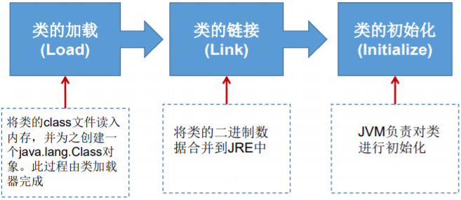

**加载：**将class文件字节码内容加载到内存中，并将这些静态数据转换成方法区的运行时数据结构，然后生成一个代表这个类的java.lang.Class对象，作为方法区中类数据的访问入口（即引用地址）。所有需要访问和使用类数据只能通过这个Class对象。这个加载的过程需要类加载器参与。

**链接：**将Java类的二进制代码合并到JVM的运行状态之中的过程。

- 验证：**确保加载的类信息符合JVM规范**，如：以cafe开头，没有安全方面的问题
- 准备：正式为类变量（static）分配内存并**设置类变量默认初始值**的阶段，这些内存都将在方法区中进行分配。
- 解析：虚拟机常量池内的符号引用（常量名）替换为直接引用（地址）的过程。

**初始化：**

- 执行类构造器<clinit>()方法的过程。

  **类构造器<clinit>()方法是由编译期自动收集类中所有类变量的赋值动作和静态代码块中的语句合并产生的。**（类构造器是构造类信息的，不是构造该类对象的构造器）。

- 当初始化一个类的时候，如果发现其父类还没有进行初始化，则需要先触发其父类的初始化。

- 虚拟机会保证一个类的<clinit>()方法在多线程环境中被正确加锁和同步。

```Java
public class ClassLoadingTest {
    public static void main(String[] args) {
    	System.out.println(A.m);
    }
}
class A {
    static {
    	m = 300;
    }
    static int m = 100;
}
//第二步：链接结束后m=0
//第三步：初始化后，m的值由<clinit>()方法执行决定
// 这个A的类构造器<clinit>()方法由类变量的赋值和静态代码块中的语句按照顺序合并产生，类似于
// <clinit>(){
// 	m = 300;
// 	m = 100;
// }
```

### 什么时候会发生类的初始化？

#### 类的主动引用（一定会发生类的初始化）

- 当虚拟机启动，先初始化main方法所在的类。
- new一个类的对象。
- 调用类的静态成员（除了final常量）和静态方法。
- 使用java.lang.reflect包的方法对类进行反射调用。
- 当初始化一个类，如其父类没有初始化，则先会初始化它的父类。

#### 类的被动引用（不会发生类的初始化）

- 当访问一个静态域时，只有真正声明这个域的类才会被初始化
  - 当通过子类引用父类的静态变量，不会导致子类初始化
- 通过数组定义类引用，不会触发此类的初始化
- 引用常量不会触发此类的初始化（常量在链接阶段就存入调用类的常量池中）

```Java
class Father {
    static int b = 2;
    static {
    	System.out.println("父类被加载");
    }
}

class A extends Father {
    static {
        System.out.println("子类被加载");
        m = 300;
    }
    static int m = 100;
    static final int M = 1;
}

public class ClassLoadingTest {
    public static void main(String[] args) {
    // 主动引用：一定会导致A和Father的初始化
    // A a = new A();
    // System.out.println(A.m);
    // Class.forName("com.test.java2.A");
    // 被动引用
    A[] array = new A[5];//不会导致A和Father的初始化
    // System.out.println(A.b);//只会初始化Father
    // System.out.println(A.M);//不会导致A和Father的初始化
    }
    static {
    	System.out.println("main所在的类");
    }
}
```

## 类加载器的作用

- **类加载器的作用:**将class文件字节码内容加载到内存中，并将这些静态数据**转换成方法区的运行时数据结构**，然后在堆中生成一个代表这个类的java.lang.Class对象，**作为方法区中类数据的访问入口。**
- **类缓存:**标准的JavaSE类加载器可以按要求查找类，但一旦某个类被加载到类加载器中，它将维持加载（缓存）一段时间。不过JVM垃圾回收机制可以回收这些Class对象。

#### 类的加载器的分类

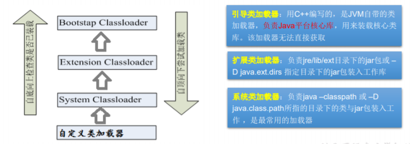

#### Java类编译、运行的执行的流程

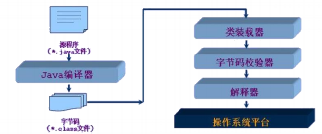

#### 类加载器使用示例

1. 获取一个系统类加载器

   ```java
   ClassLoader classloader = ClassLoader.getSystemClassLoader();
   System.out.println(classloader);
   ```

2. 获取系统类加载器的父类加载器，即扩展类加载器

   ```java
   classloader = classloader.getParent();
   System.out.println(classloader);
   ```

3. 获取扩展类加载器的父类加载器，即引导类加载器

   ```java
   classloader = classloader.getParent();
   System.out.println(classloader);
   ```

4. 测试当前类由哪个类加载器进行加载

   ```java
   classloader = Class.forName("test.ClassloaderDemo").getClassLoader();
   System.out.println(classloader);
   ```

5. 测试JDK提供的Object类由哪个类加载器加载

   ```java
   classloader = Class.forName("java.lang.Object").getClassLoader();
   System.out.println(classloader);
   ```

6. 关于类加载器的一个主要方法：getResourceAsStream(String str):获取类路 径下的指定文件的输入流

   ```java
   InputStream in = null;
   in = this.getClass().getClassLoader().getResourceAsStream("test\\test.properties");
   System.out.println(in);
   ```

7. 使用Classloader加载src目录下的配置文件

   ```java
   @Test
   public void test2() throws Exception {
   
       Properties pros =  new Properties();
       //此时的文件默认在当前的module下。
       //读取配置文件的方式一：
       //FileInputStream fis = new FileInputStream("jdbc.properties");
       //FileInputStream fis = new FileInputStream("src\\jdbc1.properties");
       //pros.load(fis);
   
       //读取配置文件的方式二：使用ClassLoader
       //配置文件默认识别为：当前module的src下
       ClassLoader classLoader = ClassLoaderTest.class.getClassLoader();
       InputStream is = classLoader.getResourceAsStream("jdbc1.properties");
       pros.load(is);
   
       String user = pros.getProperty("user");
       String password = pros.getProperty("password");
       System.out.println("user = " + user + ",password = " + password);
   }
   ```

# 创建运行时类的对象

```java
Class<Person> clazz = Person.class;
Person obj = clazz.newInstance();
System.out.println(obj);
```

**说明：**

**newInstance():**调用此方法，创建对应的运行时类的对象。内部调用了运行时类的空参的构造器。

要想此方法正常的创建运行时类的对象，要求：

1. 运行时类必须提供空参的构造器
2. 空参构造器的访问权限得够。通常，设置为public

在javabean中要求提供一个public的空参构造器。原因：

1. 便于通过反射，创建运行时类的对象
2. 便于子类继承此运行时类时，默认调用super()时，保证父类此构造器

**其他方式：**

1. 根据全类名获取对应的Class对象

   ```java
   String name = “test.java.Person";
   Class clazz = null;
   clazz = Class.forName(name);
   ```

2. 调用指定参数结构的构造器，生成Constructor的实例

   ```Java
   Constructor con = clazz.getConstructor(String.class,Integer.class);
   ```

3. 通过Constructor的实例创建对应类的对象，并初始化类属性

   ```java
   Person p2 = (Person) con.newInstance("Peter",20);
   ```

# 获取运行时类的完整结构

1. 实现的全部接口

   ```java
   public Class<?>[] getInterfaces()
   ```

2. 所继承的父类

   ```java
   public Class<? Super T> getSuperclass():返回表示此Class所表示的实体（类、接口、基本类型）的父类的Class
   ```

3. 全部的构造器

   ```java
   public Constructor<T>[] getConstructors()：返回此Class对象所表示的类的所有public构造方法
   public Constructor<T>[] getDeclaredConstructors()：返回此Class对象表示的类声明的所有构造方法
   ```

   - Constructor类中：
     - 获取修饰符：public int getModifiers();
     - 获取方法名称：public String getName();
     - 获取参数的类：public Class<?>[] getParameterTypes();

4. 全部的方法

   ```java
   //返回此Class对象所表示的类或接口的全部方法
   public Method[] getDeclaredMethods()
   //返回此Class对象所表示的类或接口的public的方法
   public Method[] getMethods() 
   ```

   - Method类中：

     ```java
     //取得全部的返回值
     public Class<?> getReturnType()
     //取得全部的参数
     public Class<?>[] getParameterTypes()
     //取得修饰符
     public int getModifiers()
     //取得异常信息
     public Class<?>[] getExceptionTypes()
     ```

5. 全部的Field

   ```java
   //返回此Class对象所表示的类或接口的public的Field。
   public Field[] getFields() 
   //返回此Class对象所表示的类或接口的全部Field。
   public Field[] getDeclaredFields() 
   ```

   - Field：

     ```java
     //以整数形式返回此Field的修饰符
     public int getModifiers() 
     //得到Field的属性类型
     public Class<?> getType() 
     //返回Field的名称。
     public String getName()
     ```

6.  Annotation相关

   ```java
   get Annotation(Class<T> annotationClass) 
   
   getDeclaredAnnotations() 
   ```

7. 泛型相关

   ```Java
   //获取父类泛型类型
   Type getGenericSuperclass()
   //泛型类型
   ParameterizedType
   //获取实际的泛型类型参数数组
   getActualTypeArguments()
   ```

8. 类所在的包

   ```java
   Package getPackage() 
   ```

```java
@Test
public void test1(){

    Class clazz = Person.class;

    //获取属性结构
    //getFields():获取当前运行时类及其父类中声明为public访问权限的属性
    Field[] fields = clazz.getFields();
    for(Field f : fields){
        System.out.println(f);
    }
    System.out.println();

    //getDeclaredFields():获取当前运行时类中声明的所属性。（不包含父类中声明的属性
    Field[] declaredFields = clazz.getDeclaredFields();
    for(Field f : declaredFields){
        System.out.println(f);
    }
}

@Test
public void test1(){

    Class clazz = Person.class;

    //getMethods():获取当前运行时类及其所父类中声明为public权限的方法
    Method[] methods = clazz.getMethods();
    for(Method m : methods){
        System.out.println(m);
    }
    System.out.println();
    //getDeclaredMethods():获取当前运行时类中声明的所方法。（不包含父类中声明的方法
    Method[] declaredMethods = clazz.getDeclaredMethods();
    for(Method m : declaredMethods){
        System.out.println(m);
    }
}

/*
获取构造器结构
*/
@Test
public void test1(){

    Class clazz = Person.class;
    //getConstructors():获取当前运行时类中声明为public的构造器
    Constructor[] constructors = clazz.getConstructors();
    for(Constructor c : constructors){
        System.out.println(c);
    }

    System.out.println();
    //getDeclaredConstructors():获取当前运行时类中声明的所的构造器
    Constructor[] declaredConstructors = clazz.getDeclaredConstructors();
    for(Constructor c : declaredConstructors){
        System.out.println(c);
    }

}

/*
获取运行时类的父类
*/
@Test
public void test2(){
    Class clazz = Person.class;

    Class superclass = clazz.getSuperclass();
    System.out.println(superclass);
}

/*
获取运行时类的带泛型的父类
*/
@Test
public void test3(){
    Class clazz = Person.class;

    Type genericSuperclass = clazz.getGenericSuperclass();
    System.out.println(genericSuperclass);
}

/*
获取运行时类的带泛型的父类的泛型
代码：逻辑性代码  vs 功能性代码
*/
@Test
public void test4(){
    Class clazz = Person.class;

    Type genericSuperclass = clazz.getGenericSuperclass();
    ParameterizedType paramType = (ParameterizedType) genericSuperclass;
    //获取泛型类型
    Type[] actualTypeArguments = paramType.getActualTypeArguments();
    //System.out.println(actualTypeArguments[0].getTypeName());
    System.out.println(((Class)actualTypeArguments[0]).getName());
}

/*
 获取运行时类实现的接口
 */
@Test
public void test5(){
    Class clazz = Person.class;

    Class[] interfaces = clazz.getInterfaces();
    for(Class c : interfaces){
        System.out.println(c);
    }

    System.out.println();
    //获取运行时类的父类实现的接口
    Class[] interfaces1 = clazz.getSuperclass().getInterfaces();
    for(Class c : interfaces1){
        System.out.println(c);
    }

}
/*
 获取运行时类所在的包
*/
@Test
public void test6(){
    Class clazz = Person.class;

    Package pack = clazz.getPackage();
    System.out.println(pack);
}

/*
获取运行时类声明的注解
*/
@Test
public void test7(){
    Class clazz = Person.class;

    Annotation[] annotations = clazz.getAnnotations();
    for(Annotation annos : annotations){
        System.out.println(annos);
    }
}
```

# 调用运行时类的指 定结构

## 调用指定方法

1. 通过Class类的getMethod(String name,Class…parameterTypes)方法取得一个Method对象，并设置此方法操作时所需要的参数类型。
2. 之后使用Object invoke(Object obj, Object[] args)进行调用，并向方法中 传递要设置的obj对象的参数信息。

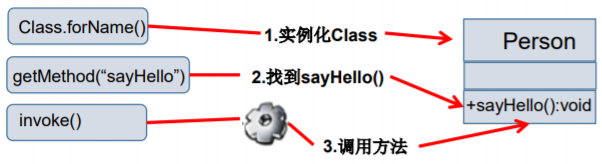

#### Object invoke(Object obj, Object … args)

**说明：**

1. Object 对应原方法的返回值，若原方法无返回值，此时返回null
2. 若原方法若为静态方法，此时形参Object obj可为null
3. 若原方法形参列表为空，则Object[] args为null
4. 若原方法声明为private,则需要在调用此invoke()方法前，显式调用 方法对象的setAccessible(true)方法，将可访问private的方法。

#### 示例

```java
@Test
public void testMethod() throws Exception {

    Class clazz = Person.class;

    //创建运行时类的对象
    Person p = (Person) clazz.newInstance();

    /*
      1.获取指定的某个方法
        getDeclaredMethod():参数1 ：指明获取的方法的名称  参数2：指明获取的方法的形参列表
    */
    Method show = clazz.getDeclaredMethod("show", String.class);
    //2.保证当前方法是可访问的
    show.setAccessible(true);

    /*
     3. 调用方法的invoke():参数1：方法的调用者  参数2：给方法形参赋值的实参
      invoke()的返回值即为对应类中调用的方法的返回值。
     */
    Object returnValue = show.invoke(p,"CHN"); //String nation = p.show("CHN");
    System.out.println(returnValue);

    System.out.println("*************如何调用静态方法*****************");

    // private static void showDesc()

    Method showDesc = clazz.getDeclaredMethod("showDesc");
    showDesc.setAccessible(true);
    //如果调用的运行时类中的方法没返回值，则此invoke()返回null
    //Object returnVal = showDesc.invoke(null);
    Object returnVal = showDesc.invoke(Person.class);
    System.out.println(returnVal);//null

}
```

## 调用指定属性

获取Field类：（Field类操作类中的属性）

```java
//返回此Class对象表示的类或接口的指定的public的Field
public Field getField(String name)
//返回此Class对象表示的类或接口的指定的Field
public Field getDeclaredField(String name)
//Filed
//取得指定对象obj上此Field的属性内容
public Object get(Object obj)
//设置指定对象obj上此Field的属性内容
public void set(Object obj,Object value)
```

##### 关于setAccessible方法的使用

- Method和Field、Constructor对象都有setAccessible()方法。
- setAccessible启动和禁用访问安全检查的开关。
- 参数值为true则指示反射的对象在使用时应该取消Java语言访问检查。
  - **提高反射的效率。**如果代码中必须用反射，而该句代码需要频繁的被调用，那么请设置为true。
  - 使得原本无法访问的私有成员也可以访问
- 参数值为false则指示反射的对象应该实施Java语言访问检查。

#### 示例

```Java
@Test
public void testField1() throws Exception {
    Class clazz = Person.class;

    //创建运行时类的对象
    Person p = (Person) clazz.newInstance();

    //1. getDeclaredField(String fieldName):获取运行时类中指定变量名的属性
    Field name = clazz.getDeclaredField("name");

    //2.保证当前属性是可访问的
    name.setAccessible(true);
    //3.获取、设置指定对象的此属性值
    name.set(p,"Tom");

    System.out.println(name.get(p));
}
```

## 调用指定的构造器

```java
@Test
public void testConstructor() throws Exception {
    Class clazz = Person.class;

    //private Person(String name)
    /*
    1.获取指定的构造器
    getDeclaredConstructor():参数：指明构造器的参数列表
     */

    Constructor constructor = clazz.getDeclaredConstructor(String.class);

    //2.保证此构造器是可访问的
    constructor.setAccessible(true);

    //3.调用此构造器创建运行时类的对象
    Person per = (Person) constructor.newInstance("Tom");
    System.out.println(per);

}
```

# 反射的应用：动态代理

## 代理模式的原理

使用一个代理将对象包装起来, 然后用该代理对象取代原始对象。任何对原始对象的调用都要通过代理。代理对象决定是否以及何时将方法调用转到原始对象上。 

### 静态代理

#### 示例

```java
//实现Runnable接口的方法创建多线程。
Class MyThread implements Runnable{} //相当于被代理类
Class Thread implements Runnable{} //相当于代理类
public static void main(String[] args){
    MyThread t = new MyThread();
    Thread thread = new Thread(t);
    thread.start();//启动线程；调用线程的run()
}
```

#### 静态代理的缺点

1. 代理类和目标对象的类都是在编译期间确定下来，不利于程序的扩展。
2. 每一个代理类只能为一个接口服务，这样一来程序开发中必然产生过多的代理。

### 动态代理

动态代理是指客户通过代理类来调用其它对象的方法，并且是在程序运行时 根据需要动态创建目标类的代理对象。

#### 使用场合

- 调试
- 远程方法调用

#### 动态代理相比于静态代理的优点

抽象角色中（接口）声明的所有方法都被转移到调用处理器一个集中的方法中处理，可以更加灵活和统一的处理众多的方法。

## Java动态代理相关API

### Proxy类

专门完成代理的操作类，是所有动态代理类的父类。通过此类为一 个或多个接口动态地生成实现类。

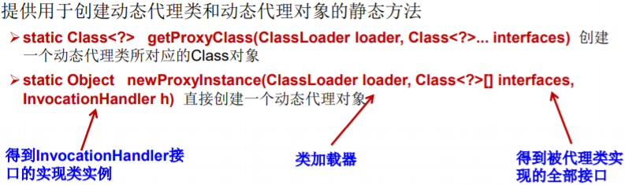

### 动态代理步骤

1. 创建一个实现接口InvocationHandler的类，它必须实现invoke方 法，以完成代理的具体操作。

   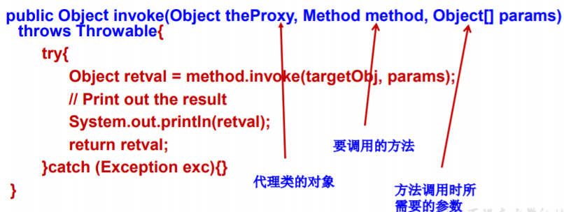

2. 创建被代理的类及接口

   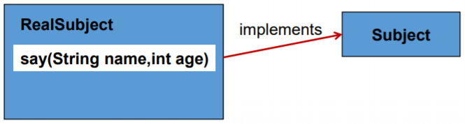

3. 通过Proxy的静态方法newProxyInstance(ClassLoader loader, Class[] interfaces, InvocationHandler h) 创建 一个Subject接口代理

   ```java
   RealSubject target = new RealSubject();
   // Create a proxy to wrap the original implementation
   DebugProxy proxy = new DebugProxy(target);
   // Get a reference to the proxy through the Subject interface
   Subject sub = (Subject) Proxy.newProxyInstance(
   Subject.class.getClassLoader(),new Class[] { Subject.class }, proxy);
   ```

4. 通过Subject代理调用RealSubject实现类的方法

   ```java
   String info = sub.say(“Peter", 24);
   System.out.println(info);
   ```

#### 示例

```java
interface Human{

    String getBelief();

    void eat(String food);

}
//被代理类
class SuperMan implements Human{


    @Override
    public String getBelief() {
        return "I believe I can fly!";
    }

    @Override
    public void eat(String food) {
        System.out.println("我喜欢吃" + food);
    }
}

class HumanUtil{

    public void method1(){
        System.out.println("====================通用方法一====================");

    }

    public void method2(){
        System.out.println("====================通用方法二====================");
    }

}


class ProxyFactory{
    //调用此方法，返回一个代理类的对象。解决问题一
    public static Object getProxyInstance(Object obj){//obj:被代理类的对象
        MyInvocationHandler handler = new MyInvocationHandler();

        handler.bind(obj);

        return Proxy.newProxyInstance(obj.getClass().getClassLoader(),obj.getClass().getInterfaces(),handler);
    }

}

class MyInvocationHandler implements InvocationHandler{

    private Object obj;//需要使用被代理类的对象进行赋值

    public void bind(Object obj){
        this.obj = obj;
    }

    //当我们通过代理类的对象，调用方法a时，就会自动的调用如下的方法：invoke()
    //将被代理类要执行的方法a的功能就声明在invoke()中
    @Override
    public Object invoke(Object proxy, Method method, Object[] args) throws Throwable {
        HumanUtil util = new HumanUtil();
        util.method1();
        //method:即为代理类对象调用的方法，此方法也就作为了被代理类对象要调用的方法
        //obj:被代理类的对象
        Object returnValue = method.invoke(obj,args);
        util.method2();
        //上述方法的返回值就作为当前类中的invoke()的返回值。
        return returnValue;
    }
}

public class ProxyTest {

    public static void main(String[] args) {
        SuperMan superMan = new SuperMan();
        //proxyInstance:代理类的对象
        Human proxyInstance = (Human) ProxyFactory.getProxyInstance(superMan);
        //当通过代理类对象调用方法时，会自动的调用被代理类中同名的方法
        String belief = proxyInstance.getBelief();
        System.out.println(belief);
        proxyInstance.eat("四川麻辣烫");

        System.out.println("*****************************");

        NikeClothFactory nikeClothFactory = new NikeClothFactory();

        ClothFactory proxyClothFactory = (ClothFactory) ProxyFactory.getProxyInstance(nikeClothFactory);

        proxyClothFactory.produceCloth();

    }
}
```

### 动态代理与AOP（Aspect Orient Programming)

- 使用Proxy生成一个动态代理时，通常都是为指定的目标对象生成动态代理

- AOP代理可代替目标对象，AOP代理包含了目标对象的全部方法。但AOP代理中的方法与目标对象的方法存在差异： **AOP代理里的方法可以在执行目标方法之前、之后插入一些通用处理**

  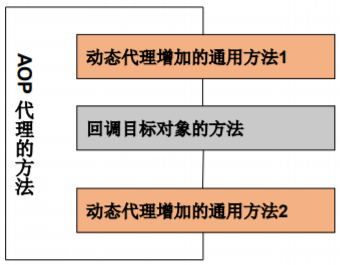