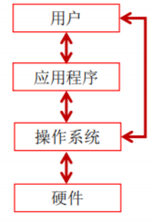

[TOC]

# 编程入门

### 计算机

计算机包括硬件和软件两个部分。

**硬件：** 计算机中可以看的见的物理部分。

**软件**：提供看不见的指令。指令控制硬件并且使得硬件完成特定的任务。

**程序设计**

> 创建（或开发）软件。软件包含指令，告诉计算机做什么。

#### 计算机硬件介绍

**冯·诺依曼体系结构**

冯·诺依曼体系结构是现代计算机的基础，现在大多数计算机仍是该结构，只是做了一些改进而已，并没有从根本上突破该结构的束缚。

也因此冯·诺依曼被称为“计算机之父”。

##### 中央处理器（CPU）

> 计算机的大脑。从内存中获取指令，然后执行这些指令。

**组成：**	控制单元（control unit）和算术/逻辑单元（arithmetic/login unit）

- 控制单元：用于控制和协调其他组件的动作
- 算术/逻辑单元：用于完成数值运算（+、-、*、/）和逻辑运算（比较）

内部时钟：每台计算机都有一个内部时钟，该时钟以固定速度发射电子脉冲。时钟速度越快，在给定的时间段内执行的指令就越多。速度的计量单位是**赫兹（Hz）**，**1Hz相当于每秒1个脉冲。** 随着CPU速度不断提高，目前以千兆赫（GHz）来表示。

**核（core）：** 处理器中实现指令读取和执行的部分。多核CPU是一个具有两个或多个独立核的组件。（可提高CPU的处理能力）

##### 存储设备

1. 磁盘驱动器

   计算机至少有一个硬盘驱动器。硬盘（hard disk）用于永久的保存数据和程序。

2. 光盘驱动器

   CD容量可达700MB

   DVD容量可达4.7GB

3. USB闪存驱动器

   USB：Universal Serial Bus,通用串行总线。

   可以使用USB将打印机、数码相机、鼠标、外部硬盘驱动器连接到计算机上。USB闪存驱动器很小，可用于存储和传输数据的设备。

##### 内存

###### 比特（bit）和字节（byte）

> 计算机就是一系列的电路开关。开关存在两种状态：关（off）和开（on）。若电路开，值为1。若电路关，值为0。

**比特定义：** 一个0或者一个1存储为一个比特。是计算机中最小的存储单位。

**字节：** 计算机中最基本的存储单元。每个字节由8个比特构成。

**计算机存储单位换算：**

- 字节（byte，B）= 8 bit
- 千字节（kilobyte，KB）= 1024B
- 兆字节（megabyte，MB）= 1024KB
- 千兆字节（gigabyte，GB）= 1024MB
- 万兆字节 （terabyte，TB）= 1024GB

###### 内存介绍

> 内存（Random-Access Memory,RAM)：由一个有序的字节序列组成，用于存储程序及程序需要的数据。

**注意：** *一个程序和它的数据在被CPU执行前必须移到计算机的内存中。*

<table><tr><td>每个字节都有一个唯一的地址。如右图。使用该地址确定字节的位置，以便于存储和获取数据。</td><td></tr></table>

*一个计算机具有的RAM越多，它的运行速度越快，但是这个规律受其他因素限制（如CPU）*

*内存与CPU同样构建在表面镶嵌由数百万晶体管的硅半导体芯片上，但内存芯片更简单、更低速、更便宜。*

###### 硬盘、内存、CPU之间的关系

内存存取数据的速度比硬盘的存取速度快10倍，某些环境下，硬盘与内存之间的速度差距会更大。而CPU的速度比内存不知还要快多少倍。

> 当程序从硬盘放到内存后，CPU就直接在内存运行程序。

内存解决了一部分CPU运行过快，但硬盘数据存取太慢的问题。

**内存的存储是暂时的（缓存），一旦断电数据就会消失，而且容量有限，要长时间存储程序数据就需要使用硬盘。**

**内存的作用：**

- 保存从硬盘读取的数据，提供给CPU使用
- 保存CPU的一些临时执行结果，以便CPU下次使用或保存到硬盘

##### 输入和输出设备

常见的输入设备：键盘（keyboard）和鼠标（mouse）

常见的输出设备：显示器（monitor）和打印机（printer）

显示器屏幕分辨率：是指显示设备水平和垂直方向上显示的像素（px）数。

- 分辨率可以手动设置
- 分辨率越高，图像越锐化、越清晰

像素密度计算公式：

$像素密度=\sqrt{[(长度像素数)^2 + (宽度像素数)^2]/屏幕尺寸}$

##### 通信设备

计算机常见设备有：

- 拨号调制解调器：使用的是电话线，传输速度可达56000bps（bps：每秒比特）
- DSL（数字用户线）：使用的也是电话线，但传输速度较上面的快20倍
- 电缆调制解调器：利用有线电视电缆进行数据传输，通常速度比DSL快。
- 网络接口卡（NIC）：将计算机接入局域网（LAN）的设备。局域网通常用于大学、商业组织和政府组织。速度甚至可达1000Mbps
- 无线网络：在家庭、商业和学校中及其常见。计算机可通过无线适配器连接到局域网或internet上。

#### 计算机发展史上的鼻祖

##### 阿兰·图灵（Alan Turing)

计算机科学和人工智能之父	(传记电影：模仿游戏)

图灵论文中“用有限的指令和有限的存储空间可算尽一切可算之物”。

美国计算机学会（ACM）的年度“图灵奖”，自从1966年设立以来，一直是世界计算机科学领域的最高荣誉，相当于计算机科学界的诺贝尔奖。至今，中国人只有姚期智院士获该奖项。

##### 冯·诺依曼（John von Neumann)

20世纪最重要的数学家之一，在现代计算机、博弈论、核武器和生化武器等诸多领域内有杰出建树的最伟大的科学全才之一，被称为“计算机之父”和“博弈论之父”。

计算机基本工作原理是存储程序和程序控制就是由他提出的。

简单来说：数字计算机的数制采用二进制；计算机应该按照程序顺序执行。

**根据冯·诺依曼体系结构构成的计算机，必须具有如下功能：**

- 把需要的程序和数据送至计算机中
- 必须具有长期记忆程序、数据、中间结果及最终运算结果的能力
- 能够完成各种算术、逻辑运算和数据传送等数据加工处理的能力
- 能够根据需要控制程序走向，并能根据指令控制机器的各部件协调操作
- 能够按照要求将处理结果输出给用户

#### 操作系统（Operating System）

> 运行在计算机上最重要的程序，可以管理和控制计算机的活动。

<table>
    <tr>
    	<td>硬件、操作系统、应用程序和用户之间的关系</td>
        <td></td>
    </tr>
</table>

**操作系统的主要任务：**

- 控制和监视系统的活动
- 分配和调配系统资源
- 调度操作

#### 万维网

万维网（World Wide Web,www,环球信息网）常简称为Web,发明者蒂姆·伯纳斯·李。

分为Web客户端和Web服务器程序。 

WWW可以让Web客户端（常用浏览器）访问浏览Web服务器上的页面。 是一个由许多互相链接的超文本组成的系统，通过互联网访问。在这个系统中，每个有用的事物，称为一样“资源”；并且由一个全局“统一资源标识符”（URI）标识；这些资源通过超文本传输协议（Hypertext Transfer Protocol）传送给用户，而后者通过点击链接来获得资源。

B/S结构指	browser	server 	C/S结构指	client	server

万维网是无数个网络站点和网页的集合，它们在一起构成了因特网Internet最主要的部分（因特网也包括电子邮件、Usenet以及新闻组）。它实际上是多媒体的集合，是由超级链接连接而成的。

### 计算机行业发展规律

- 摩尔定律（Moore’s Law)

  摩尔定律是由[英特尔](https://baike.baidu.com/item/英特尔/305730)（Intel）创始人之一[戈登·摩尔](https://baike.baidu.com/item/戈登·摩尔)（Gordon Moore）提出来的。其内容为：当价格不变时，[集成电路](https://baike.baidu.com/item/集成电路/108211)上可容纳的元器件的数目，约每隔18-24个月便会增加一倍，性能也将提升一倍。换言之，每一美元所能买到的电脑性能，将每隔18-24个月翻一倍以上。这一定律揭示了信息技术进步的速度 [1] 。尽管这种趋势已经持续了超过半个世纪，摩尔定律仍应该被认为是观测或推测，而不是一个物理或自然法

- 安迪-比尔定律（Andy and Bill’s Law）

  安迪-比尔定理 （Andy and Bill’s Law）是对[IT产业](https://baike.baidu.com/item/IT产业/4415059)中软件和硬件升级换代关系的一个概括。原话是 “Andy gives, Bill takes away.（安迪提供什么，比尔拿走什么。）” 安迪指[英特尔](https://baike.baidu.com/item/英特尔/305730)前CEO[安迪·格鲁夫](https://baike.baidu.com/item/安迪·格鲁夫/8392221)，比尔指[微软](https://baike.baidu.com/item/微软/124767)前任CEO[比尔·盖茨](https://baike.baidu.com/item/比尔·盖茨/83241)，这句话的意思是，硬件提高的性能，很快被软件消耗掉了。

- 反摩尔定律（Reverse Mooore’s Law）

  反[摩尔定律](https://baike.baidu.com/item/摩尔定律/350634)是[Google](https://baike.baidu.com/item/Google)的前CEO埃里克·施密特提出的：如果你反过来看摩尔定律，一个IT公司如果今天和18个月前卖掉同样多的、同样的产品，它的营业额就要降一半。IT界把它称为反摩尔定律。