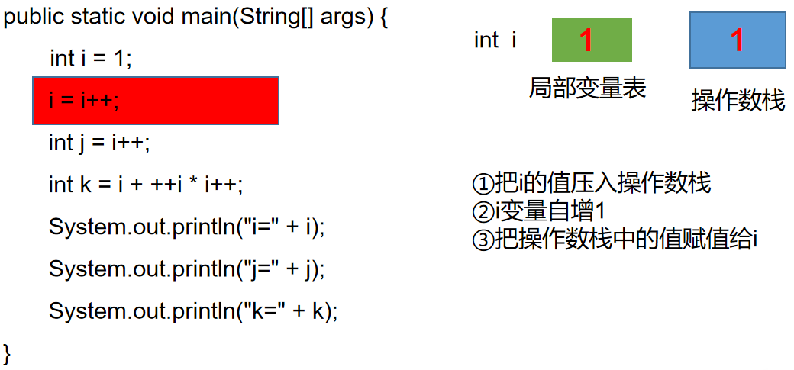
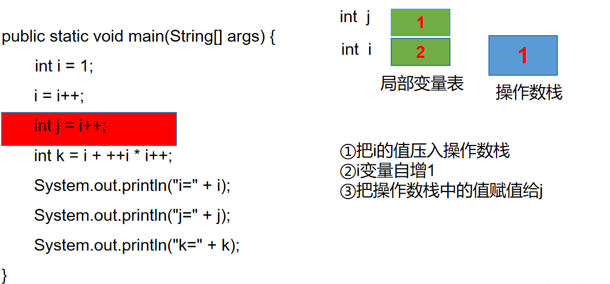
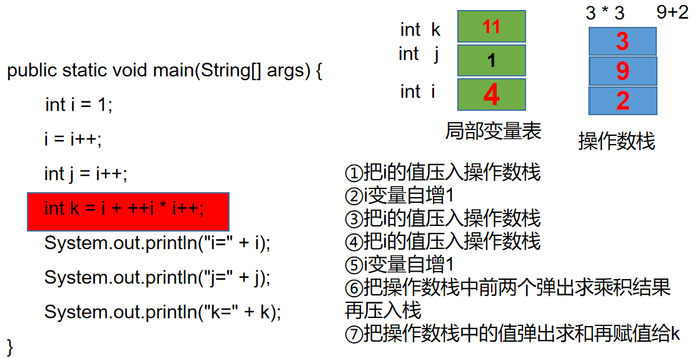

# 自增变量

如下代码的运行结果：

```java
public static void main(String[] args) {
    int i = 1;
    i = i++;
    int j = i++;
    int k = i + ++i * i++;
    System.out.println("i=" + i);
    System.out.println("j=" + j);
    System.out.println("k=" + k);
}
```

结果：

```
i=4
j=1
k=11
```

#### 分析







**总结**

- 赋值=符号，最后计算
- =右边的从左到右加载值依次压入操作栈
- 实际先算那个，看运算符优先级
- 自增、自减操作都是直接修改变量的值，不经过操作数栈
- 最后的赋值之前，临时结果也是存储在操作数栈中

