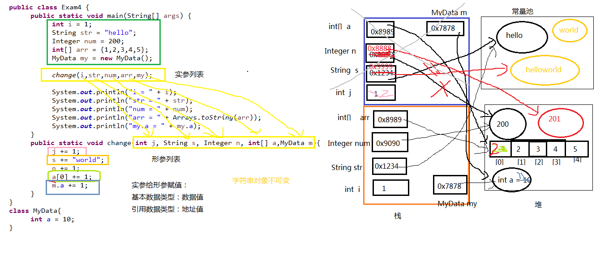

#### 下面代码的运行结果：

```java
import java.util.Arrays;

public class Exam4 {
	public static void main(String[] args) {
		int i = 1;
		String str = "hello";
		Integer num = 200;
		int[] arr = {1,2,3,4,5};
		MyData my = new MyData();
		
		change(i,str,num,arr,my);
		
		System.out.println("i = " + i);
		System.out.println("str = " + str);
		System.out.println("num = " + num);
		System.out.println("arr = " + Arrays.toString(arr));
		System.out.println("my.a = " + my.a);
	}
	public static void change(int j, String s, Integer n, int[] a,MyData m){
		j += 1;
		s += "world";
		n += 1;
		a[0] += 1;
		m.a += 1;
	}
}
class MyData{
	int a = 10;
}
```

##### 分析



#### 考点

1. 形参是基本数据类型
   - 传递数据值
2. 实参是引用数据类型
   - 传递地址值
   - 特殊的类型：String、包装类等对象不可变性