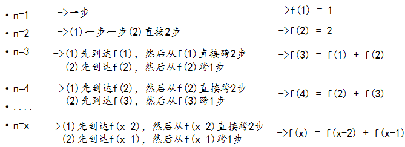
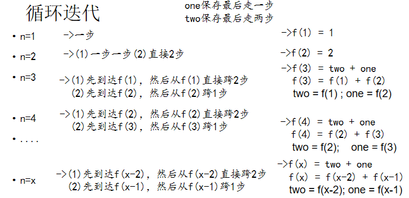

编程题：有n步台阶，一次只能上1步或2步，共有多少种走法？

解决方式：

#### 递归

##### 思路分析



##### 实现代码

```java
import org.junit.Test;

public class TestStep{
	@Test
	public void test(){
		long start = System.currentTimeMillis();
		System.out.println(f(100));//165580141
		long end = System.currentTimeMillis();
		System.out.println(end-start);//586ms
	}
	
	//实现f(n)：求n步台阶，一共有几种走法
	public int f(int n){
		if(n<1){
			throw new IllegalArgumentException(n + "不能小于1");
		}
		if(n==1 || n==2){
			return n;
		}
		return f(n-2) + f(n-1);
	}
}
```

#### 循环迭代

##### 思路分析



##### 代码实现

```java
import org.junit.Test;

public class TestStep2 {
	@Test
	public void test(){
		long start = System.currentTimeMillis();
		System.out.println(loop(100));//165580141
		long end = System.currentTimeMillis();
		System.out.println(end-start);//<1ms
	}
	
	public int loop(int n){
		if(n<1){
			throw new IllegalArgumentException(n + "不能小于1");
		}
		if(n==1 || n==2){
			return n;
		}
		
		int one = 2;//初始化为走到第二级台阶的走法
		int two = 1;//初始化为走到第一级台阶的走法
		int sum = 0;
		
		for(int i=3; i<=n; i++){
			//最后跨2步 + 最后跨1步的走法
			sum = two + one;
			two = one;
			one = sum;
		}
		return sum;
	}
}
```

#### **总结**

- 方法调用自身称为递归，利用变量的原值推出新值称为迭代

- 递归

  - 优点：大问题转化为小问题，可以减少代码量，同时代码精简，可读性好；
  - 缺点：递归调用浪费了空间，而且递归太深容易造成堆栈的溢出。

- 迭代

  - 优点：代码运行效率好，因为时间只因循环次数增加而增加，而且没有额外的空间开销；
  - 缺点：代码不如递归简洁，可读性好。

  