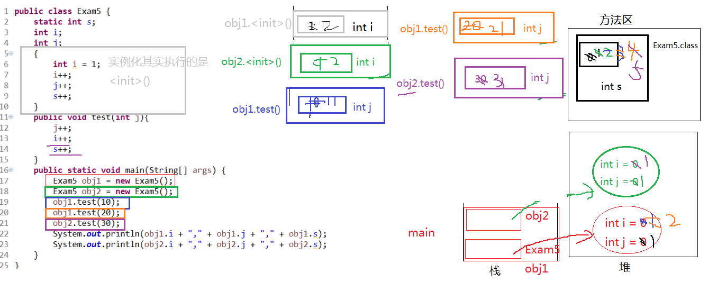

#### 下面代码运行结果：

```java
public class Exam5 {
	static int s;//成员变量，类变量
	int i;//成员变量，实例变量
	int j;//成员变量，实例变量
	{
		int i = 1;//非静态代码块中的局部变量 i
		i++;
		j++;
		s++;
	}
	public void test(int j){//形参，局部变量,j
		j++;
		i++;
		s++;
	}
	public static void main(String[] args) {//形参，局部变量，args
		Exam5 obj1 = new Exam5();//局部变量，obj1
		Exam5 obj2 = new Exam5();//局部变量，obj1
		obj1.test(10);
		obj1.test(20);
		obj2.test(30);
		System.out.println(obj1.i + "," + obj1.j + "," + obj1.s);
		System.out.println(obj2.i + "," + obj2.j + "," + obj2.s);
	}
}
```

##### 结果

```java
2,1,5
1,1,5
```



#### 考点

- 就近原则
- 变量的分类
  - 成员变量：类变量、实例变量
  - 局部变量
- 非静态代码块的执行：没次创建实例对象都会执行
- 方法的调用规则：调用一次执行一次

##### 局部变量与成员变量的区别

1. 声明的位置
   - 局部变量：方法体{}中，形参，代码块{}中
   - 成员变量：类中方法外
     - 类变量：有static修饰
     - 实例变量：没有static修饰
2. 修饰符
   - 局部变量：final
   - 成员变量：public、protected、private、final、static、volatile、transient
3. 值存储的位置
   - 局部变量：栈
   - 实例变量：堆
   - 类变量：方法区
4. 作用域
   - 局部变量：从声明处开始，到所属的}结束
   - 实例变量：在当前类中“this”（有时this.可以缺省），在其它类中“对象名.”访问
   - 类变量：在当前类中“类名.”（有时类名.可以省略），在其它类中“类名.”或“对象名.”访问
5. 生命周期
   - 局部变量：每一个线程，每一次调用执行都是新的生命周期
   - 实例变量：随着对象的创建而初始化，随着对象的回收而消亡，每一个对象的实例变量是独立的。
   - 类变量：随着类的初始化而初始化，随着类的卸载而消亡，该类的所有对象的类变量是共享的。

##### 当局不变量与xx变量重名时，如何区分

1. 局部变量与实例变量重名
   - 在实例变量前面加“this.”
2. 局部变量与类变量重名
   - 在类变量前面加“类名.”