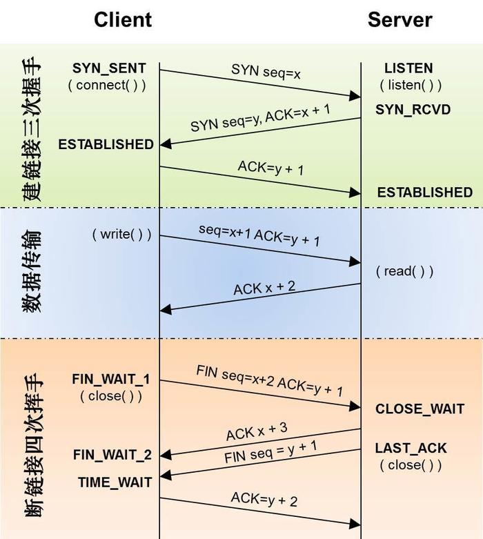
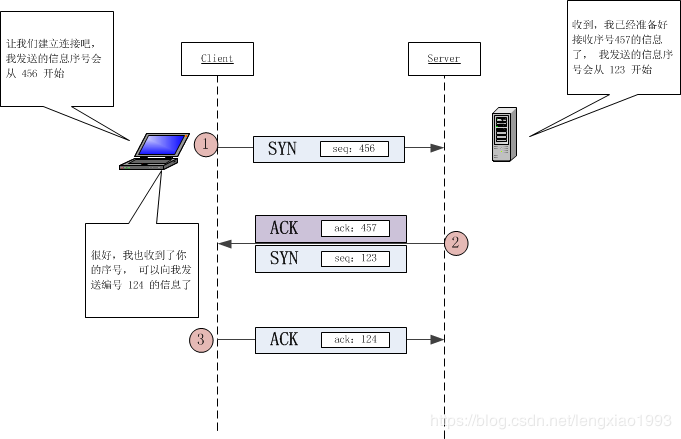

#### 1.tcp和http区别 异同和关系，http和https的异同？

##### **HTTP（超文本传输协议，用于网络通信数据传输）**

##### **HTTPS原理（对HTTP进行非对称加密传输数据使网络通信较为安全）**

​	加密原理步骤：

1. 服务器将公钥发送给CA机构申请数字证书
2. CA机构下发数字证书给服务器再由服务器发送给客户端
   - 将企业信息以及公钥用MD5生成摘要放在信息后面
   - 再将上一个的所有信息用CA私钥加密发回服务器
3. 服务器拿到数据证书后发送给客户端
4. 客户端使用浏览器中内置的CA公钥解析数字证书
5. 解析完毕后对内容进行MD5的加密再与摘要匹配如果一直说明文本完整，服务器安全。

无法被篡改的原因：

当socket包被拦截后可以使用CA的公钥对服务器的公钥进行解密，也可以对信息解密从而拿到信息。但无法修改，因为无法拿到CA的私钥对伪装的公钥进行加密，所以保证了信息安全。

##### HTTP与HTTPS区别与联系

|                           |                 优/缺点                  |          端口           |    效率     | 内部实现 |
| ------------------------- | :--------------------------------------: | :---------------------: | :---------: | :------: |
| http(超文本传输协议)      |  传输快、校验简单不安全，容易被抓包监控  |           80            | 高，传输快  |   HTTP   |
| https(超文本传输安全协议) | 安全、SEO排名高，被google所信任较http 慢 | 80 与 443（传输证书的） | 相对http 慢 | HTTP+SSL |

##### OSI七层协议

OSI是一个开放性的通信系统互连参考模型，他是一个定义得非常好的协议规范。OSI模型有7层结构，每层都可以有几个子层。

OSI的7层从上到下分别是 

7 应用层 

6 表示层 

5 会话层 

4 传输层 

3 网络层 

2 数据链路层 

1 物理层 

##### HTTPS 与 TCP/IP联系与区别（HTTP基于TCP，TCP用于连接，HTTP用于数据传输）

|      |                            HTTP                            |                            TCP/IP                            |
| :--: | :--------------------------------------------------------: | :----------------------------------------------------------: |
| 区别 |               应用层定义传输数据的内容的规范               | 传输层数据传输和连接方式的规范（不带任何数据，仅仅用于连接通信） |
| 意义 |        C端通过HTTP发起短连接请求访问S端获取响应报文        | Http 必须建立在TCP/IP连接成功之后才能发起访问请求，建立HTTP 连接的基础 |
| 作用 | 使用户与服务器有一个良好的交互，才出现了TB,JD 等等大型网站 | 应用层协议建立连接的基石，应用层的连接必须在TCP/IP三次握手之后才能发送数据 |

##### TCP连接的三次握手与断开连接的四次挥手

###### TCP：

1. TCP协议是面向连接的运输层协议在数据传输前必须建立连接，数据才能开始传输
2. 每条连接都是端口对端口的连接（一对一）
3. 浏览器像服务器传输数据是，传输过程中是一个一个的数据报文，被分段了，到服务器端重组
4. TCP提供全双工通信：一端既可以是服务端也可以是客户端

###### 三次握手建立连接：

第一次握手：客户端发送syn包(seq=x)到服务器，并进入SYN_SEND状态，等待服务器确认；

第二次握手：服务器收到syn包，必须确认客户的SYN(ack=x+1)，同时自己也发送一个SYN包（seq=y），即SYN+ACK包，此时服务器进入SYN_RECV状态；

第三次握手：客户端收到服务器的SYN+ACK包，向服务器发送确认包ACK（ack=y+1），此包发送完毕，客户端和服务器进入ESTABLISHED状态，完成三次握手。

握手过程中传送的包里不包含数据，三次握手完毕后，客户端与服务器才正式开始传送数据。理想状态下，TCP连接一旦建立，在通信双方中的任何一方主动关闭连接之前，TCP连接都将被一直保持下去。

###### 四次挥手断开连接：

1. B端发送断开请求
2. S端发送ACK确认收到B端断开请求
3. 将S端的数据处理完毕后发送可以断开FIN给B端
4. B端发送确认收到请求断开连接

###### 挥手与握手示意图

**TCP为什么需要三次握手？**

TCP是一个双向通信协议，通信双方都有能力发送信息，并接收响应。因此，通信双方都需要随机产生一个初始的序列号，并且把这个起始值告诉对方。

为了实现可靠传输，发送方和接收方始终需要同步（SYNchronize）序号。注意，序号并不是从0开始的，而是由发送方随机选择的初始序列号（Initial Sequence Number，ISN）开始。

参考博客：https://www.cnblogs.com/lanSeGeDiao/p/11379624.html