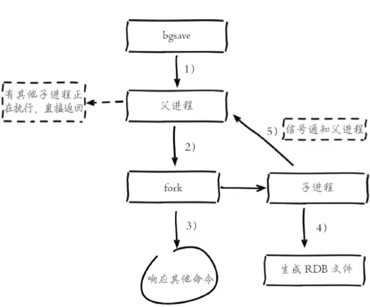
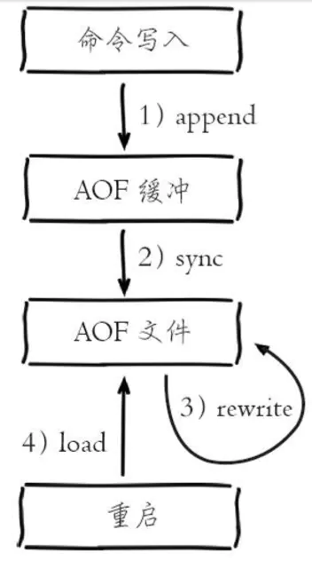
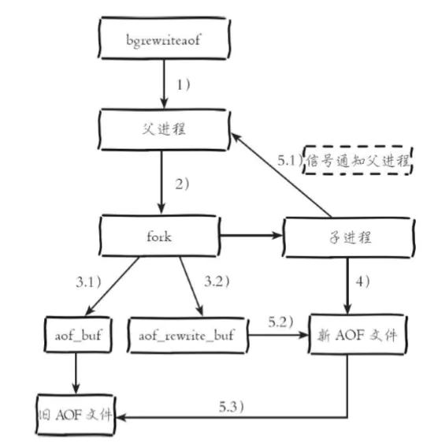
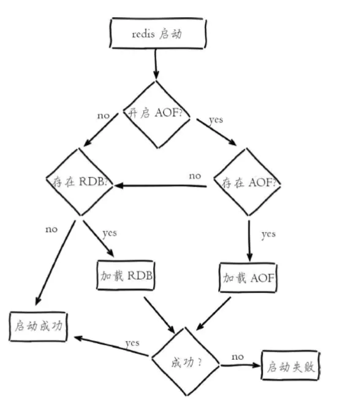

#### Redis持久化

> Redis支持RDB和AOF两种持久化机制，持久化功能有效地避免因进程退出造成的数据丢失问题，当下次重启时利用之前持久化的文件即可实现数据恢复。

##### RDB持久化

RDB持久化是**把当前进程数据生成快照保存到硬盘的过程**，触发RDB持久化过程分为**手动触发**和**自动触发**。

###### 触发机制

1. 手动触发

   - **save命令：**阻塞当前Redis服务器，直到RDB过程完成为止，对于内存比较大的实例会造成长时间阻塞，线上环境不建议使用。
   - **bgsave命令：**Redis进程执行fork操作创建子进程，RDB持久化过程由子进程负责，完成后自动结束。阻塞只发生在fork阶段，一般时间很短。

2. 自动触发

   - 使用save相关配置。如“save m n”，表示m秒内数据集存在n次修改时，自动触发bgsave。
   - 如果从节点执行全量复制操作，主节点自动执行bgsave生成RDB文件并发送给从节点。
   - 执行debug reload命令重写加载Redis时，也会自动触发save操作。
   - 默认情况下执行shutdown命令时，如果没有开启AOF持久化功能则自动执行bgsave。

   **bgsave是主流的触发RDB持久化方式**

   

1）执行bgsave命令，Redis父进程判断当前是否存在执行的子进程，如RDB/AOF子进程，如果存在bgsave命令直接返回。

2）父进程执行fork操作创建子进程，fork操作过程中父进程会阻塞，通过info stats命令查看latest_fork_usec选项，可以获取最近一个fork操作的耗时，单位为微秒。

3）父进程fork完成后，bgsave命令返回“Background saving started”信息并不再阻塞父进程，可以继续相应其它命令。

4）子进程创建RDB文件，根据父进程内存生成临时快照文件，完成后对原文件进行原子替换。执行lastsave命令可以获取最后一次生成RDB的时间，对应info统计的rdb_last_save_time选项。

5）进程发送信号给父进程表示完成，父进程更新统计信息，具体见 info Persistence 下的rdb_*相关选项。

**RDB文件的处理**

保存：RDB文件保存在dir配置指定的目录下，文件名通过dbfilename配置指定。可以通过执行config set dir{newDir}和config set dbfilename{newFileName}运行期动态执行，当下次运行时RDB文件会保存到新目录。

###### RDB的优缺点

**优点：**

- RDB是一个紧凑压缩的二进制文件，代表Redis在某个时间点上的数据快照。非常适用于备份，全量复制等场景。比如每6小时执行bgsave备份， 并把RDB文件拷贝到远程机器或者文件系统中（如hdfs），用于灾难恢复。

- Redis加载RDB恢复数据远远快于AOF的方式。

**缺点：**

- RDB方式数据没办法做到实时持久化/秒级持久化。因为bgsave每次运 行都要执行fork操作创建子进程，属于重量级操作，频繁执行成本过高。
- RDB文件使用特定二进制格式保存，Redis版本演进过程中有多个格式的RDB版本，存在老版本Redis服务无法兼容新版RDB格式的问题。

##### AOF持久化

**AOF（append only file）持久化**：**以独立日志的方式记录每次写命令， 重启时再重新执行AOF文件中的命令达到恢复数据的目的。**AOF的主要作用是解决了数据持久化的实时性，目前已经是Redis持久化的主流方式。

###### 使用AOF

开启AOF功能需要设置配置：**appendonly yes，默认不开启**。**AOF文件名通过appendfilename配置设置，默认文件名是appendonly.aof**。**保存路径**同RDB持久化方式一致，**通过dir配置指定**。AOF的**工作流程操作：命令写入 （append）、文件同步（sync）、文件重写（rewrite）、重启加载 （load）**



1）**所有的写入命令会追加到aof_buf（缓冲区）中**。

2）AOF**缓冲区根据对应的策略向硬盘做同步操作**。

AOF为什么把命令追加到aof_buf中？

Redis使用单线程响应命令，如果每次写AOF文件命令都直接追加到硬盘，那么性能完全取决于当前硬盘负载。

先写入缓冲区aof_buf中，还有另一个好处，Redis可以提供多种缓冲区同步硬盘的策略，在性能和安全性方面做出平衡

3）**随着AOF文件越来越大，需要定期对AOF文件进行重写，达到压缩的目的**。

重写后的AOF文件为什么可以变小？

1）进程内已经超时的数据不再写入文件。

2）旧的AOF文件含有无效命令，如del key1、hdel key2、srem keys、set a111、set a222等。重写使用进程内数据直接生成，这样新的AOF文件只保留最终数据的写入命令。

3）多条写命令可以合并为一个，如：lpush list a、lpush list b、lpush list c可以转化为：lpush list a b c。为了防止单条命令过大造成客户端缓冲区溢出，对于list、set、hash、zset等类型操作，以64个元素为界拆分为多条。

**AOF重写降低了文件占用空间**，除此之外，另一个**目的是：更小的AOF文件可以更快地被Redis加载**。


**AOF重写过程触发方式**

- 手动触发

  直接调用bgrewriteaof命令。

- 自动触发

  根据auto-aof-rewrite-min-size和auto-aof-rewrite-percentage参数确定自动触发时机。

  - **auto-aof-rewrite-min-size**：表示运行AOF重写时文件最小体积，默认为64MB。
  - **auto-aof-rewrite-percentage**：代表当前AOF文件空间 （aof_current_size）和上一次重写后AOF文件空间（aof_base_size）的比值。

  ```shell
  自动触发时机 = aof_current_size > auto-aof-rewrite-minsize && (aof_current_size -aof_base_size) / aof_base_size>=auto-aof-rewritepercentage
  
  #其中aof_current_size和aof_base_size可以在info Persistence统计信息中查看
  ```

  

4）**当Redis服务器重启时，可以加载AOF文件进行数据恢复。**



**流程说明：**

1）AOF持久化开启且存在AOF文件时，优先加载AOF文件，打印日志：

```cmd
DB loaded from append only file: 5.841 seconds
```

2）AOF关闭或者AOF文件不存在时，加载RDB文件，打印日志：

```cmd
DB loaded from disk: 5.586 seconds
```

3）加载AOF/RDB文件成功后，Redis启动成功。

4）AOF/RDB文件存在错误时，Redis启动失败并打印错误信息。

#### 重点

1. Redis提供了两种持久化方式：**RDB和AOF**。
2. RDB使用一次性生成内存快照的方式，产生的文件紧凑压缩比更高，因此读取RDB恢复速度更快。由于每次生成RDB开销较大，无法做到实时持久化，一般用于数据冷备和复制传输。
3. save命令会阻塞主线程不建议使用，bgsave命令通过fork操作创建子进程生成RDB避免阻塞。
4. AOF通过追加写命令到文件实现持久化，通过appendfsync参数可以 控制实时/秒级持久化。因为需要不断追加写命令，所以AOF文件体积逐渐变大，需要定期执行重写操作来降低文件体积。
5. AOF重写可以通过auto-aof-rewrite-min-size和auto-aof-rewritepercentage参数控制自动触发，也可以使用bgrewriteaof命令手动触发。
6. 子进程执行期间使用copy-on-write机制与父进程共享内存，避免内存消耗翻倍。AOF重写期间还需要维护重写缓冲区，保存新的写入命令避免数据丢失。
7. 持久化阻塞主线程场景有：fork阻塞和AOF追加阻塞。fork阻塞时间跟内存量和系统有关，AOF追加阻塞说明硬盘资源紧张。
8. 单机下部署多个实例时，为了防止出现多个子进程执行重写操作， 建议做隔离控制，避免CPU和IO资源竞争。