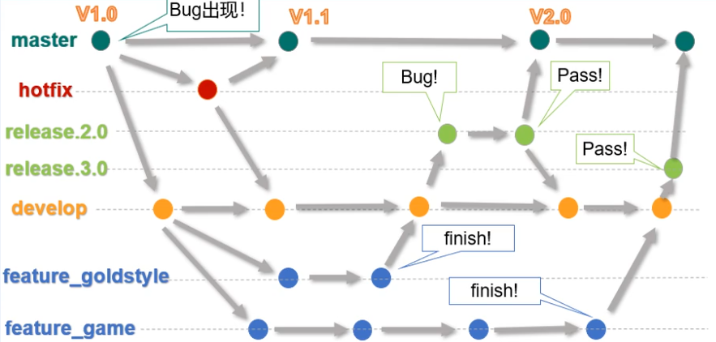

#### Git分支相关命令

```shell
--创建分支
git branch <分支名>
git branch -v 查看分支
--切换分支
git checkout <分支名>
--一步完成创建及切换
git checkout -b <分支名>
--合并分支
git checkout master --先切换到主干
git merge <分支名> --回到mastar分支，再执行该命令
--跟踪远程分支
git checkout -b [branch-name] origin/[branch-name]
或
git checkout --track origin/[branch-name]
--删除分支
git checkout master --先切换到主干
git branch -D <分支名>(D强制删除)
```

```shell
--将本地分支提交到远端命令
git push origin [name]
--删除远端分支
git push origin :branch-name
或
git branch -r -d origin/branch-name
或
git branch -d origin branch-name
--查看本地分支
git branch
--查看远端分支
git branch -r
```

指针头分离

原因：mstar和HEAD的绑定状态被打破，导致mstar指向低于HEAD的情况

方案：

```shell
-- 强制将master分支指向当前头指针的位置
git branch -f master HEAD
-- 检出master分支
git checkout master
```

合并merge时冲突解决

一般标记为unmerged的为冲突文件，如

```shell
<<<<<<< HEAD (mstar的内容)
<div id="test"> 111</div>
======= (分支内容)
<div id="test"> 222</div>
>>>>>>> branch-name
```

修改冲突内容后，再执行git add，并执行git status查看是否继续即可。

#### Git工作流

