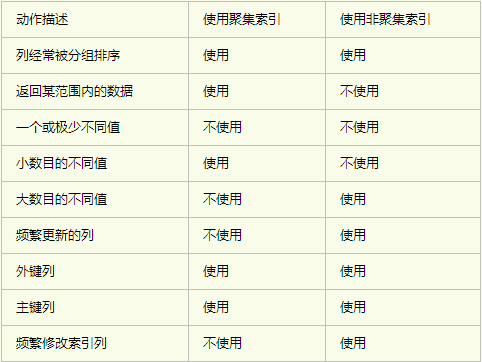

# MySQL什么时候建立索引？

**索引是帮助MySQL高效获取数据的数据结构。**

**优势：**

1. 提高数据检索的效率，降低数据库IO成本
2. 通过索引对数据进行排序，降低数据排序的成本，降低了CPU的消耗

**劣势：**

降低更新表的速度，如对表进行update 、delete、insert等操作时，MySQL不仅要保存数据，还要保存一下索引文件每次添加了索引列的字段，都会调整因为更新带来的键值变化后的索引信息。

**适合创建索引条件：**

1. 主键自动建立唯一索引
2. 频繁作为查询条件的字段应该建立索引
3. 查询中与其他表关联的字段，外键关系建立索引
4. 单键/组合索引的选择问题，组合索引性价比更高
5. 查询中排序的字段，排序字段若通过索引去访问将大大提高排序效率
6. 查询中统计或者分组字段

**不适合创建索引条件：**

1. 表记录少的
2. 经常增删改的表或者字段
3. where条件里用不到的字段不创建索引
4. 过滤性不好的不适合创建索引


# MySQL索引类型

**索引概念：**

**索引是一种特殊的文件(InnoDB数据表上的索引是表空间的一个组成部分)，它们包含着对数据表里所有记录的引用指针**。更通俗的说，数据库索引好比是一本书前面的目录，能加快数据库的查询速度。

索引分为聚簇索引和非聚簇索引两种，**聚簇索引是按照数据存放的物理位置为顺序的**，而非聚簇索引就不一样了；**聚簇索引能提高多行检索的速度，而非聚簇索引对于单行的检索很快**。

1. 普通索引

   最基本的索引，它没有任何限制。MyIASM中默认的BTREE类型的索引，也是大多数情况下用到的索引。

   ```sql
   –直接创建索引
   CREATE INDEX index_name ON table(column(length))
   
   –修改表结构的方式添加索引
   ALTER TABLE table_name ADD INDEX index_name ON (column(length))
   
   –创建表的时候同时创建索引
   CREATE TABLE `table` (
   
   `id` int(11) NOT NULL AUTO_INCREMENT ,
   
   `title` char(255) CHARACTER SET utf8 COLLATE utf8_general_ci NOT NULL ,
   
   `content` text CHARACTER SET utf8 COLLATE utf8_general_ci NULL ,
   
   `time` int(10) NULL DEFAULT NULL ,
   
   PRIMARY KEY (`id`),
   
   INDEX index_name (title(length))
   
   )
   
   –删除索引
   DROP INDEX index_name ON table
   ```

2. 唯一索引

   索引列的值必须唯一，但允许空值（和主键不同）。若是组合索引，则列值的组合必须唯一。

   ```sql
   –创建唯一索引
   CREATE UNIQUE INDEX indexName ON table(column(length))
   
   –修改表结构
   ALTER TABLE table_name ADD UNIQUE indexName ON (column(length))
   
   –创建表的时候直接指定
   CREATE TABLE `table` (
   
   `id` int(11) NOT NULL AUTO_INCREMENT ,
   
   `title` char(255) CHARACTER SET utf8 COLLATE utf8_general_ci NOT NULL ,
   
   `content` text CHARACTER SET utf8 COLLATE utf8_general_ci NULL ,
   
   `time` int(10) NULL DEFAULT NULL ,
   
   PRIMARY KEY (`id`),
   
   UNIQUE indexName (title(length))
   ```

3. 全文索引（FULLTEXT）

   MySQL从3.23.23版开始支持全文索引和全文检索，FULLTEXT索引仅可用于 MyISAM 表；可以从CHAR、VARCHAR或TEXT列中作为CREATE TABLE语句的一部分被创建，或是随后使用ALTER TABLE 或CREATE INDEX被添加。

   对于较大的数据集，将你的资料输入一个没有FULLTEXT索引的表中，然后创建索引，其速度比把资料输入现有FULLTEXT索引的速度更为快。不过切记对于大容量的数据表，生成全文索引是一个非常消耗时间非常消耗硬盘空间的做法。

   ```sql
   –创建表的适合添加全文索引
   CREATE TABLE `table` (
   `id` int(11) NOT NULL AUTO_INCREMENT ,
   `title` char(255) CHARACTER SET utf8 COLLATE utf8_general_ci NOT NULL ,
   `content` text CHARACTER SET utf8 COLLATE utf8_general_ci NULL ,
   `time` int(10) NULL DEFAULT NULL ,
   PRIMARY KEY (`id`),
   FULLTEXT (content)
   );
   
   –修改表结构添加全文索引
   ALTER TABLE article ADD FULLTEXT index_content(content)
   
   –直接创建索引
   CREATE FULLTEXT INDEX index_content ON article(content)
   ```

4. 单列索引、多列索引

   多个单列索引与单个多列索引的查询效果不同，因为执行查询时，MySQL只能使用一个索引，会从多个索引中选择一个限制最为严格的索引。

5. 组合索引（最左前缀）

   ```sql
   ALTER TABLE article ADD INDEX index_titme_time (title(50),time(10))
   -- 建立这样的组合索引，其实是相当于分别建立了下面两组组合索引：
   -- title,time
   -- title
   
   --使用到上面的索引
   SELECT * FROM article WHREE title='测试' AND time=1234567890;
   SELECT * FROM article WHREE utitle='测试';
   --不使用上面的索引
   SELECT * FROM article WHREE time=1234567890;
   ```

   #### MySQL索引的优化

   - 何时使用聚集索引或非聚集索引？

   

- 索引不会包含有NULL值的列

  只要列中包含有NULL值都将不会被包含在索引中，复合索引中只要有一列含有NULL值，那么这一列对于此复合索引就是无效的。所以在数据库设计时不要让字段的默认值为NULL。

- 使用短索引

  **对串列进行索引，如果可能应该指定一个前缀长度**。例如，如果有一个CHAR(255)的列，如果在前10个或20个字符内，多数值是惟一的，那么就不要对整个列进行索引。**短索引不仅可以提高查询速度而且可以节省磁盘空间和I/O操作。**

- 索引列排序

  MySQL查询只使用一个索引，因此如果where子句中已经使用了索引的话，那么order by中的列是不会使用索引的。因此数据库默认排序可以符合要求的情况下不要使用排序操作；尽量不要包含多个列的排序，如果需要最好给这些列创建复合索引。

-  like语句操作

  ike “%aaa%” 不会使用索引而like “aaa%”可以使用索引。

- 不要在列上进行运算

  如：select * from users where YEAR(adddate)<2007，将在每个行上进行运算，这将导致索引失效而进行全表扫描。

  可以改成：select * from users where adddate<’2007-01-01′。

**MySQL只对一下操作符才使用索引：<,<=,=,>,>=,between,in,以及某些时候的like(不以通配符%或_开头的情形)。**

## 按存储结构划分

##### B-Tree索引

- 非叶子节点只存储键值信息
- 所有叶子节点之间都有链指针
- 数据记录都存放在叶子节点中

B-Tree模型：


B+Tree模型：


B-Tree对索引列是顺序组织存储的，很适合查找范围数据。

**B-Tree索引适用于的查询：**

1. 全值匹配

   全值匹配是指查询中使用的条件和索引中的所有列进行匹配。比如有索引 index(last_name, first_name, date) ,查询的条件为：where last_name=? and first_name=? and date=? 。

2. 匹配最左前缀

   只使用索引的第一列。比如查询条件为：where last_name = ?

3. 匹配列前缀

   只匹配某一列值得开头部分。

4. 匹配范围值

5. 精确匹配某一列并范围匹配另一列

   where last_name = ? and first_name like kim%

6. 只访问索引的查询 

##### 哈希索引

哈希索引基于哈希表实现。哈希索引将所有的哈希码存储在索引中，同时在哈希表中保存指向每个数据行的指针。在mysql中，Memory引擎显式支持哈希索引。

```sql
CREATE TABLE testhash (
    fname VARCHAR(50) NOT NULL,
    lname VARCHAR(50) NOT NULL,
    KEY USING HASH(fname)
) ENGINE=MEMORY; 
```

数据：

| fname | lname     |
| ----- | --------- |
| Arjen | Lentz     |
| Baron | Schwartz  |
| Peter | Zaitsev   |
| Vadim | Tkachenko |

假设索引使用假想的哈希函数f(), 如下：

 f('Arjen') = 2323

 f('Baron') = 7437

 f('Peter') = 8784

 f('Vadim') = 2458

那么哈希索引的数据结构：

槽（Slot）      值（Value）

2323           指向第1行的指针

2458           指向第4行的指针

7437           指向第2行的指针

8784           指向第3行的指针

如果使用一条sql语句进行查询：select lname from testhash where fname = 'Peter'; 过程为：

计算‘Peter’的哈希值(f('Peter')=8784) -----> 查找哈希值对应的指针 -----> 根据指针或得相应的数据。

**哈希索引的特点**：索引的结构十分紧凑，因此查找速度非常快；**哈希索引数据不是按照索引顺序存储的**，**无法用于排序**；哈希索引不支持部分索引列匹配查找；**哈希索引只支持等值比较查询(=,IN(),<=>)**，不支持范围查询，如where price>100;

##### 全文索引

全文索引查找的是文本中的关键词，不是直接比较索引中的值。