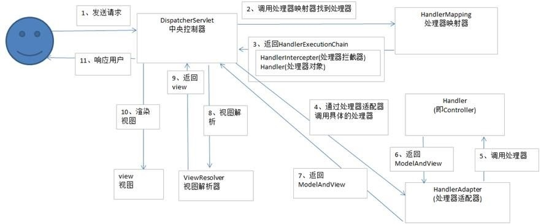

## SpringMVC的工作流程

##### 实验代码

springmvc.xml

```xml
<?xml version="1.0" encoding="UTF-8"?>
<beans xmlns="http://www.springframework.org/schema/beans"
	xmlns:xsi="http://www.w3.org/2001/XMLSchema-instance"
	xmlns:context="http://www.springframework.org/schema/context"
	xmlns:mvc="http://www.springframework.org/schema/mvc"
	xsi:schemaLocation="http://www.springframework.org/schema/mvc http://www.springframework.org/schema/mvc/spring-mvc-4.0.xsd
		http://www.springframework.org/schema/beans http://www.springframework.org/schema/beans/spring-beans.xsd
		http://www.springframework.org/schema/context http://www.springframework.org/schema/context/spring-context-4.0.xsd">
	
	<!-- 配置自动扫描到的包 -->
	<context:component-scan base-package="com.learnspring.springmvc"></context:component-scan>
	
	<!-- 配置视图解析器 -->
	<bean id="viewResolver" class="org.springframework.web.servlet.view.InternalResourceViewResolver">
		<property name="prefix" value="/WEB-INF/views/"></property>
		<property name="suffix" value=".jsp"></property>
	</bean>
	
	<!-- 配置不经过处理器方法直接到达响应页面 
		path属性：设置要映射请求地址
		view-name属性：设置视图名
	-->
	<mvc:view-controller path="/testViewResolver" view-name="success"/>
	<!-- 配置了不经过处理器方法直接到达响应页面之后，处理器方法上的@RequestMapping将失效，此时必须配置以下标签 -->
	<mvc:annotation-driven></mvc:annotation-driven>
</beans>
```

Department.java

```java
public class Department {

	private Integer id;
	private String name;

	public Department() {
		super();
	}

	public Department(Integer id, String name) {
		super();
		this.id = id;
		this.name = name;
	}

	public Integer getId() {
		return id;
	}

	public void setId(Integer id) {
		this.id = id;
	}

	public String getName() {
		return name;
	}

	public void setName(String name) {
		this.name = name;
	}

	@Override
	public String toString() {
		return "Department [id=" + id + ", name=" + name + "]";
	}

}
```

Employee.java

```java
public class Employee {

	private Integer id;
	private String lastName;
	private String email;
	private Department dept;

	public Employee() {
		super();
	}

	public Employee(Integer id, String lastName, String email, Department dept) {
		super();
		this.id = id;
		this.lastName = lastName;
		this.email = email;
		this.dept = dept;
	}

	public Integer getId() {
		return id;
	}

	public void setId(Integer id) {
		this.id = id;
	}

	public String getLastName() {
		return lastName;
	}

	public void setLastName(String lastName) {
		this.lastName = lastName;
	}

	public String getEmail() {
		return email;
	}

	public void setEmail(String email) {
		this.email = email;
	}

	public Department getDept() {
		return dept;
	}

	public void setDept(Department dept) {
		this.dept = dept;
	}

	@Override
	public String toString() {
		return "Employee [id=" + id + ", lastName=" + lastName + ", email=" + email + ", dept=" + dept + "]";
	}

}
```

SpringMVCHandler.java

```java
import java.util.Map;

import javax.servlet.http.HttpServletRequest;
import javax.servlet.http.HttpServletResponse;

import org.springframework.stereotype.Controller;
import org.springframework.web.bind.annotation.CookieValue;
import org.springframework.web.bind.annotation.PathVariable;
import org.springframework.web.bind.annotation.RequestHeader;
import org.springframework.web.bind.annotation.RequestMapping;
import org.springframework.web.bind.annotation.RequestMethod;
import org.springframework.web.bind.annotation.RequestParam;
import org.springframework.web.servlet.ModelAndView;

import com.learnspring.springmvc.entities.Department;
import com.learnspring.springmvc.entities.Employee;

@Controller
public class SpringMVCHandler {
	
	public static final String SUCCESS="success";

	//1.简单的谈一下SpringMVC的工作流程
	
	//处理模型数据方式一：将方法的返回值设置为ModelAndView
	@RequestMapping("/testModelAndView")
	public ModelAndView testModelAndView() {
		//1.创建ModelAndView对象
		ModelAndView mav = new ModelAndView();
		//2.设置模型数据，最终会放到request域中
		mav.addObject("user", "admin");
		//3.设置视图
		mav.setViewName("success");
		return mav;
	}
	/*
	 * ★处理模型数据方式二：方法的返回值仍是String类型，在方法的入参中传入Map、Model或者ModelMap
	 * 	不管将处理器方法的返回值设置为ModelAndView还是在方法的入参中传入Map、Model或者ModelMap，
	 *  SpringMVC都会转换为一个ModelAndView对象
	 */
	@RequestMapping("/testMap")
	public String testMap(Map<String , Object> map) {
		//向Map中添加模型数据，最终会自动放到request域中
		map.put("user", new Employee(1, "韩总", "hybing@atguigu.com", new Department(101, "教学部")));
		return SUCCESS;
	}
	
}
```

web.xml

```xml
<?xml version="1.0" encoding="UTF-8"?>
<web-app xmlns:xsi="http://www.w3.org/2001/XMLSchema-instance" xmlns="http://java.sun.com/xml/ns/javaee" xsi:schemaLocation="http://java.sun.com/xml/ns/javaee http://java.sun.com/xml/ns/javaee/web-app_2_5.xsd" id="WebApp_ID" version="2.5">
	<!-- 设置CharacterEncodingFilter -->
	<filter>
		<filter-name>CharacterEncodingFilter</filter-name>
		<filter-class>org.springframework.web.filter.CharacterEncodingFilter</filter-class>
		<!-- 设置请求的字符集 -->
		<init-param>
			<param-name>encoding</param-name>
			<param-value>UTF-8</param-value>
		</init-param>
		<!-- 设置响应的字符集 -->
		<init-param>
			<param-name>forceEncoding</param-name>
			<param-value>true</param-value>
		</init-param>
	</filter>
	<filter-mapping>
		<filter-name>CharacterEncodingFilter</filter-name>
		<url-pattern>/*</url-pattern>
	</filter-mapping>
	<servlet>
		<servlet-name>springDispatcherServlet</servlet-name>
		<servlet-class>org.springframework.web.servlet.DispatcherServlet</servlet-class>
		<init-param>
			<param-name>contextConfigLocation</param-name>
			<param-value>classpath:springmvc.xml</param-value>
		</init-param>
		<load-on-startup>1</load-on-startup>
	</servlet>

	<servlet-mapping>
		<servlet-name>springDispatcherServlet</servlet-name>
		<url-pattern>/</url-pattern>
	</servlet-mapping>
	
	<!-- 注册HiddenHttpMethodFilter，目的是为了将一个POST请求转换为PUT或者DELETE请求 -->
	<filter>
		<filter-name>HiddenHttpMethodFilter</filter-name>
		<filter-class>org.springframework.web.filter.HiddenHttpMethodFilter</filter-class>
	</filter>
	<filter-mapping>
		<filter-name>HiddenHttpMethodFilter</filter-name>
		<url-pattern>/*</url-pattern>
	</filter-mapping>
</web-app>
```

index.jsp

```jsp
<%@ page language="java" contentType="text/html; charset=UTF-8"
    pageEncoding="UTF-8"%>
<!DOCTYPE html PUBLIC "-//W3C//DTD HTML 4.01 Transitional//EN" "http://www.w3.org/TR/html4/loose.dtd">
<html>
<head>
<meta http-equiv="Content-Type" content="text/html; charset=UTF-8">
<title>Insert title here</title>
</head>
<body>
	<a href="${pageContext.request.contextPath }/testModelAndView">Test ModelAndView</a><br>
	<a href="${pageContext.request.contextPath }/testMap">Test Map</a><br>
</body>
</html>
```

success.jsp

```jsp
<%@ page language="java" contentType="text/html; charset=UTF-8"
    pageEncoding="UTF-8"%>
<!DOCTYPE html PUBLIC "-//W3C//DTD HTML 4.01 Transitional//EN" "http://www.w3.org/TR/html4/loose.dtd">
<html>
<head>
<meta http-equiv="Content-Type" content="text/html; charset=UTF-8">
<title>Insert title here</title>
</head>
<body>
	<h1>Success Page</h1>
	<h2>request域中的用户是：${requestScope.user }</h2>
</body>
</html>
```

#### 工作流程



###### SpringMVC工作原理

相关博客：https://www.cnblogs.com/fengquan-blog/p/11161084.html