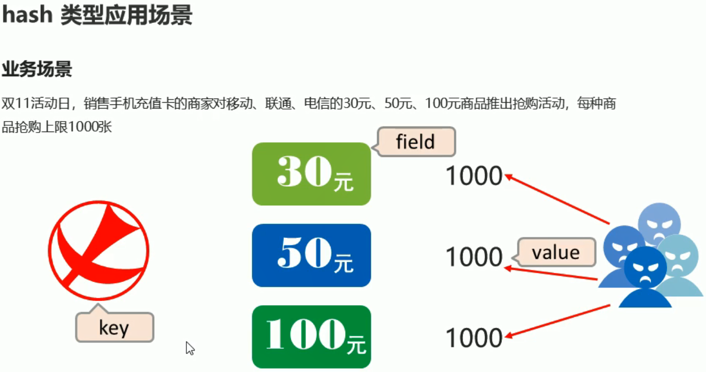
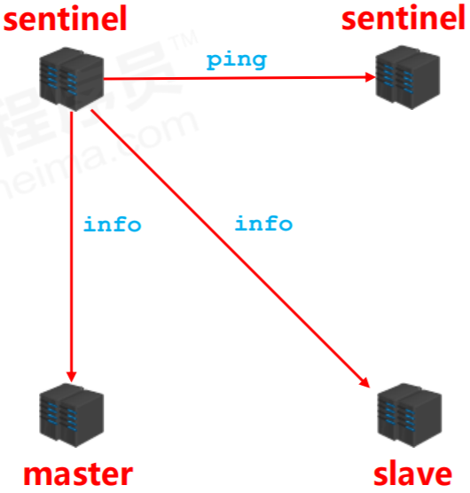
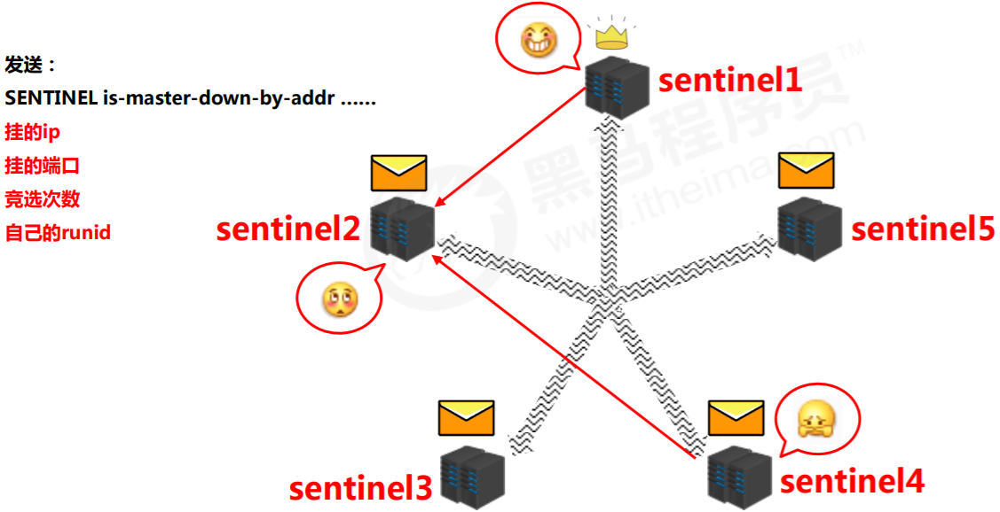

[TOC]

# Redis

## 简介

### 为什么需要缓存数据库？

网站或应用发展到一定规模所要面对的问题：海量用户、高并发。

#### 关系型数据库的瓶颈

- 性能瓶颈：磁盘IO性能低下。
- 扩展瓶颈：数据关系复杂，扩展性差，不便于大规模集群。

##### 解决思路

- 降低磁盘IO次数，越低越好  →  内存存储
- 去除数据间关系，越简单越好 → 不存储关系，仅存储数据

**NoSQL数据库**

### NoSQL

**NoSQL：** 即Not-Only SQL(泛指非关系型的数据库)，作为关系型数据库的补充。

**作用：**应对基于海量用户和海量数据前提下的数据处理问题。

**特点：**

1. 可扩容，可伸缩
2. 大数据量下高性能
3. 灵活的数据模型
4. 高可用

**常见的NoSQL数据库：**Redis、memcache、HBase、MongoDB


### Redis

**概念：**Redis(Remote Dictionary Server)实用C语言开发的一个开源的高性能键值对(key-value)数据库。

**特点：**

1. 数据间没有必然的关联关系
2. 内部采用单线程机制进行工作
3. 高性能
4. 数据类型支持
   - string：字符串
   - list：列表
   - hash：散列表
   - set：集合
   - sorted_set：有序集合
5. 持久化，可以进行数据灾难恢复。

#### 应用场景

- 为热点数据加速查询。如：热点商品、热点新闻等等。
- 任务队列。如：抢购、购票排队等。
- 即时信息查询。如：排行榜、网站访问统计等。
- 时效信息控制。如：验证码控制、股票控制等。
- 分布式数据共享。如：分布式集群架构中的session分离。
- 消息队列
- 分布式锁

## Redis下载和安装

Redis官网：https://redis.io/

中文官网：http://www.redis.cn/

**版本区别：**

Linux版（适用于企业级开发）目前最新稳定版：6.0.5

Windows版（适用于基础学习）版本：3.2 

下载地址：https://github.com/MicrosoftArchive/redis/releases

#### Windows下安装

安装目录内容介绍：


### Redis命令行工具使用

#### 功能性命令

```cmd
set key value ##设置key，value数据
```

```cmd
get key ##根据key查询对应的value，若不存在，返回空(nil)
```

#### 清除屏幕信息

```cmd
clear ##清除屏幕中的信息
```

#### 退出客户端命令行模式

```cmd
quit
exit
<ESC>键
```

#### 帮助

```cmd
help 命令名称 ##获取命令帮助文档
help @组名 ##获取组中所有命令信息名称
```


## 数据存储类型

### redis数据存储格式

redis自身是一个Map，其中所有的数据都是采用key:value的形式存储

数据类型指的是存储的数据的类型，也就是value部分的类型，key部分永远都是字符串


### string类型

- 数据：单个数据，最简单的数据存储类型，也是最常用的数据存储类型
- 格式：一个存储空间保存一个数据
- 内容：字符串，若字符串以整数的形式展示，可作为数字操作使用

#### 基本操作

```cmd
set key value #添加/修改数据
get key #获取数据
del key #删除数据

mset key1 value1 ke2 value2 ... #添加/修改多个数据 其中m是单词multiple的缩写
mget key1 key2 ... #获取多个数据

strlen key #获取数据字符个数(字符串长度)
append key value #追加信息到原始信息后部(若原始信息存在就追加，否则新建)
```


#### 扩展操作

##### string作为数值操作

- string在redis内部存储默认为字符串，当遇到增减类操作incr，decr时会转成数值型进行计算
- redis所有的操作都是**原子性**的，采用**单线程**处理所有业务，命令是一个一个执行的，因此**无需考虑并发**带来的数据影响
- 注意：**按数值进行操作的数据，若原始数据不能转成数值，或超越了redis数值上限范围，将报错**。

> redis string类型数据的该特性可用于：
>
> 控制数据库表主键id，为数据库表主键提供生成策略，保障数据库表的主键唯一性，且适用于所有数据库，并支持数据库集群。

###### 设置数值数据增加指定范围的值

```cmd
incr key
incrby key increment #注意：increment可为负数，实现减的效果
incrbyfloat key increment
```

###### 设置数值数据减少指定范围的值

```cmd
decr key
decrby key increment #注意：increment为负数时，实现加的效果
```

##### 设置数据的生命周期

```cmd
setex key seconds value
psetex key milliseconds value
```

控制数据的生命周期，可通过数据是否失效控制业务行为，可用于所有具有时效性限定控制的操作。

#### 注意事项

- 数据操作不成功的反馈与数据正常操作之间的差异

  1. 是否成功
     - (integer)0 → false 失败
     - (integer)1 → true 成功
  2. 结果值
     - (integer)3 → 3  3个
     - (integer)1 → 1  1个

- 数据为获取到

  ​	（nil）→  null

- 数据最大存储量

  ​		512MB

- 数值计算最大范围（Java中的long的最大值）9223372036854775807

### key的命名格式

- 表名：id：id值：字段名（如：user:user_id:1:fans)​
- 表名：id：id值（如：user:user_id）

### hash类型


- 存储结构：一个存储空间保存多个键值对数据
- hash类型：底层使用hash表结构实现数据存储


**hash存储结构优化**

- 若field数量较少，存储结构优化为类数组结构
- 若field数量较多，存储结果使用HashMap结构

#### 基本操作

```cmd
hset key field value #添加/修改数据
#获取数据
hget key field #获取hash表中单个field的值
hgetall key #获取hash表中的全部数据

hdel key field1 [field2] #删除数据
```

```cmd
#添加/修改多个数据
hmset key field1 value1 field2 value2 ...
#获取多个数据
hmget key field1 field2 ...
#获取hash表中的字段的数量
hlen key
#获取hash表中是否存在指定的字段
hexists key field
#hash表中存入field时判断是否存在，存在则跳过，不存在增加field
hsetnx key field value
```

#### 扩展操作

```cmd
hkeys key #获取哈希表中所有字段名
hvals key #获取哈希表中所有字段值
```

```cmd
#设置指定字段的数值数据增加指定范围的值
hincrby key field increment
hincrbyfloat key field increment #增加数值的指定范围为小数
```

#### 注意事项

- **hash类型下的value只能存储字符串**，不允许存储其他数据类型，不存在嵌套现象。若数据为获取到，对应的值为(nil).
- 每个hash可以存储$2^{32}-1$个键值对。
- hash类型十分贴近对象的数据存储形式，并且可以灵活添加删除对象属性。但hash设计初衷不是为了存储大量对象而设计的，不可滥用。
- hgetall操作可以获取全部属性，若内部field过多，遍历整体数据效率就会很低，有可能成为数据访问瓶颈。

#### 应用场景举例

##### 购物车


注意：这里不考虑购物车与数据库间的持久化同步、与订单间关系、未登录用户购物车信息存储。


##### 抢购




hash可应用与抢购、限购类、限量发放优惠卷、激活码等业务的数据存储设计。

### list类型


存储结构：一个存储空间保存多个数据，且通过数据可以体现进入顺序。

list类型：保存多个数据，底层使用双向链表存储结构实现。


#### 基本操作

```cmd
#从左边添加/修改数据
lpush key value1 [value2] ...
#从右边添加/修改数据
rpush key value1 [value2] ...
```

```cmd
#获取数据
lrange key start stop #获取指定索引范围的数据
lindex key index #获取指定索引数据
llen key #获取list的长度
```

```cmd
lpop key #从左边取出数据
rpop key #从右边取出数据
```

#### 扩展操作

```cmd
#规定时间内获取并移除数据
blpop key [key1] timeout #每隔timeout时间 从list左边取出数据
brpop key1 [key2] timeout #每隔timeout时间 从list右边取出数据

brpoplpush source destination timeout
```

```cmd
#移除指定数据
lrem key count value #从list中移除count个value
```

可以应用于具有操作先后顺序的数据控制。

#### 注意事项

- list中保存的数据都是string类型的，数据总容量是$2^{32}-1$个元素
- list具有索引的概念，但操作数据时通常以队列的形式进行入队出队操作，或以栈的形式进行入栈出栈操作
- 获取全部数据操作结束索引设置为-1
- list可以对数据进行分页操作，通常第一页的信息来自list，第二页及更多信息通过数据库的形式加载

#### 应用场景举例


可以应用于最新消息展示。

### set类型

存储结构：能够保存大量的数据，高效的内部存储机制，便于查询。

set类型：与hash存储结构完全相同，仅存储键，不存储值(nil)，并且值是不允许重复的。


#### 基本操作

```cmd
sadd key member1 [member2] #添加数据
smembers key #获取全部数据
srem key member1 [member2] #删除数据
scard key #获取集合数据总量
sismember key member #判断集合中是否包含指定数据
```

#### 扩展操作

##### 随机获取数据

```cmd
#随机获取集合中指定数量的数据
srandmember key [count]
#随机获取集合中的某个数据并将该数据移出集合
spop key [count]
#可应用于随机推荐类信息检索。
```

##### 两个集合、交、并、差集

```shell
#求两个集合交、并、差集
sinter key1 [key2] #交集
sunion key1 [key2] #并集
sdiff key1 [key2] #差集
```

```cmd
#求两个集合的交、并、差集并存储到指定集合中
sinterstore destination key1 [ke2]

sunionstore destination key1 [key2]

sdiffstore destination key1 [key2]
```


可应用于同类信息的关联搜索，二度关联收索，深度关联收索

- 显示共同关注（一度）
- 显示共同好友（一度）
- 由用户A出发，获取到好友用户B的好友信息列表（一度）
- 由用户A出发，获取到好友用户B的购物清单列表（二度）
- 由用户A出发，获取到好友用户B的游戏充值列表（二度）

##### 移动数据

```cmd
#将指定数据从原始集合中移动到目标集合中
smove source destination member
```

#### 注意事项

1. set类型不允许数据重复，若添加的数据在set中已经存在，将只保留一份
2. 虽然与hash的存储结构相同，但无法启用hash中存储值得空间

#### 应用场景举例

##### 数据快速校验


##### 同类型数据快速去重


##### 黑名单&白名单实现


### sorted_set类型

存储结构：保存可排序的数据

sorted_set类型：在set的存储结构基础上添加可排序字段


#### 基本操作

###### 注意

- min与max用于限定搜索查询的条件
- start与stop用于限定查询范围，作用于索引，表示开始和结束的索引
- offset与count用于限定查询范围，作用于查询结果，表示开始位置和数据总量

##### 添加数据

```cmd
zadd key score1 member1 [score2 member2]
```

##### 获取全部数据

```cmd
zrange key start stop [WITHSCORES] #获取范围内的数据
zrevrange key start stop [WITHSCORES] #获取范围内的数据并倒转顺序
```

##### 删除数据

```cmd
zrem key member [member ...]
```

##### 按条件获取数据

```cmd
zrangebyscore key min max [WITHSCORES] [LIMIT]

zrevrangebyscore key max min [WITHSCORES]
```

##### 按条件删除数据

```cmd
zremrangebyrank key start stop

zremrangebyscore key min max
```

##### 获取集合数据总量

```cmd
zcard key

zcount key min max
```

##### 集合交、并操作

```cmd
zinterstore destination numkeys key [key ...]

zunionstore destination numkeys key [key ...]
```

#### 扩展操作

##### 获取数据对应的索引(排名)

```cmd
zrank key member

zrevrank key member
```

##### score值获取和修改

```cmd
zscore key member

zincrby key increment member
```

可应用于计数器组合排序功能对应的排名

#### 注意事项

- score保存的数据存储空间是64位。(即：-9007199254740992 ~ 9007199254740992)
- score保存的数据可以是双精度的double值，可能会丢失精度，要慎重使用
- sorted_set底层存储还是基于set结构，数据不能重复，若重复添加，score值将被反复覆盖，保留最后一次修改的结果。

#### 应用场景举例

##### 定时任务执行顺序管理或任务过期管理


##### 即时任务/消息队列执行管理


### 数据类型实践案例

#### 限时按次结算的服务控制


#### 基于时间顺序的数据操作，而不关注具体时间


#### 解决方案列表


## 通用指令

### key 通用指令

#### key特征

key是一个字符串，通过key获取redis中保存的数据


#### 基本操作

##### 删除指定key

```cmd
del key
```

##### 获取key是否存在

```cmd
exists key
```

##### 获取key的类型

```cmd
type key
```

#### 扩展操作

##### 时效性控制

###### 为指定key设置有效期

```cmd
expire key seconds
pexpire key milliseconds
expireat key timestamp
pexpireat key milliseconds-timestamp
```

###### 获取key的有效时间

```cmd
ttl key
pttl key
```

###### 切换key从时效性转换为永久性

```cmd
persist key
```

##### 查询模式

###### 查询key

```cmd
key pattern
```

###### 查询模式规则

| 符号 |          说明          |
| :--: | :--------------------: |
|  *   | 匹配任意数量的任意符号 |
|  ?   |    配合一个任意符号    |
|  []  |    匹配一个指定符号    |

**示例**

|      命令       |                        说明                        |
| :-------------: | :------------------------------------------------: |
|     keys  *     |                      查询所有                      |
|    keys  it*    |                  查询所有以it开头                  |
|    keys  *it    |                  查询所有以it结尾                  |
|   keys  ??it    |       查询所有前面两个字符任意，后面以it结尾       |
|  keys  user:?   |       查询所有以user:开头，最后一个字符任意        |
| keys  u[st]er:1 | 查询所有以u开头，以er:1结尾，中间包含一个字母 s或t |

#### 其他操作

##### 为key改名

```cmd
rename key newkey

renamenx key newkey
```

##### 对所有key排序

```cmd
sort
```

##### 其他key通用操作

```cmd
help @generic
```

### 数据库通用指令

#### 数据库

##### key的重复问题

1. key是由程序员定义的
2. redis在使用过程中，伴随着操作数据量的增加，会出现大量的数据以及对应的key
3. 数据不区分种类，类别混杂在一起，极易出现重复或冲突

##### 解决方案

redis为每个服务提供有16个数据库，编号从0到15

每个数据库之间的数据相互独立


#### db基本操作

##### 切换数据库

```cmd
select index
```

##### 其他操作

```cmd
quit #退出

ping #测试链接

echo message #输出消息
```

#### db相关操作

##### 数据移动

```cmd
move key db
```

##### 数据清除

```cmd
dbsize

flushdb

flushall
```

## Jedis

### Jedis简介

Java语言连接redis服务：Jedis


Java连接redis服务工具：

- Jedis
- SpringData Redis
- Lettuce

可视化连接redis客户端：

- Redis Desktop Manager
- Redis Client
- Redis Studio

### Java使用Jedis

#### maven依赖

```xml
<!-- https://mvnrepository.com/artifact/redis.clients/jedis -->
<dependency>
    <groupId>redis.clients</groupId>
    <artifactId>jedis</artifactId>
    <version>3.3.0</version>
</dependency>

```

#### 客户端连接redis

##### 连接redis

```java
Jedis jedis = new Jedis("localhost",6379);
```

##### 操作redis

```java
jedis.set("name","zhangsan");
jedis.get("name");
```

##### 关闭连接

```java
jedis.close();
```

##### API文档

GitHub源码地址：https://github.com/xetorthio/jedis

文档地址：https://github.com/xetorthio/jedis/wiki

#### Jedis简易工具类

###### 基于连接池获取连接

|    名称    |         说明          |
| :--------: | :-------------------: |
| JedisPool  | Jedis提供的连接池技术 |
| poolConfig |    连接池配置对象     |
|    host    |       服务地址        |
|    port    |      服务端口号       |

```java
public JedisPool(GenericObjectPoolConfig poolConfig,String host,int port){
    this(poolConfig,host,port,2000,(String)null,0,(String)null);
}
```

###### 封装连接参数

```properties
jedis.host=localhost
jedis.port=6379
jedis.maxTotal=30
jedis.maxIdle=10
```

##### 案例代码

```java
import redis.clients.jedis.Jedis;
import redis.clients.jedis.JedisPool;
import redis.clients.jedis.JedisPoolConfig;

import java.util.ResourceBundle;

public class JedisUtils {
    private static JedisPool jp = null;
    private static String host = null;
    private static int port;
    private static int maxTotal;
    private static int maxIdle;
	
    //加载配置信息
    static {
        ResourceBundle rb = ResourceBundle.getBundle("redis");
        host = rb.getString("redis.host");
        port = Integer.parseInt(rb.getString("redis.port"));
        maxTotal = Integer.parseInt(rb.getString("redis.maxTotal"));
        maxIdle = Integer.parseInt(rb.getString("redis.maxIdle"));
        JedisPoolConfig jpc = new JedisPoolConfig();
        jpc.setMaxTotal(maxTotal);
        jpc.setMaxIdle(maxIdle);
        jp = new JedisPool(jpc,host,port);
    }

    //获取连接
    public static Jedis getJedis(){
        return jp.getResource();
    }
    
    public static void main(String[] args){
        JedisUtils.getJedis();
    }
}
```

##### Jedis读写redis数据

```java
import redis.clients.jedis.Jedis;
import redis.clients.jedis.exceptions.JedisDataException;

public class Service {
    private String id;
    private int num;

    public Service(String id,int num){
        this.id = id;
        this.num = num;
    }
    //控制单元
    public void service(){
//        Jedis jedis = new Jedis("127.0.0.1",6379);
        Jedis jedis = JedisUtils.getJedis();
        String value = jedis.get("compid:"+id);
        //判断该值是否存在
        try{
            if(value == null){
                //不存在，创建该值
                jedis.setex("compid:"+id,5,Long.MAX_VALUE-num+"");
            }else{
                //存在，自增，调用业务
                Long val = jedis.incr("compid:"+id);
                business(id,num-(Long.MAX_VALUE-val));
            }
        }catch (JedisDataException e){
            System.out.println("使用已经到达次数上限，请升级会员级别");
            return;
        }finally{
            jedis.close();
        }
    }
    //业务操作
    public void business(String id,Long val){
        System.out.println("用户:"+id+" 业务操作执行第"+val+"次");
    }
}

class MyThread extends Thread{
    Service sc ;
    public MyThread(String id,int num){
        sc = new Service(id,num);
    }
    public void run(){
        while(true){
            sc.service();
            try {
                Thread.sleep(300L);
            } catch (InterruptedException e) {
                e.printStackTrace();
            }
        }
    }
}

class Main{
    public static void main(String[] args) {
        MyThread mt1 = new MyThread("初级用户",10);
        MyThread mt2 = new MyThread("高级用户",30);
        mt1.start();
        mt2.start();
    }
}
```

```java
import org.junit.Test;
import redis.clients.jedis.Jedis;

import java.util.List;
import java.util.Map;

public class JedisTest {
    @Test
    public void testJedis(){
        //1.连接redis
        Jedis jedis = new Jedis("127.0.0.1", 6379);
        //2.操作redis
//        jedis.set("name","itheima");
        String name = jedis.get("name");
        System.out.println(name);
        //3.关闭连接
        jedis.close();
    }

    @Test
    public void testList(){
        //1.连接redis
        Jedis jedis = new Jedis("127.0.0.1", 6379);
        //2.操作redis
        jedis.lpush("list1","a","b","c");
        jedis.rpush("list1","x");

        List<String> list1 = jedis.lrange("list1", 0, -1);
        for(String s : list1){
            System.out.println(s);
        }

        System.out.println(jedis.llen("list1"));

        System.out.println();
        //3.关闭连接
        jedis.close();
    }

    @Test
    public void testHash(){
        //1.连接redis
        Jedis jedis = new Jedis("127.0.0.1", 6379);
        //2.操作redis

        jedis.hset("hash1","a1","b1");
        jedis.hset("hash1","a2","a2");
        jedis.hset("hash1","a3","b3");

        Map<String, String> hash1 = jedis.hgetAll("hash1");

        System.out.println(hash1);

        System.out.println(jedis.hlen("hash1"));

        System.out.println();
        //3.关闭连接
        jedis.close();
    }

}
```

### 可视化客户端

#### Redis Desktop Manager

官网：https://redisdesktop.com/

GitHub地址：https://github.com/uglide/RedisDesktopManager

下载地址：https://github.com/uglide/RedisDesktopManager/releases

源码编译方式：http://docs.redisdesktop.com/en/latest/install/

## Linux安装配置Redis

### 安装

#### 下载安装包

```shell
wget  http://download.redis.io/releases/redis-?.?.?.tar.gz
```

#### 解压

```shell
tar -xvf 文件名.tar.gz
```

#### 编译

```shell
make
```

#### 安装

```shell
make install [destdir=/目录]
```

### 基础环境配置

```shell
#创建软连接
ln -s 原始目录名 快速访问目录名
#创建配置文件管理目录
mkdir conf
mkdir config
#创建数据文件管理目录
mkdir data
```

### 服务启动

```shell
#默认配置启动
redis-server
redis-server --port 6379
redis-server --port 6380 ......
#指定配置文件启动
redis-server redis.conf
redis-server redis-6379.conf
redis-server redis-6380.conf ……
redis-server conf/redis-6379.conf
redis-server config/redis-6380.conf ……
```

### 客户端连接

```shell
#默认连接
redis-cli
#连接指定服务器
redis-cli -h 127.0.0.1
redis-cli –port 6379
redis-cli -h 127.0.0.1 –port 6379
```

### 服务端配置

```shell
#基本配置
daemonize yes #以守护进程方式启动，使用本启动方式，redis将以服务的形式存在，日志将不再打印到命令窗口中
port 6*** #设定当前服务启动端口号
dir “/自定义目录/redis/data“ #设定当前服务文件保存位置，包含日志文件、持久化文件（后面详细讲解）等
logfile "6***.log“ #设定日志文件名，便于查阅
```

## Redis持久化

### 持久化简介

**持久化：**利用永久性存储介质将数据进行保存，在特定的时间将保存的数据进行恢复的工作机制。

**意义：**防止数据的意外丢失，确保数据安全性。

#### Redis持久化类别

- **RDB：**将当前数据状态进行保存，快照形式，存储数据结果，存储格式简单，关注数据。
- **AOF：**将数据的操作过程进行保存，日志形式，存储操作过程，存储格式复杂，关注数据的操作过程。

### RDB

#### RDB启动方式 --- save指令

```shell
save #手动执行一次保存操作
```

##### save指令相关配置

|        配置         |                             说明                             |                             经验                             |
| :-----------------: | :----------------------------------------------------------: | :----------------------------------------------------------: |
| dbfilename dump.rdb |             设置本地数据库文件名，默认为dump.rdb             |                  通常设置为dump-端口号.rdb                   |
|         dir         |                    设置存储.rdb文件的路径                    |        通常设置为存储空间较大的目录中，目录名称为data        |
| rdbcompression yes  |   设置存储至本地数据库时是否压缩数据，默认yes，采用LZF压缩   | 通常默认为开启状态，若设置为no，可以节省CPU运行时间，但会使存储的文件变大（巨大） |
|   rdbchecksum yes   | 设置是否进行RDB文件格式校验，该校验过程在写文件和读文件过程均进行 | 默认为开启状态，若设置为no，可以节约读写性过程约10%时间消耗，但存储一定的数据损坏风险 |

##### save指令工作原理


#### RDB启动方式 --- bgsave指令

```shell
bgsave #手动后台保存操作，但不立即执行
```

**该指令可解决：数据量过大，单线程执行方式造成效率过低问题**。

##### bgsave指令工作原理


**注意：**bgsave命令是针对save阻塞问题做的优化。Redis内部所有涉及到RDB操作都采用bgsave的方式，save命令可以弃用。

##### bgsave指令相关配置

增加配置：

stop-writes-on-bgsave-error  yes

说明：后台存储过程中若出现错误现象，是否停止保存操作

经验：默认为开启状态

#### RDB启动方式 --- save配置(依据条件触发持久化)

**配置：**

```shell
save second changes #参数：second:监控时间范围 changes：监控key的变化量
```

**作用：**满足限定时间范围内key的变化数量达到指定数量即进行持久化

**位置：**在conf文件中进行配置

**示例：**

```shell
save 900 1
```

##### 原理


#### RDB三种启动方式对比

|      方式      | save指令 | bgsave指令 |
| :------------: | :------: | :--------: |
|      读写      |   同步   |    异步    |
| 阻塞客户端指令 |    是    |     否     |
|  额外内存消耗  |    否    |     是     |
|   启动新进程   |    否    |     是     |

#### RDB特殊启动形式

|           方式           |     命令      |
| :----------------------: | :-----------: |
|         全量复制         |  见主从复制   |
|   服务器运行过程中重启   | debug reload  |
| 关闭服务器时指定保存数据 | shutdown save |

**注意：**若没有开启AOF持久化功能，执行shutdown命令时，默认自动执行bgsave。

#### RDB优点

- RDB是一个紧凑压缩的二进制文件，存储效率较高。
- 内部存储的是redis在某个==时间点==的数据快照，非常适合用于数据备份，全量复制等场景。
- 恢复数据的速度比AOF快很多。
- 应用：服务器中每x小时执行bgsave备份，并将RDB文件拷贝到远程机器中，用于灾难恢复。

#### RDB缺点

- 无论是执行指令还是利用配置，无法做大实时持久化，具有较大的可能性丢失数据。
- bgsave指令每次运行要执行fork操作创建子进程，要牺牲掉一些性能。
- redis的众多版本中未进行RDB文件格式的版本统一，用可能出现各版本服务之间数据格式无法兼容现象。

### AOF

#### RDB存储的弊端

1. 存储数据量较大，效率较低

   ​		基于快照思想，每次读写都是全部数据，当数据量巨大时，效率非常低

2. 大数据量下的IO性能较低

3. 基于fork创建子进程，内存产生额外消耗

4. 宕机带来的数据丢失风险

##### 解决思路

1. 不写全数据，仅记录部分数据
2. 降低区分数据是否改变的难度，该记录数据为记录操作过程
3. 对所有操作均进行记录，排除丢失数据的风险

#### AOF概念

AOF(append only file)持久化：以独立日志的方式记录每次写命令，重启时再重新执行AOF文件中命令达到恢复数据的目的。即：**AOF记录数据为记录数据产生的过程。**

AOF解决了数据持久化的实时性，目前已经是Redis持久化的主流方式。

#### AOF写数据过程


##### AOF写数据三种策略(appendfsync)

|      策略      |                             说明                             |
| :------------: | :----------------------------------------------------------: |
|  always(每次)  | 每次写入操作均同步到AOF文件中，**数据零误差，性能较低**，不建议使用。 |
| everysec(每秒) | 每秒将缓冲区中的指令同步到AOF文件中，**数据准确性较高，性能较高**，建议使用，也是默认配置。<br/> 在系统突然宕机的情况下丢失1秒内的数据。 |
|  no(系统控制)  |  由操作系统控制每次同步到AOF文件的周期，**整体过程不可控**   |

#### AOF功能开启

**配置：**

```cmd
appendonly yes|no
```

**作用：**是否开启AOF持久化功能，默认不开启

**配置：**

```cmd
appendfsync always|everysec|no
```

**作用：**AOF写数据策略

#### AOF相关配置

**配置：**

```cmd
appendfilename filename
```

**作用：**AOF持久化文件名，默认为appendonly.aof，建议配置为appendonly-端口号.aof

**配置：**

```cmd
dir #AOF持久化文件保存路径,与RDB持久化文件保持一致即可
```

#### AOF重写

**AOF重写机制压缩文件体积**。AOF文件重写是将Redis进程内的数据转化为写命令同步到新AOF文件的过程。即：**将对同一个数据的若干个命令执行结果转化成最终结果数据对应的指令进行记录**。

##### 作用

1. 降低磁盘占用量，提高磁盘利用率
2. 提高持久化效率，降低持久化写时间，提高IO性能
3. 降低数据恢复用时，提高数据恢复效率

##### 规则

- 进程内已超时的数据不再写入文件

- 忽略无效指令，重写时使用进程内数据直接生成，这样新的AOF文件只保留最终数据的写入命令

- 对同一数据的多条写命令合并为一条命令

  ​		为防止数据量过大造成客户端缓冲区溢出，对list、set、hash、zset等类型，每条指令最多写入64个元素

##### 方式


###### 手写重写

```cmd
bgrewriteaof
```

###### 自动重写

**触发条件设置**

```cmd
auto-aof-rewrite-min-size size
auto-aof-rewrite-percentage percentage
```

**触发比对参数(运行指令info Persistence获取具体信息)**

```shell
aof_current_size
aof_base_size
```

**触发条件**

aof\_current\_size > auto-aof-rewrite-min-size​

$\frac{aof\_current\_size-aof\_base\_size}{aof\_base\_size} >= $auto-aof-rewrite-percentage


#### AOF工作流程


#### AOF重写流程


#### AOF缓冲区同步文件策略，由参数appendfsync控制

##### 系统调用write和fsync说明

- write操作会触发延迟写(delayed write)机制，Linux在内核提供页缓冲区用来提高硬盘IO性能。write操作在写入系统缓冲区后直接返回。同步硬盘操作依赖于系统调度机制，如：缓冲区页空间写满或达到特定时间周期。同步文件之前，若此时系统故障宕机，缓冲区内数据将丢失。
- fsync针对单个文件操作(如：AOF文件)，做强制硬盘同步，fsync将阻塞至写入硬盘完成后返回，保持了数据持久化。
- 除了write、fsync、Linux还提供了sync、fdatasync操作。

### RDB与AOF区别

|  持久化方式  |       RDB        |       AOF        |
| :----------: | :--------------: | :--------------: |
| 占用存储空间 | 小(数据级：压缩) | 大(指令级：重写) |
|   存储速度   |        慢        |        快        |
|   恢复速度   |        快        |        慢        |
|  数据安全性  |    会丢失数据    |   依据策略决定   |
|   资源消耗   |    高/重量级     |    低/轻量级     |
|  启动优先级  |        低        |        高        |

#### RDB与AOF如何选择

|      业务特征      | 持久化方案 |                             说明                             |
| :----------------: | :--------: | :----------------------------------------------------------: |
|   对数据非常敏感   |    AOF     | AOF使用everysecond，每秒中fsync一次。但redis仍可以保持很好的处理性能，出现问题时，最多丢失0-1秒内的数据。<br/>**注意：AOF文件存储体积较大，且恢复速度较慢** |
| 数据呈现阶段有效性 |    RDB     | 数据可以良好的做到阶段内无丢失(该阶段是开发者或运维人员手工维护的)，且恢复速度较快<br/>**注意：利用RDB实现紧凑的数据持久化会使Redis性能降的很低** |

**综合**：

1. 若不能承受数分钟以内的数据丢失，对业务数据非常敏感 → AOF
2. 若能承受数分钟以内的数据据丢失，且追求大数据级的恢复速度  → RDB
3. 灾难恢复选用RDB
4. 双保险策略，同时开启RDB和AOF，重启后，Redis优先使用AOF来恢复数据，降低丢失数据的量

### 持久化应用场景

1. 抢购、限购、限量优惠卷、激活码等业务的数据存储设计
2. 具有操作先后顺序的数据控制
3. 最新消息展示
4. 基于黑名单与白名单设定的服务控制
5. 计数组合排序功能对应的排名

## Redis事务

### 简介

**redis事务就是一个命令执行的队列**，将一系列预定义命令包装成一个整体(一个队列)。当执行时，一次性按照添加顺序依次执行，中间不会被打断或者干扰。

**一个队列中，一次性、顺序性、排他性的执行一系列命令。**

### 基本操作

#### 开启事务

```shell
multi #设定事务的开启位置，此指令执行后，后续的所有指令均加入到事务中
```

#### 执行事务

```shell
exec #设定事务的结束位置，同时执行事务。与multi成对出现，成对使用
```

**注意：**加入事务的命令暂时进入到任务队列中，并没有立即执行，只要执行exec命令才开始执行。

#### 取消事务

```shell
discard #终止当前事务的定义，发生在multi之后，exec之前
```

#### 事务工作流程


#### 注意事项

1. 语法错误：指命令书写格式有误

   处理结果：定义的事务中所包含的命令存在语法错误，**整体事务中所有命令均不会执行。包括哪些语法正确的命令。**

2. 运行错误：指命令格式正确，但无法正确的执行。如：对list进行incr操作

   处理结果：**能够正确运行的命令会执行，运行错误的命令不会被执行。**

**注意：**已经执行完毕的命令对应的数据不会自动回滚，需要在代码中实现回滚。

##### 手动进行事务回滚

- 记录操作过程中被影响的数据之前的状态
  - 单数据：string
  - 多数据：hash、list、set、zset
- 设置指令恢复所有的被修改的项
  - 单数据：直接set(同时注意周边属性)
  - 多数据：修改对应值或整体克隆复制

### 锁

#### 锁

```shell
watch key1 [ke2...] #对key添加监视锁，在下执行exec前如果key发生了变化终止事务执行
unwatch #取消对所有key的监视
```

可应用基于状态控制的批量任务执行

#### 分布式锁

```shell
setnx lock-key value #设置公共锁，有值返回设置失败，无值返回设置成功
```

利用setnx命令的返回值特征：

- 返回设置成功的，拥有控制权，进行下一步业务操作
- 返回设置失败的，不具有控制全，排队或等待

操作完成使用del命令释放锁。

**注意：**该方式是一种设计概念，依赖于规范保障，具有风险性。

##### 分布式锁改良

```shell
#使用expire为锁key添加时间限定，到时不释放，放弃锁
expire lock-key second
pexpire lock-key millseconds
```

由于操作通常都是微秒或毫秒级，因而该锁定时间不宜设置过大。具体时间需要业务测试后确认。

如：持有锁的操作最长执行时间127ms，最短执行时间7ms。

- 测试百万次最长执行时间对应命令的最大耗时，测试百万次网络延迟平均耗时
- 锁时间设定推荐：最大耗时*120% + 平均网络延迟 * 110%
- 若业务最大耗时 << 网络平均延迟，通常为2个数量级，取其中单个耗时较长即可

### redssion

## Redis删除策略

### 过期数据

#### Redis的数据特征

Redis是一种内存级数据库，所有数据均存放在内存中，内存中的数据可以通过TTL指令获取其状态

- XX：具有时效性的数据
- -1：永久有效的数据
- -2：==**已经过期的数据**==或**被删除的数据**或**未定义的数据**


### 数据删除策略

1. 定时删除
2. 惰性删除
3. 定期删除

#### 时效性数据的存储结构


#### 数据删除策略的目标

**在内存占用与CPU占用之间寻找一种平衡**，顾此失彼都会造成整体redis性能的下降，甚至引发服务器宕机或内存泄漏

#### 定时删除

- 创建一个定时器，当key设置有过期时间，且到过期时间时，由定时器任务立即执行对键的删除操作
- 优点：节约内存，到时就删除，快速释放掉不必要的内存占用
- 缺点：CPU压力很大，无论CPU此时负载量多高，均占用CPU，会影响redis服务器响应时间和指令吞吐量
- 总结：用处理器性能换取存储空间（时间换空间）

#### 惰性删除

- 数据到过期时间时，不做处理。等下次访问该数据时
  - 若未过期，返回数据
  - 若过期，删除，返回不存在
- 优点：节约CPU性能，发现必须删除时才删除
- 缺点：内存压力很大，出现长期占用内存的数据
- 总结：用存储空间换取处理器性能（空间换时间）

#### 定期删除


1. 周期性轮询redis库中的时效性数据，采用随机抽取的策略，利用过期数据占比的方式控制删除频度
2. 特点：
   1. CPU性能占用设置有峰值，检测频度可自定义设置
   2. 内存压力不是很大，长期占用内存的冷数据会被持续清理
3. 总结：周期性抽查存储空间（随机抽查，重点抽查）

#### 删除策略比对

| 策略 |       内存       |              CPU              |        方式        |
| :--: | :--------------: | :---------------------------: | :----------------: |
| 定时 | 节约内存，无占用 |  不分时段占用CPU资源，频度高  |     时间换空间     |
| 惰性 |   内存占用严重   |     延时执行，CPU利用率高     |     空间换时间     |
| 定期 | 内存定期随机清理 | 每秒花费固定的CPU资源维护内存 | 随机抽查，重点抽查 |

### 逐出算法

#### 新数据进入检测

- Redis使用内存存储数据，在执行每一命令前，会调用**freeMemoryIfNeeded()**检测内存是否充足。如：内存不满足新加入数据的最低存储要求，redis要临时删除一些数据为当前指令清理存储空间。**清理数据的策略称为逐出算法**。

- 注意：逐出数据的过程不是100%能够清理出足够的可使用的内存空间，若不成功则反复执行。当所有数据尝试完毕后，若不能达到内存清理的要求，将出现错误信息

  ```shell
  (error)OOM command not allowed when used memory > 'maxmemory'
  ```

#### 影响数据逐出的相关配置

```shell
maxmemory #最大可使用内存  占用物理内存的比例，默认值为0，表示不限制。生产环境中根据需求设定，通常设置在50%以上。

maxmemory-samples #每次选取待删除数据的个数 选取数据时并不会全库扫描，导致严重的性能消耗，降低读写性能。因而采用随机获取数据的方式作为待检测删除数据

maxmemory-policy #删除策略 达到最大内存后的，对被挑选出来的数据进行删除的策略
```

- 检测易失数据(可能会过期的数据集server.db[i].expires)
  1. volatile-lru：挑选最近最少使用的数据淘汰
  2. volatile-lfu：条件最近使用次数最少的数据淘汰
  3. volatile-ttl：挑选将要过期的数据淘汰
  4. volatile-random：任意选择数据淘汰
- 检测全库数据(所有数据集server.db[i].dict)
  1. allkeys-lru：挑选最近最少使用的数据淘汰
  2. allkeys-lfu：挑选最近使用次数最少的数据淘汰
  3. allkeys-random：任意选择数据淘汰
- 放弃数据驱逐
  1. no-enviction(驱逐)：禁止驱逐数据（redis 4.0中默认策略），会引发错误OOM（Out Of Memory)

#### 数据逐出策略配置依据

使用INFO命令输出监控信息，查询缓存hit和miss的次数，根据业务需求调优Redis配置

## Redis 核心配置

#### 服务器端设定

```cmd
#设置服务器以守护进程的方式运行
daemonize yes|no
#绑定主机地址
bind 127.0.0.1
#设置服务器端口号
port 6379
#设置数据库数量
databases 16
```

#### 日志配置

```shell
#设置服务器以指定日志记录级别
loglevel debug|verbose|notice|warning
#日志记录文件名
logfile 端口号.log
```

**注意：**日志级别开放期设置为verbose即可，生产环境中配置为notice，简化日志输出量，降低写日志IO的频度。

#### 客户端配置

```shell
#设置同一时间最大客户端连接数，默认无限制。当客户端连接到达上限，Redis会关闭新的连接
maxclients 0
#客户端闲置等待最大时长，达到最大值关闭连接。若关闭该功能，设置为0
timeout 300
```

#### 多服务器快捷配置

```shell
#导入并加载指定配置文件信息，用于快速创建redis公共配置较多的redis实例配置文件，便于维护
include /path/server-端口号.conf
```

## 高级数据类型

### Bitmaps


#### 基础操作

```shell
#获取指定key对应偏移量上的bit值
getbit key offset
#设置指定key对应偏移量上的bit值，value只能是1或0
setbit key offset value
```

#### 扩展操作

```shell
#对指定key按位进行交、并、非、异或操作，并将结果保存到destKey中
# and：交
# or：并
# not：非
# xor：异或
bitop op destKey key1 [key2 ...]

#统计指定key中1的数量
bitcount key [start end]

#可应用于信息状态统计
```

### HyperLogLog

##### 统计独立UV

原始方案：set (存储每个用户的id（字符串）)

改进方案：Bitmaps (存储每个用户状态（bit）)

新方案：Hyperloglog

#### 基数

- 基数是数据集去重元素个数
- HyperLogLog是用来做基数统计的，运用了LogLog的算法


##### LogLog算法


#### 基本操作

```shell
#添加数据
pfadd key element [element ...]
#统计数据
pfcount key [key ...]
#合并数据
pfmerge destkey sourcekey [sourcekey ...]

#可用于独立信息统计
```

##### 相关说明

- 用于进行基数统计，不是集合，不保存数据，只记录数量而不是具体数据
- 核心是基数估算算法，最终数值存在一定误差
- 误差范围：基数估计的结果是一个带有0.81%标准错误的近似值
- 消耗空间极小，每个hyperloglog key占用了12k的内存用于标记基数
- pfadd命令不是一次性分配12k内存使用，会随着基数的增加内存逐渐增大
- pfmerge命令合并后占用的存储空间为12k，无论合并之间数据量多少

### GEO

#### 基本操作

```shell
#添加坐标点
geoadd key longitude latitude member [longitude latitude member ...]
#获取坐标点
geopos key member [member ...]
#计算坐标点距离
geodist key member1 member2 [unit]
```

应用于地理位置计算

```shell
#添加坐标点
georadius key longitude latitude radius m|km|ft|mi [withcoord] [withdist] [withhash] [count count]

#获取坐标点
georadiusbymember key member radius m|km|ft|mi [withcoord] [withdist] [withhash] [count count]

#计算经纬度
geohash key member [member ...]
```

## 主从复制

### 简介


#### 单机redis的风险与问题

|   问题   |          现象          |                 本质                 |         结论          |
| :------: | :--------------------: | :----------------------------------: | :-------------------: |
| 机器故障 |   硬盘故障、系统崩溃   | 数据丢失，很可能对业务造成灾难性打击 | 基本上会放弃使用redis |
| 容量瓶颈 | 内存不足，无限升级内存 |          穷，硬件条件跟不上          |     放弃使用redis     |

为了避免单点Redis服务器故障，准备多台服务器，互相连通。将数据复制多个保存在不同的服务器上，**连接在一起**，并保证数据是同步的。即使有其中一台服务器宕机，其他服务器依然可以继续提供服务，实现Redis的高可用，同时实现数据**冗余备份**。


#### 主从复制

主从复制即将master中的数据即时、有效的复制到slave中

**特征：**一个master可以拥有多个slave，一个slave只对应一个master

| 角色   | 职责                                                         |
| ------ | ------------------------------------------------------------ |
| master | 写数据<br/>执行写操作时，将出现变化的数据自动同步到slave<br/>读数据（可忽略） |
| slave  | 读数据<br/>写数据（禁止）                                    |

##### 高可用集群


#### 作用

##### 读写分离

master写、slave读，提高服务器的读写负载能力

##### 负载均衡

基于主从结构，配合读写分离，有slave分担master负载，并根据需求的变化，改变slave的数量，通过多个从节点分担数据读取负载，大大提高Redis服务器并发量与数据吞吐量

##### 故障恢复

当master出现问题时，有slave提供服务，实现快速的故障恢复

##### 数据冗余

实现数据热备份，是持久化之外的一种数据冗余方式

##### 高可用基石

基于主从复制，构建哨兵模式与集群，实现Redis的高可用方案

### 工作流程

#### 主从复制的过程

- 建立连接阶段（即：准备阶段）
- 数据同步阶段
- 命令传播阶段


##### 建立连接阶段

建立slave到master的连接，使master能够识别slave，并保存slave端口号

###### 工作流程


###### 主从连接（slave连接master）

- 方式一：客户端发送命令

  ```shell
  slaveof <masterip> <masterport>
  ```

- 方式二：启动服务器参数

  ```shell
  redis-server -slaveof <masterip> <masterport>
  ```

- 方式三：服务器配置

  ```shell
  slaveof <masterip> <masterport>
  ```

| slave系统信息                                                | master系统信息             |
| ------------------------------------------------------------ | -------------------------- |
| master_link_down_since_seconds<br/>masterhost<br/>masterport | slave_listening_port(多个) |

###### 主从断开连接

```shell
#客户端发送命令
slaveof no one
#说明：slave断开连接后，不会删除已有数据，只是不再接收master发送的数据
```

###### 授权访问

- master客户端发送命令设置密码

  ```shell
  requirepass <password>
  ```

- master配置文件设置密码

  ```shell
  config set requirepass <password>
  config get requirepass
  ```

- slave客户端发送命令设置密码

  ```shell
  auth <password>
  ```

- slave配置文件设置密码

  ```shell
  masterauth <password>
  ```

- slave启动服务器设置密码

  ```shell
  redis-server -a <password>
  ```

##### 数据同步阶段

- 在slave初次连接master后，复制master中所有数据到slave
- 将slave的数据库状态更新成master当前的数据库状态


###### master说明

1. 若master数量巨大，同步时应避开流量高峰期，避免造成master阻塞，影响业务正常执行

2. 复制缓冲区大小设定不合理，会导致数据溢出。若进行全量复制周期太长，进行部分复制时发现数据已经存在丢失的情况，必须进行第二次全量复制，致使slave陷入死循环状态。

   ```shell
   repl-backlog-size 1mb #设置缓冲区大小
   ```

3. master单机内存占用主机内存的比例不应过大，建议使用50% - 70%的内存，留下30% - 50%的内存用于执行bgsave命令和创建复制缓冲区

###### slave说明

1. 为避免slave进行全量复制、部分复制时服务器响应阻塞或数据不同步，建议关闭此期间的对外服务

   ```shell
   slave-serve-stale-data yes|no
   ```

2. 数据同步阶段，master发送给slave信息可以理解master是slave的一个客户端，主动向slave发送命令

3. 多个slave同时对master请求数据同步，master发送的RDB文件增多，会对带宽造成巨大冲击，如果master带宽不足，因此数据同步需要根据业务需求，适量错峰

4.  slave过多时，建议调整拓扑结构，由一主多从结构变为树状结构，中间的节点既是master，也是slave。注意使用树状结构时，由于层级深度，导致深度越高的slave与最顶层master间数据同步延迟 较大，数据一致性变差，应谨慎选择

##### 命令传播阶段

- 当master数据库状态被修改后，导致主从服务器数据库状态不一致，此时需要让主从数据同步到一致的状态，同步的动作称为命令传播
- master将接收到的数据变更命令发送给slave，slave接收命令后执行命令

###### 部分复制

- 命令传播阶段出现了断网现象

  | 情况           | 方案     |
  | -------------- | -------- |
  | 网络闪断闪连   | 忽略     |
  | 短时间网络中断 | 部分复制 |
  | 长时间网络中断 | 全量复制 |

- 核心要素

  1. 服务器的运行id（run id）
  2. 主服务器的复制积压缓冲区
  3. 主从服务器的复制偏移量

###### 服务器运行ID

**概念：**服务器运行ID是每一台服务器每次运行的身份识别码，一台服务器多次运行可以生成多个运行id

**组成：**由40位字符组成，是一个随机的十六进制字符（如：fdc9ff13b9bbaab28db42b3d50f852bb5e3fcdce）

**作用：**在服务器间进行传输，识别身份

**实现方式：**在每台服务器启动时自动生成的，master在首次连接slave时，会将自己的运行ID发送给slave，slave保存此ID，通过info Server命令，可以查看节点的runid

###### 复制缓冲区

**概念：**复制缓冲区，又名复制积压缓冲区，是一个先进先出（FIFO）的队列，用于存储服务器执行过的命 令，每次传播命令，master都会将传播的命令记录下来，并存储在复制缓冲区

- 复制缓冲区默认数据存储空间大小是1M，由于存储空间大小是固定的，当入队元素的数量大于队列长度时，最先入队的元素会被弹出，而新元素会被放入队列

**由来：**每台服务器启动时，若开启有AOF或被连接成为master节点，即创建复制缓冲区

**作用：**用于保存master收到的所有指令（仅影响数据变更的指令，如：set，select）

**数据来源：**当master接收到主客户端的指令时，除了将指令执行，会将该指令存储到缓冲区中

**组成：**偏移量、字节值

**工作原理：**

- 通过offset区分不同的slave当前数据传播的差异
- master记录已发送的信息对应的offset
- slave记录已接收的信息对应的offset

###### 主从服务器复制偏移量（offset）

**概念：**一个数字，描述复制缓冲区中的指令字节位置

**分类：**

- master复制偏移量：记录发送给所有slave的指令字节对应的位置（多个）
- slave复制偏移量：记录slave接收master发送过来的指令字节对应的位置（一个）

**数据来源：**

- master端：发送一次记录一次
- slave端：接收一次记录一次

**作用：**同步信息，比对master与slave的差异，当slave断线后，恢复数据使用

###### 数据同步+命令传播阶段工作流程


###### 心跳机制

进入命令传播阶段候，master与slave间需要进行信息交换，使用心跳机制进行维护，实现双方连接保持在线

**master心跳：**

- 指令：PING
- 周期：由repl-ping-slave-period决定，默认10秒
- 作用：判断slave是否在线
- 查询：INFO replication 获取slave最后一次连接时间间隔，lag项维持在0或1视为正常

**slave心跳任务：**

- 指令：REPLCONF ACK {offset}
- 周期：1秒
- 作用：
  1. 汇报slave自己的复制偏移量，获取最新的数据变更指令
  2. 判断master是否在线

**心跳阶段注意事项**

- 当slave多数掉线，或延迟过高时，master为保障数据稳定性，将拒绝所有信息同步操作

  ```shell
  min-slaves-to-write 2
  min-slaves-max-lag 8
  ```

  slave数量少于2个，或者所有slave的延迟都大于等于10秒时，强制关闭master写功能，停止数据同步

- slave数量由slave发送REPLCONF ACK命令做确认

- slave延迟由slave发送REPLCONF ACK命令做确认

#### 主从复制工作流程


### 常见问题

#### 频繁的全量复制


#### 频繁的网络中断


#### 数据不一致


## 哨兵模式

### 简介

#### 哨兵

哨兵(sentinel) 是一个分布式系统，用于对主从结构中的每台服务器进行**监控**，当出现故障时通过投票机制**选择**新的master并将所有slave连接到新的master。

#### 作用

##### 监控

不断的检查master和slave是否正常运行。master存活检测、master与slave运行情况检测。

##### 通知（提醒）

当被监控的服务器出现问题时，向其他（哨兵间，客户端）发送通知。

##### 自动故障转移

断开master与slave连接，选取一个slave作为master，将其他slave连接到新的master，并告知客户端新的服 务器地址

#### 注意

哨兵也是一台redis服务器，只是不提供数据服务。通常哨兵配置数量为单数。

### 启用哨兵模式

#### 配置哨兵

- 配置一拖二的主从结构

- 配置三个哨兵（配置相同，端口不同），参看sentinel.conf

- 启动哨兵

  ```shell
  redis-sentinel sentinel-端口号.conf
  ```

| 配置项                                                       | 范例                                             | 说明                                                         |
| ------------------------------------------------------------ | ------------------------------------------------ | ------------------------------------------------------------ |
| sentinel auth-pass <服务器名称> <password>                   | sentinel auth-pass mymaster itcast               | 连接服务器口令                                               |
| sentinel down-after-milliseconds <自定义服 务名称><主机地址><端口><主从服务器总量> | sentinel monitor mymaster 192.168.194.131 6381 1 | 设置哨兵监听的主服务器信息，最后的参数决定了最终参与选举的服务器 数量（-1） |
| sentinel down-after-milliseconds <服务名称><毫秒数（整数）>  | sentinel down-aftermilliseconds mymaster 3000    | 指定哨兵在监控Redis服务时，判定服务器挂掉的时间周期，默认30秒 （30000），也是主从切换的启动条件之一 |
| sentinel parallel-syncs <服务名称><服务器数（整数）>         | sentinel parallel-syncs mymaster 1               | 指定同时进行主从的slave数量，数值越大，要求网络资源越高，要求越小，同步时间越长 |
| sentinel failover-timeout <服务名称><毫秒数（整数）>         | sentinel failover-timeout mymaster 9000          | 指定出现故障后，故障切换的最大超时时间，超过该值，认定切换失败， 默认3分钟 |
| sentinel notification-script <服务名称><脚本路径>            |                                                  | 服务器无法正常联通时，设定的执行脚本，通常调试使用。         |

### 哨兵工作原理

#### 主从切换

哨兵进行主从切换过程中经历三个阶段

1. 监控
   - 同步信息
2. 通知
   - 保持联通
3. 故障转移
   - 发现问题
   - 竞选负责人
   - 优选新master
   - 新master上任，其他slave切换master，原master作物slave故障恢复后连接

##### 监控阶段

- 用于同步各个节点的状态信息 
  -  获取各个sentinel的状态（是否在线） 
  -  获取master的状态 
    -  master属性 
      - runid
      - role：master 
    -  各个slave的详细信息 
   - 获取所有slave的状态（根据master中的slave信息）
     - slave属性 
       - runid 
       - role：slave
       - master_host、master_port 
       - offset 
       - …… 



##### 通知阶段


##### 故障转移阶段




- 服务器列表中挑选备选master
  - 在线的
  - 响应慢的
  - 与原master断开时间久的
  - 优先原则
    - 优先级
    - offset
    - runid
- 发送指令（sentinel）
  - 向新的master发送slave of no one
  - 向其他slave发送slave of 新master IP端口

## 集群

### 简介

#### 集群架构

集群就是使用网络将若干台计算机联通起来，并提供统一的管理方式，使其对外呈现单机的服务效果


#### 作用

- 分散单台服务器的访问压力，实现负载均衡
- 分散单台服务器的存储压力，实现可扩展性
- 降低单台服务器宕机带来的业务灾难


### Redis集群结构设计

#### 数据存储设计

- 通过算法设计，计算出key应该保存的位置
- 将所有的存储空间计划切割成16384份，每台主机保存一部分，每部分代表是一个存储空间，不是一个key的保持空间
- 将key按照计算出的结果放到对应的存储空间
- 增强可扩展性

<table>
    <tr>
    	<td>
            
            
        </td>
        <td></td>
    </tr>
</table>

#### 集群内部通讯设计


### Cluster集群结构搭建

#### 搭建方式

##### 原生安装（单条命令）

- 配置服务器（3主3从）
- 建立通信（Meet）
- 分槽（Slot）
- 搭建主从（master-slave）

##### 工具安装（批处理）

#### Cluster配置

**添加节点**

```shell
cluster-enabled yes|no
```

**cluster配置文件名，该文件属于自动生成，仅用于快速查找文件并查询文件内容**

```shell
cluster-config-file <filename>
```

**节点服务响应超时时间，用于判定该节点是否下线或切换为从节点**

```shell
cluster-node-timeout <milliseconds>
```

**master连接的slave最小数量**

```shell
cluster-migration-barrier <count>
```

#### Cluster节点操作命令

**查看集群节点信息**

```shell
cluster nodes
```

**进入一个从节点redis，切换其主节点**

```shell
cluster replicate <master-id>
```

**发现一个新节点，新增主节点**

```shell
cluster meet ip:port
```

**忽略一个没有solt的节点**

```shell
cluster forget <id>
```

**手动故障转移**

```shell
cluster failover
```

#### redis-trib命令

**添加节点**

```shell
redis-trib.rb add-node
```

**删除节点**

```shell
redis-trib.rb del-node
```

**重新分片**

```shell
redis-trib.rb reshard
```

## 企业级解决方案

### 缓存预热

#### 宕机

服务器启动后迅速宕机

#### 问题排查

1. 请求数量较高
2. 主从之间数据吞吐量较大，数据同步操作频度较高

#### 解决方案

##### 前置准备工作

1. 日常例行统计数据访问记录，统计访问频度较高的热点数据
2. 利用LRU数据删除策略，构建数据留存队列（如：storm与kafka配合）

##### 准备工作

1. 将统计结果中的数据分类，根据级别，redis优先加载级别较高的热点数据
2. 利用分布式多服务器同时进行数据读取，提速数据加载过程
3. 热点数据主从同时预热

##### 实施

1. 使用脚本程序固定触发数据预热过程
2. 如果条件允许，使用了CDN（内容分发网络），效果会更好

#### 总结

缓存预热就是系统启动前，提前将相关的缓存数据直接加载到缓存系统。避免在用户请求的时候，先查询数据库，然后再将数据缓 存的问题！用户直接查询事先被预热的缓存数据！

### 缓存雪崩

#### 数据库服务器崩溃

1. 系统平稳运行过程中，忽然数据库连接量激增 
2.  应用服务器无法及时处理请求 
3.  大量408，500错误页面出现 
4.  客户反复刷新页面获取数据 
5.  数据库崩溃 
6.  应用服务器崩溃 
7.  重启应用服务器无效 
8.  Redis服务器崩溃
9. Redis集群崩溃 
10.  重启数据库后再次被瞬间流量放倒

##### 问题排查

1. 在一个较短的时间内，缓存中较多的key集中过期 
2. 此周期内请求访问过期的数据，redis未命中，redis向数据库获取数据 
3. 数据库同时接收到大量的请求无法及时处理 
4. Redis大量请求被积压，开始出现超时现象 
5. 数据库流量激增，数据库崩溃 
6. 重启后仍然面对缓存中无数据可用 
7. Redis服务器资源被严重占用，Redis服务器崩溃 
8. Redis集群呈现崩塌，集群瓦解 
9. 应用服务器无法及时得到数据响应请求，来自客户端的请求数量越来越多，应用服务器崩溃 
10. 应用服务器，redis，数据库全部重启，效果不理想

##### 问题分析

1. 短时间范围内
2. 大量key集中过期

##### 解决方案

###### 道

1. 更多的页面静态化处理

2. 构建多级缓存架构：Nginx缓存 + redis缓存 + ehcache缓存

3. 检测MySQL严重耗时业务进行优化

   对数据库的瓶颈排查(如：超时查询、耗时较高事务等)

4. 灾难预警机制

   监控redis服务器性能指标

   - CPU占用、CPU使用率
   - 内存容量
   - 查询平均响应时间
   - 线程数

5. 限流、降级

   短时间范围内牺牲一些客户体验，限制一部分请求访问，降低应用服务器压力，待业务低速运转后再逐步放开访问

###### 术

1. LRU与LFU切换

2. 数据有效期策略调整

   - 根据业务数据有效期进行分类错误，A类90分钟，B类80分钟，C类70分钟
   - 过期时间使用固定时间+随机值的形式，稀释集中到期的key的数量

3. 超热数据使用永久key

4. 定期维护（自动+人工）

   对即将过期数据做访问量分析，确认是否延时，配合访问量统计，做热点数据的延时

5. 加锁（慎用）

#### 总结

缓存雪崩就是瞬间过期数据量太大，导致对数据库服务器造成压力。如能够有效避免过期时间集中，可以有效解决雪崩现象的出现 （约40%），配合其他策略一起使用，并监控服务器的运行数据，根据运行记录做快速调整。


### 缓存击穿

#### 数据库服务器崩溃

1. 系统平稳运行过程中
2. 数据库连接量瞬间激增
3. Redis服务器无大量key过期
4. Redis内存平稳，无波动
5. Redis服务器CPU正常
6. 数据库崩溃

##### 问题排查

1. Redis中某个key过期，该key访问量巨大
2. 多个数据请求从服务器直接压到Redis后，均未命中
3. Redis在短时间内发起了大量对数据库中同一数据的访问

##### 问题分析

1. 单个key高热数据
2. key过期

##### 解决方案（术）

1. 预先设定

2. 现场调整

   监控访问量，对自然流量激增的数据延长过期时间或设置为永久性key

3. 后台刷新数据

   启动定时任务，高峰期来临之前，刷新数据有效期，确保不丢失

4. 二级缓存

   设置不同的失效时间，保障不会被同时淘汰就行

5. 加锁

   分布式锁，防止被击穿，但是要注意也是性能瓶颈，慎重！

#### 总结

缓存击穿就是单个高热数据过期的瞬间，数据访问量较大，未命中redis后，发起了大量对同一数据的数据库访问，导致对数据库服务器造成压力。应对策略应该在业务数据分析与预防方面进行，配合运行监控测试与即时调整策略，毕竟单个key的过期监控难度较高，配合雪崩处理策略即可。

### 缓存穿透

#### 数据库服务器崩溃

1. 系统平稳运行过程中
2. 应用服务器流量随着时间增量较大
3. Redis服务器命中率随时间逐步降低
4. Redis内存平稳，内存无压力
5. Redis服务器CPU占用激增
6. 数据库服务器压力激增
7. 数据库崩溃

##### 问题排查

1. Redis中大面积出现未命中
2. 出现非正常URL访问

##### 问题分析

1. 获取的数据在数据库中也不存在，数据库查询未得到对应数据
2. Redis获取到null数据未进行持久化，直接返回
3. 下次此类数据到达重复上述过程
4. 出现黑客攻击服务器

##### 解决方案

1. 缓存null

   对查询结果为null的数据进行缓存（长期使用，定期清理），设定短时限，例如30-60秒，最高5分钟

2. 白名单策略

   - 提前预热各种分类数据id对应的bitmaps，id作为bitmaps的offset，相当于设置了数据白名单。当加载正常数据时，放 行，加载异常数据时直接拦截（效率偏低）
   - 使用布隆过滤器（有关布隆过滤器的命中问题对当前状况可以忽略）

3. 实施监控

   实时监控redis命中率（业务正常范围时，通常会有一个波动值）与null数据的占比

   - 非活动时段波动：通常检测3-5倍，超过5倍纳入重点排查对象
   - 活动时段波动：通常检测10-50倍，超过50倍纳入重点排查对象

   根据倍数不同，启动不同的排查流程。然后使用黑名单进行防控（运营）

4. key加密

   问题出现后，临时启动防灾业务key，对key进行业务层传输加密服务，设定校验程序，过来的key校验

   如：每天随机分配60个加密串，挑选2到3个，混淆到页面数据id中，发现访问key不满足规则，驳回数据访问

#### 总结

缓存击穿访问了不存在的数据，跳过了合法数据的redis数据缓存阶段，每次访问数据库，导致对数据库服务器造成压力。通常此类数据的出现量是一个较低的值，当出现此类情况以毒攻毒，并及时报警。应对策略应该在临时预案防范方面多做文章。 无论是黑名单还是白名单，都是对整体系统的压力，警报解除后尽快移除。

### 性能指标监控

#### 监控指标

##### 性能指标：Performance

| 名称                  | 说明                     |
| --------------------- | ------------------------ |
| latency               | Redis响应一个请求的时间  |
| instantaneous_ops_sec | 平均每秒处理请求总数     |
| hit rate(calculated)  | 缓存命中率（计算出来的） |

##### 内存指标：Memory

| 名称                    | 说明                                            |
| ----------------------- | ----------------------------------------------- |
| used_memory             | 已使用内存                                      |
| mem_fragmentation_ratio | 内存碎片率                                      |
| evicted_keys            | 由于最大内存限制被移除的key的数量               |
| blocked_clients         | 由于BLPOP、BRPOP、or BRPOPLPUSH而被阻塞的客户端 |

##### 基本活动指标：Basic activity

| 名称                       | 说明                       |
| -------------------------- | -------------------------- |
| connected_clients          | 客户端连接数               |
| connected_slaves           | Slave数量                  |
| master_last_io_seconds_ago | 最近一次主从交互之后的秒数 |
| keyspace                   | 数据库中的key值总数        |

##### 持久性指标：Persistence

| 名称                        | 说明                             |
| --------------------------- | -------------------------------- |
| rdb_last_save_time          | 最后一次持久化保存到磁盘的时间戳 |
| rdb_changes_since_last_save | 自最后一次持久化以来数库的更改数 |

##### 错误指标：Error

| 名称                           | 说明                                  |
| ------------------------------ | ------------------------------------- |
| rejected_connections           | 由于达到maxclient限制而被拒绝的连接数 |
| keyspace_misses                | Key值查找失败（没有命中）次数         |
| master_link_down_since_seconds | 主从断开的持续时间（以秒为单位）      |

#### 监控方式

##### 工具

- Cloud Insight Redis
- Prometheus
- Redis-stat
- Redis-faina
- RedisLive
- zabbix

##### 命令

- benchmark
- redis cli
  - monitor
  - showlog

######benchmark

**命令**

```shell
redis-benchmark [-h ] [-p ] [-c ] [-n <requests]> [-k ]
```

示例

```shell
redis-benchmark -c 100 -n 5000 #100个连接，5000次请求对应的性能
```

| 序号 | 选项  | 描述                                     | 默认值    |
| ---- | ----- | ---------------------------------------- | --------- |
| 1    | -h    | 指定服务器主机名                         | 127.0.0.1 |
| 2    | -p    | 服务器端口                               | 6379      |
| 3    | -s    | 指定服务器socket                         |           |
| 4    | -c    | 指定并发连接数                           | 50        |
| 5    | -n    | 指定请求数                               | 10000     |
| 6    | -d    | 以字节的形式指定SET/GET值得数据大小      | 2         |
| 7    | -k    | 1=keep alive  \|  0=reconnect            | 1         |
| 8    | -r    | SET/GET/INCR 使用随机key，SADD使用随机值 |           |
| 9    | -P    | 通过管理传输<numreq>请求                 | 1         |
| 10   | -q    | 强制退出redis，仅显示query/sec值         |           |
| 11   | --csv | 以CSV格式输出                            |           |
| 12   | -l    | 生成循环，永久执行测试                   |           |
| 13   | -t    | 仅运行以逗号分隔得测试命令列表           |           |
| 14   | -I    | Idle模式。仅打开N个idle连接并等待        |           |

###### monitor

```shell
monitor #打印服务器调试信息
```

###### showlong

**命令**

```shell
showlong [operator]
#get:获取慢查询日志
#len：获取慢查询日志条目数
#reset：重置慢查询日志
```

**相关配置**

```shell
slowlog-log-slower-than 1000 #设置慢查询的时间下线，单位：微妙
slowlog-max-len 100 #设置慢查询命令对应的日志显示长度，单位：命令数
```

