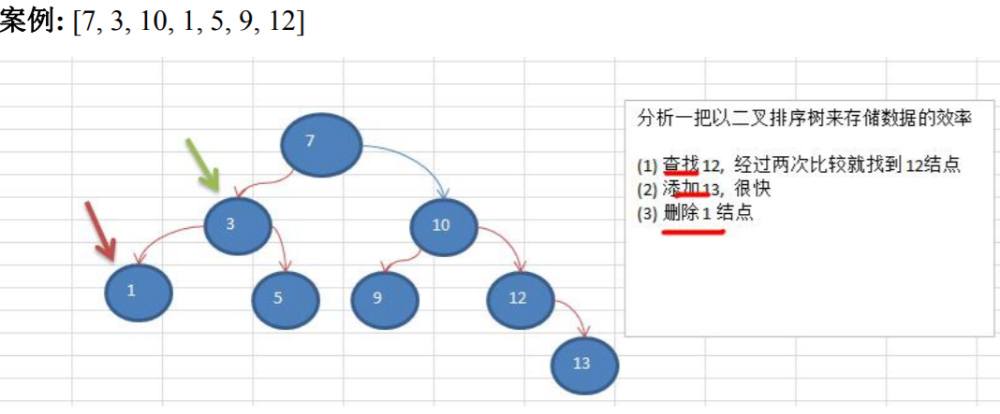
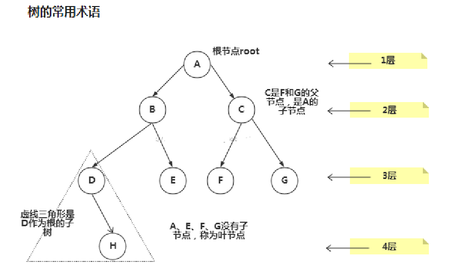
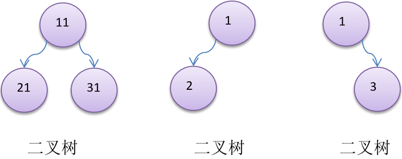
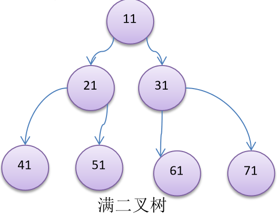
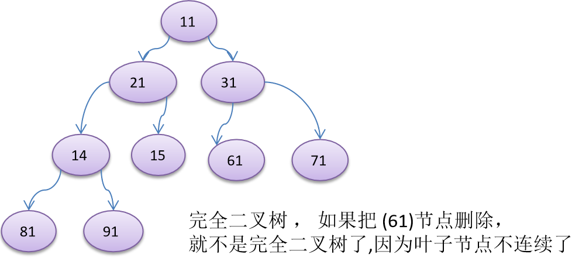
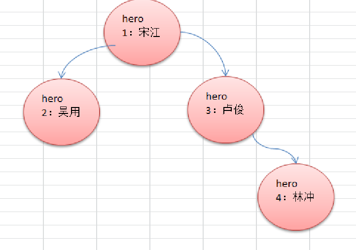
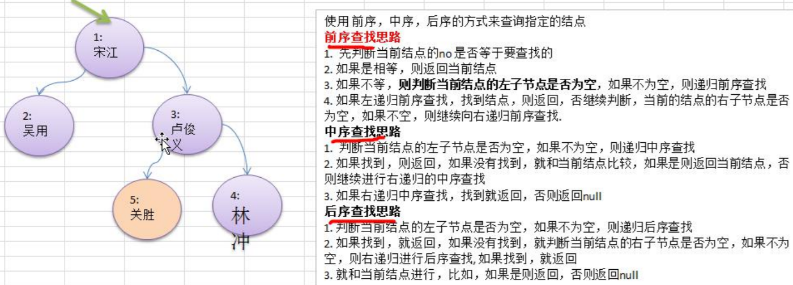
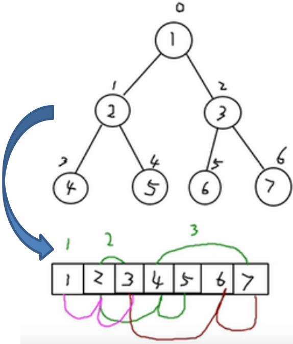

[TOC]

# 基础部分

## 二叉树

### 为什么需要树这种数据结构？

#### 数组存储方式分析

**优点：**通过**下标方式访问元素**，速度快。对于有序数组，还可以使用**二分查找**提高检索速度。

**缺点：**若要检索具体某个值，或者**插入值(按一定顺序)会整体移动**，效率低。

**操作示意图：**


#### 链式存储方式分析

**优点：**在一定程度上对数组存储方式有优化(如：**插入**一个数值节点，只需要将插入节点，链接到链表中即可，**删除**效率也很好)。

**缺点：**在进行**检索时**，效率仍然较低。(如：检索某个值，需要从头节点开始遍历)

**操作示意图：**


#### 树存储方式分析

能提高数据**存储、读取**的效率。(如：利用**二叉排序树**(Binary Sort Tree)，既可以保证数据的检索速度，同时也可以保证数据的**插入、删除、修改**的速度。)



### 树示意图



**常用术语**

> 1. 节点
> 2. 根节点
> 3. 父节点
> 4. 子节点
> 5. 叶子节点（没有子节点的节点）
> 6. 节点的权（节点值）
> 7. 路径（从root节点找到该节点的路线）
> 8. 层
> 9. 子树
> 10. 树的高层（最大层数）
> 11. 森林：多颗子树构成森林

### 二叉树的概念

1. 树有很多种，每个节点**最多只能有两个子节点**的一种形式称为**二叉树**。

2. 二叉树的子节点分为**左节点**和**右节点**。

3. 示意图：

   

4. 若该二叉树的所有**叶子节点**都在**最后一层**，并且结点总数=$2^{n-1}$，n为层数，称为**满二叉树**。

5. 若该二叉树的所有**叶子节点**都在**最后一层**或者**倒数第二层**，而且最后一层的叶子节点在左边连续，倒数第二层的叶子节点在右边连续，称为**完全二叉树**。

### 二叉树遍历

#### 前序遍历：先输出父节点，再遍历左子树和右子树



1. 先输出当前节点（初始为root节点）
2. 若子节点不为空，则递归继续前序遍历
3. 若右子节点不为空，则递归继续前序遍历

```java
public void preOrder(){
    System.out.println(this);
    if(this.leftNode != null){
        this.leftNode.preOrder();
    }
    if(this.rightNode != null){
        this.rightNode.preOrder();
    }
}
```

#### 中序遍历：先遍历左子树，再输出父节点，再遍历右子树

1. 如果当前节点的左子节点不为空，则递归中序遍历
2. 输出当前节点
3. 若当前节点的右子节点不为空，则递归中序遍历

```java
public void infixOrder(){
    if(this.leftNode != null){
        this.leftNode.infixOrder();
    }
    System.out.println(this);
    if(this.rightNode != null){
        this.rightNode.infixOrder();
    }
}
```

#### 后序遍历：先遍历左子树，再遍历右子树，最后输出父节点

1. 若当前节点的左节点不为空，则递归后序遍历
2. 若当前节点的右节点不为空，则递归后序遍历
3. 输出当前节点

```java
public void postOrder(){
    if(this.leftNode != null){
        this.leftNode.postOrder();
    }
    if(this.rightNode != null){
        this.rightNode.postOrder();
    }
    System.out.println(this);
}
```

#### 总结：输出父节点的顺序，可以确定是前序、中序、后序

##### 二叉树遍历应用实例

```java
public class BinaryTreeDemo{
    public static void main(String[] args){
        //创建二叉树
        BinaryTree binaryTree = new BinaryTree();
        //创建需要的节点
        HeroNode root = new HeroNode(1, "宋江");
        HeroNode node2 = new HeroNode(2, "吴用");
        HeroNode node3 = new HeroNode(3, "卢俊义");
        HeroNode node4 = new HeroNode(4, "林冲");
        HeroNode node5 = new HeroNode(5, "关胜");
        //设置节点信息
        root.setLeft(node2);
        root.setRight(node3);
        node3.setRight(node4);
        node3.setLeft(node5);
        binaryTree.setRoot(root);
        //前序遍历
        binaryTree.preOrder();
        //中序遍历
        binaryTree.infixOrder();
        //后序遍历
        binaryTree.postOrder();
    }
}

//二叉树
class BinaryTree{
    private HeroNode root;
    public void setRoot(HeroNode root){
        this.root = root;
    }
    //前序遍历
	public void preOrder() {
		if(this.root != null) {
			this.root.preOrder();
		}else {
			System.out.println("二叉树为空，无法遍历");
		}
	}
	
	//中序遍历
	public void infixOrder() {
		if(this.root != null) {
			this.root.infixOrder();
		}else {
			System.out.println("二叉树为空，无法遍历");
		}
	}
	//后序遍历
	public void postOrder() {
		if(this.root != null) {
			this.root.postOrder();
		}else {
			System.out.println("二叉树为空，无法遍历");
		}
	}
}

//节点类
class HeroNode{
    private int no;
	private String name;
	private HeroNode left; //默认null
	private HeroNode right; //默认null
	public HeroNode(int no, String name) {
		this.no = no;
		this.name = name;
	}
	public int getNo() {
		return no;
	}
	public void setNo(int no) {
		this.no = no;
	}
	public String getName() {
		return name;
	}
	public void setName(String name) {
		this.name = name;
	}
	public HeroNode getLeft() {
		return left;
	}
	public void setLeft(HeroNode left) {
		this.left = left;
	}
	public HeroNode getRight() {
		return right;
	}
	public void setRight(HeroNode right) {
		this.right = right;
	}
	@Override
	public String toString() {
		return "HeroNode [no=" + no + ", name=" + name + "]";
	}
    
    //前序遍历
	public void preOrder() {
		System.out.println(this); //先输出父结点
		//递归向左子树前序遍历
		if(this.left != null) {
			this.left.preOrder();
		}
		//递归向右子树前序遍历
		if(this.right != null) {
			this.right.preOrder();
		}
	}
	//中序遍历
	public void infixOrder() {
		//递归向左子树中序遍历
		if(this.left != null) {
			this.left.infixOrder();
		}
		//输出父结点
		System.out.println(this);
		//递归向右子树中序遍历
		if(this.right != null) {
			this.right.infixOrder();
		}
	}
	//后序遍历
	public void postOrder() {
		if(this.left != null) {
			this.left.postOrder();
		}
		if(this.right != null) {
			this.right.postOrder();
		}
		System.out.println(this);
	}
}
```

### 查找指定节点



```java
//节点类中的方法
/**
* 前序遍历查找
* @param no 查找no
* @return 如果找到就返回该Node ,如果没有找到返回 null
*/
public HeroNode preOrderSearch(int no) {
    System.out.println("进入前序遍历");
    //比较当前结点是不是
    if(this.no == no) {
        return this;
    }
    //1.则判断当前结点的左子节点是否为空，如果不为空，则递归前序查找
    //2.如果左递归前序查找，找到结点，则返回
    HeroNode resNode = null;
    if(this.left != null) {
        resNode = this.left.preOrderSearch(no);
    }
    if(resNode != null) {//说明我们左子树找到
        return resNode;
    }
    //1.左递归前序查找，找到结点，则返回，否继续判断，
    //2.当前的结点的右子节点是否为空，如果不空，则继续向右递归前序查找
    if(this.right != null) {
        resNode = this.right.preOrderSearch(no);
    }
    return resNode;
}

//中序遍历查找
public HeroNode infixOrderSearch(int no) {
    //判断当前结点的左子节点是否为空，如果不为空，则递归中序查找
    HeroNode resNode = null;
    if(this.left != null) {
        resNode = this.left.infixOrderSearch(no);
    }
    if(resNode != null) {
        return resNode;
    }
    System.out.println("进入中序查找");
    //如果找到，则返回，如果没有找到，就和当前结点比较，如果是则返回当前结点
    if(this.no == no) {
        return this;
    }
    //否则继续进行右递归的中序查找
    if(this.right != null) {
        resNode = this.right.infixOrderSearch(no);
    }
    return resNode;
}

//后序遍历查找
public HeroNode postOrderSearch(int no) {

    //判断当前结点的左子节点是否为空，如果不为空，则递归后序查找
    HeroNode resNode = null;
    if(this.left != null) {
        resNode = this.left.postOrderSearch(no);
    }
    if(resNode != null) {//说明在左子树找到
        return resNode;
    }

    //如果左子树没有找到，则向右子树递归进行后序遍历查找
    if(this.right != null) {
        resNode = this.right.postOrderSearch(no);
    }
    if(resNode != null) {
        return resNode;
    }
    System.out.println("进入后序查找");
    //如果左右子树都没有找到，就比较当前结点是不是
    if(this.no == no) {
        return this;
    }
    return resNode;
}
```

### 删除节点

**要求：**

1. 若是叶子节点，则删除节点
2. 若是非叶子节点，则删除该子树

**思路：**

若树是空树，只有一个root节点，则等价于将二叉树置空。

1. 二叉树是单向的，因而判断的是当前节点的子节点是否需要删除节点，而不能去判断当前这个节点是不是需要删除节点。
2. 若当前节点的左子节点不为空，并且左子节点就是要删除的节点，就将this.left = null；并且返回(结束递归删除)。
3. 若当前节点的右子节点不为空，并且右子节点就是要删除的节点，将this.right=null；并且返回(结束递归删除)。
4. 若第2步和第3部没有删除节点，那么就需要向左子树进行递归删除。
5. 若第4步也没有删除节点，则应当向右子树进行递归删除。

**代码：**

节点类增加方法

```java
//递归删除结点
//1.如果删除的节点是叶子节点，则删除该节点
//2.如果删除的节点是非叶子节点，则删除该子树
public void delNode(int no) {

    //思路
    /*
	 * 	1. 因为我们的二叉树是单向的，所以我们是判断当前结点的子结点是否需要删除结点，而不能去判断当前这个结点是不是需要删除结点.
		2. 如果当前结点的左子结点不为空，并且左子结点 就是要删除结点，就将this.left = null; 并且就返回(结束递归删除)
		3. 如果当前结点的右子结点不为空，并且右子结点 就是要删除结点，就将this.right= null ;并且就返回(结束递归删除)
		4. 如果第2和第3步没有删除结点，那么我们就需要向左子树进行递归删除
		5.  如果第4步也没有删除结点，则应当向右子树进行递归删除.
	*/
    //2. 如果当前结点的左子结点不为空，并且左子结点 就是要删除结点，就将this.left = null; 并且就返回(结束递归删除)
    if(this.left != null && this.left.no == no) {
        this.left = null;
        return;
    }
    //3.如果当前结点的右子结点不为空，并且右子结点 就是要删除结点，就将this.right= null ;并且就返回(结束递归删除)
    if(this.right != null && this.right.no == no) {
        this.right = null;
        return;
    }
    //4.我们就需要向左子树进行递归删除
    if(this.left != null) {
        this.left.delNode(no);
    }
    //5.则应当向右子树进行递归删除
    if(this.right != null) {
        this.right.delNode(no);
    }
}
```

## 顺序存储二叉树

### 概念

#### 基本说明

从数据存储来看，数组存储方式和树的存储方式可以相互转换，即**数组可以转换成树，树也可以转换成数组**。



#### 特点

1. 顺序二叉树通常只考虑完全二叉树
2. 第n个元素的左子节点为 2 * n + 1
3. 第n个元素的右子节点为 2 * n + 2
4. 第n个元素的父节点为 (n - 1) / 2
5. n：表示二叉树中的第几个元素(按0开始编号)

### 顺序存储二叉树遍历

```java
public class ArrBinaryTreeDemo {

	public static void main(String[] args) {
		int[] arr = { 1, 2, 3, 4, 5, 6, 7 };
		//创建一个 ArrBinaryTree
		ArrBinaryTree arrBinaryTree = new ArrBinaryTree(arr);
		arrBinaryTree.preOrder(); // 1,2,4,5,3,6,7
	}

}

//顺序存储二叉树遍历
class ArrBinaryTree {
	private int[] arr;//存储数据结点的数组

	public ArrBinaryTree(int[] arr) {
		this.arr = arr;
	}
	
	//重载preOrder
	public void preOrder() {
		this.preOrder(0);
	}
	
	/**
	 * 顺序存储二叉树的前序遍历
	 * @param index 数组的下标 
	 */
	public void preOrder(int index) {
		//如果数组为空，或者 arr.length = 0
		if(arr == null || arr.length == 0) {
			System.out.println("数组为空，不能按照二叉树的前序遍历");
		}
		//输出当前这个元素
		System.out.println(arr[index]); 
		//向左递归遍历
		if((index * 2 + 1) < arr.length) {
			preOrder(2 * index + 1 );
		}
		//向右递归遍历
		if((index * 2 + 2) < arr.length) {
			preOrder(2 * index + 2);
		}
	}
	
}
```

