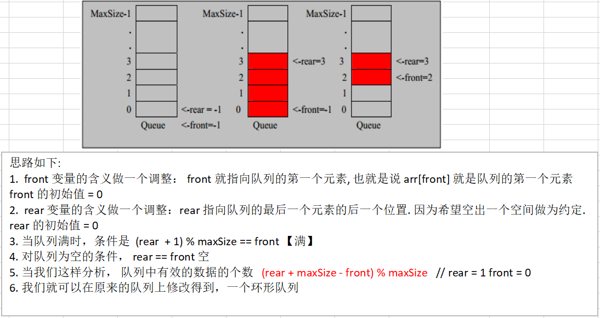

# 队列

## 介绍

1. 队列是一个**有序列表**，可以用**数组**或是**链表**来实现。

2. 遵循**先入先出**的原则。即：**先存入队列的数据，要先取出。后存入的要后取出。**

3. 示意图：（数组模拟队列）

   

## 数组模拟队列

### 思路


- 队列本身是有序列表，若使用数组的结构来存储队列的数据，则队列数组的声明如图中所示，其中maxSize是队列的最大容量。
- 队列的输出、输入是分别从前后端来处理，需要两个变量front及rear分别记录队列前后端的下标，front会随着数据输出而改变，而rear则是随着数据输入而改变。
  - rear是队列最后(包含最后一个元素)
  - front是队列最前元素（不含元素,队列头前一个位置)
- 将数据存入队列时称为“addQueue”，addQueue的处理需要有两个步骤：
  1. 将尾指针往后移：rear + 1，当front == rear 【空】
  2. 若尾指针rear小于队列的最大下标maxSize - 1，则将数据存入rear所指的数组元素中，否则无法存入数据。rear == maxSize - 1 【队列满】

### 代码实现

```java
public class ArrayQueueDemo {

	public static void main(String[] args) {
		//测试一把
		//创建一个队列
		ArrayQueue queue = new ArrayQueue(3);
		char key = ' '; //接收用户输入
		Scanner scanner = new Scanner(System.in);//
		boolean loop = true;
		//输出一个菜单
		while(loop) {
			System.out.println("s(show): 显示队列");
			System.out.println("e(exit): 退出程序");
			System.out.println("a(add): 添加数据到队列");
			System.out.println("g(get): 从队列取出数据");
			System.out.println("h(head): 查看队列头的数据");
			key = scanner.next().charAt(0);//接收一个字符
			switch (key) {
			case 's':
				queue.showQueue();
				break;
			case 'a':
				System.out.println("输出一个数");
				int value = scanner.nextInt();
				queue.addQueue(value);
				break;
			case 'g': //取出数据
				try {
					int res = queue.getQueue();
					System.out.printf("取出的数据是%d\n", res);
				} catch (Exception e) {
					System.out.println(e.getMessage());
				}
				break;
			case 'h': //查看队列头的数据
				try {
					int res = queue.headQueue();
					System.out.printf("队列头的数据是%d\n", res);
				} catch (Exception e) {
					System.out.println(e.getMessage());
				}
				break;
			case 'e': //退出
				scanner.close();
				loop = false;
				break;
			default:
				break;
			}
		}
		
		System.out.println("程序退出~~");
	}

}

// 使用数组模拟队列-编写一个ArrayQueue类
class ArrayQueue {
	private int maxSize; // 表示数组的最大容量
	private int front; // 队列头
	private int rear; // 队列尾
	private int[] arr; // 该数据用于存放数据, 模拟队列

	// 创建队列的构造器
	public ArrayQueue(int arrMaxSize) {
		maxSize = arrMaxSize;
		arr = new int[maxSize];
		front = -1; // 指向队列头部，分析出front是指向队列头的前一个位置.
		rear = -1; // 指向队列尾，指向队列尾的数据(即就是队列最后一个数据)
	}

	// 判断队列是否满
	public boolean isFull() {
		return rear == maxSize - 1;
	}

	// 判断队列是否为空
	public boolean isEmpty() {
		return rear == front;
	}

	// 添加数据到队列
	public void addQueue(int n) {
		// 判断队列是否满
		if (isFull()) {
			System.out.println("队列满，不能加入数据~");
			return;
		}
		rear++; // 让rear 后移
		arr[rear] = n;
	}

	// 获取队列的数据, 出队列
	public int getQueue() {
		// 判断队列是否空
		if (isEmpty()) {
			// 通过抛出异常
			throw new RuntimeException("队列空，不能取数据");
		}
		front++; // front后移
		return arr[front];

	}

	// 显示队列的所有数据
	public void showQueue() {
		// 遍历
		if (isEmpty()) {
			System.out.println("队列空的，没有数据~~");
			return;
		}
		for (int i = 0; i < arr.length; i++) {
			System.out.printf("arr[%d]=%d\n", i, arr[i]);
		}
	}

	// 显示队列的头数据， 注意不是取出数据
	public int headQueue() {
		// 判断
		if (isEmpty()) {
			throw new RuntimeException("队列空的，没有数据~~");
		}
		return arr[front + 1];
	}
}
```

#### 问题分析并优化

1. 目前数组使用一次就不能用，没有达到复用的效果。
2. 将这个数组使用算法，改进成一个**环形的队列（取模 ： %）**

## 数组模拟环形队列

对数组模拟队列的优化，充分利用数组，将数组看做是一个环形的。（通过取模的方式来实现）

### 分析说明

1. 尾索引的下一个头索引时表示队列满，即将队列容量空出一个作为约定，注意：**（rear + 1）% maxSize == front** 时队列满。

2. rear == front 【队列空】

3. 分析示意图

   

### 代码实现

```java
public class CircleArrayQueueDemo {

	public static void main(String[] args) {
		
		//测试一把
		System.out.println("测试数组模拟环形队列的案例~~~");
		
		// 创建一个环形队列
		CircleArray queue = new CircleArray(4); //说明设置4, 其队列的有效数据最大是3
		char key = ' '; // 接收用户输入
		Scanner scanner = new Scanner(System.in);//
		boolean loop = true;
		// 输出一个菜单
		while (loop) {
			System.out.println("s(show): 显示队列");
			System.out.println("e(exit): 退出程序");
			System.out.println("a(add): 添加数据到队列");
			System.out.println("g(get): 从队列取出数据");
			System.out.println("h(head): 查看队列头的数据");
			key = scanner.next().charAt(0);// 接收一个字符
			switch (key) {
			case 's':
				queue.showQueue();
				break;
			case 'a':
				System.out.println("输出一个数");
				int value = scanner.nextInt();
				queue.addQueue(value);
				break;
			case 'g': // 取出数据
				try {
					int res = queue.getQueue();
					System.out.printf("取出的数据是%d\n", res);
				} catch (Exception e) {
					System.out.println(e.getMessage());
				}
				break;
			case 'h': // 查看队列头的数据
				try {
					int res = queue.headQueue();
					System.out.printf("队列头的数据是%d\n", res);
				} catch (Exception e) {
					System.out.println(e.getMessage());
				}
				break;
			case 'e': // 退出
				scanner.close();
				loop = false;
				break;
			default:
				break;
			}
		}
		System.out.println("程序退出~~");
	}

}


class CircleArray {
	private int maxSize; // 表示数组的最大容量
	//front 变量的含义做一个调整： front 就指向队列的第一个元素, 也就是说 arr[front] 就是队列的第一个元素 
	//front 的初始值 = 0
	private int front; 
	//rear 变量的含义做一个调整：rear 指向队列的最后一个元素的后一个位置. 因为希望空出一个空间做为约定.
	//rear 的初始值 = 0
	private int rear; // 队列尾
	private int[] arr; // 该数据用于存放数据, 模拟队列
	
	public CircleArray(int arrMaxSize) {
		maxSize = arrMaxSize;
		arr = new int[maxSize];
	}
	
	// 判断队列是否满
	public boolean isFull() {
		return (rear  + 1) % maxSize == front;
	}
	
	// 判断队列是否为空
	public boolean isEmpty() {
		return rear == front;
	}
	
	// 添加数据到队列
	public void addQueue(int n) {
		// 判断队列是否满
		if (isFull()) {
			System.out.println("队列满，不能加入数据~");
			return;
		}
		//直接将数据加入
		arr[rear] = n;
		//将 rear 后移, 这里必须考虑取模
		rear = (rear + 1) % maxSize;
	}
	
	// 获取队列的数据, 出队列
	public int getQueue() {
		// 判断队列是否空
		if (isEmpty()) {
			// 通过抛出异常
			throw new RuntimeException("队列空，不能取数据");
		}
		// 这里需要分析出 front是指向队列的第一个元素
		// 1. 先把 front 对应的值保留到一个临时变量
		// 2. 将 front 后移, 考虑取模
		// 3. 将临时保存的变量返回
		int value = arr[front];
		front = (front + 1) % maxSize;
		return value;

	}
	
	// 显示队列的所有数据
	public void showQueue() {
		// 遍历
		if (isEmpty()) {
			System.out.println("队列空的，没有数据~~");
			return;
		}
		// 思路：从front开始遍历，遍历多少个元素
		// 动脑筋
		for (int i = front; i < front + size() ; i++) {
			System.out.printf("arr[%d]=%d\n", i % maxSize, arr[i % maxSize]);
		}
	}
	
	// 求出当前队列有效数据的个数
	public int size() {
		// rear = 2
		// front = 1
		// maxSize = 3 
		return (rear + maxSize - front) % maxSize;   
	}
	
	// 显示队列的头数据， 注意不是取出数据
	public int headQueue() {
		// 判断
		if (isEmpty()) {
			throw new RuntimeException("队列空的，没有数据~~");
		}
		return arr[front];
	}
}
```

