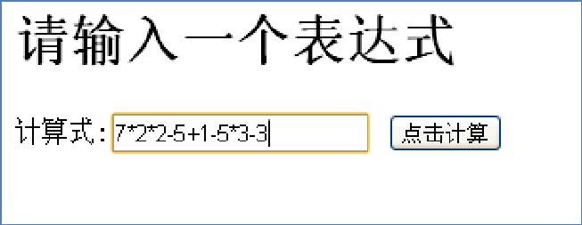
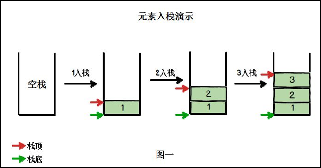
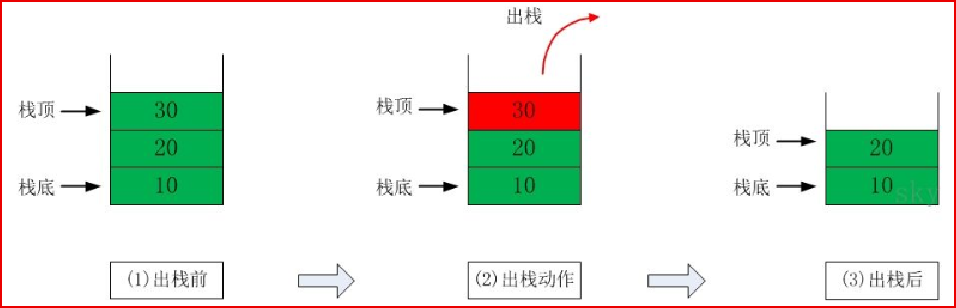
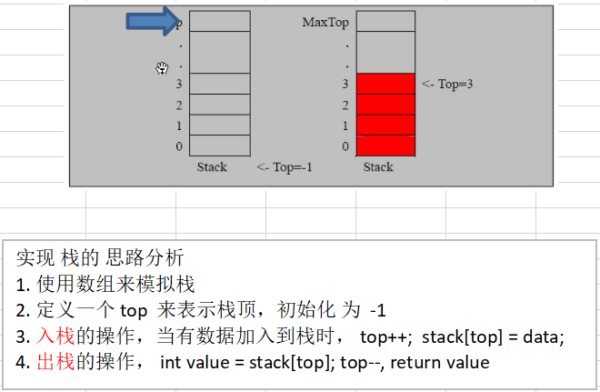
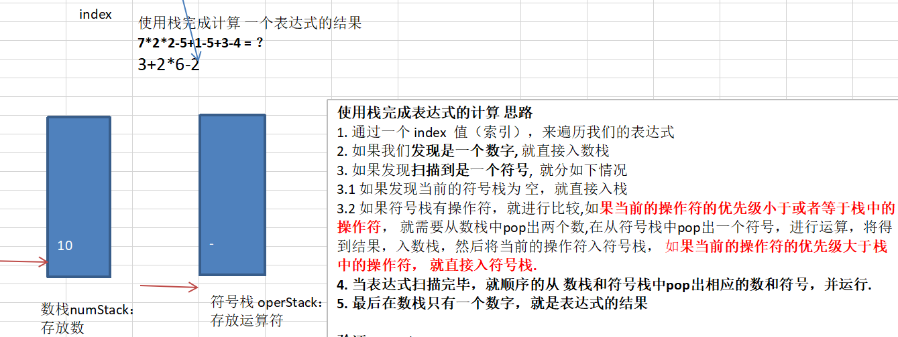

# 栈

## 需求引入



计算机怎么理解这个算式？

## 介绍

1. **栈（stack）**

2. 栈是一个**先入后出**（FILO-First In Last Out）的有序列表。

3. 栈是限制线性表中元素的插入和删除只能在线性表的同一端进行的一种特殊线性表。允许插入和删除的一端，为**变化的一端，称为栈顶（Top）**，另一端为**固定的一端，称为栈底（Bottom）**。

4. 根据栈的定义可知，最先放入栈中的元素在栈底，最后放入的元素在栈顶，而删除元素刚好相反，最后放入的元素最先删除，最先放入的元素最后删除。

5. 图解出栈（pop）和入栈（push）

   

   

### 应用场景

1. 子程序的调用：在跳往子程序前，会先将下个指令的地址存到堆栈中，直到子程序执行完后再将地址取出，以回到原来的程序中。
2. 处理递归调用：和子程序的调用类似，只是除了存储下一个指令的地址外，也将参数、区域变量等数据存入堆栈中。
3. 表达式的转换[中缀表达式转后缀表达式]与求值（实际解决）。
4. 二叉树的遍历。
5. 图形的深度优先（depth → first）搜索法。

### 快速入门

#### 说明

由于栈是一种有序列表，可以使用数组来模拟栈的使用（存储栈的数据内容，模拟入栈、出栈操作）

#### 思路分析



##### 代码实现

```java
public class ArrayStackDemo {

	public static void main(String[] args) {
		//测试一下ArrayStack 是否正确
		//先创建一个ArrayStack对象->表示栈
		ArrayStack stack = new ArrayStack(4);
		String key = "";
		boolean loop = true; //控制是否退出菜单
		Scanner scanner = new Scanner(System.in);
		
		while(loop) {
			System.out.println("show: 表示显示栈");
			System.out.println("exit: 退出程序");
			System.out.println("push: 表示添加数据到栈(入栈)");
			System.out.println("pop: 表示从栈取出数据(出栈)");
			System.out.println("请输入你的选择");
			key = scanner.next();
			switch (key) {
			case "show":
				stack.list();
				break;
			case "push":
				System.out.println("请输入一个数");
				int value = scanner.nextInt();
				stack.push(value);
				break;
			case "pop":
				try {
					int res = stack.pop();
					System.out.printf("出栈的数据是 %d\n", res);
				} catch (Exception e) {
					// TODO: handle exception
					System.out.println(e.getMessage());
				}
				break;
			case "exit":
				scanner.close();
				loop = false;
				break;
			default:
				break;
			}
		}
		
		System.out.println("程序退出~~~");
	}

}

//定义一个 ArrayStack 表示栈
class ArrayStack {
	private int maxSize; // 栈的大小
	private int[] stack; // 数组，数组模拟栈，数据就放在该数组
	private int top = -1;// top表示栈顶，初始化为-1
	
	//构造器
	public ArrayStack(int maxSize) {
		this.maxSize = maxSize;
		stack = new int[this.maxSize];
	}
	
	//栈满
	public boolean isFull() {
		return top == maxSize - 1;
	}
	//栈空
	public boolean isEmpty() {
		return top == -1;
	}
	//入栈-push
	public void push(int value) {
		//先判断栈是否满
		if(isFull()) {
			System.out.println("栈满");
			return;
		}
		top++;
		stack[top] = value;
	}
	//出栈-pop, 将栈顶的数据返回
	public int pop() {
		//先判断栈是否空
		if(isEmpty()) {
			//抛出异常
			throw new RuntimeException("栈空，没有数据~");
		}
		int value = stack[top];
		top--;
		return value;
	}
	//显示栈的情况[遍历栈]， 遍历时，需要从栈顶开始显示数据
	public void list() {
		if(isEmpty()) {
			System.out.println("栈空，没有数据~~");
			return;
		}
		//需要从栈顶开始显示数据
		for(int i = top; i >= 0 ; i--) {
			System.out.printf("stack[%d]=%d\n", i, stack[i]);
		}
	}
	
}
```

### 栈实现综合计算器（中缀表达式）

#### 思路分析



#### 实现代码

```java
public class Calculator {

	public static void main(String[] args) {
		//根据前面老师思路，完成表达式的运算
		String expression = "7*2*2-5+1-5+3-4"; // 15//如何处理多位数的问题？
		//创建两个栈，数栈，一个符号栈
		ArrayStack2 numStack = new ArrayStack2(10);
		ArrayStack2 operStack = new ArrayStack2(10);
		//定义需要的相关变量
		int index = 0;//用于扫描
		int num1 = 0; 
		int num2 = 0;
		int oper = 0;
		int res = 0;
		char ch = ' '; //将每次扫描得到char保存到ch
		String keepNum = ""; //用于拼接 多位数
		//开始while循环的扫描expression
		while(true) {
			//依次得到expression 的每一个字符
			ch = expression.substring(index, index+1).charAt(0);
			//判断ch是什么，然后做相应的处理
			if(operStack.isOper(ch)) {//如果是运算符
				//判断当前的符号栈是否为空
				if(!operStack.isEmpty()) {
					//如果符号栈有操作符，就进行比较,如果当前的操作符的优先级小于或者等于栈中的操作符,就需要从数栈中pop出两个数,
					//在从符号栈中pop出一个符号，进行运算，将得到结果，入数栈，然后将当前的操作符入符号栈
					if(operStack.priority(ch) <= operStack.priority(operStack.peek())) {
						num1 = numStack.pop();
						num2 = numStack.pop();
						oper = operStack.pop();
						res = numStack.cal(num1, num2, oper);
						//把运算的结果如数栈
						numStack.push(res);
						//然后将当前的操作符入符号栈
						operStack.push(ch);
					} else {
						//如果当前的操作符的优先级大于栈中的操作符， 就直接入符号栈.
						operStack.push(ch);
					}
				}else {
					//如果为空直接入符号栈..
					operStack.push(ch); // 1 + 3
				}
			} else { //如果是数，则直接入数栈
				
				//numStack.push(ch - 48); //? "1+3" '1' => 1
				//分析思路
				//1. 当处理多位数时，不能发现是一个数就立即入栈，因为他可能是多位数
				//2. 在处理数，需要向expression的表达式的index 后再看一位,如果是数就进行扫描，如果是符号才入栈
				//3. 因此我们需要定义一个变量 字符串，用于拼接
				
				//处理多位数
				keepNum += ch;
				
				//如果ch已经是expression的最后一位，就直接入栈
				if (index == expression.length() - 1) {
					numStack.push(Integer.parseInt(keepNum));
				}else{
				
					//判断下一个字符是不是数字，如果是数字，就继续扫描，如果是运算符，则入栈
					//注意是看后一位，不是index++
					if (operStack.isOper(expression.substring(index+1,index+2).charAt(0))) {
						//如果后一位是运算符，则入栈 keepNum = "1" 或者 "123"
						numStack.push(Integer.parseInt(keepNum));
						//重要的!!!!!!, keepNum清空
						keepNum = "";
						
					}
				}
			}
			//让index + 1, 并判断是否扫描到expression最后.
			index++;
			if (index >= expression.length()) {
				break;
			}
		}
		
		//当表达式扫描完毕，就顺序的从 数栈和符号栈中pop出相应的数和符号，并运行.
		while(true) {
			//如果符号栈为空，则计算到最后的结果, 数栈中只有一个数字【结果】
			if(operStack.isEmpty()) {
				break;
			}
			num1 = numStack.pop();
			num2 = numStack.pop();
			oper = operStack.pop();
			res = numStack.cal(num1, num2, oper);
			numStack.push(res);//入栈
		}
		//将数栈的最后数，pop出，就是结果
		int res2 = numStack.pop();
		System.out.printf("表达式 %s = %d", expression, res2);
	}

}

//先创建一个栈,直接使用前面创建好
//定义一个 ArrayStack2 表示栈, 需要扩展功能
class ArrayStack2 {
	private int maxSize; // 栈的大小
	private int[] stack; // 数组，数组模拟栈，数据就放在该数组
	private int top = -1;// top表示栈顶，初始化为-1
	
	//构造器
	public ArrayStack2(int maxSize) {
		this.maxSize = maxSize;
		stack = new int[this.maxSize];
	}
	
	//增加一个方法，可以返回当前栈顶的值, 但是不是真正的pop
	public int peek() {
		return stack[top];
	}
	
	//栈满
	public boolean isFull() {
		return top == maxSize - 1;
	}
	//栈空
	public boolean isEmpty() {
		return top == -1;
	}
	//入栈-push
	public void push(int value) {
		//先判断栈是否满
		if(isFull()) {
			System.out.println("栈满");
			return;
		}
		top++;
		stack[top] = value;
	}
	//出栈-pop, 将栈顶的数据返回
	public int pop() {
		//先判断栈是否空
		if(isEmpty()) {
			//抛出异常
			throw new RuntimeException("栈空，没有数据~");
		}
		int value = stack[top];
		top--;
		return value;
	}
	//显示栈的情况[遍历栈]， 遍历时，需要从栈顶开始显示数据
	public void list() {
		if(isEmpty()) {
			System.out.println("栈空，没有数据~~");
			return;
		}
		//需要从栈顶开始显示数据
		for(int i = top; i >= 0 ; i--) {
			System.out.printf("stack[%d]=%d\n", i, stack[i]);
		}
	}
	//返回运算符的优先级，优先级是程序员来确定, 优先级使用数字表示
	//数字越大，则优先级就越高.
	public int priority(int oper) {
		if(oper == '*' || oper == '/'){
			return 1;
		} else if (oper == '+' || oper == '-') {
			return 0;
		} else {
			return -1; // 假定目前的表达式只有 +, - , * , /
		}
	}
	//判断是不是一个运算符
	public boolean isOper(char val) {
		return val == '+' || val == '-' || val == '*' || val == '/';
	}
	//计算方法
	public int cal(int num1, int num2, int oper) {
		int res = 0; // res 用于存放计算的结果
		switch (oper) {
		case '+':
			res = num1 + num2;
			break;
		case '-':
			res = num2 - num1;// 注意顺序
			break;
		case '*':
			res = num1 * num2;
			break;
		case '/':
			res = num2 / num1;
			break;
		default:
			break;
		}
		return res;
	}
	
}
```

## 前缀、中缀、后缀表达式

### 前缀表达式

1. 前缀表达式又称波兰式，**前缀表达式的运算符位于操作数之前。**
2. **举例说明：**（3+4）* 5-6 对应的前缀表达式是：- * + 3 4 5 6

#### 前缀表达式的计算机求值

从右至左扫描，遇到数字时，将数字压入堆栈，遇到运算符时，弹出栈顶的两个数，用运算符对它们做相应的计算（栈顶元素和次顶元素），并将结果入栈；重复上述过程直到表达式最左端，最后运算得出的值即为表达式的结果。

##### 举例

（3+4）× 5 - 6 对应的前缀表达式就是 - × + 3 4 5 6，针对前缀表达式求值步骤如下：

1. **从右至左扫描**，将6、5、4、3压入堆栈。
2. 遇到 + 运算符，弹出3和4（3为栈顶元素，4为次顶元素），计算出3+4的值，得7再将7入栈。
3. 接下来是×运算符，弹出7和5，计算出$7 × 5 = 35$，将35入栈。
4. 最后是-运算符，计算出35-6的值，即29，由此得出最终结果。

### 中缀表达式

1. 中缀表达式就是**常见的运算表达式**，如（3+4）× 5 - 6
2. 中缀表达式的求值是人最熟悉的，但对计算机来说却不好操作，因此，在计算结果时，往往会将中缀表达式转成其它表达式来操作（一般转成后缀表达式）。

### 后缀表达式

1. 后缀表达式又称**逆波兰表达式**与前缀表达式相似，只是运算符位于操作数之后。

2. 说明：（3+4）×5-6对应的后最表达式是3 4 + 5 × 6 -

3. 再比如

   | 正常的表达式 | 逆波兰表达式  |
   | ------------ | ------------- |
   | a+b          | a b +         |
   | a+(b-c)      | a b c - +     |
   | a+(b-c)*d    | a b c – d * + |
   | a+d*(b-c)    | a d b c - * + |
   | a=1+3        | a 1 3 + =     |

#### 后缀表达式的计算机求值

**从左至右**扫描表达式，遇到数字时，将数字压入堆栈，遇到运算符时，弹出栈顶的两个数，用运算符对它们做相应的计算（次顶元素和栈顶元素），并将结果入栈；重复上述过程直到表达式最右端，最后运算得出的值即为表达式的结果。

##### 举例

（3+4）×5-6对应的后缀表达式就是3 4 + 5 × 6 - ，针对后缀表达式求值步骤如下：

1. 从左至右扫描，将3和4压入堆栈。
2. 遇到+运算符，弹出3和4（4为栈顶元素，3为次顶元素），计算出3+4的值，得7，再将7入栈；
3. 将5入栈；
4. 接下来是×运算符，弹出5和7，计算出7×5=35，将35入栈；
5. 将6入栈；
6. 最后是-运算符，计算出35-6的值，即29，由此得出最终结果。

#### 逆波兰计算器

```java
public class PolandNotation {

	public static void main(String[] args) {
        //先定义给逆波兰表达式
		//(30+4)×5-6  => 30 4 + 5 × 6 - => 164
		// 4 * 5 - 8 + 60 + 8 / 2 => 4 5 * 8 - 60 + 8 2 / + 
		//测试 
		//说明为了方便，逆波兰表达式 的数字和符号使用空格隔开
		//String suffixExpression = "30 4 + 5 * 6 -";
		String suffixExpression = "4 5 * 8 - 60 + 8 2 / +"; // 76
		//思路
		//1. 先将 "3 4 + 5 × 6 - " => 放到ArrayList中
		//2. 将 ArrayList 传递给一个方法，遍历 ArrayList 配合栈 完成计算
		
		List<String> list = getListString(suffixExpression);
		System.out.println("rpnList=" + list);
		int res = calculate(list);
		System.out.println("计算的结果是=" + res);
    }
    
    //将一个逆波兰表达式， 依次将数据和运算符 放入到 ArrayList中
	public static List<String> getListString(String suffixExpression) {
		//将 suffixExpression 分割
		String[] split = suffixExpression.split(" ");
		List<String> list = new ArrayList<String>();
		for(String ele: split) {
			list.add(ele);
		}
		return list;
		
	}
    
    public static int calculate(List<String> ls) {
		// 创建给栈, 只需要一个栈即可
		Stack<String> stack = new Stack<String>();
		// 遍历 ls
		for (String item : ls) {
			// 这里使用正则表达式来取出数
			if (item.matches("\\d+")) { // 匹配的是多位数
				// 入栈
				stack.push(item);
			} else {
				// pop出两个数，并运算， 再入栈
				int num2 = Integer.parseInt(stack.pop());
				int num1 = Integer.parseInt(stack.pop());
				int res = 0;
				if (item.equals("+")) {
					res = num1 + num2;
				} else if (item.equals("-")) {
					res = num1 - num2;
				} else if (item.equals("*")) {
					res = num1 * num2;
				} else if (item.equals("/")) {
					res = num1 / num2;
				} else {
					throw new RuntimeException("运算符有误");
				}
				//把res 入栈
				stack.push("" + res);
			}
			
		}
		//最后留在stack中的数据是运算结果
		return Integer.parseInt(stack.pop());
	}
}
```

#### 中缀表达式转换为后缀表达式

##### 步骤说明


##### 代码实现

```java
public class PolandNotation {

	public static void main(String[] args) {
		
		
		//完成将一个中缀表达式转成后缀表达式的功能
		//说明
		//1. 1+((2+3)×4)-5 => 转成  1 2 3 + 4 × + 5 –
		//2. 因为直接对str 进行操作，不方便，因此 先将  "1+((2+3)×4)-5" =》 中缀的表达式对应的List
		//   即 "1+((2+3)×4)-5" => ArrayList [1,+,(,(,2,+,3,),*,4,),-,5]
		//3. 将得到的中缀表达式对应的List => 后缀表达式对应的List
		//   即 ArrayList [1,+,(,(,2,+,3,),*,4,),-,5]  =》 ArrayList [1,2,3,+,4,*,+,5,–]
		
		String expression = "1+((2+3)*4)-5";//注意表达式 
		List<String> infixExpressionList = toInfixExpressionList(expression);
		System.out.println("中缀表达式对应的List=" + infixExpressionList); // ArrayList [1,+,(,(,2,+,3,),*,4,),-,5]
		List<String> suffixExpreesionList = parseSuffixExpreesionList(infixExpressionList);
		System.out.println("后缀表达式对应的List" + suffixExpreesionList); //ArrayList [1,2,3,+,4,*,+,5,–] 
		
		System.out.printf("expression=%d", calculate(suffixExpreesionList)); // ?
	}
	
	//即 ArrayList [1,+,(,(,2,+,3,),*,4,),-,5]  =》 ArrayList [1,2,3,+,4,*,+,5,–]
	//方法：将得到的中缀表达式对应的List => 后缀表达式对应的List
	public static List<String> parseSuffixExpreesionList(List<String> ls) {
		//定义两个栈
		Stack<String> s1 = new Stack<String>(); // 符号栈
		//说明：因为s2 这个栈，在整个转换过程中，没有pop操作，而且后面我们还需要逆序输出
		//因此比较麻烦，这里我们就不用 Stack<String> 直接使用 List<String> s2
		//Stack<String> s2 = new Stack<String>(); // 储存中间结果的栈s2
		List<String> s2 = new ArrayList<String>(); // 储存中间结果的Lists2
		
		//遍历ls
		for(String item: ls) {
			//如果是一个数，加入s2
			if(item.matches("\\d+")) {
				s2.add(item);
			} else if (item.equals("(")) {
				s1.push(item);
			} else if (item.equals(")")) {
				//如果是右括号“)”，则依次弹出s1栈顶的运算符，并压入s2，直到遇到左括号为止，此时将这一对括号丢弃
				while(!s1.peek().equals("(")) {
					s2.add(s1.pop());
				}
				s1.pop();//!!! 将 ( 弹出 s1栈， 消除小括号
			} else {
				//当item的优先级小于等于s1栈顶运算符, 将s1栈顶的运算符弹出并加入到s2中，再次转到(4.1)与s1中新的栈顶运算符相比较
				//问题：我们缺少一个比较优先级高低的方法
				while(s1.size() != 0 && Operation.getValue(s1.peek()) >= Operation.getValue(item) ) {
					s2.add(s1.pop());
				}
				//还需要将item压入栈
				s1.push(item);
			}
		}
		
		//将s1中剩余的运算符依次弹出并加入s2
		while(s1.size() != 0) {
			s2.add(s1.pop());
		}

		return s2; //注意因为是存放到List, 因此按顺序输出就是对应的后缀表达式对应的List
		
	}
	
	//方法：将 中缀表达式转成对应的List
	//  s="1+((2+3)×4)-5";
	public static List<String> toInfixExpressionList(String s) {
		//定义一个List,存放中缀表达式 对应的内容
		List<String> ls = new ArrayList<String>();
		int i = 0; //这时是一个指针，用于遍历 中缀表达式字符串
		String str; // 对多位数的拼接
		char c; // 每遍历到一个字符，就放入到c
		do {
			//如果c是一个非数字，我需要加入到ls
			if((c=s.charAt(i)) < 48 ||  (c=s.charAt(i)) > 57) {
				ls.add("" + c);
				i++; //i需要后移
			} else { //如果是一个数，需要考虑多位数
				str = ""; //先将str 置成"" '0'[48]->'9'[57]
				while(i < s.length() && (c=s.charAt(i)) >= 48 && (c=s.charAt(i)) <= 57) {
					str += c;//拼接
					i++;
				}
				ls.add(str);
			}
		}while(i < s.length());
		return ls;//返回
	}
	
	//完成对逆波兰表达式的运算
	public static int calculate(List<String> ls) {
		// 创建给栈, 只需要一个栈即可
		Stack<String> stack = new Stack<String>();
		// 遍历 ls
		for (String item : ls) {
			// 这里使用正则表达式来取出数
			if (item.matches("\\d+")) { // 匹配的是多位数
				// 入栈
				stack.push(item);
			} else {
				// pop出两个数，并运算， 再入栈
				int num2 = Integer.parseInt(stack.pop());
				int num1 = Integer.parseInt(stack.pop());
				int res = 0;
				if (item.equals("+")) {
					res = num1 + num2;
				} else if (item.equals("-")) {
					res = num1 - num2;
				} else if (item.equals("*")) {
					res = num1 * num2;
				} else if (item.equals("/")) {
					res = num1 / num2;
				} else {
					throw new RuntimeException("运算符有误");
				}
				//把res 入栈
				stack.push("" + res);
			}
			
		}
		//最后留在stack中的数据是运算结果
		return Integer.parseInt(stack.pop());
	}

}

//编写一个类 Operation 可以返回一个运算符 对应的优先级
class Operation {
	private static int ADD = 1;
	private static int SUB = 1;
	private static int MUL = 2;
	private static int DIV = 2;
	
	//写一个方法，返回对应的优先级数字
	public static int getValue(String operation) {
		int result = 0;
		switch (operation) {
		case "+":
			result = ADD;
			break;
		case "-":
			result = SUB;
			break;
		case "*":
			result = MUL;
			break;
		case "/":
			result = DIV;
			break;
		default:
			System.out.println("不存在该运算符" + operation);
			break;
		}
		return result;
	}
	
}
```

### 完整逆波兰计算器

#### 功能

1. 支持+ - * / ( )
2. 多位数，支持小数
3. 兼容处理，过滤任何空白字符，包括空格、制表符、换页符。

#### 代码实现

```java
public class ReversePolishMultiCalc {

	 /**
     * 匹配 + - * / ( ) 运算符
     */
    static final String SYMBOL = "\\+|-|\\*|/|\\(|\\)";

    static final String LEFT = "(";
    static final String RIGHT = ")";
    static final String ADD = "+";
    static final String MINUS= "-";
    static final String TIMES = "*";
    static final String DIVISION = "/";

    /**
     * 加減 + -
     */
    static final int LEVEL_01 = 1;
    /**
     * 乘除 * /
     */
    static final int LEVEL_02 = 2;

    /**
     * 括号
     */
    static final int LEVEL_HIGH = Integer.MAX_VALUE;


    static Stack<String> stack = new Stack<>();
    static List<String> data = Collections.synchronizedList(new ArrayList<String>());

    /**
     * 去除所有空白符
     * @param s
     * @return
     */
    public static String replaceAllBlank(String s ){
        // \\s+ 匹配任何空白字符，包括空格、制表符、换页符等等, 等价于[ \f\n\r\t\v]
        return s.replaceAll("\\s+","");
    }

    /**
     * 判断是不是数字 int double long float
     * @param s
     * @return
     */
    public static boolean isNumber(String s){
        Pattern pattern = Pattern.compile("^[-\\+]?[.\\d]*$");
        return pattern.matcher(s).matches();
    }

    /**
     * 判断是不是运算符
     * @param s
     * @return
     */
    public static boolean isSymbol(String s){
        return s.matches(SYMBOL);
    }

    /**
     * 匹配运算等级
     * @param s
     * @return
     */
    public static int calcLevel(String s){
        if("+".equals(s) || "-".equals(s)){
            return LEVEL_01;
        } else if("*".equals(s) || "/".equals(s)){
            return LEVEL_02;
        }
        return LEVEL_HIGH;
    }

    /**
     * 匹配
     * @param s
     * @throws Exception
     */
    public static List<String> doMatch (String s) throws Exception{
        if(s == null || "".equals(s.trim())) throw new RuntimeException("data is empty");
        if(!isNumber(s.charAt(0)+"")) throw new RuntimeException("data illeagle,start not with a number");

        s = replaceAllBlank(s);

        String each;
        int start = 0;

        for (int i = 0; i < s.length(); i++) {
            if(isSymbol(s.charAt(i)+"")){
                each = s.charAt(i)+"";
                //栈为空，(操作符，或者 操作符优先级大于栈顶优先级 && 操作符优先级不是( )的优先级 及是 ) 不能直接入栈
                if(stack.isEmpty() || LEFT.equals(each)
                        || ((calcLevel(each) > calcLevel(stack.peek())) && calcLevel(each) < LEVEL_HIGH)){
                    stack.push(each);
                }else if( !stack.isEmpty() && calcLevel(each) <= calcLevel(stack.peek())){
                    //栈非空，操作符优先级小于等于栈顶优先级时出栈入列，直到栈为空，或者遇到了(，最后操作符入栈
                    while (!stack.isEmpty() && calcLevel(each) <= calcLevel(stack.peek()) ){
                        if(calcLevel(stack.peek()) == LEVEL_HIGH){
                            break;
                        }
                        data.add(stack.pop());
                    }
                    stack.push(each);
                }else if(RIGHT.equals(each)){
                    // ) 操作符，依次出栈入列直到空栈或者遇到了第一个)操作符，此时)出栈
                    while (!stack.isEmpty() && LEVEL_HIGH >= calcLevel(stack.peek())){
                        if(LEVEL_HIGH == calcLevel(stack.peek())){
                            stack.pop();
                            break;
                        }
                        data.add(stack.pop());
                    }
                }
                start = i ;    //前一个运算符的位置
            }else if( i == s.length()-1 || isSymbol(s.charAt(i+1)+"") ){
                each = start == 0 ? s.substring(start,i+1) : s.substring(start+1,i+1);
                if(isNumber(each)) {
                    data.add(each);
                    continue;
                }
                throw new RuntimeException("data not match number");
            }
        }
        //如果栈里还有元素，此时元素需要依次出栈入列，可以想象栈里剩下栈顶为/，栈底为+，应该依次出栈入列，可以直接翻转整个stack 添加到队列
        Collections.reverse(stack);
        data.addAll(new ArrayList<>(stack));

        System.out.println(data);
        return data;
    }

    /**
     * 算出结果
     * @param list
     * @return
     */
    public static Double doCalc(List<String> list){
        Double d = 0d;
        if(list == null || list.isEmpty()){
            return null;
        }
        if (list.size() == 1){
            System.out.println(list);
            d = Double.valueOf(list.get(0));
            return d;
        }
        ArrayList<String> list1 = new ArrayList<>();
        for (int i = 0; i < list.size(); i++) {
            list1.add(list.get(i));
            if(isSymbol(list.get(i))){
                Double d1 = doTheMath(list.get(i - 2), list.get(i - 1), list.get(i));
                list1.remove(i);
                list1.remove(i-1);
                list1.set(i-2,d1+"");
                list1.addAll(list.subList(i+1,list.size()));
                break;
            }
        }
        doCalc(list1);
        return d;
    }

    /**
     * 运算
     * @param s1
     * @param s2
     * @param symbol
     * @return
     */
    public static Double doTheMath(String s1,String s2,String symbol){
        Double result ;
        switch (symbol){
            case ADD : result = Double.valueOf(s1) + Double.valueOf(s2); break;
            case MINUS : result = Double.valueOf(s1) - Double.valueOf(s2); break;
            case TIMES : result = Double.valueOf(s1) * Double.valueOf(s2); break;
            case DIVISION : result = Double.valueOf(s1) / Double.valueOf(s2); break;
            default : result = null;
        }
        return result;

    }

    public static void main(String[] args) {
        //String math = "9+(3-1)*3+10/2";
        String math = "12.8 + (2 - 3.55)*4+10/5.0";
        try {
            doCalc(doMatch(math));
        } catch (Exception e) {
            e.printStackTrace();
        }
    }

}
```

