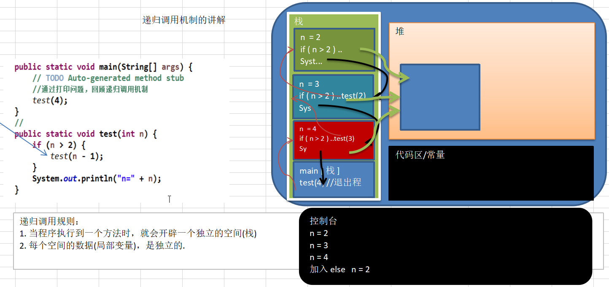
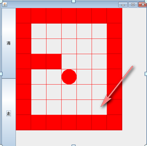
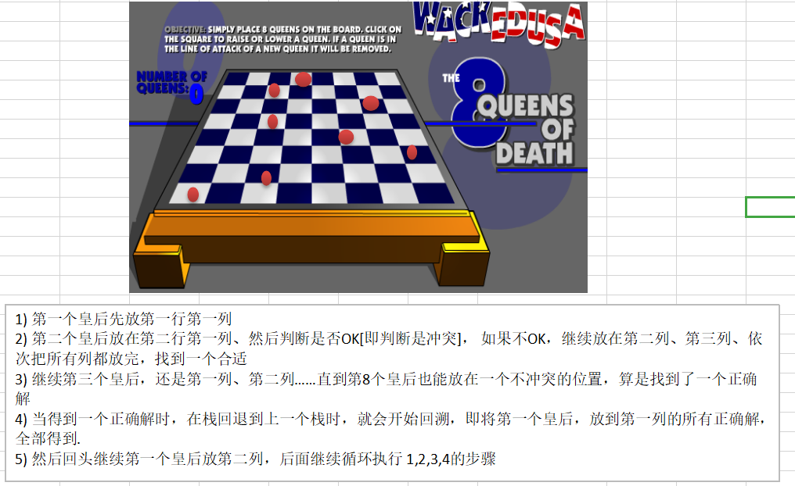

# 递归

## 概念

简单的说：**递归就是方法自己调用自己**，每次调用时**传入不同的变量**。递归有助于编程者解决复杂的问题，同时可以让代码变得简洁。

### 递归调用机制

#### 举例说明

1. 打印问题
2. 阶乘问题

##### 图解说明



##### 代码实现

```java
public class RecursionTest {

	public static void main(String[] args) {
		//通过打印问题，回顾递归调用机制
		test(4);
		
		//int res = factorial(3);
		//System.out.println("res=" + res);
	}
	//打印问题. 
	public static void test(int n) {
		if (n > 2) {
			test(n - 1);
		} //else {
			System.out.println("n=" + n);
		// }
	}
	//阶乘问题
	public static int factorial(int n) {
		if (n == 1) { 
			return 1;
		} else {
			return factorial(n - 1) * n; // 1 * 2 * 3
		}
	}
}
```

## 递归能解决什么样的问题

1. 各种数学问题，如：八皇后问题，汉诺塔，阶乘问题，迷宫问题，球和篮子问题(google编程大赛)
2. 各种算法中也会使用到递归，如：快排，归并排序，二分查找，分治算法等。

## 递归需要遵守的重要规则

1. 执行一个方法时，就创建一个新的受保护的独立空间（栈空间）。
2. 方法的局部变量是独立的，不会相互影响，如：n变量。
3. 如果方法中使用的是引用类型变量（如：数组），就会共享该引用变量的数据。
4. 递归**必须向退出递归的条件逼近**，否则就是无限递归，出现**StackOverflowError**。
5. 当一个方法执行完毕，或者遇到return，就会返回，**遵守谁调用，就将结果返回给谁**，同时当方法执行完毕或者返回时，该方法也就执行完毕。

## 球和篮子问题

**问题内容：**

```java

Problem Statement
问题描述
You have several identical balls that you wish to place in several baskets. Each basket has the same maximum capacity. You are given an int baskets, the number of baskets you have. You are given an int capacity, the maximum capacity of each basket. Finally you are given an int balls, the number of balls to sort into baskets. Return the number of ways you can divide the balls into baskets. If this cannot be done without exceeding the capacity of the baskets, return 0.
Each basket is distinct, but all balls are identical. Thus, if you have two balls to place into two baskets, you could have (0, 2), (1, 1), or (2, 0), so there would be three ways to do this.
你有几个同样的球，你希望把它放到几个篮子里。每个篮子有相同的容量。给出int 型的baskets,代表篮子的数量。给出int型的 capacity，代表每个篮子的最大容量。给出int型的balls,表示归类到篮子里的球的数量。返回值是把球归类到篮子里的方式的数量。如果不能完全存放到篮子中，无法划分，返回0。
篮子互不同，所有的球相同。因此，如果2个球放到2个篮子里，你可以采用3种方式，即(0, 2), (1, 1), 或 (2, 0)


Method:
方法：
countWays

Parameters:
参数：
int, int, int

Returns:
返回值：
int

Method signature:
方法原型：
int countWays(int baskets, int capacity, int balls)
(be sure your method is public)
注意方法是public


Constraints
条件：
-
baskets will be between 1 and 5, inclusive.
篮子数量在1到5之间
-
capacity will be between 1 and 20, inclusive.
容量在1到20之间
-
balls will be between 1 and 100, inclusive.
球在1到100之间
Examples
例子：
0)

???
2
20
2
Returns: 3
The example from the problem statement.
该例子同问题描述。
1)

????
3
20
1
Returns: 3
We have only 1 ball, so we must choose which of the three baskets to place it in.
只有1个球，我们必须3选一
2)

????
3
20
2
Returns: 6
We can place both balls in the same basket (3 ways to do this), or one ball in each of two baskets (3 ways to do this).
可以把两个球放在相同的篮子里（有三种方式），或者两个篮子里各放1球（有三种方法）
3)

????
1
5
10
Returns: 0
We have more balls than our basket can hold.
球的数量大于篮子的容量
4)

????
4
5
10
Returns: 146

This problem statement is the exclusive and proprietary property of TopCoder, Inc. Any unauthorized use or reproduction of this information without the prior written consent of TopCoder, Inc. is strictly prohibited. (c)2003, TopCoder, Inc. All rights reserved.
```

**代码示例**

```java
import java.util.*;
public class FillBaskets {
	int count=0;
	int baskets,capacity,balls;
	int[] bas;
	public int countWays(int baskets, int capacity, int balls) {
		if (baskets*capacity<balls)
			return 0;
		this.baskets=baskets;
		this.balls=balls;
		if (balls<capacity)
			capacity=balls;
		this.capacity=capacity;
		bas=new int[baskets];
		
		//从第0个篮子开始放
		putBalls(0);
		return count;
	}
	
	//
	void putBalls(int n) {
		
		//检测是不是到达最后篮子
		if (n==baskets) {
			if (getSumBalls()==balls)
				count++;
			return;
		}
		
		//给第n个篮子放球,并且从0->capacity
		//一次轮循的放入
		for (int i=0;i<=capacity;i++) {
			bas[n]=i;
			putBalls(n+1);
		}
	}
	//得到当前篮子里面所有的球
	int getSumBalls() {
		int sum=0;
		for (int i=0;i<baskets;i++)
			sum+=bas[i];
		return sum;
	}
}
```

```java
public class BasketTest {
	public static boolean Test1() {
		FillBaskets fb=new FillBaskets();
		int baskets=2;
		int capacity=20;
		int balls=2;
		int key=3;
		int result=fb.countWays(baskets,capacity,balls);
		System.out.println (result);
		return result==key;
	}
	public static boolean Test2() {
		FillBaskets fb=new FillBaskets();
		int baskets=3;
		int capacity=20;
		int balls=1;
		int key=3;
		int result=fb.countWays(baskets,capacity,balls);
		System.out.println (result);
		return result==key;
	}
	public static boolean Test3() {
		FillBaskets fb=new FillBaskets();
		int baskets=3;
		int capacity=20;
		int balls=2;
		int key=6;
		int result=fb.countWays(baskets,capacity,balls);
		System.out.println (result);
		return result==key;
	}
	public static boolean Test4() {
		FillBaskets fb=new FillBaskets();
		int baskets=1;
		int capacity=5;
		int balls=10;
		int key=0;
		int result=fb.countWays(baskets,capacity,balls);
		System.out.println (result);
		return result==key;
	}
	public static boolean Test5() {
		FillBaskets fb=new FillBaskets();
		int baskets=4;
		int capacity=5;
		int balls=10;
		int key=146;
		int result=fb.countWays(baskets,capacity,balls);
		System.out.println (result);
		return result==key;
	}
	public static void main(String[] args) {
		if (Test1()) {
			System.out.println ("Test1 Ok");
		}
		if (Test2()) {
			System.out.println ("Test2 Ok");
		}
		if (Test3()) {
			System.out.println ("Test3 Ok");
		}
		if (Test4()) {
			System.out.println ("Test4 Ok");
		}
		if (Test5()) {
			System.out.println ("Test5 Ok");
		}
	}
}
```

## 迷宫问题



**说明：**

1. 小球得到的路劲，和程序员设置的找路策略有关即：找路的**上下左右**的顺序有关。
2. 在得到小球路径时，可以先使用（下右上左），再改成（上右下左），看看路径是不是有变化。
3. 测试回溯现象。
4. 如何求出最短路径？

**代码实现**

```java
public class MiGong {

	public static void main(String[] args) {
		// 先创建一个二维数组，模拟迷宫
		// 地图
		int[][] map = new int[8][7];
		// 使用1 表示墙
		// 上下全部置为1
		for (int i = 0; i < 7; i++) {
			map[0][i] = 1;
			map[7][i] = 1;
		}

		// 左右全部置为1
		for (int i = 0; i < 8; i++) {
			map[i][0] = 1;
			map[i][6] = 1;
		}
		//设置挡板, 1 表示
		map[3][1] = 1;
		map[3][2] = 1;
		//测试回溯
//		map[1][2] = 1;
//		map[2][2] = 1;
		
		// 输出地图
		System.out.println("地图的情况");
		for (int i = 0; i < 8; i++) {
			for (int j = 0; j < 7; j++) {
				System.out.print(map[i][j] + " ");
			}
			System.out.println();
		}
		
		//使用递归回溯给小球找路
		//setWay(map, 1, 1);
		setWay2(map, 1, 1);
		
		//输出新的地图, 小球走过，并标识过的递归
		System.out.println("小球走过，并标识过的 地图的情况");
		for (int i = 0; i < 8; i++) {
			for (int j = 0; j < 7; j++) {
				System.out.print(map[i][j] + " ");
			}
			System.out.println();
		}
		
	}
	
	//使用递归回溯来给小球找路
	//说明
	//1. map 表示地图
	//2. i,j 表示从地图的哪个位置开始出发 (1,1)
	//3. 如果小球能到 map[6][5] 位置，则说明通路找到.
	//4. 约定： 当map[i][j] 为 0 表示该点没有走过 当为 1 表示墙  ； 2 表示通路可以走 ； 3 表示该点已经走过，但是走不通
	//5. 在走迷宫时，需要确定一个策略(方法) 下->右->上->左 , 如果该点走不通，再回溯
	/**
	 * 
	 * @param map 表示地图
	 * @param i 从哪个位置开始找
	 * @param j 
	 * @return 如果找到通路，就返回true, 否则返回false
	 */
	public static boolean setWay(int[][] map, int i, int j) {
		if(map[6][5] == 2) { // 通路已经找到ok
			return true;
		} else {
			if(map[i][j] == 0) { //如果当前这个点还没有走过
				//按照策略 下->右->上->左  走
				map[i][j] = 2; // 假定该点是可以走通.
				if(setWay(map, i+1, j)) {//向下走
					return true;
				} else if (setWay(map, i, j+1)) { //向右走
					return true;
				} else if (setWay(map, i-1, j)) { //向上
					return true;
				} else if (setWay(map, i, j-1)){ // 向左走
					return true;
				} else {
					//说明该点是走不通，是死路
					map[i][j] = 3;
					return false;
				}
			} else { // 如果map[i][j] != 0 , 可能是 1， 2， 3
				return false;
			}
		}
	}
	
	//修改找路的策略，改成 上->右->下->左
	public static boolean setWay2(int[][] map, int i, int j) {
		if(map[6][5] == 2) { // 通路已经找到ok
			return true;
		} else {
			if(map[i][j] == 0) { //如果当前这个点还没有走过
				//按照策略 上->右->下->左
				map[i][j] = 2; // 假定该点是可以走通.
				if(setWay2(map, i-1, j)) {//向上走
					return true;
				} else if (setWay2(map, i, j+1)) { //向右走
					return true;
				} else if (setWay2(map, i+1, j)) { //向下
					return true;
				} else if (setWay2(map, i, j-1)){ // 向左走
					return true;
				} else {
					//说明该点是走不通，是死路
					map[i][j] = 3;
					return false;
				}
			} else { // 如果map[i][j] != 0 , 可能是 1， 2， 3
				return false;
			}
		}
	}

}
```

## 八皇后问题（回溯算法）

**问题介绍：**

八皇后问题，是一个古老而著名的问题，是回溯算法的典型案例。该问题是国际西洋棋棋手马克斯·贝瑟尔于1848年提出：在8×8格的国际象棋上摆放八个皇后，使其不能互相攻击，即：**任意两个皇后都不能处于同一行、同一列或同一斜线上，问有多少种摆法**。

**思路分析：**



**说明：**

理论上应该创建一个二维数组表示棋盘，但实际上可以通过算法，用一个一维数组即可解决问题。arr[8] = { 0, 4, 7, 5, 2, 6, 1, 3}对应arr下标表示第几行，即第几个皇后，arr[i]=val,val表示第i+1个皇后，放在第i+1行的第val+1列。

**代码实现**

```java
public class Queue8 {

	//定义一个max表示共有多少个皇后
	int max = 8;
	//定义数组array, 保存皇后放置位置的结果,比如 arr = {0 , 4, 7, 5, 2, 6, 1, 3} 
	int[] array = new int[max];
	static int count = 0;
	static int judgeCount = 0;
	public static void main(String[] args) {
		//测试一把 ， 8皇后是否正确
		Queue8 queue8 = new Queue8();
		queue8.check(0);
		System.out.printf("一共有%d解法", count);
		System.out.printf("一共判断冲突的次数%d次", judgeCount); // 1.5w
		
	}
	
	//编写一个方法，放置第n个皇后
	//特别注意： check 是 每一次递归时，进入到check中都有  for(int i = 0; i < max; i++)，因此会有回溯
	private void check(int n) {
		if(n == max) {  //n = 8 , 其实8个皇后就既然放好
			print();
			return;
		}
		
		//依次放入皇后，并判断是否冲突
		for(int i = 0; i < max; i++) {
			//先把当前这个皇后 n , 放到该行的第1列
			array[n] = i;
			//判断当放置第n个皇后到i列时，是否冲突
			if(judge(n)) { // 不冲突
				//接着放n+1个皇后,即开始递归
				check(n+1); //  
			}
			//如果冲突，就继续执行 array[n] = i; 即将第n个皇后，放置在本行得 后移的一个位置
		}
	}
	
	//查看当我们放置第n个皇后, 就去检测该皇后是否和前面已经摆放的皇后冲突
	/**
	 * 
	 * @param n 表示第n个皇后
	 * @return
	 */
	private boolean judge(int n) {
		judgeCount++;
		for(int i = 0; i < n; i++) {
			// 说明
			//1. array[i] == array[n]  表示判断 第n个皇后是否和前面的n-1个皇后在同一列
			//2. Math.abs(n-i) == Math.abs(array[n] - array[i]) 表示判断第n个皇后是否和第i皇后是否在同一斜线
			// n = 1  放置第 2列 1 n = 1 array[1] = 1
			// Math.abs(1-0) == 1  Math.abs(array[n] - array[i]) = Math.abs(1-0) = 1
			//3. 判断是否在同一行, 没有必要，n 每次都在递增
			if(array[i] == array[n] || Math.abs(n-i) == Math.abs(array[n] - array[i]) ) {
				return false;
			}
		}
		return true;
	}
	
	//写一个方法，可以将皇后摆放的位置输出
	private void print() {
		count++;
		for (int i = 0; i < array.length; i++) {
			System.out.print(array[i] + " ");
		}
		System.out.println();
	}

}
```

