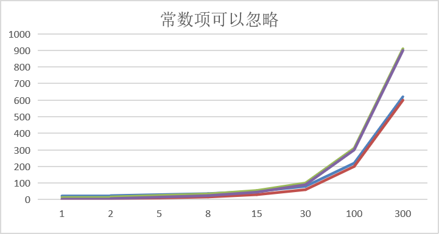
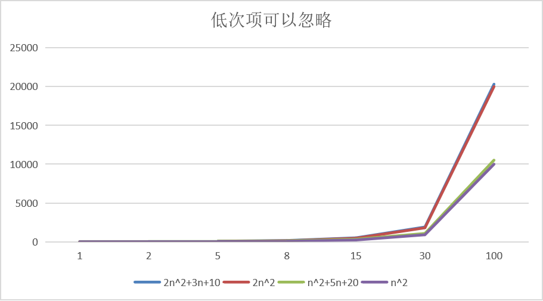
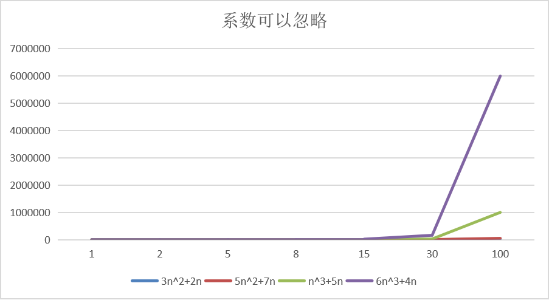
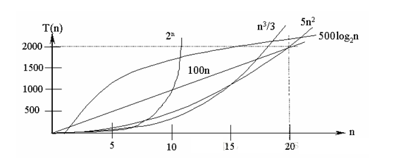
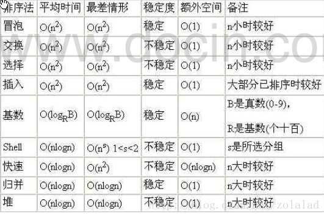

## 排序算法的介绍

排序也称排序算法（Sort Algorithm），排序是将**一组数据**，**依指定的顺序进行排列的过程**。

## 排序的分类

1. 内部排序

   指将需要处理的所有数据都加载到**内部存储器**(内存)中进行排序。

2. 外部排序

   **数据量过大**，无法全部加载到内存中，需要借助**外部存储（文件等）**进行排序。

3. 常见的排序算法分类

   

## 算法的时间复杂度

#### 度量一个程序（算法）执行时间的两种方法

1. 事后统计的方法

   这种方法可行，但存在两个问题：

   一是要想对设计的算法的运行性能进行评测，需要实际运行该程序；

   二是所得时间的统计量依赖于计算机得硬件、软件等环境因素，这种方式，要在同一台计算机得相同状态下运行，才能比较那个算法速度更快。

2. 事前估算的方法

   通过分析某个算法的**时间复杂度**来判断那个算法更优。

### 时间频度

#### 基本介绍

时间频度：一个算法花费的时间与算法中语句的执行次数成正比列，那个算法中语句执行次数多，它花费时间就多。**一个算法中的语句执行次数称为语句频度或时间频度。**记为T(n)。

##### 举例说明

###### 基本案例

计算1-100所有数字之和

1. 使用for循环计算

   ```java
   int total=0;
   int end=100;
   for(int i=1;i<=end;i++){
       total+=i;
   }
   ```

   时间频度为：T(n) = n+1;

2. 直接计算

   ```java
   total = (1 + end)*end/2;
   ```

   时间频度为：T(n) = 1;

###### 忽略常数项

|      | T(n)=2n+20 | T(n)=2*n | T(3n+10) | T(3n) |
| ---- | :--------: | :------: | :------: | :---: |
| 1    |     22     |    2     |    13    |   3   |
| 2    |     24     |    4     |    16    |   6   |
| 5    |     30     |    10    |    25    |  15   |
| 8    |     36     |    16    |    34    |  24   |
| 15   |     50     |    30    |    55    |  45   |
| 30   |     80     |    60    |   100    |  90   |
| 100  |    220     |   200    |   310    |  300  |
| 300  |    620     |   600    |   910    |  900  |



**结论：**

1. 2n+20和2n随着n变大，执行曲线无限接近，20可以忽略
2. 3n+10和3n随着n变大，执行曲线无限接近，10可以忽略

###### 忽略低次项

|      | $T(n)=2n^2+3n+10$ | $T(2n^2)$ | $T(n^2+5n+20)$ | $T(n^2)$ |
| ---- | :---------------: | :-------: | :------------: | :------: |
| 1    |        15         |     2     |       26       |    1     |
| 2    |        24         |     8     |       34       |    4     |
| 5    |        75         |    50     |       70       |    25    |
| 8    |        162        |    128    |      124       |    64    |
| 15   |        505        |    450    |      320       |   225    |
| 30   |       1900        |   1800    |      1070      |   900    |
| 100  |       20310       |   20000   |     10520      |  10000   |



**结论：**

1. $2n^2+3n+10$和$2n^2$随着n变大，执行曲线无限接近，可以忽略3n+10
2. $n^2+5n+20$和$n^2$随着执行曲线无限接近，可以忽略5n+20

###### 忽略系数

|      | $T(3n^2+2n)$ | $T(5n^2+7n)$ | $T(n^3+5n)$ | $T(6n^3+4n)$ |
| ---- | :----------: | :----------: | :---------: | :----------: |
| 1    |      5       |      12      |      6      |      10      |
| 2    |      16      |      34      |     18      |      56      |
| 5    |      85      |     160      |     150     |     770      |
| 8    |     208      |     376      |     552     |     3104     |
| 15   |     705      |     1230     |    3450     |    20310     |
| 30   |     2760     |     4710     |    27150    |    162120    |
| 100  |    30200     |    50700     |   1000500   |   6000400    |



**结论：**

1. 随着n值变大，$5n^2+7n$和$3n^2+2n$，执行曲线重合，说明这种情况下，5和3可以忽略。
2. 而$n^3+5n$和$6n^3+4n$,执行曲线分离,说明多少次方式关键

### 时间复杂度

1. 一般情况下，**算法中的基本操作语句的重复执行次数是问题规模n的某个函数**，用T(n)表示，若有某个辅助函数f(n)，使得当n趋近于无穷大时，T(n)/f(n)的极限值为不等于零的常数，则称f(n)是T(n)的同数量级函数。记作**T(n)=O(f(n))**，称O(f(n))为算法的渐进时间复杂度，简称时间复杂度。
2. T(n)不同，但时间复杂度可能相同。如：$T(n)=n^2+7n+6$与$T(n)=3n^2+2n+2$它们的T(n)不同，但时间复杂度相同，都为**O($n^2$)**。
3. 计算时间复杂度的方法：
   - 用常数1代替运行时间中的所有加法常数 **$T(n)=n^2+7n+6   =>  T(n)=n^2+7n+1$**
   - 修改后的运行次数函数中，只保留最高阶项**$T(n)=n^2+7n+1 => T(n)=n^2$**
   - 去除最高阶项的系数**$T(n)=n^2 => T(n)=n^2 => O(n^2)$**

#### 常见的时间复杂度

1. 常数阶O(1)
2. 对数阶$O(log_2n)$
3. 线性阶O(n)
4. 线性对数阶$O(nlog_2n)$
5. 平方阶$O(n^2)$
6. 立方阶$O(n^3)$
7. k次方阶$O(n^k)$
8. 指数阶$O(2^n)$

##### 常见的时间复杂度对应的图



###### 说明

1. 常见的算法时间复杂度由小到大依次为：$O(1)<O(log_2n)<O(n)<O(nlog_2n)<O(n^2)<O(n^3)<O(n^k)<O(2^n)$，随着问题规模n的不断增大，上述时间复杂度不断增大，算法的执行效率越低。
2. 从图中可见，应该尽可能避免使用指数阶的算法。

###### 常数阶$O(1)$

无论代码执行了多少行，只要是没有循环等复杂结构，那么这个代码的时间复杂度就都是$O(1)$

```java
int i = 1;
int j = 2;
++i;
j++;
int m = i + j;
```

上述代码在执行的时候，它消耗的时候并不随着某个变量的增长而增长，那么无论这类代码有多长，即使有几万几十万行，都可以用$O(1)$来表示它的时间复杂度。

###### 对数阶$O(log_2n)$

```java
int i = 1;
while(i<n){
    i = i * 2;
}
```

**说明：**在while循环里面，每次都将i乘以2，乘完之后，i距离n就越来越近了。假设循环x次之后，i就大于2了，此时这个循环就退出了，也就是说2的x次方等于n，那么$x=log_2n$也就是说当循环$log_2n$次以后，这个代码就结束了。因此这个代码的时间复杂度为：$O(log_2n)$。$O(log_2n)$的这个2时间上是根据代码变化的，$i=i\times3$，则是$O(log_3n)$。

如果$N = a^x$(a &gt; 0，a &ne; 1)  ，即a的x次方等于$N(a>0,且a\neq1)$,那么数x叫做以a为底N的对数(loganithm)，记作$x=log_aN$。其中，a叫做对数的底数，N叫做真数，x叫做以a为底N的对数。

###### 线性阶$O(n)$

```java
for(i=1;i<=n;++i){
	j=i;
	j++;
}
```

**说明：**代码中的for循环里面的代码会执行n遍，因此它消耗的时间是随着n的变化而变化的，因此这类代码都可以用O(n)来表示它的时间复杂度。

###### 线性对数阶$O(nlogN)$

```java
for(m=1;m<n;m++){
    i=1;
    while(i<n){
        i=i*2;
    }
}
```

**说明：**线性对数阶O(nlogN)其实就是将时间复杂度为O(logn)的代码循环N遍，即：时间复杂度为 n * O(logN)  => O(nlogN)

###### 平方阶$O(n^2)$

```java
for(x=1;i<=n;x++){
    for(i=1;i<=n;i++){
        j=i;
        j++;
    }
}
```

**说明：**平方阶$O(n^2)$就更容易理解了，如果把O(n)的代码再嵌套循环一遍，它的时间复杂度就是$O(n \times n)$，即$O(n^2)$如果将其中一层循环的n改成m，那它的时间复杂度就变成了$O(m\times n)$

###### 立方阶$O(n^3)$、K次方阶$O(n^k)$

**说明：**参考平方阶，$O(n3)$相当于三层n循环，其它的类似。

#### 平均时间复杂度和最坏时间复杂度

1. 平均时间复杂度是指所有可能的输入实例均可以等概率出现的情况下，该算法的运行时间。

2. 最坏情况下的时间复杂度称最坏时间复杂度。**一般讨论的时间复杂度均是最坏情况下的时间复杂度**。这样做的原因是：最坏情况下的时间复杂度是算法再任何输入实例上运行时间的界限，着就保证了算法的运行时间不会比最坏情况更长。

3. 平均时间复杂度和最坏时间复杂度是否一致，和算法有关：

   

## 算法的空间复杂度

#### 基本介绍

1. 类似于时间复杂度的讨论，一个算法的空间复杂度(Space Complexity)定义为该算法所耗费的存储空间，它也是问题规模n的函数。
2. 空间复杂度(Space Complexity)是对于一个算法在运行过程中临时占用存储空间大小的量度。有的算法需要占用的临时工作单元数与解决问题的规模n有关，它随着n的增大而增大，当n较大时，将占用较多的存储单元，例如快速排序和**归并排序算法，基数排序**就属于这种情况。
3. 在做算法分析时，主要讨论的是时间复杂度。**从用户使用体验上看，更看重的程序执行的速度**。一些缓存产品（redis，memcache）和算法（基数排序）**本质就是空间换时间**。

## 冒泡排序

#### 基本介绍

冒泡排序（Bubble Sorting）的基本思想是：通过对待排序序列从前向后（从下标较小的元素开始），**依次比较相邻元素的值，若发现逆序则交换**，使值较大的元素逐渐从前移向后部，就像水底下的气泡一样逐渐向上冒。

##### 优化

因为排序的过程中，各元素不断接近自己的位置，**如果一趟比较下来没有进行过交换，就说明序列有序**，因此要在排序过程中设置一个标志flag判断元素是否进行过交换。从而减少不必要的比较。（这里的优化，可以在冒泡排序写好后，在进行）

#### 例子

