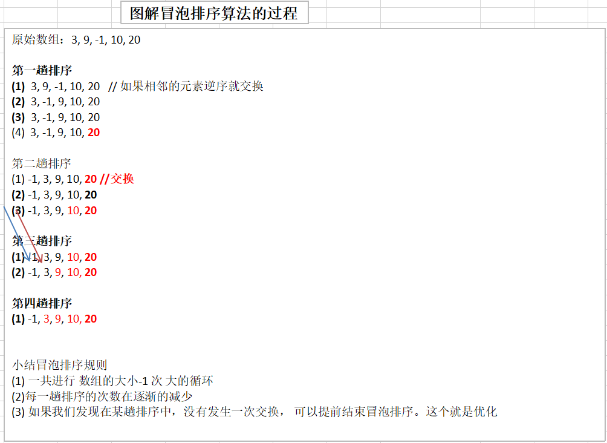

[TOC]

## 排序算法的介绍

排序也称排序算法（Sort Algorithm），排序是将**一组数据**，**依指定的顺序进行排列的过程**。

## 排序的分类

1. 内部排序

   指将需要处理的所有数据都加载到**内部存储器**(内存)中进行排序。

2. 外部排序

   **数据量过大**，无法全部加载到内存中，需要借助**外部存储（文件等）**进行排序。

3. 常见的排序算法分类

   

## 算法的时间复杂度

#### 度量一个程序（算法）执行时间的两种方法

1. 事后统计的方法

   这种方法可行，但存在两个问题：

   一是要想对设计的算法的运行性能进行评测，需要实际运行该程序；

   二是所得时间的统计量依赖于计算机得硬件、软件等环境因素，这种方式，要在同一台计算机得相同状态下运行，才能比较那个算法速度更快。

2. 事前估算的方法

   通过分析某个算法的**时间复杂度**来判断那个算法更优。

### 时间频度

#### 基本介绍

时间频度：一个算法花费的时间与算法中语句的执行次数成正比列，那个算法中语句执行次数多，它花费时间就多。**一个算法中的语句执行次数称为语句频度或时间频度。**记为T(n)。

##### 举例说明

###### 基本案例

计算1-100所有数字之和

1. 使用for循环计算

   ```java
   int total=0;
   int end=100;
   for(int i=1;i<=end;i++){
       total+=i;
   }
   ```

   时间频度为：T(n) = n+1;

2. 直接计算

   ```java
   total = (1 + end)*end/2;
   ```

   时间频度为：T(n) = 1;

###### 忽略常数项

|      | T(n)=2n+20 | T(n)=2*n | T(3n+10) | T(3n) |
| ---- | :--------: | :------: | :------: | :---: |
| 1    |     22     |    2     |    13    |   3   |
| 2    |     24     |    4     |    16    |   6   |
| 5    |     30     |    10    |    25    |  15   |
| 8    |     36     |    16    |    34    |  24   |
| 15   |     50     |    30    |    55    |  45   |
| 30   |     80     |    60    |   100    |  90   |
| 100  |    220     |   200    |   310    |  300  |
| 300  |    620     |   600    |   910    |  900  |


**结论：**

1. 2n+20和2n随着n变大，执行曲线无限接近，20可以忽略
2. 3n+10和3n随着n变大，执行曲线无限接近，10可以忽略

###### 忽略低次项

|      | $T(n)=2n^2+3n+10$ | $T(2n^2)$ | $T(n^2+5n+20)$ | $T(n^2)$ |
| ---- | :---------------: | :-------: | :------------: | :------: |
| 1    |        15         |     2     |       26       |    1     |
| 2    |        24         |     8     |       34       |    4     |
| 5    |        75         |    50     |       70       |    25    |
| 8    |        162        |    128    |      124       |    64    |
| 15   |        505        |    450    |      320       |   225    |
| 30   |       1900        |   1800    |      1070      |   900    |
| 100  |       20310       |   20000   |     10520      |  10000   |


**结论：**

1. $2n^2+3n+10$和$2n^2$随着n变大，执行曲线无限接近，可以忽略3n+10
2. $n^2+5n+20$和$n^2$随着执行曲线无限接近，可以忽略5n+20

###### 忽略系数

|      | $T(3n^2+2n)$ | $T(5n^2+7n)$ | $T(n^3+5n)$ | $T(6n^3+4n)$ |
| ---- | :----------: | :----------: | :---------: | :----------: |
| 1    |      5       |      12      |      6      |      10      |
| 2    |      16      |      34      |     18      |      56      |
| 5    |      85      |     160      |     150     |     770      |
| 8    |     208      |     376      |     552     |     3104     |
| 15   |     705      |     1230     |    3450     |    20310     |
| 30   |     2760     |     4710     |    27150    |    162120    |
| 100  |    30200     |    50700     |   1000500   |   6000400    |


**结论：**

1. 随着n值变大，$5n^2+7n$和$3n^2+2n$，执行曲线重合，说明这种情况下，5和3可以忽略。
2. 而$n^3+5n$和$6n^3+4n$,执行曲线分离,说明多少次方式关键

### 时间复杂度

1. 一般情况下，**算法中的基本操作语句的重复执行次数是问题规模n的某个函数**，用T(n)表示，若有某个辅助函数f(n)，使得当n趋近于无穷大时，T(n)/f(n)的极限值为不等于零的常数，则称f(n)是T(n)的同数量级函数。记作**T(n)=O(f(n))**，称O(f(n))为算法的渐进时间复杂度，简称时间复杂度。
2. T(n)不同，但时间复杂度可能相同。如：$T(n)=n^2+7n+6$与$T(n)=3n^2+2n+2$它们的T(n)不同，但时间复杂度相同，都为**O($n^2$)**。
3. 计算时间复杂度的方法：
   - 用常数1代替运行时间中的所有加法常数 **$T(n)=n^2+7n+6   =>  T(n)=n^2+7n+1$**
   - 修改后的运行次数函数中，只保留最高阶项**$T(n)=n^2+7n+1 => T(n)=n^2$**
   - 去除最高阶项的系数**$T(n)=n^2 => T(n)=n^2 => O(n^2)$**

#### 常见的时间复杂度

1. 常数阶O(1)
2. 对数阶$O(log_2n)$
3. 线性阶O(n)
4. 线性对数阶$O(nlog_2n)$
5. 平方阶$O(n^2)$
6. 立方阶$O(n^3)$
7. k次方阶$O(n^k)$
8. 指数阶$O(2^n)$

##### 常见的时间复杂度对应的图


###### 说明

1. 常见的算法时间复杂度由小到大依次为：$O(1)<O(log_2n)<O(n)<O(nlog_2n)<O(n^2)<O(n^3)<O(n^k)<O(2^n)$，随着问题规模n的不断增大，上述时间复杂度不断增大，算法的执行效率越低。
2. 从图中可见，应该尽可能避免使用指数阶的算法。

###### 常数阶$O(1)$

无论代码执行了多少行，只要是没有循环等复杂结构，那么这个代码的时间复杂度就都是$O(1)$

```java
int i = 1;
int j = 2;
++i;
j++;
int m = i + j;
```

上述代码在执行的时候，它消耗的时候并不随着某个变量的增长而增长，那么无论这类代码有多长，即使有几万几十万行，都可以用$O(1)$来表示它的时间复杂度。

###### 对数阶$O(log_2n)$

```java
int i = 1;
while(i<n){
    i = i * 2;
}
```

**说明：**在while循环里面，每次都将i乘以2，乘完之后，i距离n就越来越近了。假设循环x次之后，i就大于2了，此时这个循环就退出了，也就是说2的x次方等于n，那么$x=log_2n$也就是说当循环$log_2n$次以后，这个代码就结束了。因此这个代码的时间复杂度为：$O(log_2n)$。$O(log_2n)$的这个2时间上是根据代码变化的，$i=i\times3$，则是$O(log_3n)$。

如果$N = a^x$(a &gt; 0，a &ne; 1)  ，即a的x次方等于$N(a>0,且a\neq1)$,那么数x叫做以a为底N的对数(loganithm)，记作$x=log_aN$。其中，a叫做对数的底数，N叫做真数，x叫做以a为底N的对数。

###### 线性阶$O(n)$

```java
for(i=1;i<=n;++i){
	j=i;
	j++;
}
```

**说明：**代码中的for循环里面的代码会执行n遍，因此它消耗的时间是随着n的变化而变化的，因此这类代码都可以用O(n)来表示它的时间复杂度。

###### 线性对数阶$O(nlogN)$

```java
for(m=1;m<n;m++){
    i=1;
    while(i<n){
        i=i*2;
    }
}
```

**说明：**线性对数阶O(nlogN)其实就是将时间复杂度为O(logn)的代码循环N遍，即：时间复杂度为 n * O(logN)  => O(nlogN)

###### 平方阶$O(n^2)$

```java
for(x=1;i<=n;x++){
    for(i=1;i<=n;i++){
        j=i;
        j++;
    }
}
```

**说明：**平方阶$O(n^2)$就更容易理解了，如果把O(n)的代码再嵌套循环一遍，它的时间复杂度就是$O(n \times n)$，即$O(n^2)$如果将其中一层循环的n改成m，那它的时间复杂度就变成了$O(m\times n)$

###### 立方阶$O(n^3)$、K次方阶$O(n^k)$

**说明：**参考平方阶，$O(n3)$相当于三层n循环，其它的类似。

#### 平均时间复杂度和最坏时间复杂度

1. 平均时间复杂度是指所有可能的输入实例均可以等概率出现的情况下，该算法的运行时间。

2. 最坏情况下的时间复杂度称最坏时间复杂度。**一般讨论的时间复杂度均是最坏情况下的时间复杂度**。这样做的原因是：最坏情况下的时间复杂度是算法再任何输入实例上运行时间的界限，着就保证了算法的运行时间不会比最坏情况更长。

3. 平均时间复杂度和最坏时间复杂度是否一致，和算法有关：

   

## 算法的空间复杂度

#### 基本介绍

1. 类似于时间复杂度的讨论，一个算法的空间复杂度(Space Complexity)定义为该算法所耗费的存储空间，它也是问题规模n的函数。
2. 空间复杂度(Space Complexity)是对于一个算法在运行过程中临时占用存储空间大小的量度。有的算法需要占用的临时工作单元数与解决问题的规模n有关，它随着n的增大而增大，当n较大时，将占用较多的存储单元，例如快速排序和**归并排序算法，基数排序**就属于这种情况。
3. 在做算法分析时，主要讨论的是时间复杂度。**从用户使用体验上看，更看重的程序执行的速度**。一些缓存产品（redis，memcache）和算法（基数排序）**本质就是空间换时间**。

## 冒泡排序

#### 基本介绍

冒泡排序（Bubble Sorting）的基本思想是：通过对待排序序列从前向后（从下标较小的元素开始），**依次比较相邻元素的值，若发现逆序则交换**，使值较大的元素逐渐从前移向后部，就像水底下的气泡一样逐渐向上冒。

##### 优化

因为排序的过程中，各元素不断接近自己的位置，**如果一趟比较下来没有进行过交换，就说明序列有序**，因此要在排序过程中设置一个标志flag判断元素是否进行过交换。从而减少不必要的比较。（这里的优化，可以在冒泡排序写好后，在进行）

#### 例子



```java
import java.text.SimpleDateFormat;
import java.util.Date;

public class BubbleSort{
    
    public static void main(String[] atgs){
        
        //测试冒泡排序【时间复杂度 O(n^2)】
        int[] arr = new int[100000];
        for(int i = 0; i < 100000; i++){
            arr[i] = (int)(Math.random() * 100000);
        }
        Date date1 = new Date();
        SimpleDateFormat simpleDateFormat = new SimpleDateFormat("yyyy-MM-dd HH:mm:ss");
        String date1Str = simpleDateFormat.format(date1);
        System.out.println("排序前的时间是：" + date1Str);
        
        //冒泡排序
        bubbleSort(arr);
        
        Date date2 = new Date();
        String date2Str = simpleDateFormat.format(date2);
        System.out.println("排序后的时间：" + date2Str);
        System.out.println((date2.getTime() - date1.getTime())/1000 + "秒")
    }
    
    //冒泡排序算法 时间复杂度O(n^2)
    public static void bubbleSort(int[] arr){
        //临时变量
        int temp = 0;
        //标识变量，标识是否进行过交换
        boolean flag = false;
        for(int i = 0; i < arr.length - 1; i++){
            for(int j = 0; j < arr.length - 1 - i; j++){
                //若前面的数比后边的数大，则交换
                if(arr[j] > arr[j + 1]){
                    flag = true;
                    temp = arr[j];
                    arr[j] = arr[j + 1];
                    arr[j + 1] = temp;
                }
            }
            //在一趟排序中，一次交换也没发生过，则证明数组顺序已经排序完成。退出排序算法。
            if(!flag){
                break;
            }else{
                //重置flag，进行下次判断
                flag = false;
            }
        }
    }
}
```

## 选择排序

#### 基本介绍

选择排序属于内部排序法，是从要排序的数据中，按指定的规则选出某一元素，在依规定交换位置后达到排序的目的。

#### 选择排序的思想

选择排序（select sorting）是一种简单的排序方法。基本思想是：第一次从arr[0] ~ arr[n-1]中选取最小值，与arr[0]交换，第二次从arr[1] ~ arr[n-1]中选取最小值，与arr[1]交换，第三次从arr[2] ~ arr[n-1]中选取最小值，与arr[2]交换，...，第i次从arr[i-1] ~ arr[n-1]中选取最小值，与arr[i-1]交换，...，第n-1次从arr[n-2] ~ arr[n-1]中选取最小值，与arr[n-2]交换，总共通过n-1次，得到一个排序码从小到大排列的有序序列。


#### 代码实现

##### 推导

```java
//第1轮
//原始的数组 ： 	101, 34, 119, 1
//第一轮排序 :   	1, 34, 119, 101
//算法 先简单--》 做复杂， 就是可以把一个复杂的算法，拆分成简单的问题-》逐步解决

int [] arr = {101, 34, 119, 1};

//第1轮
int minIndex = 0;
int min = arr[0];
for(int j = 0 + 1; j < arr.length; j++) {
    if (min > arr[j]) { //说明假定的最小值，并不是最小
        min = arr[j]; //重置min
        minIndex = j; //重置minIndex
    }
}
//将最小值，放在arr[0], 即交换
if(minIndex != 0) {
    arr[minIndex] = arr[0];
    arr[0] = min;
}
System.out.println("第1轮后~~");
System.out.println(Arrays.toString(arr));// 1, 34, 119, 101


//第2轮
minIndex = 1;
min = arr[1];
for (int j = 1 + 1; j < arr.length; j++) {
    if (min > arr[j]) { // 说明假定的最小值，并不是最小
        min = arr[j]; // 重置min
        minIndex = j; // 重置minIndex
    }
}
// 将最小值，放在arr[0], 即交换
if(minIndex != 1) {
    arr[minIndex] = arr[1];
    arr[1] = min;
}
System.out.println("第2轮后~~");
System.out.println(Arrays.toString(arr));// 1, 34, 119, 101

//第3轮
minIndex = 2;
min = arr[2];
for (int j = 2 + 1; j < arr.length; j++) {
    if (min > arr[j]) { // 说明假定的最小值，并不是最小
        min = arr[j]; // 重置min
        minIndex = j; // 重置minIndex
    }
}
// 将最小值，放在arr[0], 即交换
if (minIndex != 2) {
    arr[minIndex] = arr[2];
    arr[2] = min;
}
System.out.println("第3轮后~~");
System.out.println(Arrays.toString(arr));// 1, 34, 101, 119
```

##### 实现以及测算时间消耗

```java
public class SelectSort{
    
    public static void main(String[] args){
        //创建一个100000个的随机数组
        int[] arr = new int[100000];
        for(int i = 0; i < 100000; i++){
            arr[i] = (int)(Math.random() * 1000000);
        }
        Date date1 = new Date();
        SimpleDateFormat simpleDateFormat = new SimpleDateFormat("yyyy-MM-dd HH:mm:ss");
        String date1Str = simpleDateFormat.format(date1);
        System.out.println("排序前的时间是："+date1Str);
        
        selectSort(arr);
        
        Date date2 = new Date();
        String date2Str = simpleDateFormat(date2);
        System.out.println("排序后的时间是："+date2Str);
        
        System.out.println("耗时：" + (date2.getTime() - date1.getTime()) + "毫秒")
    }
    
    //选择排序 时间复杂度为 O(n^2)
    public static void selectSort(int[] arr){
        for(int i = 0; i < arr.length - 1; i++){
            int minIndex = i;
            int min = arr[i];
            for(int j = i + 1; j < arr.length; j++){
                //说明：假定的最小值，不是最小值
                if(min > arr[j]){
                    //重置min
                    min = arr[j];
                    //重置minIndex
                    minIndex = j;
                }
            }
            //将最小值，放在arr[0],即交换
            if(minIndex != i){
                arr[minIndex] = arr[i];
                arr[i] = min;
            }
        }
    }
}
```

## 插入排序

#### 介绍

插入式排序属于内部排序法，是对于要排序的元素以插入的方式找寻该元素的适当位置，以达到排序的目的。

#### 插入排序算法思想

插入排序（Insertion Sorting）的基本思想是：**把n个待排序的元素看成为一个有序表和一个无序表**，开始时**有序表中只包含一个元素**，无序表中包含有**n-1个元素**，排序过程中每次从无序表中取出第一个元素，把它的排序码依次与有序表元素的排序码进行比较，将它插入到有序表中的适当位置，使之成为新的有序表。


##### 代码实现

```java
import java.text.SimpleDateFormat;
import java.util.Date;

public class InsertSort{
    
    public static void main(String[] args){
        //创建100000个数据的随机数组
        int[] arr = new int[100000];
        for(int i = 0; i < 100000; i++){
            arr[i] = (int) (Math.random() * 100000);
        }
        
        System.out.println("插入排序前");
        Date date1 = new Date();
        SimpleDateFormat simpleDateFormat = new SimpleDateFormat("yyyy-MM-dd HH:mm:ss");
        String date1Str = simpleDateFormat.format(date1);
        System.out.println("排序前的时间是："+date1Str);
        
        insertSort(arr);
        
        Date date2 = new Date();
        String date2Str = simpleDateFormat.format(date2);
        System.out.println("排序后的时间是：" + date2Str);
    }
    
    //插入排序
    public static void insertSort(int[] arr){
        int insertVal = 0;
        int insertIndex = 0;
        for(int i = 1; i < arr.length; i++){
            //定义待插入的数
            insertVal = arr[i];
            insertIndex = i - 1; //即arr[i]的前面这个数的下标
            //找到insertVal的插入位置
            //说明
            //1.insertIndex >= 0 保证在给insertVal找插入位置时，不越界。
            //2.insertVal < arr[insertIndex] 待插入的数，还没有找到插入位置
            //3.将arr[insertIndex]后移
            while(insertIndex >= 0 && insertVal < arr[insertIndex]){
                arr[insertIndex + 1] = arr[insertIndex];
                insertIndex--;
            }
            //当退出while循环时，说明插入的位置找到，insertIndex + 1
            if(insertIndex + 1 != i){
                arr[insertIndex + 1] = insertVal;
            }
        }
    }
}
```

## 希尔排序

### 介绍

**希尔排序**是希尔(Donald Shell)于1959年提出的一种排序算法。希尔排序也是一种**插入排序**，它是简单插入排序经过改进之后的一个**更高效的版本**，也称为**缩小增量排序**。

#### 基本思想

希尔排序是把记录按下标的一定增量分组，对每组使用直接插入排序算法排序，随着增量逐渐减少，每组包含的关键词越来越多，**当增量减至1时**，整个文件恰被分成一组，算法便终止。

##### 示意图


#### 代码实现

实现方式：

1. 对有序序列在插入时采用**交换法**
2. 对有序序列在插入时采用**移动法**

###### 希尔排序推导过程

```java
int[] arr = {8,9,1,7,2,3,5,4,6,0};

//第一轮
for(int i = 5; i < arr.length; i++){
    //遍历各组中所有的元素(共5组，每组有2个元素)，步长5
    for(int j = i - 5; j >= 0; j -= 5){
        //若当前元素大于加上步长的那个元素，就进行交换
        if(arr[j] > arr[j + 5]){
            temp = arr[j];
            arr[j] = arr[j + 5];
            arr[j + 5] = temp;
        }
    }
}
// 查看第一轮排序后的数组
System.out.println("第一轮后：" + Arrays.toString[arr]);

//第二轮
for(int i = 2; i < arr.length; i++){
    for(int j = i - 2; j >= 0; j -= 2){
        if(arr[j] > arr[j + 2]){
            temp = arr[j];
            arr[j] = arr[j + 2];
            arr[j + 2] = temp;
        }
    }
}
System.out.println("第二轮后：" + Arrays.toString[arr]);

// 第三轮
for(int i = 1; i < arr.length; i++){
    for(int j = i - 1; j >= 0; j -= 1){
        if(arr[j] > arr[j + 1]){
            temp = arr[j];
            arr[j] = arr[j + 1];
            arr[j + 1] = temp;
        }
    }
}
System.out.println("第三轮后：" + Arrays.toString[arr]);
```

###### 交换法

```java
public static void shellSort(int[] arr){
    int temp = 0;
    for(int gap = arr.length / 2; gap > 0; gap /= 2){
        // 遍历各组中的所有的元素(共gap组)，步长gap
        for(int j = i - gap; j >= 0; j -= gap){
            // 若当前元素大于加上步长的那个元素，则进行交换
            if(arr[j] > arr[j + gap]){
                temp = arr[j];
                arr[j] = arr[j + gap];
                arr[j + gap] = temp;
            }
        }
    }
}
```

###### 移位法 (性能优于交换法，推荐该种实现)

```java
public static void shellSort(int arr){
    //增量gap，并逐步的缩小增量
    for(int gap = arr.length / 2; gap > 0; gap /= 2){
        // 从第gap个元素，逐个对其所在的组进行直接插入排序
        for(int i = gap; i < arr.length; i++){
            int j = i;
            int temp = arr[j];
            if(arr[j] < arr[j -gap]){
                while(j - gap >= 0 && temp < arr[j - gap]){
                    // 移动
                    arr[j] = arr[j - gap];
                    j -= gap;
                }
                // 当退出while后，就给temp找到插入位置
                arr[j] = temp;
            }
        }
    }
}
```

## 快速排序
### 介绍

快速排序(Quick sort) 是对**冒泡排序**的一种改进，基本思想是：通过一趟排序将要排序的数据分割成独立的两部分，其中一部分的所有数据都比另外一部分的所有数据都要小，然后再按此方法对这两部分数据分别进行快速排序，**整个排序过程可以递归进行**，以此达到整个数据变成有序序列。

#### 示意图


#### 应用实例

```java
import java.text.SimpleDateFormat;
import java.util.Date;

public class QuickSort{
    public static void main(String[] args){
        int[] arr = new int[1000000];
        for(int i = 0; i < 1000000; i++){
            arr[i] = (int)(Math.random()*1000000);
        }
        System.out.println("排序前：");
        Date date1 = new Date();
        SimpleDateFormat simpleDateFormat = new SimpleDateFormat("yyyy-MM-dd HH:mm:ss");
        String date1Str = simpleDateFormat.format(date1);
        System.out.println("排序前的时间是：" + date1Str);
        
        quickSort(arr,0,arr.length - 1);
        
        Date date2 = new Date();
        String date2Str = simpleDateFormat.format(date2);
        System.out.println("排序后的时间是：" + date2Str)
    }
    
    public static void quickSort(int[] arr,int left,int right){
        //左下标
        int l = left;
        //右下标
        int r = right;
        //中轴值
        int pivot = arr[(left + right) / 2];
        //临时变量，交换时使用
        int temp = 0;
        
        //比pivot大的放到右边
        while(l < r){
            //在pivot的左边找到大于等于pivot的值时退出
            while(arr[l] < pivot){
                l += 1;
            }
            //在pivot的右边找到小于等于pivot的值退出
            while(arr[r] > pivot){
                r -= 1;
            }
            //若l>=r说明pivot的左右两的值，已经按照左边全部是小于等于pivot的值，右边全部都是大于等于pivot的值
            if(l >= r){
                break;
            }
            //交换
            temp = arr[l];
            arr[l] = arr[r];
            arr[r] = temp;
            
            //若交换完后，发现arr[l] == pivot，则r--，前移
            if(arr[l] == pivot){
                r -= 1;
            }
            //若交换完后，发现arr[r] == pivot, 则l++，后移
            if(arr[r] == prvot){
                l += 1;
            }
        }
        //若 l == r,必须 l++,r--,否则会出现栈溢出
        if(l == r){
            l += 1;
            r -= 1;
        }
        //向左递归
        if(left < r){
            quickSort(arr,left,r);
        }
        //向右递归
        if(right > l){
            quickSort(arr,l,right);
        }
    }
}
```

## 归并排序

### 介绍

归并排序(MERGE-SORT)是利用归并的思想实现的排序方法，该算法采用经典的**分治(divide-and-conquer)策略**(分治法将问题分(divide)成一些**小的问题然后递归求解**，而治(conquer)的阶段则将分的阶段得到的各个答案“修补”在一起，即分而治之)。

#### 示意图

##### 基本思想


##### 合并相邻有序子序列

<table>
    <tr>
    	<td></td>
        <td></td>
    </tr>
</table>

#### 应用实例

```java
import java.text.SimpleDateFormat;
import java.util.Date;

public class MergeSort{
    
    public static void main(String[] args){
        int[] arr = new int[100000];
        for(int i = 0; i < 100000; i++){
            arr[i] = (int)(Math.random() * 100000);
        }
        System.out.println("排序前：");
        Date date1 = new Date();
        SimpleDateFormat simpleDateFormat = new SimpleDateFormat("yyyy-MM-dd HH:mm:ss");
        String date1Str = simpleDateFormat.format(date1);
        System.out.println("排序前的时间：" + date1Str);
        
        //归并排序需要的一个额外的空间
        int temp[] = new int[arr.length];
        mergeSort(arr,0,arr.length-1,temp);
        
        Date date2 = new Date();
        String date2Str = simpleDateFormat.format(date2);
        System.out.println("排序前的时间是：" + date2Str);
    }
    
    //分 + 合
    public static void mergeSort(int[] arr,int left,int right,int[] temp){
        if(left < right){
            //中间索引
            int mid = (left + right) / 2;
            //向左递归进行分解
            mergeSort(arr,left,mid,temp);
            //向右递归进行分解
            mergeSort(arr,mid + 1,right,temp);
            //合并
            merge(arr,left,mid,right,temp);
        }
    }
    
    //合并
    public static void merge(int[] arr,int left,int mid,int right,int[] temp){
        //初始化i，左边有序序列的初始索引
        int i = left;
        //初始化j，右边有序序列的初始索引
        int j = mid + 1;
        //指向temp数组的当前索引
        int t = 0;

        //一
        //先把左右两边(有序)的数据按照规则填充到temp数组
        //直到左右两边的有序序列，有一边处理完毕为止
        while(i <= mid && j <= right){
            //若左边的有序序列的当前元素，小于等于右边有序序列的当前元素，则将左边的当前元素，填充到temp数组，而后 t++，i++
            if(arr[i] <= arr[j]){
                temp[t] = arr[i];
                t += 1;
                i += 1;
            }else{
                //反之，则将右边有序序列的当前元素，填充到temp数组
                temp[t] = arr[j];
                t += 1;
                j += 1;
            }
        }
        
        //二
        //把有剩余数据的一边数据依次全部填充到temp
        //左边的有序序列还有剩余的元素，就全部填充到temp
        while(i <= mid){
            temp[t] = arr[i];
            t += 1;
            i += 1;
        }
        //右边的有序序列还有剩余的元素，就全部填充到temp
        while(j <= right){
            temp[t] = arr[j];
            t += 1;
            j += 1;
        }
        
        //三
        //将temp数组的元素拷贝到arr
        //注意：并不是每次都拷贝所有
        t = 0;
        int tempLeft = left;
        while(tempLeft <= right){
            arr[tempLeft] = temp[t];
            t += 1;
            tempLeft += 1;
        }
    }
}
```

## 基数排序（通排序）

### 介绍

1. 基数排序(radix sort)属于“分配式排序”(distribution sort)，又称“桶子法”(bucket sort)或bin sort，它是通过键值的各个位的值，将要排序的元素分配至某些“桶”中，达到排序的作用。
2. 基数排序法属于稳定性的排序，基数排序法是效率高的**稳定性**排序法。
3. 基数排序(Radix Sort)是桶排序的扩展。
4. 基数排序是1887年赫尔曼.何乐礼发明的。实现方式：将整数按位数切割成不同的数字，然后按每个位数分别比较。

#### 基本思想

将所有待比较数值统一位同样的数位长度，数位较短的数前面补零。然后，从最低位开始，依次进行一次排序。这样从最低位排序一直到最高位排序完成后，数列就变成一个有序序列。

##### 示意图


##### 代码实现

```java
import java.text.SimpleDateFormat;
import java.util.Arrays;
import java.util.Date;

public class RadixSort{
    int arr[] = {53,3,542,784,14,214};
    System.out.println("排序前：");
    Date date1 = new Date();
    SimpleDateFormat simpleDateFormat = new SimpleDateFormat("yyyy-MM-dd HH:mm:ss");
    String date1Str = simpleDateFormat.format(date1);
    System.out.println("排序前的时间是：" + date1Str);
    
    radixSort(arr);
    
    Date date2 = new Date();
    String date2Str = simpleDateFormat.format(date2);
    System.out.println("排序后的时间是：" + date2Str);
    System.out.println("基数排序后：" + Arrays.toString(arr));
}

//基数排序法
public static void radixSort(int[] arr){
    //得到数组中最大的数的位数
    int max = arr[0];
    for(int i = 1; i < arr.length; i++){
        if(arr[i] > max){
            max = arr[i];
        }
    }
    int maxLength = (max + "").length();
    
    //定义一个二维数组，表示10个桶，每个桶是一个一维数组
    //说明：
    //1.二维数组包含10个一维数组
    //2.为了防止在放入数的时候，数据溢出，则每个一维数组(桶)，大小定为arr.length
    //3.基数排序是使用空间换时间的经典算法
    int[][] bucket = new int[10][arr.length];
    
    //记录每个桶中，实际存放了多少个数据
    int[] bucketElementCounts = new int[10];
    
    for(int i = 0, n = 1; i < maxLength; i++, n *= 10){
        //(针对每个元素的对应位进行排序处理)，第一次个位，第二次十位，第三次百位。。。
        for(int j = 0; j < arr.length; j++){
            //取出每个元素的对应位的值
            int digitOfElement = arr[j] / n % 10;
            //放入到对应的桶中
            bucket[digitOfElement][bucketElementCounts[digitOfElement]] = arr[j];
            bucketElementCounts[digitOfElement]++;
        }
        //按照这个桶的顺序(一维数组的下标依次取出数据，放入原来数组)
        int index = 0;
        //遍历每一桶，并将桶中是数据，放入到原数组
        for(int k = 0; k < bucketElementCounts.length; k++){
            //如果桶中，有数据，才放入到原数组
            if(bucketElementCounts[k] != 0){
                //循环该桶 即 第k个桶(即第k个一维数组)，放入
                for(int l = 0; l < bucketElementCounts[k]; l++){
                    //取出元素放入到arr
                    arr[index++] = bucket[k][l];
                }
            }
            //第i+1轮处理后，需要将每个bucketElementCounts[k] = 0
            bucketElementCounts[k] = 0;
        }
    }
    
}
```

推导过程

```java
// 第一轮 针对每个元素的个位进行排序处理
for(int j = 0; j < arr.length; j++){
    //取出每个元素的个位的值
    int digitOfElement = arr[j] / 1 % 10;
    //放入到对应的桶中
    bucket[digitOfElement][bucketElementCounts[digitOfElement]] = arr[j];
    bucketElementCounts[digitOfElement]++;
}
//按照这个桶的顺序(一维数组的下标依次取出数据,放入原来数组)
int index = 0;
//遍历每一桶，并将桶中的数据，放入到原数组
for(int k = 0; k < bucketElementCounts.length; k++){
    //若桶中，有数据，才放入到原数组
    if(bucketElementCounts[k] != 0){
        //循环该桶即第k个桶(即第k个一维数组)，放入
        for(int l = 0; l < bucketElementCounts[k]; l++){
            //取出元素放入到arr
            arr[index++] = bucket[k][l];
        }
    }
    //第l轮处理后，需要将每个bucketElementCounts[k] = 0
    bucketElementCounts[k] = 0;
}
System.out.println("第1轮,对个位的排序处理arr：" + Arrays.toString(arr));


//第2轮(针对每个元素的十位进行排序处理)
for (int j = 0; j < arr.length; j++) {
    // 取出每个元素的十位的值
    int digitOfElement = arr[j] / 10  % 10; //748 / 10 => 74 % 10 => 4
    // 放入到对应的桶中
    bucket[digitOfElement][bucketElementCounts[digitOfElement]] = arr[j];
    bucketElementCounts[digitOfElement]++;
}
// 按照这个桶的顺序(一维数组的下标依次取出数据，放入原来数组)
index = 0;
// 遍历每一桶，并将桶中是数据，放入到原数组
for (int k = 0; k < bucketElementCounts.length; k++) {
    // 如果桶中，有数据，我们才放入到原数组
    if (bucketElementCounts[k] != 0) {
        // 循环该桶即第k个桶(即第k个一维数组), 放入
        for (int l = 0; l < bucketElementCounts[k]; l++) {
            // 取出元素放入到arr
            arr[index++] = bucket[k][l];
        }
    }
    //第2轮处理后，需要将每个 bucketElementCounts[k] = 0 ！！！！
    bucketElementCounts[k] = 0;
}
System.out.println("第2轮，对个位的排序处理 arr =" + Arrays.toString(arr));


//第3轮(针对每个元素的百位进行排序处理)
for (int j = 0; j < arr.length; j++) {
    // 取出每个元素的百位的值
    int digitOfElement = arr[j] / 100 % 10; // 748 / 100 => 7 % 10 = 7
    // 放入到对应的桶中
    bucket[digitOfElement][bucketElementCounts[digitOfElement]] = arr[j];
    bucketElementCounts[digitOfElement]++;
}
// 按照这个桶的顺序(一维数组的下标依次取出数据，放入原来数组)
index = 0;
// 遍历每一桶，并将桶中是数据，放入到原数组
for (int k = 0; k < bucketElementCounts.length; k++) {
    // 如果桶中，有数据，我们才放入到原数组
    if (bucketElementCounts[k] != 0) {
        // 循环该桶即第k个桶(即第k个一维数组), 放入
        for (int l = 0; l < bucketElementCounts[k]; l++) {
            // 取出元素放入到arr
            arr[index++] = bucket[k][l];
        }
    }
    //第3轮处理后，需要将每个 bucketElementCounts[k] = 0 ！！！！
    bucketElementCounts[k] = 0;
}
System.out.println("第3轮，对个位的排序处理 arr =" + Arrays.toString(arr));		
```

#### 基数排序说明

1. 基数排序是对传统桶排序的扩展，速度很快。
2. 基数排序是经典的空间换时间的方式，占用内存很大，当对海量数据排序时，容易造成OutOfMemoryError
3. 基数排序是稳定的。【注意：假定在待排序的记录序列中，存在多个具有相同的关键字的记录，若经过排序，这些记录的相对次序保持不变，即在原序列中，r[i] = r[j]，且r[i] 在 r[j] 之前，而在排序后的序列中，r[i] 仍在 r[j] 之前，则称这种排序算法是稳定的；否则称为不稳定的】
4. 有负数的数组，不用基数排序来进行排序，若要支持负数，参考：https://code.i-harness.com/zh-CN/q/e98fa9

## 常用排序算法总结和对比

#### 比较图


##### 术语解释

1. 稳定：如果a原本在b前面，而a=b，排序之后a仍然在b的前面
2. 不稳定：如果a原本在b的前面，而a=b，排序之后a可能会出现在b的后面
3. 内排序：所有排序操作都在内存中完成
4. 外排序：由于数据太大，因此把数据放在磁盘中，而排序通过磁盘和内存的数据传输才能进行
5. 时间复杂度：一个算法执行所耗费的时间
6. 空间复杂度：运行完一个程序所需内存的大小
7. n：数据规模
8. k：“桶”的个数
9. In-place：不占用额外内存
10. Out-place：占用额外内存