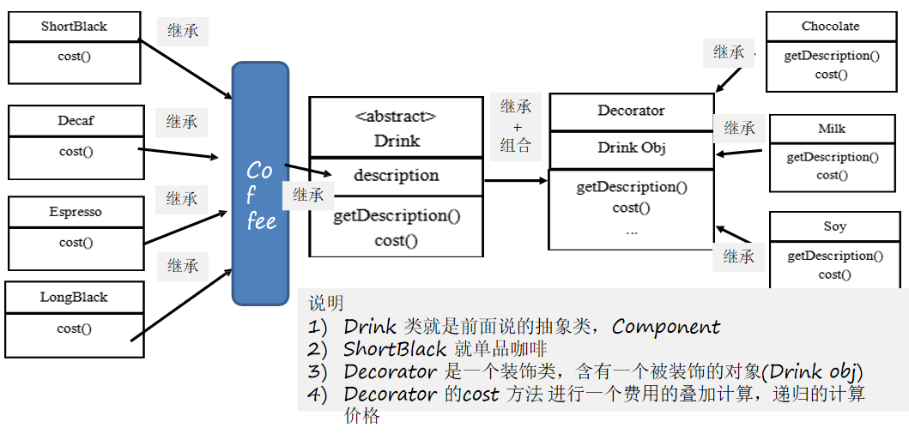

# 装饰者模式

## 问题引入

### 星巴克咖啡订单项目

1. 咖啡种类/单品咖啡：Espresso(意大利浓咖啡)、ShortBlack、LongBlack(美式咖啡)、Decaf(无因咖啡)
2. 调料：Milk、Soy(豆浆)、Chocolate
3. 要求在扩展新的咖啡种类时，具有良好的扩展性、改动方便、维护方便
4. 使用OO的来计算不同种类咖啡的费用: 客户可以点单品咖啡，也可以单品咖啡+调料组合。

#### 方案一


##### 方案一分析

1. Drink是一个抽象类，表示饮料。
2. des就是对咖啡的描述，如：咖啡的名字。
3. cost()方法就是计算费用，Drink类中做成一个抽象方法。
4. Decaf就是单品咖啡，继承Drink，并实现cost。
5. Espress&&Milk就是单品咖啡+调料，这个组合很多。
6. 问题：**这样设计，会有很多类，当增加一个单品咖啡，或者一个新的调料，类的数量就会倍增，就会出现类爆炸。**

#### 方案二

1. 方案一中因为咖啡单品+调料组合会造成类的倍增，可以将调料内置到Drink类，这样就不会造成类数量过多。从而提高项目的维护性。
2. milk，soy，chocolate可以设计为Boolean，表示是否要添加相应的调料。


##### 方案二分析

1. 可以控制类的数量，不至于造成很多的类
2. 在增加或者删除调料种类时，代码的维护量很大
3. 考虑到用户可以添加多份调料时，可以将hasMilk返回一个对应int

## 装饰者模式

### 装饰者模式定义

装饰者模式：**动态的将新功能附加到对象上。**在对象功能扩展方面，它比继承更有弹性，**装饰者模式也体现了开闭原则。**
### 原理
1. 装饰者模式就像打包一个快递

   主体：如：陶瓷、衣服（Component）→ 被装饰者

   包装：如：报纸填充、塑料泡沫、纸板、木板（Decorator）

2. Component主体：类似前面的Drink

3. ConcreteComponent（具体的主体：如前面的各个单品咖啡）和Decorator

4. Decorator：装饰者，如各种调料

   在Component与ConcreteComponent之间，如果ConcreteComponent类很多，可以设计一个缓冲层，将共有的部分提取出来，抽象层一个类。


### 实例

#### 类图




#### 代码

Decorator.java

```java
public class Decorator extends Drink {
	private Drink obj;
	
	public Decorator(Drink obj) { //组合
		this.obj = obj;
	}
	
	@Override
	public float cost() {
		// getPrice 自己价格
		return super.getPrice() + obj.cost();
	}
	
	@Override
	public String getDes() {
		// obj.getDes() 输出被装饰者的信息
		return des + " " + getPrice() + " && " + obj.getDes();
	}
}
```

Drink.java

```java
public abstract class Drink {

	public String des; // 描述
	private float price = 0.0f;
	public String getDes() {
		return des;
	}
	public void setDes(String des) {
		this.des = des;
	}
	public float getPrice() {
		return price;
	}
	public void setPrice(float price) {
		this.price = price;
	}
	
	//计算费用的抽象方法
	//子类来实现
	public abstract float cost();
	
}
```

Coffee.java

```java
public class Coffee  extends Drink {

	@Override
	public float cost() {
		return super.getPrice();
	}	
}
```

Espresso.java

```java
public class Espresso extends Coffee {
	
	public Espresso() {
		setDes(" 意大利咖啡 ");
		setPrice(6.0f);
	}
}
```

LongBlack.java

```java
public class LongBlack extends Coffee {

	public LongBlack() {
		setDes(" longblack ");
		setPrice(5.0f);
	}
}
```

ShortBlack.java

```java
public class ShortBlack extends Coffee{
	
	public ShortBlack() {
		setDes(" shortblack ");
		setPrice(4.0f);
	}
}
```

DeCaf.java

```java
public class DeCaf extends Coffee {

	public DeCaf() {
		setDes(" 无因咖啡 ");
		setPrice(1.0f);
	}
}
```

Chocolate.java

```java
//具体的Decorator， 这里就是调味品
public class Chocolate extends Decorator {

	public Chocolate(Drink obj) {
		super(obj);
		setDes(" 巧克力 ");
		setPrice(3.0f); // 调味品 的价格
	}

}
```

Milk.java

```java
public class Milk extends Decorator {

	public Milk(Drink obj) {
		super(obj);
		setDes(" 牛奶 ");
		setPrice(2.0f); 
	}

}
```

Soy.java

```java
public class Soy extends Decorator{

	public Soy(Drink obj) {
		super(obj);
		setDes(" 豆浆  ");
		setPrice(1.5f);
	}

}
```

CoffeeBar.java

```java
public class CoffeeBar {

	public static void main(String[] args) {
		// 装饰者模式下的订单：2份巧克力+一份牛奶的LongBlack

		// 1. 点一份 LongBlack
		Drink order = new LongBlack();
		System.out.println("费用1=" + order.cost());
		System.out.println("描述=" + order.getDes());

		// 2. order 加入一份牛奶
		order = new Milk(order);

		System.out.println("order 加入一份牛奶 费用 =" + order.cost());
		System.out.println("order 加入一份牛奶 描述 = " + order.getDes());

		// 3. order 加入一份巧克力

		order = new Chocolate(order);

		System.out.println("order 加入一份牛奶 加入一份巧克力  费用 =" + order.cost());
		System.out.println("order 加入一份牛奶 加入一份巧克力 描述 = " + order.getDes());

		// 3. order 加入一份巧克力

		order = new Chocolate(order);

		System.out.println("order 加入一份牛奶 加入2份巧克力   费用 =" + order.cost());
		System.out.println("order 加入一份牛奶 加入2份巧克力 描述 = " + order.getDes());
	
		System.out.println("===========================");
		
		Drink order2 = new DeCaf();
		
		System.out.println("order2 无因咖啡  费用 =" + order2.cost());
		System.out.println("order2 无因咖啡 描述 = " + order2.getDes());
		
		order2 = new Milk(order2);
		
		System.out.println("order2 无因咖啡 加入一份牛奶  费用 =" + order2.cost());
		System.out.println("order2 无因咖啡 加入一份牛奶 描述 = " + order2.getDes());

	}

}
```

## JDK中应用装饰模式的源码分析


```java
public class Decorator {

	public static void main(String[] args) throws Exception{
		//说明
		//1. InputStream 是抽象类, 类似我们前面讲的 Drink
		//2. FileInputStream 是  InputStream 子类，类似我们前面的 DeCaf, LongBlack
		//3. FilterInputStream  是  InputStream 子类：类似我们前面 的 Decorator 修饰者
		//4. DataInputStream 是 FilterInputStream 子类，具体的修饰者，类似前面的 Milk, Soy 等
		//5. FilterInputStream 类 有  protected volatile InputStream in; 即含被装饰者
		//6. 分析得出在jdk 的io体系中，就是使用装饰者模式
		
		DataInputStream dis = new DataInputStream(new FileInputStream("d:\\abc.txt"));
		System.out.println(dis.read());
		dis.close();
	}

}
```

