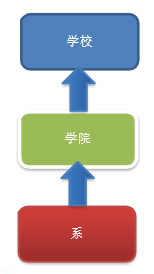
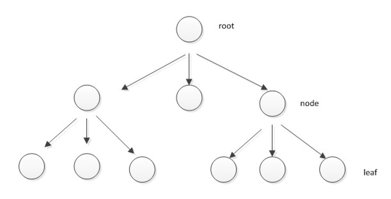
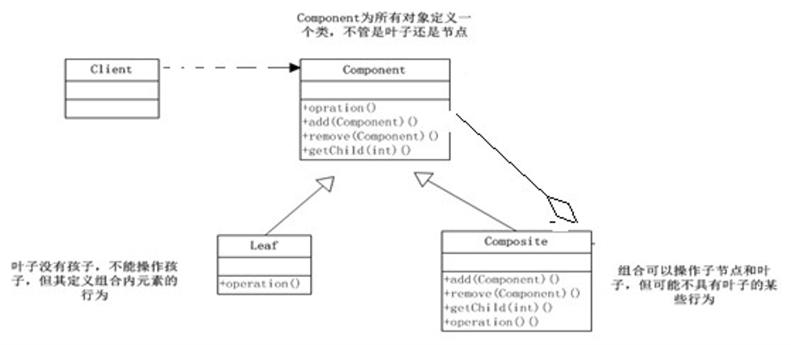
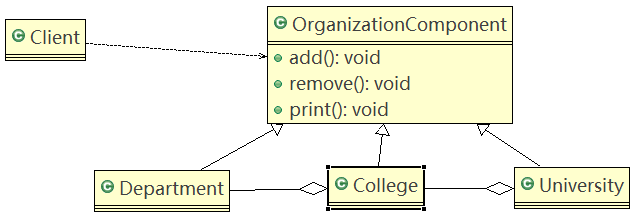
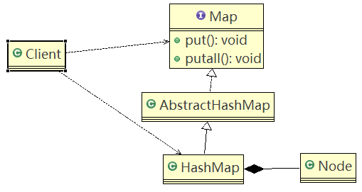

# 组合模式

## 问题引入

学校院系展示需求：在一个页面中展示出学校的院系组成，一个学校有多个学院，一个学院有多个系。

### 传统方案

#### 类图



##### 传统方案问题分析

1. 将学院看做是学校的子类，系是学院的子类，实际是站在组织大小来进行分层次的。
2. 实际上要求的是：在一个也页面中展示出学校的院系组成，一个学校有多个学院，一个学院有多个系，因此这种方案，不能很好实现管理操作，比如对学院、系的添加、删除、遍历等。
3. 解决方案：把学校、院、系都看做是组织结构，它们之间没有继承的关系，而是一个树形结构，可以更好的实现管理操作。→ 组合模式。

## 组合模式

### 基本介绍

1. 组合模式（Composite Pattern），又叫部分整体模式，它创建了对象组的树形结构，将对象组合成树状结构以表示“**整体→部分**”的层次关系。
2. **组合模式依据树形结构来组合对象，用来表示部分以及整体层次。**
3. **属于结构型模式**。
4. 组合模式使得**用户单个对象和组合对象的访问具有一致性**，即：组合能让客户以一致的方式处理个别对象以及组合对象。

### 解决的问题

当要处理的对象可以生成一颗树形结构，而要对树上的节点和叶子进行操作时，它能够提供一致的方式，而不用考虑它是节点还是叶子。



### 原理类图



#### 类图角色说明

1. **Component**：这是组合中对象声明的接口，在适当情况下，实现所有类共有的接口默认行为，用于访问和管理Component子部件，Component可以是抽象类或者接口。
2. **Leaf**：在组合中表示叶子结点，叶子节点没有子节点。
3. **Composite**：非叶子节点，用于存储子部件，在Component接口中实现子部件的相关操作。如：增加、删除。

### 应用实例

#### 类图



#### 代码

OrganizationComponent.java

```java
public abstract class OrganizationComponent {

	private String name; // 名字
	private String des; // 说明
	
	protected  void add(OrganizationComponent organizationComponent) {
		//默认实现
		throw new UnsupportedOperationException();
	}
	
	protected  void remove(OrganizationComponent organizationComponent) {
		//默认实现
		throw new UnsupportedOperationException();
	}

	//构造器
	public OrganizationComponent(String name, String des) {
		super();
		this.name = name;
		this.des = des;
	}

	public String getName() {
		return name;
	}

	public void setName(String name) {
		this.name = name;
	}

	public String getDes() {
		return des;
	}

	public void setDes(String des) {
		this.des = des;
	}
	
	//方法print, 做成抽象的, 子类都需要实现
	protected abstract void print();
}
```

University.java

```java
//University 就是 Composite , 可以管理College
public class University extends OrganizationComponent {

	List<OrganizationComponent> organizationComponents = new ArrayList<OrganizationComponent>();

	// 构造器
	public University(String name, String des) {
		super(name, des);
	}

	// 重写add
	@Override
	protected void add(OrganizationComponent organizationComponent) {
        organizationComponents.add(organizationComponent);
	}

	// 重写remove
	@Override
	protected void remove(OrganizationComponent organizationComponent) {
		organizationComponents.remove(organizationComponent);
	}

	@Override
	public String getName() {
		return super.getName();
	}

	@Override
	public String getDes() {
		return super.getDes();
	}

	// print方法，就是输出University 包含的学院
	@Override
	protected void print() {
		System.out.println("--------------" + getName() + "--------------");
		//遍历 organizationComponents 
		for (OrganizationComponent organizationComponent : organizationComponents) {
			organizationComponent.print();
		}
	}

}
```

College.java

```java
public class College extends OrganizationComponent {

	//List 中 存放的Department
	List<OrganizationComponent> organizationComponents = new ArrayList<OrganizationComponent>();

	// 构造器
	public College(String name, String des) {
		super(name, des);
	}

	// 重写add
	@Override
	protected void add(OrganizationComponent organizationComponent) {
		//  将来实际业务中，Colleage 的 add 和  University add 不一定完全一样
		organizationComponents.add(organizationComponent);
	}

	// 重写remove
	@Override
	protected void remove(OrganizationComponent organizationComponent) {
		organizationComponents.remove(organizationComponent);
	}

	@Override
	public String getName() {
		return super.getName();
	}

	@Override
	public String getDes() {
		return super.getDes();
	}

	// print方法，就是输出University 包含的学院
	@Override
	protected void print() {
		System.out.println("--------------" + getName() + "--------------");
		//遍历 organizationComponents 
		for (OrganizationComponent organizationComponent : organizationComponents) {
			organizationComponent.print();
		}
	}
}
```

Department.java

```java
public class Department extends OrganizationComponent {

	//没有集合
	public Department(String name, String des) {
		super(name, des);
	}

	//add , remove 就不用写了，因为他是叶子节点
	@Override
	public String getName() {
		return super.getName();
	}
	
	@Override
	public String getDes() {
		return super.getDes();
	}
	
	@Override
	protected void print() {
		System.out.println(getName());
	}

}
```

Client.java

```java
public class Client {

	public static void main(String[] args) {
		
		//从大到小创建对象 学校
		OrganizationComponent university = new University("清华大学", " 中国顶级大学 ");
		
		//创建 学院
		OrganizationComponent computerCollege = new College("计算机学院", " 计算机学院 ");
		OrganizationComponent infoEngineercollege = new College("信息工程学院", " 信息工程学院 ");
		
		
		//创建各个学院下面的系(专业)
		computerCollege.add(new Department("软件工程", " 软件工程不错 "));
		computerCollege.add(new Department("网络工程", " 网络工程不错 "));
		computerCollege.add(new Department("计算机科学与技术", " 计算机科学与技术是老牌的专业 "));
		
		//
		infoEngineercollege.add(new Department("通信工程", " 通信工程不好学 "));
		infoEngineercollege.add(new Department("信息工程", " 信息工程好学 "));
		
		//将学院加入到 学校
		university.add(computerCollege);
		university.add(infoEngineercollege);
		
		//university.print();
		infoEngineercollege.print();
	}

}
```

## JDK中使用组合模式的源码分析

Java的集合类HashMap使用了组合模式。

#### 类图



##### 源码

```java
public class Composite {

	public static void main(String[] args) {
		
		
		//说明
		//1. Map 就是一个抽象的构建 (类似我们的Component)
		//2. HashMap是一个中间的构建(Composite), 实现/继承了相关方法
		//   put, putall 
		//3. Node 是 HashMap的静态内部类，类似Leaf叶子节点, 这里就没有put, putall
		//   static class Node<K,V> implements Map.Entry<K,V>
		
		Map<Integer,String> hashMap=new HashMap<Integer,String>();
		hashMap.put(0, "东游记");//直接存放叶子节点(Node)
		
		Map<Integer,String> map=new HashMap<Integer,String>();
		map.put(1, "西游记");
		map.put(2, "红楼梦"); //..
		hashMap.putAll(map);
		System.out.println(hashMap);

	}

}
```

```java
public interface Map<K,V> {...}
```

```java
public class HashMap<K,V> extends AbstractMap<K,V>
    implements Map<K,V>, Cloneable, Serializable {
    ......
   /**
     * Basic hash bin node, used for most entries.  (See below for
     * TreeNode subclass, and in LinkedHashMap for its Entry subclass.)
     */
    static class Node<K,V> implements Map.Entry<K,V> {
        final int hash;
        final K key;
        V value;
        Node<K,V> next;

        Node(int hash, K key, V value, Node<K,V> next) {
            this.hash = hash;
            this.key = key;
            this.value = value;
            this.next = next;
        }

        public final K getKey()        { return key; }
        public final V getValue()      { return value; }
        public final String toString() { return key + "=" + value; }

        public final int hashCode() {
            return Objects.hashCode(key) ^ Objects.hashCode(value);
        }

        public final V setValue(V newValue) {
            V oldValue = value;
            value = newValue;
            return oldValue;
        }

        public final boolean equals(Object o) {
            if (o == this)
                return true;
            if (o instanceof Map.Entry) {
                Map.Entry<?,?> e = (Map.Entry<?,?>)o;
                if (Objects.equals(key, e.getKey()) &&
                    Objects.equals(value, e.getValue()))
                    return true;
            }
            return false;
        }
    }
    ......
}
```

## 注意事项和细节

1. 简化客户端操作。客户端只需要面对一致的对象而不用考虑整体部分或者节点叶子的问题。
2. 具有较强的扩展性。当要更改组合对象时，只需要调整内部的层次关系，客户端不用做出任何改动。
3. 方便创建出复杂的层次结构。客户端不用理会组合里面的组成细节，容易添加节点或者叶子从而创建出复杂的树形结构。
4. 需要**遍历组织机构**，或者**处理的对象具有树形结构时**，非常**适合使用组合模式**。
5. 要求较高的抽象性，如**节点和叶子有很多差异性**的话，如很多方法和属性都不一样，**不适合使用组合模式**。