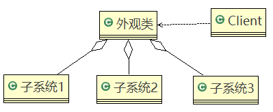
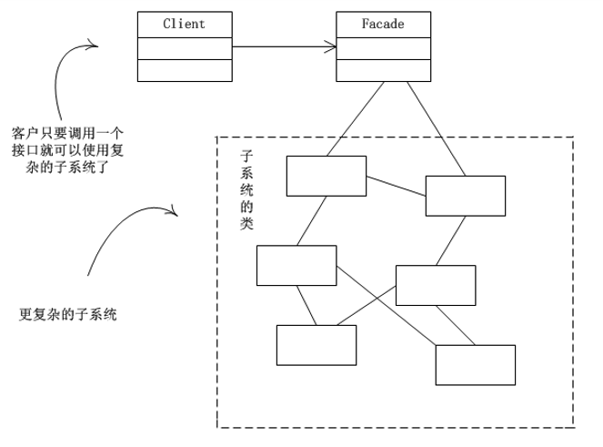
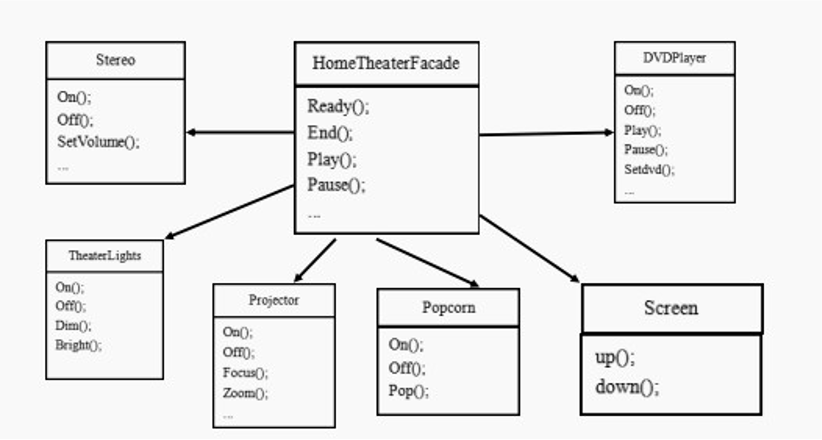
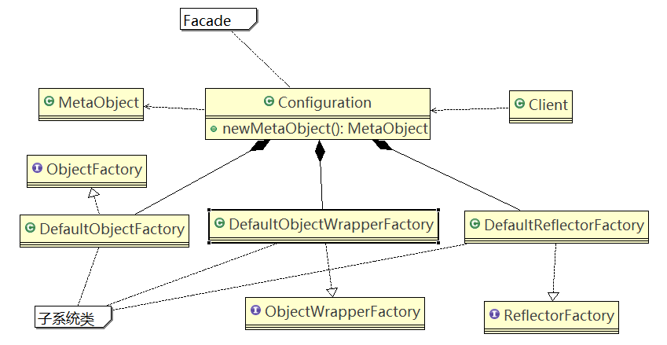

# 外观模式

## 问题引入

家庭影院管理：DVD播放器、投影仪、自动屏幕、环绕立体声、爆米花机,要求完成使用家庭影院的 功能，其过程为：

- 直接用遥控器：统筹各设备开关
- 开爆米花机
- 放下屏幕
- 开投影仪
- 开音响
- 开DVD，选dvd
- 去拿爆米花
- 调暗灯光
- 播放
- 观影结束后，关闭各种设备

### 传统方式解决影院管理


#### 传统方式解决影院管理问题分析

1. 在ClientTest的main方法中，创建各个子系统的对象，并直接去调用子系统（对象）相关方法，会造成调用过程混乱，没有清晰的过程。

2. 不利于在ClientTest中，去维护对子系统的操作。

3. 解决思路：**定义一个高层接口，给子系统中的一组接口提供一个一致的界面**（如：在高层接口提供四个方法ready、play、pause、end），用来访问子系统中的一群接口。

   也就是通过定义一个一致的接口（界面类），用以屏蔽内部子系统的细节，使得调用端只需跟这个接口发生调用，而无需关心这个子系统的内部细节 → 外观模式

## 外观模式

### 基本介绍

1. 外观模式（Facade），也叫“过程模式”：该模式为子系统的一组接口**提供一个一致的界面**，此模式定义了一个高层接口，这个接口使得这一子系统更加容易使用。
2. 外观模式通过定义一个一致的接口，**用以屏蔽内部子系统的细节，使得调用端只需跟这个接口发生调用**，为无需关心这个子系统的内部细节。

### 原理类图



#### 角色说明

1. 外观类（Facade）：为调用端提供统一的调用接口，外观类知道哪些子系统负责处理请求，从而将调用端的请求代理给适当子系统对象。
2. 调用者（Client）：外观接口的调用者。
3. 子系统的集合：指模块或者子系统，处理Facade对象指派的任务，他是功能的实际提供者。

### 应用示例

#### 外观模式解决影院管理说明

1. 外观模式可以理解为转换一群接口，客户只要调用一个接口，而不用调用多个接口才能达到目的。如：在PC上安装软件的时候经常有一键安装选项（省去选择安装目录、安装的组件等等），还有手机的重启功能（把关机和启动合为一个操作）。

2. 外观模就是解决多个复杂接口带来的使用困难，起到简化用户操作的作用。

3. 示意图

   

#### 外观模式解决管理影院的类图



##### 代码

DVDPlayer.java

```java
public class DVDPlayer {
	
	//使用单例模式, 使用饿汉式
	private static DVDPlayer instance = new DVDPlayer();
	
	public static DVDPlayer getInstanc() {
		return instance;
	}
	
	public void on() {
		System.out.println(" dvd on ");
	}
	public void off() {
		System.out.println(" dvd off ");
	}
	
	public void play() {
		System.out.println(" dvd is playing ");
	}
	
	//....
	public void pause() {
		System.out.println(" dvd pause ..");
	}
}
```

Popcorn.java

```java
public class Popcorn {
	
	private static Popcorn instance = new Popcorn();
	
	public static Popcorn getInstance() {
		return instance;
	}
	
	public void on() {
		System.out.println(" popcorn on ");
	}
	
	public void off() {
		System.out.println(" popcorn ff ");
	}
	
	public void pop() {
		System.out.println(" popcorn is poping  ");
	}
}
```

Projector.java

```java
public class Projector {

	private static Projector instance = new Projector();
	
	public static Projector getInstance() {
		return instance;
	}
	
	public void on() {
		System.out.println(" Projector on ");
	}
	
	public void off() {
		System.out.println(" Projector ff ");
	}
	
	public void focus() {
		System.out.println(" Projector is Projector  ");
	}
	
	//...
}
```

Screen.java

```java
public class Screen {

	private static Screen instance = new Screen();
	
	public static Screen getInstance() {
		return instance;
	}

	public void up() {
		System.out.println(" Screen up ");
	}
	
	public void down() {
		System.out.println(" Screen down ");
	}
}
```

Stereo.java

```java
public class Stereo {

	private static Stereo instance = new Stereo();
	
	public static Stereo getInstance() {
		return instance;
	}
	
	public void on() {
		System.out.println(" Stereo on ");
	}
	
	public void off() {
		System.out.println(" Screen off ");
	}
	
	public void up() {
		System.out.println(" Screen up.. ");
	}
	
	//...
}
```

TheaterLight.java

```java
public class TheaterLight {

	private static TheaterLight instance = new TheaterLight();

	public static TheaterLight getInstance() {
		return instance;
	}

	public void on() {
		System.out.println(" TheaterLight on ");
	}

	public void off() {
		System.out.println(" TheaterLight off ");
	}

	public void dim() {
		System.out.println(" TheaterLight dim.. ");
	}

	public void bright() {
		System.out.println(" TheaterLight bright.. ");
	}
}
```

HomeTheaterFacade.java

```java
public class HomeTheaterFacade {
	
	//定义各个子系统对象
	private TheaterLight theaterLight;
	private Popcorn popcorn;
	private Stereo stereo;
	private Projector projector;
	private Screen screen;
	private DVDPlayer dVDPlayer;
	
	//构造器
	public HomeTheaterFacade() {
		super();
		this.theaterLight = TheaterLight.getInstance();
		this.popcorn = Popcorn.getInstance();
		this.stereo = Stereo.getInstance();
		this.projector = Projector.getInstance();
		this.screen = Screen.getInstance();
		this.dVDPlayer = DVDPlayer.getInstanc();
	}

	//操作分成 4 步
	public void ready() {
		popcorn.on();
		popcorn.pop();
		screen.down();
		projector.on();
		stereo.on();
		dVDPlayer.on();
		theaterLight.dim();
	}
	
	public void play() {
		dVDPlayer.play();
	}
	
	public void pause() {
		dVDPlayer.pause();
	}
	
	public void end() {
		popcorn.off();
		theaterLight.bright();
		screen.up();
		projector.off();
		stereo.off();
		dVDPlayer.off();
	}
	
}
```

Client.java

```java
public class Client {

	public static void main(String[] args) {
		//这里直接调用。。 很麻烦
		HomeTheaterFacade homeTheaterFacade = new HomeTheaterFacade();
		homeTheaterFacade.ready();
		homeTheaterFacade.play();
		
		homeTheaterFacade.end();
	}

}
```

## MyBatis框架应用外观模式的源码分析

MyBatis中的Configuration去创建MetaObject对象使用到外观模式

#### 相关类类图



##### 源码

```java
public class Configuration {
    ...
  protected Properties variables = new Properties();
  protected ReflectorFactory reflectorFactory = new DefaultReflectorFactory();
  protected ObjectFactory objectFactory = new DefaultObjectFactory();
  protected ObjectWrapperFactory objectWrapperFactory = new DefaultObjectWrapperFactory();
  protected MapperRegistry mapperRegistry = new MapperRegistry(this);
    ...
    public MetaObject newMetaObject(Object object) {
    return MetaObject.forObject(object, objectFactory, objectWrapperFactory, reflectorFactory);
  }
    ...
}
```

```java
package org.apache.ibatis.reflection;

import java.util.Collection;
import java.util.List;
import java.util.Map;

import org.apache.ibatis.reflection.factory.ObjectFactory;
import org.apache.ibatis.reflection.property.PropertyTokenizer;
import org.apache.ibatis.reflection.wrapper.BeanWrapper;
import org.apache.ibatis.reflection.wrapper.CollectionWrapper;
import org.apache.ibatis.reflection.wrapper.MapWrapper;
import org.apache.ibatis.reflection.wrapper.ObjectWrapper;
import org.apache.ibatis.reflection.wrapper.ObjectWrapperFactory;

/**
 * @author Clinton Begin
 */
public class MetaObject {

  private Object originalObject;
  private ObjectWrapper objectWrapper;
  private ObjectFactory objectFactory;
  private ObjectWrapperFactory objectWrapperFactory;
  private ReflectorFactory reflectorFactory;

  private MetaObject(Object object, ObjectFactory objectFactory, ObjectWrapperFactory objectWrapperFactory, ReflectorFactory reflectorFactory) {
    this.originalObject = object;
    this.objectFactory = objectFactory;
    this.objectWrapperFactory = objectWrapperFactory;
    this.reflectorFactory = reflectorFactory;

    if (object instanceof ObjectWrapper) {
      this.objectWrapper = (ObjectWrapper) object;
    } else if (objectWrapperFactory.hasWrapperFor(object)) {
      this.objectWrapper = objectWrapperFactory.getWrapperFor(this, object);
    } else if (object instanceof Map) {
      this.objectWrapper = new MapWrapper(this, (Map) object);
    } else if (object instanceof Collection) {
      this.objectWrapper = new CollectionWrapper(this, (Collection) object);
    } else {
      this.objectWrapper = new BeanWrapper(this, object);
    }
  }

  public static MetaObject forObject(Object object, ObjectFactory objectFactory, ObjectWrapperFactory objectWrapperFactory, ReflectorFactory reflectorFactory) {
    if (object == null) {
      return SystemMetaObject.NULL_META_OBJECT;
    } else {
      return new MetaObject(object, objectFactory, objectWrapperFactory, reflectorFactory);
    }
  }

  public ObjectFactory getObjectFactory() {
    return objectFactory;
  }

  public ObjectWrapperFactory getObjectWrapperFactory() {
    return objectWrapperFactory;
  }

  public ReflectorFactory getReflectorFactory() {
	return reflectorFactory;
  }

  public Object getOriginalObject() {
    return originalObject;
  }

  public String findProperty(String propName, boolean useCamelCaseMapping) {
    return objectWrapper.findProperty(propName, useCamelCaseMapping);
  }

  public String[] getGetterNames() {
    return objectWrapper.getGetterNames();
  }

  public String[] getSetterNames() {
    return objectWrapper.getSetterNames();
  }

  public Class<?> getSetterType(String name) {
    return objectWrapper.getSetterType(name);
  }

  public Class<?> getGetterType(String name) {
    return objectWrapper.getGetterType(name);
  }

  public boolean hasSetter(String name) {
    return objectWrapper.hasSetter(name);
  }

  public boolean hasGetter(String name) {
    return objectWrapper.hasGetter(name);
  }

  public Object getValue(String name) {
    PropertyTokenizer prop = new PropertyTokenizer(name);
    if (prop.hasNext()) {
      MetaObject metaValue = metaObjectForProperty(prop.getIndexedName());
      if (metaValue == SystemMetaObject.NULL_META_OBJECT) {
        return null;
      } else {
        return metaValue.getValue(prop.getChildren());
      }
    } else {
      return objectWrapper.get(prop);
    }
  }

  public void setValue(String name, Object value) {
    PropertyTokenizer prop = new PropertyTokenizer(name);
    if (prop.hasNext()) {
      MetaObject metaValue = metaObjectForProperty(prop.getIndexedName());
      if (metaValue == SystemMetaObject.NULL_META_OBJECT) {
        if (value == null && prop.getChildren() != null) {
          // don't instantiate child path if value is null
          return;
        } else {
          metaValue = objectWrapper.instantiatePropertyValue(name, prop, objectFactory);
        }
      }
      metaValue.setValue(prop.getChildren(), value);
    } else {
      objectWrapper.set(prop, value);
    }
  }

  public MetaObject metaObjectForProperty(String name) {
    Object value = getValue(name);
    return MetaObject.forObject(value, objectFactory, objectWrapperFactory, reflectorFactory);
  }

  public ObjectWrapper getObjectWrapper() {
    return objectWrapper;
  }

  public boolean isCollection() {
    return objectWrapper.isCollection();
  }

  public void add(Object element) {
    objectWrapper.add(element);
  }

  public <E> void addAll(List<E> list) {
    objectWrapper.addAll(list);
  }

}
```

## 注意事项和细节

1. 外观模式**对外屏蔽了子系统的细节**，因此外观模式降低了客户端对子系统使用的复杂性。
2. 外观模式对客户端与子系统的耦合关系进行了解耦，让子系统内部的模块更易维护和扩展。
3. 通过合理的使用外观模式，可以更好的**划分访问的层次**。
4. 当系统需要进行分层设计时，可以考虑使用Facade模式。
5. 在维护一个遗留的大型系统时，可能这个系统已经变得非常难以维护和扩展，此时可以考虑为新系统开发一个Facade类，来提供遗留系统的比较清晰简单的接口，让新系统与Facade类交互，提高复用性。
6. 不能过多的或者不合理的使用外观模式，不管是使用外观模式好，还是直接调用模块好。要以让系统有层次，利于维护为目的。