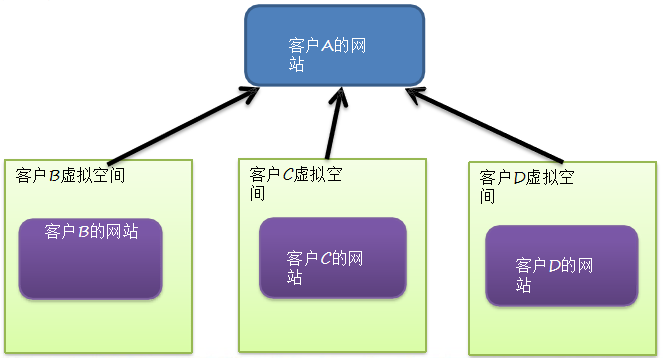
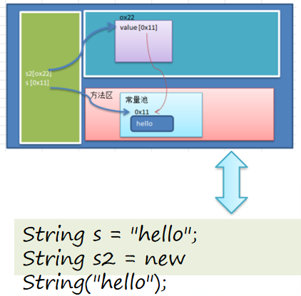
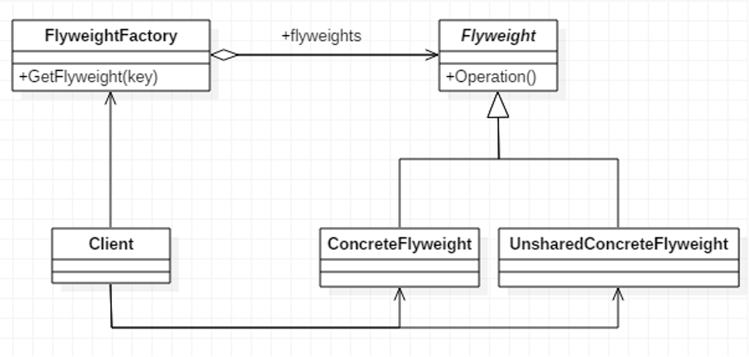
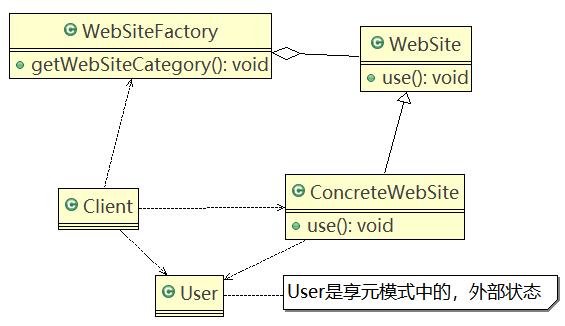

# 享元模式

## 需求引入

外包项目，给客户A做一个产品展示网站，客户A的朋友感觉效果不错，也希望做这样的产品展示网站，但是要求都有些不同：

1. 有客户要求以新闻的形式发布
2. 有客户人要求以博客的形式发布
3. 有客户希望以微信公众号的形式发布

### 传统方案

1. 直接复制粘贴一份，然后根据客户不同要求，进行定制修改。

2. 给每个网站租用一个空间。

3. 方案设计示意图

   

#### 传统方案问题分析

1. 需要的网站结构相似度很高，而且都不是高访问量网站，如果分成多个虚拟空间来处理，相当于一个相同网站的实例对象很多，造成服务器的资源浪费。
2. 解决思路：整合到一个网站中，共享其相关的代码和数据，对于硬盘、内存、CPU、数据库空间等服务器资源都可以达成共享，减少服务器资源浪费。
3. 对于代码来说，由于是一份实例，维护和扩展都更加容易。
4. 可以使用**享元模式**解决。

## 享元模式

### 介绍

1. 享元模式（Flyweight Pattern）也叫蝇量模式：运用共享技术有效地支持大量细粒度的对象。

2. 常用于系统底层开发，解决系统的性能问题。像数据库连接池，里面都是创建好的连接对象，在这些连接对象中有我们需要的则直接拿来用，避免重新创建，如果没有我们需要的，则创建一个。

3. 享元模式能够解决重复对象的内存浪费的问题，当系统中有大量相似对象，需要缓冲池时。不需总是创建新对象，可以从缓冲池里拿。这样可以降低系统内存，同时提高效率。

4. 享元模式经典的应用场景就是池技术了，String常量池、数据库连接池、缓冲池等等都是享元模式的应用，享元模式是池技术的重要实现方式。

   

### 原理类图



#### 类图说明

1. **FlyWeight**是抽象的享元角色，它是产品的抽象类，同时定义出对象的外部状态和内部状态的接口或实现。
2. **ConcreteFlyWeight**是具体的享元角色，是具体的产品类，实现抽象角色定义相关业务。
3. **UnSharedConcreteFlyWeight**是不可共享的角色，一般不会出现在享元工厂。
4. **FlyWeightFactory**享元工厂类，用于构建一个池容器（集合），同时提供从池中获取对象方法。

### 内部状态和外部状态

1. 享元模式提出了两个要求：细粒度和共享对象。将对象的信息分为两个部分：
   1. **内部状态**指对象共享出来的信息，**存储在享元对象内部且不会随环境的改变而改变。**（如：棋子的颜色是棋子的内部状态）
   2. **外部状态指对象得以依赖的一个标记，是随环境改变而改变的、不可共享的状态。**（如：棋子在棋盘上的位置【坐标】就是棋子的外部状态）
2. 例如：围棋理论上有361个空位可以放棋子，每盘棋都有可能两三百个棋子对象产生，因为内存空间有限，一台服务器很难支持更多的玩家玩围棋游戏，如果用享元模式来处理棋子，那么棋子对象就可以减少到只有两个实例，这样就很好的解决了对象的开销问题。

### 应用实例

#### 类图



#### 代码实现

WebSite.java

```java
public abstract class WebSite {

	public abstract void use(User user);//抽象方法
}
```

ConcreteWebSite.java

```java
//具体网站
public class ConcreteWebSite extends WebSite {

	//共享的部分，内部状态
	private String type = ""; //网站发布的形式(类型)

	//构造器
	public ConcreteWebSite(String type) {
		
		this.type = type;
	}

	@Override
	public void use(User user) {
		System.out.println("网站的发布形式为:" + type + " 在使用中 .. 使用者是" + user.getName());
	}
}
```

WebSiteFactory.java

```java
// 网站工厂类，根据需要返回压一个网站
public class WebSiteFactory {

	//集合， 充当池的作用
	private HashMap<String, ConcreteWebSite> pool = new HashMap<>();
	
	//根据网站的类型，返回一个网站, 如果没有就创建一个网站，并放入到池中,并返回
	public WebSite getWebSiteCategory(String type) {
		if(!pool.containsKey(type)) {
			//就创建一个网站，并放入到池中
			pool.put(type, new ConcreteWebSite(type));
		}
		
		return (WebSite)pool.get(type);
	}
	
	//获取网站分类的总数 (池中有多少个网站类型)
	public int getWebSiteCount() {
		return pool.size();
	}
}
```

User.java

```java
public class User {
	
	private String name;

	public User(String name) {
		super();
		this.name = name;
	}

	public String getName() {
		return name;
	}

	public void setName(String name) {
		this.name = name;
	}
}
```

Client.java

```java
public class Client {

	public static void main(String[] args) {

		// 创建一个工厂类
		WebSiteFactory factory = new WebSiteFactory();

		// 客户要一个以新闻形式发布的网站
		WebSite webSite1 = factory.getWebSiteCategory("新闻");

		webSite1.use(new User("tom"));

		// 客户要一个以博客形式发布的网站
		WebSite webSite2 = factory.getWebSiteCategory("博客");

		webSite2.use(new User("jack"));

		// 客户要一个以博客形式发布的网站
		WebSite webSite3 = factory.getWebSiteCategory("博客");

		webSite3.use(new User("smith"));

		// 客户要一个以博客形式发布的网站
		WebSite webSite4 = factory.getWebSiteCategory("博客");

		webSite4.use(new User("king"));
		
		System.out.println("网站的分类共=" + factory.getWebSiteCount());
	}

}
```

## JDK中Interger应用享元模式的源码分析

#### 源码

```java
public final class Integer extends Number implements Comparable<Integer> {
    ...
        /**
     * Cache to support the object identity semantics of autoboxing for values between
     * -128 and 127 (inclusive) as required by JLS.
     *
     * The cache is initialized on first usage.  The size of the cache
     * may be controlled by the {@code -XX:AutoBoxCacheMax=<size>} option.
     * During VM initialization, java.lang.Integer.IntegerCache.high property
     * may be set and saved in the private system properties in the
     * sun.misc.VM class.
     */
    private static class IntegerCache {
        static final int low = -128;
        static final int high;
        static final Integer cache[];

        static {
            // high value may be configured by property
            int h = 127;
            String integerCacheHighPropValue =
                sun.misc.VM.getSavedProperty("java.lang.Integer.IntegerCache.high");
            if (integerCacheHighPropValue != null) {
                try {
                    int i = parseInt(integerCacheHighPropValue);
                    i = Math.max(i, 127);
                    // Maximum array size is Integer.MAX_VALUE
                    h = Math.min(i, Integer.MAX_VALUE - (-low) -1);
                } catch( NumberFormatException nfe) {
                    // If the property cannot be parsed into an int, ignore it.
                }
            }
            high = h;

            cache = new Integer[(high - low) + 1];
            int j = low;
            for(int k = 0; k < cache.length; k++)
                cache[k] = new Integer(j++);

            // range [-128, 127] must be interned (JLS7 5.1.7)
            assert IntegerCache.high >= 127;
        }

        private IntegerCache() {}
    }

    /**
     * Returns an {@code Integer} instance representing the specified
     * {@code int} value.  If a new {@code Integer} instance is not
     * required, this method should generally be used in preference to
     * the constructor {@link #Integer(int)}, as this method is likely
     * to yield significantly better space and time performance by
     * caching frequently requested values.
     *
     * This method will always cache values in the range -128 to 127,
     * inclusive, and may cache other values outside of this range.
     *
     * @param  i an {@code int} value.
     * @return an {@code Integer} instance representing {@code i}.
     * @since  1.5
     */
    public static Integer valueOf(int i) {
        if (i >= IntegerCache.low && i <= IntegerCache.high)
            return IntegerCache.cache[i + (-IntegerCache.low)];
        return new Integer(i);
    }
    
    /**
     * The value of the {@code Integer}.
     *
     * @serial
     */
    private final int value;

    /**
     * Constructs a newly allocated {@code Integer} object that
     * represents the specified {@code int} value.
     *
     * @param   value   the value to be represented by the
     *                  {@code Integer} object.
     */
    public Integer(int value) {
        this.value = value;
    }
    ...
}
```

```java
public class FlyWeight {

	public static void main(String[] args) {
		//如果 Integer.valueOf(x) x 在  -128 --- 127 直接，就是使用享元模式返回,如果不在
		//范围类，则仍然 new 
		
		//小结:
		//1. 在valueOf 方法中，先判断值是否在 IntegerCache 中，如果不在，就创建新的Integer(new), 否则，就直接从 缓存池返回
		//2. valueOf 方法，就使用到享元模式
		//3. 如果使用valueOf 方法得到一个Integer 实例，范围在 -128 - 127 ，执行速度比 new 快
		
		Integer x = Integer.valueOf(127); // 得到 x实例，类型 Integer
		Integer y = new Integer(127); // 得到 y 实例，类型 Integer
		Integer z = Integer.valueOf(127);//..
		Integer w = new Integer(127);
		
		System.out.println(x.equals(y)); // 大小，true
		System.out.println(x == y ); //  false
		System.out.println(x == z ); // true
		System.out.println(w == x ); // false
		System.out.println(w == y ); // false
		
		Integer x1 = Integer.valueOf(200);
		Integer x2 = Integer.valueOf(200);
		System.out.println("x1==x2" + (x1 == x2)); // false
	}

}
```

## 注意事项和细节

1. 在享元模式这样理解，“享”表示共享，“元”表示对象。
2. 系统中有大量对象，这些对象消耗大量内存，并且对象的状态大部分可以外部化时，可以考虑选用享元模式。
3. 用唯一标识码判断，如果在内存中有，则返回这个唯一标识码所标识的对象，用HashMap/HashTable存储。
4. 享元模式大大减少了对象的创建，降低了程序内存的占用，提高效率。
5. 享元模式提高了**系统的复杂度**。需要分离出**内部状态和外部状态**，而外部状态具有固化特性，不应该随着内部状态的改变而改变，这是使用该模式需要注意的地方。
6. 使用享元模式时，注意划分内部状态和外部状态，并且需要有一个工厂类加以控制。
7. 享元模式经典的应用场景是需要缓冲池的场景，比如String常量池、数据库连接池。