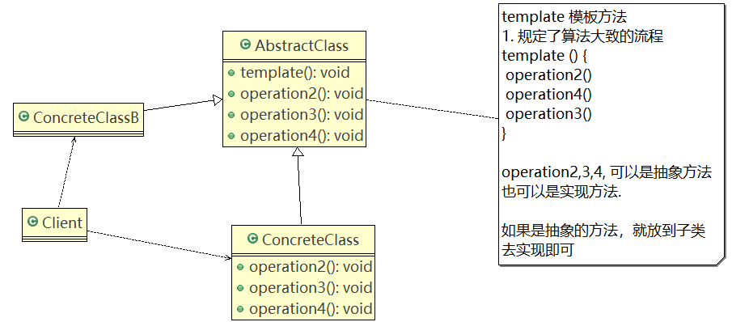
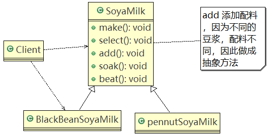
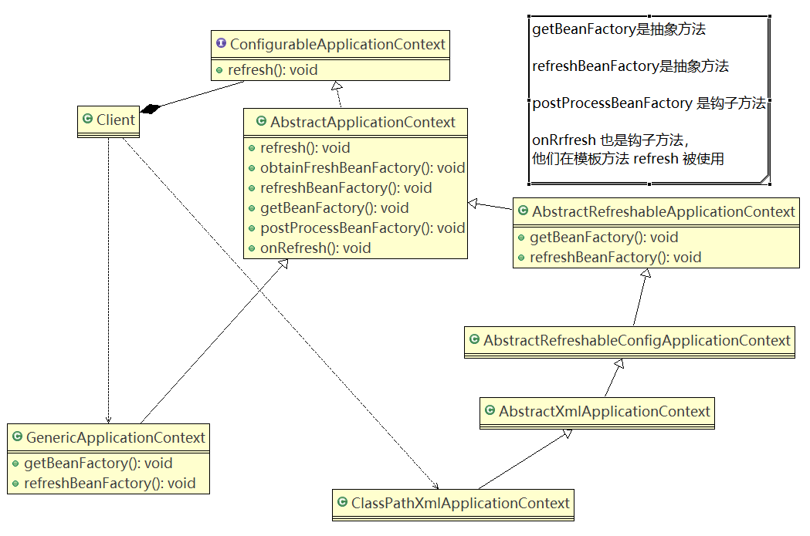

# 模板模式

## 问题引入

编写制作豆浆的程序：

1. 制作豆浆的流程：选材 → 添加配料 → 浸泡 → 放到豆浆机里打碎
2. 通过添加不同的配料，可以制作出不同口味的豆浆。
3. 选材、浸泡和放到豆浆机打碎这些步骤对于每种口味的豆浆都是一样的。

## 基本介绍

1. 模板方法模式（Template Method Pattern）：又称模板模式（Template Pattern），在一个抽象类公开定义了执行它的方法的模板。它的子类可以按需要重写方法实现，但调用将以抽象类中定义的方式进行。
2. 简单说，模板方法模式定义一个操作中的算法的骨架，而将一些步骤延迟到子类中，使得子类可以不改变一个算法的结构，就可以重定义该算法的某些特定步骤。
3. 属于行为型模式。

### 原理类图



#### 角色说明

1. **AbstractClass 抽象类**，类中实现了模板方法（template），定义了算法的骨架，具体子类需要去实现其它的抽象方法。
2. **ConcreteClass**实现抽象方法，以完成算法中特点子类的步骤。

### 应用实例

#### 类图



#### 代码

SoyaMilk.java

```java
//抽象类，表示豆浆
public abstract class SoyaMilk {

	//模板方法, make , 模板方法可以做成final , 不让子类去覆盖.
	final void make() {
		select(); 
		addCondiments();
		soak();
		beat();
		
	}
	
	//选材料
	void select() {
		System.out.println("第一步：选择好的新鲜黄豆  ");
	}
	
	//添加不同的配料， 抽象方法, 子类具体实现
	abstract void addCondiments();
	
	//浸泡
	void soak() {
		System.out.println("第三步， 黄豆和配料开始浸泡， 需要3小时 ");
	}
	 
	void beat() {
		System.out.println("第四步：黄豆和配料放到豆浆机去打碎  ");
	}
}
```

PeanutSoyaMilk.java

```java
public class PeanutSoyaMilk extends SoyaMilk {

	@Override
	void addCondiments() {
		System.out.println(" 加入上好的花生 ");
	}

}
```

RedBeanSoyaMilk.java

```java
public class RedBeanSoyaMilk extends SoyaMilk {

	@Override
	void addCondiments() {
		System.out.println(" 加入上好的红豆 ");
	}

}
```

Client.java

```java
public class Client {

	public static void main(String[] args) {
		//制作红豆豆浆
		System.out.println("----制作红豆豆浆----");
		SoyaMilk redBeanSoyaMilk = new RedBeanSoyaMilk();
		redBeanSoyaMilk.make();
		
		System.out.println("----制作花生豆浆----");
		SoyaMilk peanutSoyaMilk = new PeanutSoyaMilk();
		peanutSoyaMilk.make();
	}

}
```

### 钩子方法

在模板方法模式的**父类**中，可以定义一个方法，默认不做任何事，子类可以视情况要不要覆盖它，这种方法称为“钩子”。

#### 代码

```java
//抽象类，表示豆浆
public abstract class SoyaMilk {

	//模板方法, make , 模板方法可以做成final , 不让子类去覆盖.
	final void make() {
		select(); 
		if(customerWantCondiments()) {
			addCondiments();
		}
		soak();
		beat();
		
	}
	
	//选材料
	void select() {
		System.out.println("第一步：选择好的新鲜黄豆  ");
	}
	
	//添加不同的配料， 抽象方法, 子类具体实现
	abstract void addCondiments();
	
	//浸泡
	void soak() {
		System.out.println("第三步， 黄豆和配料开始浸泡， 需要3小时 ");
	}
	 
	void beat() {
		System.out.println("第四步：黄豆和配料放到豆浆机去打碎  ");
	}
	
	//钩子方法，决定是否需要添加配料
	boolean customerWantCondiments() {
		return true;
	}
}
```

```java
public class PureSoyaMilk extends SoyaMilk{

	@Override
	void addCondiments() {
		//空实现
	}
	
	@Override
	boolean customerWantCondiments() {
		return false;
	}
 
}
```

```java
public class Client {

	public static void main(String[] args) {
		System.out.println("----制作红豆豆浆----");
		SoyaMilk redBeanSoyaMilk = new RedBeanSoyaMilk();
		redBeanSoyaMilk.make();
		
		System.out.println("----制作花生豆浆----");
		SoyaMilk peanutSoyaMilk = new PeanutSoyaMilk();
		peanutSoyaMilk.make();
		
		System.out.println("----制作纯豆浆----");
		SoyaMilk pureSoyaMilk = new PureSoyaMilk();
		pureSoyaMilk.make();
	}

}
```

## Spring框架使用模板模式的源码分析

Spring IOC容器初始化时运用到的模板方法模式。



源码

```java
public interface ConfigurableApplicationContext extends ApplicationContext, Lifecycle, Closeable {
    ...
        void refresh() throws BeansException, IllegalStateException;
    ...
}
```

```java
public abstract class AbstractApplicationContext extends DefaultResourceLoader
		implements ConfigurableApplicationContext, DisposableBean {
    ...
        protected ConfigurableListableBeanFactory obtainFreshBeanFactory() {
		refreshBeanFactory();
		ConfigurableListableBeanFactory beanFactory = getBeanFactory();
		if (logger.isDebugEnabled()) {
			logger.debug("Bean factory for " + getDisplayName() + ": " + beanFactory);
		}
		return beanFactory;
	}
    
    ...
        
        public void refresh() throws BeansException, IllegalStateException {
        synchronized (this.startupShutdownMonitor) {
            // Prepare this context for refreshing.
            prepareRefresh();

            // Tell the subclass to refresh the internal bean factory.
            ConfigurableListableBeanFactory beanFactory = obtainFreshBeanFactory();

            // Prepare the bean factory for use in this context.
            prepareBeanFactory(beanFactory);

            try {
                // Allows post-processing of the bean factory in context subclasses.
                postProcessBeanFactory(beanFactory);

                // Invoke factory processors registered as beans in the context.
                invokeBeanFactoryPostProcessors(beanFactory);

                // Register bean processors that intercept bean creation.
                registerBeanPostProcessors(beanFactory);

                // Initialize message source for this context.
                initMessageSource();

                // Initialize event multicaster for this context.
                initApplicationEventMulticaster();

                // Initialize other special beans in specific context subclasses.
                onRefresh();

                // Check for listener beans and register them.
                registerListeners();

                // Instantiate all remaining (non-lazy-init) singletons.
                finishBeanFactoryInitialization(beanFactory);

                // Last step: publish corresponding event.
                finishRefresh();
            }

            catch (BeansException ex) {
                // Destroy already created singletons to avoid dangling resources.
                destroyBeans();

                // Reset 'active' flag.
                cancelRefresh(ex);

                // Propagate exception to caller.
                throw ex;
            }
        }
    }
	...
}
```

```java
public class GenericApplicationContext extends AbstractApplicationContext implements BeanDefinitionRegistry {
	...
        
        @Override
	protected final void refreshBeanFactory() throws IllegalStateException {
		if (this.refreshed) {
			throw new IllegalStateException(
					"GenericApplicationContext does not support multiple refresh attempts: just call 'refresh' once");
		}
		this.beanFactory.setSerializationId(getId());
		this.refreshed = true;
	}
    
    ...
        
        @Override
	public final ConfigurableListableBeanFactory getBeanFactory() {
		return this.beanFactory;
	}
    
    ...
}
```

```java
public abstract class AbstractRefreshableApplicationContext extends AbstractApplicationContext {

	private Boolean allowBeanDefinitionOverriding;

	private Boolean allowCircularReferences;

	/** Bean factory for this context */
	private DefaultListableBeanFactory beanFactory;

	/** Synchronization monitor for the internal BeanFactory */
	private final Object beanFactoryMonitor = new Object();


	/**
	 * Create a new AbstractRefreshableApplicationContext with no parent.
	 */
	public AbstractRefreshableApplicationContext() {
	}

	/**
	 * Create a new AbstractRefreshableApplicationContext with the given parent context.
	 * @param parent the parent context
	 */
	public AbstractRefreshableApplicationContext(ApplicationContext parent) {
		super(parent);
	}


	/**
	 * Set whether it should be allowed to override bean definitions by registering
	 * a different definition with the same name, automatically replacing the former.
	 * If not, an exception will be thrown. Default is "true".
	 * @see org.springframework.beans.factory.support.DefaultListableBeanFactory#setAllowBeanDefinitionOverriding
	 */
	public void setAllowBeanDefinitionOverriding(boolean allowBeanDefinitionOverriding) {
		this.allowBeanDefinitionOverriding = allowBeanDefinitionOverriding;
	}

	/**
	 * Set whether to allow circular references between beans - and automatically
	 * try to resolve them.
	 * <p>Default is "true". Turn this off to throw an exception when encountering
	 * a circular reference, disallowing them completely.
	 * @see org.springframework.beans.factory.support.DefaultListableBeanFactory#setAllowCircularReferences
	 */
	public void setAllowCircularReferences(boolean allowCircularReferences) {
		this.allowCircularReferences = allowCircularReferences;
	}


	/**
	 * This implementation performs an actual refresh of this context's underlying
	 * bean factory, shutting down the previous bean factory (if any) and
	 * initializing a fresh bean factory for the next phase of the context's lifecycle.
	 */
	@Override
	protected final void refreshBeanFactory() throws BeansException {
		if (hasBeanFactory()) {
			destroyBeans();
			closeBeanFactory();
		}
		try {
			DefaultListableBeanFactory beanFactory = createBeanFactory();
			beanFactory.setSerializationId(getId());
			customizeBeanFactory(beanFactory);
			loadBeanDefinitions(beanFactory);
			synchronized (this.beanFactoryMonitor) {
				this.beanFactory = beanFactory;
			}
		}
		catch (IOException ex) {
			throw new ApplicationContextException("I/O error parsing bean definition source for " + getDisplayName(), ex);
		}
	}

	@Override
	protected void cancelRefresh(BeansException ex) {
		synchronized (this.beanFactoryMonitor) {
			if (this.beanFactory != null)
				this.beanFactory.setSerializationId(null);
		}
		super.cancelRefresh(ex);
	}

	@Override
	protected final void closeBeanFactory() {
		synchronized (this.beanFactoryMonitor) {
			this.beanFactory.setSerializationId(null);
			this.beanFactory = null;
		}
	}

	/**
	 * Determine whether this context currently holds a bean factory,
	 * i.e. has been refreshed at least once and not been closed yet.
	 */
	protected final boolean hasBeanFactory() {
		synchronized (this.beanFactoryMonitor) {
			return (this.beanFactory != null);
		}
	}

	@Override
	public final ConfigurableListableBeanFactory getBeanFactory() {
		synchronized (this.beanFactoryMonitor) {
			if (this.beanFactory == null) {
				throw new IllegalStateException("BeanFactory not initialized or already closed - " +
						"call 'refresh' before accessing beans via the ApplicationContext");
			}
			return this.beanFactory;
		}
	}

	/**
	 * Overridden to turn it into a no-op: With AbstractRefreshableApplicationContext,
	 * {@link #getBeanFactory()} serves a strong assertion for an active context anyway.
	 */
	@Override
	protected void assertBeanFactoryActive() {
	}

	/**
	 * Create an internal bean factory for this context.
	 * Called for each {@link #refresh()} attempt.
	 * <p>The default implementation creates a
	 * {@link org.springframework.beans.factory.support.DefaultListableBeanFactory}
	 * with the {@linkplain #getInternalParentBeanFactory() internal bean factory} of this
	 * context's parent as parent bean factory. Can be overridden in subclasses,
	 * for example to customize DefaultListableBeanFactory's settings.
	 * @return the bean factory for this context
	 * @see org.springframework.beans.factory.support.DefaultListableBeanFactory#setAllowBeanDefinitionOverriding
	 * @see org.springframework.beans.factory.support.DefaultListableBeanFactory#setAllowEagerClassLoading
	 * @see org.springframework.beans.factory.support.DefaultListableBeanFactory#setAllowCircularReferences
	 * @see org.springframework.beans.factory.support.DefaultListableBeanFactory#setAllowRawInjectionDespiteWrapping
	 */
	protected DefaultListableBeanFactory createBeanFactory() {
		return new DefaultListableBeanFactory(getInternalParentBeanFactory());
	}

	/**
	 * Customize the internal bean factory used by this context.
	 * Called for each {@link #refresh()} attempt.
	 * <p>The default implementation applies this context's
	 * {@linkplain #setAllowBeanDefinitionOverriding "allowBeanDefinitionOverriding"}
	 * and {@linkplain #setAllowCircularReferences "allowCircularReferences"} settings,
	 * if specified. Can be overridden in subclasses to customize any of
	 * {@link DefaultListableBeanFactory}'s settings.
	 * @param beanFactory the newly created bean factory for this context
	 * @see DefaultListableBeanFactory#setAllowBeanDefinitionOverriding
	 * @see DefaultListableBeanFactory#setAllowCircularReferences
	 * @see DefaultListableBeanFactory#setAllowRawInjectionDespiteWrapping
	 * @see DefaultListableBeanFactory#setAllowEagerClassLoading
	 */
	protected void customizeBeanFactory(DefaultListableBeanFactory beanFactory) {
		if (this.allowBeanDefinitionOverriding != null) {
			beanFactory.setAllowBeanDefinitionOverriding(this.allowBeanDefinitionOverriding);
		}
		if (this.allowCircularReferences != null) {
			beanFactory.setAllowCircularReferences(this.allowCircularReferences);
		}
	}

	/**
	 * Load bean definitions into the given bean factory, typically through
	 * delegating to one or more bean definition readers.
	 * @param beanFactory the bean factory to load bean definitions into
	 * @throws BeansException if parsing of the bean definitions failed
	 * @throws IOException if loading of bean definition files failed
	 * @see org.springframework.beans.factory.support.PropertiesBeanDefinitionReader
	 * @see org.springframework.beans.factory.xml.XmlBeanDefinitionReader
	 */
	protected abstract void loadBeanDefinitions(DefaultListableBeanFactory beanFactory)
			throws BeansException, IOException;

}
```

## 注意事项和细节

1. 基本思想：**算法只存在于**一个地方，也就是**父类中**，容易修改。需要修改算法时，只要修改父类的模板方法或者已经实现的某些步骤，子类就会继承这些修改。
2. 实现了最大化代码复用。**父类的模板方法和已实现的某些步骤会被子类继承而直接使用**。
3. 既统一了算法，也提供了很大的灵活性。父类的模板方法确保了算法的结构保持不变，同时由子类提供部分步骤的实现。
4. 该模式的不足之处：每一个不同的实现都需要一个子类实现，导致类的个数增加，使得系统更加庞大。
5. 一般模板方法都加上final关键字，防止子类重写模板方法。
6. 模板方法模式使用场景：当要完成在某个过程，该过程要执行一系列步骤，这一系列的步骤基本相同，但其个别步骤在实现时可能不同，通常考虑用模板方法模式来处理。