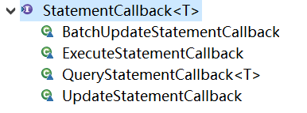

# 命令模式

## 问题引入

实现一个app控制所有智能家电（不同品牌、不同类型）。

要实现一个app控制所有智能家电的需要，则每个智能家电厂家都要提供一个统一的接口给app调用，这时可以考虑使用命令模式。

## 基本介绍

1. 命令模式（Command Pattern）：在软件设计中，经常需要像某些对象发送请求，但并不知道请求的接收者是谁，也不知道被请求的操作是哪个，只需在程序运行时指定具体的请求接收者即可，此时，可以使用命令模式进行设计。

2. 命令模式使得**请求发送者与请求接收者消除彼此之间的耦合**，让对象之间的调用关系更加灵活，实现解耦。

3. 在命令模式中，会将一个请求封装为一个对象，以便使用不同参数来表示不同的请求（及命名），同时命令模式也支持可撤销操作。

4. 可理解为：将军发布命令，士兵去执行。其中有几个角色：将军（命令发布者）、士兵（命令的具体执行者）、命令（连接将军和士兵）。

   Invoker是调用者（将军），Receiver是被调用者（士兵），MyCommand是命令，实现了Command接口，持有接收对象。

### 原理类图


#### 角色说明

1. **Invoker**：调用者
2. **Command**：命令角色，需要执行的所有角色都在这里，可以是接口或抽象类。
3. **Receiver**：接收者，知道如何实施和执行一个请求相关的操作。
4. **ConcreteCommand**：将一个接收者对象与一个动作绑定，调用接收者相应的操作，实现execute。

### 应用实例

实现遥控器APP对多种电器进行控制。

#### 类图


#### 代码

Command.java

```java
//创建命令接口
public interface Command {

	//执行动作(操作)
	public void execute();
	//撤销动作(操作)
	public void undo();
}
```

LightReceiver.java

```java
public class LightReceiver {

	public void on() {
		System.out.println(" 电灯打开了.. ");
	}
	
	public void off() {
		System.out.println(" 电灯关闭了.. ");
	}
}
```

LightOffCommand.java

```java
public class LightOffCommand implements Command {

	// 聚合LightReceiver
	LightReceiver light;

	// 构造器
	public LightOffCommand(LightReceiver light) {
			super();
			this.light = light;
		}

	@Override
	public void execute() {
		// 调用接收者的方法
		light.off();
	}

	@Override
	public void undo() {
		// 调用接收者的方法
		light.on();
	}
}
```

LightOnCommand.java

```java
public class LightOnCommand implements Command {

	//聚合LightReceiver
	LightReceiver light;
	
	//构造器
	public LightOnCommand(LightReceiver light) {
		super();
		this.light = light;
	}
	
	@Override
	public void execute() {
		//调用接收者的方法
		light.on();
	}

	@Override
	public void undo() {
		//调用接收者的方法
		light.off();
	}

}
```

TVReceiver.java

```java
public class TVReceiver {
	
	public void on() {
		System.out.println(" 电视机打开了.. ");
	}
	
	public void off() {
		System.out.println(" 电视机关闭了.. ");
	}
}
```

TVOnCommand.java

```java
public class TVOnCommand implements Command {

	// 聚合TVReceiver
	TVReceiver tv;

	// 构造器
	public TVOnCommand(TVReceiver tv) {
		super();
		this.tv = tv;
	}

	@Override
	public void execute() {
		// 调用接收者的方法
		tv.on();
	}

	@Override
	public void undo() {
		// 调用接收者的方法
		tv.off();
	}
}
```

TVOffCommand.java

```java
public class TVOffCommand implements Command {

	// 聚合TVReceiver
	TVReceiver tv;

	// 构造器
	public TVOffCommand(TVReceiver tv) {
		super();
		this.tv = tv;
	}

	@Override
	public void execute() {
		// 调用接收者的方法
		tv.off();
	}

	@Override
	public void undo() {
		// 调用接收者的方法
		tv.on();
	}
}
```

NoCommand.java

```java
/**
 * 没有任何命令，即空执行: 用于初始化每个按钮, 当调用空命令时，对象什么都不做
 * 其实，这样是一种设计模式, 可以省掉对空判断
 * @author Administrator
 */
public class NoCommand implements Command {

	@Override
	public void execute() {
	}

	@Override
	public void undo() {
	}

}
```

RemoteController.java

```java
public class RemoteController {

	// 开 按钮的命令数组
	Command[] onCommands;
	Command[] offCommands;

	// 执行撤销的命令
	Command undoCommand;

	// 构造器，完成对按钮初始化
	public RemoteController() {

		onCommands = new Command[5];
		offCommands = new Command[5];

		for (int i = 0; i < 5; i++) {
			onCommands[i] = new NoCommand();
			offCommands[i] = new NoCommand();
		}
	}

	// 给我们的按钮设置你需要的命令
	public void setCommand(int no, Command onCommand, Command offCommand) {
		onCommands[no] = onCommand;
		offCommands[no] = offCommand;
	}

	// 按下开按钮
	public void onButtonWasPushed(int no) { // no 0
		// 找到你按下的开的按钮， 并调用对应方法
		onCommands[no].execute();
		// 记录这次的操作，用于撤销
		undoCommand = onCommands[no];

	}

	// 按下开按钮
	public void offButtonWasPushed(int no) { // no 0
		// 找到你按下的关的按钮， 并调用对应方法
		offCommands[no].execute();
		// 记录这次的操作，用于撤销
		undoCommand = offCommands[no];

	}
	
	// 按下撤销按钮
	public void undoButtonWasPushed() {
		undoCommand.undo();
	}

}
```

Client.java

```java
public class Client {

	public static void main(String[] args) {
		
		//使用命令设计模式，完成通过遥控器，对电灯的操作
		//创建电灯的对象(接受者)
		LightReceiver lightReceiver = new LightReceiver();
		
		//创建电灯相关的开关命令
		LightOnCommand lightOnCommand = new LightOnCommand(lightReceiver);
		LightOffCommand lightOffCommand = new LightOffCommand(lightReceiver);
		
		//需要一个遥控器
		RemoteController remoteController = new RemoteController();
		
		//给我们的遥控器设置命令, 比如 no = 0 是电灯的开和关的操作
		remoteController.setCommand(0, lightOnCommand, lightOffCommand);
		
		System.out.println("--------按下灯的开按钮-----------");
		remoteController.onButtonWasPushed(0);
		System.out.println("--------按下灯的关按钮-----------");
		remoteController.offButtonWasPushed(0);
		System.out.println("--------按下撤销按钮-----------");
		remoteController.undoButtonWasPushed();
		
		
		System.out.println("=========使用遥控器操作电视机==========");
		
		TVReceiver tvReceiver = new TVReceiver();
		
		TVOffCommand tvOffCommand = new TVOffCommand(tvReceiver);
		TVOnCommand tvOnCommand = new TVOnCommand(tvReceiver);
		
		//给我们的遥控器设置命令, 比如 no = 1 是电视机的开和关的操作
		remoteController.setCommand(1, tvOnCommand, tvOffCommand);
		
		System.out.println("--------按下电视机的开按钮-----------");
		remoteController.onButtonWasPushed(1);
		System.out.println("--------按下电视机的关按钮-----------");
		remoteController.offButtonWasPushed(1);
		System.out.println("--------按下撤销按钮-----------");
		remoteController.undoButtonWasPushed();

	}
}
```

## Spring框架内使用命令模式的源码分析

Spring框架的JDBCTemplate使用了命令模式。

#### 源码

```java
public class JdbcTemplate extends JdbcAccessor implements JdbcOperations {
    ...
        
    @Override
	public <T> T execute(StatementCallback<T> action) throws DataAccessException {
		Assert.notNull(action, "Callback object must not be null");

		Connection con = DataSourceUtils.getConnection(getDataSource());
		Statement stmt = null;
		try {
			Connection conToUse = con;
			if (this.nativeJdbcExtractor != null &&
					this.nativeJdbcExtractor.isNativeConnectionNecessaryForNativeStatements()) {
				conToUse = this.nativeJdbcExtractor.getNativeConnection(con);
			}
			stmt = conToUse.createStatement();
			applyStatementSettings(stmt);
			Statement stmtToUse = stmt;
			if (this.nativeJdbcExtractor != null) {
				stmtToUse = this.nativeJdbcExtractor.getNativeStatement(stmt);
			}
			T result = action.doInStatement(stmtToUse);
			handleWarnings(stmt);
			return result;
		}
		catch (SQLException ex) {
			// Release Connection early, to avoid potential connection pool deadlock
			// in the case when the exception translator hasn't been initialized yet.
			JdbcUtils.closeStatement(stmt);
			stmt = null;
			DataSourceUtils.releaseConnection(con, getDataSource());
			con = null;
			throw getExceptionTranslator().translate("StatementCallback", getSql(action), ex);
		}
		finally {
			JdbcUtils.closeStatement(stmt);
			DataSourceUtils.releaseConnection(con, getDataSource());
		}
	}

	@Override
	public void execute(final String sql) throws DataAccessException {
		if (logger.isDebugEnabled()) {
			logger.debug("Executing SQL statement [" + sql + "]");
		}
		class ExecuteStatementCallback implements StatementCallback<Object>, SqlProvider {
			@Override
			public Object doInStatement(Statement stmt) throws SQLException {
				stmt.execute(sql);
				return null;
			}
			@Override
			public String getSql() {
				return sql;
			}
		}
		execute(new ExecuteStatementCallback());
	}

	@Override
	public <T> T query(final String sql, final ResultSetExtractor<T> rse) throws DataAccessException {
		Assert.notNull(sql, "SQL must not be null");
		Assert.notNull(rse, "ResultSetExtractor must not be null");
		if (logger.isDebugEnabled()) {
			logger.debug("Executing SQL query [" + sql + "]");
		}
		class QueryStatementCallback implements StatementCallback<T>, SqlProvider {
			@Override
			public T doInStatement(Statement stmt) throws SQLException {
				ResultSet rs = null;
				try {
					rs = stmt.executeQuery(sql);
					ResultSet rsToUse = rs;
					if (nativeJdbcExtractor != null) {
						rsToUse = nativeJdbcExtractor.getNativeResultSet(rs);
					}
					return rse.extractData(rsToUse);
				}
				finally {
					JdbcUtils.closeResultSet(rs);
				}
			}
			@Override
			public String getSql() {
				return sql;
			}
		}
		return execute(new QueryStatementCallback());
	}

	@Override
	public void query(String sql, RowCallbackHandler rch) throws DataAccessException {
		query(sql, new RowCallbackHandlerResultSetExtractor(rch));
	}

    
    ...
        
}
```

```java
public interface StatementCallback<T> {
    T doInStatement(Statement stmt) throws SQLException, DataAccessException;
}
```



#### 说明

- StatementCallback接口，类似命令接口（Command）

- ```java
  class QueryStatementCallback implements StatementCallback<T>,SqlProvider{...}
  ```

  匿名内部类，实现了命令接口，同时也充当了命令接收者。

- 命令调用者是JdbcTemplate,其中execute(StatementCallback<T> action)方法中，调用action.doInStatement方法。不同的实现StatementCallback接口的对象，对应不同的doInStatement实现逻辑。

- 另外实现StatementCallback命令接口的子类还有QueryStatementCallback、......

## 注意事项和细节

1. 将发起请求的对象与执行请求的对象解耦。发起请求的对象是调用者，调用者只要调用命令对象的execute()方法就可以让接收者工作，而不必知道具体的接收者对象是谁、是如何实现的，命令对象会负责让接收者执行请求的动作，也就是说：“请求发起者”和“请求执行者”之间的解耦是通过命令对象实现的，命令对象起到了纽带桥梁的作用。
2. 容易设计一个命令队列。只要把命令对象放到列队，就可以多线程的执行命令。
3. 容易实现对请求的撤销和重做。
4. **命令模式不足：**可能导致某些系统有过多的具体命令类，增加了系统的复杂度。
5. **空命令也是一种设计模式，省去了判空的操作**。
6. 应用场景：界面的一个按钮都是一条命令、模拟CMD（DOS命令）、订单的撤销/恢复、触发-反馈机制

