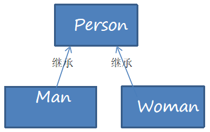
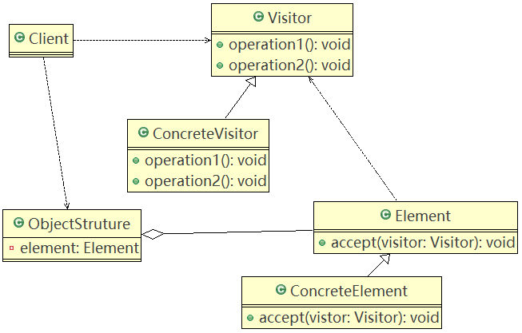
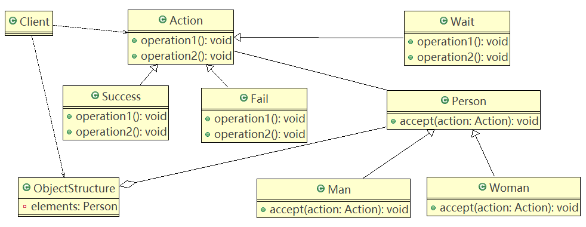

# 访问者模式

## 需求引入

测评系统需求：

将观众分为男人和女人，对歌手进行评测，当看完某个歌手表演后，得到她们对该歌手不同的评价（评价：成功、失败等）

#### 传统方案



##### 传统方案的问题分析

1. 如果系统比较小，还是可以的，但是考虑到系统增加越来越多新的功能时，对代码改动较大，违反了ocp原则，不利于维护。
2. 扩展性不好，如：增加了新的人员类型，或者管理方法，都不好做。

## 基本介绍

1. 访问者模式（Visitor Pattern），封装一些作用于某种数据结构的各元素的操作，它可以在不改变数据结构的前提下定义作用于这些元素的新的操作。
2. 主要将数据结构与数据操作分离，解决数据结构和操作耦合性问题。
3. 基本工作原理：在被访问的类里面加一个对外提供接待访问者的接口。
4. 应用场景：需要一个对象结构中的对象进行很多不同操作（这些操作彼此没有关联），同时需要避免让这些操作“污染”这些对象的类，可以选用访问者模式解决。

### 原理类图



#### 角色说明

1. **Visitor**：是抽象访问者，为该对象结构中的ConcreteElement的每一个类声明一个visit操作。
2. **ConcreteVisitor**：是一个具体的访问者实现每个有Visitor声明的操作，是每个操作实现的部分。
3. **ObjectStructure**：能枚举它的元素，可以提供一个高层的接口，用来允许访问者访问元素。
4. **Element**：定义一个accept方法，接收一个访问者对象。
5. **ConcreteElement**：具体元素，实现accept方法。

### 应用实例

#### 类图



#### 代码实现

Action.java

```java
public abstract class Action {
	
	//得到男性 的测评
	public abstract void getManResult(Man man);
	
	//得到女的 测评
	public abstract void getWomanResult(Woman woman);
}
```

Success.java

```java
public class Success extends Action {

	@Override
	public void getManResult(Man man) {
		System.out.println(" 男人给的评价该歌手很成功 !");
	}

	@Override
	public void getWomanResult(Woman woman) {
		System.out.println(" 女人给的评价该歌手很成功 !");
	}

}
```

Fail.java

```java
public class Fail extends Action {

	@Override
	public void getManResult(Man man) {
		System.out.println(" 男人给的评价该歌手失败 !");
	}

	@Override
	public void getWomanResult(Woman woman) {
		System.out.println(" 女人给的评价该歌手失败 !");
	}

}
```

Wait.java

```java
public class Wait extends Action {

	@Override
	public void getManResult(Man man) {
		System.out.println(" 男人给的评价是该歌手待定 ..");
	}

	@Override
	public void getWomanResult(Woman woman) {
		System.out.println(" 女人给的评价是该歌手待定 ..");
	}

}
```

Person.java

```java
public abstract class Person {
	
	//提供一个方法，让访问者可以访问
	public abstract void accept(Action action);
}
```

Man.java

```java
public class Man extends Person {

	@Override
	public void accept(Action action) {
		action.getManResult(this);
	}

}
```

Woman.java

```java
//说明
//1. 这里我们使用到了双分派, 即首先在客户端程序中，将具体状态作为参数传递Woman中(第一次分派)
//2. 然后Woman 类调用作为参数的 "具体方法" 中方法getWomanResult, 同时将自己(this)作为参数
//   传入，完成第二次的分派
public class Woman extends Person{

	@Override
	public void accept(Action action) {
		action.getWomanResult(this);
	}

}
```

ObjectStructure.java

```java
import java.util.LinkedList;
import java.util.List;

//数据结构，管理很多人（Man , Woman）
public class ObjectStructure {

	//维护了一个集合
	private List<Person> persons = new LinkedList<>();
	
	//增加到list
	public void attach(Person p) {
		persons.add(p);
	}
	//移除
	public void detach(Person p) {
		persons.remove(p);
	}
	
	//显示测评情况
	public void display(Action action) {
		for(Person p: persons) {
			p.accept(action);
		}
	}
}
```

Client.java

```java
public class Client {

	public static void main(String[] args) {
		//创建ObjectStructure
		ObjectStructure objectStructure = new ObjectStructure();
		
		objectStructure.attach(new Man());
		objectStructure.attach(new Woman());
		
		
		//成功
		Success success = new Success();
		objectStructure.display(success);
		
		System.out.println("===============");
		Fail fail = new Fail();
		objectStructure.display(fail);
		
		System.out.println("=======给的是待定的测评========");
		
		Wait wait = new Wait();
		objectStructure.display(wait);
	}

}
```

#### 双分派

双分派是指不管类怎么变化，都能找到期望的方法运行。

意味着得到执行的操作取决于请求的种类和两个接收者的类型。

###### 例如

在上述实例，添加一个Wait的状态类，考察Man类和Woman类的反应，由于使用了双分派，只需增加一个Action子类即可在客户端调用即可，不需要改动任何其它代码。

## 注意事项和细节

###### 优点

1. 访问者模式符合单一职责原则、让程序局域优秀的扩展性、灵活性非常高。
2. 访问者模式可以对功能进行统一，可以做报表、UI、拦截器与过滤器，适用于数据结构相对稳定的系统。

###### 缺点

1. 具体元素对访问者公布细节，也就是说访问者关注了其它类的内部细节，这是迪米特法则所不建议的，这样造成了具体元素变更比较困难。
2. 违背了依赖倒置原则。访问者依赖的是具体元素，而不是抽象元素。
3. 因此，**如果一个系统有比较稳定的数据结构**，又有经常变化的功能需求，那么**访问者模式就是比较合适**的。