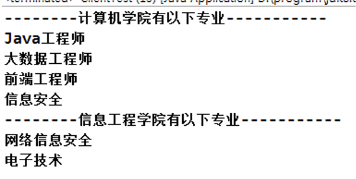
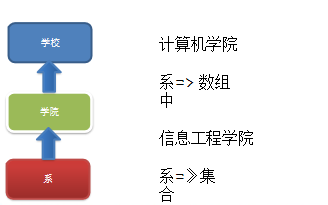
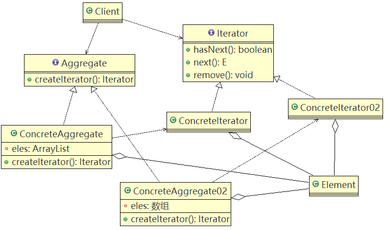
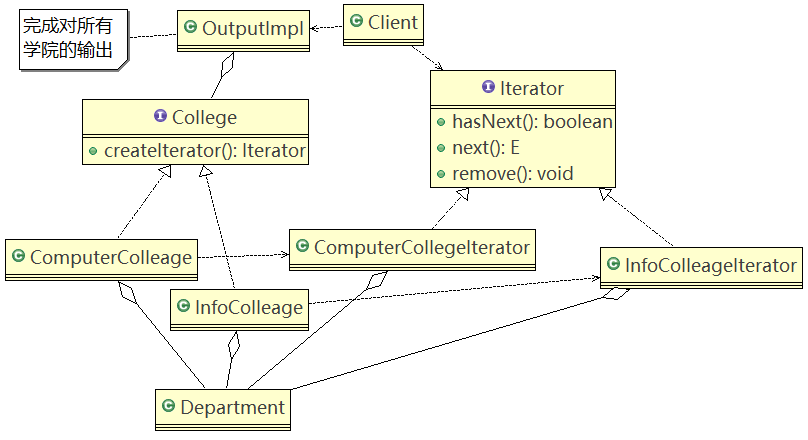
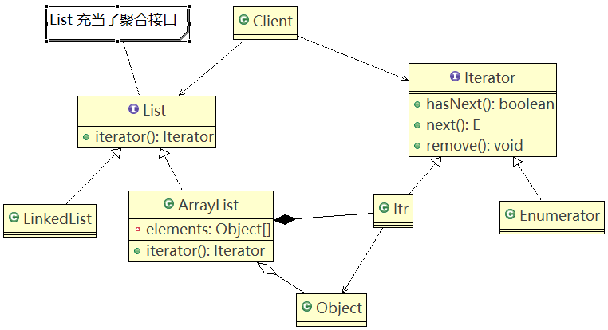

# 迭代器模式

## 问题引入

展示一个学校院系结构：在一个页面中展示出学校的院系组成，一个学校有多个学院，一个学院有多个系。



#### 传统的设计方案（类图）



##### 传统的方式的问题分析

1. 将学院看做是学校的子类，系是学院的子类，这样实际上是站在组织大小来进行分层次的
2. 实际上我们的要求是 ：在一个页面中展示出学校的院系组成，一个学校有多个学院，一个学院有多个系， 因此这种方案，不能很好实现的遍历的操作

## 基本介绍

1. 迭代器模式（Iterator Pattern）是**常用的设计模式**，属于行为型模式。
2. 如果集合元素使用不同的方式实现的，有数组，还有Java的集合类，或者还有其它方式，当客户端要遍历这些集合元素的时候就要使用多种遍历方式，而且还会爆露元素的内部结构，可以考虑使用迭代器模式解决。
3. 迭代器模式，**提供一种遍历集合元素的统一接口**，用**一致的方法遍历集合元素**，不需要知道**集合对象的底层**结构，即：不暴露其内部的结构。

### 原理类图



#### 角色说明

1. **Iterator**：迭代器接口，是系统提供，含有hasNext，next，remove
2. **ConcreteIterator**：具体的迭代器类，管理迭代。
3. **Aggregate**：一个统一的聚合接口，将客户端和具体聚合解耦。
4. **ConcreteAggreage**：具体的聚合持有对象集合，并提供一个方法，返回一个迭代器，该迭代器可以正确遍历集合。
5. **Client**：客户端，通过Iterator和Aggregate依赖子类。

### 应用实例

#### 类图



#### 代码实现

Client.java

```java
import java.util.ArrayList;
import java.util.List;

public class Client {

	public static void main(String[] args) {
		//创建学院
		List<College> collegeList = new ArrayList<College>();
		
		ComputerCollege computerCollege = new ComputerCollege();
		InfoCollege infoCollege = new InfoCollege();
		
		collegeList.add(computerCollege);
		//collegeList.add(infoCollege);
		
		OutPutImpl outPutImpl = new OutPutImpl(collegeList);
		outPutImpl.printCollege();
	}

}
```

College.java

```java
import java.util.Iterator;

public interface College {
	
	public String getName();
	
	//增加系的方法
	public void addDepartment(String name, String desc);
	
	//返回一个迭代器,遍历
	public Iterator  createIterator();
}
```

ComputerCollege.java

```java
import java.util.Iterator;

public class ComputerCollege implements College {

	Department[] departments;
	int numOfDepartment = 0 ;// 保存当前数组的对象个数
	
	public ComputerCollege() {
		departments = new Department[5];
		addDepartment("Java专业", " Java专业 ");
		addDepartment("PHP专业", " PHP专业 ");
		addDepartment("大数据专业", " 大数据专业 ");
	}
	
	
	@Override
	public String getName() {
		return "计算机学院";
	}

	@Override
	public void addDepartment(String name, String desc) {
		Department department = new Department(name, desc);
		departments[numOfDepartment] = department;
		numOfDepartment += 1;
	}

	@Override
	public Iterator createIterator() {
		return new ComputerCollegeIterator(departments);
	}

}
```

ComputerCollegeIterator.java

```java
import java.util.Iterator;

public class ComputerCollegeIterator implements Iterator {

	//这里我们需要Department 是以怎样的方式存放=>数组
	Department[] departments;
	int position = 0; //遍历的位置
	
	public ComputerCollegeIterator(Department[] departments) {
		this.departments = departments;
	}

	//判断是否还有下一个元素
	@Override
	public boolean hasNext() {
		if(position >= departments.length || departments[position] == null) {
			return false;
		}else {
		
			return true;
		}
	}

	@Override
	public Object next() {
		Department department = departments[position];
		position += 1;
		return department;
	}
	
	//删除的方法，默认空实现
	public void remove() {
		
	}

}
```

Department.java

```java
//系
public class Department {

	private String name;
	private String desc;
	public Department(String name, String desc) {
		super();
		this.name = name;
		this.desc = desc;
	}
	public String getName() {
		return name;
	}
	public void setName(String name) {
		this.name = name;
	}
	public String getDesc() {
		return desc;
	}
	public void setDesc(String desc) {
		this.desc = desc;
	}
}
```

InfoColleageIterator.java

```java
import java.util.Iterator;
import java.util.List;

public class InfoColleageIterator implements Iterator {

	List<Department> departmentList; // 信息工程学院是以List方式存放系
	int index = -1;//索引
	
	public InfoColleageIterator(List<Department> departmentList) {
		this.departmentList = departmentList;
	}

	//判断list中还有没有下一个元素
	@Override
	public boolean hasNext() {
		if(index >= departmentList.size() - 1) {
			return false;
		} else {
			index += 1;
			return true;
		}
	}

	@Override
	public Object next() {
		return departmentList.get(index);
	}
	
	//空实现remove
	public void remove() {
		
	}

}
```

InfoCollege.java

```java
import java.util.ArrayList;
import java.util.Iterator;
import java.util.List;

public class InfoCollege implements College {

	List<Department> departmentList;
	
	public InfoCollege() {
		departmentList = new ArrayList<Department>();
		addDepartment("信息安全专业", " 信息安全专业 ");
		addDepartment("网络安全专业", " 网络安全专业 ");
		addDepartment("服务器安全专业", " 服务器安全专业 ");
	}
	
	@Override
	public String getName() {
		return "信息工程学院";
	}

	@Override
	public void addDepartment(String name, String desc) {
		Department department = new Department(name, desc);
		departmentList.add(department);
	}

	@Override
	public Iterator createIterator() {
		return new InfoColleageIterator(departmentList);
	}

}
```

OutPutImpl.java

```java
import java.util.Iterator;
import java.util.List;

public class OutPutImpl {
	
	//学院集合
	List<College> collegeList;

	public OutPutImpl(List<College> collegeList) {
		
		this.collegeList = collegeList;
	}
	//遍历所有学院,然后调用printDepartment 输出各个学院的系
	public void printCollege() {
		
		//从collegeList 取出所有学院, Java 中的 List 已经实现Iterator
		Iterator<College> iterator = collegeList.iterator();
		
		while(iterator.hasNext()) {
			//取出一个学院
			College college = iterator.next();
			System.out.println("=== "+college.getName() +"=====" );
			printDepartment(college.createIterator()); //得到对应迭代器
		}
	}
	
	//输出 学院输出 系
	public void printDepartment(Iterator iterator) {
		while(iterator.hasNext()) {
			Department d = (Department)iterator.next();
			System.out.println(d.getName());
		}
	}
}
```

## JDK-ArrayList集合应用迭代器模式源码分析

#### 类图



##### 角色分析

- 内部类Itr充当具体实现迭代器Iterator的类，作为ArrayList内部类。
- List充当了聚合接口，含有一个iterator()方法，返回一个迭代器对象。
- ArrayList实现聚合接口List的子类，实现了iterator()
- Iterator接口系统提供
- 迭代器模式解决了不同集合（ArrayList，LinkedList）统一遍历问题。

#### 源码

```java
package java.util;

import java.util.function.Consumer;

/**
 * An iterator over a collection.  {@code Iterator} takes the place of
 * {@link Enumeration} in the Java Collections Framework.  Iterators
 * differ from enumerations in two ways:
 *
 * <ul>
 *      <li> Iterators allow the caller to remove elements from the
 *           underlying collection during the iteration with well-defined
 *           semantics.
 *      <li> Method names have been improved.
 * </ul>
 *
 * <p>This interface is a member of the
 * <a href="{@docRoot}/../technotes/guides/collections/index.html">
 * Java Collections Framework</a>.
 *
 * @param <E> the type of elements returned by this iterator
 *
 * @author  Josh Bloch
 * @see Collection
 * @see ListIterator
 * @see Iterable
 * @since 1.2
 */
public interface Iterator<E> {
    /**
     * Returns {@code true} if the iteration has more elements.
     * (In other words, returns {@code true} if {@link #next} would
     * return an element rather than throwing an exception.)
     *
     * @return {@code true} if the iteration has more elements
     */
    boolean hasNext();

    /**
     * Returns the next element in the iteration.
     *
     * @return the next element in the iteration
     * @throws NoSuchElementException if the iteration has no more elements
     */
    E next();

    /**
     * Removes from the underlying collection the last element returned
     * by this iterator (optional operation).  This method can be called
     * only once per call to {@link #next}.  The behavior of an iterator
     * is unspecified if the underlying collection is modified while the
     * iteration is in progress in any way other than by calling this
     * method.
     *
     * @implSpec
     * The default implementation throws an instance of
     * {@link UnsupportedOperationException} and performs no other action.
     *
     * @throws UnsupportedOperationException if the {@code remove}
     *         operation is not supported by this iterator
     *
     * @throws IllegalStateException if the {@code next} method has not
     *         yet been called, or the {@code remove} method has already
     *         been called after the last call to the {@code next}
     *         method
     */
    default void remove() {
        throw new UnsupportedOperationException("remove");
    }

    /**
     * Performs the given action for each remaining element until all elements
     * have been processed or the action throws an exception.  Actions are
     * performed in the order of iteration, if that order is specified.
     * Exceptions thrown by the action are relayed to the caller.
     *
     * @implSpec
     * <p>The default implementation behaves as if:
     * <pre>{@code
     *     while (hasNext())
     *         action.accept(next());
     * }</pre>
     *
     * @param action The action to be performed for each element
     * @throws NullPointerException if the specified action is null
     * @since 1.8
     */
    default void forEachRemaining(Consumer<? super E> action) {
        Objects.requireNonNull(action);
        while (hasNext())
            action.accept(next());
    }
}
```

```java
public class ArrayList<E> extends AbstractList<E>
        implements List<E>, RandomAccess, Cloneable, java.io.Serializable
{
    ...
        /**
     * Returns an iterator over the elements in this list in proper sequence.
     *
     * <p>The returned iterator is <a href="#fail-fast"><i>fail-fast</i></a>.
     *
     * @return an iterator over the elements in this list in proper sequence
     */
    public Iterator<E> iterator() {
        return new Itr();
    }
        
        /**
     * An optimized version of AbstractList.Itr
     */
    private class Itr implements Iterator<E> {
        int cursor;       // index of next element to return
        int lastRet = -1; // index of last element returned; -1 if no such
        int expectedModCount = modCount;

        Itr() {}

        public boolean hasNext() {
            return cursor != size;
        }

        @SuppressWarnings("unchecked")
        public E next() {
            checkForComodification();
            int i = cursor;
            if (i >= size)
                throw new NoSuchElementException();
            Object[] elementData = ArrayList.this.elementData;
            if (i >= elementData.length)
                throw new ConcurrentModificationException();
            cursor = i + 1;
            return (E) elementData[lastRet = i];
        }

        public void remove() {
            if (lastRet < 0)
                throw new IllegalStateException();
            checkForComodification();

            try {
                ArrayList.this.remove(lastRet);
                cursor = lastRet;
                lastRet = -1;
                expectedModCount = modCount;
            } catch (IndexOutOfBoundsException ex) {
                throw new ConcurrentModificationException();
            }
        }
        ...
}
```

```java
public interface List<E> extends Collection<E> {...}
```

## 注意事项和细节

###### 优点

1. 提供一个统一的方法遍历对象，客户不用再考虑聚合的类型，使用一种方法就可以遍历对象了。
2. 隐藏了聚合的内部结构，客户端要遍历聚合的时候只能取到迭代器，而不会知道聚合的具体组成。
3. 提供一种**设计思想**，就是一个类应该只有一个引起变化的原因（单一职责原则）。在聚合类中，把迭代器分开，就是要把管理对象集合和遍历对象集合的责任分开，这样集合改变，只影响到聚合对象。而如果遍历方式改变，只影响到了迭代器。
4. 当要展示一组相似对象，或者遍历一组相同对象时使用，适合使用迭代器模式。

###### 缺点

每个聚合对象都要一个迭代器，会生成多个迭代器不好管理类。

