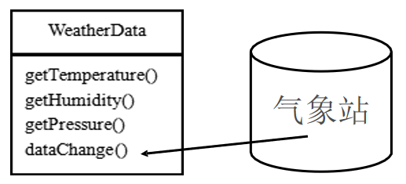
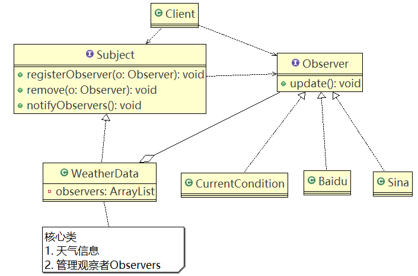

# 观察者模式

## 需求引入

**天气预报需求：**

1. 气象站可以将每天测量到的温度，湿度，气压等等以公告的形式发布出去(比如 发布到自己的网站或第三方)。
2. 需要设计开放型API，便于其他第三方也能接入气象站获取数据。
3. 提供温度、气压和湿度的接口
4. 测量数据更新时，要能实时的通知给第三方

## 普通方案

#### 类图



**说明：**

1. 通过getXxx方法，可以让第三方接入，并得到相关信息.
2. 当数据有更新时，气象站通过调用dataChange() 去更新数据，当第三方再次获取时，就能得到最新数据，当然也可以推送。


CurrentConditions(当前的天气情况)可以理解成是气象局的网站 //推送

#### 代码实现

Client.java

```java
public class Client {
	public static void main(String[] args) {
		//创建接入方 currentConditions
		CurrentConditions currentConditions = new CurrentConditions();
		//创建 WeatherData 并将 接入方 currentConditions 传递到 WeatherData中
		WeatherData weatherData = new WeatherData(currentConditions);
		
		//更新天气情况
		weatherData.setData(30, 150, 40);
		
		//天气情况变化
		System.out.println("============天气情况变化=============");
		weatherData.setData(40, 160, 20);
		
	}
}
```

WeatherData.java

```java
/**
 * 类是核心
 * 1. 包含最新的天气情况信息 
 * 2. 含有 CurrentConditions 对象
 * 3. 当数据有更新时，就主动的调用   CurrentConditions对象update方法(含 display), 这样他们（接入方）就看到最新的信息
 * @author Administrator
 *
 */
public class WeatherData {
	private float temperatrue;
	private float pressure;
	private float humidity;
	private CurrentConditions currentConditions;
	//加入新的第三方

	public WeatherData(CurrentConditions currentConditions) {
		this.currentConditions = currentConditions;
	}

	public float getTemperature() {
		return temperatrue;
	}

	public float getPressure() {
		return pressure;
	}

	public float getHumidity() {
		return humidity;
	}

	public void dataChange() {
		//调用 接入方的 update
		currentConditions.update(getTemperature(), getPressure(), getHumidity());
	}

	//当数据有更新时，就调用 setData
	public void setData(float temperature, float pressure, float humidity) {
		this.temperatrue = temperature;
		this.pressure = pressure;
		this.humidity = humidity;
		//调用dataChange， 将最新的信息 推送给 接入方 currentConditions
		dataChange();
	}
}
```

CurrentConditions.java

```java
/**
 * 显示当前天气情况（可以理解成是气象站自己的网站）
 * @author Administrator
 *
 */
public class CurrentConditions {
	// 温度，气压，湿度
	private float temperature;
	private float pressure;
	private float humidity;

	//更新 天气情况，是由 WeatherData 来调用，我使用推送模式
	public void update(float temperature, float pressure, float humidity) {
		this.temperature = temperature;
		this.pressure = pressure;
		this.humidity = humidity;
		display();
	}

	//显示
	public void display() {
		System.out.println("***Today mTemperature: " + temperature + "***");
		System.out.println("***Today mPressure: " + pressure + "***");
		System.out.println("***Today mHumidity: " + humidity + "***");
	}
}
```

#### 普通方案问题分析

1. 其它第三方接入气象站获取数据的问题

2. 无法在运行时动态的添加第三方

3. 违反ocp原则

   ```java
   //在WeatherData中，当增加一个第三方，都需要创建一个对应的第三方的公告板对象，并加入到dataChange，不利于维护，也不是动态加入
   public void dataChange(){
       currentConditions.update(getTemperature(),getPressure(),getHumidity());
   }
   ```

## 观察者模式原理

观察者模式类似于订牛奶业务

- 奶站/气象局：Subject
- 用户/第三方网站：Observer

**Subject**：登记、注册、移除和通知


- registerObserver()：注册
- removeObserver()：移除
- notifyObservers()：通知所有注册的用户，根据不同需求，可以更新数据，让用户来取，也可以实时推送。

**Observer**：接收输入


**观察者模式**：对象之间**多对一依赖**的一种设计方案，被依赖的对象为Subject，依赖的对象为Observer，Subject通知Observer变化。如：奶站是Subject，用户是Observer。

### 应用实例

#### 类图



#### 代码实现

Client.java

```java
public class Client {

	public static void main(String[] args) {
		//创建一个WeatherData
		WeatherData weatherData = new WeatherData();
		
		//创建观察者
		CurrentConditions currentConditions = new CurrentConditions();
		BaiduSite baiduSite = new BaiduSite();
		
		//注册到weatherData
		weatherData.registerObserver(currentConditions);
		weatherData.registerObserver(baiduSite);
		
		//测试
		System.out.println("通知各个注册的观察者, 看看信息");
		weatherData.setData(10f, 100f, 30.3f);
		
		weatherData.removeObserver(currentConditions);
		//测试
		System.out.println();
		System.out.println("通知各个注册的观察者, 看看信息");
		weatherData.setData(10f, 100f, 30.3f);
	}

}
```

Subject.java

```java
//接口, 让WeatherData 来实现 
public interface Subject {
	
	public void registerObserver(Observer o);
	public void removeObserver(Observer o);
	public void notifyObservers();
}
```

WeatherData.java

```java
import java.util.ArrayList;

/**
 * 类是核心
 * 1. 包含最新的天气情况信息 
 * 2. 含有 观察者集合，使用ArrayList管理
 * 3. 当数据有更新时，就主动的调用   ArrayList, 通知所有的（接入方）就看到最新的信息
 * @author Administrator
 *
 */
public class WeatherData implements Subject {
	private float temperatrue;
	private float pressure;
	private float humidity;
	//观察者集合
	private ArrayList<Observer> observers;
	
	//加入新的第三方
	public WeatherData() {
		observers = new ArrayList<Observer>();
	}

	public float getTemperature() {
		return temperatrue;
	}

	public float getPressure() {
		return pressure;
	}

	public float getHumidity() {
		return humidity;
	}

	public void dataChange() {
		//调用 接入方的 update
		
		notifyObservers();
	}

	//当数据有更新时，就调用 setData
	public void setData(float temperature, float pressure, float humidity) {
		this.temperatrue = temperature;
		this.pressure = pressure;
		this.humidity = humidity;
		//调用dataChange， 将最新的信息 推送给 接入方 currentConditions
		dataChange();
	}

	//注册一个观察者
	@Override
	public void registerObserver(Observer o) {
		observers.add(o);
	}

	//移除一个观察者
	@Override
	public void removeObserver(Observer o) {
		if(observers.contains(o)) {
			observers.remove(o);
		}
	}

	//遍历所有的观察者，并通知
	@Override
	public void notifyObservers() {
		for(int i = 0; i < observers.size(); i++) {
			observers.get(i).update(this.temperatrue, this.pressure, this.humidity);
		}
	}
}
```

Observer.java

```java
//观察者接口，有观察者来实现
public interface Observer {

	public void update(float temperature, float pressure, float humidity);
}
```

CurrentConditions.java

```java
public class CurrentConditions implements Observer {

	// 温度，气压，湿度
	private float temperature;
	private float pressure;
	private float humidity;

	// 更新 天气情况，是由 WeatherData 来调用，我使用推送模式
	public void update(float temperature, float pressure, float humidity) {
		this.temperature = temperature;
		this.pressure = pressure;
		this.humidity = humidity;
		display();
	}

	// 显示
	public void display() {
		System.out.println("***Today mTemperature: " + temperature + "***");
		System.out.println("***Today mPressure: " + pressure + "***");
		System.out.println("***Today mHumidity: " + humidity + "***");
	}
}
```

BaiduSite.java

```java
public class BaiduSite implements Observer {

	// 温度，气压，湿度
	private float temperature;
	private float pressure;
	private float humidity;

	// 更新 天气情况，是由 WeatherData 来调用，我使用推送模式
	public void update(float temperature, float pressure, float humidity) {
		this.temperature = temperature;
		this.pressure = pressure;
		this.humidity = humidity;
		display();
	}

	// 显示
	public void display() {
		System.out.println("===百度网站====");
		System.out.println("***百度网站 气温 : " + temperature + "***");
		System.out.println("***百度网站 气压: " + pressure + "***");
		System.out.println("***百度网站 湿度: " + humidity + "***");
	}

}
```

### 观察者模式的好处

1. 观察者模式以集合的方式来管理用户（Observer），包括注册、移除和通知。
2. 增加观察者（可以理解为一个新的公告板），就不需要去修改核心类代码（如：上面的WeatherData），遵守了ocp原则。

## 观察者模式在JDK应用的源码分析

JDK的Observable类使用了观察者模式

#### 源码

```java
package java.util;

/**
 * This class represents an observable object, or "data"
 * in the model-view paradigm. It can be subclassed to represent an
 * object that the application wants to have observed.
 * <p>
 * An observable object can have one or more observers. An observer
 * may be any object that implements interface <tt>Observer</tt>. After an
 * observable instance changes, an application calling the
 * <code>Observable</code>'s <code>notifyObservers</code> method
 * causes all of its observers to be notified of the change by a call
 * to their <code>update</code> method.
 * <p>
 * The order in which notifications will be delivered is unspecified.
 * The default implementation provided in the Observable class will
 * notify Observers in the order in which they registered interest, but
 * subclasses may change this order, use no guaranteed order, deliver
 * notifications on separate threads, or may guarantee that their
 * subclass follows this order, as they choose.
 * <p>
 * Note that this notification mechanism has nothing to do with threads
 * and is completely separate from the <tt>wait</tt> and <tt>notify</tt>
 * mechanism of class <tt>Object</tt>.
 * <p>
 * When an observable object is newly created, its set of observers is
 * empty. Two observers are considered the same if and only if the
 * <tt>equals</tt> method returns true for them.
 *
 * @author  Chris Warth
 * @see     java.util.Observable#notifyObservers()
 * @see     java.util.Observable#notifyObservers(java.lang.Object)
 * @see     java.util.Observer
 * @see     java.util.Observer#update(java.util.Observable, java.lang.Object)
 * @since   JDK1.0
 */
public class Observable {
    private boolean changed = false;
    private Vector<Observer> obs;

    /** Construct an Observable with zero Observers. */

    public Observable() {
        obs = new Vector<>();
    }

    /**
     * Adds an observer to the set of observers for this object, provided
     * that it is not the same as some observer already in the set.
     * The order in which notifications will be delivered to multiple
     * observers is not specified. See the class comment.
     *
     * @param   o   an observer to be added.
     * @throws NullPointerException   if the parameter o is null.
     */
    public synchronized void addObserver(Observer o) {
        if (o == null)
            throw new NullPointerException();
        if (!obs.contains(o)) {
            obs.addElement(o);
        }
    }

    /**
     * Deletes an observer from the set of observers of this object.
     * Passing <CODE>null</CODE> to this method will have no effect.
     * @param   o   the observer to be deleted.
     */
    public synchronized void deleteObserver(Observer o) {
        obs.removeElement(o);
    }

    /**
     * If this object has changed, as indicated by the
     * <code>hasChanged</code> method, then notify all of its observers
     * and then call the <code>clearChanged</code> method to
     * indicate that this object has no longer changed.
     * <p>
     * Each observer has its <code>update</code> method called with two
     * arguments: this observable object and <code>null</code>. In other
     * words, this method is equivalent to:
     * <blockquote><tt>
     * notifyObservers(null)</tt></blockquote>
     *
     * @see     java.util.Observable#clearChanged()
     * @see     java.util.Observable#hasChanged()
     * @see     java.util.Observer#update(java.util.Observable, java.lang.Object)
     */
    public void notifyObservers() {
        notifyObservers(null);
    }

    /**
     * If this object has changed, as indicated by the
     * <code>hasChanged</code> method, then notify all of its observers
     * and then call the <code>clearChanged</code> method to indicate
     * that this object has no longer changed.
     * <p>
     * Each observer has its <code>update</code> method called with two
     * arguments: this observable object and the <code>arg</code> argument.
     *
     * @param   arg   any object.
     * @see     java.util.Observable#clearChanged()
     * @see     java.util.Observable#hasChanged()
     * @see     java.util.Observer#update(java.util.Observable, java.lang.Object)
     */
    public void notifyObservers(Object arg) {
        /*
         * a temporary array buffer, used as a snapshot of the state of
         * current Observers.
         */
        Object[] arrLocal;

        synchronized (this) {
            /* We don't want the Observer doing callbacks into
             * arbitrary code while holding its own Monitor.
             * The code where we extract each Observable from
             * the Vector and store the state of the Observer
             * needs synchronization, but notifying observers
             * does not (should not).  The worst result of any
             * potential race-condition here is that:
             * 1) a newly-added Observer will miss a
             *   notification in progress
             * 2) a recently unregistered Observer will be
             *   wrongly notified when it doesn't care
             */
            if (!changed)
                return;
            arrLocal = obs.toArray();
            clearChanged();
        }

        for (int i = arrLocal.length-1; i>=0; i--)
            ((Observer)arrLocal[i]).update(this, arg);
    }

    /**
     * Clears the observer list so that this object no longer has any observers.
     */
    public synchronized void deleteObservers() {
        obs.removeAllElements();
    }

    /**
     * Marks this <tt>Observable</tt> object as having been changed; the
     * <tt>hasChanged</tt> method will now return <tt>true</tt>.
     */
    protected synchronized void setChanged() {
        changed = true;
    }

    /**
     * Indicates that this object has no longer changed, or that it has
     * already notified all of its observers of its most recent change,
     * so that the <tt>hasChanged</tt> method will now return <tt>false</tt>.
     * This method is called automatically by the
     * <code>notifyObservers</code> methods.
     *
     * @see     java.util.Observable#notifyObservers()
     * @see     java.util.Observable#notifyObservers(java.lang.Object)
     */
    protected synchronized void clearChanged() {
        changed = false;
    }

    /**
     * Tests if this object has changed.
     *
     * @return  <code>true</code> if and only if the <code>setChanged</code>
     *          method has been called more recently than the
     *          <code>clearChanged</code> method on this object;
     *          <code>false</code> otherwise.
     * @see     java.util.Observable#clearChanged()
     * @see     java.util.Observable#setChanged()
     */
    public synchronized boolean hasChanged() {
        return changed;
    }

    /**
     * Returns the number of observers of this <tt>Observable</tt> object.
     *
     * @return  the number of observers of this object.
     */
    public synchronized int countObservers() {
        return obs.size();
    }
}
```

```java
package java.util;

/**
 * A class can implement the <code>Observer</code> interface when it
 * wants to be informed of changes in observable objects.
 *
 * @author  Chris Warth
 * @see     java.util.Observable
 * @since   JDK1.0
 */
public interface Observer {
    /**
     * This method is called whenever the observed object is changed. An
     * application calls an <tt>Observable</tt> object's
     * <code>notifyObservers</code> method to have all the object's
     * observers notified of the change.
     *
     * @param   o     the observable object.
     * @param   arg   an argument passed to the <code>notifyObservers</code>
     *                 method.
     */
    void update(Observable o, Object arg);
}
```

#### 源码角色分析

- **Observable**的作用和地位等价于前面的Subject
- **Observable**是类，不是接口，类中已经实现了核心的方法，即管理Observer的方法add、delete、notify
- **Observer**的作用和地位等价于前面的Observer，有update方法
- **Observable**和**Observer**的使用方法和前面的一样，只是Observable是类，通过继承来实现观察者模式。

