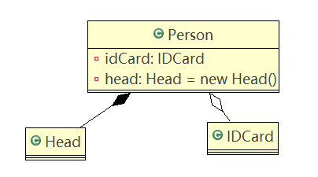

# UML类图

## UML基本介绍

1. UML——Unified modeling language UML(统一建模语言)，用于软件系统分析和设计的语言工具，用于帮助软件开放人员进行思考和记录思路结果。

2. UML本身是一套符号的规定，这些符号用于描述软件模型的各个元素和它们之间的关系，如：类、接口、实现、泛化、依赖、组合、聚合等

   

## UML图

1. 用例图（use case）
2. 静态结构图：类图、对象图、包图、组件图、部署图
3. 动态行为图：交互图（时序图与协作图）、状态图、活动图

##### 说明

类图是描述类与类之间的关系的，是UML图中最核心的

## UML类图

1. 用于描述系统中的**类（对象）本身的组成和类（对象）之间的各种静态关系**

2. 类之间的关系：**依赖、泛化（继承）、实现、关联、聚合和组合。**

3. 举例

   ```java
   public class Person{ //代码形式->类图
   	private Integer id;
   	private String name;
   	public void setName(String name){
   		this.name=name;
   	}
   	public String getName(){
   		return  name;
   	}
   }
   ```

   UML图
   
   

### 依赖关系（Dependence）

只要是**在类中用到了对方，那么它们之间就存在依赖关系。**如果没有对方，连编译都通过不了。

```java
public class PersonServiceBean {
	private PersonDao personDao;// 类

	public void save(Person person) {
	}

	public IDCard getIDCard(Integer personid) {
		return null;
	}

	public void modify() {
		Department department = new Department();
	}

}

public class PersonDao {
}

public class Person {
}

public class IDCard {
}

public class Department {
}
```

对应类图


**总结**

1. 类中用到了对方
2. **类的成员属性**
3. **方法的返回类型**
4. **接收的参数类型**
5. **方法中使用到**

### 泛化关系（generalization）

**泛化关系实际上就是继承关系**，它是**依赖关系的特例**。

```java
public abstract class DaoSupport{
	public void save(Object entity){
	}
	public void delete(Object id){
	}
}

public class PersonServiceBean extends DaoSupport {
}
```

对应类图


**总结**

1. 泛化关系实际上就是继承关系
2. 如A类继承B类，就称A和B存在泛化关系

### 实现关系（Implementation）

实现关系实际上是**A类实现B接口**，它是**依赖关系的特例**。

**示例代码**

```java
public interface PersonService {
	public void delete(Integer id);
}

public class PersonServiceBean implements PersonService{

	@Override
	public void delete(Integer id) {
		System.out.println("delete..");
	}

}
```

对应类图


### 关联关系（Association）

关联关系实际上就是**类与类之间的联系，是依赖关系的特例**。

关联具有**导航性：**即双向关系或单向关系。

关联具有**多重性：**如“1”（表示有且仅有一个），“0...”（表示0个或者多个），“0，1”（表示0个或者一个），“n...m”(表示n到m个都可以)，“m...*”(表示至少m个)。

**单向一对一关系**

```java
public class Person{
    private IDCard card;
}

public class IDCard{}
```

对应类图


**双向一对一关系**

```java
public class IDCard{
    private Person person;
}

public class Person{
    private IDCard card;
}
```

对应类图


### 聚合关系（Aggregation）

聚合关系表示的是**整体和部分的关系，整体与部分可以分开**。聚合关系是**关联关系的特例**，所以它具有关联的**导航性与多重性**。

```java
public class Computer {
	private Mouse mouse; //鼠标可以和computer分离
	private Moniter moniter;//显示器可以和Computer分离
	public void setMouse(Mouse mouse) {
		this.mouse = mouse;
	}
	public void setMoniter(Moniter moniter) {
		this.moniter = moniter;
	}
}

public class Moniter {
}

public class Mouse {
}
```

对应类图


### 组合关系（Composition）

**组合关系：整体与部分的关系，但是整体与部分不可以分开。**

```java
public class Computer {
	private Mouse mouse = new Mouse(); //鼠标可以和computer不能分离
	private Moniter moniter = new Moniter();//显示器可以和Computer不能分离
	public void setMouse(Mouse mouse) {
		this.mouse = mouse;
	}
	public void setMoniter(Moniter moniter) {
		this.moniter = moniter;
	}
}

public class Moniter {
}

public class Mouse {
}
```

对应类图


```java
public class Person {
    private IDCard card; //聚合关系
    private Head head = new Head(); //组合关系
}

public class IDCard {
}

public class Head {
}
```

对应类图



## Eclipse安装AmaterasUML插件

安装配置：https://blog.csdn.net/u010924878/article/details/79613479

安装完成后Eclipse无法找到AmaterasUML问题解决方案：

https://blog.csdn.net/qq_37514135/article/details/80629410