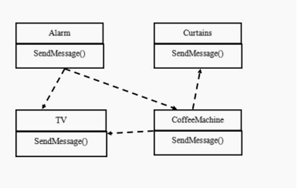
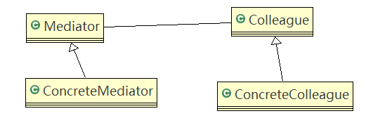
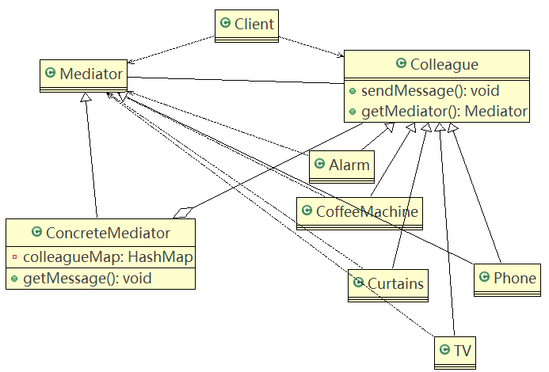

# 中介者模式

## 问题引入

**智能家庭项目：**

1. 智能家庭包括各种设备，闹钟、咖啡机、电视机、窗帘等
2. 主人要看电视时，各个设备可以协同工作，自动完成看电视的准备工作，比如流程为：闹铃响起→咖啡机开始做咖啡→窗帘自动落下→电视机开始播放

### 传统方案

#### 类图



#### 问题分析

1. 当各电器对象有多种状态改变时，相互之间的调用关系会比较复杂
2. 各个电器对象彼此联系，你中有我，我中有你，不利于松耦合.
3. 各个电器对象之间所传递的消息(参数)，容易混乱
4. 当系统增加一个新的电器对象时，或者执行流程改变时，代码的可维护性、扩展性都不理想

## 基本介绍

1. 中介者模式（Mediator Pattern），用一个**中介对象来封装一系列的对象交互**。中介者使各个对象不需要显式地相互引用，从而使其**耦合松散**，而且可以独立地改变它们之间的交互。
2. 中介者模式属于行为型模式，使代码易于维护。
3. 如：MVC模式，C（Controller控制器）是M（Model模型）和V（View视图）的中介者，在前后端交互时起到了中间人的作用。

### 原理类图

#### 类图



#### 角色说明

1. **Mediator**就是抽象中介者，定义了同事对象到中介者对象的接口。
2. **Colleague**是抽象同事类。
3. **ConcreteMediator**具体的中介者对象，实现抽象方法，它需要知道所有的具体的同事类，即一个集合来管理（HashMap），并接受某个同事对象消息，完成相应的任务。
4. **ConcreteColleague**具体的同事类，会有很多，每个同事只知道自己的行为，而不了解其它同事类的行为（方法），但是它们都依赖中介者对象。

### 应用实例

#### 类图



#### 代码

ClientTest.java

```java
public class ClientTest {

	public static void main(String[] args) {
		//创建一个中介者对象
		Mediator mediator = new ConcreteMediator();
		
		//创建Alarm 并且加入到  ConcreteMediator 对象的HashMap
		Alarm alarm = new Alarm(mediator, "alarm");
		
		//创建了CoffeeMachine 对象，并  且加入到  ConcreteMediator 对象的HashMap
		CoffeeMachine coffeeMachine = new CoffeeMachine(mediator,
				"coffeeMachine");
		
		//创建 Curtains , 并  且加入到  ConcreteMediator 对象的HashMap
		Curtains curtains = new Curtains(mediator, "curtains");
		TV tV = new TV(mediator, "TV");
		
		//让闹钟发出消息
		alarm.SendAlarm(0);
		coffeeMachine.FinishCoffee();
		alarm.SendAlarm(1);
	}

}
```

Mediator.java

```java
public abstract class Mediator {
	//将给中介者对象，加入到集合中
	public abstract void Register(String colleagueName, Colleague colleague);

	//接收消息, 具体的同事对象发出
	public abstract void GetMessage(int stateChange, String colleagueName);

	public abstract void SendMessage();
}
```

Colleague.java

```java
//同事抽象类
public abstract class Colleague {
	private Mediator mediator;
	public String name;

	public Colleague(Mediator mediator, String name) {

		this.mediator = mediator;
		this.name = name;

	}

	public Mediator GetMediator() {
		return this.mediator;
	}

	public abstract void SendMessage(int stateChange);
}
```

ConcreteMediator.java

```java
import java.util.HashMap;

//具体的中介者类
public class ConcreteMediator extends Mediator {
	//集合，放入所有的同事对象
	private HashMap<String, Colleague> colleagueMap;
	private HashMap<String, String> interMap;

	public ConcreteMediator() {
		colleagueMap = new HashMap<String, Colleague>();
		interMap = new HashMap<String, String>();
	}

	@Override
	public void Register(String colleagueName, Colleague colleague) {
		// TODO Auto-generated method stub
		colleagueMap.put(colleagueName, colleague);

		// TODO Auto-generated method stub

		if (colleague instanceof Alarm) {
			interMap.put("Alarm", colleagueName);
		} else if (colleague instanceof CoffeeMachine) {
			interMap.put("CoffeeMachine", colleagueName);
		} else if (colleague instanceof TV) {
			interMap.put("TV", colleagueName);
		} else if (colleague instanceof Curtains) {
			interMap.put("Curtains", colleagueName);
		}

	}

	//具体中介者的核心方法
	//1. 根据得到消息，完成对应任务
	//2. 中介者在这个方法，协调各个具体的同事对象，完成任务
	@Override
	public void GetMessage(int stateChange, String colleagueName) {

		//处理闹钟发出的消息
		if (colleagueMap.get(colleagueName) instanceof Alarm) {
			if (stateChange == 0) {
				((CoffeeMachine) (colleagueMap.get(interMap
						.get("CoffeeMachine")))).StartCoffee();
				((TV) (colleagueMap.get(interMap.get("TV")))).StartTv();
			} else if (stateChange == 1) {
				((TV) (colleagueMap.get(interMap.get("TV")))).StopTv();
			}

		} else if (colleagueMap.get(colleagueName) instanceof CoffeeMachine) {
			((Curtains) (colleagueMap.get(interMap.get("Curtains"))))
					.UpCurtains();

		} else if (colleagueMap.get(colleagueName) instanceof TV) {//如果TV发现消息

		} else if (colleagueMap.get(colleagueName) instanceof Curtains) {
			//如果是以窗帘发出的消息，这里处理...
		}

	}

	@Override
	public void SendMessage() {
	}

}
```

CoffeeMachine.java

```java
public class CoffeeMachine extends Colleague {

	public CoffeeMachine(Mediator mediator, String name) {
		super(mediator, name);
		mediator.Register(name, this);
	}

	@Override
	public void SendMessage(int stateChange) {
		this.GetMediator().GetMessage(stateChange, this.name);
	}

	public void StartCoffee() {
		System.out.println("It's time to startcoffee!");
	}

	public void FinishCoffee() {
		System.out.println("After 5 minutes!");
		System.out.println("Coffee is ok!");
		SendMessage(0);
	}
}
```

Alarm.java

```java
//具体的同事类
public class Alarm extends Colleague {

	//构造器
	public Alarm(Mediator mediator, String name) {
		super(mediator, name);
		//在创建Alarm 同事对象时，将自己放入到ConcreteMediator 对象中[集合]
		mediator.Register(name, this);
	}

	public void SendAlarm(int stateChange) {
		SendMessage(stateChange);
	}

	@Override
	public void SendMessage(int stateChange) {
		//调用的中介者对象的getMessage
		this.GetMediator().GetMessage(stateChange, this.name);
	}

}
```

TV.java

```java
public class TV extends Colleague {

	public TV(Mediator mediator, String name) {
		super(mediator, name);
		mediator.Register(name, this);
	}

	@Override
	public void SendMessage(int stateChange) {
		this.GetMediator().GetMessage(stateChange, this.name);
	}

	public void StartTv() {
		System.out.println("It's time to StartTv!");
	}

	public void StopTv() {
		System.out.println("StopTv!");
	}
}
```

Curtains.java

```java
public class Curtains extends Colleague {

	public Curtains(Mediator mediator, String name) {
		super(mediator, name);
		mediator.Register(name, this);
	}

	@Override
	public void SendMessage(int stateChange) {
		this.GetMediator().GetMessage(stateChange, this.name);
	}

	public void UpCurtains() {
		System.out.println("I am holding Up Curtains!");
	}

}
```

## 注意事项和细节

1. 多个类相互耦合，会形成网状结构，使用中介者模式将网状结构分离为星型结构，进行解耦。
2. 减少类间依赖，降低了耦合，符合迪米特原则。
3. **中介者承担了较多的责任，一旦中介者出现了问题，整个系统就会受到影响。**
4. 如果设计不当，中介者对象本身变得过于复杂，这点在实际使用时，要特别注意。

