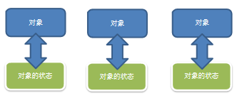
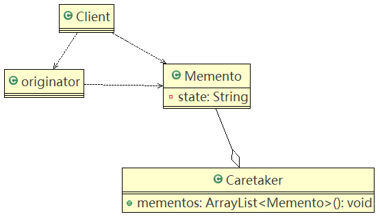

# 备忘录模式

## 问题引入

**游戏角色状态恢复问题：**

游戏角色有攻击力和防御力，在大战Boss前保存自身的状态(攻击力和防御力)，当大 战Boss后攻击力和防御力下降，从备忘录对象恢复到大战前的状态。

### 传统的设计方案

#### 类图



#### 问题分析

1. 一个对象，就对应一个保持状态的对象，这样当游戏的对象很多时，不利于管理，开销也很大。
2. 传统的方式是简单地做备份，new出另外一个对象出来，再把需要备份的数据放到这个新对象，但这就暴露了对象内部的细节。

## 基本介绍

1. 备忘录模式（Memento Pattern）在**不破坏封装性的前提下**，**捕获一个对象的内部状态**，并在该对象之外保存这个状态。这样以后就**可将该对象恢复到原先保存的状态**。
2. 可以理解备忘录模式为：现实生活中的备忘录是用来记录某些要去做的事情，或者是记录已经达成的共同意见的事情，以防忘记了。而在软件层面，备忘录模式有着相同的含义，备忘录对象主要用来记录一个对象的某种状态，或者某些数据，当要做回退时，可以从备忘录对象里获取原来的数据进行恢复操作。
3. 备忘录模式属于行为型模式。

### 原理类图

#### 类图



#### 角色说明

1. **Originator**：对象（需要保存状态的对象）
2. **Memento**：备忘录对象，负责保存好记录，即Originator内部状态
3. **Caretaker**：守护者对象，负责保存多个备忘录对象，使用集合管理，提高效率
4. 说明：如果希望保存多个originator对象的不同时间的状态，也可以，只需要HashMap<String,集合>

#### 代码实现

Client.java

```java
public class Client {

	public static void main(String[] args) {
		
		Originator originator = new Originator();
		Caretaker caretaker = new Caretaker();
		
		originator.setState(" 状态#1 攻击力 100 ");
		
		//保存了当前的状态
		caretaker.add(originator.saveStateMemento());
		
		originator.setState(" 状态#2 攻击力 80 ");
		
		caretaker.add(originator.saveStateMemento());
		
		originator.setState(" 状态#3 攻击力 50 ");
		caretaker.add(originator.saveStateMemento());
		
		System.out.println("当前的状态是 =" + originator.getState());
		
		//希望得到状态 1, 将 originator 恢复到状态1
		originator.getStateFromMemento(caretaker.get(0));
		System.out.println("恢复到状态1 , 当前的状态是");
		System.out.println("当前的状态是 =" + originator.getState());
		
	}

}
```

Memento.java

```java
public class Memento {
	private String state;

	//构造器
	public Memento(String state) {
		super();
		this.state = state;
	}

	public String getState() {
		return state;
	}
	
}
```

Originator.java

```java
public class Originator {

	private String state;//状态信息

	public String getState() {
		return state;
	}

	public void setState(String state) {
		this.state = state;
	}
	
	//编写一个方法，可以保存一个状态对象 Memento
	//因此编写一个方法，返回 Memento
	public Memento saveStateMemento() {
		return new Memento(state);
	}
	
	//通过备忘录对象，恢复状态
	public void getStateFromMemento(Memento memento) {
		state = memento.getState();
	}
}
```

Caretaker.java

```java
import java.util.ArrayList;
import java.util.List;

public class Caretaker {
	
	//在List 集合中会有很多的备忘录对象
	private List<Memento> mementoList = new ArrayList<Memento>();
	
	public void add(Memento memento) {
		mementoList.add(memento);
	}
	
	//获取到第index个Originator 的 备忘录对象(即保存状态)
	public Memento get(int index) {
		return mementoList.get(index);
	}
}
```

### 应用实例

#### 类图


#### 代码实现

Client.java

```java
public class Client {

	public static void main(String[] args) {
		//创建游戏角色
		GameRole gameRole = new GameRole();
		gameRole.setVit(100);
		gameRole.setDef(100);
		
		System.out.println("和boss大战前的状态");
		gameRole.display();
		
		//把当前状态保存caretaker
		Caretaker caretaker = new Caretaker();
		caretaker.setMemento(gameRole.createMemento());
		
		System.out.println("和boss大战~~~");
		gameRole.setDef(30);
		gameRole.setVit(30);
		
		gameRole.display();
		
		System.out.println("大战后，使用备忘录对象恢复到站前");
		
		gameRole.recoverGameRoleFromMemento(caretaker.getMemento());
		System.out.println("恢复后的状态");
		gameRole.display();
	}

}
```

Memento.java

```java
public class Memento {

	//攻击力
	private int vit;
	//防御力
	private int def;
	public Memento(int vit, int def) {
		super();
		this.vit = vit;
		this.def = def;
	}
	public int getVit() {
		return vit;
	}
	public void setVit(int vit) {
		this.vit = vit;
	}
	public int getDef() {
		return def;
	}
	public void setDef(int def) {
		this.def = def;
	}
	
}
```

GameRole.java

```java
public class GameRole {

	private int vit;
	private int def;
	
	//创建Memento ,即根据当前的状态得到Memento
	public Memento createMemento() {
		return new Memento(vit, def);
	}
	
	//从备忘录对象，恢复GameRole的状态
	public void recoverGameRoleFromMemento(Memento memento) {
		this.vit = memento.getVit();
		this.def = memento.getDef();
	}
	
	//显示当前游戏角色的状态
	public void display() {
		System.out.println("游戏角色当前的攻击力：" + this.vit + " 防御力: " + this.def);
	}

	public int getVit() {
		return vit;
	}

	public void setVit(int vit) {
		this.vit = vit;
	}

	public int getDef() {
		return def;
	}

	public void setDef(int def) {
		this.def = def;
	}
}
```

Caretaker.java

```java
import java.util.ArrayList;
import java.util.HashMap;

//守护者对象, 保存游戏角色的状态
public class Caretaker {

	//如果只保存一次状态
	private Memento  memento;
	//对GameRole 保存多次状态
	//private ArrayList<Memento> mementos;
	//对多个游戏角色保存多个状态
	//private HashMap<String, ArrayList<Memento>> rolesMementos;

	public Memento getMemento() {
		return memento;
	}

	public void setMemento(Memento memento) {
		this.memento = memento;
	}
	
}
```

## 注意事项和细节

1. 给用户提供了一种可以恢复状态的机制，可以使用户能够比较方便地回到某个历史的状态
2. 实现了信息的封装，使得用户不需要关心状态的保存细节。
3. 如果类的成员变量过多，势必会占用比较大的资源，而且每一次保存都会消耗一定的内存。
4. 应用场景：
   - 后悔药
   - 游戏的存档
   - Windows里的ctrl + z
   - IE中的后退
   - 数据库的事务管理
5. 为了节约内存，备忘录模式可以和原型模式配合使用。

