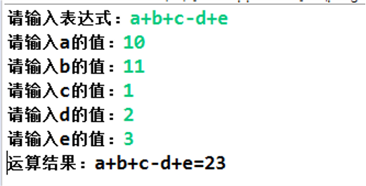
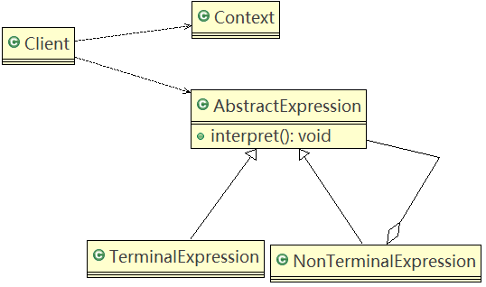
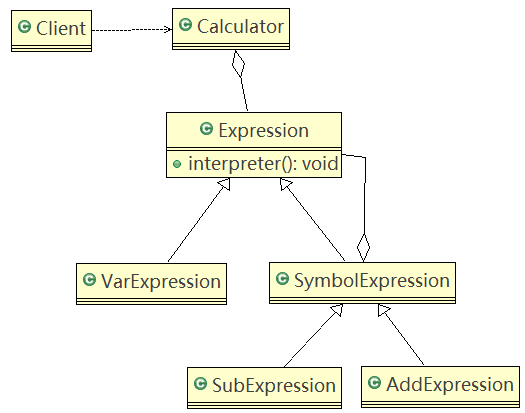

# 解释器模式

## 问题引入

**四则运算问题**

1. 输入表达式，如：a+b+c-d+e，要求表达式的字母不能重复
2. 在分别输入a,b,c,d,e的值



#### 问题分析

1. 编写一个方法，接收表达式的形式，然后根据用户输入的数值进行解析，得到结果
2. 如果加入新的运算符，如 * / (不利于扩展，另外让一个方法来解析会造成程序结构混乱，不够清晰)

## 解释器模式基本介绍

1. 在编译原理中，一个算术表达式通过词法分析器形成词法单元，而后这些词法单元再通过语法分析器构建语法分析树，最终形成一颗抽象的语法分析树。这里的词法分析器和语法分析器都可以看做是解释器。
2. 解释器模式（Interpreter Pattern）：**是指给定一个语言（表达式），定义它的文法的一种表示，并定义一个解释器，使用该解释器来解释语言中的句子（表达式）。**
3. 应用场景
   - 应用可以将一个需要解释器执行的语言中的句子表示为一个抽象语法树。
   - 一些重复出现的问题可以用一种简单的语言来表达
   - 一个简单语法需要解释的场景
   - 如：编译器、运算表达式计算、正则表达式、机器人等

### 原理类图

#### 类图



#### 角色说明

1. **Context**：环境角色，含有解释器之外的全局信息。
2. **AbstractExpression**：抽象表达式，声明一个抽象的解释操作，这个方法为抽象语法树中所有的节点所共享。
3. **TerminalExpression**：终结符表达式，实现与文法中的终结符相关的解释操作。
4. **NonTerminalExpression**：非终结符表达式，为文法中的非终结符实现解释操作。
5. 说明：输入Context 和 TerminalExpression信息通过Client输入即可。

### 应用实例

#### 类图



#### 代码实现

AddExpression.java

```java
import java.util.HashMap;

/**
 * 加法解释器
 * @author Administrator
 *
 */
public class AddExpression extends SymbolExpression  {

	public AddExpression(Expression left, Expression right) {
		super(left, right);
	}

	//处理相加
	//var 仍然是 {a=10,b=20}..
	//一会我们debug 源码,就ok
	public int interpreter(HashMap<String, Integer> var) {
		//super.left.interpreter(var) ： 返回 left 表达式对应的值 a = 10
		//super.right.interpreter(var): 返回right 表达式对应值 b = 20
		return super.left.interpreter(var) + super.right.interpreter(var);
	}
}
```

Calculator.java

```java
import java.util.HashMap;
import java.util.Stack;

public class Calculator {

	// 定义表达式
	private Expression expression;

	// 构造函数传参，并解析
	public Calculator(String expStr) { // expStr = a+b
		// 安排运算先后顺序
		Stack<Expression> stack = new Stack<>();
		// 表达式拆分成字符数组 
		char[] charArray = expStr.toCharArray();// [a, +, b]

		Expression left = null;
		Expression right = null;
		//遍历我们的字符数组， 即遍历  [a, +, b]
		//针对不同的情况，做处理
		for (int i = 0; i < charArray.length; i++) {
			switch (charArray[i]) {
			case '+': //
				left = stack.pop();// 从stack取出left => "a"
				right = new VarExpression(String.valueOf(charArray[++i]));// 取出右表达式 "b"
				stack.push(new AddExpression(left, right));// 然后根据得到left 和 right 构建 AddExpresson加入stack
				break;
			case '-': // 
				left = stack.pop();
				right = new VarExpression(String.valueOf(charArray[++i]));
				stack.push(new SubExpression(left, right));
				break;
			default: 
				//如果是一个 Var 就创建要给 VarExpression 对象，并push到 stack
				stack.push(new VarExpression(String.valueOf(charArray[i])));
				break;
			}
		}
		//当遍历完整个 charArray 数组后，stack 就得到最后Expression
		this.expression = stack.pop();
	}

	public int run(HashMap<String, Integer> var) {
		//最后将表达式a+b和 var = {a=10,b=20}
		//然后传递给expression的interpreter进行解释执行
		return this.expression.interpreter(var);
	}
}
```

Expression.java

```java
import java.util.HashMap;

/**
 * 抽象类表达式，通过HashMap 键值对, 可以获取到变量的值
 * 
 * @author Administrator
 */
public abstract class Expression {
	// a + b - c
	// 解释公式和数值, key 就是公式(表达式) 参数[a,b,c], value就是就是具体值
	// HashMap {a=10, b=20}
	public abstract int interpreter(HashMap<String, Integer> var);
}
```

SubExpression.java

```java
import java.util.HashMap;

public class SubExpression extends SymbolExpression {

	public SubExpression(Expression left, Expression right) {
		super(left, right);
	}

	//求出left 和 right 表达式相减后的结果
	public int interpreter(HashMap<String, Integer> var) {
		return super.left.interpreter(var) - super.right.interpreter(var);
	}
}
```

SymbolExpression.java

```java
import java.util.HashMap;

/**
 * 抽象运算符号解析器 这里，每个运算符号，都只和自己左右两个数字有关系，
 * 但左右两个数字有可能也是一个解析的结果，无论何种类型，都是Expression类的实现类
 * @author Administrator
 */
public class SymbolExpression extends Expression {

	protected Expression left;
	protected Expression right;

	public SymbolExpression(Expression left, Expression right) {
		this.left = left;
		this.right = right;
	}

	//因为 SymbolExpression 是让其子类来实现，因此 interpreter 是一个默认实现
	@Override
	public int interpreter(HashMap<String, Integer> var) {
		return 0;
	}
}
```

VarExpression.java

```java
import java.util.HashMap;

/**
 * 变量的解释器
 * @author Administrator
 *
 */
public class VarExpression extends Expression {

	private String key; // key=a,key=b,key=c

	public VarExpression(String key) {
		this.key = key;
	}

	// var 就是{a=10, b=20}
	// interpreter 根据 变量名称，返回对应值
	@Override
	public int interpreter(HashMap<String, Integer> var) {
		return var.get(this.key);
	}
}
```

ClientTest.java

```java
import java.io.BufferedReader;
import java.io.IOException;
import java.io.InputStreamReader;
import java.util.HashMap;

public class ClientTest {

	public static void main(String[] args) throws IOException {
		String expStr = getExpStr(); // a+b
		HashMap<String, Integer> var = getValue(expStr);// var {a=10, b=20}
		Calculator calculator = new Calculator(expStr);
		System.out.println("运算结果：" + expStr + "=" + calculator.run(var));
	}

	// 获得表达式
	public static String getExpStr() throws IOException {
		System.out.print("请输入表达式：");
		return (new BufferedReader(new InputStreamReader(System.in))).readLine();
	}

	// 获得值映射
	public static HashMap<String, Integer> getValue(String expStr) throws IOException {
		HashMap<String, Integer> map = new HashMap<>();

		for (char ch : expStr.toCharArray()) {
			if (ch != '+' && ch != '-') {
				if (!map.containsKey(String.valueOf(ch))) {
					System.out.print("请输入" + String.valueOf(ch) + "的值：");
					String in = (new BufferedReader(new InputStreamReader(System.in))).readLine();
					map.put(String.valueOf(ch), Integer.valueOf(in));
				}
			}
		}

		return map;
	}
}
```

## 解释器模式在Spring框架应用的源码分析

Spring框架中SpelExpressionParser就使用到解释器模式

#### 源码

```java
import org.springframework.expression.Expression;
import org.springframework.expression.spel.standard.SpelExpressionParser;

public class Interpreter {

	public static void main(String[] args) {
		//创建一个 Parser 对象
		SpelExpressionParser parser = new SpelExpressionParser();
		//通过 Parser 对象 获取到一个Expression对象
		//会根据不同的  Parser 对象 ，返回不同的 Expression对象
		Expression expression = parser.parseExpression("10 * (2 + 1) * 1 + 66"); //96
		int result = (Integer) expression.getValue();
		System.out.println(result);
	}

}
```

```java
package org.springframework.expression;

/**
 * Parses expression strings into compiled expressions that can be evaluated.
 * Supports parsing templates as well as standard expression strings.
 *
 * @author Keith Donald
 * @author Andy Clement
 * @since 3.0
 */
public interface ExpressionParser {

	/**
	 * Parse the expression string and return an Expression object you can use for repeated evaluation.
	 * <p>Some examples:
	 * <pre class="code">
	 *     3 + 4
	 *     name.firstName
	 * </pre>
	 * @param expressionString the raw expression string to parse
	 * @return an evaluator for the parsed expression
	 * @throws ParseException an exception occurred during parsing
	 */
	Expression parseExpression(String expressionString) throws ParseException;

	/**
	 * Parse the expression string and return an Expression object you can use for repeated evaluation.
	 * <p>Some examples:
	 * <pre class="code">
	 *     3 + 4
	 *     name.firstName
	 * </pre>
	 * @param expressionString the raw expression string to parse
	 * @param context a context for influencing this expression parsing routine (optional)
	 * @return an evaluator for the parsed expression
	 * @throws ParseException an exception occurred during parsing
	 */
	Expression parseExpression(String expressionString, ParserContext context) throws ParseException;

}
```

```java
package org.springframework.expression.common;

import java.util.LinkedList;
import java.util.List;
import java.util.Stack;

import org.springframework.expression.Expression;
import org.springframework.expression.ExpressionParser;
import org.springframework.expression.ParseException;
import org.springframework.expression.ParserContext;

/**
 * An expression parser that understands templates. It can be subclassed by expression
 * parsers that do not offer first class support for templating.
 * 
 * @author Keith Donald
 * @author Juergen Hoeller
 * @author Andy Clement
 * @since 3.0
 */
public abstract class TemplateAwareExpressionParser implements ExpressionParser {

	/**
	 * Default ParserContext instance for non-template expressions.
	 */
	private static final ParserContext NON_TEMPLATE_PARSER_CONTEXT = new ParserContext() {

		@Override
		public String getExpressionPrefix() {
			return null;
		}

		@Override
		public String getExpressionSuffix() {
			return null;
		}

		@Override
		public boolean isTemplate() {
			return false;
		}
	};

	@Override
	public Expression parseExpression(String expressionString) throws ParseException {
		return parseExpression(expressionString, NON_TEMPLATE_PARSER_CONTEXT);
	}

	@Override
	public Expression parseExpression(String expressionString, ParserContext context)
			throws ParseException {
		if (context == null) {
			context = NON_TEMPLATE_PARSER_CONTEXT;
		}

		if (context.isTemplate()) {
			return parseTemplate(expressionString, context);
		}
		else {
			return doParseExpression(expressionString, context);
		}
	}

	private Expression parseTemplate(String expressionString, ParserContext context)
			throws ParseException {
		if (expressionString.length() == 0) {
			return new LiteralExpression("");
		}
		Expression[] expressions = parseExpressions(expressionString, context);
		if (expressions.length == 1) {
			return expressions[0];
		}
		else {
			return new CompositeStringExpression(expressionString, expressions);
		}
	}

	/**
	 * Helper that parses given expression string using the configured parser. The
	 * expression string can contain any number of expressions all contained in "${...}"
	 * markers. For instance: "foo${expr0}bar${expr1}". The static pieces of text will
	 * also be returned as Expressions that just return that static piece of text. As a
	 * result, evaluating all returned expressions and concatenating the results produces
	 * the complete evaluated string. Unwrapping is only done of the outermost delimiters
	 * found, so the string 'hello ${foo${abc}}' would break into the pieces 'hello ' and
	 * 'foo${abc}'. This means that expression languages that used ${..} as part of their
	 * functionality are supported without any problem. The parsing is aware of the
	 * structure of an embedded expression. It assumes that parentheses '(', square
	 * brackets '[' and curly brackets '}' must be in pairs within the expression unless
	 * they are within a string literal and a string literal starts and terminates with a
	 * single quote '.
	 * @param expressionString the expression string
	 * @return the parsed expressions
	 * @throws ParseException when the expressions cannot be parsed
	 */
	private Expression[] parseExpressions(String expressionString, ParserContext context)
			throws ParseException {
		List<Expression> expressions = new LinkedList<Expression>();
		String prefix = context.getExpressionPrefix();
		String suffix = context.getExpressionSuffix();
		int startIdx = 0;
		while (startIdx < expressionString.length()) {
			int prefixIndex = expressionString.indexOf(prefix, startIdx);
			if (prefixIndex >= startIdx) {
				// an inner expression was found - this is a composite
				if (prefixIndex > startIdx) {
					expressions.add(createLiteralExpression(context,
							expressionString.substring(startIdx, prefixIndex)));
				}
				int afterPrefixIndex = prefixIndex + prefix.length();
				int suffixIndex = skipToCorrectEndSuffix(prefix, suffix,
						expressionString, afterPrefixIndex);

				if (suffixIndex == -1) {
					throw new ParseException(expressionString, prefixIndex,
							"No ending suffix '" + suffix
									+ "' for expression starting at character "
									+ prefixIndex + ": "
									+ expressionString.substring(prefixIndex));
				}

				if (suffixIndex == afterPrefixIndex) {
					throw new ParseException(expressionString, prefixIndex,
							"No expression defined within delimiter '" + prefix + suffix
									+ "' at character " + prefixIndex);
				}

				String expr = expressionString.substring(prefixIndex + prefix.length(),
						suffixIndex);
				expr = expr.trim();

				if (expr.length() == 0) {
					throw new ParseException(expressionString, prefixIndex,
							"No expression defined within delimiter '" + prefix + suffix
									+ "' at character " + prefixIndex);
				}

				expressions.add(doParseExpression(expr, context));
				startIdx = suffixIndex + suffix.length();
			}
			else {
				// no more ${expressions} found in string, add rest as static text
				expressions.add(createLiteralExpression(context,
						expressionString.substring(startIdx)));
				startIdx = expressionString.length();
			}
		}
		return expressions.toArray(new Expression[expressions.size()]);
	}

	private Expression createLiteralExpression(ParserContext context, String text) {
		return new LiteralExpression(text);
	}

	/**
	 * Return true if the specified suffix can be found at the supplied position in the
	 * supplied expression string.
	 * @param expressionString the expression string which may contain the suffix
	 * @param pos the start position at which to check for the suffix
	 * @param suffix the suffix string
	 */
	private boolean isSuffixHere(String expressionString, int pos, String suffix) {
		int suffixPosition = 0;
		for (int i = 0; i < suffix.length() && pos < expressionString.length(); i++) {
			if (expressionString.charAt(pos++) != suffix.charAt(suffixPosition++)) {
				return false;
			}
		}
		if (suffixPosition != suffix.length()) {
			// the expressionString ran out before the suffix could entirely be found
			return false;
		}
		return true;
	}

	/**
	 * Copes with nesting, for example '${...${...}}' where the correct end for the first
	 * ${ is the final }.
	 * @param prefix the prefix
	 * @param suffix the suffix
	 * @param expressionString the expression string
	 * @param afterPrefixIndex the most recently found prefix location for which the
	 *        matching end suffix is being sought
	 * @return the position of the correct matching nextSuffix or -1 if none can be found
	 */
	private int skipToCorrectEndSuffix(String prefix, String suffix,
			String expressionString, int afterPrefixIndex) throws ParseException {
		// Chew on the expression text - relying on the rules:
		// brackets must be in pairs: () [] {}
		// string literals are "..." or '...' and these may contain unmatched brackets
		int pos = afterPrefixIndex;
		int maxlen = expressionString.length();
		int nextSuffix = expressionString.indexOf(suffix, afterPrefixIndex);
		if (nextSuffix == -1) {
			return -1; // the suffix is missing
		}
		Stack<Bracket> stack = new Stack<Bracket>();
		while (pos < maxlen) {
			if (isSuffixHere(expressionString, pos, suffix) && stack.isEmpty()) {
				break;
			}
			char ch = expressionString.charAt(pos);
			switch (ch) {
				case '{':
				case '[':
				case '(':
					stack.push(new Bracket(ch, pos));
					break;
				case '}':
				case ']':
				case ')':
					if (stack.isEmpty()) {
						throw new ParseException(expressionString, pos, "Found closing '"
								+ ch + "' at position " + pos + " without an opening '"
								+ Bracket.theOpenBracketFor(ch) + "'");
					}
					Bracket p = stack.pop();
					if (!p.compatibleWithCloseBracket(ch)) {
						throw new ParseException(expressionString, pos, "Found closing '"
								+ ch + "' at position " + pos
								+ " but most recent opening is '" + p.bracket
								+ "' at position " + p.pos);
					}
					break;
				case '\'':
				case '"':
					// jump to the end of the literal
					int endLiteral = expressionString.indexOf(ch, pos + 1);
					if (endLiteral == -1) {
						throw new ParseException(expressionString, pos,
								"Found non terminating string literal starting at position "
										+ pos);
					}
					pos = endLiteral;
					break;
			}
			pos++;
		}
		if (!stack.isEmpty()) {
			Bracket p = stack.pop();
			throw new ParseException(expressionString, p.pos, "Missing closing '"
					+ Bracket.theCloseBracketFor(p.bracket) + "' for '" + p.bracket
					+ "' at position " + p.pos);
		}
		if (!isSuffixHere(expressionString, pos, suffix)) {
			return -1;
		}
		return pos;
	}


	/**
	 * This captures a type of bracket and the position in which it occurs in the
	 * expression. The positional information is used if an error has to be reported
	 * because the related end bracket cannot be found. Bracket is used to describe:
	 * square brackets [] round brackets () and curly brackets {}
	 */
	private static class Bracket {

		char bracket;

		int pos;

		Bracket(char bracket, int pos) {
			this.bracket = bracket;
			this.pos = pos;
		}

		boolean compatibleWithCloseBracket(char closeBracket) {
			if (this.bracket == '{') {
				return closeBracket == '}';
			}
			else if (this.bracket == '[') {
				return closeBracket == ']';
			}
			return closeBracket == ')';
		}

		static char theOpenBracketFor(char closeBracket) {
			if (closeBracket == '}') {
				return '{';
			}
			else if (closeBracket == ']') {
				return '[';
			}
			return '(';
		}

		static char theCloseBracketFor(char openBracket) {
			if (openBracket == '{') {
				return '}';
			}
			else if (openBracket == '[') {
				return ']';
			}
			return ')';
		}
	}

	/**
	 * Actually parse the expression string and return an Expression object.
	 * @param expressionString the raw expression string to parse
	 * @param context a context for influencing this expression parsing routine (optional)
	 * @return an evaluator for the parsed expression
	 * @throws ParseException an exception occurred during parsing
	 */
	protected abstract Expression doParseExpression(String expressionString,
			ParserContext context) throws ParseException;

}
```

```java
package org.springframework.expression.spel.standard;

import java.util.ArrayList;
import java.util.LinkedList;
import java.util.List;
import java.util.Stack;
import java.util.regex.Pattern;

import org.springframework.expression.ParseException;
import org.springframework.expression.ParserContext;
import org.springframework.expression.common.TemplateAwareExpressionParser;
import org.springframework.expression.spel.InternalParseException;
import org.springframework.expression.spel.SpelMessage;
import org.springframework.expression.spel.SpelParseException;
import org.springframework.expression.spel.SpelParserConfiguration;
import org.springframework.expression.spel.ast.*;
import org.springframework.util.Assert;
import org.springframework.util.StringUtils;

/**
 * Hand written SpEL parser. Instances are reusable but are not thread safe.
 *
 * @author Andy Clement
 * @author Phillip Webb
 * @since 3.0
 */
class InternalSpelExpressionParser extends TemplateAwareExpressionParser {

	private static final Pattern VALID_QUALIFIED_ID_PATTERN = Pattern.compile("[\\p{L}\\p{N}_$]+");


	// The expression being parsed
	private String expressionString;

	// The token stream constructed from that expression string
	private List<Token> tokenStream;

	// length of a populated token stream
	private int tokenStreamLength;

	// Current location in the token stream when processing tokens
	private int tokenStreamPointer;

	// For rules that build nodes, they are stacked here for return
	private final Stack<SpelNodeImpl> constructedNodes = new Stack<SpelNodeImpl>();

	private final SpelParserConfiguration configuration;


	/**
	 * Create a parser with some configured behavior.
	 * @param configuration custom configuration options
	 */
	public InternalSpelExpressionParser(SpelParserConfiguration configuration) {
		this.configuration = configuration;
	}


	@Override
	protected SpelExpression doParseExpression(String expressionString, ParserContext context) throws ParseException {
		try {
			this.expressionString = expressionString;
			Tokenizer tokenizer = new Tokenizer(expressionString);
			tokenizer.process();
			this.tokenStream = tokenizer.getTokens();
			this.tokenStreamLength = this.tokenStream.size();
			this.tokenStreamPointer = 0;
			this.constructedNodes.clear();
			SpelNodeImpl ast = eatExpression();
			if (moreTokens()) {
				throw new SpelParseException(peekToken().startpos,SpelMessage.MORE_INPUT,toString(nextToken()));
			}
			Assert.isTrue(this.constructedNodes.isEmpty());
			return new SpelExpression(expressionString, ast, this.configuration);
		}
		catch (InternalParseException ipe) {
			throw ipe.getCause();
		}
	}

	//	expression
	//    : logicalOrExpression
	//      ( (ASSIGN^ logicalOrExpression)
	//	    | (DEFAULT^ logicalOrExpression)
	//	    | (QMARK^ expression COLON! expression)
	//      | (ELVIS^ expression))?;
	private SpelNodeImpl eatExpression() {
		SpelNodeImpl expr = eatLogicalOrExpression();
		if (moreTokens()) {
			Token t = peekToken();
			if (t.kind==TokenKind.ASSIGN) { // a=b
				if (expr==null) {
					expr = new NullLiteral(toPos(t.startpos-1,t.endpos-1));
				}
				nextToken();
				SpelNodeImpl assignedValue = eatLogicalOrExpression();
				return new Assign(toPos(t),expr,assignedValue);
			}

			if (t.kind==TokenKind.ELVIS) { // a?:b (a if it isn't null, otherwise b)
				if (expr==null) {
					expr = new NullLiteral(toPos(t.startpos-1,t.endpos-2));
				}
				nextToken(); // elvis has left the building
				SpelNodeImpl valueIfNull = eatExpression();
				if (valueIfNull==null) {
					valueIfNull = new NullLiteral(toPos(t.startpos+1,t.endpos+1));
				}
				return new Elvis(toPos(t),expr,valueIfNull);
			}

			if (t.kind==TokenKind.QMARK) { // a?b:c
				if (expr==null) {
					expr = new NullLiteral(toPos(t.startpos-1,t.endpos-1));
				}
				nextToken();
				SpelNodeImpl ifTrueExprValue = eatExpression();
				eatToken(TokenKind.COLON);
				SpelNodeImpl ifFalseExprValue = eatExpression();
				return new Ternary(toPos(t),expr,ifTrueExprValue,ifFalseExprValue);
			}
		}
		return expr;
	}

	//logicalOrExpression : logicalAndExpression (OR^ logicalAndExpression)*;
	private SpelNodeImpl eatLogicalOrExpression() {
		SpelNodeImpl expr = eatLogicalAndExpression();
		while (peekIdentifierToken("or") || peekToken(TokenKind.SYMBOLIC_OR)) {
			Token t = nextToken(); //consume OR
			SpelNodeImpl rhExpr = eatLogicalAndExpression();
			checkOperands(t,expr,rhExpr);
			expr = new OpOr(toPos(t),expr,rhExpr);
		}
		return expr;
	}

	// logicalAndExpression : relationalExpression (AND^ relationalExpression)*;
	private SpelNodeImpl eatLogicalAndExpression() {
		SpelNodeImpl expr = eatRelationalExpression();
		while (peekIdentifierToken("and") || peekToken(TokenKind.SYMBOLIC_AND)) {
			Token t = nextToken();// consume 'AND'
			SpelNodeImpl rhExpr = eatRelationalExpression();
			checkOperands(t,expr,rhExpr);
			expr = new OpAnd(toPos(t),expr,rhExpr);
		}
		return expr;
	}

	// relationalExpression : sumExpression (relationalOperator^ sumExpression)?;
	private SpelNodeImpl eatRelationalExpression() {
		SpelNodeImpl expr = eatSumExpression();
		Token relationalOperatorToken = maybeEatRelationalOperator();
		if (relationalOperatorToken != null) {
			Token t = nextToken(); //consume relational operator token
			SpelNodeImpl rhExpr = eatSumExpression();
			checkOperands(t,expr,rhExpr);
			TokenKind tk = relationalOperatorToken.kind;

			if (relationalOperatorToken.isNumericRelationalOperator()) {
				int pos = toPos(t);
				if (tk == TokenKind.GT) {
					return new OpGT(pos, expr, rhExpr);
				}
				if (tk == TokenKind.LT) {
					return new OpLT(pos, expr, rhExpr);
				}
				if (tk == TokenKind.LE) {
					return new OpLE(pos, expr, rhExpr);
				}
				if (tk == TokenKind.GE) {
					return new OpGE(pos, expr, rhExpr);
				}
				if (tk == TokenKind.EQ) {
					return new OpEQ(pos, expr, rhExpr);
				}
				Assert.isTrue(tk == TokenKind.NE);
				return new OpNE(pos, expr, rhExpr);
			}

			if (tk == TokenKind.INSTANCEOF) {
				return new OperatorInstanceof(toPos(t), expr, rhExpr);
			}

			if (tk == TokenKind.MATCHES) {
				return new OperatorMatches(toPos(t), expr, rhExpr);
			}

			Assert.isTrue(tk == TokenKind.BETWEEN);
			return new OperatorBetween(toPos(t), expr, rhExpr);
		}
		return expr;
	}

	//sumExpression: productExpression ( (PLUS^ | MINUS^) productExpression)*;
	private SpelNodeImpl eatSumExpression() {
		SpelNodeImpl expr = eatProductExpression();
		while (peekToken(TokenKind.PLUS, TokenKind.MINUS, TokenKind.INC)) {
			Token t = nextToken();//consume PLUS or MINUS or INC
			SpelNodeImpl rhExpr = eatProductExpression();
			checkRightOperand(t,rhExpr);
			if (t.kind == TokenKind.PLUS) {
				expr = new OpPlus(toPos(t), expr, rhExpr);
			}
			else if (t.kind == TokenKind.MINUS) {
				expr = new OpMinus(toPos(t), expr, rhExpr);
			}
		}
		return expr;
	}

	// productExpression: powerExpr ((STAR^ | DIV^| MOD^) powerExpr)* ;
	private SpelNodeImpl eatProductExpression() {
		SpelNodeImpl expr = eatPowerIncDecExpression();
		while (peekToken(TokenKind.STAR, TokenKind.DIV, TokenKind.MOD)) {
			Token t = nextToken(); // consume STAR/DIV/MOD
			SpelNodeImpl rhExpr = eatPowerIncDecExpression();
			checkOperands(t,expr,rhExpr);
			if (t.kind == TokenKind.STAR) {
				expr = new OpMultiply(toPos(t), expr, rhExpr);
			}
			else if (t.kind == TokenKind.DIV) {
				expr = new OpDivide(toPos(t), expr, rhExpr);
			}
			else {
				Assert.isTrue(t.kind == TokenKind.MOD);
				expr = new OpModulus(toPos(t), expr, rhExpr);
			}
		}
		return expr;
	}

	// powerExpr  : unaryExpression (POWER^ unaryExpression)? (INC || DEC) ;
	private SpelNodeImpl eatPowerIncDecExpression() {
		SpelNodeImpl expr = eatUnaryExpression();
		if (peekToken(TokenKind.POWER)) {
			Token t = nextToken();//consume POWER
			SpelNodeImpl rhExpr = eatUnaryExpression();
			checkRightOperand(t,rhExpr);
			return new OperatorPower(toPos(t),expr, rhExpr);
		}

		if (expr!=null && peekToken(TokenKind.INC,TokenKind.DEC)) {
			Token t = nextToken();//consume INC/DEC
			if (t.getKind()==TokenKind.INC) {
				return new OpInc(toPos(t),true,expr);
			}
			return new OpDec(toPos(t),true,expr);
		}

		return expr;
	}

	// unaryExpression: (PLUS^ | MINUS^ | BANG^ | INC^ | DEC^) unaryExpression | primaryExpression ;
	private SpelNodeImpl eatUnaryExpression() {
		if (peekToken(TokenKind.PLUS, TokenKind.MINUS, TokenKind.NOT)) {
			Token t = nextToken();
			SpelNodeImpl expr = eatUnaryExpression();
			if (t.kind == TokenKind.NOT) {
				return new OperatorNot(toPos(t), expr);
			}

			if (t.kind == TokenKind.PLUS) {
				return new OpPlus(toPos(t), expr);
			}
			Assert.isTrue(t.kind == TokenKind.MINUS);
			return new OpMinus(toPos(t), expr);

		}
		if (peekToken(TokenKind.INC, TokenKind.DEC)) {
			Token t = nextToken();
			SpelNodeImpl expr = eatUnaryExpression();
			if (t.getKind() == TokenKind.INC) {
				return new OpInc(toPos(t), false, expr);
			}
			return new OpDec(toPos(t), false, expr);
		}

		return eatPrimaryExpression();
	}

	// primaryExpression : startNode (node)? -> ^(EXPRESSION startNode (node)?);
	private SpelNodeImpl eatPrimaryExpression() {
		List<SpelNodeImpl> nodes = new ArrayList<SpelNodeImpl>();
		SpelNodeImpl start = eatStartNode(); // always a start node
		nodes.add(start);
		while (maybeEatNode()) {
			nodes.add(pop());
		}
		if (nodes.size() == 1) {
			return nodes.get(0);
		}
		return new CompoundExpression(toPos(start.getStartPosition(),
				nodes.get(nodes.size() - 1).getEndPosition()),
				nodes.toArray(new SpelNodeImpl[nodes.size()]));
	}

	// node : ((DOT dottedNode) | (SAFE_NAVI dottedNode) | nonDottedNode)+;
	private boolean maybeEatNode() {
		SpelNodeImpl expr = null;
		if (peekToken(TokenKind.DOT,TokenKind.SAFE_NAVI)) {
			expr = eatDottedNode();
		} else {
			expr = maybeEatNonDottedNode();
		}

		if (expr==null) {
			return false;
		} else {
			push(expr);
			return true;
		}
	}

	// nonDottedNode: indexer;
	private SpelNodeImpl maybeEatNonDottedNode() {
		if (peekToken(TokenKind.LSQUARE)) {
			if (maybeEatIndexer()) {
				return pop();
			}
		}
		return null;
	}

	//dottedNode
	// : ((methodOrProperty
	//	  | functionOrVar
	//    | projection
	//    | selection
	//    | firstSelection
	//    | lastSelection
	//    ))
	//	;
	private SpelNodeImpl eatDottedNode() {
		Token t = nextToken();// it was a '.' or a '?.'
		boolean nullSafeNavigation = t.kind == TokenKind.SAFE_NAVI;
		if (maybeEatMethodOrProperty(nullSafeNavigation) || maybeEatFunctionOrVar()
				|| maybeEatProjection(nullSafeNavigation)
				|| maybeEatSelection(nullSafeNavigation)) {
			return pop();
		}
		if (peekToken() == null) {
			// unexpectedly ran out of data
			raiseInternalException(t.startpos, SpelMessage.OOD);
		}
		else {
			raiseInternalException(t.startpos, SpelMessage.UNEXPECTED_DATA_AFTER_DOT,
					toString(peekToken()));
		}
		return null;
	}

	// functionOrVar
	// : (POUND ID LPAREN) => function
	// | var
	//
	// function : POUND id=ID methodArgs -> ^(FUNCTIONREF[$id] methodArgs);
	// var : POUND id=ID -> ^(VARIABLEREF[$id]);
	private boolean maybeEatFunctionOrVar() {
		if (!peekToken(TokenKind.HASH)) {
			return false;
		}
		Token t = nextToken();
		Token functionOrVariableName = eatToken(TokenKind.IDENTIFIER);
		SpelNodeImpl[] args = maybeEatMethodArgs();
		if (args == null) {
			push(new VariableReference(functionOrVariableName.data, toPos(t.startpos,
					functionOrVariableName.endpos)));
			return true;
		}

		push(new FunctionReference(functionOrVariableName.data, toPos(t.startpos,
				functionOrVariableName.endpos), args));
		return true;
	}

	// methodArgs : LPAREN! (argument (COMMA! argument)* (COMMA!)?)? RPAREN!;
	private SpelNodeImpl[] maybeEatMethodArgs() {
		if (!peekToken(TokenKind.LPAREN)) {
			return null;
		}
		List<SpelNodeImpl> args = new ArrayList<SpelNodeImpl>();
		consumeArguments(args);
		eatToken(TokenKind.RPAREN);
		return args.toArray(new SpelNodeImpl[args.size()]);
	}

	private void eatConstructorArgs(List<SpelNodeImpl> accumulatedArguments) {
		if (!peekToken(TokenKind.LPAREN)) {
			throw new InternalParseException(new SpelParseException(this.expressionString,positionOf(peekToken()),SpelMessage.MISSING_CONSTRUCTOR_ARGS));
		}
		consumeArguments(accumulatedArguments);
		eatToken(TokenKind.RPAREN);
	}

	/**
	 * Used for consuming arguments for either a method or a constructor call
	 */
	private void consumeArguments(List<SpelNodeImpl> accumulatedArguments) {
		int pos = peekToken().startpos;
		Token next = null;
		do {
			nextToken();// consume ( (first time through) or comma (subsequent times)
			Token t = peekToken();
			if (t == null) {
				raiseInternalException(pos, SpelMessage.RUN_OUT_OF_ARGUMENTS);
			}
			if (t.kind != TokenKind.RPAREN) {
				accumulatedArguments.add(eatExpression());
			}
			next = peekToken();
		}
		while (next != null && next.kind == TokenKind.COMMA);

		if (next == null) {
			raiseInternalException(pos, SpelMessage.RUN_OUT_OF_ARGUMENTS);
		}
	}

	private int positionOf(Token t) {
		if (t == null) {
			// if null assume the problem is because the right token was
			// not found at the end of the expression
			return this.expressionString.length();
		}
		return t.startpos;
	}

	//startNode
	// : parenExpr | literal
	//	    | type
	//	    | methodOrProperty
	//	    | functionOrVar
	//	    | projection
	//	    | selection
	//	    | firstSelection
	//	    | lastSelection
	//	    | indexer
	//	    | constructor
	private SpelNodeImpl eatStartNode() {
		if (maybeEatLiteral()) {
			return pop();
		}
		else if (maybeEatParenExpression()) {
			return pop();
		}
		else if (maybeEatTypeReference() || maybeEatNullReference()
				|| maybeEatConstructorReference() || maybeEatMethodOrProperty(false)
				|| maybeEatFunctionOrVar()) {
			return pop();
		}
		else if (maybeEatBeanReference()) {
			return pop();
		}
		else if (maybeEatProjection(false) || maybeEatSelection(false)
				|| maybeEatIndexer()) {
			return pop();
		}
		else if (maybeEatInlineList()) {
			return pop();
		}
		else {
			return null;
		}
	}

	// parse: @beanname @'bean.name'
	// quoted if dotted
	private boolean maybeEatBeanReference() {
		if (peekToken(TokenKind.BEAN_REF)) {
			Token beanRefToken = nextToken();
			Token beanNameToken = null;
			String beanname = null;
			if (peekToken(TokenKind.IDENTIFIER)) {
				beanNameToken = eatToken(TokenKind.IDENTIFIER);
				beanname = beanNameToken.data;
			}
			else if (peekToken(TokenKind.LITERAL_STRING)) {
				beanNameToken = eatToken(TokenKind.LITERAL_STRING);
				beanname = beanNameToken.stringValue();
				beanname = beanname.substring(1, beanname.length() - 1);
			}
			else {
				raiseInternalException(beanRefToken.startpos,
						SpelMessage.INVALID_BEAN_REFERENCE);
			}

			BeanReference beanReference = new BeanReference(toPos(beanNameToken),beanname);
			this.constructedNodes.push(beanReference);
			return true;
		}
		return false;
	}

	private boolean maybeEatTypeReference() {
		if (peekToken(TokenKind.IDENTIFIER)) {
			Token typeName = peekToken();
			if (!typeName.stringValue().equals("T")) {
				return false;
			}
			nextToken();
			eatToken(TokenKind.LPAREN);
			SpelNodeImpl node = eatPossiblyQualifiedId();
			// dotted qualified id
			// Are there array dimensions?
			int dims = 0;
			while (peekToken(TokenKind.LSQUARE,true)) {
				eatToken(TokenKind.RSQUARE);
				dims++;
			}
			eatToken(TokenKind.RPAREN);
			this.constructedNodes.push(new TypeReference(toPos(typeName),node,dims));
			return true;
		}
		return false;
	}

	private boolean maybeEatNullReference() {
		if (peekToken(TokenKind.IDENTIFIER)) {
			Token nullToken = peekToken();
			if (!nullToken.stringValue().equalsIgnoreCase("null")) {
				return false;
			}
			nextToken();
			this.constructedNodes.push(new NullLiteral(toPos(nullToken)));
			return true;
		}
		return false;
	}

	//projection: PROJECT^ expression RCURLY!;
	private boolean maybeEatProjection(boolean nullSafeNavigation) {
		Token t = peekToken();
		if (!peekToken(TokenKind.PROJECT, true)) {
			return false;
		}
		SpelNodeImpl expr = eatExpression();
		eatToken(TokenKind.RSQUARE);
		this.constructedNodes.push(new Projection(nullSafeNavigation, toPos(t), expr));
		return true;
	}

	// list = LCURLY (element (COMMA element)*) RCURLY
	private boolean maybeEatInlineList() {
		Token t = peekToken();
		if (!peekToken(TokenKind.LCURLY, true)) {
			return false;
		}
		SpelNodeImpl expr = null;
		Token closingCurly = peekToken();
		if (peekToken(TokenKind.RCURLY, true)) {
			// empty list '[]'
			expr = new InlineList(toPos(t.startpos,closingCurly.endpos));
		}
		else {
			List<SpelNodeImpl> listElements = new ArrayList<SpelNodeImpl>();
			do {
				listElements.add(eatExpression());
			} while (peekToken(TokenKind.COMMA,true));

			closingCurly = eatToken(TokenKind.RCURLY);
			expr = new InlineList(toPos(t.startpos,closingCurly.endpos),listElements.toArray(new SpelNodeImpl[listElements.size()]));
		}
		this.constructedNodes.push(expr);
		return true;
	}

	private boolean maybeEatIndexer() {
		Token t = peekToken();
		if (!peekToken(TokenKind.LSQUARE, true)) {
			return false;
		}
		SpelNodeImpl expr = eatExpression();
		eatToken(TokenKind.RSQUARE);
		this.constructedNodes.push(new Indexer(toPos(t),expr));
		return true;
	}

	private boolean maybeEatSelection(boolean nullSafeNavigation) {
		Token t = peekToken();
		if (!peekSelectToken()) {
			return false;
		}
		nextToken();
		SpelNodeImpl expr = eatExpression();
		if(expr == null) {
			raiseInternalException(toPos(t), SpelMessage.MISSING_SELECTION_EXPRESSION);
		}
		eatToken(TokenKind.RSQUARE);
		if (t.kind == TokenKind.SELECT_FIRST) {
			this.constructedNodes.push(new Selection(nullSafeNavigation, Selection.FIRST, toPos(t), expr));
		}
		else if (t.kind == TokenKind.SELECT_LAST) {
			this.constructedNodes.push(new Selection(nullSafeNavigation, Selection.LAST, toPos(t), expr));
		}
		else {
			this.constructedNodes.push(new Selection(nullSafeNavigation, Selection.ALL, toPos(t), expr));
		}
		return true;
	}

	/**
	 * Eat an identifier, possibly qualified (meaning that it is dotted).
	 * TODO AndyC Could create complete identifiers (a.b.c) here rather than a sequence of them? (a, b, c)
	 */
	private SpelNodeImpl eatPossiblyQualifiedId() {
		LinkedList<SpelNodeImpl> qualifiedIdPieces = new LinkedList<SpelNodeImpl>();
		Token node = peekToken();
		while (isValidQualifiedId(node)) {
			nextToken();
			if(node.kind != TokenKind.DOT) {
				qualifiedIdPieces.add(new Identifier(node.stringValue(),toPos(node)));
			}
			node = peekToken();
		}
		if(qualifiedIdPieces.isEmpty()) {
			if(node == null) {
				raiseInternalException( this.expressionString.length(), SpelMessage.OOD);
			}
			raiseInternalException(node.startpos, SpelMessage.NOT_EXPECTED_TOKEN,
					"qualified ID", node.getKind().toString().toLowerCase());
		}
		int pos = toPos(qualifiedIdPieces.getFirst().getStartPosition(), qualifiedIdPieces.getLast().getEndPosition());
		return new QualifiedIdentifier(pos, qualifiedIdPieces.toArray(new SpelNodeImpl[qualifiedIdPieces.size()]));
	}

	private boolean isValidQualifiedId(Token node) {
		if(node == null || node.kind == TokenKind.LITERAL_STRING) {
			return false;
		}
		if(node.kind == TokenKind.DOT || node.kind == TokenKind.IDENTIFIER) {
			return true;
		}
		String value = node.stringValue();
		return StringUtils.hasLength(value) && VALID_QUALIFIED_ID_PATTERN.matcher(value).matches();
	}

	// This is complicated due to the support for dollars in identifiers.  Dollars are normally separate tokens but
	// there we want to combine a series of identifiers and dollars into a single identifier
	private boolean maybeEatMethodOrProperty(boolean nullSafeNavigation) {
		if (peekToken(TokenKind.IDENTIFIER)) {
			Token methodOrPropertyName = nextToken();
			SpelNodeImpl[] args = maybeEatMethodArgs();
			if (args==null) {
				// property
				push(new PropertyOrFieldReference(nullSafeNavigation, methodOrPropertyName.data,toPos(methodOrPropertyName)));
				return true;
			}
			// methodreference
			push(new MethodReference(nullSafeNavigation, methodOrPropertyName.data,toPos(methodOrPropertyName),args));
			// TODO what is the end position for a method reference? the name or the last arg?
			return true;
		}

		return false;

	}

	//constructor
    //:	('new' qualifiedId LPAREN) => 'new' qualifiedId ctorArgs -> ^(CONSTRUCTOR qualifiedId ctorArgs)
	private boolean maybeEatConstructorReference() {
		if (peekIdentifierToken("new")) {
			Token newToken = nextToken();
			SpelNodeImpl possiblyQualifiedConstructorName = eatPossiblyQualifiedId();
			List<SpelNodeImpl> nodes = new ArrayList<SpelNodeImpl>();
			nodes.add(possiblyQualifiedConstructorName);
			if (peekToken(TokenKind.LSQUARE)) {
				// array initializer
				List<SpelNodeImpl> dimensions = new ArrayList<SpelNodeImpl>();
				while (peekToken(TokenKind.LSQUARE,true)) {
					if (!peekToken(TokenKind.RSQUARE)) {
						dimensions.add(eatExpression());
					}
					else {
						dimensions.add(null);
					}
					eatToken(TokenKind.RSQUARE);
				}
				if (maybeEatInlineList()) {
					nodes.add(pop());
				}
				push(new ConstructorReference(toPos(newToken), dimensions.toArray(new SpelNodeImpl[dimensions.size()]),
						nodes.toArray(new SpelNodeImpl[nodes.size()])));
			}
			else {
				// regular constructor invocation
				eatConstructorArgs(nodes);
				// TODO correct end position?
				push(new ConstructorReference(toPos(newToken),
						nodes.toArray(new SpelNodeImpl[nodes.size()])));
			}
			return true;
		}
		return false;
	}

	private void push(SpelNodeImpl newNode) {
		this.constructedNodes.push(newNode);
	}

	private SpelNodeImpl pop() {
		return this.constructedNodes.pop();
	}

	//	literal
	//  : INTEGER_LITERAL
	//	| boolLiteral
	//	| STRING_LITERAL
	//  | HEXADECIMAL_INTEGER_LITERAL
	//  | REAL_LITERAL
	//	| DQ_STRING_LITERAL
	//	| NULL_LITERAL
	private boolean maybeEatLiteral() {
		Token t = peekToken();
		if (t==null) {
			return false;
		}
		if (t.kind == TokenKind.LITERAL_INT) {
			push(Literal.getIntLiteral(t.data, toPos(t), 10));
		}
		else if (t.kind == TokenKind.LITERAL_LONG) {
			push(Literal.getLongLiteral(t.data, toPos(t), 10));
		}
		else if (t.kind == TokenKind.LITERAL_HEXINT) {
			push(Literal.getIntLiteral(t.data, toPos(t), 16));
		}
		else if (t.kind == TokenKind.LITERAL_HEXLONG) {
			push(Literal.getLongLiteral(t.data, toPos(t), 16));
		}
		else if (t.kind == TokenKind.LITERAL_REAL) {
			push(Literal.getRealLiteral(t.data, toPos(t), false));
		}
		else if (t.kind == TokenKind.LITERAL_REAL_FLOAT) {
			push(Literal.getRealLiteral(t.data, toPos(t), true));
		}
		else if (peekIdentifierToken("true")) {
			push(new BooleanLiteral(t.data, toPos(t), true));
		}
		else if (peekIdentifierToken("false")) {
			push(new BooleanLiteral(t.data, toPos(t), false));
		}
		else if (t.kind == TokenKind.LITERAL_STRING) {
			push(new StringLiteral(t.data, toPos(t), t.data));
		}
		else {
			return false;
		}
		nextToken();
		return true;
	}

	//parenExpr : LPAREN! expression RPAREN!;
	private boolean maybeEatParenExpression() {
		if (peekToken(TokenKind.LPAREN)) {
			nextToken();
			SpelNodeImpl expr = eatExpression();
			eatToken(TokenKind.RPAREN);
			push(expr);
			return true;
		}
		else {
			return false;
		}
	}

	// relationalOperator
	// : EQUAL | NOT_EQUAL | LESS_THAN | LESS_THAN_OR_EQUAL | GREATER_THAN
	// | GREATER_THAN_OR_EQUAL | INSTANCEOF | BETWEEN | MATCHES
	private Token maybeEatRelationalOperator() {
		Token t = peekToken();
		if (t==null) {
			return null;
		}
		if (t.isNumericRelationalOperator()) {
			return t;
		}
		if (t.isIdentifier()) {
			String idString = t.stringValue();
			if (idString.equalsIgnoreCase("instanceof")) {
				return t.asInstanceOfToken();
			}
			if (idString.equalsIgnoreCase("matches")) {
				return t.asMatchesToken();
			}
			if (idString.equalsIgnoreCase("between")) {
				return t.asBetweenToken();
			}
		}
		return null;
	}

	private Token eatToken(TokenKind expectedKind) {
		Token t = nextToken();
		if (t==null) {
			raiseInternalException( this.expressionString.length(), SpelMessage.OOD);
		}
		if (t.kind!=expectedKind) {
			raiseInternalException(t.startpos,SpelMessage.NOT_EXPECTED_TOKEN, expectedKind.toString().toLowerCase(),t.getKind().toString().toLowerCase());
		}
		return t;
	}

	private boolean peekToken(TokenKind desiredTokenKind) {
		return peekToken(desiredTokenKind,false);
	}

	private boolean peekToken(TokenKind desiredTokenKind, boolean consumeIfMatched) {
		if (!moreTokens()) {
			return false;
		}
		Token t = peekToken();
		if (t.kind==desiredTokenKind) {
			if (consumeIfMatched) {
				this.tokenStreamPointer++;
			}
			return true;
		}

		if (desiredTokenKind == TokenKind.IDENTIFIER) {
			// might be one of the textual forms of the operators (e.g. NE for != ) - in which case we can treat it as an identifier
			// The list is represented here: Tokenizer.alternativeOperatorNames and those ones are in order in the TokenKind enum
			if (t.kind.ordinal()>=TokenKind.DIV.ordinal() && t.kind.ordinal()<=TokenKind.NOT.ordinal() && t.data!=null) {
				// if t.data were null, we'd know it wasn't the textual form, it was the symbol form
				return true;
			}
		}
		return false;
	}

	private boolean peekToken(TokenKind possible1,TokenKind possible2) {
		if (!moreTokens()) {
			return false;
		}
		Token t = peekToken();
		return t.kind == possible1 || t.kind == possible2;
	}

	private boolean peekToken(TokenKind possible1,TokenKind possible2, TokenKind possible3) {
		if (!moreTokens()) {
			return false;
		}
		Token t = peekToken();
		return t.kind == possible1 || t.kind == possible2 || t.kind == possible3;
	}

	private boolean peekIdentifierToken(String identifierString) {
		if (!moreTokens()) {
			return false;
		}
		Token t = peekToken();
		return t.kind==TokenKind.IDENTIFIER && t.stringValue().equalsIgnoreCase(identifierString);
	}

	private boolean peekSelectToken() {
		if (!moreTokens()) {
			return false;
		}
		Token t = peekToken();
		return t.kind == TokenKind.SELECT || t.kind == TokenKind.SELECT_FIRST
				|| t.kind == TokenKind.SELECT_LAST;
	}

	private boolean moreTokens() {
		return this.tokenStreamPointer<this.tokenStream.size();
	}

	private Token nextToken() {
		if (this.tokenStreamPointer >= this.tokenStreamLength) {
			return null;
		}
		return this.tokenStream.get(this.tokenStreamPointer++);
	}

	private Token peekToken() {
		if (this.tokenStreamPointer >= this.tokenStreamLength) {
			return null;
		}
		return this.tokenStream.get(this.tokenStreamPointer);
	}

	private void raiseInternalException(int pos, SpelMessage message, Object... inserts) {
		throw new InternalParseException(new SpelParseException(this.expressionString,
				pos, message, inserts));
	}

	public String toString(Token t) {
		if (t.getKind().hasPayload()) {
			return t.stringValue();
		}
		return t.kind.toString().toLowerCase();
	}

	private void checkOperands(Token token, SpelNodeImpl left, SpelNodeImpl right) {
		checkLeftOperand(token, left);
		checkRightOperand(token, right);
	}

	private void checkLeftOperand(Token token, SpelNodeImpl operandExpression) {
		if (operandExpression==null) {
			raiseInternalException(token.startpos,SpelMessage.LEFT_OPERAND_PROBLEM);
		}
	}

	private void checkRightOperand(Token token, SpelNodeImpl operandExpression) {
		if (operandExpression==null) {
			raiseInternalException(token.startpos,SpelMessage.RIGHT_OPERAND_PROBLEM);
		}
	}

	/**
	 * Compress the start and end of a token into a single int
	 */
	private int toPos(Token t) {
		return (t.startpos<<16)+t.endpos;
	}

	private int toPos(int start,int end) {
		return (start<<16)+end;
	}

}
```

```java
package org.springframework.expression.spel.standard;

import org.springframework.expression.ParseException;
import org.springframework.expression.ParserContext;
import org.springframework.expression.common.TemplateAwareExpressionParser;
import org.springframework.expression.spel.SpelParserConfiguration;
import org.springframework.util.Assert;

/**
 * SpEL parser. Instances are reusable and thread-safe.
 *
 * @author Andy Clement
 * @author Juergen Hoeller
 * @since 3.0
 */
public class SpelExpressionParser extends TemplateAwareExpressionParser {

	private final SpelParserConfiguration configuration;


	/**
	 * Create a parser with standard configuration.
	 */
	public SpelExpressionParser() {
		this.configuration = new SpelParserConfiguration(false, false);
	}

	/**
	 * Create a parser with some configured behavior.
	 * @param configuration custom configuration options
	 */
	public SpelExpressionParser(SpelParserConfiguration configuration) {
		Assert.notNull(configuration, "SpelParserConfiguration must not be null");
		this.configuration = configuration;
	}


	@Override
	protected SpelExpression doParseExpression(String expressionString, ParserContext context) throws ParseException {
		return new InternalSpelExpressionParser(this.configuration).doParseExpression(expressionString, context);
	}

	public SpelExpression parseRaw(String expressionString) throws ParseException {
		return doParseExpression(expressionString, null);
	}

}
```

```java
package org.springframework.expression;

/**
 * Parses expression strings into compiled expressions that can be evaluated.
 * Supports parsing templates as well as standard expression strings.
 *
 * @author Keith Donald
 * @author Andy Clement
 * @since 3.0
 */
public interface ExpressionParser {

	/**
	 * Parse the expression string and return an Expression object you can use for repeated evaluation.
	 * <p>Some examples:
	 * <pre class="code">
	 *     3 + 4
	 *     name.firstName
	 * </pre>
	 * @param expressionString the raw expression string to parse
	 * @return an evaluator for the parsed expression
	 * @throws ParseException an exception occurred during parsing
	 */
	Expression parseExpression(String expressionString) throws ParseException;

	/**
	 * Parse the expression string and return an Expression object you can use for repeated evaluation.
	 * <p>Some examples:
	 * <pre class="code">
	 *     3 + 4
	 *     name.firstName
	 * </pre>
	 * @param expressionString the raw expression string to parse
	 * @param context a context for influencing this expression parsing routine (optional)
	 * @return an evaluator for the parsed expression
	 * @throws ParseException an exception occurred during parsing
	 */
	Expression parseExpression(String expressionString, ParserContext context) throws ParseException;

}
```


#### 说明

- Expression表达式接口
- 有不同的实现类，比如SpelExpression，或者CompositeStringExpression
- 使用时，根据创建的不同的Parser对象返回不同的Expression对象。

## 注意事项和细节

1. 当有一个语言需要解释执行，可将该语言中的句子表示为一个抽象语法树，就可以考虑使用解释器模式，让程序具有良好的扩展性。
2. 应用场景：编译器、运算表达式计算、正则表达式、机器人等。
3. 使用解释器可能带来的问题：解释模式会引起来膨胀、解释器模式采用递归调用方法，将会导致调式非常复杂、效率可能降低。